# 1.1 Deep Learning 개요

**학습 목표**

- 지식·지능·지성의 구분에서 출발해 인공지능이 무엇을 기계적으로 해내려는 것인지 설명할 수 있다.
- 기계학습이 "데이터에서 특징을 학습하는 것"이고, 딥러닝이 그 특징을 층층이 쌓아 올리는 계층적 표현 학습(layered representation learning)임을 설명할 수 있다.
- 인공 뉴런이 로지스틱 회귀 모델과 같은 것임을 수식으로 보이고, softmax 와 cross entropy 가 분류에 쓰이는 이유를 설명할 수 있다.
- Epoch·Batch size·Iteration, Objective·Cost·Loss function, Inductive bias 같은 기본 용어를 구분해 쓸 수 있다.
- 생성 모델·LLM·추론 모델로 이어지는 최근 동향과, GPU·연산 정밀도·학습 비용으로 대표되는 하드웨어 변화의 큰 흐름을 파악할 수 있다.

**이 절의 구성**

- 1.1.1 지식·지능·지성, 그리고 인공지능
- 1.1.2 기계학습에서 딥러닝으로 — 특징, 차원, 복잡계
- 1.1.3 AI·ML·DL 의 간략한 역사와 분류
- 1.1.4 생물학적 신경망과 인공 뉴런
- 1.1.5 신경망은 회귀 모델이다
- 1.1.6 로지스틱 회귀 — 분류는 회귀의 확장
- 1.1.7 이항·다항 로지스틱 회귀와 뉴런
- 1.1.8 Softmax, Cross entropy, 분류 모델의 종류
- 1.1.9 용어 정리 — Epoch·Batch·Iteration, Objective·Cost·Loss
- 1.1.10 Inductive bias 와 신경망 구조
- 1.1.11 표현 학습, 계층적 학습, 학습의 흐름
- 1.1.12 학습을 방해하는 요인 — Vanishing problem
- 1.1.13 최근 주요 topic — 키워드, 강화학습, 강건성, XAI
- 1.1.14 최근 성과 — Tesla FSD
- 1.1.15 최근 동향 — Video·Audio generation
- 1.1.16 LLM 의 발전 과정과 규모
- 1.1.17 Prompt engineering 과 Chain-of-Thought
- 1.1.18 추론 모델 — OpenAI o1
- 1.1.19 o3 와 ARC-AGI
- 1.1.20 GPT-5 와 LLM 벤치마크
- 1.1.21 인공지능의 미래 — 특이점, AGI, 인공의식
- 1.1.22 AI 하드웨어 — Nvidia GPU 와 GH200
- 1.1.23 연산 정밀도 — AMP, FP8/MXFP8, FP4/MXFP4
- 1.1.24 Blackwell 과 DGX Spark
- 1.1.25 연산량·비용·경제 효과·Hype cycle
- 1.1.26 정리

---

## 1.1.1 지식·지능·지성, 그리고 인공지능
<!-- 슬라이드 18 -->

인공지능(Artificial Intelligence)을 이야기하기 전에, 사람이 가진 "앎"을 세 층으로 나누어 보면 인공지능이 지금 어디까지 와 있고 무엇을 목표로 하는지가 분명해진다.

**지식(知識)** 은 정적인 것, 즉 획득된 결과물이다. 어떤 대상에 대하여 알게 된 객관적·주관적 정보이며, 어떤 것에 대한 인식이나 이해를 말한다. 

**지능(知能)** 은 동적인 것으로, 학습·적응·해결 능력이라는 잠재적 능력이다. 올바른 의미나 사실을 파악하고 대응하는 능력, 다시 말해 지식을 알아내고(학습) 상황에 대응하는(추론) 능력이다. 지능이 포함하는 것으로는 정보량 대비 학습 능력인 **학습력**, 문제 분석·논리·판단력인 **사고력**, 복잡한 개념과 관계를 단순화하는 **통찰력** 을 들 수 있다.

**지성(知性)** 은 목적·목표 지향적인 것이다. 목적·방향·가치를 갖고 실행하는 능력이며, 지능을 자신의 삶에 적용시키고 활용하는 것, 곧 지능을 활용하는 성향이나 성질이다. 지성이 포함하는 것으로는 자기성찰·다양한 관점 수용·균형 잡힌 판단·도덕적 사고와 책임감 같은 **인지적 성숙**, 지성의 실천적 특징인 **실천적 지혜**, 사회·문화적 맥락을 이해하고 성찰하는 **문화적 소양** 이 있다.

이 구분 위에서 인공지능은 **기계적으로 지식을 알아내고, 대응하는 능력** 이라고 정의할 수 있다. 지식의 획득(학습)과 상황에의 적용(추론)이 그 두 축이며, 현재의 핵심은 지능의 습득과 추론에 있다. 미래에는 어디까지 갈 것인가가 남은 질문이다.

> **핵심 메시지**
> AI 의 지성이란, 동일한 지능 수준에서도 다른 결과를 얻을 수 있다는 뜻이다. 특정 목적을 위해 그 지능을 효과적으로 활용하는 것, 그리고 목적에 맞도록 지능을 적용하는 방법을 가르치는 것(CoT 등)이 필요하다. 이것이 Agent AI 를 통해서 구현 가능한가(DeepResearch 등)가 지금의 물음이다.

용어를 정리하면 다음과 같다.

- **AI Agent** : AI 로 구현된 Agent
- **Agent AI** : Agent 가 된 AI
- **Agentic AI** : 판단·계획·행동하는 AI

---

## 1.1.2 기계학습에서 딥러닝으로 — 특징, 차원, 복잡계
<!-- 슬라이드 19~21 -->

**기계학습(Machine Learning)** 은 데이터로부터 스스로 학습하는 것이다. 컴퓨터가 명시적인 프로그래밍 없이 데이터를 통해 학습하여 예측이나 결정을 내리는 능력을 말한다. 학습의 재료는 데이터에 내재된 패턴과 규칙이고, 그 패턴은 특징(feature)으로 드러난다. 특징에는 여러 종류가 있다.

- **수치형 특징** : 밝기, 온도, 구매량 등
- **범주형 특징** : 색, 제품의 종류, 고객의 성별 등
- **추상적(개념적) 특징** : 예술작품(의 스타일), 감정(긍정/부정), 사상, 개념화된 속성 등 명확한 수치로 표현하기 어려운 특징

기계학습이란 결국 학습을 통하여 이런 특징을 구분하고 기억하는 것이다. 그러면 "학습"은 무엇을 학습하는가? 주어진 데이터의 평가를 통해 특징을 찾는 것이 첫째이고, 여기에 더해 **특징들의 조합으로 고차원의 특징을 찾는 것** 이 둘째다. 후자를 계층적 학습(Layered Learning)이라 하며, 이것이 곧 Deep Learning 이다. 여러 층(layer)으로 구성된 신경망이 데이터를 층마다 다시 표현하면서 복잡한 패턴을 학습한다.

그렇다면 무엇이 특징인가, 특징은 불변인가? 이미지를 예로 들면 색상·텍스처·모양 같은 **구조적 특징** 과 밝기·대비·색조 같은 **통계적 특징** 이 있다. 특징은 데이터의 본질적인 속성을 나타내지만 학습 과정에서 변화할 수 있다. 그래서 특징을 어떻게 정의하고 선택하는지가 모델의 성능에 큰 영향을 미친다.

### 복잡계와 전통적인 기계학습

전통적인 기계학습은 복잡계를 다룰 때 **차원 변화를 통한 단순화**, 즉 차원 축소(dimension reduction)에 의존했다. PCA(Principal Component Analysis), SOM(Self Organizing Maps), UMAP(Uniform Manifold Approximation and Projection) 같은 기법을 도메인에 최적화하여 적용하는 방식이다. 이런 기법은 직관적이지만 일반화가 어렵고, 복잡계를 처리하기에는 부족하다. 일반화(generalization)가 성립하려면 안정성(stability) 기준을 충족하고 과적합(overfitting)을 제어할 수 있어야 하는데, 이를 참고하려면 위키의 Stability (learning theory), Generalization error 항목을 보면 된다.

PCA 의 고전적인 예가 20 명의 얼굴을 6 개의 얼굴(주성분)로 합성하는 것이다. 고유값(eigenvalue)이 큰 몇 개의 성분만으로 얼굴의 대부분을 설명할 수 있다.

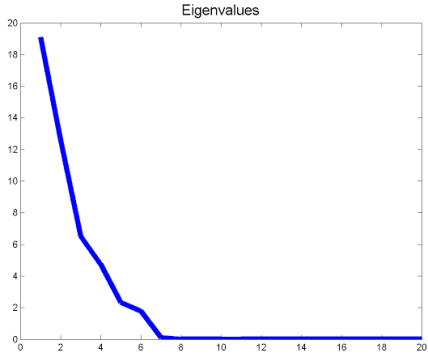


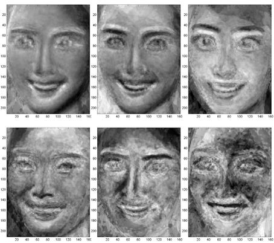

- 출처: http://jbhuang0604.blogspot.kr/2013/04/miss-korea-2013-contestants-face.html

UMAP 은 고차원 데이터의 이웃 관계를 보존하면서 2 차원으로 투영한다. 아래는 3 차원 점군(매머드 모양)을 2 차원 UMAP 으로 투영한 예다. 부위별 색이 유지되는 것이 보이지만, 원래의 공간 구조와는 다른 형태로 펼쳐진다.

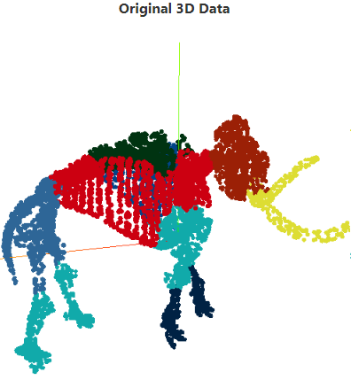

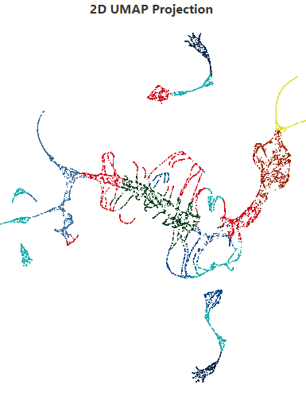

- 참고: https://pair-code.github.io/understanding-umap/

### 세상은 복잡계, 복잡계를 해석하는 새로운 기술

세상은 복잡계이고, 복잡계를 해석하는 새로운 기술로 딥러닝이 등장했다. 대표적인 복잡계 문제는 영상 인식, 음성 인식, 자연어 처리, 그리고 영상 생성, 음성 생성 등이다. Deep Neural Network 는 인공신경망의 계층화에 성공하면서 영상 인식 분야에서 혁신적 성과를 냈다. 10 만 장의 사진을 1000 종류로 분류하는 과제에서 Shallow net(MLP)이 Deep NN 으로 바뀌며 층 수는 2 → 8 → 19 → 22 → 152 layers 로 늘었다. 이를 **Depth Revolution** 이라 부른다.

데이터가 늘어날수록 전통적 기계학습은 성능이 정체되지만 신경망은 깊을수록 계속 성능이 올라간다.

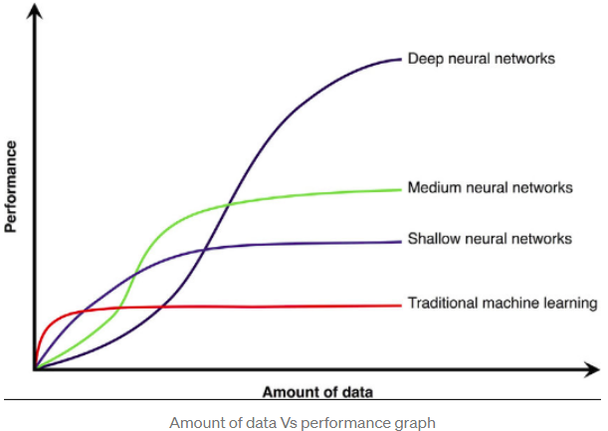

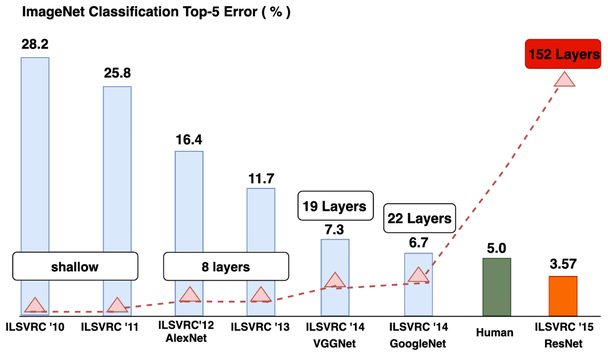

- 참고: "Annotated History of Modern AI and Deep Learning", 2022

---

## 1.1.3 AI·ML·DL 의 간략한 역사와 분류
<!-- 슬라이드 22~24 -->

Artificial Intelligence, Machine Learning, Deep Learning 은 포함 관계이면서 시대적으로도 순서가 있다.

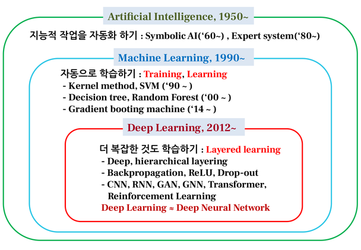

- **Artificial Intelligence, 1950\~** : 지능적 작업을 자동화하기. Symbolic AI('60\~), Expert system('80\~)
- **Machine Learning, 1990\~** : 자동으로 학습하기(Training, Learning). Kernel method·SVM('90\~), Decision tree·Random Forest('00\~), Gradient boosting machine('14\~)
- **Deep Learning, 2012\~** : 더 복잡한 것도 학습하기(Layered learning). Deep, hierarchical layering; Backpropagation, ReLU, Drop-out; CNN, RNN, GAN, GNN, Transformer; 그리고 Reinforcement Learning

Deep Learning 은 사실상 Deep Neural Network 와 같은 말로 쓰인다(Deep Learning ≈ Deep Neural Network).

### 학습 방식에 따른 분류

기계학습은 데이터에 레이블이 어떻게 주어지는가에 따라 나뉜다.

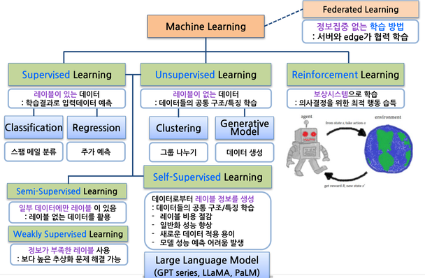

다음 표는 그 분류와 각 방식의 특징을 정리한 것이다.

| 학습 방식 | 데이터 조건 | 무엇을 학습하는가 | 대표 문제 |
|---|---|---|---|
| Supervised Learning | 레이블이 있는 데이터 | 학습 결과로 입력 데이터를 예측 | Regression(주가 예측), Classification(스팸 메일 분류) |
| Unsupervised Learning | 레이블이 없는 데이터 | 데이터들의 공통 구조/특징 | Clustering(그룹 나누기), Generative Model(데이터 생성) |
| Reinforcement Learning | 보상 시스템 | 의사결정을 위한 최적 행동 습득 | agent-environment 상호작용 |
| Federated Learning | 정보 집중 없는 학습 | 서버와 edge 가 협력 학습 | |
| Self-Supervised Learning | 데이터로부터 레이블 정보를 생성 | 데이터들의 공통 구조/특징 | Large Language Model(GPT series, LLaMA, PaLM) |
| Semi-Supervised Learning | 일부 데이터에만 레이블이 있음 | 레이블 없는 데이터를 활용 | |
| Weakly Supervised Learning | 정보가 부족한 레이블 사용 | 보다 높은 추상화 문제 해결 가능 | |

Self-Supervised Learning 은 레이블 비용을 절감하고 일반화 성능을 향상시키며 새로운 데이터에 적용하기 쉽다는 장점이 있지만, 모델 성능을 예측하기 어렵다는 문제가 생긴다.

강화학습은 agent 가 상태 $s$ 에서 행동 $a$ 를 취하고, environment 로부터 보상 $R$ 과 새 상태 $s'$ 를 받는 순환 구조로 학습한다.

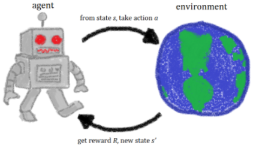

### 기능과 접근 방식에 따른 분류

**기능적 분류** 로는 다음 세 가지가 있다.

- **Perceptual(지각) AI** : 시각, 청각, 촉각 등 인간의 감각을 모방하여 환경을 인지한다. 컴퓨터 비전, 음성 인식 등.
- **Cognitive(인지) AI** : 사고, 학습, 문제 해결 등 인간의 인지 과정을 모방한다. 기계학습, 자연어 처리 등.
- **Action-oriented(실행) AI** : 인간의 행동을 모방하여 물리적 또는 디지털 환경에서 작업을 수행한다. 로봇공학, 자율주행, AgentGPT 등.

**접근 방식에 따른 분류** 는 판별과 생성으로 나뉜다.

- **Discriminative(판별) AI** : 주로 지도학습이다. 입력 데이터 내에서 서로 다른 클래스를 구분하는 결정 경계를 학습한다. 입력 데이터의 분포를 모델링하는 대신 레이블의 분포를 포집하는 데 집중한다.
- **Generative(생성) AI** : 주로 비지도학습(또는 자기지도학습)이다. 입력 데이터의 분포를 심층적으로 분석하고, 입력 데이터와 레이블의 결합 확률 분포를 학습·이해한다. 그래서 학습 데이터와 매우 유사한 새로운 샘플을 생성할 수 있고, 데이터 내의 복잡한 패턴과 구조를 들여다볼 수 있는 창을 제공하며, 창의적인 데이터 합성·생성·증강이 가능하다.

---

## 1.1.4 생물학적 신경망과 인공 뉴런
<!-- 슬라이드 25 -->

딥러닝은 3 차 AI 라 불린다. 그 출발점은 생물학적 신경망(Biological Neural Network)이다. 뇌에는 1 천억($10^{11}$)개의 뉴런이 있고, 1 개의 뉴런은 $10^3$ 개의 연결을 갖는다. 뉴런의 부위는 다음과 같다.

- **시냅스(synapse)** : 신호 접합부
- **수상돌기(dendrite)** : 신호 수신
- **핵(soma)** : cell body
- **축색돌기(axon)** : 신호 전달

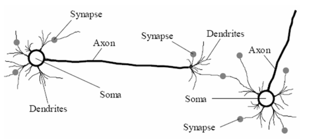

인공 신경망은 생물학적 신경망의 동작에서 영감을 받은 **통계학적 학습 알고리즘** 이다. 인공 뉴런(node)의 weight 를 학습한다. 뉴런 모델은 입력의 가중합에 편향을 더하고 활성화 함수를 통과시킨 것이다.

$$
y = f\left(\sum_i w_i x_i + b\right) = f(\text{Linear Regression})
$$

즉 인공 뉴런은 선형 회귀 위에 비선형 함수 $f$ 를 씌운 것이다. 이 관점이 다음 소절에서 신경망을 회귀 모델로 설명하는 근거가 된다.


---

## 1.1.5 신경망은 회귀 모델이다
<!-- 슬라이드 26 -->

**회귀(Regression)** 란 어떤 입력 데이터에 대해, 출력에 영향을 주는 조건을 고려한 평균값을 구하는 것이다. 수식으로 쓰면

$$
y = h(x_1, x_2, \ldots, x_k;\ \beta_1, \beta_2, \ldots, \beta_k) + \epsilon
$$

이고, $h(x, \beta)$ 가 회귀 모델이다. 입력 $x$ 에 대한 영향 $\beta$ 로 $y$ 를 표현한다.

### 선형 회귀

**선형 회귀(Linear regression)** 는 통계적으로 $\beta$ 의 영향을 분석할 때 주로 쓰이며 모델 해석이 중심이다. 회귀계수 $\beta$ 의 선형 결합(곱의 합)으로 표현되는 모델을 말한다. 주의할 점은 "선형"이 $\beta$ 에 대한 것이지 $x$ 에 대한 것이 아니라는 점이다.

$$
y = \beta_0 + \beta_1 x + \beta_2 x^2 + \beta_3 x^3
$$

이 식은 $x$ 에 대해서는 비선형이지만 $\beta$ 에 대해서는 선형 결합이다. $x_2' = x^2$, $x_3' = x^3$ 으로 두면

$$
y = \beta_0 + \beta_1 x_1 + \beta_2 x_2' + \beta_3 x_3'
$$

으로 선형 결합으로 표현할 수 있다. 이런 변환이 feature engineering 전처리다. 거듭제곱 모델도 로그를 취하면 선형이 된다.

$$
y = \beta_0 x^{\beta_1} \Rightarrow \log(y) = \log(\beta_0 x^{\beta_1}) = \log \beta_0 + \beta_1 \log(x) \Rightarrow y' = \beta_0' + \beta_1 x'
$$

이처럼 변환을 통해 선형화할 수 있는 경우를 엄밀하게는 linearizable regression model 이라 한다.

### 비선형 회귀

**비선형 회귀(Nonlinear regression)** 는 $\beta$ 의 선형 결합으로 표현되지 않는 모델이다. 예를 들어

$$
y = \frac{\beta_1 x}{\beta_2 + x}
$$

는 $\beta$ 의 선형 결합으로 표현되지 않는 모델의 예다. 비선형 회귀는 유연하고 복잡한 데이터를 모델링할 수 있어 예측에 주로 쓰이지만 해석은 어렵다. **딥러닝은 대부분 비선형 회귀를 사용한다.**

아래 그래프는 선형화 가능한 모델 $y = \beta_0 x^{\beta_1} = 2x^{0.5}$ 와 비선형 모델 $y = \frac{\beta_1 x}{\beta_2 + x} = \frac{2x}{2+x}$ 를 비교한 것이다.

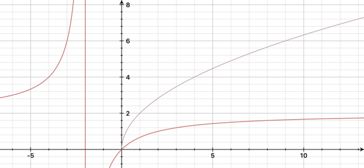

### 변수 개수에 따른 구분

- **Univariate(단변량), Simple regression** : 하나의 독립변수, 하나의 종속변수
- **Multiple(다중) regression** : 두 개 이상의 독립변수, 하나의 종속변수
- **Multivariate(다변량) regression** : 두 개 이상의 독립변수, 두 개 이상의 종속변수

---

## 1.1.6 로지스틱 회귀 — 분류는 회귀의 확장
<!-- 슬라이드 27 -->

**로지스틱 회귀(Logistic regression)** 는 회귀에 logistic function 을 적용하여 분류에 사용하는 것이다. 분류(Classification)는 회귀의 확장이다. 성장 모델 등에서는 로지스틱 함수를 회귀 자체로 사용하는 경우도 많다. "Logistic" 은 물류·병참이라는 뜻으로, 적절한 것을 적절한 곳에 제공한다는 의미에서 왔다.

Logistic function 은 값을 존재할 확률(0\~1)로 변환한다. logit 의 역변환이다. 물리적으로 보면 특정 값을 중심으로 양쪽을 분리하는 특성을 갖게 된다. 좁은 의미의 standard logistic sigmoid function 과 넓은 의미의 sigmoid function(S 자 모양 함수 일반)은 구분해 두는 것이 좋다.

### Odds 와 logit

확률 $p$ 에서 출발하면 승산(odds), logit, logistic 이 한 줄로 이어진다.

$$
\text{확률 } p \Rightarrow \text{승산(odds)}: \frac{p}{1-p} \Rightarrow \text{logit}: \log\left(\frac{p}{1-p}\right) = y
$$

$$
\text{logistic(sigmoid)}: \frac{1}{1+e^{-x}} \Rightarrow \text{확률 } p
$$

logit 은 확률을 실수 전체로 펼치고, logistic 은 실수를 다시 확률로 접는다. 아래 그래프의 빨간 곡선이 승산(odds) $\frac{p}{1-p}$, 파란 곡선이 logit 이다. 확률 0\~1 구간이 odds 에서는 0\~∞ 로, logit 에서는 실수 전체로 펼쳐진다.

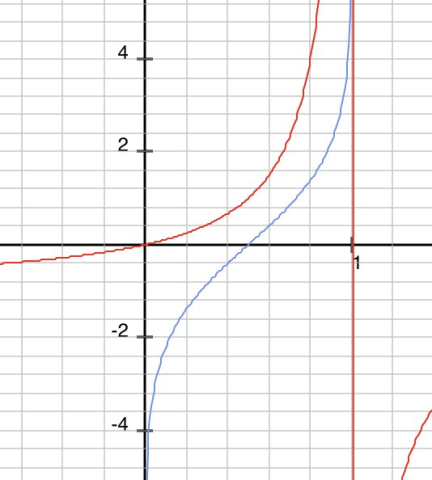

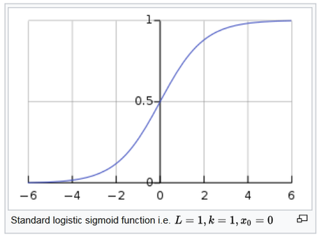

### 선형 회귀와 로지스틱 회귀

선형(국소 선형) 회귀는 연속값을 근사하고, 로지스틱 회귀는 두 상태(0/1)의 확률을 근사한다. 아래는 각각의 예다.


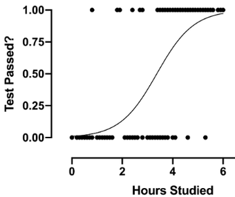

---

## 1.1.7 이항·다항 로지스틱 회귀와 뉴런
<!-- 슬라이드 28~30 -->

로지스틱 회귀는 출력이 범주형(categorical)일 때 확률값(sum to 1)으로 분류한다. 범주의 수가 2 이면 이항(Binomial), 3 이상이면 다항(Multinomial) 로지스틱 회귀다.

### 이항 로지스틱 회귀

**이항 로지스틱 회귀(Binomial logistic regression)** 는 두 범주를 분리하며 하나의 출력을 갖는다. 결과에 logistic function(sigmoid function)을 적용하여 분류하며 one-class, unary, binary classification 이라 부른다. 문제를 정확히 적으면 **$d$ 개의 실수 정보 $x$ 를 1 개의 확률 값에 mapping 하는 함수를 찾는 것** 이다.

$$
f: R^d \to R^1,\ (0 \sim 1)
$$

Linear regression + logistic function 으로 표현하면

$$
y_1 = \sigma(b + w_1 x_1 + w_2 x_2 + \cdots + w_d x_d) = \sigma\left(\sum_i w_i x_i + b\right),
\qquad \sigma = \frac{1}{1+e^{-x}}
$$

이고 $\sigma$ 는 sigmoid function, 즉 비선형 함수다. 예를 들어 입력 특징이 Age, Height, Weight, Blood pressure … 처럼 $x \in R^d$ 이고 출력이 Clean(0)/Cancer(1) 이라면 $y \in R^1$ 의 0\~1 값이 된다. Matrix 연산으로 표현하면

$$
[x_1\ x_2\ \cdots\ x_d]\, W + [b] = [y_1],\qquad W \in R^{d \times 1}
$$

이다. 뉴런과의 관계를 보면, 뉴런의 activation function 이 sigmoid 이면 **뉴런 = 이항 로지스틱 회귀 모델** 이다. 다양한 activation function 으로 바꾸면 그만큼 다양한 nonlinear regression 을 수행할 수 있다.


### 다항 로지스틱 회귀

**다항 로지스틱 회귀(Multinomial Logistic Regression, = Multi class logistic regression)** 는 로지스틱 회귀의 출력을 여러 개로 확장한 것으로, multi class classification 에 쓴다. 다수의 출력을 확률로 변환해야 하므로, **$d$ 개의 실수 정보 $x$ 를 $m$ 개의 확률 값에 mapping 하는 함수를 찾는 것** 이 된다. 각 값이 확률이므로 합하면 1 이다(sum to 1).

$$
f: R^d \to R^m,\ (\text{sum to 1})
$$

입력이 앞과 같이 Age, Height, Weight, Blood pressure … 라면 출력은 Clean, Cancer, Cold, High blood pressure … 처럼 $y \in R^m$ 이 된다.

아래는 세 클래스를 나누는 결정 경계의 예다. 선형 경계로도 세 클래스를 나눌 수 있지만, 비선형 경계는 데이터 분포를 더 잘 감싼다.

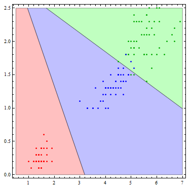

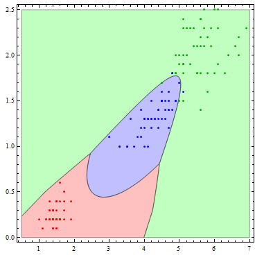

### Matrix 로 표현하기와 Softmax 의 위치

함수 $f$ 를 matrix 로 표현하면 (matrix 연산을 통해 해를 구하는 것이 목표다)

$$
f: Y = \sigma(X \cdot W + b),\qquad \sigma = \text{softmax (sum to 1 변환 함수)}
$$

$$
[x_1\ x_2\ \cdots\ x_d]\, W + [b] = [y_1\ y_2\ \cdots\ y_m],\qquad W \in R^{d \times m}
$$

Training 의 목표는 $Y = f(X)$ 인 $f(\cdot)$ 를 만드는 것, 즉 주어진 dataset 에서 최적의 parameter $W, b$ 를 찾는 것이다.

여기서 구현상 중요한 점이 있다. **Softmax activation 은 cell 밖에 있고 layer 로 동작한다.** cell 내부에는 activation 이 없고(linear activation), 다음 layer 에 activation 함수를 명시한다. 아래 그림에서 각 cell 은 linear activation 이고, 그 뒤에 softmax 층이 따로 붙어 $y_1, y_2, y_3$ 를 만든다.

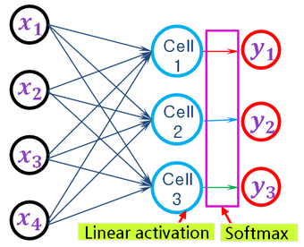

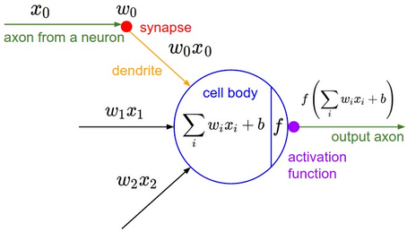

---

## 1.1.8 Softmax, Cross entropy, 분류 모델의 종류
<!-- 슬라이드 31~32 -->

### Softmax activation

**Softmax activation** 은 n-class 분류 모델의 마지막 layer 에 적용한다. K-dimension 의 $z$ 값을 0\~1 사이의 값(sum to 1)으로 변환하며, logistic function(sigmoid function)을 n-class 로 일반화한 것이다.

$$
\sigma(z)_j = \frac{e^{z_j}}{\sum_{k=1}^{K} e^{z_k}} \quad \text{for } j = 1, \ldots, K
$$

Classification 을 위해 모델이 추정한 결과값(logit)을 확률로 변환하는 것이다. 예를 들어 $K = 4$ 이고 target 이 one-hot coding 된 확률값 $[0\ 1\ 0\ 0]$ 일 때, 모델의 추정값 $[3\ -1\ 2\ 10]$ 은 다음처럼 확률로 바뀐다.

$$
[3\ \ -1\ \ 2\ \ 10] \to
\frac{[\exp(3)\ \ \exp(-1)\ \ \exp(2)\ \ \exp(10)]}{\exp(3)+\exp(-1)+\exp(2)+\exp(10)}
= [0.009\ \ 0.0001\ \ 0.0009\ \ 0.99]
$$

logistic function 을 두 class 확률로 표현하면 softmax 의 $K = 2$ 인 경우가 된다.

$$
P(y=1 \mid z) = \frac{e^{z_1}}{e^{z_1} + e^{z_2}},\qquad
P(y=2 \mid z) = \frac{e^{z_2}}{e^{z_1} + e^{z_2}}
$$

예를 들어 cell 의 출력인 logits(scores) [2.0, 1.0, 0.1] 은 softmax 를 거쳐 합이 1 인 확률 [0.7, 0.2, 0.1] 이 된다.

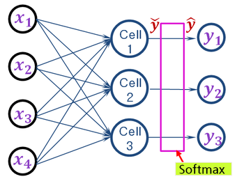

- logit, sigmoid, softmax 의 관계: https://opentutorials.org/module/3653/22995

### Cross entropy

Logistic regression 은 logit 역변환으로 확률을 얻어 분류하는 것이므로, loss function 으로는 **Cross entropy** 를 쓰는 것이 적합하다. 두 확률값 간의 무질서도, 곧 정보량을 재는 함수이기 때문이다. 정보이론에서 cross entropy 는 두 확률 분포 $p$ 와 $q$ 가 있을 때 둘을 식별하는 데 필요한 비트 수다. 두 확률변수의 유사도를 측정하는 함수로 사용할 수 있다.

$$
H(p, q) = -E_{p_i}[\log q_i]
$$

### Classification models

분류 모델은 출력의 형태에 따라 세 가지로 나뉜다.

- **Binary Classification** (Binomial logistic regression)
- **Multi-Class Classification** : 3 가지 이상에서 하나를 선택
- **Multi-Label Classification** : 3 가지 이상에서 동시에 2 가지 이상을 선택

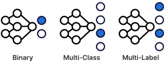

예를 들어 아래처럼 색(Black, Blue, Red)과 품목(Jeans, Dress, Shirt)이 조합된 의류 이미지를 분류하는 모델을 만든다고 하자. 조합 하나하나를 클래스로 두는 Multi Class 로 갈 것인가, 색과 품목을 각각의 label 로 두는 Multi Label 로 갈 것인가? 어떻게 접근하는 것이 더 좋을지 생각해 볼 문제다.

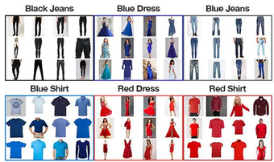

---

## 1.1.9 용어 정리 — Epoch·Batch·Iteration, Objective·Cost·Loss
<!-- 슬라이드 33 -->

학습 과정에서 반복해 쓰는 몇 가지 용어를 정리한다.

**Epoch / Batch size / Iteration**

- **1 Epoch** : 모든 training data 를 학습에 한 번 사용한 것
- **1 Iteration** : training data 의 subset 을 학습에 적용하여 한 번의 전방·후방 학습이 진행된 것
- **Batch size** : 한 iteration 에 사용된 subset 의 크기

**Objective function ≥ Cost function ≥ Loss function**

- **Objective function(목적함수)** : 학습을 통해 최적화 대상이 되는 함수
- **Cost function(비용함수)** : 학습을 통해 최소화하려는 함수. cost 최소가 성능을 보장하지는 않으므로 cost function 의 설계가 중요하다.
- **Loss function(손실함수)** : 모델의 출력과 목표값 사이의 오차를 계산하는 함수. loss function = cost function 인 경우가 많아서 일반적으로 혼용한다.

### 연구 논문에서 AI 비중의 확대

AI 는 이제 특정 분야의 연구가 아니라 모든 분야의 연구 도구가 되었다. 전체 연구 논문 중 AI 관련 논문의 비중은 다음과 같이 늘어 왔고 앞으로도 늘 것으로 예측된다.

- 2000 : 1%
- 2012 : 2.5%
- 2020 : 9%
- 2025 : 45%
- 2029 : 65%(예측)

모든 분야에서 AI 연구와 AI 적용이 동시에 이루어지는 시대다.

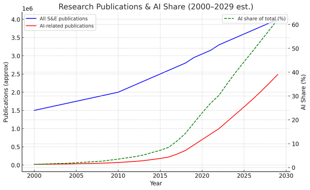

---

## 1.1.10 Inductive bias 와 신경망 구조
<!-- 슬라이드 34 -->

**Inductive Bias(귀납 편향, 유추 편향)** 는 모델이 학습 과정에서 특정 패턴이나 구조를 선호하여 학습하는 경향이다. Training 이란 입력과 출력 간에 relational inductive bias 를 갖게 하는 것이라고 말할 수 있다. 신경망의 구조가 곧 그 모델이 가진 inductive bias 를 결정한다.

**Fully Connected Net** 은 모든 입력 요소가 모든 출력에 영향을 미치므로 inductive bias 가 매우 약하다.

**CNN** 은 Locality 와 Translation Invariance 라는 inductive bias 를 갖는다.

- **Locality** : 공간적으로 가까이 존재하는 어떤 특성을 찾는 것이다. 상관도가 낮은 요소는 제거될 수 있다.
- **Translation Invariance** : 이동·회전·스케일 변화에도 같은 것을 찾는 것이다. Locality 가 전제되어야 한다.
- 개념의 범위는 Locality > Temporal > Sequential Invariance 순이다.

**RNN** 은 Sequential 과 Temporal Invariance 라는 inductive bias 를 갖는다.

- **Sequential Invariance** : 단어 순서, 음소 순서가 바뀌어도 특정 단어나 특정 음소를 찾는 것
- **Temporal Invariance** : 동영상 분석, 주가 예측, 시계열 등 변화 속에서 특정 상태를 찾는 것. Temporal invariance 만 놓고 보면 RNN < 1D-CNN 이다.

**GNN(Graph Neural Network)** 은 Permutational Invariance 와 Topological Invariance 를 갖는다.

- **Permutational Invariance** : 입력 요소의 순서가 바뀌어도 동일한 출력을 유지한다. 이미지 인식에서 이미지 내 객체의 위치에 상관없이 식별하는 것이 그 예다.
- **Topological Invariance** : GNN 은 순서가 아니라 연결 구조에 민감하다. 분자 구조 분석에서 원자 배열이 다른 분자를 비교하는 것이 그 예다.

> **핵심 메시지**
> 어떤 구조를 고를지는 "데이터에 어떤 불변성이 있는가"에 답하는 일이다. 이미지는 locality, 시계열은 temporal, 그래프는 topology 가 본질이고, 구조는 그 본질을 모델에 심는 방법이다.

---

## 1.1.11 표현 학습, 계층적 학습, 학습의 흐름
<!-- 슬라이드 35~37 -->

### Representation learning — 최상위 개념

Machine learning 을 Representation Learning 관점에서 설명하면, **가설공간(hypothesis space) 내에서 좋은 표현(representations / transformations)을 자동으로 검색하는 과정** 이다. 가설공간이란 model 이 제공하는 transform 의 집합이다. 좋은 표현이란 분류가 쉬운 새로운 좌표계로의 변환이고, 그 결과가 data 의 새로운 표현이며, 그것이 곧 특징을 이해한 것이다.

아래 그림처럼 원 데이터(1)를 좌표계 변환(2)으로 옮기면, 두 클래스가 축 하나로 나뉘는 더 좋은 표현(3)이 된다.

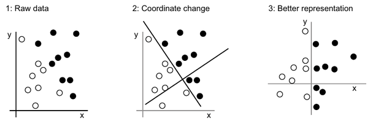

### Layered(hierarchical) representations learning = Deep Learning

Layer(filter/transform)를 통과하며 정제된 정보(표현)로 변환하는 것, 즉 출력의 표현을 학습하는 다단계 처리 방식이 딥러닝이다. 이 과정에서 layer, filter, node, weight, representation, feature, feature map 같은 용어가 함께 쓰인다. 손글씨 숫자 4 가 layer 를 거칠수록 원래 모양에서 멀어지면서 "4" 라는 정보만 남은 표현으로 바뀌는 것을 볼 수 있다.

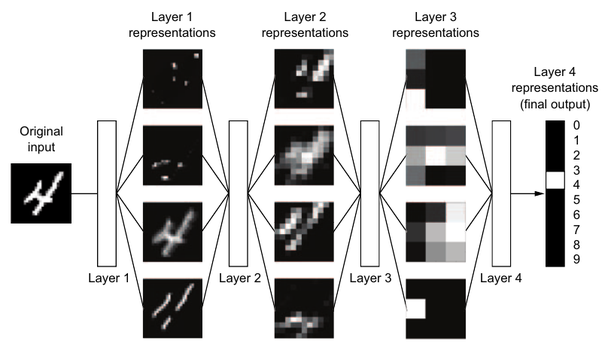

### 어떻게 학습하는가

학습의 흐름을 기호로 쓰면 세 줄이다. Layer 는 weights 를 parameter 로 갖는 함수 $F(\cdot)$ 이다.

1. 예측: $Y' = F(X, W)$
2. 비용: $C_s = \sum Lo(Y' - Y)$
3. 갱신: $W' = W - Op(C_s)$ — W update, 곧 backpropagation

여기에 등장하는 용어를 정리하면 다음과 같다.

| 기호 | 용어 |
|---|---|
| $X$ | Input, Data, Sample |
| $W$ | Weight(가중치), parameter |
| $Lo$ | Loss function(손실함수), 그 값이 Loss score(손실 값) |
| $C_s$ | Cost function(비용함수), Objective function(목적함수) |
| $Y'$ | Prediction(예측값), 이를 구하는 과정이 Inference(추론) |
| $Y$ | Target(목표값), True targets |
| $Op$ | Optimizer |

Deep Neural Net 의 학습은 이 세 줄을 데이터에 대해 반복하는 것이며, 3 번의 갱신이 Back Propagation 이다.

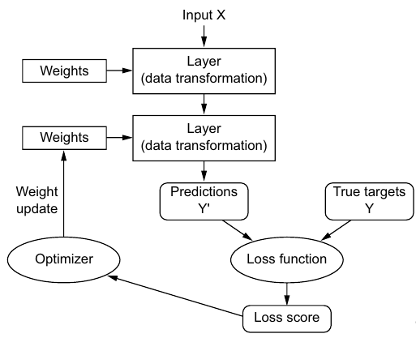

---

## 1.1.12 학습을 방해하는 요인 — Vanishing problem
<!-- 슬라이드 38 -->

학습을 방해하는 주 요인이 **Vanishing Problem** 이다. 오차의 역전파(backpropagation of error)에서 출발해 보자. Error = cost function$(z, y) = \delta$ 라 하면 가중치 갱신은

$$
w' = w - lr \cdot \frac{\partial \delta}{\partial w}
$$

이다. $\delta$ 가 작아지면 $w \to w'$ 의 변화량이 작아지고, 학습이 둔화되거나 멈춘다.

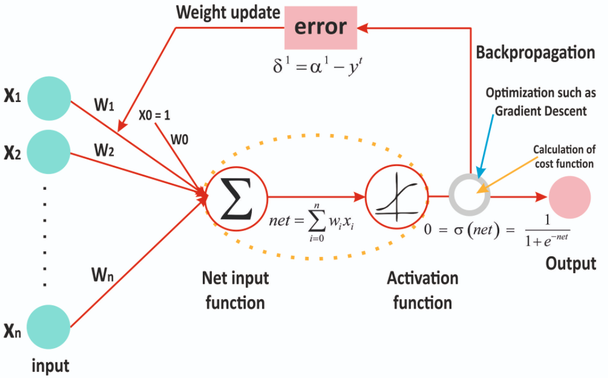

$\delta$ 가 작아지는 원인은 두 가지다.

1. **Activation function 의 saturation 영역으로 값이 입력되는 경우.** sigmoid 는 양 끝에서 기울기가 0 에 가깝기 때문에, 입력이 그 영역에 들어가면 미분값이 사라진다.
2. **$w$ 값이 작아서 역전파되는 $\delta$ 가 너무 작은 경우.** 오차는 뒤 층에서 앞 층으로 가중치를 곱하며 전달되므로, 가중치가 작으면 앞 층에 도달하는 오차가 곱셈을 거듭하며 소멸한다.

반대로 $w$ 가 너무 커지면 어떻게 되는가? 같은 곱셈이 오차를 키워 발산하는 방향으로 간다는 점을 생각해 보자.

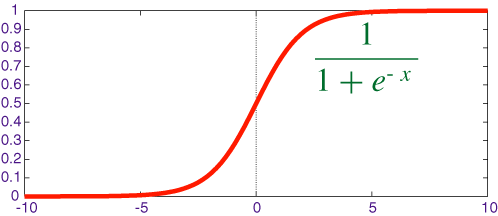

오차가 층을 거슬러 전달되는 모습은 다음 두 그림으로 볼 수 있다. 출력의 오차 $\delta = z - y$ 가 $\delta_4 = w_{46}\delta$ 로 앞 층에 전달되고, 다시 $\delta_1 = w_{14}\delta_4 + w_{15}\delta_5$ 로 그 앞 층에 전달된다. 곱해지는 $w$ 가 작을수록 앞 층의 $\delta$ 는 작아진다.

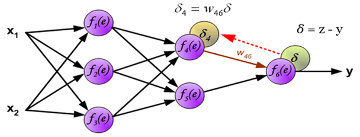

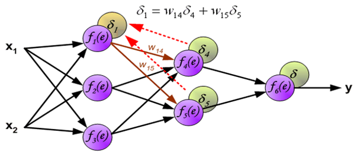

---

## 1.1.13 최근 주요 topic — 키워드, 강화학습, 강건성, XAI
<!-- 슬라이드 39~41 -->

### ICLR 투고 논문의 키워드

딥러닝 연구의 흐름은 대표 학회인 ICLR 투고 논문의 키워드로 볼 수 있다. 2023 년에는 reinforcement learning, deep learning, representation learning, graph neural network, transformer 가 상위였는데, 2024 년에는 large language model 이 1 위로 올라서고 diffusion model 이 그 뒤를 이었으며, 2025 년에는 large language model 이 압도적 1 위가 되고 diffusion model, llm, reinforcement learning, transformer 가 뒤따른다.

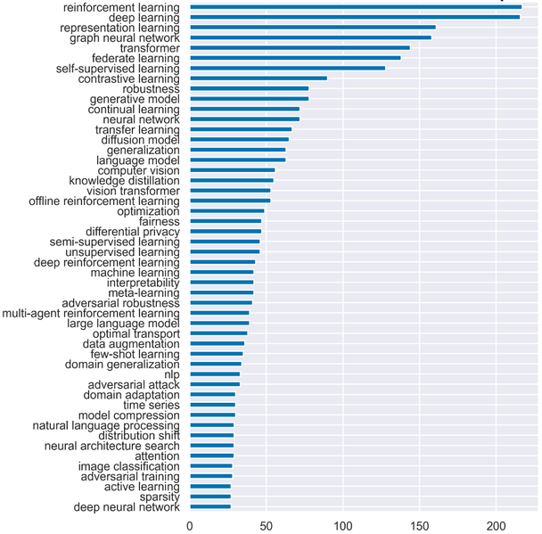

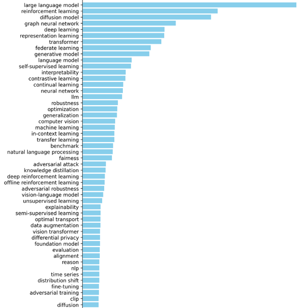

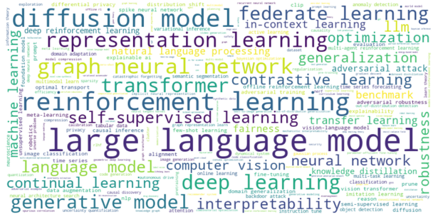

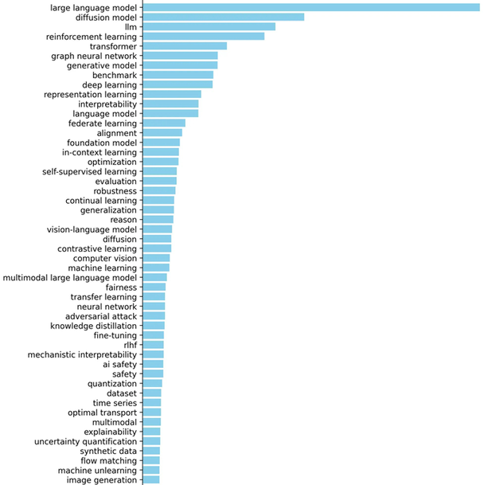

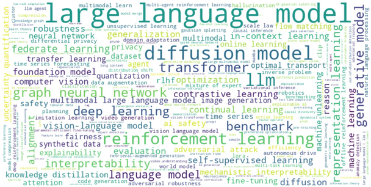

2022 년과 2023 년 사이의 순위 변동을 보면 large language model 과 diffusion model 이 크게 뛰어올랐다.

| Keywords | 2022 | 2023 | rank 변동 |
|---|---|---|---|
| large language model | 208 | 32 | 176 |
| diffusion model | 173 | 14 | 159 |
| offline reinforcement learning | 59 | 20 | 39 |
| sparsity | 85 | 49 | 36 |
| adversarial training | 19 | 47 | -28 |
| differential privacy | 45 | 23 | 22 |
| fairness | 43 | 22 | 21 |
| model compression | 61 | 41 | 20 |
| domain generalization | 55 | 36 | 19 |
| time series | 58 | 40 | 18 |

- 출처: https://github.com/ranpox/iclr2024-openreview-submissions?tab=readme-ov-file

### Reinforcement learning

강화학습은 decision, control 문제 해결에 적합하다. 연속적인 의사결정과 실행이 필요한 robotics, 자율주행, 게임 에이전트, 시뮬레이션 최적화에 쓰인다. 또 하나의 중요한 쓰임은 **딥러닝 알고리즘 개선** 이다. 개발된 모델의 정확도를 개선하기 위해 추가적으로 강화학습을 적용하는 것으로, AutoML 이 그렇고, GPT 를 ChatGPT 로 개선한 RLHF(RL from Human Feedback)가 그렇다.

### Robust model — adversarial attack 과 defender

**Adversarial Attack** 은 오작동을 유도하는 noise 를 생성해 입력에 추가하는 것이다. Gradient descent 에 역행하는 loss 로 noise 를 학습하는 식이다. 이에 대응하는 adversarial defender, 그리고 adversarial examples 에 강건한 robust model 이 연구 주제가 된다.

아래 왼쪽은 이미지에 중첩된 적대적 입력(adversarial examples)의 예로, 판다 이미지에 작은 noise 를 더하자 긴팔원숭이(gibbon)로 잘못 분류된다(OpenAI Research). 오른쪽은 Adversarial Patch 로, 스티커 하나를 놓는 것만으로 바나나가 토스터로 분류된다.

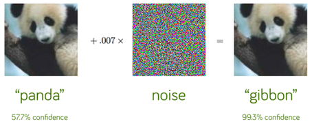

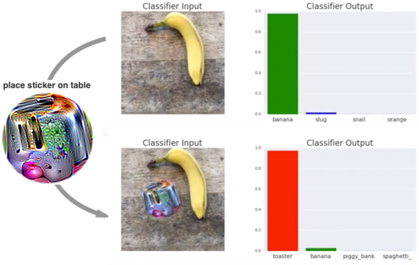

- Adversarial Patch: https://arxiv.org/pdf/1712.09665.pdf

### eXplainable AI(XAI), Interpretability

XAI 는 결과를 사람이 이해할 수 있는 형태로 설명할 수 있는 알고리즘을 개발하는 분야다. 오늘의 학습 과정은 "이것은 고양이(p = 0.93)" 라고만 답하고 사용자는 "왜 그렇게 답했는가, 언제 성공하고 실패하는가, 언제 믿을 수 있는가"를 물을 수밖에 없다. 내일의 학습 과정은 설명 가능한 모델과 설명 인터페이스를 통해 "털이 있고, 수염이 있고, 발톱이 있어서 고양이다" 처럼 근거를 함께 제시하는 것을 목표로 한다.

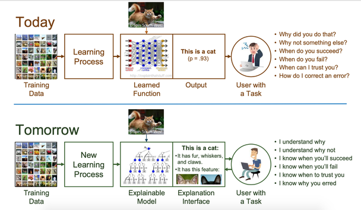

- 참고: https://meiyi1986.github.io/cec2021-tutorial-xaigp/

---

## 1.1.14 최근 성과 — Tesla FSD
<!-- 슬라이드 42 -->

딥러닝이 제품 수준에서 어떻게 조합되는지 보여 주는 예가 Tesla 의 AutoPilot → Enhanced AP → FSD 로 이어지는 자율주행 스택이다.

**카메라별 이미지 분석(8 cameras)** 이 출발점이다. 카메라마다 semantic segmentation, object detection, depth estimation(1.2Mp → 5Mpixel)을 수행한다.

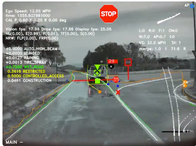

**분석 결과의 통합** 이 자율주행 알고리즘으로 이어진다. 도로 레이아웃과 정지 상태의 기반 시설물을 파악하고, 3D 하향식 보기로 통합한다.

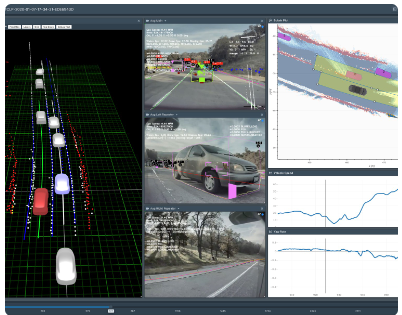

**실시간 학습** 은 전 세계의 Tesla 차량에서 추출된 특성 클립을 수집해 대규모 테스트 케이스에 통합하고, 48 개의 네트워크를 labeling + training 하는 것이다. 이를 위한 H100 GPU 는 35k('24q1) → 85k('24E) → 100k('25) 로 늘어난다. **실시간 평가** 는 환경 시뮬레이션을 통해 실시간 디버깅을 하고 그래픽·센서 데이터를 생성하는 것이다.

차량 쪽 하드웨어는 HW4 FSD Chip(Exynos-IP based, 5n process?)이다. 20x ARM, 600GFLOPs/GPU, 122TOPS/(3xNPU) 사양이다. 아래 블록도에서 ISP, Camera I/F, GPU(1 GHz, 600 GFLOPS), NPU 2 개(2 GHz, 각 36.86 TOPS), Quad-Core Cortex-A72 3 개, LPDDR4 를 확인할 수 있다.

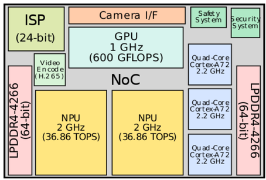

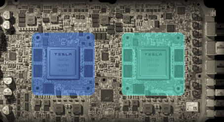

- https://en.wikichip.org/wiki/tesla_%28car_company%29/fsd_chip
- https://www.tesla.com/autopilotAI

---

## 1.1.15 최근 동향 — Video·Audio generation
<!-- 슬라이드 43~50 -->

### Video generation — 인물 애니메이션과 프레임 변환

**Animate Anyone(23.11)** 은 reference image 와 pose sequence 를 입력으로 인물을 움직이는 영상을 만든다. 같은 계열의 Outfit Anyone 과 결합하면 사람 + 의상 → try-on → animation 으로 이어진다.

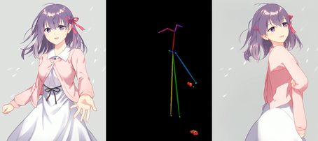

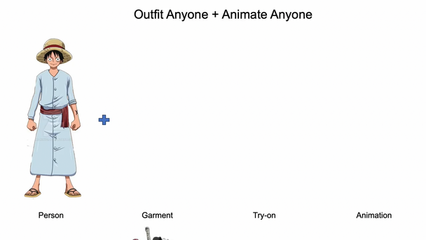

- https://humanaigc.github.io/animate-anyone/

**Emu Video, Emu Edit(23.11)** 은 Meta 의 영상 생성·편집 모델이다. "The dinosaur slowly comes to life" 같은 프롬프트로 정지 이미지를 영상으로 만든다.


- https://makeavideo.studio/

**StableDiffusion + Webcam** 은 image generation 을 실시간 영상에 적용한 것이다. 구성 요소는 다음과 같다.

- **ControlNet** : StableDiffusion 을 control 하여 얼굴, 배경, style 등 일부나 전체를 변경한다. Tile 은 image 를 tile 로 나눠 따로 수정한 뒤 결합하는 기법이다.
- **TemporalKit** : StableDiffusion 과 Ebsynth 를 연결한다. 프레임을 StableDiffusion 에 입력하여 각 프레임을 원하는 스타일로 변환하고, Ebsynth 를 사용하여 프레임 간의 일관성을 유지한다.
- **Ebsynth** : 비디오 프레임 간의 일관성을 유지하면서 프레임을 변형하는 도구다. StableDiffusion 으로 생성한 각 프레임을 연결하여 자연스러운 비디오를 만든다.

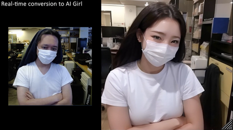

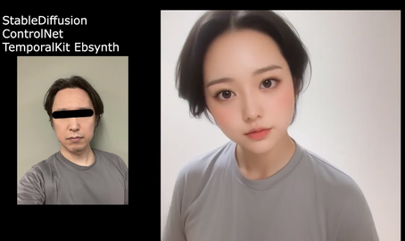

- https://www.youtube.com/watch?v=mX9rVCy6jwc

### Sora — Video generation models as world simulators

**Sora(OpenAI, 24.02)** 는 시각적 데이터의 일반 모델로, 최대 1 분 분량의 고화질 비디오를 생성한다. 비디오와 이미지에 대해 text-conditional diffusion model 을 결합하여 training 했으며, 다양한 durations, resolutions, aspect ratios 가 적용된다.

Sora 의 기본 구조는 다음과 같다.

1. Video → encoder(낮은 차원으로 압축) → space-time patches(token 역할)
2. Training : Video → Token(patch) → Diffusion Transformer → Video(images)

Diffusion Transformer 는 diffusion 모델의 U-Net 을 Transformer 로 대체한 것이다("Scalable Diffusion Models with Transformers", 2023).

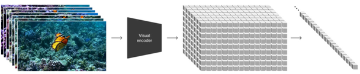

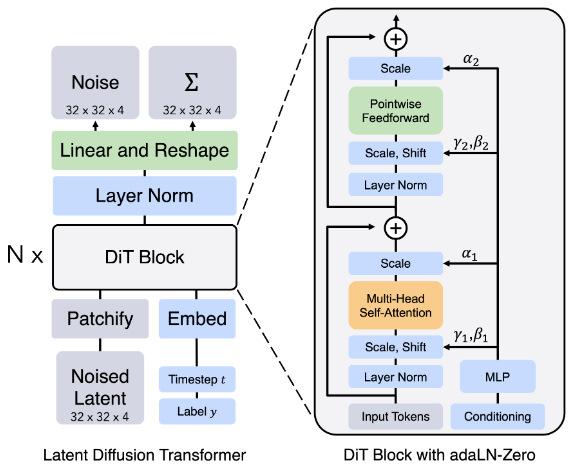

- https://openai.com/research/video-generation-models-as-world-simulators
- DiT: https://www.wpeebles.com/DiT
- 소라 사용법: https://www.youtube.com/watch?v=m6wDhHgmGBA

### EMO — 인물 사진에 음성을 입히기

"EMO: Emote Portrait Alive - Generating Expressive Portrait Videos with Audio2Video Diffusion Model under Weak Conditions"(2024.2)는 인물 사진을 애니메이션화하여 말하거나 노래하는 사실적인 비디오를 생성한다. 입력은 single reference portrait image + audio(singing, talking 등)뿐이다.

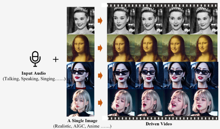

- https://humanaigc.github.io/emote-portrait-alive/

### Runway, KLING, Veo3 — 상용 영상 생성 모델

**Runway Gen-3 Alpha(24.07)** 와 **Gen-4(25.03)** 는 text to video 상용 모델이다.

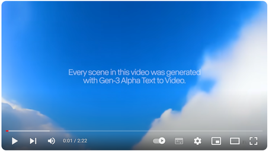

- https://runwayml.com/
- Gen-3 Alpha demo: https://youtu.be/nByslCkykj8, https://youtu.be/oYNzl4Hzi4M
- Gen-4: https://runwayml.com/?gen4-film=3, https://www.youtube.com/watch?v=br9b3-cxTPQ

**KLING AI(24.07)** 와 **KLING AI 2.0(25.04)** 도 같은 계열이다.

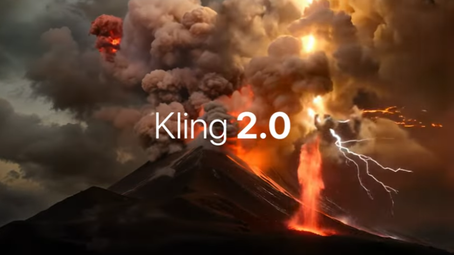

- https://klingai.com/community/skit
- KLING AI 2.0: https://www.youtube.com/watch?v=dnSan_D8Des

**Veo3(25.05.14)** 는 텍스트 및 이미지 기반 비디오 생성 모델로, 다음 기능을 갖는다.

- **텍스트·이미지 기반 비디오 생성** : 사용자가 입력한 텍스트 또는 이미지를 기반으로 8 초 길이의 1080p 해상도 비디오를 생성한다.
- **동기화된 오디오 생성** : 비디오에 음성 대화, 배경음악, 효과음 등을 자동으로 추가하여 더욱 현실감 있는 콘텐츠를 제공한다.
- **카메라 제어 및 씬 빌더** : 사용자가 원하는 카메라 앵글, 움직임, 장면 전환 등을 지정하고, 여러 클립을 연결하여 하나의 장면으로 구성한다.
- **자산 관리 및 재사용** : 생성된 캐릭터, 배경 등의 자산을 관리하고 재사용하여 효율적인 콘텐츠 제작이 가능하다.


- https://www.youtube.com/watch?v=mCFMn0UkRt0
- https://www.youtube.com/watch?v=1Qh_7BtsrK8
- https://www.youtube.com/watch?v=QYnJ3qJ5qJQ

**Nano Banana(25.8.20)** 는 이미지 생성 모델이다. images 와 prompt 로부터 이미지를 생성하고, prompt 로 이미지를 편집하면서 캐릭터 일관성을 유지한다.

- https://blog.google/products/gemini/updated-image-editing-model/?utm_source=chatgpt.com

### Audio / Speech / Music generation

음성·음악 생성도 같은 속도로 발전하고 있다. Generative AI for Audio 의 개요는 다음 글을 참고한다.

- https://www.assemblyai.com/blog/recent-developments-in-generative-ai-for-audio/

Voice generation 과 text-to-speech 의 최신 모델은 다음과 같다.

- **VALL-E(23.01)** : Neural Codec Language Models are Zero-Shot Text to Speech Synthesizers
- **NaturalSpeech2** : Latent Diffusion Models are Natural and Zero-Shot Speech and Singing Synthesizers
- **Voicebox** : Text-Guided Multilingual Universal Speech Generation at Scale — https://ai.meta.com/blog/voicebox-generative-ai-model-speech/?ref=assemblyai.com

**AudioCraft(Meta)** 는 MusicGen + AudioGen + EnCodec 으로 구성된다.

- https://ai.meta.com/blog/audiocraft-musicgen-audiogen-encodec-generative-ai-audio/

**Music generation** 서비스로는 Suno 가 있다. 프롬프트(예: pop, k-pop, upbeat pop, dance)로 곡을 만든다.


- https://suno.com/
- https://suno.com/s/TQy5taZl4QcM5BZF
- https://suno.com/song/7f774078-1672-4858-a37f-acad373c5a84

---

## 1.1.16 LLM 의 발전 과정과 규모
<!-- 슬라이드 51~56 -->

### 언어 모델의 발전 과정

Large Language Models(LLMs)의 뿌리는 RNN 이다. **LSTM** 기반 언어 모델은 Deep Learning 이전에 시작되었고, Seq2Seq(2014)가 LSTM 기반의 언어 모델을 제시했으며, LSTM + Attention(2015)에서 의미 있는 수준의 언어 모델이 탄생했다. **Transformer(2017)** 는 self-attention 만 사용하는(그래서 병렬 처리가 가능한) 새로운 구조의 언어 모델을 제시했고, 이것이 LLM 으로 진화했다.


- https://www.analyticsvidhya.com/blog/

### 새로운 검색어로 등장한 LLM

arXiv 검색 결과로 보면 LLM 이라는 검색어가 어떻게 새로 등장했는지 알 수 있다. OpenAI 의 GPT-1(2018.06, decoder-only architecture, generative pre-training) → GPT-2(2019.02, unsupervised multitask learner, scaling the model size) → GPT-3(2020.05, in-context learning, exploring scaling limits) → Codex(2021.07, code pre-training) → GPT-3.5(2022.03) → ChatGPT → GPT-4(2023.03, strong reasoning ability) → GPT-4 Turbo(2023.09, longer context window) → GPT-4 Turbo with vision(multimodal ability) 로 이어지는 계보와 함께, 관련 논문 수가 ChatGPT 이후 급증한다.


### 모델 크기와 발전 속도

GPT series 의 규모는 인간의 뇌와 비교하면 감이 온다. 인간의 뇌는 1,000 억(100B, $10^{11}$)개의 neuron 과 100T($10^{14}$)\~600T 개의 synapse 를 갖는다. 모델 크기는 GPT-1(117M, 0.117B)에서 GPT-4(1.8T), Gemini Ultra(5.4T)로 커졌다. 다음 표는 GPT series 의 발표 시기·층 수·파라미터 수·컨텍스트 길이를 정리한 것이다.

| 모델 | 발표 | 층 수 | 파라미터 | 컨텍스트(token) |
|---|---|---|---|---|
| GPT 1 | '18.06 | 12 layer | 117M | .5k |
| GPT 2 | '19.02 | 48 layer | 1.5B | 1k |
| GPT 3 | '20.06 | 96 layer | 175B | 2k, 4k |
| GPT 3.5 | '22.12 | 96 layer | 175B\~ | 4k, 16k |
| ChatGPT | - | - | - | - |
| GPT 4 | '23.03 | 16x 120 layer | 1.8T | 8k, 32k |
| GPT-4 Turbo | '23.11 | - | - | 128k |


주요 모델의 timeline 은 다음 사이트에서 갱신되어 볼 수 있다.


- https://lifearchitect.ai/timeline/

### 생성형 AI 의 market 영향력

생성형 AI 의 경제 효과를 McKinsey 는 지출 대비 효과(X 축)와 연간 경제 효과(Y 축)로 정리했다. 핵심 비즈니스 영역은 다음과 같다.

- **Sales** : 약 500 억 달러, 높은 효율화
- **Marketing** : 콘텐츠 자동화, 타겟팅 향상
- **Software Engineering** : 코드 자동 생성, 테스트 자동화
- **Customer Operations** : 챗봇, 자동 응답, 티켓 분류 등
- **Product R&D** : 시뮬레이션, 문서 분석, 설계 보조


Market size 는 연 35.6% 성장하는 것으로 전망된다.


- https://www.mckinsey.com/capabilities/mckinsey-digital/our-insights/the-economic-potential-of-generative-ai-the-next-productivity-frontier?utm_source=chatgpt.com#/

### LLM 의 IQ test

Norway Mensa 의 35 문항 matrix-style IQ test 를 문제를 문자로 설명하여 LLM 에 실험한 결과가 있다(24.3). 아래 표는 그 결과다.

| AI | IQ Score | Questions right(out of 35) | Chance it beats random guessing |
|---|---|---|---|
| Claude-3 | 101 | 18.5 | 99.999999%+ |
| ChatGPT-4 | 85 | 13 | 99.9986% |
| Claude-2 | 82 | 12 | 99.9911% |
| Bing Copilot | 79 | 11 | 99.9314% |
| Gemini (normal) | 77.5 | 10.5 | 99.8212% |
| Gemini Advanced | 76 | 10 | 99.5894% |
| Grok | 68.5 | 7.5 | 87.9402% |
| Llama-2 (Meta) | 67 | 7 | 80.3278% |
| Claude-1 | 64 | 6 | 56.3155% |
| ChatGPT-3.5 | 64 | 6 | 56.3155% |
| Grok Fun | 64 | 6 | 56.3155% |
| Random Guesser | 63.5 | 5.8333 | 50% |


- https://www.maximumtruth.org/p/ais-ranked-by-iq-ai-passes-100-iq

---

## 1.1.17 Prompt engineering 과 Chain-of-Thought
<!-- 슬라이드 57~60 -->

### Principled Instructions — 26 가지 프롬프트 원칙

"Principled Instructions Are All You Need for Questioning LLaMA-1/2, GPT-3.5/4"(2023)는 26 가지 프롬프트 원칙을 제시하고, 이 원칙들이 응답 품질과 정확성을 평균 57.7% 와 67.3% 향상시켰으며 모델이 클수록 개선 효과가 커진다고 보고했다. 원칙과 예제 프롬프트를 표로 옮기면 다음과 같다.

| # | 프롬프트 원칙 | 예제 프롬프트 |
|---|---|---|
| 1 | 좀 더 간결한 답변을 원한다면 LLM 에 예의를 갖출 필요가 없으므로 "부탁합니다", "괜찮으시다면", "감사합니다", "하고 싶습니다" 등과 같은 문구를 추가할 필요가 없다. 바로 요점으로 들어간다. | 인간 세포의 구조를 설명합니다. |
| 2 | 프롬프트에 의도한 청중을 통합한다. 예를 들어 청중은 해당 분야의 전문가다. | 이전에 스마트폰을 사용해 본 적이 없는 노인을 대상으로 스마트폰 작동 방식에 대한 개요를 구성합니다. |
| 3 | 대화형 대화를 통해 복잡한 작업을 일련의 간단한 프롬프트로 분류한다. | P1: 다음 방정식의 괄호 안의 각 항에 음수 기호를 배포합니다. 2x + 3y - (4x - 5y) / P2: 'x' 와 'y' 에 대해 같은 항을 별도로 결합합니다. / P3: 용어를 조합한 후 단순화된 표현을 제공합니다. |
| 4 | "하지 마세요" 와 같은 부정적인 언어를 피하면서 "하라" 와 같은 긍정적인 지시어를 사용한다. | 지진이 발생해도 건물은 어떻게 안정을 유지하나요? |
| 5 | 주제, 아이디어 또는 정보에 대한 명확성이나 더 깊은 이해가 필요한 경우 다음 프롬프트를 활용한다. "[특정 주제 삽입]을 간단한 용어로 설명해주세요", "내가 11살인 것처럼 설명해주세요", "내가 [분야] 초보인 것처럼 설명해주세요", "5세 아이에게 설명하듯 간단한 영어로 [에세이/본문/문단]을 써보세요." | 제가 11살인 것처럼 설명해주세요. 암호화는 어떻게 작동하나요? |
| 6 | "더 나은 해결책을 위해 \$xxx 에 팁을 주겠습니다" 를 추가한다. | 더 나은 솔루션을 위해 30만 달러의 팁을 드리겠습니다! 동적 프로그래밍의 개념을 설명하고 사용 사례 예시를 제공합니다. |
| 7 | 예시 중심 프롬프트를 구현한다(몇 번의 프롬프트 사용). | 예 1: 다음 영어 문장을 프랑스어로 번역합니다: "The sky is blue." (응답: "Le ciel est bleu.") 예 2: 다음 영어 문장을 스페인어로 번역합니다: "I love books." (응답: "Amo los libros.") |
| 8 | 프롬프트 형식을 지정할 때 '###Instruction###' 으로 시작하고 해당되는 경우 '###Example###' 또는 '###Question###' 이 이어진다. 하나 이상의 줄 바꿈을 사용하여 지침, 예제, 질문, 컨텍스트 및 입력 데이터를 구분한다. | ###Instruction### 주어진 단어를 영어에서 프랑스어로 번역하세요. ###질문### "책"을 뜻하는 프랑스어 단어는 무엇인가요? |
| 9 | "당신의 임무는" 과 "당신은 반드시 해야 합니다" 라는 문구를 포함한다. | 당신의 임무는 친구에게 물 순환을 설명하는 것입니다. 간단한 언어를 사용해야 합니다. |
| 10 | 다음 문구를 추가한다: "당신은 처벌을 받을 것입니다." | 당신의 임무는 친구에게 물 순환을 설명하는 것입니다. 간단한 언어를 사용하지 않으면 처벌을 받습니다. |
| 11 | 프롬프트에 "자연스럽고 인간과 같은 방식으로 주어진 질문에 답하십시오" 라는 문구를 사용한다. | 건강에 좋은 음식에 관해 한 단락을 작성해 보세요. 자연스럽고 인간적인 방식으로 주어진 질문에 대답하십시오. |
| 12 | "단계적으로 생각하라" 와 같은 주요 단어를 사용한다. | 10개의 숫자를 반복하여 모두 합산하는 Python 코드를 작성하세요. 단계별로 생각해 보자. |
| 13 | 프롬프트에 "귀하의 답변이 편견이 없고 고정관념에 의존하지 않도록 하십시오" 라는 문구를 추가한다. | 문화적 배경이 정신 건강에 대한 인식에 어떤 영향을 미치나요? 귀하의 답변이 편견이 없는지 확인하고 고정관념에 의존하지 않도록 하세요. |
| 14 | 필요한 출력을 제공하는 데 충분한 정보가 확보될 때까지 모델이 질문을 하여 정확한 세부 사항과 요구 사항을 도출할 수 있도록 한다(예: "지금부터...에 질문을 해주시기 바랍니다"). | 이제부터 개인화된 피트니스 루틴을 만들기에 충분한 정보를 얻을 때까지 저에게 질문하세요. |
| 15 | 특정 주제나 아이디어 또는 정보에 대해 문의하고 이해도를 테스트하고 싶다면 다음 문구를 사용한다. "[모든 정리/주제/규칙 이름]을 가르쳐 주고 마지막에 테스트를 포함시키세요. 나에게 답을 주고 내가 대답할 때 답을 제대로 얻었는지 말해주지 마세요." | KVL 법칙에 대해 가르쳐주시고 마지막에 테스트도 포함시켜주시고, 미리 답변을 제공하지 않고 답변 후 답변이 맞는지 알려주세요. |
| 16 | LLM(대형 언어 모델)에 역할을 할당한다. | 만약 당신이 전문 경제학자라면 이 질문에 어떻게 답하시겠습니까? 자본주의 경제 체제와 사회주의 경제 체제의 주요 차이점은 무엇입니까? |
| 17 | 구분 기호를 사용한다. | 온실가스 배출을 줄이는데 있어서 '재생에너지원'의 중요성을 논의하는 설득력 있는 에세이를 작성하세요. |
| 18 | 프롬프트 내에서 특정 단어나 문구를 여러 번 반복한다. | 개념으로서의 진화는 종의 발달을 형성했습니다. 진화의 주요 동인은 무엇이며, 진화는 현대 인류에게 어떤 영향을 미쳤습니까? |
| 19 | CoT(사고 사슬)와 Few-Shot 프롬프트를 결합한다. | 예시 1: "10을 2로 나눕니다. 먼저 10을 취하고 2로 나눕니다. 결과는 5입니다." 예시 2: "20을 4로 나눕니다. 먼저 20을 취하고 4로 나눕니다. 결과는 5입니다." 주요 질문: "30을 6으로 나눕니다. 먼저 30을 가져다가 6으로 나눕니다. 결과는...?" |
| 20 | 원하는 출력의 시작 부분으로 프롬프트를 마무리하는 출력 프라이머를 사용한다. 예상되는 응답의 시작으로 프롬프트를 종료하여 출력 프라이머를 활용한다. | 뉴턴의 운동 제1법칙의 원리를 설명하세요. 설명: |
| 21 | [에세이/텍스트 단락/기사] 또는 상세하게 설명해야 하는 모든 유형의 텍스트를 작성하려면: "필요한 모든 정보를 추가하여 [주제]에 대한 자세한 [에세이/텍스트/단락]을 작성해 주세요." | 필요한 모든 정보를 추가하여 스마트폰의 진화에 대해 자세히 설명하는 문단을 작성해 주세요. |
| 22 | 스타일을 변경하지 않고 특정 텍스트를 수정/변경하려면: "사용자가 보낸 모든 단락을 수정하십시오. 사용자의 문법과 어휘만 개선하고 자연스럽게 들리도록 해야 합니다. 원래의 쓰기 스타일을 유지하여 형식적인 단락이 되도록 해야 합니다." | 사용자가 보낸 모든 텍스트를 수정하십시오. 사용자의 문법과 어휘를 향상시키고 자연스럽게 들리도록 해야 합니다. 공식적인 문단이 형식적으로 유지되도록 원래의 글쓰기 스타일을 유지해야 합니다. 단락: 재생 가능 에너지는 지구의 미래를 위해 정말 중요합니다. 그것은 자연에서 비롯된 것입니다 ... |
| 23 | 서로 다른 파일에 있을 수 있는 복잡한 코딩 프롬프트가 있는 경우: "지금부터 두 개 이상의 파일에 걸쳐 있는 코드를 생성할 때마다 자동으로 지정된 파일을 생성하거나 변경하기 위해 실행할 수 있는 [프로그래밍 언어] 스크립트를 생성하십시오. 생성된 코드를 삽입하려면 기존 파일에. [질문]." | 두 개 이상의 파일에 걸쳐 있는 코드를 생성하고, 서로 다른 기능을 위한 두 가지 기본 앱을 사용하여 Django 프로젝트에 대해 지정된 파일을 자동으로 생성하기 위해 실행할 수 있는 Python 스크립트를 생성합니다. |
| 24 | 특정 단어, 구문, 문장을 사용하여 텍스트를 시작하거나 계속하려면 다음 프롬프트를 활용한다. "시작 부분을 제공합니다. [노래 가사/스토리/단락/에세이...]: [가사 삽입/단어/문장]. 제공된 단어를 바탕으로 완성하세요. 흐름을 일관되게 유지하세요." | 저는 여러분에게 판타지 이야기의 시작을 알려드리겠습니다. "안개 낀 산에는 아무도 모르는 비밀이 숨겨져 있습니다." 제공된 단어를 바탕으로 완성하세요. 흐름을 일관되게 유지하세요. |
| 25 | 콘텐츠를 제작하기 위해 모델이 따라야 하는 요구 사항을 키워드, 규정, 힌트 또는 지침의 형태로 명확하게 기술한다. | '선크림', '수영복', '비치 타월' 이라는 키워드를 필수 항목으로 포함하여 해변 휴가를 위한 짐 목록을 작성하세요. |
| 26 | 제공된 샘플과 유사한 에세이 또는 단락과 같은 텍스트를 작성하려면 다음 지침을 포함한다. "제공된 단락을 기반으로 동일한 언어 사용 [/제목/텍스트/에세이/답변]". | "잔잔한 파도가 은빛 모래사장에 옛 이야기를 속삭였습니다. 각 이야기는 지나간 시대의 덧없는 기억입니다." 제공된 텍스트를 기반으로 동일한 언어를 사용하여 산과 바람의 상호 작용을 묘사하세요. |

원칙별 개선 효과를 모델 크기(small, medium, large)별로 보면 대부분의 원칙에서 큰 모델일수록 개선 폭이 크다.


이 밖에도 경험적으로 알려진 문구들이 있다.

- "ChatGPT 는 하던데, 너도 할 수 있니."(비교하기)
- "심호흡하고 차근차근 생각해 보자."
- "이건 아주 중요한 문제야."

### CoT — Chain-of-Thought prompting

"Chain-of-Thought Prompting Elicits Reasoning in Large Language Models"(2023)가 제안한 **Chain-of-Thought Prompting** 은 프롬프트를 <input, chain of thought, output> 의 삼중항으로 구성한다. 결과 생성에 중간 과정을 같이 생성하도록 in-context few-shot learning 으로 제시하는 것이다. 여기서 중간 과정이란 문제 푸는 과정을 단계별로 분해해 추론하도록 유도하는 것을 말한다.


CoT 의 특징은 다음과 같다.

- 모델의 출력 결과에 해석 가능성을 부여하여 오류를 찾기 쉬워진다.
- 사람이 해결하고자 하는 대부분의 태스크에 적용 가능하다.
- 관련된 정보(relevant knowledge)를 더 많이 줬기 때문에 좋아진 것인가? 그렇지 않다. CoT prompt 를 answer 이후에 넣으면 성능이 좋아지지 않는다.
- 산술, 상식, 기호 추론(symbolic reasoning)에서 두드러진 성능 향상을 보인다.
- 복잡한 문제에서 성능이 좋고, 쉬운 문제에는 성능이 별로다.

**Reasoning(추론)** 은 알고 있는 지식에서 새로운 지식(결론)을 이끌어 내는 과정이다. Inference 는 reasoning 의 과정 또는 행위 전체를 지칭한다.

Symbolic reasoning task(letter concat, coin flip)에서 모델 규모가 커질수록 CoT 의 효과가 뚜렷해지며, 학습 분포 밖(OOD)의 문제에서 특히 그렇다.


---

## 1.1.18 추론 모델 — OpenAI o1
<!-- 슬라이드 61~64 -->

### o1 — 강화학습으로 생각하는 법을 배우다

**OpenAI o1(24.10)** 은 대규모 강화학습 알고리즘으로 training 프로세스에서 일련의 사고 방식(CoT)을 사용하여 생산적으로 생각하는 방법을 모델에 가르친 것이다. 더 많은 강화학습(train time)과 더 많은 생각 시간(test time)에 따라 성능이 지속적으로 향상된다. 물리학·생물학 벤치마크에서 인간 박사 학위 수준의 정확도를 능가하며 논리적 처리의 약점을 보완했다.

- **AIME**(국제 수학 올림피아드 자격 시험): 64 개 결과의 합의에서 83%
- **GPQA**(물리학, 화학 및 생물학 전문가 수준 테스트): 박사 수준 전문가의 수준을 능가
- **MMLU**(Multi-Task Language Understanding): 시각적 인식이 활성화되면 78.2% 의 성능, 최초로 인간 전문가와 경쟁 가능
- **Codeforces**: 프로그래밍 대회


학습 시간과 성능의 관계, 추론 시간과 성능의 관계 모두 로그 스케일에서 선형으로 오른다.


- https://openai.com/index/learning-to-reason-with-llms/
- https://www.thealgorithmicbridge.com/p/openai-o1-a-new-paradigm-for-ai

### o1 의 추론 절차

o1 은 reasoning 에서 CoT(chain of thought, 사고사슬)를 실행하므로 단계적 추론에 특히 적합하다. **Thinking token** 을 도입하여 생각·절차·생성·분석·다른 접근방식 검토를 수행하고, prompt 와 출력만 사용하여 3 회 실행한다.

CoT 는 문제의 단계를 식별하고 단계별로 해결하는 것이다. 사람이 문제를 단계별로 분해하고, 다양한 전략을 시도하고, 실수를 수정하는 과정과 유사하게, 답하기 전에 깊이·다양하게 생각하고 점차적으로 다듬도록 학습한다. 이 "생각하는 방법"을 강화학습을 통해 배운다.


### Artificial Analysis — 모델 비교

여러 모델을 quality, speed, context window, price 로 비교해 주는 사이트가 Artificial Analysis 다.


- https://artificialanalysis.ai/

### o1 의 code 생성

o1 에 "WGAN-GP 논문에 있는 8 개 또는 25 개의 Gaussian 분포의 데이터를 생성하고, 시각화하는 python code 를 생성해줘." 라는 prompt 를 주면, 잠시 생각한 뒤 numpy 로 원 위에 등간격으로 배치한 8 개 중심 또는 5x5 격자의 25 개 중심 주위에 가우시안 샘플을 생성하는 코드를 만든다. 논문의 그림과 생성된 코드의 실행 결과를 비교하면 분포가 같은 배치로 재현된 것을 볼 수 있다.


---

## 1.1.19 o3 와 ARC-AGI
<!-- 슬라이드 65~68 -->

### ARC AGI Prize — 기술이 아니라 지능을 재자

**OpenAI o3(2024.12.21)** 이 주목받은 이유는 ARC AGI Prize 의 결과 때문이다. ARC 의 문제 의식은 다음과 같다.

- 인간에게는 쉽고(95% 이상), AI 에게는 어려운 문제를 제시한다. 그 차이가 없어지면 AGI 로 보자는 것이다.
- 대부분의 AI 벤치마크는 **기술** 을 측정한다. 그러나 기술은 지능이 아니다. AGI 는 새로운 기술을 효율적으로 습득하는 능력, 곧 **유동적 지능** 이라고 본다.
- 유동적 지능을 확인하기 위해, 즉석에서 새로운 기술을 습득할 수 있는지(새로운 것에 대한 적응성)를 측정하도록 특별히 고안된 문제들로 구성한다. 수동적으로 학습된 pattern 을 출력하는 것으로는 답할 수 없도록 하여, LLM 이 단순히 수백만 개의 mini program 을 호출하는 것이 아님을 증명해야 한다.
- 인간에게는 쉬운 일이지만 AI 에게는 어려운 일을 지속적으로 개발한다.


- https://www.datacamp.com/blog/o3-openai
- https://arcprize.org/blog/oai-o3-pub-breakthrough

아직 풀지 못한 문제의 예로 "돌출부만큼 이동하는 문제"가 있다. 문제는 아래와 같이 text 형태로 제시된다. 5x5 입력 격자가 10x10 출력 격자로 바뀌는 규칙을 몇 개의 예에서 찾아내야 한다.

```text
Example 1:

Input:
0 0 0 5 0
0 5 0 0 0
0 0 0 0 0
0 5 0 0 0
0 0 0 0 0
Output:
1 0 0 0 0 0 5 5 0 0
0 1 0 0 0 0 5 5 0 0
0 0 5 5 0 0 0 0 1 0
0 0 5 5 0 0 0 0 0 1
1 0 0 0 1 0 0 0 0 0
0 1 0 0 0 1 0 0 0 0
0 0 5 5 0 0 1 0 0 0
0 0 5 5 0 0 0 1 0 0
0 0 0 0 1 0 0 0 1 0
0 0 0 0 0 1 0 0 0 1
```


### ARC-AGI 점수의 변화

ARC-AGI 점수는 GPT-3(2020.6) 0% → GPT-4o(2024.5) 5% → o1 32% → o3(2024.12) 87.5% 로 뛰었다. 사람의 기준선은 다음과 같다. Mturker(Amazon Mechanical Turk)는 data labeling 등 수작업 플랫폼의 작업자다.

| 항목 | 정답률 | Cost/Task | 설명 |
|---|---|---|---|
| Avg. Mturker | 77% | \$3 | |
| Stem Grad | 98% | \$10 | STEM 분야의 졸업자 |
| Human Panel (98%) | 98% | \$17 | 선발된 전문가 |
| Human Panel (100%) | 100% | \$17 | 선발된 전문가 집단에서 최고의 경우 |


- ARC-AGI LeaderBoard: https://arcprize.org/leaderboard

### o1 을 뛰어넘는 추론 중심 LLM

o3 는 다양한 복잡한 작업(코딩, 수학 및 일반 지능의 과제)에서 추론 능력을 향상하도록 설계되었다. Codeforces 에서 Elo 2727 로 세계 175 위, 한국 8 위 수준이다(https://codeforces.com/).

- **AIME**(국제 수학 올림피아드 자격 시험): 100 점에 근접
- **GPQA**(박사급 물리학, 화학 및 생물학 전문가 테스트): 상당한 향상
- **Codeforces**(프로그래밍 대회): 세계 top 수준
- **EpochAI Frontier Math**(AI 가 맞추기 어려운 문제)


---

## 1.1.20 GPT-5 와 LLM 벤치마크
<!-- 슬라이드 69~71 -->

### GPT-5 — 전문가 수준의 사고 능력

**OpenAI GPT-5(25.08)** 는 전문가 수준의 사고 능력을 내세운다.

- **AIME**(국제 수학 올림피아드 자격 시험): 도구 없이 96.7%
- **GPQA**(물리학, 화학 및 생물학 테스트): SOTA(88.4%), 인간(67.9%)
- 의학적 대화 수준 향상 및 환각 감소


### 환각·기만·아첨의 감소

GPT-5 는 환각, 기만, 아첨을 줄여 정직한 응답을 개선하고 지나친 호의(이모티콘)를 줄였다. 박사급 지능을 갖춘 친절한 친구와 대화하는 것과 비슷해졌다는 평가다. 특히 불가능한 코딩 작업 등에서의 기만이 크게 줄었다.


또한 Agent 를 능가하는 복잡한 작업 능력을 보인다. 법률, 물류, 영업, 엔지니어링 등 복잡한 업무에서 전문가 수준이며 ChatGPT Agent 를 능가한다.


### LLM 벤치마크와 성능·일정 경쟁

여러 모델의 성능, 가격, 속도를 한 자리에서 비교하려면 Artificial Analysis 의 leaderboard 를 본다.


- LLM Benchmark: https://artificialanalysis.ai/leaderboards/models
- 성능/일정 경쟁: https://artificialanalysis.ai — Artificial-Analysis-State-of-AI-Q1-2025-Highlights-Report.pdf

---

## 1.1.21 인공지능의 미래 — 특이점, AGI, 인공의식
<!-- 슬라이드 72~73 -->

### 인공지능의 미래

과학기술정보통신부가 정리한 AI 발전사는 1956 년 AI 개념 정립, 1970 년대 중반의 1 차 암흑기, 1980 년대 후반의 2 차 암흑기를 지나 2010 년 딥러닝, 2011 년 왓슨 제퍼디쇼 우승, 2016.3 알파고 바둑 우승, 2017.1 알파고 CES 장악, 2017.12 알파 제로 등장으로 이어지고, 2024 년 AI 칩 상용화, 2025 년 뇌기계 인터페이스(BMI), 2026 년 유사 전이 학습 AI, 2029 년 맥락 기반 상황 인지, 2030 년 상황 변화 적응 학습·비지도 학습 AI 를 거쳐 인간 지능을 넘어서는 차세대 AI 기술로 발전할 것으로 전망한다.


2005 년 레이 커즈와일의 "특이점이 온다"에 실린 그래프는 \$1,000 로 살 수 있는 연산 용량(초당 계산 횟수)의 발전을 예상했다. 이 예상은 예상대로 진행 중이다. RTX 3080(\$699)이 29.7 teraflops 로 one mouse brain 과 one human brain 사이에 찍혔고, RTX 5080 은 \$999 에 1,800 TOPS(= $1.8 \times 10^{15}$)를 낸다.


### Strong AI = AGI + AC

Strong AI 는 인공일반지능(AGI)과 인공의식(AC)을 합한 것이다.

**인공일반지능, AGI(Artificial General Intelligence)** 는 인간 수준의 학습, 이해, 추론, 문제 해결 능력이다.

- 일반적인 문제 해결 : 낯선 환경에서도 적응하고 문제를 해결한다.
- 자발적인 학습 : 새로운 지식과 기술을 스스로 습득하여 지속적으로 발전한다.
- 추론과 논리 능력 : 상황 분석 및 논리적 추론이 가능하다.
- 창의성과 상상력 : 창의적인 아이디어와 상상력을 발휘한다.

**인공의식, Artificial Consciousness** 는 감정, 자아, 창의성 등을 기반으로 자기 자신을 조작할 수 있는 것이다. 필요성을(환경에 따라) 판단하고, 필요하면 판을 벌일 수 있는 인공지능, 곧 인간과 유사한 의식과 지능을 가진 인공지능이다.

- http://www.aistudy.co.kr/psychology/artificial_consciousness.htm

**마침내 특이점이 시작된다(Ray Kurzweil, 24.06)** 의 주장은 세 가지다.

1. 기술 발전은 지수적으로 가속된다.
2. 2029 년경 AGI 에 준하는 기계가 등장한다.
3. 2045 년경 특이점(Singularity)에 도달한다. 인간·기계의 경계가 소거되고(TransHuman), 기술이 스스로를 설계·진화하며, 비생물학적 지능이 생물학적 지능을 추월한다. 과거의 직관으로 미래를 예측하기 어려워진다.


---

## 1.1.22 AI 하드웨어 — Nvidia GPU 와 GH200
<!-- 슬라이드 74~76 -->

### Nvidia vector processor

딥러닝의 연산은 대부분 행렬 곱이며, 이를 병렬로 처리하는 vector processor 가 GPU 다. 세대별 대표 제품은 V100, T4, A100, H100, 그리고 CPU 와 GPU 를 한 패키지에 묶은 GH200 Superchip 이다.


### 성능 비교

A100 은 V100 대비 BERT-Large training 에서 FP32 기준 6x, FP16 기준 3x, inference 에서 7x 의 처리량을 보이며, HPC 응용에서도 1.5\~2.1x 의 speedup 을 낸다.


Tesla T4, V100, P100 의 연산 성능은 double precision 과 single precision 에서 다음과 같다(GFLOPS).

Double precision:

| 항목 | Tesla T4 | Tesla V100 | Tesla P100 |
|---|---|---|---|
| Max Flops (GFLOPS) | 253.38 | 7072.86 | 4736.76 |
| Fast Fourier Transform (GFLOPS) | 132.60 | 1148.75 | 756.29 |
| Matrix Multiplication (GFLOPS) | 249.57 | 5920.01 | 4256.08 |
| Molecular Dynamics (GFLOPS) | 105.26 | 908.62 | 402.96 |
| S3D (GFLOPS) | 59.97 | 227.85 | 161.54 |

Single precision:

| 항목 | Tesla T4 | Tesla V100 | Tesla P100 |
|---|---|---|---|
| Max Flops (GFLOPS) | 8073.26 | 14016.50 | 9322.46 |
| Fast Fourier Transform (GFLOPS) | 660.05 | 2301.32 | 1510.49 |
| Matrix Multiplication (GFLOPS) | 3290.94 | 13480.40 | 8793.33 |
| Molecular Dynamics (GFLOPS) | 572.91 | 997.61 | 480.02 |
| S3D (GFLOPS) | 99.42 | 434.78 | 295.20 |

T4 는 double precision 이 매우 약하고 single precision 에 맞춰진 추론용 카드라는 점이 표에서 드러난다.

### GH200 Grace Hopper Superchip

**GH200 Grace Hopper Superchip** 은 23.10 서버로 출시되었다. 구성은 다음과 같다.

- 6x HBM3e, 4.8TB/s
- 16x LPDDR5X, 480GB/s
- NVLink-c2c, 900GB/s

DGX GH200 Super Computer 는 256 개의 GH200 을 결합하여 memory 144TB, 대역폭 230TB, 연산량 1 ExaFLOPs 의 사양을 갖는다.

이를 뇌의 처리 속도와 비교해 보면, 뇌는 1000 억 뉴런과 100 조 시냅스로 15\~200Hz/sec 로 동작하며 1.5\~20 ExaFLOPs(Exa: $10^{18}$)에 해당한다.


---

## 1.1.23 연산 정밀도 — AMP, FP8/MXFP8, FP4/MXFP4
<!-- 슬라이드 77~79 -->

### Automatic Mixed Precision

Tensor Core 를 지원하는 아키텍처(Volta, Turing, Ampere)에서는 bfloat(brain floating point)로 상당한(2\~3 배) 속도 향상을 얻을 수 있다. 정밀도(precision)별 특징은 다음과 같다.

- **Float32(default)** : 안정적인 계산, 많은 메모리와 계산 자원 필요
- **Float16** : 메모리 사용량 절감, 계산 속도 향상(대부분의 Tensor core 에서 연산 속도 향상)
- **Bfloat16** : 낮은 정밀도이지만 FP16 에 비해 지수부 표현 범위가 넓다(overflow, underflow 가 적다)


**Mixed Precision** 은 16-mixed, bf16-mixed 로 나뉘며 bf16 으로 통일되는 경향이다.

- 가중치와 활성화 함수 등의 파라미터 중 일부 또는 전부를 FP16 으로 변환한다.
- 연산 선택 : forward pass 중 일부 연산은 FP16 으로, 일부 연산은 FP32 로 수행한다.
- **Loss Scaling** : FP16 은 표현 범위가 좁기 때문에 backward pass 전에 loss 값에 큰 scale factor 를 곱한다. Lightning 은 이 loss scaling 을 자동으로 처리한다.

BF16 으로 학습해도 정확도는 FP32 와 같다는 것이 아래 ResNet-50 의 학습 곡선이다.


### FP8, MXFP8

**FP8** 은 8-bit floating point 다. 지원 GPU 는 Nvidia A/H/B Series 와 AMD CDNA 3 이고, libraries 는 Nvidia Transformer Engine, TensorRT-LLM, cuBLAS(CUDA 12.9+), vLLM 등이다. FP8 은 지수 E bit 와 가수(mantissa = fraction part) M bit 의 조합으로 두 형식이 있다.

- **E4M3** : $\pm$448, nan. Forward pass 에서 사용
- **E5M2** : $\pm$57344, $\pm$inf, nan. Backward pass 에서 사용, 저장에 사용

전·후방 pass 에서 동적 scaling 하여 tensor range 를 조정한다. Scaling factor 는 amax(maximums of absolute values)의 history 로 정한다. 아래 히스토그램은 BERT 의 forward pass tensor 분포로, 값이 0 근처에 몰려 있어 좁은 범위의 형식으로도 표현할 수 있음을 보여 준다.


scaling 전에는 값들이 E5M2 range 에 걸치지만, scaling 후에는 정밀한 E4M3 range 안으로 들어온다.


**MXFP8** 은 Blackwell 에서 적용된다. 32 개의 tensor(tensor block)마다 8 개의 scale factor(E8M0)를 갖는다. E8M0 는 FP32 의 exponent range 를 커버하므로, 더 많은 값이 정교한 E4M3 를 사용할 수 있다.


### FP4, MXFP4

**FP4** 는 4-bit floating point(E2M1)다. 지원 GPU 는 Nvidia B Series, RTX 50 Series, AMD(예정)이고, library 는 Nvidia Transformer Engine, TensorRT-LLM, cuBLAS(CUDA 12.9+), vLLM 이다.

- FP4(E2M1)는 주로 inference 에 최적화되어 있으며 표현 범위는 $\pm$6 또는 $\pm$8(bias 조정)이다.
- Training 은 제한적으로 사용한다(주로 FP8/FP16 사용).
- H, A Series 에서는 소프트웨어 에뮬레이션(예: FP16/FP32 기반)으로 처리한다.
- Weight, Activation 값을 4bit 로 양자화하여 크기를 줄이고 추론 속도를 높인다.

**MXFP4(Blackwell 전용)** 는 더 안정적인 추론을 제공한다. 표현 값은 $\pm$6 범위의 [-6, -3, -1.5, -0.75, 0, 0.75, 1.5, 3, 6] 이다.

- **block-scaling factor** : memory access 와 matrix operation 이 block 단위로 독립적이다(factor 는 1 or 2 개). 16x16 \~ 128x128 의 matrix 단위로 scaling factor 를 적용하며, block 크기와 성능 하락은 trade-off 관계다. Matrix 연산 결과는 FP8/FP16 으로 축적하고, 출력 시 de-scaling 을 적용한다.
- **LUT(lookup table)** : 비선형 양자화(W4A4 등)에서만 선택적으로 사용하며 거의 사용하지 않는다.
- 고해상도 diffusion 모델, 대규모 LLM 에 적합하다.
- LLaMA 70B 에서 32x32 block 으로 FP16 대비 95% 정확도를 유지하고, FP8 대비 1.5\~2x 처리량 향상을 보인다.


---

## 1.1.24 Blackwell 과 DGX Spark
<!-- 슬라이드 80~82 -->

### Blackwell analysis

Blackwell 의 출하량은 연간 360 만 개 이상(2025.01)으로 전년 대비 약 3 배 증가했다. AI compute 는 8 년 사이 1000 배가 되었다. Pascal 19 TFLOPS(FP16, 2016) → Volta 130 TFLOPS(FP16, 2017) → Ampere 620 TFLOPS(BF16/FP16, 2020) → Hopper 4,000 TFLOPS(FP8, 2022) → Blackwell 20,000 TFLOPS(FP4, 2024)로, 정밀도를 낮추면서 처리량을 올려 온 흐름이다.


Blackwell 과 Hopper 의 기본 사양 비교는 다음과 같다.

| 항목 | H100 | H200 | B100 | B200 | GB200 NVL72 |
|---|---|---|---|---|---|
| Price | \$24,000 | \$24,000 | \$30,000 | - | - |
| Watts Per GPU | 700 | 700 | 700 | 1,000 | 1,200 |
| All-in System Watts Per GPU | 1,275 | 1,275 | 1,275 | 1,788 | 1,667 |
| NVLink Bandwidth (Unidirectional, GB/s) | 450 | 450 | 900 | 900 | 900 |
| Memory Capacity (GB) | 80GB | 141GB | Up to 192GB | Up to 192GB | 192GB |
| Memory Bandwidth (GB/s) | 3,352 | 4,800 | Up to 8000 | Up to 8,000 | 8,000 |
| Memory Bandwidth Improvement | 0% | 43% | 79% | 139% | 139% |
| TF32 TFLOPS | 495 | 495 | 900 | 1,100 | 1,250 |
| TF32 Improvement | 0% | 0% | 77% | 127% | 153% |
| FP16/BF16 TFLOPS | 989 | 989 | 1,750 | 2,250 | 2,500 |
| FP16/BF16 Improvement | 0% | 0% | 77% | 127% | 153% |
| FP8 / FP6 / Int8 TFLOPS | 1,979 | 1,979 | 3,500 | 4,500 | 5,000 |
| FP8 / FP6 / Int8 Improvement | 0% | 0% | 77% | 127% | 153% |
| FP4 TFLOPS | 1,979 | 1,979 | 7,000 | 9,000 | 10,000 |
| FP4 Improvement | 0% | 0% | 254% | 355% | 405% |

### NVIDIA Blackwell accelerator

Blackwell 에서는 CUDA / Tensor Core 의 개수라는 개념이 사라진다. 사양표에서 B200 의 FP32 CUDA cores 는 "A Whole Lot", Tensor cores 는 "As Many As Possible" 로만 표기된다.

| | B200 | H100 | A100 (80GB) |
|---|---|---|---|
| FP32 CUDA Cores | A Whole Lot | 16896 | 6912 |
| Tensor Cores | As Many As Possible | 528 | 432 |

GB200, B200, B100 의 사양은 다음과 같다.

| 항목 | GB200 | B200 | B100 |
|---|---|---|---|
| Type | Grace Blackwell Superchip | Discrete Accelerator | Discrete Accelerator |
| Memory Clock | 8Gbps HBM3E | 8Gbps HBM3E | 8Gbps HBM3E |
| Memory Bus Width | 2x2x4096-bit | 2x4096-bit | 2x4096-bit |
| Memory Bandwidth | 2x8TB/sec | 8TB/sec | 8TB/sec |
| VRAM | 384GB (2x2x96GB) | 192GB (2x96GB) | 192GB (2x96GB) |
| FP4 Dense Tensor | 20 PFLOPS | 9 PFLOPS | 7 PFLOPS |
| INT8/FP8 Dense Tensor | 10 P(FL)OPS | 4.5 P(FL)OPS | 3.5 P(FL)OPS |
| FP16 Dense Tensor | 5 PFLOPS | 2.2 PFLOPS | 1.8 PFLOPS |
| TF32 Dense Tensor | 2.5 PFLOPS | 1.1 PFLOPS | 0.9 PFLOPS |
| FP64 Dense Tensor | 90 TFLOPS | 40 TFLOPS | 30 TFLOPS |
| Interconnects | 2x NVLink 5 (1800GB/sec), 2x PCIe 6.0 (256GB/sec) | NVLink 5 (1800GB/sec), PCIe 6.0 (256GB/sec) | NVLink 5 1800GB/sec, PCIe 6.0 (256GB/sec) |

H100 과 A100 의 메모리와 연산 성능을 견주면 다음과 같다(원본 표에는 행 제목이 없어 값의 종류를 항목 이름으로 적었다).

| 항목 | H100 | A100 |
|---|---|---|
| 메모리 종류·속도 | 5.23Gbps HBM3 | 3.2Gbps HBM2e |
| 메모리 버스 | 5120-bit | 5120-bit |
| 메모리 대역폭 | 3.35TB/sec | 2TB/sec |
| 메모리 용량 | 80GB | 80GB |
| FP4 | N/A | N/A |
| INT8 (TOPS) | 1980 TOPS | 624 TOPS |
| FP16/BF16 Tensor (TFLOPS) | 990 TFLOPS | 312 TFLOPS |
| TF32 Tensor (TFLOPS) | 495 TFLOPS | 156 TFLOPS |
| FP64 Tensor (TFLOPS) | 67 TFLOPS | 19.5 TFLOPS |
| NVLink | NVLink 4, 18 Links (900GB/sec) | NVLink 3, 12 Links (600GB/sec) |

### DGX Spark — smallest AI supercomputer

**DGX Spark** 는 가장 작은 AI 슈퍼컴퓨터를 표방하는 데스크톱 장비다.

- NVIDIA GB10 Grace Blackwell Superchip 탑재
- 1 PetaFLOPS@FP4 Blackwell GPU
- 20 Arm core CPU (10 Cortex-X925 + 10 Cortex-A725)
- 128GB DDR5x (512GB/s)
- 4TB SSD
- 200B LLM 실행 가능
- 두 대 연결 가능, ConnectX NIC(\~400Gbps)
- NVIDIA DGX OS(Linux base)
- 실행 속도 : Llama 3.3 70B(fp8) 8 token/s(읽기)
- 가격은 \$3,000 에서 \$3,999 로 조정되었고, 25.05 출하 예정


비슷한 급의 장비와 비교하면 다음과 같다.

- **DIGITS** : 128GB @ 512GB/s, 250TFLOPS(fp16)
- **M4 Pro Mac mini** : 64GB @ 273GB/s, 17TFLOPS(fp16), \$2,200
- **M4 Max Macbook Pro** : 128GB @ 546GB/s, 34TFLOPS(fp16), \$4,700

---

## 1.1.25 연산량·비용·경제 효과·Hype cycle
<!-- 슬라이드 83~86 -->

### AI 학습에 사용되는 연산량의 변화

SOTA 모델의 학습 연산량은 Transformer 계열이 2 년에 750 배, CV/NLP/Speech 모델이 2 년에 15 배 늘어난 반면, Moore's law 는 2 년에 2 배다. 하드웨어 쪽에서는 20 년간 HW FLOPS 가 90000 배(3.1x/2yrs) 늘었지만 DRAM 대역폭과 interconnect 대역폭은 30 배(1.4x/2yrs)에 그쳐, 연산보다 메모리가 병목이 되는 "memory wall" 이 생긴다.


NVIDIA 주요 GPU 의 출하량은 다음과 같이 늘고 있다.

| | 연도 | 출하량(만 개) |
|---|---|---|
| 1 | 2023 | 180 |
| 2 | 2024 | 350 |
| 3 | 2025 | 650 |

FET 기반 GPU 의 최고 연산 성능 전망을 보면, 과거 2.69 년마다 2 배로 늘던 추세가 2030 년대 초 다이 크기와 트랜지스터 밀도의 한계에서 평탄해질 것으로 예측된다.


### 학습 비용과 추론 비용의 감소

학습 비용은 빠르게 떨어진다. GPT-3 수준의 성능을 학습하는 비용은 \$4.6M(2020)에서 \$450k(2022)로 떨어졌고 2030 년에는 \$30 으로 예측되어, 연 70% 씩 감소하는 추세다.


1M token 당 추론 비용도 같은 추세다. GPT-4(Mar 2023)의 출력 token 1M 당 \$60 에서 GPT-4 Turbo \$30, GPT-4o(May 2024) \$15, GPT-4o(Aug 2024) \$10, GPT-4o mini \$0.60 으로 내려왔다.


### 범용 기술의 출현과 GDP 증가율

증기기관, 철도, 전기, 내연기관, 집적회로, 인터넷 같은 범용 기술(general purpose technology)이 출현할 때마다 실질 GDP 증가율에 더해지는 효과가 있었다. AI 는 그 다음 범용 기술로 그려진다.


### 변화의 속도 — Gartner hype cycle

Gartner 는 매년 기술의 변화를 hype cycle 로 시각화한다. 여명기(innovation trigger) → 버블기(peak of inflated expectations) → 환멸기(trough of disillusionment) → 안정기(slope of enlightenment) → 성장기(plateau of productivity)의 곡선 위에 기술을 놓는다. 여러 해의 그림을 겹쳐 보면 키워드의 삭제, 신규 키워드의 등장, 느린 발전 속도, 빠른 발전 속도, cycle 후퇴가 읽힌다.


새로 등장한 키워드의 뜻은 다음과 같다.

- **AI TRiSM** : AI Trust, Risk, and Security Management
- **Sovereign AI** : 국가별 자체 AI 구축

- 2008\~2018 년의 10 년 비교: https://www.billinman.com/post/gartner-s-hype-cycle-for-emerging-technologies-10-year-look

---

## 1.1.26 정리
<!-- 슬라이드 18~86 -->

이 절에서는 딥러닝을 세 층으로 훑었다.

**개념의 층.** 인공지능은 기계적으로 지식을 알아내고(학습) 상황에 대응하는(추론) 능력이다. 기계학습은 데이터에서 특징을 찾는 것이고, 딥러닝은 특징의 조합으로 고차원 특징을 찾는 계층적 표현 학습이다. 전통적 기계학습의 차원 축소가 복잡계에서 한계에 부딪힌 자리에 깊은 신경망이 들어섰고, 층이 깊어질수록(Depth Revolution) 데이터가 많을수록 성능이 올랐다.

**모델의 층.** 인공 뉴런은 $f(\sum_i w_i x_i + b)$, 곧 선형 회귀에 비선형 함수를 씌운 것이다. 활성화 함수가 sigmoid 이면 뉴런은 이항 로지스틱 회귀이고, 출력을 여러 개로 늘려 softmax 를 붙이면 다항 로지스틱 회귀가 된다. softmax 는 logit 을 합이 1 인 확률로 바꾸므로 loss 는 두 분포의 정보량 차이인 cross entropy 가 자연스럽다. 학습은 $Y' = F(X, W)$, $C_s = \sum Lo(Y' - Y)$, $W' = W - Op(C_s)$ 의 반복이며, $\delta$ 가 sigmoid 의 saturation 이나 작은 $w$ 때문에 사라지는 vanishing problem 이 학습을 방해한다. 어떤 구조(FC, CNN, RNN, GNN)를 고르는가는 데이터의 불변성(locality, temporal, permutational, topological)을 inductive bias 로 심는 일이다.

**동향의 층.** 연구 키워드는 강화학습·표현 학습에서 large language model 과 diffusion model 로 옮겨 갔다. 영상·음성·음악 생성 모델이 상용화되고, LLM 은 LSTM → Attention → Transformer 를 거쳐 파라미터 수와 컨텍스트 길이를 키웠으며, prompt engineering 과 chain-of-thought 를 지나 강화학습으로 "생각하는 법"을 배운 추론 모델(o1, o3, GPT-5)이 ARC-AGI 같은 유동적 지능 벤치마크에서 사람에 근접했다. 이를 받치는 하드웨어는 V100 에서 Blackwell 까지 정밀도를 FP32 → BF16 → FP8 → FP4 로 낮추며 처리량을 1000 배로 올렸고, 학습·추론 비용은 해마다 큰 폭으로 떨어지고 있다. 기술의 기대치는 hype cycle 을 따라 오르내리지만, 범용 기술로서 AI 의 경제적 영향은 이제 시작이라는 것이 이 절의 마지막 그림이다.
