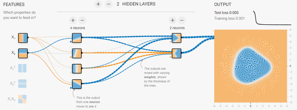
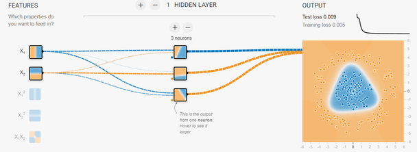
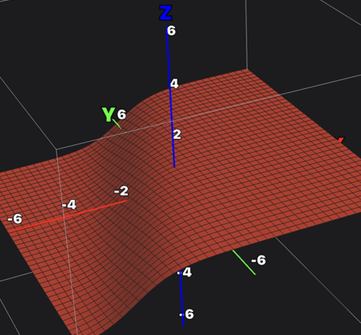
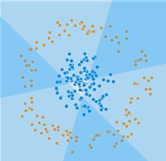
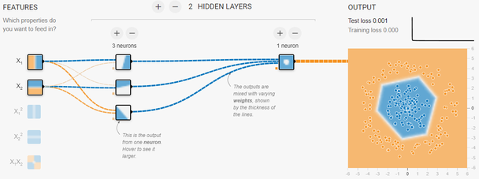
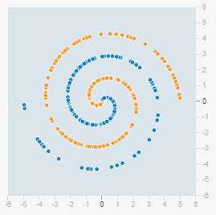
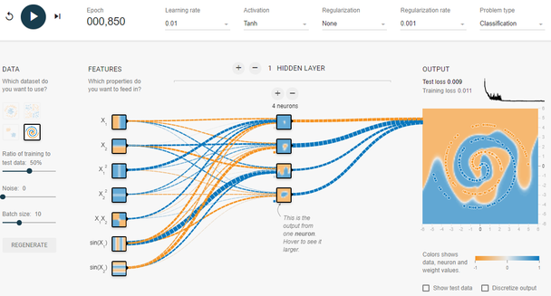
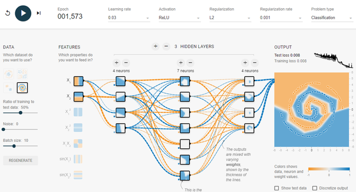

# 1.2 Neural Network Simulation

**학습 목표**

- TensorFlow Playground 화면에서 데이터·특징(feature)·은닉층·활성화 함수·학습률 같은 설정 요소를 찾고, 학습 과정을 step 단위로 관찰할 수 있다.
- 기본 설정(default value)으로 학습을 돌리고, 학습된 weight 와 bias 를 화면에서 읽어 낼 수 있다.
- 활성화 함수(Tanh, ReLU)에 따라 모델의 표현력과 출력 경계의 모양이 어떻게 달라지는지 설명할 수 있다.
- 이중나선 데이터셋을 feature engineering 으로 푸는 방법과 layer 를 추가해 푸는 방법을 비교하고, 필요한 layer·node 수를 실험으로 찾을 수 있다.

**이 절의 구성**

- 1.2.1 시뮬레이터 화면 익히기
- 1.2.2 기본 모델 학습시키기
- 1.2.3 Activation function 과 모델의 표현력
- 1.2.4 MLP 로 이중나선 Dataset 학습하기
- 1.2.5 정리

---

## 1.2.1 시뮬레이터 화면 익히기
<!-- 슬라이드 88 -->

신경망(Neural Network)의 학습 과정은 코드와 숫자만 보아서는 손에 잘 잡히지 않는다. 이 절에서는 브라우저에서 바로 동작하는 시뮬레이터 TensorFlow Playground 를 써서, weight 가 바뀌면서 결정 경계가 만들어지는 모습을 눈으로 보고, 앞으로 계속 쓰게 될 주요 용어(feature, hidden layer, activation function, learning rate, regularization, batch size, epoch, loss)를 화면 위의 실제 요소와 연결해 이해한다.

- 시뮬레이터 주소: https://playground.tensorflow.org/

화면은 크게 네 부분으로 나뉜다. 맨 위의 제어줄, 왼쪽의 DATA 패널, 가운데의 FEATURES 와 HIDDEN LAYERS, 오른쪽의 OUTPUT 이다.

각 요소가 하는 일을 정리하면 다음과 같다. 제어줄의 세 버튼(reset, train, step)과 DATA 패널의 세 항목(select, Pre-processing, Data regenerate)은 실습 내내 반복해서 누르게 되므로 먼저 익혀 둔다.

| 화면 요소 | 위치 | 하는 일 |
|---|---|---|
| reset | 제어줄 왼쪽 | weight 를 다시 초기화하고 Epoch 를 0 으로 되돌린다 |
| train | 제어줄 왼쪽 | 학습을 시작하거나 멈춘다. 실행 중에는 Epoch 가 계속 올라간다 |
| step | 제어줄 왼쪽 | 한 step 만 학습하고 멈춘다. 학습 초기의 변화를 천천히 볼 때 쓴다 |
| select | DATA 패널 | 학습에 쓸 데이터셋의 종류를 고른다 |
| Pre-processing | DATA 패널 | 학습/테스트 데이터 비율(Ratio of training to test data), Noise, Batch size 를 정한다 |
| Data regenerate | DATA 패널 | 같은 설정으로 데이터를 새로 생성한다(REGENERATE 버튼) |
| Learning rate, Activation, Regularization, Regularization rate, Problem type | 제어줄 | 학습률, 활성화 함수, 정규화 종류와 강도, 문제 유형(Classification 또는 Regression)을 고른다 |
| FEATURES | 가운데 왼쪽 | 입력으로 넣을 특징을 고른다. $X_1$, $X_2$ 외에 $X_1^2$, $X_2^2$, $X_1 X_2$, $\sin(X_1)$, $\sin(X_2)$ 처럼 미리 가공한 특징을 켤 수 있다 |
| HIDDEN LAYERS | 가운데 | 위쪽의 +, − 로 layer 수를, 각 layer 위의 +, − 로 그 layer 의 neuron 수를 바꾼다 |
| OUTPUT | 오른쪽 | Test loss 와 Training loss 값, loss 곡선, 그리고 모델이 현재 만들어 낸 결정 영역을 색으로 보여 준다 |

node 와 node 를 잇는 선이 weight 다. 선의 굵기는 weight 의 크기를, 색은 부호를 나타내며(오른쪽 아래 색 눈금에서 주황이 음수, 파랑이 양수), 학습이 진행되면 선의 굵기와 색이 실시간으로 바뀐다. 각 node 의 작은 사각형은 그 node 하나가 만들어 내는 출력을 보여 주고, 마우스를 올리면 크게 볼 수 있다. OUTPUT 의 큰 사각형은 이런 node 출력들이 weight 로 섞여 최종적으로 만들어 낸 결정 영역이다.

> **핵심 메시지**
> 시뮬레이터의 목적은 정확한 모델을 얻는 것이 아니라, 설정 하나를 바꿀 때 학습 과정과 결과가 어떻게 달라지는지를 관찰하는 것이다. 설정을 하나씩만 바꾸고, 바뀐 것이 무엇인지 매번 확인한다.

---

## 1.2.2 기본 모델 학습시키기
<!-- 슬라이드 89 -->

처음에는 아무것도 바꾸지 않은 기본값(default value) 그대로 학습을 돌려 본다. 기본값은 다음과 같다.

- Batch size 10, Noise 0, Dataset ratio(학습/테스트 비율) 50%
- Learning rate 0.03
- Activation function Tanh

데이터셋은 원형(circle) 데이터다. 가운데에 파란 점이 모여 있고, 그 바깥을 주황 점이 고리처럼 둘러싼다. 두 색을 나누는 경계를 신경망이 찾아내야 한다.

train 버튼을 누르면 Epoch 가 올라가면서 OUTPUT 의 색 영역이 바뀐다. 처음에는 파랑과 주황이 흐릿하게 섞여 있다가, 학습이 진행될수록 파란 점이 모인 가운데 영역이 파랗게, 바깥이 주황으로 또렷하게 갈라진다. 동시에 OUTPUT 위의 loss 곡선이 내려가고 Test loss, Training loss 값이 작아진다.

학습이 끝나면 weight 와 bias 를 확인한다. node 사이의 선 위에 마우스를 올리면 그 weight 의 값이 표시되고, 선의 굵기와 색이 값의 크기와 부호에 맞게 바뀌어 있는 것을 볼 수 있다. node 에 마우스를 올리면 그 node 의 출력 영역이 크게 보인다. 은닉층의 node 하나하나는 평면을 한 방향으로 가르는 단순한 영역만 만들지만, 이것들이 weight 로 섞이면서 원형 경계가 만들어진다.

이 상태에서 설정값을 하나씩 바꾸어 다시 학습시켜 보는 것이 이 절의 실습이다.

- Batch size 를 줄이거나 늘렸을 때 loss 곡선의 흔들림과 수렴 속도가 어떻게 달라지는가
- Noise 를 올렸을 때 Training loss 와 Test loss 의 차이가 어떻게 되는가
- Dataset ratio 를 바꾸면 학습에 쓰이는 점의 수가 어떻게 달라지는가
- Learning rate 를 올리거나 내렸을 때 수렴에 걸리는 Epoch 수는 어떻게 달라지는가
- Activation function 을 바꾸면 결정 영역의 모양이 어떻게 달라지는가

바꿀 때마다 reset 으로 weight 를 초기화하고, 같은 데이터로 비교하고 싶으면 REGENERATE 를 누르지 않는다.

---

## 1.2.3 Activation function 과 모델의 표현력
<!-- 슬라이드 90~91 -->

활성화 함수(activation function)는 각 node 가 입력의 가중합을 어떤 모양의 출력으로 바꿀지를 정한다. 같은 데이터, 같은 층 구조라도 활성화 함수가 다르면 모델이 그려 낼 수 있는 경계의 모양, 즉 모델의 표현력이 달라진다.

### Tanh 를 적용한 경우

은닉층을 하나만 두고 node 를 3개로 줄인 뒤 Tanh 로 학습시키면, 원형 데이터를 감싸는 출력 영역이 둥근 삼각형 모양이 된다. node 가 3개이므로 경계가 세 방향에서 만들어지고, 이 세 경계가 만나 삼각형이 된다.

첫 번째 node 에 마우스를 올려 weight 와 bias 를 읽으면, 이 node 의 출력은 다음 식이 된다.

$$
n1_{out} = \tanh(0.98 X_1 - 0.39 X_2 + 1.9)
$$

$0.98$ 과 $-0.39$ 는 입력 $X_1$, $X_2$ 에 곱해지는 weight 이고, $1.9$ 는 bias 다. 이 식을 $X_1$, $X_2$ 평면 위의 곡면으로 그리면 아래 그림처럼 한쪽은 높고 다른 쪽은 낮은, 부드러운 계단 모양의 면이 된다. $\tanh$ 는 가중합이 큰 쪽에서는 $1$ 에, 작은 쪽에서는 $-1$ 에 가까워지므로, node 하나는 평면을 한 직선을 기준으로 두 영역으로 부드럽게 나누는 역할만 한다.

여기서 "모델이 갖는 표현의 한계는 무엇인가"를 생각해 보아야 한다. node 하나가 만드는 경계는 직선 하나이므로, 은닉층 node 가 3개면 경계도 세 개뿐이다. 원처럼 둥근 경계를 정확히 그리려면 더 많은 node 가 필요하고, node 수가 곧 이 모델이 표현할 수 있는 경계의 복잡도를 정한다.

### ReLU 를 적용한 경우

같은 데이터에 ReLU 를 적용하면 출력 영역의 모양이 달라진다. Tanh 에서는 모서리가 둥글었지만, ReLU 에서는 출력이 4각형 또는 6각형처럼 직선 변과 뚜렷한 꼭짓점을 가진 다각형이 된다. ReLU 는 입력이 0 보다 작으면 0, 크면 그대로 통과시키는 꺾인 직선이므로, node 하나가 평면을 직선으로 접는 셈이고 이런 접힌 선들이 모여 다각형 경계를 이룬다.

다각형의 각(꼭짓점)의 수는 모델의 크기, 곧 node 수에 따라 늘어나고, 각이 많아질수록 모델의 표현력이 향상된다. 활성화 함수의 특성에 따라 이렇게 모델의 표현력이 달라질 뿐 아니라 학습 특성, 즉 수렴하는 속도와 경로도 크게 달라진다. 같은 구조로 Tanh 와 ReLU 를 번갈아 학습시켜 loss 곡선과 결정 영역을 비교해 보면 그 차이를 직접 확인할 수 있다.

> **핵심 메시지**
> 은닉층의 node 하나는 평면을 한 번 가르는 단순한 경계만 만든다. 활성화 함수는 그 경계가 부드러운 곡면(Tanh)인지 꺾인 직선(ReLU)인지를 정하고, node 수는 경계를 몇 개 겹칠 수 있는지를 정한다. 이 두 가지가 모델의 표현력을 결정한다.

---

## 1.2.4 MLP 로 이중나선 Dataset 학습하기
<!-- 슬라이드 92 -->

원형 데이터는 은닉층 하나로도 쉽게 풀렸다. 이번에는 가장 어려운 데이터셋인 이중나선(spiral) 데이터를 다층 퍼셉트론(MLP, Multi-Layer Perceptron)으로 학습시켜 본다. 파란 점과 주황 점이 서로 감긴 나선을 이루고 있어서, 직선 몇 개로는 나눌 수 없다.

두 가지 방법으로 접근한다.

**1) n(4,1) 모델에 lr 감소 + regenerate**

첫 번째 방법은 FEATURES 에서 $X_1^2$, $X_2^2$, $X_1 X_2$, $\sin(X_1)$, $\sin(X_2)$ 같은 가공된 특징을 모두 켜서 feature engineering 으로 푸는 것이다. 은닉층은 하나, node 는 4개(n(4,1))만 둔다. 이때 learning rate 를 기본값보다 낮추고, 잘 되지 않으면 REGENERATE 로 데이터를 다시 만들어 학습을 반복한다. 입력 특징이 이미 나선 모양을 표현하기 좋은 형태로 가공되어 있으므로 작은 모델로도 경계를 찾을 수 있다.

**2) Feature engineering 대체하기**

두 번째 방법은 입력을 $X_1$, $X_2$ 두 개만 쓰고, 대신 layer 를 추가해서 해결하는 것이다. 가공된 특징을 사람이 만들어 넣는 대신 은닉층이 스스로 그런 특징을 학습하게 하는 셈이다. 이때 던져야 할 질문은 "몇 개의 layer 와 node 가 있어야 하는가"이다.

실험해 보면 마지막 은닉층에 4개의 node 를 두었을 때 성공한다. 즉 말단에 4개가 필요하다. 그 앞의 layer 는 더 많은 node 로 넓게 두어 나선을 표현할 중간 특징을 만들게 한다. 함께 쓴 설정은 다음과 같다.

- Activation: ReLU
- Learning rate: 0.1 ~ 0.03
- Regularization: L2, rate 0.001

두 방법을 비교하면, 1) 은 사람이 특징을 설계해 작은 모델로 풀었고, 2) 는 원시 입력만 주고 깊은 모델이 특징을 학습하게 했다. 이후 장에서 다루는 CNN, RNN 같은 모델은 모두 2) 의 방향, 즉 feature engineering 을 모델 구조로 대체하는 쪽으로 발전한 것이다.

---

## 1.2.5 정리
<!-- 슬라이드 88~92 -->

- TensorFlow Playground(https://playground.tensorflow.org/)는 데이터·특징·은닉층·활성화 함수·학습률·정규화를 바꾸어 가며 신경망의 학습 과정을 눈으로 확인하는 시뮬레이터다. reset, train, step 과 DATA 패널의 select, Pre-processing, regenerate 가 기본 조작이다.
- 기본값(Batch size 10, Noise 0, Dataset ratio 50%, Learning rate 0.03, Tanh)으로 원형 데이터를 학습시키면 Test loss 가 0.003 까지 내려가며, 선의 굵기와 색으로 weight 를, node 위에서 출력과 bias 를 확인할 수 있다.
- 은닉층 node 하나는 평면을 한 번 가르는 경계만 만든다. Tanh 는 부드러운 경계(3 node 로 삼각형), ReLU 는 꺾인 직선 경계(4각형 또는 6각형)를 만들며, node 수가 늘수록 각이 늘어 표현력이 커진다. 활성화 함수에 따라 표현력과 학습 특성이 크게 달라진다.
- 이중나선 데이터는 가공 특징을 켜고 n(4,1) 로 풀 수도 있고, $X_1$, $X_2$ 만 쓰고 layer 를 추가해 풀 수도 있다. 후자는 마지막 은닉층 4 node, ReLU, lr 0.1 ~ 0.03, L2 0.001 로 성공하며, feature engineering 을 모델 구조로 대체하는 딥러닝의 기본 방향을 보여 준다.
