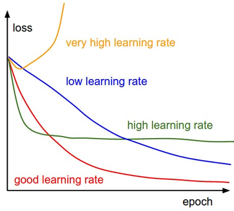
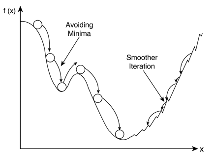
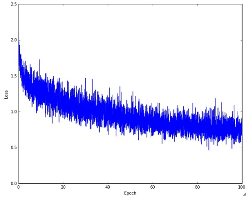
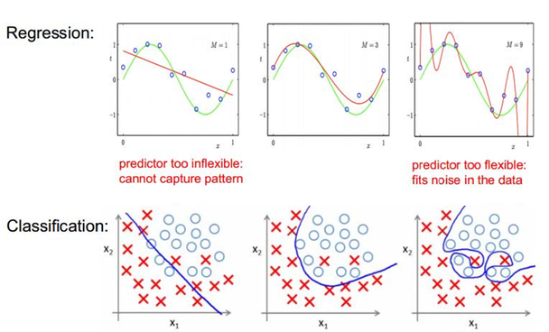
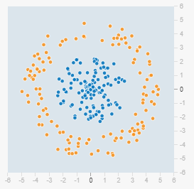
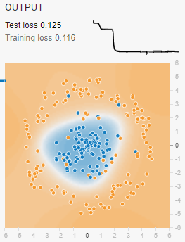
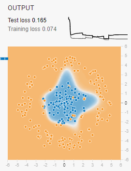
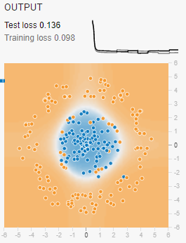

# 1.3 Optimization, Regularization, Learning rate

**학습 목표**

- SGD, Momentum, NAG, Adagrad, Adadelta/RMSprop 가 각각 앞 알고리즘의 무엇을 바꾸었는지 한 줄로 설명할 수 있다.
- 학습률이 학습 경로·속도·local minima 에 주는 영향을 loss 곡선의 모양으로 판단하고, batch size 와 함께 조절할 수 있다.
- overfitting 이 일어나는 과정을 training loss 와 validation loss 의 움직임으로 설명할 수 있다.
- L1 과 L2 regularization 이 weight 분포와 모델의 capacity 를 어떻게 다르게 제한하는지 구분하고, playground 실습으로 그 차이를 확인할 수 있다.

**이 절의 구성**

- 1.3.1 최적화 알고리즘
- 1.3.2 학습률과 batch size
- 1.3.3 Overfitting
- 1.3.4 Regularization — L1 과 L2
- 1.3.5 L1, L2 Regularization 실습
- 1.3.6 정리

---

## 1.3.1 최적화 알고리즘
<!-- 슬라이드 94 -->

신경망의 학습은 loss 가 줄어드는 방향으로 weight $W$ 를 조금씩 고쳐 나가는 과정이다. 이때 "어느 방향으로, 얼마나" 고칠지를 정하는 규칙이 최적화 알고리즘(optimization algorithm)이다. 학습이 잘 되도록 하려면 최적화 알고리즘, 학습률, 그리고 overfitting 을 막는 regularization 이라는 세 가지를 함께 고려해야 한다. 먼저 최적화 알고리즘부터 본다.

기본이 되는 것은 SGD 이고, 나머지는 SGD 의 약점을 하나씩 보완하며 나온 것들이다.

| 알고리즘 | 핵심 아이디어 |
|---|---|
| SGD(Stochastic Gradient Descent) | batch 단위로 기울기를 계산하여 $W$ 를 수정한다 |
| Momentum | 기울기에 속도(momentum) 개념을 추가한다 |
| NAG(Nesterov accelerated gradient) | momentum 을 먼저 적용해 이동한 뒤 그 자리에서 gradient 를 적용한다 |
| Adagrad | $W$ 의 변화량에 따라 가중치를 달리 준다. 변화량이 적었던 파라미터는 좀 더 크게 변화시킨다 |
| Adadelta, RMSprop | Adagrad 의 단점을 개선한다 |

각각을 조금 더 풀어 보면 다음과 같다.

- **SGD** 는 전체 데이터가 아니라 batch 하나의 기울기로 $W$ 를 수정한다. 계산이 가볍고 자주 갱신할 수 있지만, batch 마다 기울기가 달라 경로가 흔들리고, 기울기가 작은 평탄한 곳에서는 느리다.
- **Momentum** 은 기울기에 속도 개념을 넣어, 이전 step 의 이동 방향을 관성처럼 이어 간다. 같은 방향의 기울기가 이어지면 가속되고, 방향이 오락가락하는 성분은 상쇄되어 SGD 보다 빠르고 매끄럽게 움직인다.
- **NAG** 는 momentum 으로 먼저 이동해 본 다음, 그 위치에서 gradient 를 계산해 적용한다. 관성 때문에 지나치게 멀리 가는 것을 미리 보정하는 효과가 있다.
- **Adagrad** 는 파라미터마다 지금까지의 변화량을 따져, 많이 변한 파라미터는 작게, 변화량이 적었던 파라미터는 더 크게 움직이도록 가중치를 준다. 자주 갱신되지 않는 파라미터까지 골고루 학습된다.
- **Adadelta, RMSprop** 는 Adagrad 의 단점을 개선한 것이다. Adagrad 는 변화량을 계속 누적하므로 학습이 길어질수록 보폭이 점점 줄어드는데, 이를 최근 변화량 위주로 계산하도록 고쳐 보폭이 지나치게 작아지지 않게 한다.

이 알고리즘들이 같은 loss 곡면 위에서 어떻게 다르게 움직이는지는 아래 애니메이션으로 비교할 수 있다. 첫 그림은 3차원 곡면 위에서, 두 번째 그림은 안장(saddle) 모양 지점의 등고선 위에서 각 알고리즘이 그리는 경로다. SGD 는 안장 근처의 평탄한 곳에서 오래 머무르는 반면, 다른 알고리즘들은 서로 다른 속도와 경로로 빠져나간다.

- 애니메이션 출처: http://www.denizyuret.com/2015/03/alec-radfords-animations-for.html

---

## 1.3.2 학습률과 batch size
<!-- 슬라이드 95 -->

두 번째 고려사항은 학습률(learning rate)이다. 학습률은 한 번의 갱신에서 기울기 방향으로 얼마나 크게 움직일지를 정하는 값으로, 학습 속도와 성능에 큰 영향을 준다. 구체적으로는 학습 경로와, 어떤 local minima 에 빠지는지에 영향을 미친다.

학습률에 따라 loss 곡선의 모양이 어떻게 달라지는지는 아래 그림이 잘 보여 준다.

- 학습률이 너무 크면(very high) loss 가 줄기는커녕 발산한다.
- 너무 작으면(low) 방향은 맞지만 한 epoch 에 조금씩만 움직여 수렴까지 오래 걸린다.
- 크지만 발산하지는 않는 정도(high)면 초반에는 빨리 떨어지지만 minimum 근처에서 계속 튀어 더 내려가지 못한다.
- 적절한 학습률(good)은 빠르게 떨어진 뒤 낮은 값에서 안정된다.

- 그림 출처: http://cs231n.stanford.edu/

학습률은 local minima 와도 관계가 있다. 아래 그림에서 왼쪽의 큰 보폭은 작은 골짜기(local minima)를 뛰어넘어 지나가고(Avoiding Minima), 오른쪽의 작은 보폭은 골짜기 안을 잘게 오가며 매끄럽게 내려간다(Smoother Iteration). 큰 학습률은 얕은 local minima 에 갇히지 않는 대신 좋은 minimum 도 지나칠 수 있고, 작은 학습률은 안정적이지만 처음 만난 골짜기에서 멈추기 쉽다.

한편 loss 곡선에 noise 가 심하게 낀 경우가 있다. 아래 그림처럼 전체적으로는 내려가지만 매 step 의 loss 가 크게 요동치는 모양이다.

이런 모양의 원인은 batch size 가 학습률에 비해 상대적으로 부족한 것이다. batch 가 작으면 batch 마다 계산되는 기울기의 편차가 커지고, 그 편차가 학습률만큼 증폭되어 loss 가 흔들린다. 해결 방법은 두 가지다.

- **Batch size control**: batch size 를 키워 기울기의 편차를 줄인다.
- **Learning rate control**: 학습률을 낮추어 흔들림의 폭을 줄인다.

두 값은 서로 상대적이므로, 하나만 바꾸어도 곡선의 noise 가 줄어든다. 어느 쪽을 택할지는 메모리(batch size)와 학습 시간(학습률)의 여유에 따라 정한다.

---

## 1.3.3 Overfitting
<!-- 슬라이드 96 -->

세 번째 고려사항은 overfitting 을 해결하는 것이다. overfitting 은 모델이 training data 에만 최적화되는 문제다. 학습이 진행되면 training loss 는 지속적으로 감소하지만, validation loss 는 어느 시점부터 다시 증가한다. 모델이 데이터의 일반화된 특성을 학습하는 단계를 지나면, 그 다음부터는 training data 에만 있는 세부 특성과 noise 까지 외우면서 training data 에 특화되기 때문이다.

> **핵심 메시지**
> 모든 모델의 학습은 overfitting 을 향해 진행된다. loss 를 줄이는 것이 학습의 목적인 이상, 충분히 오래 학습하면 어떤 모델이든 결국 training data 에 특화된다. 그래서 overfitting 은 예외적인 사고가 아니라 항상 대비해야 하는 기본 현상이다.

모델의 복잡도와 overfitting 의 관계는 아래 그림으로 이해할 수 있다. 위 줄은 회귀(regression), 아래 줄은 분류(classification)이며, 왼쪽에서 오른쪽으로 갈수록 모델이 복잡해진다.

- 왼쪽(M=1, 직선 경계)은 모델이 너무 단순해서 패턴을 잡지 못한다(predictor too inflexible: cannot capture pattern). underfitting 이다.
- 가운데(M=3, 완만한 곡선)는 데이터의 큰 흐름을 잘 따라간다.
- 오른쪽(M=9, 구불구불한 경계)은 모델이 너무 유연해서 데이터의 noise 까지 맞춘다(predictor too flexible: fits noise in the data). overfitting 이다.

training loss 만 보면 오른쪽 모델이 가장 좋아 보이지만, 새 데이터에 대한 성능은 가운데 모델이 가장 좋다. overfitting 을 해결한다는 것은 모델을 오른쪽 상태로 가지 못하게 붙잡아 두는 것이고, 그 대표적인 수단이 다음 소절의 regularization 이다.

---

## 1.3.4 Regularization — L1 과 L2
<!-- 슬라이드 97 -->

Regularization(weight decay)은 weight 의 분포를 제어하여 모델의 복잡도를 통제하는 방법이다. 앞 소절의 그림에서 보았듯이 overfitting 은 모델이 지나치게 유연할 때 생기는데, 모델의 유연함은 weight 가 얼마나 크고 자유롭게 퍼져 있는가에서 나온다. 그래서 cost 에 weight 의 크기에 대한 벌점(penalty)을 더해, 학습이 loss 를 줄이면서 동시에 weight 를 작게 유지하도록 만든다. 어떤 norm 을 더하느냐에 따라 L1 과 L2 로 나뉜다.

**L1 Regularization(Lasso / L1 penalty)** 은 cost 값에 L1 norm(weight 절댓값의 합)을 더한다.

- weight 를 update 할 때 $W$ 에서 상수 값을 빼게 한다. 절댓값의 기울기는 부호만 남기 때문에, weight 가 크든 작든 매번 같은 크기만큼 0 쪽으로 끌려간다.
- 그래서 정규화 강도 $\lambda$ 가 커지면 weight 가 정확히 0 인 항이 많아진다.
- 결과적으로 소수의 node 가 출력을 책임지게 되어 모델의 capacity 가 제한된다.

**L2 Regularization(Ridge / L2 penalty)** 은 cost 값에 L2 norm(weight 제곱의 합)을 더한다.

- weight 를 update 할 때 $W$ 에서 일정 비율을 빼는 효과가 난다. 제곱의 기울기는 weight 에 비례하므로, 큰 weight 는 많이, 작은 weight 는 조금 줄어든다.
- 그래서 weight 가 작아지기는 해도 0 이 되지는 않는다.
- 결과적으로 다수의 node 가 일정 비율로 나누어 책임지게 되어 모델의 capacity 가 제한된다.
- 일반적으로 L2 가 다루기 쉽다.

두 방법의 차이를 나란히 놓으면 다음과 같다.

| | L1 Regularization | L2 Regularization |
|---|---|---|
| 다른 이름 | Lasso, L1 penalty | Ridge, L2 penalty |
| cost 에 더하는 것 | L1 norm | L2 norm |
| weight update 효과 | $W$ 에서 상수 값을 뺀다 | $W$ 에서 일정 비율을 뺀다 |
| $\lambda$ 를 키우면 | weight 가 0 인 항이 많아진다 | weight 가 작아지되 0 이 되지 않는다 |
| capacity 제한 방식 | 소수의 node 가 책임진다 | 다수의 node 가 일정 비율로 책임진다 |
| 다루기 | | 일반적으로 더 쉽다 |

> **핵심 메시지**
> L1 은 weight 를 "몇 개만 남기고 0 으로", L2 는 "모두 조금씩 작게" 만든다. 둘 다 모델의 capacity 를 제한해 overfitting 을 막지만, weight 분포의 모양이 달라진다. 이 차이는 다음 실습에서 weight 가 0 인 node 의 수로 직접 확인한다.

---

## 1.3.5 L1, L2 Regularization 실습
<!-- 슬라이드 98 -->

1.2 절에서 쓴 TensorFlow Playground(https://playground.tensorflow.org/)로 overfitting 을 일부러 만든 다음, L1 과 L2 regularization 을 걸어 weight 분포가 어떻게 달라지는지 확인한다.

**1단계 — Overfitting 만들기**

overfitting 을 관찰하려면 데이터에 noise 를 넣고, 그 noise 를 외울 만큼 유연한 모델로 오래 학습시키면 된다.

- 데이터: Data set C(원형 데이터), noise 25, batch size 10
- 모델: 입력 d(x1, x2), 은닉층 n(8, 1)(node 8개, layer 1개), 활성화 함수 af(tanh), 학습률 lr 0.1

학습을 돌린 뒤 다음을 확인한다.

- Overfitting 이 발생했는가: test loss 가 training loss 보다 얼마나 높은지, 그리고 OUTPUT 의 경계 모양이 매끈한 원인지 아니면 noise 점 하나하나를 감싸려고 울퉁불퉁해졌는지를 본다.
- weight 편차: node 사이 선의 굵기가 얼마나 들쭉날쭉한지 본다.
- regenerate 의 영향: REGENERATE 로 데이터를 다시 만들어 학습하면 결과가 얼마나 달라지는지 본다. noise 가 있으므로 데이터가 바뀔 때마다 경계가 크게 달라진다면 모델이 noise 를 외우고 있다는 뜻이다.

아래 세 그림은 같은 데이터에서 얻은 OUTPUT 의 예다. training loss 와 test loss 의 차이, 그리고 경계의 모양을 비교해 본다.

예 2 처럼 training loss 는 낮은데 test loss 가 높고 경계가 울퉁불퉁하면 overfitting 이다. 예 3 처럼 경계가 매끈한 원이면 모델이 noise 대신 데이터의 큰 구조를 배운 것이며, training loss 는 조금 높아도 test loss 와의 차이가 작다.

**2단계 — L1 Regularization**

제어줄의 Regularization 을 L1 로 바꾸고, Regularization rate 를 0.001, 0.003, 0.01, 0.03 으로 올려 가며 학습시킨다. 값마다 다음을 확인한다.

- Overfitting 이 남아 있는가(test loss 와 경계 모양)
- weight 편차가 어떻게 달라지는가
- weight 가 0 인 node 의 수가 어떻게 늘어나는가
- regularization 효과가 어느 값부터 보이고, 어느 값부터 지나쳐서 오히려 underfitting 이 되는가

**3단계 — L2 Regularization**

Regularization 을 L2 로 바꾸고 rate 를 0.003, 0.01, 0.03, 0.1 로 올려 가며 같은 항목을 확인한다. 특히 weight 가 0 인 node 의 수를 L1 의 경우와 비교한다. 앞 소절의 설명대로라면 L1 에서는 rate 를 올릴수록 0 인 weight 가 늘어나 소수의 node 만 남고, L2 에서는 weight 가 전반적으로 작아지되 0 이 되는 node 는 거의 없어야 한다.

---

## 1.3.6 정리
<!-- 슬라이드 94~98 -->

- 최적화를 위해 고려할 것은 세 가지다. 최적화 알고리즘, 학습률, 그리고 overfitting 대책이다.
- 최적화 알고리즘은 SGD 를 기본으로, Momentum(속도 개념), NAG(momentum 적용 후 gradient), Adagrad(변화량에 따른 가중치), Adadelta·RMSprop(Adagrad 단점 개선)로 발전했다. 같은 loss 곡면에서 이들의 경로는 크게 다르다.
- 학습률은 학습 경로와 local minima, 속도와 성능에 큰 영향을 준다. loss 곡선의 noise 가 심하면 batch size 가 학습률에 비해 부족한 것이므로 batch size 를 키우거나 학습률을 낮춘다.
- 모든 모델의 학습은 overfitting 을 향해 간다. training loss 는 계속 줄지만 validation loss 는 어느 시점부터 다시 늘어난다.
- Regularization(weight decay)은 weight 분포를 제어해 모델 복잡도를 통제한다. L1 은 상수 값을 빼서 weight 를 0 으로 만들어 소수의 node 가 책임지게 하고, L2 는 일정 비율을 빼서 weight 를 작게 유지하며 다수의 node 가 나누어 책임지게 한다. 일반적으로 L2 가 다루기 쉽다.
- playground 에서 noise 25, n(8,1), tanh, lr 0.1 로 overfitting 을 만든 뒤 L1(0.001 \~ 0.03)과 L2(0.003 \~ 0.1)를 걸어 보면, test loss·경계 모양·weight 편차·weight 가 0 인 node 수로 두 regularization 의 차이를 확인할 수 있다.
