# 2.1 Model 설계 workflow

**학습 목표**

- PyTorch 와 PyTorch Lightning 의 관계를 설명하고, Lightning 이 어떤 상용구를 추상화하는지 말할 수 있다.
- Dataset 준비 → Model 정의 → 학습 → 평가 → 적용의 5단계 workflow 로 첫 MNIST 모델을 만들고 학습할 수 있다.
- `nn.Module` / `nn.Sequential` / `nn.ModuleList` / `nn.ModuleDict` container 로 모듈을 조립하고 torchinfo·Netron 으로 구조를 확인할 수 있다.
- `training_step` / `validation_step` / `test_step` / `predict_step` / `configure_optimizers` 를 작성하고 학습 이력을 logging 할 수 있다.
- Loss·Metric 함수, Optimizer 와 learning rate scheduler, Trainer 의 flag 와 Callback(EarlyStopping, ModelCheckpoint, custom callback) 을 사용하고 모델을 저장·복원할 수 있다.

**이 절의 구성**

- 2.1.1 PyTorch 와 PyTorch Lightning
- 2.1.2 Model 설계 workflow 의 다섯 단계
- 2.1.3 첫 모델 만들기 (실습 2.1.1)
- 2.1.4 Module 정의 — 네 가지 container 와 모델 시각화
- 2.1.5 Module 내부 method — 학습·검증·시험·예측 loop
- 2.1.6 DataModule 로 데이터 다루기 (실습 2.1.2)
- 2.1.7 Loss 함수와 Metric 함수
- 2.1.8 configure_optimizers — Optimizer 와 learning rate scheduling
- 2.1.9 Trainer class — 실행 관리, TensorBoard, Callback
- 2.1.10 Model 저장과 복원
- 2.1.11 정리 — LightningModule 과 Trainer

---

## 2.1.1 PyTorch 와 PyTorch Lightning
<!-- 슬라이드 106~108 -->

PyTorch 는 딥러닝에 최적화된 Python 기반 텐서 라이브러리다. Meta(Facebook) 가 개발을 주도하며, 빠른 실험과 유연한 모델 구조를 가능하게 하는 것이 설계 목표다. 특징을 한 줄로 요약하면 **NumPy + AutoGrad + Function** 이다. NumPy 처럼 다루는 텐서 위에 자동 미분(AutoGrad) 이 붙어 있고, 딥러닝을 지원하는 다양한 함수와 모델이 라이브러리로 제공된다.

가장 중요한 특징은 **동적 그래프(dynamic graph)** 다. 정적 그래프(static graph) 방식은 계산 그래프를 먼저 정의해 두고 나서 실행하지만, PyTorch 는 코드가 실행되는 순서대로 그래프가 만들어진다. 그래서 새로운 모델을 개발할 때 일반 Python 코드처럼 중간 값을 찍어 보며 디버깅하기가 쉽다. AutoGrad API 는 임의로 표현된 연산의 기울기(gradient) 를 계산해 주므로 사용자는 forward 연산만 쓰면 된다.

단점도 같은 곳에서 나온다. 동적 그래프는 실행 시점에 그래프를 만들기 때문에 모델의 학습·실행 속도가 정적 그래프에 비해 느리다. Model export 지원이 부족하여 다양한 하드웨어에서 실행하기 어렵고, Cloud·MLOps·multi-GPU 환경에서는 TensorFlow 에 비해 열세라는 평가를 받아 왔다.

**PyTorch Lightning** 은 PyTorch 위에 얹는 high-level API 다. 학습 loop 를 구조화·추상화하여 효율적이고 정돈된 코드 스타일을 가능하게 하고, GPU·TPU·16 bit 연산·분산학습 같은 실행 환경 지원을 강화한다. 예전 코드는 `import pytorch_lightning as pl` 로 불러 `pl.LightningModule`, `pl.Trainer` 로 썼지만, Lightning 2.x 부터는 `import lightning as L` 로 불러 `L.LightningModule`, `L.Trainer` 로 쓴다. 이 절의 코드는 `L.` 표기를 쓴다.

### PyTorch 와 Lightning 의 training loop 비교

순수 PyTorch 로 학습 loop 를 쓰면 epoch 반복, batch 반복, forward, loss 계산, backward, optimizer step, gradient 초기화, 그리고 validation loop 까지 사용자가 전부 써야 한다. Lightning 은 이 가운데 **모델과 직접 관련된 부분만 남기고** 나머지를 대신 처리한다. 다음 비교는 towardsdatascience 의 "From PyTorch to PyTorch Lightning — A gentle introduction" (https://towardsdatascience.com/from-pytorch-to-pytorch-lightning-a-gentle-introduction-b371b7caaf09) 에 실린 것이다.

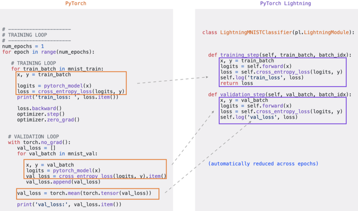

왼쪽 PyTorch 코드에서 상자로 표시된 부분 — batch 를 받아 forward 하고 loss 를 구하는 코드 — 이 오른쪽 `LightningModule` 의 `training_step()` 과 `validation_step()` 으로 옮겨진다. validation 에서 batch 별 loss 를 리스트에 모아 평균을 내던 코드는 `self.log()` 한 줄이 대신하며, epoch 단위 평균은 Lightning 이 자동으로 계산한다.

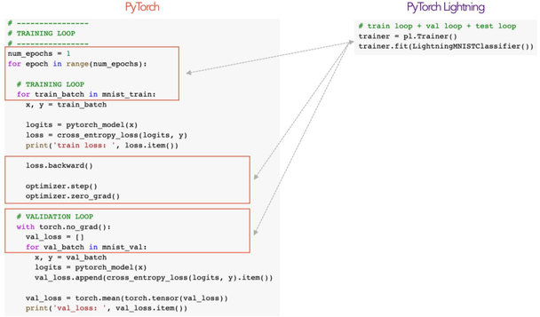

epoch 반복·`loss.backward()`·`optimizer.step()`·`optimizer.zero_grad()`·`torch.no_grad()` 같은 상용구는 `Trainer` API 로 추상화된다. 사용자는 `trainer = L.Trainer()` 를 만들고 `trainer.fit(model)` 을 호출할 뿐이며, train loop·val loop·test loop 가 모두 Trainer 안에서 돈다.

Trainer 가 device 도 관리하므로 Lightning 안에서는 device 를 직접 지정하지 않는다.

```python
# don't do in Lightning
x = torch.Tensor(2, 3)
x = x.cuda()
x = x.to(device)

# do this instead
x = x   # leave it alone!

# or to init a new tensor
new_x = torch.Tensor(2, 3)
new_x = new_x.type_as(x)
```

새 텐서를 만들어야 하면 `.cuda()` 나 `.to(device)` 대신 `type_as()` 로 기존 텐서와 같은 device·dtype 을 따라가게 한다. 그래야 CPU 에서 돌리든 GPU 에서 돌리든 모델 코드를 고치지 않아도 된다.

---

## 2.1.2 Model 설계 workflow 의 다섯 단계
<!-- 슬라이드 109 -->

PyTorch Lightning 중심의 model 설계 workflow 는 다섯 단계로 이루어진다.

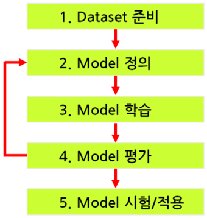

1. **Dataset 준비** — Dataset 을 정비·구성하거나 생성한다.
2. **Model 정의** — `class Model(LightningModule)` 을 만든다. 클래스 안에 `__init__()`, `forward()`, `training_step()`, `validation_step()`, `test_step()`, `configure_optimizers()` 등을 정의한다.
3. **Model 학습** — `trainer = L.Trainer(...)` 를 만들고 `trainer.fit(model, datasets)` 를 호출한다.
4. **Evaluation** — `trainer.validate(validation_dataset)` 로 학습 결과를 평가한다. 결과에 따라 모델 정의로 되돌아가 2~4 단계를 반복한다.
5. **Model 적용/활용** — `trainer.test(test_dataset)` 로 시험하거나 실제 데이터에 적용한다.

그림의 화살표가 보여 주듯 4단계 평가 결과가 만족스럽지 않으면 2단계로 돌아간다. 모델 구조, loss·metric, optimizer, learning rate 를 바꾸는 작업이 모두 `LightningModule` 안에서 이루어지므로, 이 절의 나머지는 이 클래스의 각 method 를 하나씩 채워 나가는 순서로 진행한다.

---

## 2.1.3 첫 모델 만들기
<!-- 슬라이드 110~114 -->

첫 모델의 데이터는 **MNIST** 필기체 숫자다. 28×28 흑백(BW) 이미지이며 training data 60k 장, test data 10k 장으로 구성된다.

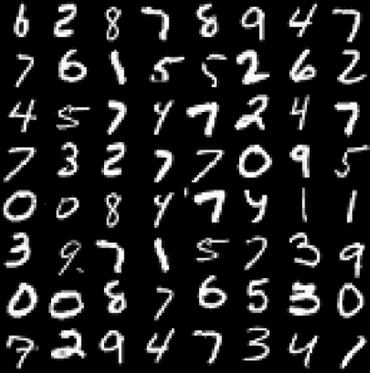


모델은 가장 단순한 형태로 잡는다. 28×28 이미지를 784 차원 벡터로 reshape 하고, 10 node 의 dense layer 를 거쳐 softmax 로 10개 class 의 확률을 낸다.

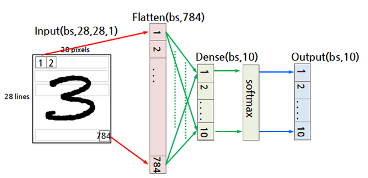

batch size 를 bs 라 하면 입력 `(bs, 28, 28, 1)` → Flatten `(bs, 784)` → Dense `(bs, 10)` → softmax → 출력 `(bs, 10)` 의 흐름이다.

### 실습 2.1.1 — 첫 모델 만들기
<!-- 슬라이드 111~114 -->

> 노트북: `code/2.1.1.ModelDesign.ipynb` — 이 노트북은 2.1.4(Module container) 와 2.1.5(Module 내부 method) 의 코드까지 이어진다.
> [](https://colab.research.google.com/github/AI-BoostCamp/intermediate-deep-learning-pytorch/blob/main/code/2.1.1.ModelDesign.ipynb)

노트북 전체에서 쓰는 라이브러리는 다음과 같다. 노트북의 `p(var, name)` 은 변수의 shape·type·값을 한꺼번에 찍는 디버그 helper 함수다.

```python
import torch
from torch import nn
from torch.nn import functional as F
import torch.optim as optim

import lightning as L
import torchmetrics
from torchmetrics import functional as FM
from torchinfo import summary

from torchvision.datasets import MNIST
import torchvision.transforms as transforms
from torch.utils.data import DataLoader

import numpy as np
import pandas as pd
import matplotlib.pyplot as plt
```

**Model 정의.** `L.LightningModule` 을 상속한 클래스에 `__init__()`, `forward()`, `training_step()`, `validation_step()`, `configure_optimizers()` 를 정의한다.

```python
class FirstModel(L.LightningModule):
    def __init__(self):
        super(FirstModel, self).__init__()
        self.layers = nn.Sequential(
            nn.Flatten(),
            nn.Linear(28*28, 10) )

    def forward(self, x):
        out = self.layers(x)
        return out

    def training_step(self, batch, batch_idx):
        x, y = batch
        y_pred = self(x)
        loss = F.cross_entropy(y_pred, y)
        acc = FM.accuracy(y_pred, y, task="multiclass",num_classes=10)
        self.log_dict({'loss':loss, 'acc':acc})
        return loss

    def validation_step(self, batch, batch_idx):
        x, y = batch
        y_pred = self(x)
        loss = F.cross_entropy(y_pred, y)
        acc = FM.accuracy(y_pred, y, task="multiclass",num_classes=10)
        self.log_dict({'val_loss':loss, 'val_acc':acc})

    def configure_optimizers(self):
        return torch.optim.Adam(self.parameters(), lr=0.001)
```

- `__init__()` 에서 layer 를 만든다. `nn.Flatten()` 이 `(bs, 1, 28, 28)` 을 `(bs, 784)` 로 펴고 `nn.Linear(784, 10)` 이 10개 class 의 logit 을 낸다.
- `forward()` 는 입력이 layer 를 지나는 그래프를 구성한다. `self(x)` 로 호출하면 이 함수가 실행된다.
- `training_step()` 은 batch 하나에 대한 학습 계산이다. batch 를 `x, y` 로 풀고 forward 한 뒤 loss 와 accuracy 를 구해 `self.log_dict()` 로 기록하고, **loss 를 return** 한다. Trainer 는 이 return 값으로 backward 와 optimizer step 을 수행한다.
- `validation_step()` 은 같은 계산을 검증 batch 에 대해 하되 loss 를 return 하지 않고 기록만 한다.
- `configure_optimizers()` 는 optimizer 를 return 한다. 여기서는 Adam, learning rate 0.001 이다.

모델 그림에는 softmax 층이 있지만 코드에는 없다. `F.cross_entropy` 가 logit 을 입력으로 받아 내부에서 softmax 를 적용하므로, cross entropy 를 loss 로 쓸 때는 모델 출력을 logit 그대로 둔다. 확률이 필요한 예측 단계에서만 `torch.softmax` 를 따로 적용한다.

**Model 생성, model summary.** TensorFlow 의 `model.summary()` 같은 보기는 torchinfo 의 `summary()` 가 제공한다 (https://github.com/TylerYep/torchinfo).

```python
from torchinfo import summary

model = FirstModel()
print( summary(model) )  # Layer별 출력 shape을 볼수 없음

print('++++++')
print( summary(model, (1, 1, 28, 28)) )

print('++++++')
print( summary(model, (128, 1, 28, 28)) )
```

`summary(model)` 만 호출하면 parameter 수는 나오지만 layer 별 출력 shape 은 나오지 않는다. 입력 shape 을 함께 주면 실제로 forward 를 흘려 shape 을 계산한다. batch size 128 로 호출한 결과는 다음과 같다.

| Layer (type:depth-idx) | Output Shape | Param # |
|---|---|---|
| FirstModel | -- | -- |
| ├─Sequential: 1-1 | [128, 10] | -- |
| │ └─Flatten: 2-1 | [128, 784] | -- |
| │ └─Linear: 2-2 | [128, 10] | 7,850 |

| 항목 | 값 |
|---|---|
| Total params / Trainable params / Non-trainable params | 7,850 / 7,850 / 0 |
| Total mult-adds (M) | 1.00 |
| Input size (MB) | 0.40 |
| Forward/backward pass size (MB) | 0.01 |
| Params size (MB) | 0.03 |
| Estimated Total Size (MB) | 0.44 |

아래쪽 메모리 수치는 손으로 계산해 볼 수 있다. float32 한 값이 4 byte 임을 이용한다.

```python
print(f"Total params: {(784*10+10)}")  #((input*nodes+nodes)
print(f"Params size(M/B): {(784*10+10)*4/1024/1024:.2f}")  #((input*nodes+nodes)*W/Byte)
```

```python
print(f"Input size:  {784*128*4/1024/1024:.2f}")                    #(input*bs*W/B)
print(f"Forward/bacward pass size: {(784+10)*4*2/1024/1024:0.2f}")  #(layer1_out+layer2_out)*W/B*2(f/b)
print(f"Parmas size:  {7850*4/1024/1024:.2f}")                      #(Total_params*W/B)
```

- **Input size 0.4M** = 784 × 128 × 4 (input × batch size × byte). batch size 에 따라 달라진다.
- **Forward/backward pass size 0.01M** = (784 + 10) × 4 × 2. 순전파 동안 각 layer 의 활성화 값(layer1 출력 + layer2 출력) 을 저장하는 메모리에, 역전파 동안 그 활성화 값의 gradient 를 저장하는 메모리를 더해 2배가 된다.
- **Params size 0.03M** = (784 × 10 + 10) × 4 (input × nodes + bias nodes, byte 환산).
- **Estimated total 0.44M** = 0.4 + 0.01 + 0.03. 학습에 필요한 기본 메모리다.

**Dataset 준비.** torchvision 의 `MNIST` dataset 을 `ToTensor()` 변환과 함께 내려받고 `DataLoader` 로 감싼다.

```python
from torchvision.datasets import MNIST
import torchvision.transforms as transforms
from torch.utils.data import DataLoader

def dataLoader(batch_size=128):
    train_dataset = MNIST('', transform=transforms.ToTensor(), train=True, download=True)
    test_dataset = MNIST('', transform=transforms.ToTensor(), train=False, download=True)
    trainDataLoader = DataLoader(train_dataset, batch_size=batch_size, shuffle=True, num_workers=4)
    valDataLoader = DataLoader(test_dataset, batch_size=batch_size, shuffle=False, num_workers=4)
    return trainDataLoader,valDataLoader

trainDataLoader,valDataLoader = dataLoader()
```

`download=True` 로 내려받은 파일은 현재 폴더 아래 `MNIST/raw/` 에 `t10k-images-idx3-ubyte`, `t10k-labels-idx1-ubyte` 같은 이름으로 저장된다. `ToTensor()` 는 0~255 화소 값을 0~1 의 float 텐서로 바꾸면서 channel 을 앞으로 보낸다. 학습 loader 는 `shuffle=True`, 검증 loader 는 `shuffle=False` 다. MNIST 는 전부 메모리에 올라가므로 file I/O 병목은 없지만, `ToTensor()` 같은 기본 전처리가 병렬 처리되기 때문에 `num_workers` 를 0 이나 1 대신 4 로 두면 속도가 빨라진다.

**Training, History logging.** 학습 이력을 CSV 로 남기기 위해 `CSVLogger` 를 만들어 Trainer 에 넘긴다.

```python
%%time
model = FirstModel()
epochs = 3
logger = L.pytorch.loggers.CSVLogger("logs", name="firstModel")
trainer = L.Trainer(max_epochs=epochs, logger=logger) #default: accelerator="auto"
trainer.fit(model, trainDataLoader, valDataLoader)
```

`accelerator` 의 기본값이 `"auto"` 이므로 GPU 가 있으면 자동으로 GPU 를 쓴다. `trainer.fit()` 을 부르면 먼저 사용 가능한 장치(GPU available: True, used: True, TPU/IPU/HPU: False) 와 모델 요약(layers | Sequential | 7.9 K, Trainable params 7.9 K, Total estimated model params size 0.031 MB) 이 출력되고, epoch 마다 진행 막대가 `Epoch 2: 100% 548/548 [00:20<00:00, 26.78it/s, loss=0.314, v_num=1]` 형태로 갱신된다. 548 은 학습 batch 수와 검증 batch 수를 더한 것이고 `v_num` 은 logger 의 version 번호다.

학습이 끝나면 `logs/firstModel/version_N/` 아래에 `checkpoints/epoch=2-step=1407.ckpt`, `hparams.yaml`, `metrics.csv` 가 생긴다. version 폴더는 실행할 때마다 새로 만들어진다. `metrics.csv` 를 열면 학습 행과 검증 행이 따로 기록되어 있어 빈 칸이 섞여 있다.

| acc | epoch | loss | step | val_acc | val_loss |
|---|---|---|---|---|---|
|  | 0 |  | 468 | 0.9222 | 0.2816 |
| 0.9168 | 0 | 0.2975 | 468 |  |  |
|  | 1 |  | 937 | 0.9224 | 0.2758 |
| 0.9209 | 1 | 0.2842 | 937 |  |  |
|  | 2 |  | 1406 | 0.9250 | 0.2707 |
| 0.9227 | 2 | 0.2767 | 1406 |  |  |

**Testing.** 검증 loader 에서 batch 하나를 꺼내 모델에 넣어 본다.

```python
test_batch = next(iter(valDataLoader))            #(128,1,28,28),(128,) <-
preds = model(test_batch[0])                      #image만  #(128,10) <- (128,1,28,28)
p(preds[0],'preds'),print()                       # Class logits (10,)
p(torch.softmax(preds[0],dim=0),'softmax'),print()# Class Prob.  (10,)
p(np.argmax(torch.softmax(preds[0],dim=0).detach()),'index') # Class idx
p(np.argmax(preds[0].detach()),'index')           #  확률로 바꿀필요 없음
```

batch 는 `(이미지, label)` 튜플이므로 이미지 `test_batch[0]` 만 모델에 넣는다. 출력 `preds` 는 `(128, 10)` 의 logit 이다. 첫 이미지의 logit 은 `tensor([-1.5962, -5.2314, -1.5064, 0.3416, -2.1231, -1.7352, -4.0654, 6.1641, -1.5108, 1.3904], grad_fn=<SelectBackward0>)` 처럼 나오고, softmax 를 거치면 index 7 (여덟 번째) 값이 `9.8674e-01` 로 가장 크다. `argmax` 로 index 를 뽑으면 7 이다. 순서를 바꾸지 않는 softmax 는 argmax 결과에 영향을 주지 않으므로, class index 만 필요하면 확률로 바꿀 필요 없이 logit 에 바로 argmax 를 해도 된다.

**History file.** logger 의 version 번호로 `metrics.csv` 경로를 만들어 pandas 로 읽는다.

```python
v_num = logger.version
history = pd.read_csv(f'./logs/firstModel/version_{v_num}/metrics.csv')
#history
history.groupby('epoch').last().drop('step', axis=1)
```

`groupby('epoch')` 로 epoch 별로 묶고 `step` 열을 버리면 epoch 당 한 줄의 표가 된다.

| epoch | loss | acc | val_loss | val_acc |
|---|---|---|---|---|
| 0 | 0.569167 | 0.877604 | 0.380751 | 0.9016 |
| 1 | 0.370750 | 0.900174 | 0.316841 | 0.9139 |
| 2 | 0.334456 | 0.904687 | 0.296161 | 0.9182 |

epoch 이 진행되며 학습·검증 loss 가 함께 줄고 검증 정확도가 오르는 것을 확인할 수 있다.

---

## 2.1.4 Module 정의 — 네 가지 container 와 모델 시각화
<!-- 슬라이드 115~122 -->

Lightning 의 model 은 **module + method** 로 구성된다. 여기서 module 은 layer 와 model 을 모두 포함하는 상위 개념이다 — layer 하나도 module 이고, layer 를 모은 model 도 module 이다. module 은 container 에 저장·관리되며, PyTorch 는 네 가지 container 를 제공한다.

| container | 역할 |
|---|---|
| 1. `nn.Module()` / `L.LightningModule()` | module 을 구성하는 base class |
| 2. `nn.Sequential()` | 모듈을 쌓아 하나의 모듈을 생성. 각 모듈의 입·출력이 순차적으로 연결됨. `add_module(module)` |
| 3. `nn.ModuleList()` | 모듈들을 리스트에 저장하여 관리. 입·출력 연결은 별도 처리. `append(module)`, `extend(modules)`, `insert(index, module)` |
| 4. `nn.ModuleDict()` | 모듈을 dictionary 에 저장하여 관리. 각 모듈을 item 으로 추가·삭제·추출 가능 |

method 는 loop 별로 정의한다 — Train Loop (`training_step`), Validation Loop (`validation_step`), Test Loop (`test_step`), Prediction Loop (`predict_step`), 그리고 Optimizers and LR Schedulers (`configure_optimizers`). method 는 2.1.5 에서 다루고, 여기서는 container 를 차례로 본다.

### 1. nn.Module / LightningModule container

base class 를 상속한 클래스의 `__init__()` 에서 layer 를 생성하고 `forward()` 에서 그래프를 구성한다.

```python
class Model(L.LightningModule):
    def __init__(self):
        super().__init__()
        self.linear1 = nn.Linear(5, 10)
        self.linear2 = nn.Linear(10,1)

    def forward(self, x):
        x = F.relu(self.linear1(x))
        x = F.relu(self.linear2(x))
        return x

model = Model()
summary(model, input_size=(8, 5))
```

`model` 을 그대로 출력하면 `(module name): module type(in_features, out_features, bias)` 형식으로 등록된 module 이 나열된다.

```text
Model(
  (linear1): Linear(in_features=5, out_features=10, bias=True)
  (linear2): Linear(in_features=10, out_features=1, bias=True)
)
```

`summary()` 는 각 Linear 의 출력 shape 과 parameter 수를 보여 준다 — Linear 1-1 은 `[8, 10]` 에 60 개 (5×10+10), Linear 1-2 는 `[8, 1]` 에 11 개 (10×1+1), 합계 71 개다. `forward()` 안에서 `F.relu` 처럼 function 으로 쓴 활성화는 module 로 등록되지 않으므로 summary 에 나타나지 않는다.

**Model 도 하나의 module 로 취급된다.** 앞의 `Model` 을 다른 모델의 layer 로 쓸 수 있다.

```python
class MyModel(L.LightningModule):
    def __init__(self):
        super(MyModel, self).__init__()
        self.layers =  Model()

    def forward(self, x):
        out = self.layers(x)
        return out

model = MyModel()
summary(model, input_size=(8, 5))
```

summary 의 계층이 `MyModel ├─Model: 1-1 └─Linear: 2-1, Linear: 2-2` 로 한 단계 깊어진다. 속성으로 하위 module 에 접근할 수 있다.

```python
p(model,'model');print()
p(model.layers,'model.layers');print()
p(model.layers.linear1,'model.layers.linear1');print()
p(model.layers.children,'model.layers.children')
```

`model` 은 `__main__.MyModel`, `model.layers` 는 `__main__.Model`, `model.layers.linear1` 은 `torch.nn.modules.linear.Linear` 타입이다. `model.layers.children` 은 하위 module 을 차례로 돌려주는 bound method 다.

### 2. nn.Sequential container

**type 1 — argument 로 module 전달.** module 들을 argument 로 전달하여 하나의 module 을 만든다. 전달한 순서대로 앞 module 의 출력이 뒤 module 의 입력이 된다.

```python
loss_function = nn.CrossEntropyLoss()
class Model(L.LightningModule):
    def __init__(self):
        super(Model, self).__init__()
        self.layers =  nn.Sequential(
            nn.Linear(28*28, 64),
            nn.ReLU(),
            nn.Linear(64,10)
            )
    def forward(self, x):
        out = self.layers(x)
        return out

model = Model()
summary(model, input_size=(8, 1, 28*28))
```

이름을 주지 않았으므로 module 은 `(0)`, `(1)`, `(2)` 번호로 등록된다.

```text
Model(
  (layers): Sequential(
    (0): Linear(in_features=784, out_features=64, bias=True)
    (1): ReLU()
    (2): Linear(in_features=64, out_features=10, bias=True)
  )
)
```

summary 에서는 `Sequential: 1-1` 아래에 `Linear: 2-1 [8, 1, 64] 50,240`, `ReLU: 2-2 [8, 1, 64]`, `Linear: 2-3 [8, 1, 10] 650` 이 나온다. `nn.ReLU()` 는 module 이므로 이번에는 summary 에 나타난다. `forward()` 는 `self.layers(x)` 한 줄이면 된다.

**type 2 — `add_module()`.** 빈 `nn.Sequential()` 을 만들고 `add_module(name, module)` 로 하나씩 추가한다. module name 을 지정할 수 있고, 추가한 순서대로 입·출력이 연결된다.

```python
class Model(L.LightningModule):
    def __init__(self):
        super(Model, self).__init__()
        self.layers = nn.Sequential()
        self.layers.add_module('linear1', nn.Linear(28*28, 64))
        self.layers.add_module('linear2', nn.Linear(64,10))

    def forward(self, x):
        out = self.layers(x)
        return out

model = Model()
summary(model, input_size=(8, 1, 28*28))
```

출력하면 `(layers): Sequential((linear1): Linear(784→64), (linear2): Linear(64→10))` 처럼 지정한 이름이 보인다.

**type 3 — `OrderedDict`.** 이름과 module 의 쌍을 `OrderedDict` 로 묶어 한 번에 전달한다. 역시 module name 을 지정할 수 있다.

```python
from collections import OrderedDict
class Model(L.LightningModule):
    def __init__(self):
        super(Model, self).__init__()
        self.layers = nn.Sequential(OrderedDict([
            ('flatten', nn.Flatten()),
            ('linear1', nn.Linear(28*28,64)),
            ('linear2', nn.Linear(64,10)),
          ]))
    def forward(self, x):
        out = self.layers(x)
        return out

model = Model()
summary(model, input_size=(8, 1, 28, 28))
```

이번에는 `nn.Flatten()` 을 앞에 두었으므로 입력을 `(8, 1, 28, 28)` 로 줄 수 있다. 출력에는 `(flatten): Flatten(start_dim=1, end_dim=-1)` 이 추가되고 summary 에는 `Flatten: 2-1, Linear: 2-2, Linear: 2-3` 이 나온다.

### 3. nn.ModuleList container

module 들을 리스트에 저장하여 관리한다. Sequential 과 달리 **입·출력 연결은 `forward()` 에서 별도로 처리해야 한다.** `append(module)`, `extend(modules)`, `insert(index, module)` 로 리스트를 다룬다.

```python
class Model(L.LightningModule):
    def __init__(self):
        super(Model, self).__init__()
        self.linears = nn.ModuleList([nn.Linear(10, 10) for i in range(5)])

    def forward(self, x):
        for l in self.linears:
            x = l(x)
        return x

model = Model()
summary(model, input_size=(8, 1, 10))
```

같은 크기의 Linear 5개가 `(0-4): 5 x Linear(in_features=10, out_features=10, bias=True)` 로 등록되고, `forward()` 의 for loop 가 차례로 연결한다. 리스트이므로 index 로 골라 쓸 수도 있다.

```python
class Model(L.LightningModule):
    def __init__(self):
        super(Model, self).__init__()
        self.linears = nn.ModuleList([nn.Linear(10, 10) for i in range(5)])

    def forward(self, x):
        # ModuleList can act as an iterable, or be indexed using ints
        for i, l in enumerate(self.linears):
            x = self.linears[i // 2](x) + l(x)
        return x
    #0: x = l[0](x)+l[0](x)
    #1: x = l[0](x)+l[1](x)
    #2: x = l[1](x)+l[2](x)
    #3: x = l[1](x)+l[3](x)
    #4: x = l[2](x)+l[4](x)

model = Model()
summary(model, input_size=(8, 1, 10))
```

loop 를 5번 돌며 매번 두 개의 Linear 를 호출하므로 summary 에는 `Linear: 2-1` 부터 `Linear: 2-10` 까지 열 줄이 나온다. 그러나 실제 module 은 5개뿐이어서 parameter 수는 `110`, `(recursive)` 가 번갈아 표시된다 — 이미 센 module 을 다시 호출한 자리가 `(recursive)` 다. 110 은 10×10+10 이다.

### 4. nn.ModuleDict container

module 을 dictionary 에 저장하여 관리한다. 각 module 을 item 으로 추가·삭제·추출할 수 있으므로 **모델을 동적으로 수정**할 수 있고, dictionary key 로 flow 를 제어하면 **forward 의 data flow 를 동적으로 바꿀** 수 있다.

```python
class Model(L.LightningModule):
    def __init__(self):
        super(Model, self).__init__()
        self.choices = nn.ModuleDict({
                'conv': nn.Conv2d(10, 10, 3),
                'pool': nn.MaxPool2d(2)
        })
        self.activations = nn.ModuleDict([
                ['lrelu', nn.LeakyReLU()],
                ['prelu', nn.PReLU()]
        ])

    def forward(self, x, choice, act):
        x = self.choices[choice](x)
        x = self.activations[act](x)
        return x

model = Model()
```

`forward()` 가 `choice`, `act` 라는 key 를 추가로 받아 어느 module 을 지날지 고른다. dict 는 `{key: module}` 형태로도, `[[key, module], ...]` 리스트 형태로도 만들 수 있다. summary 를 부를 때는 forward 의 추가 인자를 keyword 로 넘긴다.

```python
## Total mult-adds : 4.92
summary(model, input_size=(8, 10, 28, 28),choice='conv',act='prelu')
```

```python
## Total mult-adds : 0
summary(model, input_size=(8, 10, 28, 28),choice='pool',act='lrelu')
```

`conv` 를 고르면 convolution 의 곱셈-덧셈 연산이 잡히고, `pool` 을 고르면 parameter 없는 pooling 만 지나므로 mult-adds 가 0 이다. 모델을 출력하면 `(choices): ModuleDict((conv): Conv2d(10, 10, kernel_size=(3, 3), stride=(1, 1)), (pool): MaxPool2d(kernel_size=2, stride=2, padding=0, dilation=1, ceil_mode=False))` 와 `(activations): ModuleDict((lrelu): LeakyReLU(negative_slope=0.01), (prelu): PReLU(num_parameters=1))` 이 보인다.

### 모델 시각화 — ONNX 와 Netron

**ONNX(Open Neural Network Exchange)** 는 다양한 프레임워크의 모델을 공통 파일 형식을 통해 사용할 수 있도록 지원하는 프로젝트다. PyTorch 모델을 ONNX 파일로 내보내면 ONNX file viewer 인 **Netron** (https://netron.app/, Windows 용 다운로드는 https://sourceforge.net/projects/netron.mirror/) 으로 구조를 그림으로 볼 수 있다.

두 갈래로 나뉘었다가 합쳐지는 모델을 만들어 내보내 본다. `forward()` 에서 같은 입력을 `linear1`, `linear2` 에 각각 넣고 `torch.cat` 으로 이어 붙인 뒤 `linear3` 을 지난다.

```python
class Model(L.LightningModule):
    def __init__(self):
        super(Model, self).__init__()
        self.flatten =  nn.Flatten()
        self.linear1 = nn.Linear(28*28, 32)
        self.linear2 = nn.Linear(28*28, 32)
        self.linear3 = nn.Linear(64, 10)
        self.relu = nn.ReLU()

    def forward(self, x):
        x = self.flatten(x)
        x1 = self.linear1(x)
        x1 = self.relu(x1)
        x2 = self.linear2(x)
        x2 = self.relu(x2)
        x = torch.cat([x1, x2], dim=1)
        x = self.linear3(x)
        return x

model = Model()
summary(model, input_size=(8, 1, 28, 28))
```

`onnx` 패키지를 설치한 뒤 `torch.onnx.export()` 에 모델, 더미 입력, 파일 이름을 준다. 더미 입력은 모델과 같은 device 에 있어야 한다.

```python
device ='cuda:0'
torch.onnx.export(model, torch.zeros((8, 1, 28, 28)).to(device), 'model.onnx')
```

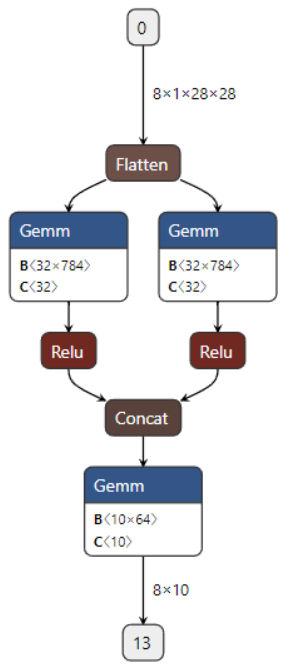

Netron 그래프에서 `nn.Linear` 는 `Gemm`(general matrix multiplication) 으로 나타나고, 그 안의 `B⟨32×784⟩` 가 weight, `C⟨32⟩` 가 bias 다. 코드에서 두 갈래로 쓴 `forward()` 가 실제로 두 갈래 그래프가 되었고 `Concat` 뒤의 `Gemm` 이 `B⟨10×64⟩` 로 64 차원을 받는 것을 확인할 수 있다.

---

## 2.1.5 Module 내부 method — 학습·검증·시험·예측 loop
<!-- 슬라이드 123~129 -->

### Train Loop — training_step

`training_step` 은 `trainer.fit()` 이 호출하며 train dataset 에 적용된다 (validation_step 이 있으면 val dataset 도 함께 돈다). 순수 PyTorch 의 train loop 기본형과 비교하면 Lightning 이 무엇을 대신하는지 보인다.

```python
def train_loop(dataloader, model, loss_fn, optimizer):
    size = len(dataloader.dataset)
    for batch, (X, y) in enumerate(dataloader):
        # 예측(prediction)과 손실(loss) 계산
        pred = model(X)
        loss = loss_fn(pred, y)
        # 역전파
        optimizer.zero_grad()
        loss.backward()
        optimizer.step()
        if batch % 100 == 0:
            loss, current = loss.item(), batch * len(X)
            print(f"loss: {loss:>7f}  [{current:>5d}/{size:>5d}]")
```

PyTorch 에서는 batch 반복, gradient 초기화, backward, optimizer step, 진행 출력이 모두 사용자 코드다. Lightning 의 `training_step` 에는 예측과 loss 계산만 남는다.

```python
def training_step(self, batch, batch_idx):
    x, y = batch
    y_hat = self(x)                  ## forward()
    loss = loss_function(y_hat, y)
    self.log('train_loss', loss)
    return loss
```

`self(x)` 가 `forward()` 를 호출하고, return 한 loss 로 Trainer 가 backward 와 step 을 수행한다. 진행 출력은 `self.log()` 가 대신한다.

### History logging

logging 은 `LightningModule.log()` 와 여러 값을 한 번에 넘기는 `log_dict()` 로 한다.

```python
LightningModule.log(name, value,
    prog_bar=False, logger=True, on_step=None, on_epoch=None, reduce_fx='mean',
    enable_graph=False, sync_dist=False, sync_dist_group=None, add_dataloader_idx=True,
    batch_size=None, metric_attribute=None, rank_zero_only=False)
```

핵심 인자는 `on_step` 과 `on_epoch` 이다. `training_step` 에서의 기본값은 **step level** (`on_step=True, on_epoch=False`) 이고, `on_epoch=True` 로 바꾸면 step 값들을 `reduce_fx`(기본 mean) 로 모아 **epoch level** 로 기록한다. `prog_bar=True` 를 주면 진행 막대에도 표시된다.

```python
from torchmetrics import functional as FM

## History logging (step level)
def training_step(self, batch, batch_idx):
    x, y = batch
    y_hat = self(x)
    loss = F.cross_entropy(y_hat, y)
    self.log("loss", loss, on_step=True, on_epoch=False)
    return loss

## History logging (epoch level)
def training_step(self, batch, batch_idx):
    x, y = batch
    y_hat = self(x)
    loss = F.cross_entropy(y_hat, y)
    self.log("loss", loss, on_step=False, on_epoch=True)
    return loss

## Display with PRogressBar
def training_step(self, batch, batch_idx):
    x, y = batch
    y_hat = self(x)
    loss = F.cross_entropy(y_hat, y)
    acc = FM.accuracy(y_hat, y, task="multiclass",num_classes=10)
    mse = FM.mean_squared_error(torch.argmax(y_hat, dim=1), y)
    metrics={'loss': loss, 'acc':acc, 'mse': mse}
    self.log_dict(metrics, prog_bar=True) #on_step=True, on_epoch=False
    return loss
```

세 번째 변형은 torchmetrics 의 functional API 로 accuracy 와 mse 를 함께 구한다. 여기서 mse 는 argmax 로 뽑은 class index 와 label 사이의 제곱 오차이므로 분류 성능 지표로 의미가 크지는 않지만, 여러 metric 을 dict 로 묶어 한 번에 기록하는 방법을 보여 준다.

step 값이 CSV 에 기록되는 간격은 Trainer 의 `log_every_n_steps` 로 정한다 (기본 50).

```python
%%time
model = MyModel()

epochs=3
logger = L.pytorch.loggers.CSVLogger("logs", name="train_history_log")
trainer = L.Trainer(max_epochs=epochs, logger=logger, # accelerator='auto',
                     log_every_n_steps=100)            #,precision="16-mixed")
trainer.fit(model, trainDataLoader, valDataLoader)
```

```python
v_num = logger.version

history = pd.read_csv(f'./logs/train_history_log/version_{v_num}/metrics.csv')
history
history.groupby('epoch').last().drop('step', axis=1)
```

step level 로 기록한 `metrics.csv` 는 다음과 같이 학습 값이 50 step 마다 한 줄씩 쌓이고, epoch 끝(step 468) 에 검증 값 한 줄이 끼어든다.

| index | loss | acc | mse | epoch | step | val_loss | val_acc | val_mse |
|---|---|---|---|---|---|---|---|---|
| 0 | 0.7936 | 0.8125 | 4.3516 | 0 | 49 | NaN | NaN | NaN |
| 1 | 0.4948 | 0.8906 | 1.6641 | 0 | 99 | NaN | NaN | NaN |
| 2 | 0.3672 | 0.9219 | 1.1953 | 0 | 149 | NaN | NaN | NaN |
| … | | | | | | | | |
| 9 | NaN | NaN | NaN | 0 | 468 | 0.2614 | 0.9275 | 1.3252 |
| 10 | 0.3620 | 0.9141 | 1.0547 | 1 | 499 | NaN | NaN | NaN |

`on_step=True, on_epoch=True` 를 함께 주면 `loss_step`, `loss_epoch` 처럼 접미사가 붙은 열이 따로 생긴다.

### Validation Loop — validation_step

`validation_step` 은 `trainer.fit()` 과 `trainer.validate()` 에서 적용된다. log 의 기본값은 `training_step` 과 달리 **epoch level** (`on_step=False, on_epoch=True`) 이다.

```python
    def validation_step(self, batch, batch_idx):
        x, y = batch
        y_hat = self(x)
        loss = loss_function(y_hat, y)
        acc = FM.accuracy(y_hat, y, task="multiclass",num_classes=10)
        mse = FM.mean_squared_error(torch.argmax(y_hat, dim=1), y)
        metrics={'val_loss': loss, 'val_acc':acc, 'val_mse': mse}
        self.log_dict(metrics) #on_step=False, on_epoch=True
```

계산 내용은 `training_step` 과 같고 key 이름 앞에 `val_` 을 붙여 구분한다. loss 를 return 하지 않는 점이 다르다 — 검증에서는 backward 가 없다. 학습 뒤 `trainer.validate()` 를 부르면 검증 loop 만 다시 돈다.

```python
## call triaining & validation process
trainer.fit(model, trainDataLoader, valDataLoader)
## call validation process
trainer.validate(model, valDataLoader)
```

`trainer.validate()` 는 진행 막대 `Validation DataLoader 0: 100% 79/79` 뒤에 `Validate metric | DataLoader 0` 표를 출력하고 결과를 dict 의 리스트로 return 한다. 한 예에서는 `val_acc 0.9510, val_loss 0.1613, val_mse 0.9071` 이었다. 79 는 10k 검증 데이터를 batch 128 로 나눈 batch 수다.

### Test Loop — test_step

`test_step` 은 `trainer.test()` 가 호출한다. validation process 와 동일하며, 검증과 별도의 test process 가 필요할 때 사용한다.

```python
    def test_step(self, batch, batch_idx):
        x, y = batch
        y_hat = self(x)
        loss = loss_function(y_hat, y)
        acc = FM.accuracy(y_hat, y, task="multiclass",num_classes=10)
        metrics={'test_loss': loss, 'test_acc':acc}
        self.log_dict(metrics)
```

```python
trainer.validate(model, valDataLoader)
trainer.test(model, valDataLoader)
```

`trainer.test()` 는 `Testing DataLoader 0: 100% 79/79` 진행 막대와 `Test metric | DataLoader 0` 표를 출력한다. 같은 loader 를 넘겼으므로 `test_acc 0.9517, test_loss 0.1595` 처럼 검증 결과와 거의 같은 값이 나온다.

### Prediction Loop — predict_step

`predict_step` 은 `trainer.predict()` 가 호출한다. `forward()` 를 override 하여 학습된 모델을 별도의 process 로 실행할 수 있다. 예를 들어 forward 의 logit 을 softmax 확률로 바꿔 return 하도록 한다.

```python
    def forward(self, x):
        out = self.layers(x)
        return out

    def predict_step(self, x, batch_idx):
        y_pred = self(x)
        y_pb = F.softmax(y_pred,dim=1)     # nn.Softmax
        return y_pb
```

같은 batch 에 대해 `model(imgs)` 는 `forward()` 를, `trainer.predict(model, imgs)` 는 `predict_step()` 을 실행한다.

```python
batch = next(iter(valDataLoader)) # ((128,1,28,28),(128,10))
imgs = batch[0]                   # (128,1,28,28)

# forward()실행
y_logit = model(imgs)             ## (128,10)
ps(y_logit)
p(y_logit[0],'logit')             # 첫image에 대한 출력(logit)

# predict_step()실행
y_porb = trainer.predict(model, imgs)## list()
p(y_porb[0], 'prob.')             #  첫image에 대한 출력(prob.)
```

`trainer.predict()` 는 batch 별 결과를 list 로 돌려준다. `predict_step` 을 override 하는 또 다른 예가 Monte Carlo dropout 이다. 예측 시에도 dropout 을 train 상태로 켜 두고 `mc_iteration` 번 forward 한 결과를 평균한다.

```python
class LitMCdropoutModel(L.LightningModule):
    def __init__(self, model, mc_iteration):
        super().__init__()
        self.model = model
        self.dropout = nn.Dropout()
        self.mc_iteration = mc_iteration

    def predict_step(self, batch, batch_idx):
        # enable Monte Carlo Dropout
        self.dropout.train() ## train flag
        # take average of `self.mc_iteration` iterations # torch.unsqueeze(0):(new_axis,...)
        pred = torch.vstack([self.dropout(self.model(x)).unsqueeze(0) for _ in range(self.mc_iteration)]).mean(dim=0)
        return pred
```

### Model inference / prediction — model(dataset)

Trainer 없이 `model(dataset)` 으로 직접 추론할 수도 있다. 이때 두 가지를 챙겨야 한다. 첫째, `model.eval()` 로 module 을 evaluation mode 로 바꾼다 (Dropout, BatchNorm 등이 학습 때와 다르게 동작한다). 둘째, 예측 값은 `torch.tensor` 특유의 attribute — gradient 계산을 위한 `grad_fn` — 를 달고 나오므로 추가로 제거해야 한다.

```python
batch = next(iter(valDataLoader)) # ((128,1,28,28),(128,1))

##### Sets the module in evaluation mode.(Dropout,BN,..)
model.eval()

y_predict = model(batch[0])       # model(images)<-(images,labels)

p(y_predict,'(bs,10)')                 # (bs,10)
p(y_predict[0,:],'(10,)')            # (10,)
p(y_predict[0,:].detach(),'(10,)detached')   # (10,) w/o grad_fn
p(np.argmax(y_predict[0,:].detach()),'()scala tensor') # index tensor
p(np.argmax(y_predict[0,:].detach()).numpy(),'np') # index
#p(np.argmax(y_predict[0,:])) ## Error: Can't call numpy() on Tensor that requires grad.
```

`y_predict` 는 `torch.Size([128, 10])` 의 tensor 이고 값 뒤에 `grad_fn=<AddmmBackward0>` 가 붙어 있다. 첫 행을 slicing 한 `y_predict[0,:]` 는 `torch.Size([10])` 에 `grad_fn=<SliceBackward0>` 가 붙는다. `.detach()` 를 하면 같은 값에서 `grad_fn` 이 사라지고, 그제야 `.numpy()` 로 numpy 로 바꿀 수 있다 — gradient 가 필요한 tensor 에 `.numpy()` 를 부르면 에러가 난다. `np.argmax` 결과는 shape `()` 의 scalar tensor 이고 `.numpy()` 를 거치면 numpy 값 7 이 된다.

처음부터 gradient 계산을 끄고 추론하는 방법이 `with torch.no_grad():` 다. 메모리가 줄고 결과 tensor 에 `grad_fn` 이 없으므로 `detach()` 가 필요 없다.

```python
## disabled gradient calculation.(reduce memory)
with torch.no_grad():             ### w/o grad_fn object ###
    y_predict = model(batch[0])   # model(images)

p(y_predict,'\n')                 # (bs,10) tensor, w/o grad_fn
p(y_predict[0,:],'\n')            # (10,)    tensor, w/o grad_fn
p(np.argmax(y_predict[0,:].numpy()),'np') # numpy index
p(np.argmax(y_predict[0,:]),'tensor') # tensor index
```

tensor 의 rank·shape·axis 용어도 여기서 정리해 둔다. `(2, 3, 4)` 배열은 rank 3 이고 axis 는 `(0, 1, 2)` 또는 `(0, 1, -1)` 로 부르며, 각 axis 가 `(z, y, x)` 에 대응한다. `argmax(..., dim=1)` 처럼 dim 을 줄 때 이 번호를 쓴다.

```python
## rank, shape, axis
d = np.zeros((2,3,4))
print(d.ndim)
p(d)
# #of_rank = 3
# shape=(2,3,4),
# axis:(0,1,2) or (0,1,-1)
#       (z, y, x)
```

### 첫 모델 다시 보기

container 와 method 를 모두 본 뒤 2.1.3 의 첫 모델을 다시 읽으면 각 부분의 역할이 분명해진다.

| 코드 | workflow 단계 |
|---|---|
| `nn.Sequential(nn.Flatten(), nn.Linear(28*28, 10))` | Model 정의 — Sequential container 에 layer 두 개 |
| `forward()` | 그래프 구성, `self(x)` 로 호출 |
| `training_step()` — loss 계산·기록·return | Model 학습 (`trainer.fit`) |
| `validation_step()` — `val_loss`, `val_acc` 기록 | Model 평가 (`trainer.fit`, `trainer.validate`) |
| `configure_optimizers()` — Adam, lr 0.001 | 학습 알고리즘 |
| `L.Trainer(max_epochs, logger)` + `trainer.fit(model, trainDataLoader, valDataLoader)` | 실행 |

loss 는 함수형 `F.cross_entropy(y_pred, y)` 대신 module 형 `loss_function = nn.CrossEntropyLoss()` 를 만들어 `loss_function(y_pred, y)` 로 써도 같다. 어느 쪽이든 입력은 softmax 를 거치지 않은 logit 이고, target 은 one-hot 이 아닌 정수 label 이다. Keras 의 `categorical_crossentropy` 가 one-hot target 을 받던 것과 다른 점이므로, Keras 코드를 옮길 때 주의한다.

---

## 2.1.6 DataModule 로 데이터 다루기
<!-- 슬라이드 130 -->

### 실습 2.1.2 — 좀더 깊숙한 모델 handling
<!-- 슬라이드 130 -->

> 노트북: `code/2.1.2.ModelDesign2.ipynb` — 이 노트북은 2.1.7(Loss·Metric) 부터 2.1.10(저장·복원) 까지 이어진다.
> [](https://colab.research.google.com/github/AI-BoostCamp/intermediate-deep-learning-pytorch/blob/main/code/2.1.2.ModelDesign2.ipynb)

이 노트북의 모델은 2.1.4 끝에서 시각화한 두 갈래 모델이다. 클래스에 `add_method` 라는 classmethod 를 두어, 클래스를 정의한 뒤에도 `@Model.add_method` decorator 로 method 를 하나씩 붙일 수 있게 했다. 노트북에서 셀 단위로 method 를 바꿔 가며 실험하기 위한 장치다.

```python
class Model(L.LightningModule):
    @classmethod
    def add_method(cls, fun):
      setattr(cls, fun.__name__, fun)
      return fun

    def __init__(self):
        super(Model, self).__init__()
        self.flatten =  nn.Flatten()
        self.linear1 = nn.Linear(28*28, 32)
        self.linear2 = nn.Linear(28*28, 32)
        self.linear3 = nn.Linear(64, 10)
        self.relu = nn.ReLU()

    def forward(self, x):
        x = self.flatten(x)
        x1 = self.linear1(x)
        x1 = self.relu(x1)
        x2 = self.linear2(x)
        x2 = self.relu(x2)
        x = torch.cat([x1, x2], dim=1)
        x = self.linear3(x)
        return x
```

```python
@Model.add_method
def predict_step(self, x, batch_idx):
    y_pred = self(x)
    y_pb = F.softmax(y_pred)
    return y_pb

@Model.add_method
def training_step(self, batch, batch_idx):
    x, y = batch
    y_pred = self(x)
    loss = F.cross_entropy(y_pred, y)
    acc = FM.accuracy(y_pred, y, task="multiclass",num_classes=10)
    mse = FM.mean_squared_error(torch.argmax(y_pred, dim=1), y)
    metrics={'loss': loss, 'acc':acc, 'mse': mse}
    self.log_dict(metrics,prog_bar=True)#on_step=True, on_epoch=False)
    return loss

@Model.add_method
def validation_step(self, batch, batch_idx):
    x, y = batch
    y_pred = self(x)
    loss = F.cross_entropy(y_pred, y)
    acc = FM.accuracy(y_pred, y, task="multiclass",num_classes=10)
    mse = FM.mean_squared_error(torch.softmax(y_pred, dim=1), F.one_hot(y,num_classes=10))
    metrics={'val_loss': loss, 'val_acc':acc, 'val_mse': mse}
    self.log_dict(metrics) #on_step=False, on_epoch=True

@Model.add_method
def test_step(self, batch, batch_idx):
    x, y = batch
    y_pred = self(x)
    loss = F.cross_entropy(y_pred, y)
    acc = FM.accuracy(y_pred, y, task="multiclass",num_classes=10)
    mse = FM.mean_squared_error(torch.softmax(y_pred, dim=1), F.one_hot(y,num_classes=10))
    metrics={'val_loss': loss, 'val_acc':acc, 'val_mse': mse}
    self.log_dict(metrics) #on_step=False, on_epoch=True

@Model.add_method
def configure_optimizers(self):
    return torch.optim.Adam(self.parameters(), lr=0.001)

model = Model()
```

**Data Module 만들기.** 지금까지는 train loader 와 val loader 를 따로 만들어 `trainer.fit(model, trainDataLoader, valDataLoader)` 로 넘겼다. `L.LightningDataModule` 을 상속한 **DataModule** 하나에 데이터 준비와 loader 생성을 모두 넣으면, 같은 `data_module` 로 `fit()`, `validate()`, `test()` 를 모두 부를 수 있다.

먼저 DataLoader 의 `num_workers` 를 정한다. CPU 코어 수의 절반을 쓰는 것이 무난한 출발점이다.

```python
import os
num_workers = os.cpu_count() // 2
num_workers
```

`num_workers` 를 높이면 데이터 로드가 병렬화되어 처리 속도가 증가할 수 있지만, 너무 높을 경우 컨텍스트 스위칭 비용이 증가하고 CPU 가 과부하 상태가 될 수 있다. 데이터 로드가 I/O 병목(예: 디스크에서의 읽기 속도 제한) 이라면 적당한 수준에서 멈추는 것이 좋다.

```python
from torchvision.datasets import MNIST
import torchvision.transforms as transforms
from torch.utils import data
from torch.utils.data import DataLoader

class MNISTDataModule(L.LightningDataModule):
  def __init__(self, data_dir: str = '', batch_size: int = 32):
    super().__init__()
    self.data_dir = data_dir
    self.batch_size = batch_size

  def setup(self, stage):
    # transforms for images
    transform=transforms.Compose([transforms.ToTensor(), # 1/255,tensor로 변환
                                  transforms.Normalize((0.1307,), (0.3081,))])
    self.mnist_test = MNIST(self.data_dir, train=False, transform=transform, download=True)
    mnist_full = MNIST(self.data_dir, train=True, transform=transform, download=True)
    self.mnist_train, self.mnist_val = data.random_split(mnist_full, [55000, 5000])

  def train_dataloader(self):
    return DataLoader(self.mnist_train, batch_size=self.batch_size, num_workers=num_workers)
  def val_dataloader(self):
    return DataLoader(self.mnist_val, batch_size=self.batch_size, num_workers=num_workers)
  def test_dataloader(self):
    return DataLoader(self.mnist_test, batch_size=self.batch_size, num_workers=num_workers)

data_module = MNISTDataModule(batch_size=256)
```

- `__init__()` 은 데이터 경로와 batch size 만 받아 둔다.
- `setup(stage)` 에서 실제 dataset 을 만든다. `ToTensor()` 뒤에 `Normalize((0.1307,), (0.3081,))` 을 붙여 MNIST 의 평균과 표준편차로 정규화한다. 학습용 60k 를 `random_split` 으로 55,000 / 5,000 의 train / val 로 나누고, 10k test 는 따로 둔다. 2.1.3 에서 test 데이터를 검증에 썼던 것과 달리 검증과 시험 데이터가 분리된다.
- `train_dataloader()`, `val_dataloader()`, `test_dataloader()` 가 각각의 DataLoader 를 return 한다. Trainer 는 `fit` 에서 앞의 둘을, `validate` 에서 val 을, `test` 에서 test 를 골라 부른다.

```python
%%time
model = Model()
trainer = L.Trainer(max_epochs=3,enable_model_summary=False)
trainer.fit(model, data_module)
```

```python
trainer.validate(model, data_module)
```

```python
trainer.test(model, data_module)
```

`trainer.fit(model, data_module)` 처럼 loader 둘 대신 data_module 하나를 넘긴다. `enable_model_summary=False` 는 fit 시작 때 찍히는 모델 요약을 끈다.

---

## 2.1.7 Loss 함수와 Metric 함수
<!-- 슬라이드 131~132 -->

**주요 Loss 함수** 는 `torch.nn.functional` 에 함수 형태로, `torch.nn` 에 module 형태로 있다 (https://pytorch.org/docs/stable/nn.html#loss-functions).

| `torch.nn.functional` | 설명 |
|---|---|
| `mse_loss` | element-wise mean squared error |
| `cross_entropy` | input(logit) 과 target(prob.) 사이의 cross entropy loss |
| `binary_cross_entropy` | target 과 input 확률 사이의 binary cross entropy |
| `binary_cross_entropy_with_logits` | target 과 input logit 사이의 binary cross entropy |
| `kl_div` | Kullback-Leibler divergence loss |

그 밖에 `l1_loss`, `smooth_l1_loss`, `nll_loss`, `poisson_nll_loss`, `gaussian_nll_loss` 등이 있다. `cross_entropy` 는 logit 을 받고 `binary_cross_entropy` 는 확률을 받는 식으로, 함수마다 입력이 logit 인지 확률인지가 다르므로 문서를 확인하고 쓴다.

**주요 Metric 함수** 는 torchmetrics 가 제공한다 (https://lightning.ai/docs/torchmetrics/stable/). 문서는 과제 종류별로 묶여 있다.

| 분류 | 예 |
|---|---|
| Audio, Image, Detection, Pairwise | 각 도메인 전용 metric |
| Classification | Accuracy, AUC, AUROC, Average Precision, Binned Average Precision, Binned Precision Recall Curve, Binned Recall At Fixed Precision, Calibration Error, Cohen Kappa, … |
| Regression | Cosine Similarity, Explained Variance, Mean Absolute Error (MAE), Mean Absolute Percentage Error (MAPE), Mean Squared Error (MSE), Mean Squared Log Error (MSLE), Pearson Corr. Coef., R2 Score, Spearman Corr. Coef., … |

**주요 Optimization algorithms** 는 `torch.optim` 에 있다 (https://pytorch.org/docs/stable/optim.html#module-torch.optim) — Adadelta, Adagrad, Adam, NAdam, RMSprop, SGD(optionally with momentum) 등. 자세한 사용은 2.1.8 에서 다룬다.

### Custom loss, metric 함수 사용

loss 와 metric 은 `(pred, target)` 을 받아 scalar tensor 를 return 하는 함수이기만 하면 직접 만들어 쓸 수 있다. MSE 를 loss 로 쓰는 예를 만든다. MSE 는 예측과 target 의 shape 이 같아야 하므로 **target label 을 one-hot coding** 하고, 모델 출력은 **softmax 를 써서 0~1 값으로** 만든다.

target 변환은 dataset 의 `target_transform` 에 넣는다. `np.eye(10)[sample]` 이 정수 label 을 길이 10 의 one-hot 벡터로 바꾼다.

```python
class Onehot(object):
    def __call__(self, sample):
        sample = sample
        target = np.eye(10)[sample]
        return torch.FloatTensor(target)

# MSE 계산을 위해 target을 one-hot encoding
target_transform = transforms.Compose([Onehot()])             # label
mnist_transform = transforms.Compose([transforms.ToTensor()]) # image

train_dataset = MNIST('', transform=mnist_transform, target_transform=target_transform, train=True)
test_dataset = MNIST('', transform=mnist_transform, target_transform=target_transform, train=False)

batch_size=128
trainDataLoader = DataLoader(train_dataset, batch_size=batch_size, shuffle=True, num_workers=num_workers)
valDataLoader = DataLoader(test_dataset, batch_size=batch_size, shuffle=False, num_workers=num_workers)
```

loss 함수 `custom_mean_squared_error` 와 metric 함수 `custom_mean_error` 를 정의하고, `forward()` 끝에 `F.softmax(out, dim=-1)` 을 붙인 모델에서 사용한다.

```python
# loss 함수 만들기
def custom_mean_squared_error(pred, target):
    error = torch.mean(torch.square(pred - target))
    return error

# metric 함수 만들기
def custom_mean_error(y_pred, y_true):
    error = torch.mean(y_true - y_pred)
    return error

class MyModel(L.LightningModule):
    def __init__(self):
        super(MyModel, self).__init__()
        self.layers =  Model()

    def forward(self, x):
        out = self.layers(x)
        out = F.softmax(out, dim=-1) ## torch. = nn.functional.
        return out

    def training_step(self, batch, batch_idx):
        x, y = batch
        y_pred = self(x)
        loss = custom_mean_squared_error(y_pred, y)
        error = custom_mean_error(y_pred, y)
        metrics={'mse':loss, 'me':error}
        self.log_dict(metrics,prog_bar=True)
        return loss

    def validation_step(self, batch, batch_idx):
        x, y = batch
        y_pred = self(x)
        loss = custom_mean_squared_error(y_pred, y)
        error = custom_mean_error(y_pred, y)
        metrics = {'val_mse':loss, 'val_me':error}
        self.log_dict(metrics)
        return loss

    def configure_optimizers(self):
        return torch.optim.Adam(self.parameters(), lr=0.001)

model = MyModel()
summary(model, input_size=(8, 1, 28, 28))
```

`torch.softmax`, `F.softmax` 는 같은 함수다 (`torch.nn.functional` 의 함수가 `torch` 이름공간에도 노출된다). `dim=-1` 은 마지막 axis, 즉 class axis 를 따라 softmax 를 취한다는 뜻이다. `training_step` 이 return 하는 loss 가 custom 함수의 값이므로, Trainer 는 그 값으로 backward 를 수행한다 — custom 함수 안의 연산이 모두 torch 연산이면 AutoGrad 가 자동으로 미분한다.

```python
epochs=3
name="custom_losses"
logger = L.pytorch.loggers.CSVLogger("logs", name=name)
trainer = L.Trainer(max_epochs=epochs, logger=logger,enable_model_summary=False)
trainer.fit(model, trainDataLoader, valDataLoader)
```

```python
v_num = logger.version
history = pd.read_csv(f'./logs/{name}/version_{v_num}/metrics.csv')
history
history.groupby('epoch').last().drop('step', axis=1)
```

---

## 2.1.8 configure_optimizers — Optimizer 와 learning rate scheduling
<!-- 슬라이드 133~137 -->

`configure_optimizers()` 는 **Optimizer** 와 **Learning rate scheduling** 을 함께 설정하는 method 다.

### Optimizer 설정 — torch.optim

`torch.optim` 의 주요 알고리즘과 생성자 signature 는 다음과 같다.

```python
torch.optim.Adam(params, lr=0.001, betas=(0.9, 0.999), eps=1e-08, weight_decay=0, amsgrad=False, *, maximize=False)
torch.optim.RMSprop(params, lr=0.01, alpha=0.99, eps=1e-08, weight_decay=0, momentum=0, centered=False)
torch.optim.SGD(params, lr=<required parameter>, momentum=0, dampening=0, weight_decay=0, nesterov=False, *, maximize=False)
torch.optim.AdamW(params, lr=0.001, betas=(0.9, 0.999), eps=1e-08, weight_decay=0.01, amsgrad=False, *, maximize=False, foreach=None, capturable=False, differentiable=False, fused=None)
torch.optim.RAdam(params, lr=0.001, betas=(0.9, 0.999), eps=1e-08, weight_decay=0, *, foreach=None, differentiable=False)
```

첫 인자 `params` 에는 보통 `self.parameters()` 를 넘긴다. 모든 optimizer 에 공통인 `weight_decay` 가 **L2 decay**(L2 regularization) 계수다. 기본값은 0 이고 AdamW 만 0.01 이다.

### configure_optimizers 의 기본 구조

가장 단순한 형태는 optimizer 하나를 return 하는 것이다. GAN 처럼 optimizer 가 둘 필요하면 둘을 return 하고, 각 optimizer 에 scheduler 를 붙이려면 `[optimizers], [schedulers]` 의 두 리스트를 return 한다.

```python
from torch.optim import Adam
import torch.optim.lr_scheduler as lr_scheduler

# no learning rate scheduler
def configure_optimizers(self):
    return Adam(self.parameters(), lr=1e-3)

# multiple optimizer case (e.g.: GAN)
def configure_optimizers(self):
    gen_opt = Adam(self.model_gen.parameters(), lr=0.01)
    dis_opt = Adam(self.model_dis.parameters(), lr=0.02)
    return gen_opt, dis_opt

# multi-optimizer has its own scheduler(step decay)
def configure_optimizers(self):
    gen_opt = Adam(self.model_gen.parameters(), lr=0.01)
    dis_opt = Adam(self.model_dis.parameters(), lr=0.02)
    gen_sch = {
        'scheduler': lr_scheduler.ExponentialLR(gen_opt, 0.99),
        'interval': 'step'  # called after each training step or 'epoch'
    }
    dis_sch = lr_scheduler.ExponentialLR(dis_opt, 0.99) # called every epoch
    return [gen_opt, dis_opt], [gen_sch, dis_sch]
```

scheduler 는 객체 그대로 넘기면 epoch 마다 호출되고, dict 로 감싸 `'interval': 'step'` 을 주면 training step 마다 호출된다.

### Learning rate scheduling — torch.optim.lr_scheduler

순수 PyTorch 에서 scheduler 는 optimizer 를 감싸는 객체이며, epoch 이 끝날 때 `scheduler.step()` 을 불러 learning rate 를 갱신한다.

```python
### in pytorch ###
optimizer = torch.optim.SGD(model.parameters(), lr=0.01, momentum=0.9)
scheduler = torch.optim.lr_scheduler.ExponentialLR(optimizer, gamma=0.9)

for epoch in range(20):
    for input, target in dataset:
        optimizer.zero_grad()
        output = model(input)
        loss = loss_fn(output, target)
        loss.backward()
        optimizer.step()
    scheduler.step()
```

Lightning 에서는 이 `scheduler.step()` 호출도 Trainer 가 대신하므로 `configure_optimizers()` 에서 `torch.optim.lr_scheduler.***(optimizer, …)` 를 만들어 return 하기만 하면 된다. 주요 scheduler 의 동작과 사용법은 다음과 같다.

```python
def configure_optimizers(self):
    optimizer = Adam(self.model_gen.parameters(), lr=0.05)

## StepLR : step_size단위로 lr <- lr*gamma
    lr_scheduler = lr_scheduler.StepLR(optimizer, step_size=30, gamma=0.1)
    # Assuming optimizer uses lr = 0.05 for all groups
    # lr = 0.05     if epoch < 30
    # lr = 0.005    if 30 <= epoch < 60
    # lr = 0.0005   if 60 <= epoch < 90
    # ...

## MultiStepLR : milestones list로 step down할 epoch 지정
    lr_scheduler = lr_scheduler.MultiStepLR(optimizer, milestones=[30,80], gamma=0.1)
    # Assuming optimizer uses lr = 0.05 for all groups
    # lr = 0.05     if epoch < 30
    # lr = 0.005    if 30 <= epoch < 80
    # lr = 0.0005   if epoch >= 80

## LambdaLR-1 : lr_strat에 곱해질 함수를 지정
    lambda1 = lambda epoch: 0.95 ** epoch
    lr_scheduler = lr_scheduler.LambdaLR(optimizer, lr_lambda = lambda1)
    # lr = lr_start * 0.95**epoch

## LambdaLR-2
    def func(epoch):
        return 0.5 ** (epoch//10)
    lr_scheduler = lr_scheduler.LambdaLR(optimizer, lr_lambda = func)
    # lr = lr_start * 0.5**(epoch//10)

## LambdaLR-3 : parameter group별 lr-scheduling 적용
    # Assuming optimizer has two groups.
    lambda1 = lambda epoch: 0.5 ** (epoch // 10)
    lambda2 = lambda epoch: 0.95 ** epoch
    lr_scheduler = lr_scheduler.LambdaLR(optimizer, lr_lambda=[lambda1, lambda2])

## ExponentialLR
    gamma=0.98
    lr_scheduler=lr_scheduler.ExponentialLR(optimizer, gamma, last_epoch=- 1, verbose=False)
    return [optimizer], [lr_scheduler]
```

- **StepLR** — `step_size` epoch 마다 lr 에 `gamma` 를 곱한다.
- **MultiStepLR** — `milestones` 리스트에 적은 epoch 에서 step down 한다.
- **LambdaLR** — 시작 lr 에 곱해질 함수를 직접 지정한다. epoch 을 받아 배율을 return 하는 어떤 함수든 쓸 수 있으므로, 뒤의 custom scheduling 은 모두 이것으로 구현한다. optimizer 에 parameter group 이 둘이면 함수 리스트를 주어 group 별로 다른 scheduling 을 적용한다.
- **ExponentialLR** — epoch 마다 `gamma` 를 곱한다 (`decay_steps = 1` 인 exponential decay).

### 그 밖의 scheduling — custom scheduler

epoch 을 decay 구간 길이 `decay_steps` 로 나눈 값을 $n = e / s$ 라 하자 (e: epoch, s: decay_steps). 배율 함수를 그려 보는 helper 를 먼저 만든다.

```python
def lr_polt(lr_s,epochs=100,lr_start=0.01, label=""):
  lr=[]
  for step in range(epochs):
      lr.append(lr_s(step)*lr_start)
  plt.plot(lr, linestyle='--', label= label)
  plt.legend()
  plt.grid()
  plt.show()
```

**Delayed exponential decay** — `delay` epoch 까지는 lr 을 유지하고 그 뒤로 `decay_rate ** n_steps` 로 감쇠한다.

$$\mathrm{lr}(e) = \mathrm{lr}_0 \cdot \gamma^{\max(0,\, e - d)/s}$$

```python
epochs = 100
lr_start = 0.01
decay_steps = 20
gamma = 0.5
delay = 20

d_scheduler = lambda epoch: gamma**(
                max(0,epoch-delay) / decay_steps)

lr_polt(d_scheduler,epochs=epochs,lr_start=lr_start,label='delayed_Exp_decay')
```

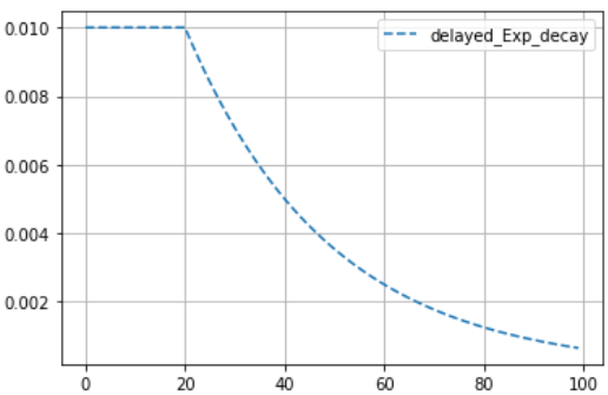

`max(0, epoch-delay)` 가 delay 구간을 만든다. `delay = 0` 이면 보통의 exponential decay 이고, `epoch // decay_steps` 로 바꾸면 계단형 감쇠가 된다.

**Polynomial decay** — lr 구간 (시작 lr − 끝 lr) 에 (1 − 진행률)^power 를 곱하고 끝 lr 을 더한다.

$$\mathrm{lr}(e) = (\mathrm{lr}_0 - \mathrm{lr}_{\mathrm{end}})\,(1 - e/S)^{p} + \mathrm{lr}_{\mathrm{end}}$$

```python
lr_start = 0.01
end_lrate = 0.001
decay_steps = epochs = 100
power=0.5

PolynomialDecay = lambda epoch: (((lr_start - end_lrate)
              * ((1 - epoch / decay_steps) ** (power)) )
            + end_lrate)/lr_start

lr_polt(PolynomialDecay,epochs=epochs,lr_start=lr_start,label='PolynomialDecay')
```

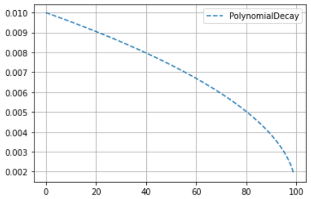

`lr_polt` 가 배율에 `lr_start` 를 곱하므로 함수 끝에서 `lr_start` 로 나누어 배율로 만든다. `power = 0.5` 이면 그림처럼 끝으로 갈수록 가파르게 떨어지고, `power = 1` 이면 직선이 된다.

**InverseTimeDecay** — 진행에 반비례하여 줄어든다.

$$\mathrm{lr}(e) = \frac{\mathrm{lr}_0}{1 + r \cdot e / s}$$

```python
decay_steps = 10
decay_rate = 0.5

InverseTimeDecay = lambda epoch: 1 / (1 +
              decay_rate * epoch / decay_steps)

lr_polt(InverseTimeDecay,epochs=100,lr_start=lr_start,label='InverseTimeDecay')
```

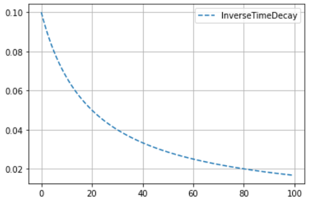

exponential decay 보다 초반 감쇠가 빠르고 후반은 더 완만하다. 그 밖의 다양한 scheduler 는 https://gaussian37.github.io/dl-pytorch-lr_scheduler/ 에 정리되어 있다.

### Cyclic lr scheduler

lr 을 주기적으로 올렸다 내리는 scheduler 도 있다. optimizer 의 현재 lr 은 `optimizer.param_groups[0]["lr"]` 에서 읽을 수 있으므로, step 을 돌리며 값을 모아 그려 본다.

```python
model = torch.nn.Linear(2, 1)
optimizer = torch.optim.SGD(model.parameters(), lr=0.001)
scheduler1 = torch.optim.lr_scheduler.CosineAnnealingLR(
                                        optimizer, T_max=20, eta_min=0)
scheduler2 = torch.optim.lr_scheduler.CosineAnnealingWarmRestarts(
                                        optimizer, 40, T_mult=1, eta_min=0)
scheduler3 = torch.optim.lr_scheduler.CyclicLR(
                                        optimizer, base_lr=0.01,
                                        max_lr=0.1,step_size_up=20)

plt.figure(figsize=(12,3))
for i,scheduler in enumerate([scheduler1, scheduler2, scheduler3]):
  plt.subplot(1,3,i+1)
  lrs = []
  for j in range(100):
      optimizer.step()
      lrs.append(optimizer.param_groups[0]["lr"])
      scheduler.step()
  plt.grid()
  plt.plot(lrs)
plt.show()
```

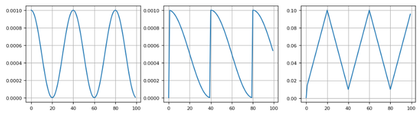

- **CosineAnnealingLR** — `T_max` step 동안 코사인 곡선을 따라 `eta_min` 까지 내려갔다가 다시 올라온다.
- **CosineAnnealingWarmRestarts** — 코사인으로 내려간 뒤 `T_0`(여기서는 40) step 마다 최댓값으로 재시작한다. `T_mult` 로 주기를 늘려 갈 수 있다.
- **CyclicLR** — `base_lr` 과 `max_lr` 사이를 `step_size_up` step 에 걸쳐 직선으로 오르내린다.

### configure_optimizers() override 와 scheduler 적용 결과 비교

scheduler 의 효과를 보기 위해 먼저 scheduler 없는 기준 모델을 학습한다. lr 은 0.005 이고, 비교를 쉽게 하려고 metric 을 epoch level 로 기록한다.

```python
lr = 0.005
class MyModel(L.LightningModule):
    def __init__(self):
        super(MyModel, self).__init__()
        self.layers =  nn.Sequential(
            nn.Flatten(),
            nn.Linear(28*28, 64),
            nn.Linear(64,10)
            )

    def forward(self, x):
        out = self.layers(x)
        return out

    def training_step(self, batch, batch_idx):
        x, y = batch
        y_pred = self(x)
        loss = F.cross_entropy(y_pred, y)
        acc = FM.accuracy(y_pred, y, task="multiclass",num_classes=10)
        metrics = {'loss':loss, 'acc':acc}
        self.log_dict(metrics,prog_bar=True,on_step=False,on_epoch=True)
        return loss

    def validation_step(self, batch, batch_idx):
        x, y = batch
        y_pred = self(x)
        loss = F.cross_entropy(y_pred, y)
        acc = FM.accuracy(y_pred, y, task="multiclass",num_classes=10)
        metrics = {'val_loss':loss, 'val_acc':acc}
        self.log_dict(metrics,prog_bar=True, on_step=False,on_epoch=True)

    def configure_optimizers(self):
        optimizer = optim.Adam(self.parameters(), lr=lr)
        return optimizer

model = MyModel()
summary(model, input_size=(8, 1, 28, 28))
```

```python
%%time
model = MyModel()
epoch=30
name="model_defaults"
logger = L.pytorch.loggers.CSVLogger("logs", name=name)
trainer = L.Trainer(max_epochs=epoch, logger=logger ,overfit_batches=0.4,enable_model_summary=False)
trainer.fit(model, data_module)
```

`overfit_batches=0.4` 는 학습 데이터의 40% 만 써서 30 epoch 을 돌리는 flag 다. 데이터를 줄여 일부러 과적합이 생기게 하면 scheduler 의 효과가 잘 드러난다.

```python
v_num = logger.version
meric_file = f'./logs/{name}/version_{v_num}/metrics.csv'
history = pd.read_csv(meric_file)
print(meric_file) # ./logs/model_defaults/version_0/metrics.csv
history
```

다음으로 적용할 scheduler 는 5 epoch 마다 lr 에 0.3 을 곱하는 계단형 exponential decay 다.

```python
#lr = 0.005
decay_steps = 5
gamma=0.3

exponential_decay_step = lambda epoch: gamma**(epoch // decay_steps)

lr_polt(exponential_decay_step,epochs=epoch,lr_start=lr,label="exp_decay")
```

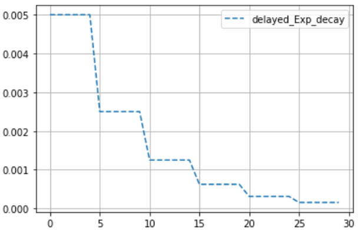

기준 모델을 상속하고 `configure_optimizers()` 만 override 한다. `LambdaLR` 에 위의 배율 함수를 넘기면 custom scheduler 가 된다.

```python
import torch.optim.lr_scheduler as lr_scheduler
# exponential_decay_step = lambda epoch: gamma**(epoch // decay_steps)

class Model_expDeacy(MyModel):
    def __init__(self):
        super(Model_expDeacy, self).__init__()

    def configure_optimizers(self):
        optimizer = torch.optim.Adam(self.parameters(), lr=lr)
        lr_s = lr_scheduler.LambdaLR(optimizer,
                                     lr_lambda = exponential_decay_step)
        return [optimizer], [lr_s]
```

```python
model_exp = Model_expDeacy()
name2="model_exp_decay"
logger = L.pytorch.loggers.CSVLogger("logs", name=name2)
trainer = L.Trainer(max_epochs=epoch, logger=logger ,overfit_batches=0.4,enable_model_summary=False)
trainer.fit(model_exp, data_module)
```

```python
v_num2 = logger.version
meric_file = f'./logs/{name2}/version_{v_num2}/metrics.csv'
history2 = pd.read_csv(meric_file)
```

두 이력을 epoch 별로 정리하여 한 그림에 겹쳐 그린다. 점선이 학습, 실선이 검증이고 `2` 가 붙은 것이 scheduler 를 적용한 모델이다.

```python
h1 = history.drop('step', axis=1).groupby('epoch').last()
h2 = history2.drop('step', axis=1).groupby('epoch').last()
max_1 = h1['val_acc'].max()
max_2 = h2['val_acc'].max()

titles = "Base / lr-schedule"
plt.figure(figsize=(10,3))
plt.subplot(121)
plt.title(f"{titles}\n Max Val_Acc:{max_1:.4f} / {max_2:.4f}")
plt.plot(h1['acc'],'--', label='acc')
plt.plot(h1['val_acc'], label='val_acc')
plt.plot(h2['acc'],'--', label='acc2')
plt.plot(h2['val_acc'], label='val_acc2')
plt.ylim(0.7, 1)
plt.legend()
plt.grid()

plt.subplot(122)
plt.title("Loss")
plt.plot(h1['loss'],'--', label='loss')
plt.plot(h1['val_loss'], label='val_loss')
plt.plot(h2['loss'],'--', label='loss2')
plt.plot(h2['val_loss'], label='val_loss2')
plt.semilogy()
plt.legend()
plt.grid()
plt.show()
```

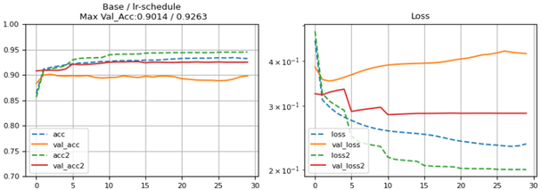

기준 모델은 lr 0.005 를 끝까지 유지하여 학습 loss 는 계속 내려가지만 검증 loss 는 오히려 올라간다 — 과적합이다. scheduler 를 적용한 모델은 lr 이 줄어들면서 검증 loss 가 낮은 수준에서 안정되고 검증 정확도 최댓값이 0.9014 에서 0.9263 으로 올랐다.

---

## 2.1.9 Trainer class — 실행 관리, TensorBoard, Callback
<!-- 슬라이드 138~142 -->

**Trainer class** 는 Training, Testing, Prediction 을 실행하고 관리한다. 사용법은 네 줄이다.

```python
model = LitModel()
trainer = L.Trainer(flags)
trainer.fit(model, trainDataLoader, valDataLoader)
trainer.validate(dataloaders=valDataLoader)
trainer.test(dataloaders=valDataLoader)
```

동작은 생성자의 flag 로 제어한다 (https://lightning.ai/docs/pytorch/latest/common/trainer.html#). 자주 쓰는 flag 는 다음과 같다.

```python
trainer = L.Trainer(flags)
flags :
max_epochs=1000
min_epochs=1
max_steps=100
accelerator="auto"        # CPU,GPU,TPU,auto
deterministic=True        # reproducibility
callbacks=[Callback()]
check_val_every_n_epoch=1 #
gradient_clip_val=0.0
limit_train_batches=0.25  # 25% training / epoch
limit_test_batches=0.25
limit_val_batches=0.25
log_every_n_steps=50
logger=logger
max_time="00:12:00:00"
overfit_batches=10 #or 0.1:
# overfits only 10th batch or 10% of the training set.
precision=32
enable_progress_bar=True
weights_summary="top"     # full,None
enable_model_summary=True
```

- `max_epochs`, `min_epochs`, `max_steps`, `max_time` — 학습 길이. epoch·step·시간 중 먼저 닿는 조건에서 멈춘다.
- `accelerator="auto"` — CPU/GPU/TPU 를 자동으로 고른다.
- `limit_train_batches=0.25` 처럼 비율을 주면 epoch 당 학습 데이터의 25% 만 쓴다. `overfit_batches` 는 정수면 그 수의 batch 만, 소수면 그 비율만 반복해서 쓴다.
- `check_val_every_n_epoch`, `log_every_n_steps` — 검증과 logging 주기.
- `gradient_clip_val`, `precision` — 학습 안정화와 연산 정밀도.
- `callbacks`, `logger` — 뒤에서 다루는 Callback 과 Logger 를 꽂는 자리.
- `enable_progress_bar`, `enable_model_summary` — 화면 출력 제어.

**Reproducibility control.** 같은 결과를 재현하려면 `L.seed_everything()` 으로 seed 를 고정하고 Trainer 에 `deterministic=True` 를 준다. CUDA 에서는 환경변수 `CUBLAS_WORKSPACE_CONFIG=:4096:8` 을 PyTorch 실행 전에 설정해야 한다.

```python
## 사용하기 위해서는 cuda 변경사항 적용이 필요함
##### PyTorch 애플리케이션을 실행하기 전에
## 환경변수에 `CUBLAS_WORKSPACE_CONFIG=:4096:8`추가 해야 함
#!env CUBLAS_WORKSPACE_CONFIG=:4096:8
# L.seed_everything(42, workers=True)
# trainer = L.Trainer(deterministic=True)
```

### TensorBoard 연동

지금까지는 `CSVLogger` 로 이력을 CSV 에 남겼다. `TensorBoardLogger` 를 쓰면 같은 정보가 TensorBoard 형식으로 저장되어 학습 중에도 곡선을 볼 수 있다. Jupyter/Colab 안에서 TensorBoard 를 띄우려면 확장을 로드하고 log 경로를 준다.

```python
#%load_ext tensorboard
%reload_ext tensorboard
%tensorboard --logdir ./tb_logs
```

```python
%%time
model = Model()
#torch.use_deterministic_algorithms(False)
logger = L.pytorch.loggers.TensorBoardLogger("tb_logs", name="my_model")
trainer = L.Trainer(max_epochs=20, logger=logger ,overfit_batches=0.3,enable_model_summary=False)
trainer.fit(model, data_module)
```

```python
### 다시한번 학습해서 version 별로 비교 ###
model = Model()
#torch.use_deterministic_algorithms(False)
logger = L.pytorch.loggers.TensorBoardLogger("tb_logs", name="my_model")
trainer = L.Trainer(max_epochs=20, logger=logger ,overfit_batches=0.3,enable_model_summary=False)
trainer.fit(model, data_module)
```

`TensorBoardLogger("tb_logs", name="my_model")` 은 `tb_logs/my_model/version_N/` 에 기록한다. 같은 이름으로 다시 학습하면 version 번호만 올라가므로, TensorBoard 왼쪽의 Runs 목록에서 `my_model/version_0`, `version_1`, `version_2` 를 체크하여 실행 간 비교를 할 수 있다.

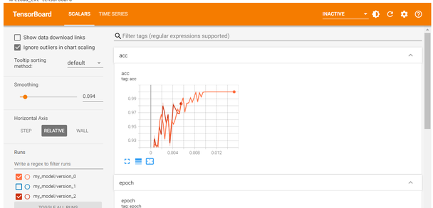

### Callback — training 중에 실행되는 함수

**Callback** 은 trainer 가 실행되는 중에 정해진 시점마다 호출되는 객체다. Lightning 이 제공하는 built-in callback 은 다음과 같다 (https://lightning.ai/docs/pytorch/stable/api_references.html#callbacks).

| Callback | 역할 |
|---|---|
| EarlyStopping | metric 을 감시하다가 개선이 멈추면 학습을 중단 |
| ModelCheckpoint | metric 을 감시하며 주기적으로 모델을 저장 |
| LambdaCallback | lambda 함수로 간단한 callback 을 즉석에서 생성 |
| Callback | 새 callback 을 만들 때 상속하는 abstract base class |
| ModelSummary / RichModelSummary | LightningModule 의 모든 layer 요약 (Rich 는 서식 있는 텍스트) |
| LearningRateMonitor | lr scheduler 의 learning rate 를 자동으로 기록 |
| TQDMProgressBar / ProgressBarBase / RichProgressBar | 진행 막대 (TQDM 이 기본) |
| DeviceStatsMonitor | 학습 중 device 상태를 자동 기록 |
| Timer | train/validation/test loop 에 쓴 시간을 재고 제한 시간이 되면 중단 |
| ModelPruning / QuantizationAwareTraining / GradientAccumulationScheduler | pruning, 양자화 인식 학습, gradient 누적 factor 변경 |

**Early Stopping.** 감시할 metric 과 방향을 준다.

```python
from lightning.pytorch.callbacks.early_stopping import EarlyStopping
EarlyStopping(monitor="val_loss",          # check 기준 값
              min_delta=0.0,               # 최소 gap
              patience=3,
              verbose=False,
              mode='min',                  # 좋아지는 방향
              strict=True,                 #
              check_finite=True,           # infinte,NaN이면 중지
              stopping_threshold=None,     # 커지면 stop
              divergence_threshold=None,   # 차이가 커지면 stop
              check_on_train_epoch_end=None# training 단계에서 check 여부
              )
```

`monitor` 는 `self.log()` 로 기록한 key 이름이어야 한다. `mode='min'` 이면 값이 줄어드는 것이 개선이고 accuracy 라면 `'max'` 를 쓴다. `patience` 는 개선 없이 기다릴 epoch 수, `min_delta` 는 개선으로 인정할 최소 변화량이다. `check_finite=True` 는 값이 무한대나 NaN 이 되면 중지한다. callback 객체를 Trainer 의 `callbacks` 리스트에 넣는다.

```python
from lightning.pytorch.callbacks import EarlyStopping
```

```python
model = Model()

logger = L.pytorch.loggers.CSVLogger("logs", name="model_custom_losses")
trainer = L.Trainer(max_epochs=100, logger=logger,
                     callbacks=[EarlyStopping(monitor="val_acc", mode="max", patience=5)],
                     overfit_batches=0.3,enable_model_summary=False)
trainer.fit(model, data_module)
```

`max_epochs=100` 이지만 `val_acc` 가 5 epoch 동안 오르지 않으면 그 전에 멈춘다. 다음은 `monitor="val_loss", mode="min"` 에 patience 기본값 3 으로 돌렸을 때의 `metrics.csv` 다 (검증 행만 값이 있고 학습 행은 step 만 보인다).

| val_loss | val_acc | epoch | step |
|---|---|---|---|
| 0.2527 | 0.9285 | 0 | 46 |
| 0.2543 | 0.9273 | 1 | 93 |
| 0.2520 | 0.9323 | 2 | 140 |
| 0.2533 | 0.9302 | 3 | 187 |
| 0.2539 | 0.9298 | 4 | 234 |
| 0.2585 | 0.9280 | 5 | 281 |

`val_loss` 의 최솟값은 epoch 2 의 0.2520 이고, 그 뒤 epoch 3·4·5 세 번 연속 개선이 없자 patience 3 을 채워 epoch 5 에서 학습이 멈췄다.

**ModelCheckpoint — 모델 저장.** 학습 중 지정한 metric 기준으로 좋은 모델을 파일로 저장한다.

```python
L.pytorch.callbacks.ModelCheckpoint(
  dirpath='./projecA',
  filename='{epoch}-{val_loss:.2f}-{val_acc:.2f}',
  monitor=None,                # 기준 metric
  verbose=False,
  save_last=None,
  save_top_k=1,                # -1:all model save
  save_weights_only=False,     #default: model save
  mode='min',                  #'max'@accuracy
  auto_insert_metric_name=True,#file name에 추가
  every_n_train_steps=None,    #
  train_time_interval=None,
  every_n_epochs=None,         #
  save_on_train_epoch_end=None)#False:save@end_validation
```

`filename` 에 `{epoch}`, `{val_acc:.4f}` 같은 형식을 넣으면 저장 시점의 값이 파일 이름에 들어간다. `save_top_k=1` 이면 가장 좋은 하나만 남기고 `-1` 이면 전부 저장한다. `save_weights_only=False`(기본) 는 모델 전체를, `True` 는 weight 만 저장한다. `save_on_train_epoch_end=False` 면 검증이 끝난 시점에 저장한다.

```python
from lightning.pytorch.callbacks import ModelCheckpoint

model = Model()

logger = L.pytorch.loggers.TensorBoardLogger("tb_logs", name="sample-mnist")
checkpoint_callback = ModelCheckpoint(
    monitor='val_acc',
    dirpath=f'{logger.log_dir}/ckpt', ## 버전별로 저장됨 ##
    filename='{epoch:02d}-{val_acc:.4f}',
    save_top_k=1)
trainer = L.Trainer(max_epochs=10, logger=logger, callbacks=[checkpoint_callback],
                    overfit_batches=0.3,enable_model_summary=False)
trainer.fit(model, data_module)
```

`dirpath` 를 `logger.log_dir` 아래로 잡았으므로 checkpoint 도 log 와 같은 version 폴더에 들어간다. 저장된 파일과 성능은 callback 객체에서 확인한다.

```python
print(f'{logger.log_dir}/ckpt')
%ls  {logger.log_dir}/ckpt
```

```python
## path와 성능을 보여줌
checkpoint_callback.best_k_models
```

```python
## path만 가져 옴
checkpoint_callback.best_model_path
```

`best_model_path` 는 `epoch=00-val_acc=0.9746.ckpt` 같은 형식의 경로다. 이 경로로 `Model.load_from_checkpoint()` 를 부르면 **새로운 instance** 가 만들어지므로, 학습에 쓴 `model` 과 별개의 `new_model` 로 검증할 수 있다.

```python
### best_model_path에서 모델 읽어 오기
checkpoint_path = checkpoint_callback.best_model_path
# 모델 읽어오기
new_model = Model.load_from_checkpoint(checkpoint_path)
trainer.validate(new_model, data_module)
```

한 실행에서 복원한 모델의 검증 결과는 `val_acc 0.9733, val_loss 0.0848` 이었다.

**Custom callback.** `L.Callback` 을 상속하고 원하는 hook 을 override 하면 된다 (https://lightning.ai/docs/pytorch/stable/api/lightning.pytorch.callbacks.Callback.html#lightning.pytorch.callbacks.Callback). hook 은 fit·validate·test·predict 의 시작과 끝, epoch 과 batch 의 시작과 끝마다 준비되어 있다.

```python
setup   : fit, validate, test, predict, or tune begins.
teardown: fit, validate, test, predict, or tune ends.

on_fit_start: fit begins.
on_fit_end  :

on_train_batch_start: train batch begins.
on_train_batch_end
on_train_epoch_start: train epoch begins.
on_train_epoch_end

on_validation_batch_start
on_validation_batch_end
on_validation_epoch_start
on_validation_epoch_end

on_test_batch_start
on_test_batch_end
on_test_epoch_start
on_test_epoch_end

on_predict_batch_start
on_predict_batch_end
on_predict_epoch_start
on_predict_epoch_end

on_train_start
on_train_end
on_validation_start
on_validation_end
on_test_start
on_test_end
on_predict_start
on_predict_end

on_sanity_check_start: validation sanity check starts.
on_sanity_check_end

on_exception
state_dict
load_state_dict
on_save_checkpoint
on_load_checkpoint
on_before_backward
on_after_backward
on_before_optimizer_step
on_before_zero_grad
```

batch 단위 loss 를 callback 으로 읽어 오는 예다. `on_train_start` 에서 리스트를 만들고, `on_train_epoch_start` 에서 epoch 번호를 찍고, `on_train_batch_end` 에서 `trainer.callback_metrics['loss']` 를 읽어 리스트에 쌓는다.

```python
## batch단위 loss를 callback으로 읽어오기

class MyPrintingCallback(L.Callback):
    def on_train_start(self, trainer, pl_module):
        self.losses = []

    def on_train_epoch_start(self, trainer, pl_module):
        print(f'Epoch : {trainer.current_epoch}')

    def on_train_batch_end(self, *args, **kwargs):
        loss = trainer.callback_metrics['loss']
        self.losses.append(loss)
        print(f'Batch:{trainer.global_step}, loss:{loss}')

model = Model()

logger = L.pytorch.loggers.TensorBoardLogger("tb_logs", name="sample-mnist")
trainer = L.Trainer(max_epochs=2, logger=logger ,
                     callbacks=[MyPrintingCallback()],enable_model_summary=False)
trainer.fit(model, data_module)
```

학습을 시작하면 `Epoch : 0` 다음에 `Batch:1, loss:2.3000118732452393`, `Batch:2, loss:2.253546714782715`, `Batch:3, loss:2.2260019779205322`, … 처럼 batch 마다 한 줄씩 출력된다. 10 class 를 균등하게 찍을 때의 cross entropy 인 약 2.30 에서 시작해 내려간다.

Trainer 에 넘긴 callback 들은 `trainer.callbacks` 리스트에 들어 있다. 첫 번째 callback 이 방금 넘긴 객체이므로 `trainer.callbacks[0].losses` 로 모아 둔 loss 에 접근할 수 있다.

```python
p(trainer.callbacks[0].losses)
```

값은 `[tensor(2.3089), tensor(2.2681), tensor(2.2471), tensor(2.2249), …]` 처럼 GPU tensor 의 리스트다. 그림으로 그리려면 `.cpu()` 로 옮겨 numpy 배열로 만든다.

```python
losses = np.array([i.cpu() for i in trainer.callbacks[0].losses])
```

```python
plt.plot(losses, label="batch_loss")
plt.semilogy()
plt.legend()
plt.grid()
plt.show()
```

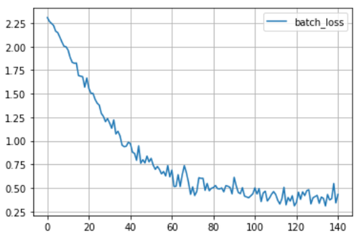

epoch 단위 이력보다 훨씬 촘촘한 batch 단위 loss 곡선이다. logger 가 기록하지 않는 값도 이렇게 callback hook 에서 직접 꺼내 쓸 수 있다.

---

## 2.1.10 Model 저장과 복원
<!-- 슬라이드 143 -->

학습된 모델을 파일로 저장하고 복원하는 API 는 `torch.save` / `torch.load` 다. 두 가지 단위로 저장할 수 있다.

**모델 전체 저장·복원.** 모델 객체 자체를 파일로 쓴다.

```python
## 모델 전체 저장
torch.save(model, './aicamp/model_save.pt')

## v2.6에서 변경됨 weights_only=False 필수
new_model = torch.load('./aicamp/model_save.pt',weights_only=False)

trainer = L.Trainer()
trainer.validate(new_model, data_module)
```

`torch.load` 의 `weights_only` 는 기본값이 `True` 로 바뀌었기 때문에, 모델 전체(클래스 객체) 를 읽을 때는 `weights_only=False` 를 명시해야 한다. 복원한 모델은 곧바로 검증하거나 이어서 학습할 수 있다.

```python
## 추가 학습
trainer = L.Trainer(max_epochs=1,enable_model_summary=False)
trainer.fit(new_model, data_module)
trainer.validate(new_model, data_module)
```

**state_dict 단위 저장·복원.** `state_dict` 는 모델의 parameter 를 layer 단위로 관리하는 dictionary 다. 이것만 저장하면 파일이 가볍고 모델 클래스 정의와 분리된다. 복원할 때는 같은 구조의 모델 instance 를 먼저 만들고 `load_state_dict()` 로 값을 채운다.

```python
## Weight만 저장
# model.state_dict()로 모델 파라메터 저장
torch.save(model.state_dict(), './aicamp/model_dict_save.pt')

# model.load_state_dict()로 파라메터 불러오기
new_model2 = Model()
new_model2.load_state_dict(torch.load('./aicamp/model_dict_save.pt'))
trainer.validate(new_model2, data_module)
```

**Dictionary 구조 확인.** `state_dict` 를 출력하면 `OrderedDict` 이고, key 는 `'linear1.weight'`, `'linear1.bias'`, `'linear2.weight'`, … 같은 **문자열**(layer 이름 + parameter 이름) 이며 값은 tensor 다.

```python
## state_dict 내부 구조 확인
p(model.state_dict())
```

```text
Values: OrderedDict([
        ('linear1.weight', tensor(
          [[ 0.0310, -0.0020, -0.0070,  ..., -0.0213,  0.0240, -0.0339],
          [ 0.0210,  0.0066, -0.0263,  ..., -0.0341, -0.0298,  0.0141],
          ...,
          [ 0.0291, -0.0138,  0.0301,  ...,  0.0352,  0.0098, -0.0098]])),
        ('linear1.bias', tensor(
          [-0.1586, -0.1492,  0.0181,  0.0326, -0.0617, -0.0147, -0.1302,  0.1725,
          ...,
          -0.0202,  0.0855,  0.0736,  0.1041, -0.0128,  0.2063,  0.1225,  0.1850])),
        ('linear2.weight', tensor(
          [[ 1.3412e-03,  1.8246e-02,  2.5799e-02,  ..., -2.2528e-02,
          5.9206e-03,  2.1104e-02]],...))])
```

key 로 layer 의 weight 에 접근할 수 있으므로 layer 별 shape 을 훑어보거나 특정 layer 의 값만 바꿔 넣을 수 있다.

```python
## Layer name으로 weight 접근하기
for param_tensor in model.state_dict():
    print(param_tensor)  # dict, key == Layer name
    print(model.state_dict()[param_tensor].size(),'\n')
```

두 갈래 모델에서는 `linear1.weight torch.Size([32, 784])`, `linear1.bias torch.Size([32])`, `linear2.weight torch.Size([32, 784])`, `linear2.bias torch.Size([32])`, … 순으로 나온다. `nn.Linear(in, out)` 의 weight 가 `(out, in)` 모양으로 저장된다는 점을 확인할 수 있다.

---

## 2.1.11 정리 — LightningModule 과 Trainer
<!-- 슬라이드 144 -->

> **핵심 메시지**
> PyTorch Lightning = **LightningModule class + Trainer class**. LightningModule 은 Methods + Properties + Hooks 로, Trainer 는 Methods + Properties 로 이루어진다.

LightningModule 의 주요 method 는 다음과 같다 (https://pytorch-lightning.readthedocs.io/en/latest/common/lightning_module.html#).

| Method name | Description |
|---|---|
| init | Define computations here |
| forward | Use for inference only (separate from training_step) |
| training_step | the complete training loop |
| validation_step | the complete validation loop |
| test_step | the complete test loop |
| predict_step | the complete prediction loop |
| configure_optimizers | define optimizers and LR schedulers |

가장 작은 LightningModule 은 이 가운데 `__init__`, `forward`, `training_step`, `configure_optimizers` 만 있어도 된다.

```python
class LitModel(L.LightningModule):
    def __init__(self):
        super().__init__()
        self.l1 = nn.Linear(28 * 28, 10)
    def forward(self, x):
        return torch.relu(self.l1(x.view(x.size(0), -1)))
    def training_step(self, batch, batch_idx):
        x, y = batch
        y_hat = self(x)
        loss = F.cross_entropy(y_hat, y)
        return loss
    def configure_optimizers(self):
        return torch.optim.Adam(self.parameters(), lr=0.02)
```

Trainer 의 주요 method 는 네 개다. 예전 버전에 있던 `tune()` method 는 제거되었다.

| Method name | Description |
|---|---|
| init | Customize every aspect of training via flags. |
| fit | Runs the full optimization routine. |
| validate | Perform one evaluation epoch over the validation set. |
| test | Perform one evaluation epoch over the test set. |

```python
model = LitModel()
trainer = L.Trainer(flags)
trainer.fit(model, trainDataLoader, valDataLoader)
trainer.validate(dataloaders=valDataLoader)
trainer.test(dataloaders=valDataLoader)
```

이 절에서 본 것을 workflow 순서로 되짚으면 다음과 같다.

1. **Dataset 준비** — torchvision dataset + DataLoader, 또는 `LightningDataModule` 로 묶기.
2. **Model 정의** — `nn.Module`/`nn.Sequential`/`nn.ModuleList`/`nn.ModuleDict` container 로 layer 를 조립하고, `training_step`·`validation_step`·`test_step`·`predict_step`·`configure_optimizers` 를 채운다. 구조는 `torchinfo.summary` 와 Netron 으로 확인한다.
3. **Model 학습** — `Trainer(flags, logger, callbacks)` 와 `fit()`. 이력은 CSVLogger 나 TensorBoardLogger 로 남기고, EarlyStopping·ModelCheckpoint·custom callback 으로 학습 중 개입한다.
4. **Model 평가** — `validate()`, 이력 곡선, lr scheduler 비교.
5. **Model 시험/적용** — `test()`, `predict()`, `model.eval()` + `torch.no_grad()` 추론, `torch.save`/`torch.load` 로 저장·복원.
