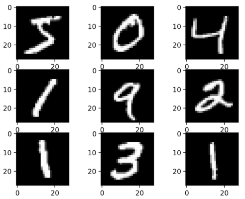
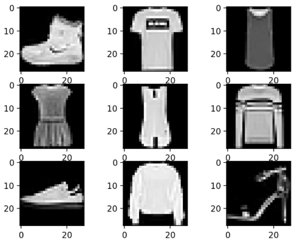
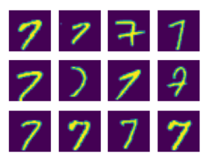
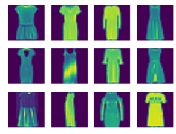
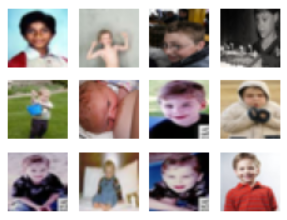

# 2.2 Torchvision datasets API

**학습 목표**

- `torchvision.datasets` 가 기본 제공하는 이미지 데이터셋의 종류를 클래스 수와 규모로 구분할 수 있다.
- transforms v2 로 이미지를 텐서로 바꾸고, `DataLoader` 로 배치 단위로 꺼내는 기본 코드를 쓸 수 있다.
- 같은 클래스에 속한 이미지가 얼마나 다양한지 직접 확인하고, 그것이 분류 문제의 난이도와 어떻게 이어지는지 설명할 수 있다.

**이 절의 구성**

- 2.2.1 torchvision.datasets 의 내장 데이터셋
- 2.2.2 같은 클래스 이미지의 다양성 (실습 2.2.1)
- 2.2.3 정리

---

## 2.2.1 torchvision.datasets 의 내장 데이터셋
<!-- 슬라이드 146 -->

PyTorch 로 이미지 모델을 만들 때 데이터 준비의 출발점은 `torchvision.datasets` 이다. 이 모듈은 딥러닝 교육과 연구에서 기본으로 쓰이는 데이터셋을 **내장 데이터셋(built-in datasets)** 으로 제공한다. 클래스 하나를 호출하면 다운로드, 압축 해제, 학습용·시험용 분할, 이미지와 레이블의 짝 맞추기까지 한 번에 처리되므로, 데이터 파일 형식과 씨름하지 않고 곧바로 모델 실험에 들어갈 수 있다. 전체 목록은 공식 문서(https://pytorch.org/vision/stable/datasets.html)에 있다.

한 가지 미리 알아 둘 점은 **이미지의 높이 H 와 너비 W 가 데이터셋마다 다르다**는 것이다. 손글씨 숫자처럼 작은 흑백 이미지로 된 데이터셋도 있고, 컬러 사진으로 된 데이터셋도 있다. 따라서 모델의 입력 크기와 채널 수는 어떤 데이터셋을 쓰느냐에 따라 달라지며, 이 절의 실습에서 그 차이를 실제 텐서의 shape 으로 확인한다.

아래 표는 자주 쓰이는 내장 데이터셋을 분류 문제의 클래스 수와 학습·시험 데이터 규모로 비교한 것이다.

| 데이터셋 | 클래스 수 | 규모 (학습 + 시험) | 과제 |
|---|---|---|---|
| MNIST | 10 (digits) | 60k + 10k | 손글씨 숫자 분류 |
| Fashion-MNIST | 10 (categories) | 60k + 10k | 옷 종류 분류 |
| CIFAR10 | 10 (categories) | 50k + 10k | 이미지 분류 |
| CIFAR100 | 100 (categories) | 50k + 10k | 이미지 분류 |
| EMNIST | digit + letter, 분할 방식에 따라 47\~62 | 131k \~ 814k | 손글씨 숫자·문자 분류 |
| QMNIST | MNIST 와 같음 (extended MNIST) | 120k | MNIST 확장판 |
| Flowers102 | 102 (categories) | – | 꽃 종류 분류 |

MNIST 와 Fashion-MNIST 는 규모(60k + 10k)와 클래스 수(10)가 같아서 코드를 거의 바꾸지 않고 서로 바꿔 쓸 수 있다. CIFAR10 과 CIFAR100 은 같은 사진 모음을 10개 클래스로 나눈 것과 100개 클래스로 나눈 것으로, 학습 데이터 규모(50k)는 같은데 클래스 수가 10배이므로 클래스당 샘플 수가 10분의 1로 줄어든다. 같은 코드로 문제를 점점 어렵게 만들어 보기에 좋은 구성이다. EMNIST 는 숫자에 알파벳을 더한 것이라 분할 방식에 따라 클래스 수와 규모가 달라지고, QMNIST 는 MNIST 를 확장한 것이다.

MNIST 와 Fashion-MNIST 의 샘플을 보면 두 데이터셋의 성격을 바로 알 수 있다. 둘 다 검은 배경에 흰 획으로 그려진 작은 흑백 이미지이며, 축의 눈금이 보여 주듯 크기도 같다.





이미지 외의 데이터도 같은 방식으로 제공된다. 오디오 데이터셋은 torchaudio (https://pytorch.org/audio/stable/tutorials/audio_datasets_tutorial.html), 텍스트 데이터셋은 torchtext (https://pytorch.org/text/stable/datasets.html) 문서에 정리되어 있다. 어느 쪽이든 "데이터셋 객체를 만들고 `DataLoader` 로 배치를 꺼낸다"는 사용법은 이미지와 같다.

---

## 2.2.2 같은 클래스 이미지의 다양성
<!-- 슬라이드 147 -->

내장 데이터셋을 불러오는 코드는 짧지만, 모델을 설계하기 전에 데이터를 눈으로 보는 습관이 중요하다. 특히 **같은 클래스로 묶인 이미지들이 서로 얼마나 다른가**를 봐야 한다. 같은 숫자 7 이라도 획의 기울기와 굵기, 가로줄의 유무가 제각각이고, 같은 "비행기" 클래스 안에도 활주로 위의 여객기, 하늘을 나는 전투기, 장난감 모형이 섞여 있다. 분류 모델이 배워야 하는 것은 바로 이 다양성을 관통하는 공통 특징이며, 다양성이 클수록 문제는 어려워진다. 이 소절의 실습은 Fashion-MNIST, CIFAR-10, CIFAR-100 을 불러와 클래스 하나를 골라 그 이미지들을 나란히 놓고 비교한다.

### 실습 2.2.1 — Dataset
<!-- 슬라이드 147 -->

> 노트북: `code/2.2.1.Dataset.ipynb`
> [](https://colab.research.google.com/github/AI-BoostCamp/intermediate-deep-learning-pytorch/blob/main/code/2.2.1.Dataset.ipynb)

**데이터셋 준비.** 네 데이터셋을 같은 방식으로 불러온다. `torchvision.datasets` 의 클래스(`MNIST`, `FashionMNIST`, `CIFAR10`, `CIFAR100`)를 import 하고, 이미지를 텐서로 바꾸는 변환(transform)을 `torchvision.transforms.v2` 로 정의한 뒤, 데이터셋 객체를 `DataLoader` 에 넣는다.

```python
import torch
import torchvision
import matplotlib.pyplot as plt

from torchvision.datasets import MNIST, FashionMNIST, CIFAR10, CIFAR100
from torch.utils.data import DataLoader
from torchvision.transforms import v2  ## transforms v2.0 사용

transform = v2.Compose([
    v2.ToImage(),
    v2.ToDtype(torch.float32, scale=True) ] )

epochs=3
batch_size=1024

download_root = './MNIST' # 60000, 10000
train_dataset = MNIST(download_root, transform=transform, train=True, download=True)
test_dataset = MNIST(download_root, transform=transform, train=False, download=True)
trainDataLoader = DataLoader(train_dataset, batch_size=batch_size, shuffle=True)
valDataLoader = DataLoader(test_dataset, batch_size=batch_size, shuffle=False)

download_root = './F-MNIST' # 60000, 10000
fashion_train = FashionMNIST(download_root, transform=transform, train=True, download=True)
fashion_test = FashionMNIST(download_root, transform=transform, train=False, download=True)
fTrainDataLoader = DataLoader(fashion_train, batch_size=batch_size, shuffle=True)
fValDataLoader = DataLoader(fashion_test, batch_size=batch_size, shuffle=False)

download_root = './CIFAR10' # 50000,10000
cifar10_train = CIFAR10(download_root, transform=transform, train=True, download=True)
cifar10_test = CIFAR10(download_root, transform=transform, train=False, download=True)
c10TrainDataLoader = DataLoader(cifar10_train, batch_size=batch_size, shuffle=True)
c10ValDataLoader = DataLoader(cifar10_test, batch_size=batch_size, shuffle=False)

download_root = './CIFAR100' # 50000,10000
cifar100_train = CIFAR100(download_root, transform=transform, train=True, download=True)
cifar100_test = CIFAR100(download_root, transform=transform, train=False, download=True)
c100TrainDataLoader = DataLoader(cifar100_train, batch_size=batch_size, shuffle=True)
c100ValDataLoader = DataLoader(cifar100_test, batch_size=batch_size, shuffle=False)
```

코드의 각 부분이 하는 일은 다음과 같다.

- **변환(transform).** 내장 데이터셋이 돌려주는 원본은 PIL 이미지이므로 모델에 넣으려면 텐서로 바꿔야 한다. `v2.ToImage()` 는 PIL 이미지를 (채널, 높이, 너비) 순서의 이미지 텐서로 바꾸고, `v2.ToDtype(torch.float32, scale=True)` 는 정수 화소값을 `float32` 로 바꾸면서 0\~1 범위로 스케일링한다. 두 단계를 `v2.Compose` 로 묶어 데이터셋 생성자의 `transform` 인자로 넘기면, 이미지를 꺼낼 때마다 자동으로 적용된다.
- **데이터셋 객체.** 첫 인자 `download_root` 는 파일을 내려받아 둘 폴더이고, `download=True` 이면 그 폴더에 파일이 없을 때만 내려받는다. `train=True` 는 학습용 분할, `train=False` 는 시험용 분할이다. 주석의 숫자(60000, 10000 / 50000, 10000)는 앞 소절의 표에 적힌 학습·시험 데이터 규모와 같다.
- **DataLoader.** 데이터셋 객체는 인덱스로 한 장씩 꺼내는 물건이고, `DataLoader` 는 그것을 `batch_size` 장씩 묶어 (배치, 채널, 높이, 너비) 모양의 텐서로 돌려준다. 학습용 로더는 `shuffle=True` 로 매 epoch 순서를 섞고, 검증용 로더는 `shuffle=False` 로 순서를 고정한다. 여기서는 배치 크기를 1024 로 크게 잡아 한 배치 안에 클래스마다 샘플이 여러 장 들어오도록 했다. `epochs=3` 은 이 노트북에서는 쓰이지 않는다.

**클래스 하나의 이미지 모아 보기.** 다음 함수는 배치 하나(`data`, `lable`)에서 레이블이 `target` 인 이미지만 골라 3행 12열, 총 36장을 그린다.

```python
## target lable의 image 확인하기
def img_plot(data, lable, target):
    plt.figure(figsize=(12, 3))
    idx = 0
    data_ = data.permute(0, 2, 3, 1) #(c,h,w)->(h,w,c)
    for i in range(36):
        while lable[idx] != target :
            idx += 1
            if idx >=1024 : idx=0
        plt.subplot(3, 12, i+1)
        if data_.shape[-1] == 1:
            data_ = data_[..., 0]
        plt.imshow(data_[idx])
        plt.axis("off")
        idx += 1
    plt.show()
```

`permute(0, 2, 3, 1)` 은 PyTorch 의 (배치, 채널, 높이, 너비) 순서를 matplotlib 이 기대하는 (배치, 높이, 너비, 채널) 순서로 바꾼다. 흑백 이미지는 채널이 1개이므로 `data_[..., 0]` 으로 채널 축을 떼어 2차원 배열로 만들어야 `imshow` 가 흑백으로 그린다. `while` 문은 레이블이 `target` 과 다른 샘플을 건너뛰고, 인덱스가 배치 끝(1024)에 닿으면 0 으로 되돌려 처음부터 다시 찾는다. 배치 안에 그 클래스의 샘플이 36장보다 적으면 같은 이미지가 반복해서 그려진다.

**데이터셋별로 확인.** 로더에서 첫 배치를 꺼내 shape 을 확인하고, 클래스 하나를 골라 그려 본다.

```python
x_train, y_train = next(iter(trainDataLoader))      # MNIST
print(x_train.shape, x_train.dtype)
img_plot(x_train, y_train, 9)

x_train, y_train = next(iter(fTrainDataLoader))     # Fashion-MNIST
print(x_train.shape, x_train.dtype)
img_plot(x_train, y_train, 0)

x_train, y_train = next(iter(c10TrainDataLoader))   # CIFAR10
print(x_train.shape, x_train.dtype)
img_plot(x_train, y_train, 6)

x_train, y_train = next(iter(c100TrainDataLoader))  # CIFAR100, bs:1024 / class:100
print(x_train.shape, x_train.dtype)
img_plot(x_train, y_train, 2)

(y_train[:]==1).sum()   ## 1024중에 10개정도
```

`next(iter(loader))` 는 로더를 반복자로 만들어 첫 배치만 꺼내는 관용구다. 출력된 shape 을 보면 배치 크기는 모두 1024 로 같지만 채널 수와 높이·너비는 데이터셋마다 다르다는 것, 즉 앞 소절에서 말한 "H, W 는 데이터셋마다 다르다"를 실제 텐서로 확인할 수 있다. `target` 을 바꿔 가며 원하는 클래스를 볼 수 있으며, 클래스 번호와 이름의 대응은 다음과 같다.

- Fashion-MNIST: 0 T-shirt/top, 1 Trouser, 2 Pullover, 3 Dress, 4 Coat, 5 Sandal, 6 Shirt, 7 Sneaker, 8 Bag, 9 Ankle boot
- CIFAR10: 0 airplane, 1 automobile, 2 bird, 3 cat, 4 deer, 5 dog, 6 frog, 7 horse, 8 ship, 9 truck
- CIFAR100: 100개 클래스 이름은 https://huggingface.co/datasets/cifar100 참조

마지막 줄 `(y_train[:]==1).sum()` 은 CIFAR100 배치 안에서 클래스 1 인 샘플이 몇 장인지 센다. 클래스가 100개이므로 1024장짜리 배치에도 한 클래스는 10장 정도밖에 들어 있지 않다. 그래서 CIFAR100 을 그릴 때는 `img_plot` 이 배치를 몇 바퀴 돌며 같은 이미지를 반복해 보여 주게 된다. 클래스 수가 늘면 클래스당 데이터가 그만큼 귀해진다는 사실을 배치 하나에서도 체감할 수 있다.

**결과 읽기.** 아래 네 그림은 이 함수로 MNIST 의 7, Fashion-MNIST 의 3(Dress), CIFAR-10 의 0(airplane), CIFAR-100 의 11 을 각각 그린 것이다.



MNIST 의 7 은 가장 단순한 경우인데도 획의 기울기, 굵기, 가로줄 유무가 모두 다르다. 사람에게는 모두 7 이지만 화소 배열로 보면 서로 꽤 다른 입력이다.



Fashion-MNIST 의 Dress 는 소매가 있는 것과 없는 것, 짧은 것과 긴 것, 밝은 천과 어두운 천이 섞여 있다. 같은 "옷 종류" 라는 클래스가 손글씨 숫자보다 훨씬 넓은 범위의 모양을 품고 있다.


CIFAR-10 의 airplane 에 이르면 컬러 사진이 되고, 배경(하늘, 활주로, 흰 바탕), 촬영 각도, 크기, 기종이 모두 달라진다. 배경과 물체를 구분하는 일까지 모델의 몫이 된다.



CIFAR-100 의 클래스 11 은 아이(소년) 사진들이다. 얼굴 정면, 전신, 흑백 사진, 흐릿한 사진까지 섞여 있어 다양성이 가장 크다. 클래스당 학습 데이터는 CIFAR-10 의 10분의 1이면서 다양성은 더 크니, 같은 모델이라도 CIFAR-100 에서 성능을 내기가 훨씬 어렵다.

> **핵심 메시지**
> 같은 클래스 안 이미지의 다양성이 클수록, 그리고 클래스당 샘플이 적을수록 분류는 어려워진다. 데이터셋을 고른 뒤에는 반드시 클래스 몇 개를 직접 그려 보고 모델이 풀어야 할 문제의 난이도를 가늠한다.

---

## 2.2.3 정리
<!-- 슬라이드 146~148 -->

- `torchvision.datasets` 는 MNIST, Fashion-MNIST, CIFAR10, CIFAR100, EMNIST, QMNIST, Flowers102 등 내장 데이터셋을 제공하며, 이미지의 H, W 와 채널 수는 데이터셋마다 다르다. 오디오와 텍스트도 torchaudio, torchtext 에 같은 형태로 준비되어 있다.
- 불러오는 코드는 "transform 정의 → 데이터셋 객체 생성(`train`, `download`) → `DataLoader` 로 배치화" 세 단계로 항상 같다. transforms v2 의 `ToImage` 와 `ToDtype(scale=True)` 가 PIL 이미지를 0\~1 범위의 `float32` 텐서로 바꾼다.
- 배치 텐서의 순서는 (배치, 채널, 높이, 너비)이며, matplotlib 으로 그리려면 `permute` 로 채널을 맨 뒤로 보내고 흑백은 채널 축을 뗀다.
- 같은 클래스 이미지의 다양성은 MNIST → Fashion-MNIST → CIFAR-10 → CIFAR-100 순으로 커지고, 클래스당 샘플 수는 줄어든다. 모델을 만들기 전에 데이터를 직접 그려 보는 것이 이 절의 핵심 습관이다.
