# 2.3 PyTorch APIs

**학습 목표**

- Tensor 가 데이터(값)와 gradient 정보를 함께 담는 구조임을 이해하고, `requires_grad`·`backward()`·`grad`·`grad_fn`·`detach()` 를 다룰 수 있다.
- 순전파 때 동적으로 만들어지는 계산 그래프(computation graph)와 역전파(backpropagation)의 관계를 설명할 수 있다.
- `nn.Linear` 처럼 parameter 를 갖는 layer 의 `state_dict()`·`named_parameters()`·`parameters()` 가 무엇을 돌려주는지 구분할 수 있다.
- `torch.nn` 의 layer 범주와 activation 함수(ReLU 계열, SELU·SiLU·Mish, GELU·GLU 계열)의 수식과 특징을 비교할 수 있다.
- Dropout·BatchNormalization·Weight decay 를 모델에 적용하고 학습 곡선으로 그 효과를 확인할 수 있다.

**이 절의 구성**

- 2.3.1 Tensor — 데이터와 gradient 정보
- 2.3.2 Computation graph 와 backpropagation
- 2.3.3 Parameter 를 갖는 Layer
- 2.3.4 Layers API overview
- 2.3.5 Activation 함수
- 2.3.6 Activation 함수 적용 결과 비교
- 2.3.7 Dropout layer
- 2.3.8 BatchNormalization layer
- 2.3.9 Weight decay
- 2.3.10 실습과제 — Model 기본 설계
- 2.3.11 정리

---

## 2.3.1 Tensor — 데이터와 gradient 정보
<!-- 슬라이드 150 -->

PyTorch 의 기본 자료형은 텐서(Tensor)다. 겉모습은 NumPy 의 `np.ndarray` 와 거의 같아서 생성·인덱싱·행렬 곱을 같은 감각으로 쓸 수 있지만, 안쪽 구조가 다르다. Tensor 는 **데이터(값)** 에 더해 **gradient 정보**를 함께 갖는다. gradient 정보란 역전파로 계산된 미분값(`grad`)이거나, 그 텐서를 만들어 낸 연산을 기억하는 `grad_fn` 객체다. 텐서에 `requires_grad = True` 를 주면 autograd 가 그 텐서에 가해지는 모든 연산을 기록하기 시작하고, 이 기록이 뒤에서 볼 계산 그래프가 된다.

### 실습 2.3.1 — Tensor 와 Layer API
<!-- 슬라이드 150 -->

> 노트북: `code/2.3.1.Tensor_LayerAPI.ipynb`
> [](https://colab.research.google.com/github/AI-BoostCamp/intermediate-deep-learning-pytorch/blob/main/code/2.3.1.Tensor_LayerAPI.ipynb)

이 노트북은 Tensor 의 기본 조작부터 계산 그래프, Layer 의 parameter 접근, activation 함수 비교, Dropout·BatchNormalization·Weight decay 적용 실험까지 이 절의 이론 부분(2.3.1\~2.3.9)을 순서대로 따라간다. 아래 소절의 코드는 모두 이 노트북에서 가져온 것이다.

**Tensor 만들기.** `torch.Tensor()` 에 파이썬 리스트를 주면 값으로 채워진 텐서가, 정수 몇 개를 주면 그 크기의(값은 임의인) 텐서가 만들어진다. `torch.rand()` 는 0\~1 사이의 난수로 채운다. 크기는 `.shape` 속성과 `.size()` 메서드 어느 쪽으로도 읽을 수 있고 둘은 같은 `torch.Size` 를 돌려준다.

```python
x = torch.Tensor([[1, 2], [3, 4]]) # (2,2)  값으로 생성
x = torch.Tensor([2, 3, 4])        # (3,)
x = torch.Tensor(3)                # (3,)   크기만 지정, 값은 임의
x = torch.Tensor(2, 3, 4)          # (2,3,4)
x = torch.rand(2, 3, 4)            # (2,3,4) random 값

## .shape == .size()
print(x.shape)  # torch.Size([2, 3, 4])
print(x.size()) # torch.Size([2, 3, 4])
```

**ndarray 와 서로 바꾸기.** `torch.from_numpy()` 는 ndarray 를 텐서로, `tensor.numpy()` 는 텐서를 ndarray 로 바꾼다. 두 경우 모두 메모리를 공유하므로 한쪽을 바꾸면 다른 쪽도 바뀐다.

```python
# 변환하기 ndarray <-> tensor
np_arr = np.array([[1, 2], [3, 4]])
tensor = torch.from_numpy(np_arr)   # ndarray -> tensor
np_arr = tensor.numpy()             # tensor  -> ndarray
```

**인덱싱과 슬라이싱.** ndarray 와 같은 문법을 쓴다. `x[:, 1]` 은 두 번째 열, `x[0]` 은 첫 행이다.

```python
## nd.array 처럼 indexing/slicing 가능
x = torch.arange(12).view(3, 4)
print(x)
print(x[:, 1])  # Second column
print(x[0])     # First row
```

**행렬 곱.** `torch.matmul()` 이 일반적인 행렬 곱이다. 2차원끼리는 `.mm()`, 배치 차원이 붙은 3차원 텐서끼리는 `.bmm()` 을 쓸 수도 있다.

```python
## matrix multiplications
x = torch.arange(6).view(2, 3)
W = torch.arange(6).view(3, 2)
h = torch.matmul(x, W) # or .mm or .bmm(batch_mm, for 3D)
print(torch.mm(x, W))
```

**덧셈과 in-place 연산.** `x1 + x2` 는 새 텐서를 만든다. 반면 이름 끝에 밑줄이 붙은 `add_()` 같은 메서드는 호출한 텐서 자신을 바꾸는 **in-place 연산**이다. PyTorch 에서 `무엇_()` 꼴의 메서드는 모두 이 규칙을 따른다.

```python
# add
x1 = torch.Tensor([[1, 2], [3, 4]])
x2 = torch.Tensor([[1, 2], [3, 4]])
y = x1 + x2
print("Y", y)

# in-place operation: ??_()
x2.add_(x1)
print("X2", x2)
```

**reshape, view, permute.** 세 가지 모두 텐서의 모양을 바꾸지만 동작이 다르다. `view` 는 메모리를 복사하지 않고 같은 데이터를 다른 모양으로 보는 것이라 메모리가 연속(contiguous)인 텐서에만 쓸 수 있다. `permute` 는 차원의 순서를 실제로 바꾸므로 그 결과는 더 이상 contiguous 가 아니고, 여기에 곧바로 `view` 를 걸면 오류가 난다. `reshape` 는 필요하면 복사해서 contiguous 텐서를 만들어 주므로 안전하고, 랭크(차원 수)도 바꿀 수 있다.

```python
## view, reshape, permute
x = torch.arange(6)
x = x.view(2, 3)     # contiguous한 tensor만 가능
print("X", x, x.is_contiguous())      # True

x = x.permute(1, 0)  # Swapping dimension 0 and 1
print("X", x, x.is_contiguous())      # False
#x = x.view(2, 3)    # Error!
print("X", x.contiguous().view(2,3))  # contiguous 로 만든 뒤에는 가능

x = x.reshape(3, 2)  # reshape : 필요시 복사
print("X", x, x.is_contiguous())
```

**requires_grad flag.** gradient 는 실수(float) 텐서만 가질 수 있다. `x.requires_grad_(True)` 로 이미 만든 텐서에 flag 를 in-place 로 켤 수도 있고, 생성할 때 `requires_grad=True` 를 줄 수도 있다. 이 flag 가 켜진 순간부터 autograd 는 이 텐서가 관여하는 연산을 기록한다.

```python
## float 값만 gradient값을 가질 수 있음
x = torch.arange(3, dtype=torch.float32)
x.requires_grad_(True)     # _() in-place oper.

x = torch.arange(3, dtype=torch.float32, requires_grad=True)
```

---

## 2.3.2 Computation graph 와 backpropagation
<!-- 슬라이드 151~152 -->

`requires_grad=True` 인 텐서에서 시작해 연산을 이어 가면 PyTorch 는 그 연산의 순서를 **계산 그래프(computation graph)** 로 기록한다. 결과 텐서에서 `backward()` 를 부르면 그래프를 거꾸로 따라가며 각 입력에 대한 미분값을 계산해 `grad` 에 쌓는다. 이것이 역전파다. 그래프에 묶여 있는 텐서는 `numpy()` 로 바로 바꿀 수 없고, `tensor.detach()` 로 그래프에서 떼어 낸 뒤에 바꿔야 한다.

먼저 한 변수 함수 $y = (x-2)^2 + 10$ 으로 확인한다. $x$ 를 $-5$ 에서 $5$ 사이의 100 개 점으로 만들고 각 점마다 $y$ 를 계산한 뒤 `backward()` 를 부르면, `x.grad` 에 그 점에서의 기울기가 쌓인다. 루프 안에서 `y_.detach().numpy()` 로 값을 꺼내는 것은 그래프에 묶인 텐서를 그대로 numpy 로 바꿀 수 없기 때문이다.

```python
def func(x):
  y = (x-2)**2 + 10
  return y

yl=[]
x = torch.linspace(-5,5,100,requires_grad=True)

for i, x_ in enumerate(x):
  y_ = func(x_)
  y_.backward()                     # 이 점에서의 미분값이 x.grad 에 쌓인다
  yl.append(y_.detach().numpy())    # 그래프에서 떼어 낸 뒤 numpy 로

y = np.array(yl)
print('\nx.grad:',x.grad)           # backprop 으로 계산된 gradient
```

```python
plt.plot(x.detach().numpy(), y,      label='y')
plt.plot(x.detach().numpy(), x.grad, label='grad(func(x))')
plt.grid()
plt.legend()
plt.show()
```

그림에서 파란 곡선이 $y$, 주황 직선이 `x.grad` 다. 포물선의 최솟값인 $x=2$ 에서 기울기가 0 을 지나고, 그 왼쪽은 음수, 오른쪽은 양수가 된다. $y$ 를 최대 또는 최소로 만드는 $x$ 를 찾으려면 $y$ 를 $x$ 로 편미분해야 하는데, 그 일을 `backward()` 한 줄이 대신해 준 셈이다.

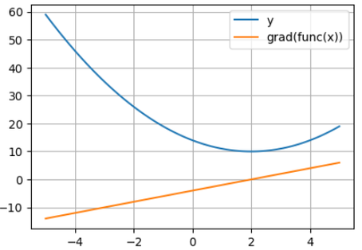

**동적 계산 그래프.** 이번에는 벡터 입력 $x = (0, 1, 2)$ 에 대해 `a = x + 2`, `b = a ** 2`, `c = b + 3`, `y = c.mean()` 을 차례로 계산한다. 함수 `func` 가 실행되는 순서 그대로 그래프가 만들어지므로 "동적(dynamic)" 그래프라고 부른다. 아래 그림이 그 그래프다. 입력 `x` 와 상수 `2` 에서 `a` 가, `a` 에서 `b` 가, `b` 와 상수 `3` 에서 `c` 가, `c` 에서 `y` 가 만들어진다.

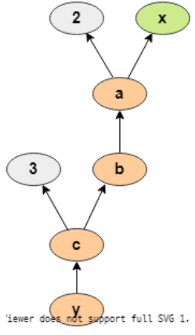

```python
# Dynamic Computation Graph and Backpropagation
x = torch.arange(3, dtype=torch.float32, requires_grad=True)
print("X", x)

def func(x):
  a = x + 2
  print("a",a)
  b = a ** 2
  print("b",b)
  c = b + 3
  print("c",c)
  return c.mean()

y = func(x)
print("Y", y)
```

출력을 보면 중간 텐서마다 자기를 만든 연산이 `grad_fn` 으로 붙어 있다.

```text
X tensor([0., 1., 2.], requires_grad=True)
a tensor([2., 3., 4.], grad_fn=<AddBackward0>)
b tensor([ 4.,  9., 16.], grad_fn=<PowBackward0>)
c tensor([ 7., 12., 19.], grad_fn=<AddBackward0>)
Y tensor(12.6667, grad_fn=<MeanBackward0>)
```

`a` 는 덧셈으로 만들어졌으니 `AddBackward0`, `b` 는 거듭제곱이니 `PowBackward0`, `y` 는 평균이니 `MeanBackward0` 다. 이 `grad_fn` 이 곧 "y 를 만들어 내는 함수"의 기록이고, 역전파 때 각 노드에서 어떤 미분 규칙을 적용할지 알려 준다.

```python
print('x.grad:',x.grad)   # backward 전 : None
y.backward()
print('x.grad:',x.grad)   # 각 x 성분에 대한 미분값
```

`backward()` 뒤에 `x.grad` 는 `tensor([1.3333, 2.0000, 2.6667])` 이 된다. $y$ 는 세 성분의 평균이므로 각 성분에 대한 미분값은 $2(x_i+2)/3$ 이고, $x=(0,1,2)$ 를 넣으면 $4/3, 6/3, 8/3$ 이 나온다. 코드가 한 일이 바로 이 편미분이다.

한 가지 규칙을 기억해 두자. **`grad` 와 `grad_fn` 은 둘 중 하나만 갖는다.** 사용자가 직접 만든 잎(leaf) 텐서 `x` 는 `grad` 를 갖고 `grad_fn` 은 `None` 이다. 연산으로 만들어진 `y` 는 `grad_fn` 을 갖고 `grad` 는 `None` 이다.

```python
## .grad와 .grad_fn 둘중에 하나만
p(x,'x')
p(x.grad,'x.grad')
#p(x.grad_fn,'x.grad_fn') #None

p(y,'y')
#p(y.grad,'y.grad')       #None
p(y.grad_fn,'y.grad_fn')  # <MeanBackward0 object at ...>
```

---

## 2.3.3 Parameter 를 갖는 Layer
<!-- 슬라이드 153~154 -->

Layer 는 함수와 비슷하게 호출할 수 있지만, 함수와 달리 **상태(parameter)를 유지**한다. Parameter 는 학습을 통해 수정되는 가중치(weight)이고, 훈련 중에 optimizer 가 값을 갱신한다. 가장 단순한 예가 Linear layer 다.

$$
y = xA^{T} + b \qquad (y = xW^{T} + b)
$$

여기서 $A$(또는 $W$)는 weight 또는 kernel weight 이고, $b$ 는 bias 또는 bias weight 이다. 아래 코드는 입력 10, 출력 2 인 Linear layer 와 ReLU 를 `nn.Sequential` 로 묶고, 3 개의 샘플(각 10 차원)을 넣어 출력을 얻는다. `torch.manual_seed(42)` 는 가중치 초기값을 재현 가능하게 고정한다.

```python
torch.manual_seed(42)  # Setting the seed

layer = nn.Sequential(
    nn.Linear(10, 2),
    nn.ReLU())

inputs = torch.rand((3, 10))
outputs = layer(inputs)      # 함수처럼 호출한다
```

`layer` 는 `torch.nn.modules.container.Sequential` 클래스이고, `layer[0]` 처럼 번호로 안의 Linear 를 꺼낼 수 있다. `outputs` 의 shape 은 `(3, 2)` — 샘플 3 개, 노드 2 개다.

**`layer.state_dict()`** 는 layer 가 가진 텐서를 `OrderedDict` 로 돌려준다. 키는 `'0.weight'`, `'0.bias'` 처럼 `층번호.이름` 꼴이다. `'0.weight'` 의 shape 은 `[2, 10]`(출력 노드 2 × 입력 10), `'0.bias'` 는 `[2]` 다. 이 딕셔너리의 값은 **`requires_grad` 속성이 없는** 순수한 텐서라서 모델 저장·복원(2.1 절)에 쓰기 좋다. Parameter 가 없는 ReLU 의 `state_dict()` 는 빈 딕셔너리다.

```python
## layer 번호로 접근 : Flag 정보 없는 dictionary type
p(layer.state_dict(),'layer')       # all layers weight,bias
p(layer[0].state_dict(),'layer[0]') #(2 node):weight,bias
p(layer[1].state_dict(),'layer[1]') # Null Dict.

## Key로 접근
p(layer[0].state_dict()['weight'])        #(2,10)
p(layer[0].state_dict()['weight'][0,0:3]) #(3,)
p(layer[0].state_dict()['bias'])          #(2,)

p(outputs)  #(3,2)
```

**`layer.named_parameters()`** 는 `(이름, parameter)` 튜플을 내놓는 generator 다. 여기서 parameter 는 `torch.nn.parameter.Parameter` 클래스로, Tensor 클래스의 일부(하위 클래스)이면서 "학습 대상" 이라는 표시를 가진 것이다. 그래서 `state_dict()` 와 달리 **`requires_grad=True` flag 가 포함**되어 나온다. Parameter 가 없는 ReLU 는 건너뛴다.

```python
layer.named_parameters() # Generator 임

## Flag 정보 포함
m = next(layer.named_parameters())
p(m,'named_para.')  # (name, parameter)
p(m[0],'name')      # '0.weight'
p(m[1],'parameter') # Parameter containing: tensor([[...]], requires_grad=True)

## parameter가 없는 ReLU는 skip ##
for name, param in layer.named_parameters() :
  p(name,"name")
  p(param,"param")
```

첫 원소의 이름은 `'0.weight'` 이고 값은 shape `[2, 10]` 의 `Parameter` 다. 이름 없이 텐서만 필요하면 `layer.parameters()` 를 쓴다. optimizer 를 만들 때 `torch.optim.Adam(model.parameters(), ...)` 로 넘기는 것이 바로 이것이다. 하위 module 자체를 순회하려면 `layer.children()` 을 쓰는데, 이때는 parameter 가 없는 ReLU 도 module 이므로 보인다.

```python
## name 빼고, parameter만 가져오기 ##
for param in layer.parameters() :
  p(param,"param")

## 하위 module 참조하기 : ReLU도 보임 ##
for child in layer.children(): # module <- generator
  print("[child]:",child)
  for param in child.parameters(): # ReLU는 parameter가 없으므로 skip
    print(f"-[param]:({param.size()}):",param)
```

> **핵심 메시지**
> `state_dict()` 는 flag 없는 텐서 딕셔너리(저장·복원용), `named_parameters()`/`parameters()` 는 `requires_grad` 를 가진 학습 대상 Parameter(optimizer 용), `children()` 은 하위 module 이다.

---

## 2.3.4 Layers API overview
<!-- 슬라이드 155 -->

`torch.nn` 이 제공하는 layer 를 범주별로 정리하면 다음과 같다. 이 절에서는 Linear·Activation·Dropout·Normalization 을 다루고, Convolution·Pooling·Padding 은 3장, Recurrent 는 5장, Transformer·Sparse(Embedding) 는 그 뒤 장에서 쓴다.

| 범주 | Layer |
|---|---|
| Linear Layers | `nn.Identity`, `nn.Linear`, `nn.Bilinear`, `nn.LazyLinear` |
| Non-linear Activations (weighted sum, nonlinearity) | `nn.ELU`, `nn.Hardshrink`, `nn.Hardsigmoid`, `nn.Hardtanh`, `nn.Hardswish`, `nn.LeakyReLU`, `nn.LogSigmoid`, `nn.MultiheadAttention`, `nn.PReLU`, `nn.ReLU`, `nn.ReLU6`, `nn.RReLU`, `nn.SELU`, `nn.CELU`, `nn.GELU`, `nn.Sigmoid`, `nn.SiLU`, `nn.Mish`, `nn.Softplus`, `nn.Softshrink`, `nn.Softsign`, `nn.Tanh`, `nn.Tanhshrink`, `nn.Threshold`, `nn.GLU` |
| Non-linear Activations (other) | `nn.Softmin`, `nn.Softmax`, `nn.Softmax2d`, `nn.LogSoftmax`, `nn.AdaptiveLogSoftmaxWithLoss` |
| Recurrent layers | `nn.RNNBase`, `nn.RNN`, `nn.LSTM`, `nn.GRU`, `nn.RNNCell`, `nn.LSTMCell`, `nn.GRUCell` |
| Convolution layers | `nn.Conv1d/2d/3d`, `nn.ConvTranspose1d/2d/3d`, `nn.LazyConv1d/2d/3d`, `nn.LazyConvTranspose1d/2d/3d`, `nn.Unfold`, `nn.Fold` |
| Dropout Layers | `nn.Dropout`, `nn.Dropout2d`, `nn.Dropout3d`, `nn.AlphaDropout`, `nn.FeatureAlphaDropout` |
| Normalization Layers | `nn.BatchNorm1d/2d/3d`, `nn.LazyBatchNorm1d/2d/3d`, `nn.GroupNorm`, `nn.SyncBatchNorm`, `nn.InstanceNorm1d/2d/3d`, `nn.LazyInstanceNorm1d/2d/3d`, `nn.LayerNorm`, `nn.LocalResponseNorm` |
| Pooling layers | `nn.MaxPool1d/2d/3d`, `nn.MaxUnpool1d/2d/3d`, `nn.AvgPool1d/2d/3d`, `nn.FractionalMaxPool2d/3d`, `nn.LPPool1d/2d`, `nn.AdaptiveMaxPool1d/2d/3d`, `nn.AdaptiveAvgPool1d/2d/3d` |
| Padding Layers | `nn.ReflectionPad1d/2d/3d`, `nn.ReplicationPad1d/2d/3d`, `nn.ZeroPad2d`, `nn.ConstantPad1d/2d/3d` |
| Shuffle Layers | `nn.ChannelShuffle` |
| Transformer Layers | `nn.Transformer`, `nn.TransformerEncoder`, `nn.TransformerDecoder`, `nn.TransformerEncoderLayer`, `nn.TransformerDecoderLayer` |
| Sparse Layers | `nn.Embedding`, `nn.EmbeddingBag` |
| Vision Layers | `nn.PixelShuffle`, `nn.PixelUnshuffle`, `nn.Upsample`, `nn.UpsamplingNearest2d`, `nn.UpsamplingBilinear2d` |

이름 앞에 `Lazy` 가 붙은 layer 는 입력 크기(`in_features`, `in_channels`)를 적지 않아도 첫 입력이 들어올 때 스스로 정한다. 전체 목록과 각 layer 의 인자는 PyTorch 문서(`torch.nn`)에서 확인한다.

---

## 2.3.5 Activation 함수
<!-- 슬라이드 156~159 -->

### 활성함수 목록과 수식
<!-- 슬라이드 156 -->

Activation 함수는 크게 인자가 없는 기본형과 ReLU 에서 파생된 변형으로 나눌 수 있다. 먼저 인자 없이 쓰는 함수들이다.

| Layer | 수식 | 이름 |
|---|---|---|
| `nn.ReLU` | $\max(0, x)$ | Rectified Linear Unit |
| `nn.Sigmoid` | $1/(1+e^{-x})$ | Sigmoid(Logistic) |
| `nn.Tanh` | $\tanh(x) = (e^{x}-e^{-x})/(e^{x}+e^{-x})$ | Hyperbolic tangent |
| `nn.SiLU` | $x \cdot \mathrm{sigmoid}(x)$ | Sigmoid Linear Unit (= Swish) |
| `nn.Mish` | $x \cdot \tanh(\mathrm{softplus}(x))$ | Mish |
| `nn.Softsign` | $x/(\lvert x\rvert + 1)$ | Softsign |
| `nn.Softplus` | $\log(e^{x}+1)$ | Softplus |
| `nn.Softmax` | $x_i = e^{x_i}/\sum_j e^{x_j}$ | 분류(출력층)용 |

다음은 ReLU 에서 파생된 함수들이다. 음수 영역을 어떻게 처리하느냐가 서로 다르다.

| Layer | 수식 | 설명 |
|---|---|---|
| `nn.Threshold` | $x$ if $x > \mathrm{threshold}$ else $\mathrm{value}$ | 문턱값 아래를 상수로 |
| `nn.LeakyReLU` | $\max(0,x) + a \cdot \min(0,x),\ a = 0.01$ | 음수 영역에 작은 기울기 |
| `nn.PReLU` | $\max(0,x) + a \cdot \min(0,x)$, $a$ 는 parameter | 기울기 $a$ 를 학습 |
| `nn.ReLU6` | $\min(\max(0,x), 6)$ | 위쪽을 6 으로 자름 |
| `nn.RReLU` | $\max(0,x) + a \cdot \min(0,x),\ a \sim U(0.125, 0.333\ldots)$ | randomized LeakyReLU |
| `nn.ELU` | $\max(0,x) + \alpha (e^{x}-1)\ (x<0),\ \alpha = 1$ | Exponential Linear Unit |
| `nn.SELU` | $\mathrm{scale} \cdot (\max(0,x) + \min(0, \alpha (e^{x}-1)))$, $\alpha = 1.673\ldots$, $\mathrm{scale} = 1.0507\ldots$ | Scaled ELU |
| `nn.CELU` | $\max(0,x) + \min(0, \alpha (\exp(x/\alpha) - 1))$ | Continuously Differentiable ELU |

각 변형의 성격은 다음과 같이 요약된다.

- **ELU** 는 ReLU 보다 학습 속도를 개선할 수 있지만 지수 계산 때문에 계산 비용이 높다.
- **CELU** 는 ELU 보다 수치적으로 안정적이며, 더 빠른 학습과 더 나은 일반화를 기대할 수 있다.
- **SELU** 는 초기화와 입력 데이터의 스케일링이 적절해야 제 성능이 난다.
- **SiLU(Swish)** 는 다양한 모델에서 ReLU 보다 우수하지만 계산 비용이 높다.
- **Mish** 는 Swish 보다 우수한 경우가 많지만 계산 비용은 더 높다.

원문은 이들의 관계를 한 줄로 이렇게 정리한다: **Mish > Swish(SiLU) > CELU > ELU > ReLU < LeakyReLU < PReLU**. 왼쪽으로 갈수록 성능이 좋아지는 대신 계산 비용이 늘고, ReLU 오른쪽의 LeakyReLU·PReLU 는 ReLU 의 죽은 뉴런 문제를 보완한 변형이다.

### 함수의 모습 비교
<!-- 슬라이드 157 -->

수식만으로는 차이가 잘 보이지 않으므로 NumPy 로 직접 그려 본다. 먼저 출력이 일정 범위로 눌리는 Sigmoid 계열이다.

```python
x = np.arange(-5, 5, 0.01)

# Sigmoid 유형
def sigmiod_func(x): # = sigmiod, Logistic
    return 1 / (1 + np.exp(-x))
plt.plot(x, sigmiod_func(x), linestyle='--', label="Sigmoid (= Logistic)")

def tanh_func(x): # TanH
    return np.tanh(x)
plt.plot(x, tanh_func(x), linestyle='--', label="TanH")

def softsign_func(x): # Softsign
    return x / ( 1+ np.abs(x) )
plt.plot(x, softsign_func(x), linestyle='--', label="Softsign")

plt.ylim(-2, 3)
plt.legend()
plt.grid()
plt.show()
```

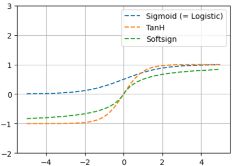

Sigmoid 는 0\~1, TanH 는 -1\~1 로 포화되고, Softsign 은 TanH 와 비슷하지만 더 완만하게 포화된다. 다음은 ReLU 와 그 변형이다.

```python
x = np.arange(-6, 3, 0.01)

# ReLU 변형
def relu_func(x): # ReLU(Rectified Linear Unit)
    return (x>0)*x
plt.plot(x, relu_func(x), linestyle='--', label="ReLU")

def leakyrelu_func(x,a=0.01): # Leaky ReLU
    return (x>=0)*x + (x<0)*a*x
plt.plot(x, leakyrelu_func(x,a=0.1), linestyle='--', label="Leaky ReLU")

def trelu_func(x,th=1): # Thresholded ReLU
    return (x>th)*x
plt.plot(x, trelu_func(x), linestyle='--', label="Thresholded ReLU")

def elu_func(x,a=1): # ELU(Exponential linear unit)
    return (x>=0)*x + (x<0)*a*(np.exp(x)-1)
plt.plot(x, elu_func(x,a=0.5), linestyle='--', label="ELU")

plt.ylim(-2, 3)
plt.legend()
plt.grid()
plt.show()
```

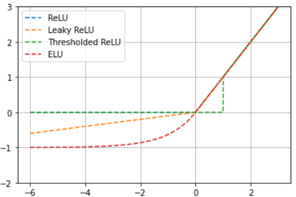

양수 영역은 네 함수가 모두 같고, 음수 영역에서 ReLU 는 0, Leaky ReLU 는 작은 기울기의 직선, ELU 는 $-\alpha$ 로 부드럽게 수렴하는 곡선이 된다. Thresholded ReLU 는 문턱값 1 아래를 모두 0 으로 만든다. ELU 계열끼리 비교하면 다음과 같다.

```python
def celu_func(x,a): # CELU
    return (x>=0)*x + (x<0)*a*(np.exp(x/a)-1)

def selu_func(x): # SELU
    a = 1.6732632423
    scale = 1.0507009873
    return scale*((x>=0)*x + (x<0)*a*(np.exp(x)-1))

plt.plot(x, elu_func(x,a=0.5), linestyle='--', label="ELU,a=0.5")
plt.plot(x, celu_func(x,a=0.5), linestyle='--', label="CELU,a=0.5")
plt.plot(x, selu_func(x), linestyle='--', label="SELU")

plt.ylim(-2, 3)
plt.legend()
plt.grid()
plt.show()
```

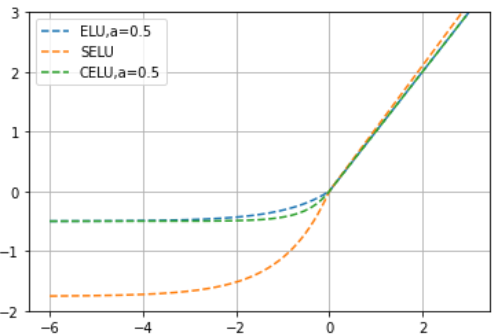

SELU 는 양수 영역의 기울기가 `scale` 배로 1 보다 크고 음수 영역도 더 깊이 내려간다. 마지막으로 Softplus 와 그 위에 세워진 SiLU·Mish 다.

```python
x = np.arange(-5, 5, 0.01)

def softplus_func(x):
    return np.log(np.exp(x)+1)
plt.plot(x, softplus_func(x), linestyle='--', label="softplus_func")

def SiLU_func(x):
    return x*(sigmiod_func(x))
plt.plot(x, SiLU_func(x), linestyle='--', label="SiLU/Swish")

def Mish_func(x):
    return x*np.tanh(softplus_func(x))
plt.plot(x, Mish_func(x), linestyle='--', label="Mish")

plt.ylim(-2, 4)
plt.legend()
plt.grid()
plt.show()
```

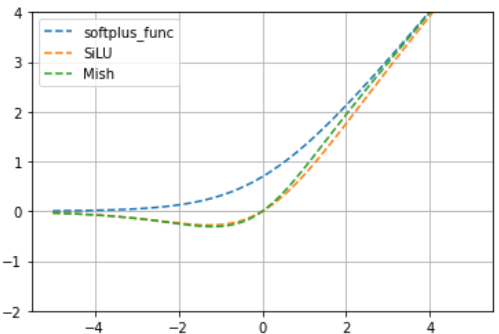

SiLU 와 Mish 는 ReLU 처럼 양수 영역에서는 거의 $x$ 를 따라가면서, 0 근처의 음수 영역에서 살짝 아래로 내려갔다가 0 으로 돌아오는 부드러운 모양이다. 이 "매끄러운 꺾임" 이 ReLU 와의 핵심 차이다.

### 향상된 activation 함수 — SELU, SiLU, Mish
<!-- 슬라이드 158 -->

세 함수는 모두 gradient vanishing 문제를 개선하려는 시도다.

**SELU (Scaled Exponential Linear Unit, 2017).** ELU 에 고정된 배율을 곱한 것이다.

$$
\alpha = 1.67326324,\quad \mathrm{scale} = 1.05070098
$$

$$
\mathrm{SELU}(x) = \begin{cases} \mathrm{scale} \cdot x & (x > 0) \\ \mathrm{scale} \cdot \alpha \,(\exp(x) - 1) & (x < 0) \end{cases}
\qquad \mathrm{SELU}(x) = \mathrm{scale} \cdot \mathrm{ELU}_{\alpha}(x)
$$

- Self-normalization: 출력값의 분산을 자동으로 조절해 gradient vanishing/exploding 을 줄인다.
- Negative input: 음의 입력이 중요한 데이터에서, 그로 인한 gradient vanishing 문제에 효과적이다.
- 단점은 높은 계산 비용이다.

**SiLU(Swish) activation (2017).**

$$
\mathrm{SiLU}(x) = x \cdot \mathrm{sigmoid}(x)
$$

- ReLU 를 대신하면 대부분 좋은 학습 결과를 준다.
- 미분 계산 비용은 sigmoid 보다 약간 높다. 비용 순서는 mish > swish > sigmoid > relu 다.

**Mish activation (2019).**

$$
\mathrm{mish}(x) = x \cdot \tanh(\mathrm{softplus}(x))
$$

- 많은 경우(주로 image 처리)에 swish 보다 좋은 학습 결과를 보인다.
- 특정 작업에서는 swish 나 ReLU 보다 성능이 떨어질 수도 있다.

어느 것이 좋은지는 문제마다 다르므로 **실험적으로 결정**해야 한다. 아래 그림은 MNIST 에서 층 수를 늘려 가며 ReLU·Mish·Swish 의 테스트 정확도를 비교한 것이다. 층이 15\~25 개로 깊어질수록 ReLU 는 정확도가 급격히 떨어지는데 Mish 는 거의 유지되고 Swish 가 그 중간이다. 깊은 망에서 vanishing 문제가 얼마나 개선되는지를 보여 준다.

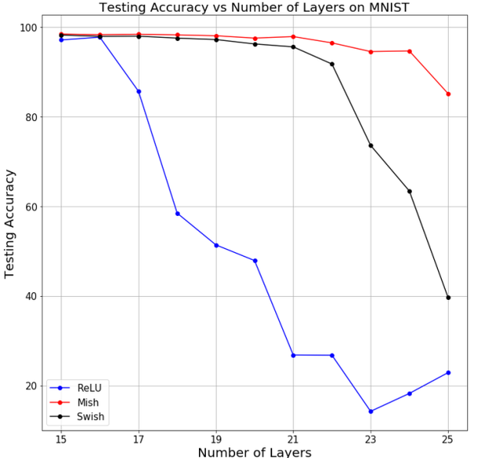

### 새로운 activation 함수 — GELU, GeGLU
<!-- 슬라이드 159 -->

**GELU (Gaussian Error Linear Unit).** 입력 값을 가우시안 분포로 변환하는 비선형 함수다.

$$
\mathrm{GELU}(x) = x\,P(X \le x) = x\,\Phi(x),\qquad \Phi(x) = \mathrm{Gaussian\_CDF}(x)
$$

즉 입력 $x$ 에 "표준정규분포에서 $x$ 이하가 나올 확률" $\Phi(x)$ 를 곱한다. 아래 그림의 빨간 곡선이 $\Phi(x)$(Normal CDF), 파란 곡선이 밀도(Normal PDF)다. $x$ 가 크면 $\Phi(x) \approx 1$ 이라 GELU 는 $x$ 에 가깝고, $x$ 가 작으면 $\Phi(x) \approx 0$ 이라 0 에 가까워진다.

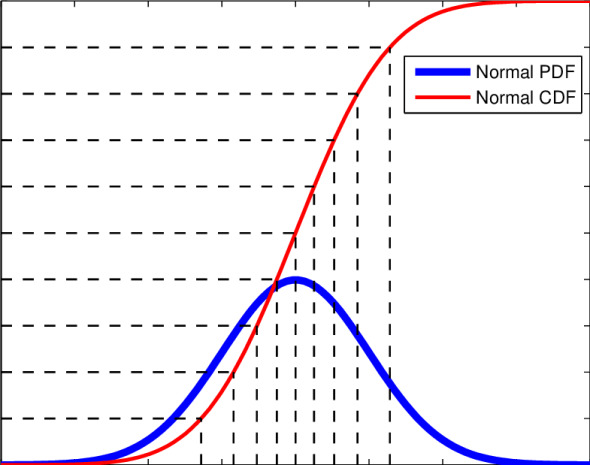

- ReLU 보다 부드러운 비선형성을 제공하므로 복잡한 함수를 표현하기 좋다.
- 모델의 표현력과 수렴 속도를 높일 수 있다.
- BERT 나 GPT 등 transformer 기반 모델에서 널리 쓰인다.

노트북에서는 $\Phi$ 를 tanh 근사식으로 계산해 그린다. GELU 는 ReLU 와 ELU 사이에서 0 근처를 부드럽게 지나는 모양이다.

```python
#GELU(x)=0.5*x*(1+Tanh(sqrt(2/π)*(x+0.044715*x^3)))
x = np.arange(-5, 5, 0.01)

def GeLU_func(x):
    return 0.5*x*(1+np.tanh((np.sqrt(2/np.pi)*(x+0.044715*x**3))))

plt.plot(x, GeLU_func(x), linestyle='--', label="GeLU(0,1)")
plt.plot(x, relu_func(x), linestyle='--', label="ReLU")
plt.plot(x, elu_func(x,a=1), linestyle='--', label="ELU,a=1")

plt.ylim(-2, 4)
plt.legend()
plt.grid()
plt.show()
```

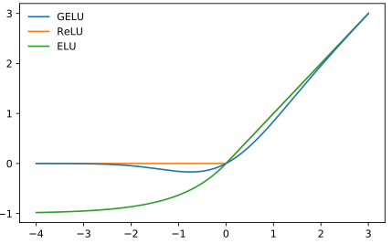

**GeGLU.** GLU(Gated Linear Unit)는 두 개의 선형 변환을 두고 한쪽을 "게이트" 로 써서 다른 쪽 출력을 성분별로 곱하는 구조다. 게이트에 어떤 activation 을 쓰느냐에 따라 이름이 달라진다.

$$
\mathrm{ReGLU}(x, W, V, b, c) = \max(0, xW + b) \otimes (xV + c)
$$

$$
\mathrm{GEGLU}(x, W, V, b, c) = \mathrm{GELU}(xW + b) \otimes (xV + c)
$$

$$
\mathrm{SwiGLU}(x, W, V, b, c, \beta) = \mathrm{Swish}_{\beta}(xW + b) \otimes (xV + c)
$$

GeGLU 는 GLU 의 activation 으로 GELU 를 쓴 것이다.

- 두 개의 선형 변환과 GLU 를 조합한다.
- 효율적인 계산이 가능해 대규모 모델에도 적합하다.
- 안정성을 높이고 vanishing gradient 문제를 완화할 수 있다.
- 특히 NLP, Speech, Time series 등 복잡한 패턴을 더 잘 표현한다.

PyTorch 에서는 `nn.Module` 을 상속해 두 개의 `nn.Linear` 를 두고 `forward` 에서 곱하면 된다. 게이트 쪽 activation 만 바꾸면 GLU(sigmoid)·ReGLU·GeGLU 가 된다.

```python
## 선형변환이 포함된 GLU 구현
class GLU(nn.Module):
    def __init__(self, input_dim, hidden_dim):
        super(GLU, self).__init__()
        # 두 개의 선형 변환 정의
        self.linear1 = nn.Linear(input_dim, hidden_dim)
        self.linear2 = nn.Linear(input_dim, hidden_dim)
        self.sigmoid = nn.Sigmoid()
    def forward(self, x):
        gate1 = self.linear1(x)
        gate2 = self.sigmoid(self.linear2(x))
        return gate1 * gate2

class GeGLU(nn.Module):
    def __init__(self, input_dim, hidden_dim):
        super(GeGLU, self).__init__()
        self.linear1 = nn.Linear(input_dim, hidden_dim)
        self.linear2 = nn.Linear(input_dim, hidden_dim)
        self.gelu = nn.GELU()
    def forward(self, x):
        gate1 = self.linear1(x)
        gate2 = self.gelu(self.linear2(x))
        return gate1 * gate2
```

PyTorch 내장 `nn.GLU()` 는 선형 변환 없이 입력의 마지막 차원을 반으로 갈라 한쪽에 sigmoid 를 걸어 곱한다. 그래서 `nn.GLU()` 를 쓰면 출력 차원이 입력의 절반이 된다는 점에 주의한다.

---

## 2.3.6 Activation 함수 적용 결과 비교
<!-- 슬라이드 160 -->

이제 activation 만 바꾼 같은 모델을 MNIST 로 학습시켜 **학습 속도와 학습 패턴**을 관찰한다. 데이터는 `LightningDataModule` 로 준비한다(2.2 절과 같은 방식). 학습 데이터 55,000 / 검증 5,000 으로 나누고 batch 크기는 256 이다.

```python
class MNISTDataModule(L.LightningDataModule):
  def __init__(self, data_dir: str = '', batch_size: int = 1024):
    super().__init__()
    self.data_dir = data_dir
    self.batch_size = batch_size

  def setup(self, stage):
    transform = v2.Compose([
        v2.ToImage(),        # 다양한 image type -> torchvision.tv_tensors.Image type
        v2.ToDtype(torch.float32, scale=True) ] )
    self.mnist_test = MNIST(self.data_dir, train=False, transform=transform, download=True)
    mnist_full = MNIST(self.data_dir, train=True, transform=transform, download=True)
    self.mnist_train, self.mnist_val = data.random_split(mnist_full, [55000, 5000])

  def train_dataloader(self):
    return DataLoader(self.mnist_train, batch_size=self.batch_size, num_workers=4)
  def val_dataloader(self):
    return DataLoader(self.mnist_val, batch_size=self.batch_size, num_workers=4)
  def test_dataloader(self):
    return DataLoader(self.mnist_test, batch_size=self.batch_size, num_workers=4)

data_module = MNISTDataModule(batch_size=256)
```

기준 모델은 `Flatten → Linear(784, 128) → ReLU → Linear(128, 10)` 이다. `training_step` 과 `validation_step` 에서 cross entropy 손실과 `torchmetrics` 의 accuracy 를 계산해 `log_dict` 로 기록한다.

```python
class Model(L.LightningModule):
    def __init__(self):
        super(Model, self).__init__()
        self.layers = nn.Sequential(
            nn.Flatten(),
            nn.Linear(28*28, 128),
            nn.ReLU(),
            nn.Linear(128, 10))

    def forward(self, x):
        x = self.layers(x)
        return x

    def training_step(self, batch, batch_idx):
        x, y = batch
        y_pred = self(x)
        loss = F.cross_entropy(y_pred, y)
        acc = FM.accuracy(y_pred, y, task="multiclass",num_classes=10)
        metrics={'loss':loss, 'acc':acc}
        self.log_dict(metrics, prog_bar=True)
        return loss

    def validation_step(self, batch, batch_idx):
        x, y = batch
        y_pred = self(x)
        loss = F.cross_entropy(y_pred, y)
        acc = FM.accuracy(y_pred, y, task="multiclass",num_classes=10)
        metrics = {'val_loss':loss, 'val_acc':acc}
        self.log_dict(metrics, prog_bar=True)

    def configure_optimizers(self):
        return torch.optim.Adam(self.parameters(), lr=0.001)

model = Model()
summary(model, input_size=(8, 28, 28))
```

학습은 `CSVLogger` 로 지표를 파일에 남기고 `overfit_batches=0.25` 로 데이터의 1/4 만 써서 빠르게 돌린다. 50 epoch 을 돌린 뒤 `metrics.csv` 를 읽어 epoch 별 마지막 값을 `h1` 에 모아 둔다. 이후 실험은 모두 이 `h1` 과 비교한다.

```python
model = Model()

epochs = 50
name="ReLU_Model"
logger = L.pytorch.loggers.CSVLogger("logs", name=name)
trainer = L.Trainer(max_epochs=epochs, logger=logger, overfit_batches=0.25,enable_model_summary=False)
trainer.fit(model, data_module)

v_num = logger.version
history = pd.read_csv(f'./logs/{name}/version_{v_num}/metrics.csv')
h1 = history.drop('step', axis=1).groupby('epoch').last()
```

비교 모델 `Model2` 는 activation 한 줄만 다르다. 주석을 바꿔 가며 SELU·PReLU·Mish·ReLU 를 번갈아 넣어 본다. `nn.PReLU(num_parameters=128)` 은 노드마다 기울기 $a$ 를 따로 학습한다.

```python
class Model2(L.LightningModule):
    def __init__(self):
        super(Model2, self).__init__()
        self.layers = nn.Sequential(
            nn.Flatten(),
            nn.Linear(28*28, 128),
#            nn.SELU(),
#            nn.PReLU(num_parameters=128),
            nn.Mish(),
#            nn.ReLU(),
            nn.Linear(128, 10))
    # forward / training_step / validation_step / configure_optimizers 는 Model 과 같다
```

```python
model = Model2()
epochs = 50
name="Mish_Model"
logger = L.pytorch.loggers.CSVLogger("logs", name=name)
trainer = L.Trainer(max_epochs=epochs, logger=logger, overfit_batches=0.25,enable_model_summary=False)
trainer.fit(model, data_module)

v_num = logger.version
history = pd.read_csv(f'./logs/{name}/version_{v_num}/metrics.csv')
h2 = history.drop('step', axis=1).groupby('epoch').last()
```

GLU 계열은 `nn.GLU()` 를 넣되, 출력 차원이 절반이 되므로 다음 Linear 의 입력을 64 로 줄인다.

```python
class Model2(L.LightningModule):
    def __init__(self):
        super(Model2, self).__init__()
        self.layers = nn.Sequential(
            nn.Flatten(),
            nn.Linear(28*28, 128),
            nn.GLU(),
            nn.Linear(64, 10))      # GLU 출력은 128/2 = 64
```

세 실험의 `val_acc` 와 `val_loss` 를 한 그림에 겹쳐 그린다.

```python
h3 = history.drop('step', axis=1).groupby('epoch').last()
max_3 = h3['val_acc'].max()

plt.figure(figsize=(10,3))
title = "ReLU / Mish / GLU"
plt.subplot(121)
plt.title(f"{title}\nMax Val_Acc:{max_1:.4f} / {max_2:.4f} / {max_3:.4f}")
plt.plot(h1['val_acc'],'--', label='val_acc1')
plt.plot(h2['val_acc'], label='val_acc2')
plt.plot(h3['val_acc'], label='val_acc3')
plt.legend()
plt.grid()

plt.subplot(122)
plt.title("Loss")
plt.plot(h1['val_loss'],'--', label='val_loss1')
plt.plot(h2['val_loss'], label='val_loss2')
plt.plot(h3['val_loss'], label='val_loss3')
plt.semilogy()
plt.legend()
plt.grid()
plt.show()
```

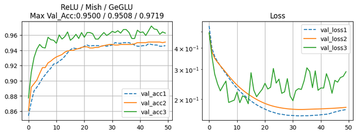

ReLU(점선)와 Mish(주황)는 거의 같은 궤적을 그리며 최고 검증 정확도 0.9500 과 0.9508 로 차이가 작다. 게이트 구조(초록)는 초반부터 정확도가 빠르게 올라 0.9719 로 가장 높지만, 검증 손실이 크게 출렁이는 패턴을 보인다. 이렇게 activation 은 최종 정확도뿐 아니라 **학습 속도와 곡선의 안정성**에도 영향을 준다.

> **`nn.ReLU` 와 `nn.functional.relu`**
> `nn.ReLU()` 는 객체형 접근이다. 주로 `__init__` 에서 만들어 두고 모델 구조의 일부로 다루므로 `summary` 에도 층으로 나타난다.
> `F.relu()` 는 함수형 접근으로 `forward` 안에서 직접 부른다. 상태가 없으므로 미리 만들어 둘 필요가 없다.
> 두 방식 모두 유효하며 어느 쪽을 쓸지는 coding style 의 문제다.

---

## 2.3.7 Dropout layer
<!-- 슬라이드 161 -->

Dropout 은 overfitting 을 막기 위한 regularization 기법이다. 학습 과정에서 일정 확률로 노드를 무작위로 골라 그 노드의 학습을 차단한다. 구현은 노드의 입력(출력)에 강제로 0 을 넣는 것이다. 매 batch 마다 꺼지는 노드가 달라지므로 모델의 형태가 수시로 바뀌고, 결과적으로 서로 다른 여러 모델이 협력하는 ensemble 모델처럼 동작한다.

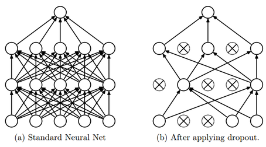

왜 이것이 도움이 되는가. 노드 사이의 연결이 많다는 것은 노드끼리 협력이 많다는 뜻이고, 그러면 특정 노드들이 서로에게 의존하게 되어 다양성이 사라진다(generalization 약화). 노드를 무작위로 끄면 각 노드가 다른 노드에 기대지 않고 스스로 유용한 특징을 배우게 된다.

적용은 `nn.Dropout(p)` 한 줄을 activation 뒤에 끼워 넣는 것이다. `p` 는 끌 확률이다.

```python
class Model4(L.LightningModule):
    def __init__(self):
        super(Model4, self).__init__()
        self.layers = nn.Sequential(
            nn.Flatten(),
            nn.Linear(28*28, 128),
            nn.ReLU(),
            nn.Dropout(0.3),
            nn.Linear(128, 10))
    # forward / training_step / validation_step / configure_optimizers 는 Model 과 같다
```

```python
model = Model4()

name = 'Dropout'
logger = L.pytorch.loggers.CSVLogger("logs", name=name)
trainer = L.Trainer(max_epochs=epochs, logger=logger, overfit_batches=0.25,enable_model_summary=False)
trainer.fit(model, data_module)
```

학습 곡선(`h1` 과의 비교 코드는 2.3.6 과 같다)을 보면 Dropout 모델(주황)이 ReLU 기준 모델(점선)보다 검증 정확도가 꾸준히 높아 최고 0.9609 대 0.9508 이다.

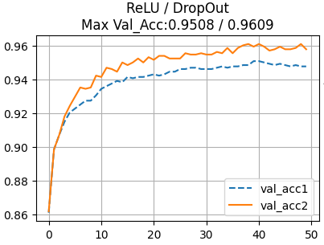

성능 비교에서 읽을 수 있는 것은 세 가지다.

- 초반에는 val_loss 감소와 val_acc 상승이 **지연**된다. 매번 일부 노드가 꺼진 채 학습하므로 진도가 느리다.
- 그러나 val_loss 가 **지속적으로 감소**한다. 기준 모델은 어느 시점부터 val_loss 가 다시 올라가는 overfitting 을 보이는데 Dropout 모델은 그렇지 않다.
- 정리하면 **overfitting 감소, 학습 지연**이다. 학습 시간이 더 걸리는 대신 일반화가 좋아진다.

Dropout 은 학습(`model.train()`) 중에만 동작하고 추론(`model.eval()`) 때는 모든 노드를 쓴다. Lightning 은 `validation_step` 에서 자동으로 eval 모드로 바꿔 주므로 따로 신경 쓸 필요가 없다.

---

## 2.3.8 BatchNormalization layer
<!-- 슬라이드 162~165 -->

### 왜 필요한가 — internal covariate shift
<!-- 슬라이드 162 -->

BatchNormalization 은 **학습 속도 향상**을 위한 layer 다. 문제의 출발점은 공변량 이동(internal covariate shift)이다. 학습 데이터를 batch 로 나누어 넣으면 batch 마다 통계적 특성(평균·분산)이 다르고, 그래서 각 layer 출력의 분포가 학습 중에 계속 흔들린다. 아래 그림처럼 같은 layer 의 출력 분포가 학습 시점 1 과 시점 2 에서 다른 곳에 놓이는 것이다.

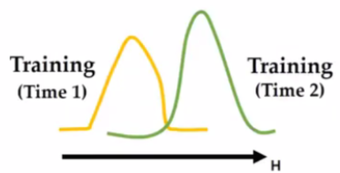

뒤쪽 layer 는 앞 layer 가 만들어 준 분포를 입력으로 배우는데, 그 분포가 계속 움직이면 배운 것이 무효가 되기를 반복한다. layer 가 깊을수록 이 흔들림이 누적되어 부정적 영향이 커지고 학습 속도가 둔화된다. 아래 그림은 층을 지날수록($H_1 \to H_2 \to H_3$) 두 시점의 분포(초록·노랑)가 점점 더 벌어지는 것을 보여 준다.

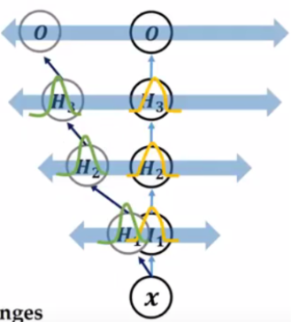

해결책은 **batch 단위로 node 출력값(활성화 전)을 normalize** 하는 것이다. Normalize 란 평균을 0 에 가깝게, 표준편차를 1 에 가깝게 맞추는 일이다. 아래 그림처럼 Fully Connected layer 뒤, ReLU 앞에 Batch Norm 을 두면 batch 1 과 batch 2 의 서로 다른 분포가 모두 비슷한 모양으로 정리되어 다음 layer 로 들어간다.

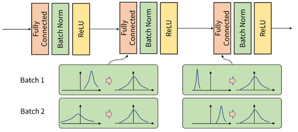

통계는 **feature(node)마다** batch 방향으로 계산한다. 아래 그림에서 각 행이 하나의 feature 이고 열이 batch 안의 샘플이다. 행마다 mean 과 std 를 구하고, 이 값을 모든 학습 샘플에 같은 방식으로 적용한다.


결과적으로 각 layer 로 들어가는 값의 범위가 제한되므로 가중치 $W$ 의 범위도 제한되고, 학습이 안정되어 속도가 빨라진다.

### BatchNormalization 알고리즘
<!-- 슬라이드 163 -->

$m$ 을 batch 안의 샘플 수라 하고, 어떤 node 의 활성함수 입력값을 $x_1, \ldots, x_m$ 이라 하자. 알고리즘은 세 단계다.

1. **STEP 1: Calculate Batch Statistics.** batch 단위에서 통계적 특성(평균 $\mu_B$, 분산 $\sigma_B^2$)을 계산한다.

$$
\mu_B = \frac{1}{m}\sum_{i=1}^{m} x_i,\qquad \sigma_B^2 = \frac{1}{m}\sum_{i=1}^{m} (x_i - \mu_B)^2
$$

2. **STEP 2: Normalize Layer Inputs.** 활성함수 입력을 이 평균과 분산으로 normalization 한다. $\epsilon$ 은 0 으로 나누는 것을 막는 작은 상수다.

$$
\hat{x}_i = \frac{x_i - \mu_B}{\sqrt{\sigma_B^2 + \epsilon}}
$$

3. **STEP 3: Scaling and Shifting.** 정규화된 출력에 곱(scaling)과 합(shifting)을 적용해 활성함수에 넘긴다.

$$
y_i = \gamma\,\hat{x}_i + \beta
$$

3 단계가 필요한 이유는 normalize 가 **비선형성을 줄이기** 때문이다. 모든 값을 평균 0·분산 1 근처로 몰아 놓으면 sigmoid 나 tanh 의 가운데 거의 선형인 구간만 쓰게 된다. scaling factor $\gamma$ 와 shifting factor $\beta$ 로 활성함수로 들어가는 값의 범위를 다시 넓혀 주면 활성함수의 비선형성을 활용할 수 있다. $\gamma$ 와 $\beta$ 는 역전파 과정에서 학습되는 값이므로 **파라메터가 추가**된다.

**추론할 때는 평균과 분산을 어떻게 찾는가.** 추론 시에는 batch 가 없거나 크기가 1 일 수 있다. 그래서 학습 단계에서 본 평균과 분산을 평균하여 적용하거나, 학습 단계의 평균과 분산을 **이동 평균**한 값(running mean, running var)을 적용한다. PyTorch 의 `BatchNorm` 은 학습 중에 이 이동 평균을 계속 갱신해 두었다가 `eval()` 모드에서 그 값을 쓴다.

주의할 점은 **batch size 의 영향을 받는다**는 것이다. batch 통계로 normalize 하므로 batch 가 너무 작으면 통계가 불안정하다. batch size 는 적당히 커야 한다.

파라메터 수는 **node 당 2 개의 trainable($\gamma$, $\beta$) + 2 개의 non-trainable(running mean, running var)** 이다.

BatchNormalization 의 장점은 **빠르고 안정적**이라는 것이다.

- Gradient vanishing 을 해결하고, learning rate 와 decay rate 를 더 크게 잡을 수 있어 학습이 가속된다.
- 가중치 초기화의 영향이 줄어든다.
- Dropout 을 제거해도 성능이 유지되는 경우가 많다.

### BatchNormalization 적용
<!-- 슬라이드 164 -->

`nn.BatchNorm1d(num_features)` 를 Linear 뒤, activation 앞에 넣는다. 인자는 정규화할 feature(node) 수다. 아래 모델은 두 Linear 뒤에 각각 BatchNorm 을 두었다. 학습률은 0.0005 로 낮췄다.

```python
class Model5(L.LightningModule):
    def __init__(self):
        super(Model5, self).__init__()
        self.layers = nn.Sequential(
            nn.Flatten(),
            nn.Linear(28*28, 128),
            nn.BatchNorm1d(128),
            nn.ReLU(),
            nn.Linear(128, 10),
            nn.BatchNorm1d(10)
            )
    # forward / training_step / validation_step 은 Model 과 같다

    def configure_optimizers(self):
        return torch.optim.Adam(self.parameters(), lr=0.0005) ##

model = Model5()
summary(model, input_size=(8, 28, 28))
```

`summary` 결과를 옮기면 다음과 같다. batch 8 로 가정한 출력 shape 과 파라메터 수다.

| Layer (type:depth-idx) | Output Shape | Param # |
|---|---|---|
| Model5 | -- | -- |
| ├─ Sequential: 1-1 | [8, 10] | -- |
| │ └─ Flatten: 2-1 | [8, 784] | -- |
| │ └─ Linear: 2-2 | [8, 128] | 100,480 |
| │ └─ BatchNorm1d: 2-3 | [8, 128] | 256 |
| │ └─ ReLU: 2-4 | [8, 128] | -- |
| │ └─ Linear: 2-5 | [8, 10] | 1,290 |
| │ └─ BatchNorm1d: 2-6 | [8, 10] | 20 |
| Total params | | 102,046 |
| Trainable params | | 102,046 |
| Non-trainable params | | 0 |

BatchNorm1d(128) 의 파라메터가 256 = 2 × 128 인 것은 $\gamma$ 와 $\beta$ 만 센 것이다. 전체로는 feature 당 4 개(2 trainable: gamma, beta / 2 non-trainable: running mean, running std)가 있지만 `summary` 는 trainable 만 세므로 non-trainable 이 0 으로 나온다.

```python
model = Model5()

name = 'BatchNorm'
logger = L.pytorch.loggers.CSVLogger("logs", name=name)
trainer = L.Trainer(max_epochs=epochs, logger=logger, overfit_batches=0.25,enable_model_summary=False)
trainer.fit(model, data_module)
```

성능을 비교하면 BatchNorm 모델(주황)은 **10 epoch 정도에서 이미 최적화**에 도달하고 accuracy 도 최고(0.9617 대 0.9602)다. 학습이 빠르고 좋다.

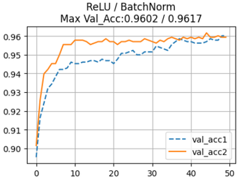

검증 손실 곡선에서도 BatchNorm 모델은 초반 손실이 높지만 꺾임 없이 부드럽게 계속 내려가는 반면, 기준 모델은 10 epoch 이후 정체하고 출렁인다.

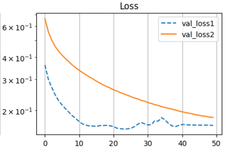

### BatchNormalization layer 의 Parameter 확인
<!-- 슬라이드 165 -->

BatchNorm 이 실제로 어떤 값을 갖고 있는지 `state_dict()` 로 확인한다. 모델을 출력하면 `Sequential` 안의 각 층이 번호와 함께 보인다.

```python
model
```

```text
Model5(
  (layers): Sequential(
    (0): Flatten(start_dim=1, end_dim=-1)
    (1): Linear(in_features=784, out_features=128, bias=True)
    (2): BatchNorm1d(128, eps=1e-05, momentum=0.1, affine=True, track_running_stats=True)
    (3): ReLU()
    (4): Linear(in_features=128, out_features=10, bias=True)
    (5): BatchNorm1d(10, eps=1e-05, momentum=0.1, affine=True, track_running_stats=True)
  )
)
```

`state_dict()` 의 키를 돌면서 크기를 찍어 보면 BatchNorm 층(2, 5)에 `weight`($\gamma$), `bias`($\beta$) 외에 `running_mean`, `running_var`, `num_batches_tracked` 가 있다. 즉 **`state_dict()` 로는 mean, variance 를 확인할 수 있다.**

```python
model.layers.state_dict()

p = model.layers.state_dict()
p_k = list(p.keys())
for k in p_k:
  print(k,':',model.layers.state_dict()[str(k)].size())
```

```text
1.weight : torch.Size([128, 784])
1.bias : torch.Size([128])
2.weight : torch.Size([128])
2.bias : torch.Size([128])
2.running_mean : torch.Size([128])
2.running_var : torch.Size([128])
2.num_batches_tracked : torch.Size([])
4.weight : torch.Size([10, 128])
4.bias : torch.Size([10])
5.weight : torch.Size([10])
5.bias : torch.Size([10])
5.running_mean : torch.Size([10])
5.running_var : torch.Size([10])
5.num_batches_tracked : torch.Size([])
```

반면 `parameters()` 로 돌면 학습 대상인 8 개 텐서만 나온다. BatchNorm 의 running mean/var 는 학습 대상이 아닌 buffer 이므로 **Non-trainable params 는 제외된다**. 2.3.3 에서 본 `state_dict()`(모든 텐서) 와 `parameters()`(학습 대상만)의 차이가 여기서 분명해진다.

```python
for p in model.layers.parameters():
  print(p.size())
```

```text
torch.Size([128, 784])
torch.Size([128])
torch.Size([128])
torch.Size([128])
torch.Size([10, 128])
torch.Size([10])
torch.Size([10])
torch.Size([10])
```

---

## 2.3.9 Weight decay
<!-- 슬라이드 166 -->

Weight decay 는 가중치 값에 **L2 penalty** 를 주는 regularization 이다. 가중치가 커지는 것을 손실에 벌점으로 더해 억제하므로 overfitting 을 막는다. PyTorch 에서는 layer 가 아니라 **optimizer 에 적용**한다. `torch.optim.Adam(..., weight_decay=값)` 처럼 인자 하나를 주면 된다.

기준 `Model` 을 상속해 `configure_optimizers` 만 바꾸면 되므로 코드가 짧다. 학습률과 weight decay 를 생성자 인자로 받게 해 두면 실험하기 편하다.

```python
l2_regularization = 0.0005

class Model6(Model):
    def __init__(self, lr=0.0005, weight_decay=0.0):
        super().__init__()
        self.lr = lr
        self.weight_decay = weight_decay

    def configure_optimizers(self):
        return torch.optim.Adam(self.parameters(), lr=self.lr,
                                weight_decay=self.weight_decay)

model = Model6(weight_decay=l2_regularization)
summary(model, input_size=(8, 28, 28))
```

```python
name = 'WeightDecay'
logger = L.pytorch.loggers.CSVLogger("logs", name=name)
trainer = L.Trainer(max_epochs=epochs, logger=logger, overfit_batches=0.25,enable_model_summary=False)
trainer.fit(model, data_module)
```

결과를 보면 weight decay 모델(주황)은 검증 정확도가 0.9664 로 기준 모델 0.9602 보다 높고, 검증 손실은 끝까지 계속 내려간다. **val_loss 감소 = 성능 향상, overfitting 감소**다. 기준 모델의 val_loss 가 20 epoch 이후 바닥을 치고 출렁이는 것과 대비된다.

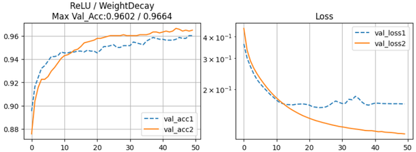

Dropout·BatchNormalization·Weight decay 는 서로 배타적이지 않다. 실제 모델에서는 이들을 조합해 쓰며, 어떤 조합이 좋은지는 다음 실습과제에서 직접 찾아본다.

---

## 2.3.10 실습과제 — Model 기본 설계
<!-- 슬라이드 167~168 -->

### 실습 2.3.2 — Model 기본 설계
<!-- 슬라이드 167~168 -->

> 노트북: `code/2.3.2.PyTorch_APIs.ipynb`
> [](https://colab.research.google.com/github/AI-BoostCamp/intermediate-deep-learning-pytorch/blob/main/code/2.3.2.PyTorch_APIs.ipynb)

이 실습은 **Lightning wrapper class** 를 쓴다. 학습·검증 step 과 optimizer 설정처럼 모델 구조와 무관하게 반복되는 부분을 `Wrap_10` 이라는 `LightningModule` 에 넣어 두고, 모델 class 는 이를 상속해 `__init__` 과 `forward` 만 정의한다. 이렇게 하면 구조를 바꿀 때마다 wrapper 를 다시 쓰지 않아도 된다. 이름의 `10` 은 클래스 수다.

```python
class Wrap_10(L.LightningModule):
    def training_step(self, batch, batch_idx):
        x, y = batch
        y_pred = self(x)
        loss = F.cross_entropy(y_pred, y)
        acc = FM.accuracy(y_pred, y, task="multiclass",num_classes=10)
        metrics={'loss':loss, 'acc':acc}
        self.log_dict(metrics,prog_bar=True,on_step=False,on_epoch=True)
        return loss

    def validation_step(self, batch, batch_idx):
        x, y = batch
        y_pred = self(x)
        loss = F.cross_entropy(y_pred, y)
        acc = FM.accuracy(y_pred, y, task="multiclass",num_classes=10)
        metrics={'val_loss':loss, 'val_acc':acc}
        self.log_dict(metrics,prog_bar=True,on_step=False,on_epoch=True)

    def configure_optimizers(self):
        return torch.optim.Adam(self.parameters(), lr=0.001)
```

`log_dict` 에 `on_step=False, on_epoch=True` 를 주어 지표를 step 마다가 아니라 epoch 단위로 모아 기록한다. 기준 **Model class** 는 MNIST 용으로, 이 절에서 배운 BatchNorm 과 Dropout 을 모두 넣은 것이다.

```python
class Model(Wrap_10):
    def __init__(self):
        super(Model, self).__init__()
        self.layers = nn.Sequential(
            nn.Flatten(),
            nn.Linear(28*28, 256),
            nn.BatchNorm1d(256),
            nn.ReLU(),
            nn.Dropout(0.2),
            nn.Linear(256, 10))

    def forward(self, x):
        return self.layers(x)

model = Model()
summary(model, input_size=(8, 28, 28))
```

여기서 층의 순서에 주목한다. Linear layer 를 쓸 때 Dropout 과 Batch normalization 의 적용 순서는 다음과 같이 한다.

> **Linear layer 사용 시 적용 순서**
> Linear layer → Batch Normalization → Activation → Dropout

Linear 의 출력(활성화 전)을 BatchNorm 으로 정규화하고, activation 을 거친 뒤, 그 결과에 Dropout 을 건다. 앞 소절의 알고리즘 설명 그대로다.

데이터는 MNIST 와 CIFAR-10 을 모두 `DataLoader` 로 준비해 둔다. batch 크기는 1024 다.

```python
from torchvision.datasets import MNIST, FashionMNIST, CIFAR10, CIFAR100
from torchvision.transforms import v2
from torch.utils.data import DataLoader

transform = v2.Compose([
    v2.ToImage(),
    v2.ToDtype(torch.float32, scale=True) ] )

batch_size=1024 ####

download_root = './MNIST'
train_dataset = MNIST(download_root, transform=transform, train=True, download=True)
test_dataset = MNIST(download_root, transform=transform, train=False, download=True)
trainDataLoader = DataLoader(train_dataset, batch_size=batch_size, shuffle=True,num_workers=4)
valDataLoader = DataLoader(test_dataset, batch_size=batch_size, shuffle=False,num_workers=4)

download_root = './CIFAR10'
cifar10_train = CIFAR10(download_root, transform=transform, train=True, download=True)
cifar10_test = CIFAR10(download_root, transform=transform, train=False, download=True)
c10TrainDataLoader = DataLoader(cifar10_train, batch_size=batch_size, shuffle=True,num_workers=4)
c10ValDataLoader = DataLoader(cifar10_test, batch_size=batch_size, shuffle=False,num_workers=4)
```

기준 모델은 15 epoch 을 학습하고 `metrics.csv` 를 읽어 `acc`/`val_acc`, `loss`/`val_loss` 를 그린다.

```python
model = Model()

name = 'base'
logger = L.pytorch.loggers.CSVLogger("logs", name=name)
trainer = L.Trainer(max_epochs=15, logger=logger,enable_model_summary=False)
trainer.fit(model, trainDataLoader, valDataLoader)

v_num = logger.version
history = pd.read_csv(f'./logs/{name}/version_{v_num}/metrics.csv')
h1 = history.drop('step', axis=1).groupby('epoch').last()
max_ = h1['val_acc'].max()

plt.figure(figsize=(10,3))
title = "BaseModel"
plt.subplot(121)
plt.title(f"{title}\nMax Val_Acc:{max_:.4f}")
plt.plot(h1['acc'],'--', label='acc')
plt.plot(h1['val_acc'], label='val_acc')
plt.legend()
plt.grid()

plt.subplot(122)
plt.title("Loss")
plt.plot(h1['loss'],'--', label='loss')
plt.plot(h1['val_loss'], label='val_loss')
plt.semilogy()
plt.legend()
plt.grid()
plt.show()
```

**과제.** 이 sample code 에서 시작해 모델을 개선하고, 최종 모델 code 와 학습 과정을 제출한다.

- **Step 1** : input dataset 을 CIFAR-10 으로 바꾸고, 기본 모델과 BatchNormalization Layer 를 추가한 모델의 최고 정확도를 확인한다.
  - Input data 의 shape 에 주의한다. MNIST 는 `(1, 28, 28)` 이지만 CIFAR-10 은 `(3, 32, 32)` 이므로 `Flatten` 뒤의 첫 Linear 입력은 `3*32*32` 가 되어야 한다.
  - Layer 의 input/output 변수(각 Linear 의 `in_features`, `out_features`, BatchNorm 의 `num_features`)가 서로 맞는지 주의한다.
- **Step 2** : 모델 개선 — 구조(층 추가 등) 및 기타 개선. Dropout 등도 추가하고 최고 정확도를 확인한다.
  - Epoch = 15, batch_size = 1024 를 유지한다.
  - 무엇이 성능 개선에 영향을 주는지 파악한다.
- **Step 3** : 목표 val_acc **65% 이상**. 최고 성능으로 튜닝한다.
  - Epoch = 15, batch_size = 1024 를 유지한다.

Step 1 의 입력 shape 변경은 다음처럼 한다. `summary` 의 `input_size` 도 함께 바꿔야 한다.

```python
class Model(Wrap_10):
    def __init__(self):
        super(Model, self).__init__()
        self.layers = nn.Sequential(
            nn.Flatten(),
            nn.Linear(3*32*32, 128), ##  CIFAR-10 : 3 채널 x 32 x 32
            nn.BatchNorm1d(128),
            nn.ReLU(),
            nn.Dropout(0.4),
            nn.Linear(128, 10))

    def forward(self, x):
        out = self.layers(x)
        return out

model = Model()
summary(model, input_size=(8, 3, 32, 32))
```

아래는 결과 예시다. 15 epoch 동안 학습 정확도(실선)는 꾸준히 오르는데 검증 정확도(점선)는 출렁이며 따라오고, 최고 검증 정확도는 0.657 이다. 목표인 65% 를 겨우 넘는 수준이므로 Dropout 비율·층 수·노드 수·학습률을 바꿔 가며 이 값을 올려 보는 것이 과제다.

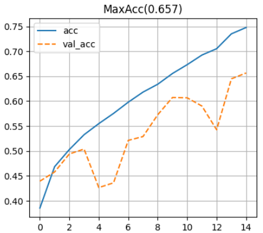

참고 노트북 `code/2.3.2.0.PyTorch_APIs_참고.ipynb` ([Colab](https://colab.research.google.com/github/AI-BoostCamp/intermediate-deep-learning-pytorch/blob/main/code/2.3.2.0.PyTorch_APIs_%EC%B0%B8%EA%B3%A0.ipynb)) 는 위 노트북에서 MNIST 기준 모델까지만 담은 판으로, CIFAR-10 과제를 처음부터 스스로 채워 보고 싶을 때 쓴다.

---

## 2.3.11 정리
<!-- 슬라이드 150~168 -->

- **Tensor** 는 ndarray 와 같은 데이터에 gradient 정보(`grad` 또는 `grad_fn`)를 더한 것이다. `requires_grad=True` 가 autograd 기록의 시작이고, gradient 는 float 텐서만 가질 수 있다. 밑줄로 끝나는 메서드는 in-place 연산이다.
- 순전파는 **동적 계산 그래프**를 만들고 `backward()` 는 그 그래프를 거꾸로 따라가 잎 텐서의 `grad` 를 채운다. 잎 텐서는 `grad`, 중간 텐서는 `grad_fn` 을 갖는다. 그래프에서 떼어 내려면 `detach()` 를 쓴다.
- **Layer** 는 상태(parameter)를 가진 호출 가능한 객체다. `state_dict()` 는 flag 없는 텐서 딕셔너리(저장·복원용), `named_parameters()`/`parameters()` 는 `requires_grad` 를 가진 학습 대상(optimizer 용)이다.
- **Activation** 은 ReLU 계열(LeakyReLU, PReLU, ELU, SELU, CELU)과 부드러운 계열(SiLU, Mish, GELU), 게이트 계열(GLU, ReGLU, GeGLU, SwiGLU)로 나뉜다. 성능과 계산 비용이 맞바꿈 관계이므로 실험으로 고른다.
- **Dropout** 은 노드를 무작위로 꺼서 overfitting 을 줄이지만 학습이 느려진다. **BatchNormalization** 은 batch 통계로 활성화 전 값을 정규화하고 $\gamma$, $\beta$ 로 되돌려 학습을 빠르고 안정되게 한다(feature 당 파라메터 4 개, 그중 2 개는 non-trainable). **Weight decay** 는 optimizer 의 L2 penalty 로 overfitting 을 줄인다.
- Linear layer 에서 적용 순서는 **Linear → BatchNorm → Activation → Dropout** 이다.
