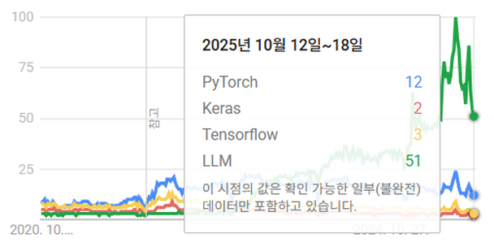
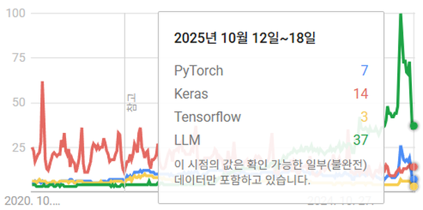
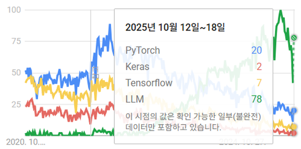
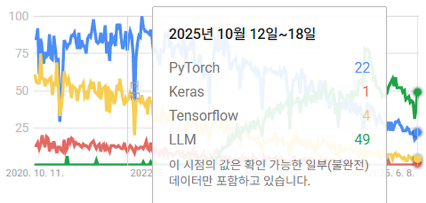

# 2.4 TensorFlow(Keras) vs PyTorch

**학습 목표**

- 정적 그래프와 동적 그래프의 차이를 설명하고, 그것이 실험적인 모델 개발에 왜 유리한지 말할 수 있다.
- PyTorch 텐서가 numpy 와 닮았다는 점이 수식을 코드로 옮기는 데 어떤 이점을 주는지 설명할 수 있다.
- PyTorch 가 low/middle level API 를 기본으로 삼기 때문에 직접 써야 하는 부분(training loop, device 할당 등)과 그 대가를 설명할 수 있다.
- TensorFlow(Keras) 코드의 기본 5단계 구조를 읽고, 연구용 모델과 과제 적용 모델에서 두 프레임워크를 어떻게 골라 쓰는지 말할 수 있다.

**이 절의 구성**

- 2.4.1 PyTorch 의 특징과 차이점
- 2.4.2 TensorFlow(Keras) 코드의 기본 구조
- 2.4.3 결론 — 서로 비슷해지는 두 프레임워크
- 2.4.4 정리

---

## 2.4.1 PyTorch 의 특징과 차이점
<!-- 슬라이드 170 -->

딥러닝 프레임워크의 양대 축은 TensorFlow(Keras)와 PyTorch 다. 이 강의는 PyTorch 를 쓰지만, PyTorch 가 무엇을 다르게 하는지는 TensorFlow(Keras)와 견주어 볼 때 가장 분명해진다. 차이는 크게 세 가지, 그래프를 만드는 방식, numpy 와의 관계, 그리고 API 의 높낮이에서 나온다.

### 동적 그래프(Dynamic graph)

딥러닝 프레임워크는 연산을 계산 그래프로 표현하고, 그 그래프를 거꾸로 따라가며 기울기를 구한다. 그래프를 언제 만드느냐가 두 프레임워크를 가른다.

| 방식 | 동작 | 장점 | 대표 |
|---|---|---|---|
| 정적 그래프(Static graph) | 그래프를 먼저 만들어 놓고, 값을 넣어서 실행한다 | 학습 시간이 빠르다 | TensorFlow |
| 동적 그래프(Dynamic graph) | 값이 계산되면서 그래프가 생성된다 | 실험적인 모델 개발에 유리하다 | PyTorch |

정적 그래프는 실행 전에 전체 구조가 확정되므로 최적화할 여지가 많아 학습 시간이 빠르다. 대신 그래프를 다 만든 뒤에야 값을 넣을 수 있어, 중간 값을 보며 구조를 바꾸는 식의 실험이 번거롭다. 동적 그래프는 파이썬 코드가 한 줄씩 실행되면서 그때그때 그래프가 만들어진다. 조건문과 반복문으로 모델 구조를 바꾸거나, 중간 텐서를 찍어 보며 디버깅하는 일이 일반 파이썬 프로그램과 다르지 않다. 새로운 구조를 자주 시도해야 하는 연구·실험 단계에서 PyTorch 가 선호되는 첫 번째 이유다.

### Python 과 numpy 기술

PyTorch 의 텐서(Tensor)는 numpy 의 ndarray 와 매우 유사하여(약 95%) numpy 에서 하던 연산을 거의 그대로 할 수 있다. 인덱싱, 브로드캐스팅, 축을 지정한 합과 평균, 행렬곱 같은 연산이 numpy 와 같은 이름과 같은 감각으로 동작한다. 그 결과 **수식을 코드로 옮기기가 쉽다**. 논문의 수식을 numpy 로 쓰듯 텐서 연산으로 옮기면 그것이 곧 자동 미분이 되는 모델 코드가 된다.

같은 이유로 새로운 수학적 구조나 새로운 손실 함수(loss)를 개발할 때도 numpy 스타일로 접근할 수 있다. 프레임워크가 제공하는 층과 손실 함수의 목록에 갇히지 않고, 필요한 계산을 텐서 연산으로 직접 써서 모델에 끼워 넣을 수 있다. 다만 이것은 사용자가 Python 과 numpy 를 능숙하게 다룬다는 전제 위에 서 있다.

### DIY 스타일과 세밀한 조정(Fine tunable)

PyTorch 는 low level 과 middle level API 가 기본이다. Keras 처럼 한 줄로 학습을 끝내는 high level API 대신, 필요한 것을 사용자가 직접 조립하는 DIY(do it yourself) 방식이라 처음에는 친절하지 않다(non-friendly). 그 위에 다양한 라이브러리가 추가로 개발되고 있어 발전은 빠르지만, 라이브러리끼리 호환성이 부족한 경우가 생기는 것이 그 대가다.

그래서 많은 부분을 파이썬 코드로 직접 구성해야 하며 Python 경험이 요구된다. 기본적으로 사용자가 써야 하는 것은 다음과 같다.

- **Training loop.** 배치를 꺼내고, 순전파를 하고, 손실을 구하고, 역전파와 파라미터 갱신을 하는 반복문을 직접 쓴다.
- **Memory / device handling.** 모델과 데이터를 어느 장치에 올릴지, 언제 메모리를 비울지를 코드로 다룬다.
- **Low level coding.** 층 사이의 텐서 모양 맞추기, 기울기 초기화 같은 세부를 사용자가 챙긴다.

특히 CPU 와 GPU 할당을 코드에서 명시할 수 있다는 점은 양날의 검이다. 원하는 대로 장치를 배정할 수 있는 대신, 잘못 배정하면 성능 감소가 크고, 실행 환경이 바뀌면 코드를 고쳐야 한다. 따라서 전체 구조와 실행 시간에 대한 이해가 필수이며, 다른 환경으로 이식하는 자유도는 TensorFlow Lite 같은 배포 체계를 갖춘 TensorFlow 에 비해 낮다. 이런 부담을 덜기 위해 Keras 처럼 training loop 를 감싸 주는 **PyTorch Lightning** 이 개발되었고, 이 강의에서도 뒤에서 다룬다.

> **핵심 메시지**
> 어느 플랫폼을 쓰느냐보다 딥러닝의 개념, 구조, 특성을 이해하는 것이 더 중요하다. 프레임워크는 그 이해를 코드로 옮기는 도구일 뿐이며, 개념을 알면 프레임워크를 바꿔도 같은 모델을 만들 수 있다.

---

## 2.4.2 TensorFlow(Keras) 코드의 기본 구조
<!-- 슬라이드 171 -->

PyTorch 와 비교하기 위해 TensorFlow(Keras) 코드의 기본 구조를 본다. Keras 코드는 다음 다섯 단계를 거의 항상 같은 순서로 밟는다.

1. Dataset 준비
2. Model 정의
3. 학습 과정 설정
4. Model 학습
5. Model 시험/적용

MNIST 손글씨를 분류하는 가장 짧은 예제로 다섯 단계가 코드의 어느 줄에 대응하는지 보면 다음과 같다. 주석이 각 단계의 경계다.

```python
import tensorflow.keras as keras
# 데이터 준비
(x_train, y_train), (x_test, y_test) = keras.datasets.mnist.load_data()
# 모델 정의
## Sequential model 사용
model = keras.models.Sequential()
## 레이어 추가
model.add(keras.layers.Flatten(input_shape=(28,28)))
model.add(keras.layers.Dense(units=10, activation='softmax'))
# 학습과정 설정
model.compile(loss='sparse_categorical_crossentropy',
              optimizer='sgd',
              metrics=['accuracy'])
# 학습
model.fit(x_train, y_train, epochs=3, batch_size=128)
# 시험
classes = model.predict(x_test)
```

각 단계가 하는 일을 PyTorch 와 견주어 읽으면 두 프레임워크의 차이가 코드에서 어떻게 드러나는지 보인다.

| 단계 | Keras 코드 | 하는 일 | PyTorch 에서는 |
|---|---|---|---|
| 1. Dataset 준비 | `keras.datasets.mnist.load_data()` | 학습·시험 데이터를 numpy 배열로 받는다 | `torchvision.datasets` + `DataLoader` (2.2 절) |
| 2. Model 정의 | `Sequential()` 에 `Flatten`, `Dense` 를 `add` | 28×28 입력을 펼쳐 10개 클래스로 softmax 분류하는 층을 쌓는다 | `nn.Module` 을 상속해 층과 `forward` 를 쓴다 |
| 3. 학습 과정 설정 | `model.compile(loss, optimizer, metrics)` | 손실 함수, 최적화 알고리즘, 평가 지표를 지정한다 | 손실 함수 객체와 optimizer 를 각각 만든다 |
| 4. Model 학습 | `model.fit(x_train, y_train, epochs, batch_size)` | 지정한 epoch 만큼 배치를 돌며 학습한다 | training loop 를 직접 쓴다 |
| 5. Model 시험/적용 | `model.predict(x_test)` | 시험 데이터에 대한 예측을 낸다 | `model.eval()` 후 순전파를 직접 호출한다 |

Keras 에서는 3~4 단계가 `compile` 과 `fit` 두 줄로 끝난다. 배치를 꺼내고 손실을 계산하고 역전파를 하고 파라미터를 갱신하는 반복이 모두 `fit` 안에 감춰져 있으며, 장치 할당도 사용자가 신경 쓰지 않는다. 앞 소절에서 말한 "PyTorch 는 training loop 와 device handling 을 직접 쓴다"는 것은 바로 이 두 줄을 사용자가 풀어 쓴다는 뜻이다. 그만큼 코드는 길어지지만, 반복문 안에 어떤 계산이든 끼워 넣을 수 있는 자유가 생긴다.

이 예제를 실행하면 epoch 마다 진행 막대와 함께 손실과 정확도가 출력된다. 3 epoch 동안 469 스텝씩 돌면서 손실은 452.4936 → 137.8035 → 128.1896 으로 줄고 정확도는 0.7681 → 0.8638 → 0.8689 로 오른다.

```text
Epoch 1/3
469/469 [==============================] - 3s 5ms/step - loss: 452.4936 - accuracy: 0.7681
Epoch 2/3
469/469 [==============================] - 2s 5ms/step - loss: 137.8035 - accuracy: 0.8638
Epoch 3/3
469/469 [==============================] - 2s 5ms/step - loss: 128.1896 - accuracy: 0.8689
```

학습 데이터 60,000장을 배치 128 로 나누면 469 스텝이 된다. 출력 형식까지 `fit` 이 만들어 주는 것이 Keras 의 편리함이고, PyTorch 에서는 이런 로그도 사용자가 training loop 안에서 직접 찍는다.

---

## 2.4.3 결론 — 서로 비슷해지는 두 프레임워크
<!-- 슬라이드 172 -->

결론부터 말하면 두 프레임워크는 결국 서로 비슷하게 발전하고 있다. TensorFlow 는 동적 실행을 받아들이고 Keras 를 품어 쓰기 쉬워졌고, PyTorch 는 Lightning 같은 상위 라이브러리로 Keras 의 편리함을 따라잡았다. 그 결과 Keras 만의 장점은 없어지고, 반대로 PyTorch 의 다양성, 즉 어떤 구조든 파이썬으로 짜 넣을 수 있는 유연함이 부각되고 있다.

그렇더라도 용도에 따른 선택 기준은 남아 있다.

- **새로운 연구 모델은 PyTorch.** 수학적인 모델을 직접 구현하고, 정교하게 튜닝하고, 연구용으로 구조를 바꿔 가며 실험하는 데는 동적 그래프와 numpy 스타일 텐서가 유리하다.
- **과제 적용 모델은 TensorFlow(Keras).** 이미 검증된 기법과 모델을 응용하고, 기업 데이터에 적용하고, 배포용 상용 모델로 만드는 데는 high level API 와 배포 체계가 갖추어진 쪽이 편하다.

두 프레임워크에 대한 관심이 어떻게 바뀌어 왔는지는 웹 검색 관심도 추이로도 볼 수 있다. 아래 네 그림은 2020년 10월부터 2025년 10월까지 PyTorch(파란색), Keras(빨간색), TensorFlow(노란색), LLM(초록색)의 검색 관심도를 지역별로 그린 것이며, 세로축은 기간 중 최대치를 100 으로 한 상대값이다. 툴팁은 2025년 10월 12일~18일 한 주의 값을 보여 준다.









네 그림에서 공통으로 읽히는 것은 두 가지다. 첫째, 전세계·대한민국·중국에서 PyTorch 가 Keras 와 TensorFlow 를 앞서며, 특히 대한민국과 중국에서는 그 차이가 뚜렷하다. 미국에서는 해당 주에 Keras 가 PyTorch 보다 높게 나타나 지역에 따라 차이가 있다. 둘째, 최근에는 프레임워크 자체보다 LLM 에 대한 관심이 압도적으로 커져서, 세 프레임워크의 선이 모두 아래쪽으로 눌려 보인다. 프레임워크 경쟁이 한창이던 시기는 지나고, 무엇으로 만들 것인가보다 무엇을 만들 것인가가 관심의 중심이 되었다는 뜻이다. 이것은 앞 소절의 핵심 메시지, 플랫폼보다 개념·구조·특성의 이해가 중요하다는 말과 같은 방향을 가리킨다.

---

## 2.4.4 정리
<!-- 슬라이드 170~172 -->

- PyTorch 는 값이 계산되면서 그래프가 만들어지는 동적 그래프 방식이라 실험적인 모델 개발에 유리하고, TensorFlow 의 정적 그래프는 학습 시간이 빠르다.
- PyTorch 텐서는 numpy ndarray 와 매우 닮아 수식과 새로운 손실 함수를 numpy 스타일로 코드화하기 쉽다.
- PyTorch 는 low/middle level API 가 기본인 DIY 스타일이라 training loop, memory/device handling 을 직접 써야 하고 CPU/GPU 할당을 명시할 수 있다. 세밀한 조정이 가능한 대신 환경 이식의 자유도가 낮고 Python 경험이 요구되며, PyTorch Lightning 이 이 부담을 덜어 준다.
- Keras 코드는 Dataset 준비 → Model 정의 → 학습 과정 설정 → Model 학습 → Model 시험/적용의 다섯 단계이며, `compile` 과 `fit` 이 PyTorch 에서 직접 쓰는 training loop 를 대신한다.
- 두 프레임워크는 서로 비슷해지고 있다. 새로운 연구 모델은 PyTorch, 검증된 기법을 과제와 배포에 적용하는 모델은 TensorFlow(Keras)가 어울리며, 결국 중요한 것은 플랫폼이 아니라 개념·구조·특성의 이해다.
