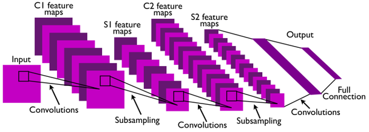

# 3장 개요 — Convolutional Neural Network(1)
<!-- 슬라이드 173 -->

3장의 주제는 **주요 ConvNet 구조를 알아보는 것**이다. 2장에서 PyTorch 와 Lightning 으로 모델을 정의하고 학습시키는 workflow, `torchvision.datasets` 로 데이터를 꺼내는 법, Tensor·Layer·activation·Dropout·BatchNormalization 같은 부품을 API 수준에서 익혔다면, 3장은 그 부품으로 **영상을 다루는 신경망**을 조립하는 장이다. 사람에게는 쉬운 영상인식이 컴퓨터에게 왜 어려운지에서 출발해, convolution 연산과 ConvNet 의 기본 구조를 세우고, ImageNet 에서 deep 구조의 가능성을 연 AlexNet 과 3x3 filter 로 깊이를 밀어붙인 VGGNet 을 읽는다. 이어서 이런 깊은 모델이 실제로 학습되도록 하는 최적화 기법을 초기화부터 정규화까지 훑고, 마지막 두 절은 실습으로 CNN 모델을 고치고 들여다보는 법과 폴더에 흩어진 이미지 파일을 Dataset 으로 만드는 법을 손에 익힌다. 3장이 "convolution 을 쌓으면 이미지를 분류할 수 있다" 를 확인하는 장이라면, 이어지는 4장은 GoogLeNet · ResNet · DenseNet 으로 "어떻게 쌓아야 더 깊고 정확한 망이 되는가" 를 다룬다.

아래 그림은 이 장이 다루는 ConvNet 의 원형을 한 장으로 보여 준다. 입력 영상에 convolution 을 적용해 C1 feature map 을 만들고, subsampling 으로 줄인 S1 feature map 에 다시 convolution 과 subsampling 을 거듭한 뒤(C2, S2), 마지막에 full connection 으로 출력에 잇는다. "Convolution 과 subsampling 이 특징을 추출하고 fully connected layer 가 분류한다" 는 이 골격이 3.1 절의 LeNet 에서 확립되고, 3.2 절의 AlexNet 과 VGGNet 은 이 골격을 더 깊게 만든 것이다.

<!-- 슬라이드 174~176 : 숨김 공백 슬라이드, 내용 없음 -->

## 학습 목표
<!-- 슬라이드 178 -->

이 장을 마치면 다음을 할 수 있어야 한다.

- **영상인식(image recognition)이 어려운 이유를 설명할 수 있다.** 컴퓨터가 보는 영상이 어떤 특징을 가진 데이터인지, 그리고 같은 대상이라도 조건에 따라 왜 전혀 다른 데이터가 되어 인식이 특히 어려워지는지를 말할 수 있다.
- **ConvNet 의 구조와 특징을 설명할 수 있다.** Convolution 연산이 무엇인지, ConvNet 이 일반 신경망과 달리 갖는 특별함이 어디서 오는지, 그리고 ConvNet 의 시초인 LeNet 의 구조와 특징이 무엇인지 말할 수 있다.
- **AlexNet 의 구조와 특징을 설명할 수 있다.** AlexNet 의 구조를 읽고, 이 모델의 주요 기여 사항인 ReLU, LRN, data augmentation, dropout 이 각각 어떤 문제를 풀었는지 말할 수 있다.
- **VGGNet 의 구조와 특징을 설명할 수 있다.** VGGNet 의 구조를 읽고, 이 모델의 주요 기여 사항인 ConvNet 구조의 깊이에 관한 연구가 무엇을 밝혔는지 말할 수 있다.

학습 목표는 3.1 과 3.2 절, 곧 ConvNet 의 구조를 읽는 눈에 맞춰져 있다. 3.3 절의 최적화 기법과 3.4 · 3.5 절의 실습은 그 눈으로 읽은 구조를 실제로 학습시키고 다루기 위한 준비이며, 각 절의 머리에 절별 학습 목표가 따로 있다.

## 절 구성
<!-- 슬라이드 177, 199, 217, 261, 289 -->

| 절 | 한 줄 요약 | 실습 |
|---|---|---|
| 3.1 ConvNet 개요 | 컴퓨터가 보는 영상이 무엇이고 영상인식이 왜 어려운지에서 출발해, 특징공학에 기대는 전통적 컴퓨터 비전과 end-to-end 로 특징을 학습하는 딥러닝 접근을 비교하고, LeNet 에서 확립된 convolution·pooling·fully-connected 의 기본 구조와 ConvNet 의 장점(위치 불변성·구성성·로컬 연결성)이 어디서 오는지 본다. Convolution 연산의 뜻, color image 에 대한 conv layer 의 입출력 shape 과 parameter 수, `torch.nn.Conv2d` 의 인자와 receptive field 를 정리한 뒤 MNIST 에서 MLP 와 CNN 을 비교한다. | 실습 3.1.1 — MLP, CNN 모델 비교 / 실습과제 1 — MNIST: LeNet-5 와 유사한 모델 / 실습과제 2 — CIFAR-10 적용 |
| 3.2 AlexNet / VGGNet | ImageNet 데이터셋과 ILSVRC 의 과제·평가 지표를 소개하고, deep 구조의 가능성을 처음 보인 AlexNet 의 구조도를 층별 parameter 수까지 읽는다. AlexNet 이 deep NN 을 가능하게 한 기술(ReLU, LRN, data augmentation, dropout)과, VGGNet 이 3x3 filter 를 고정하고 깊이만 바꾸어 밝힌 사실, LRN 폐기, multi-scale training/testing, dense evaluation, multi-crop 을 정리한다. | 실습 3.2.1 — AlexNet like 모델과 VGG-11 모델을 만들어 보자 |
| 3.3 Optimization | 협의의 최적화(loss 를 줄이는 parameter 갱신)와 광의의 최적화(초기화·hyper parameter·알고리즘·규제·정규화의 설계 결정)를 구분하고, weight initialization, hyper parameter 탐색, SGD 에서 Adam·AdamW 로 이어지는 optimizer 의 계보, overfitting 을 막는 네 접근(data augmentation, right capacity 와 weight decay, ensemble, DropOut/BatchNorm), early stopping 과 learning rate schedule, Batch/Layer/Instance/Unit normalization, 그리고 imbalanced data·label 부족 같은 데이터 문제의 대응 전략까지 훑는다. | 실습 3.3.1 — Optimization : L2 / L1 regularization, Dropout, Normalization 기법 비교 / 참고 실습 3.3.2.0 — WCE, Self-Paced Learning |
| 3.4 실습 : CNN model handling | 기본 CNN 에 Dropout 층과 Batch normalization 층을 넣은 세 모델을 같은 조건으로 학습시켜 학습 곡선을 비교하고, conv layer 의 filter 와 중간 feature map 을 시각화하며, torchvision 의 pre-trained VGG16 을 읽어 conv block 별 feature map 을 추출해 representation 의 의미를 살펴본다. | 실습 3.4.1 — Modern CNN / 실습 3.4.2 — CNN Feature map 시각화 / 실습 3.4.3 — Pre-trained VGG model Feature Maps |
| 3.5 실습 : Image Dataset handling | 클래스별 폴더에 나뉜 이미지 파일을 `torchvision.datasets.ImageFolder` 로 Dataset 으로 만들고 `DataLoader` 로 batch 를 꺼내는 과정을 shape 으로 확인한 뒤, `torchvision.transforms.v2` 의 basic transform 과 augmentation transform 을 `Compose` 로 묶어 real-time augmentation 을 구성하고, CustomDataset 으로 만든 시험용 batch 에서 각 augmentation 의 효과를 눈으로 본다. | 실습 3.5.1 — image file 로 dataset 만들기 |

앞의 세 절이 개념이고 뒤의 두 절이 실습이지만, 개념 절에도 실습이 들어 있다. 3.1 의 실습 3.1.1 은 MNIST 에서 MLP 와 CNN 을 견주어 "왜 CNN 인가" 를 수치로 보여 주고, 3.2 의 실습 3.2.1 은 구조도를 읽은 AlexNet 과 VGG-11 을 Lightning 으로 직접 조립하며, 3.3 의 실습 3.3.1 은 weight decay·Dropout·normalization 이 학습 곡선을 어떻게 바꾸는지 확인한다. 3.4 는 3.3 에서 배운 Dropout 과 Batch normalization 을 CNN 안에 넣고 학습된 filter 와 feature map 을 눈으로 보는 절이고, 3.5 는 3.3 의 data augmentation 을 실제 이미지 파일 pipeline 위에서 구현하는 절이다. 즉 3.3 이 개념의 허리이고, 3.4 와 3.5 가 그것을 각각 모델 쪽과 데이터 쪽에서 실습으로 받는다. 실습 노트북은 각 절의 실습 소절에 파일명과 Colab 링크가 있다.
