# 3.1 ConvNet 개요

**학습 목표**

- 영상인식이 왜 어려운 문제인지, 컴퓨터가 보는 영상이 어떤 형태의 데이터인지 설명할 수 있다.
- 특징공학(feature engineering)에 기대는 전통적 컴퓨터 비전과 end-to-end 로 특징을 학습하는 딥러닝 접근의 차이를 설명할 수 있다.
- ConvNet 을 구성하는 세 가지 layer(convolution, pooling, fully-connected)의 역할과 ConvNet 의 장점이 어디서 오는지(위치 불변성·구성성·로컬 연결성) 설명할 수 있다.
- 1D/2D convolution 연산의 뜻과 color image 에 대한 convolution layer 의 입출력 shape, parameter 수를 계산할 수 있다.
- `torch.nn.Conv2d` 의 인자를 이해하고, MNIST 에 대해 MLP 모델과 CNN 모델을 만들어 성능과 복잡도를 비교할 수 있다.

**이 절의 구성**

- 3.1.1 영상인식과 딥러닝 접근
- 3.1.2 ConvNet 의 시초 LeNet 과 기본 구조
- 3.1.3 ConvNet 의 장점은 어디서 오는가
- 3.1.4 Convolution 연산
- 3.1.5 torch.nn.Conv2d 와 receptive field
- 3.1.6 CNN layer 를 사용한 모델 만들기 — 실습 3.1.1
- 3.1.7 실습과제
- 3.1.8 정리

---

## 3.1.1 영상인식과 딥러닝 접근
<!-- 슬라이드 179~180 -->

### 영상인식은 왜 어려운가

영상인식(image recognition)은 사람에게는 쉬워 보이지만 컴퓨터에게는 대단히 어려운 문제다. 사람은 고양이 사진을 보는 순간 "고양이"라고 알아보지만, 컴퓨터가 보는 것은 그림이 아니라 거대한 data set 이다. 컴퓨터에게 영상은 0\~255 사이의 값으로 채워진 거대한 배열이고, color 영상이라면 여기에 R, G, B 세 채널이 더해진다. 고양이 얼굴의 작은 영역 하나만 떼어 보아도, 컴퓨터가 보는 것은 숫자가 빽빽하게 들어찬 행렬일 뿐이다.

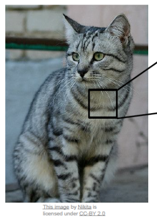

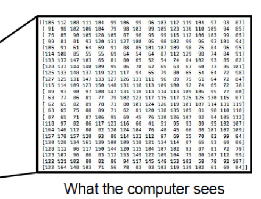

같은 대상이라도 영상이 찍히는 조건에 따라 이 숫자 배열은 완전히 달라진다. 그래서 영상인식은 "고양이 픽셀 값의 범위"를 정해 두는 식으로는 풀 수 없다. 영상인식을 어렵게 만드는 요인은 다음과 같다.

**밝기 변화(illumination).** 조명이 달라지면 같은 고양이도 전혀 다른 픽셀 값을 갖는다. 실내의 따뜻한 조명 아래 있는 고양이와 역광 속의 고양이는 숫자 배열로 보면 공통점이 거의 없다.

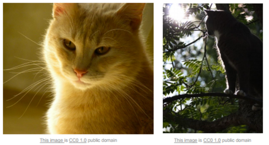

**다양한 변형(deformation).** 고양이는 눕고, 서고, 몸을 비튼다. 자세가 바뀌면 형태 자체가 달라지므로 고정된 모양 하나로 대상을 정의할 수 없다.

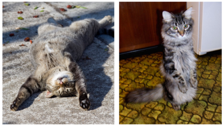

**가림(occlusion).** 대상의 일부가 천이나 풀에 가려 보이지 않을 수 있다. 일부만 보이는 상태에서도 사람은 고양이임을 알지만 컴퓨터는 가려진 부분의 정보를 얻을 수 없다.


**배경 장애(background clutter).** 대상이 배경과 비슷한 색과 무늬를 가지면 어디까지가 대상이고 어디부터가 배경인지 구분하기 어렵다.


**다양성(intraclass variation).** 같은 "고양이" 범주 안에서도 털 색, 무늬, 크기, 얼굴 생김새가 제각각이다. 하나의 범주가 매우 다양한 픽셀 배열을 포괄해야 한다.


이런 요인들은 서로 조합되어 나타나므로, 사람이 규칙을 손으로 적어 해결할 수 있는 성격의 문제가 아니다.

참고: http://cs231n.stanford.edu/

### 컴퓨터 비전과 딥러닝 접근의 비교

전통적인 컴퓨터 비전(computer vision)과 딥러닝(deep learning)의 접근은 **특징공학(feature engineering) 대 end-to-end learning** 으로 요약된다.

전통적 영상처리에서는 사람이 직접 설계한 특징 추출기, 즉 handcrafted feature engineering 이 필요했다. 어떤 특징이 유용한지는 domain 특성에 영향을 많이 받으므로, 문제가 바뀌면 특징 추출기도 사람이 다시 설계해야 했다. 이후 PCA 등을 통해 중간 수준(mid-level)의 특징을 자동으로 생성하는 방식이 더해졌지만, 앞단의 특징 추출기는 여전히 사람의 몫이었고 학습되는 것은 마지막의 분류기(trainable classifier)뿐이었다.

딥러닝은 raw image 로부터 특징을 자동으로 학습한다. 낮은 수준(low-level)의 특징에서 중간 수준, 높은 수준(high-level)의 특징으로 이어지는 계층적 표현(representation)을 데이터로부터 학습하고, 그 위의 분류기까지 한꺼번에 학습한다. 특징 추출부터 분류까지 전부가 자동화 영역이 되는 것이다. 이는 인간이 data 를 보고 특징을 찾아가는 방식, 인간이 특징을 이해하는 방식과 유사하다.

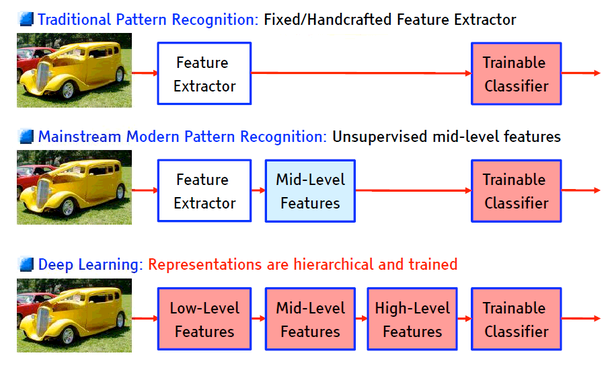

> **핵심 메시지**
> 전통적 컴퓨터 비전은 사람이 특징을 설계하고 컴퓨터는 분류만 학습했다. 딥러닝은 raw image 에서 특징을 계층적으로 찾아내는 일까지 학습에 맡긴다.

---

## 3.1.2 ConvNet 의 시초 LeNet 과 기본 구조
<!-- 슬라이드 181~183 -->

### LeNet (1998)

ConvNet 의 시초는 Yann LeCun 이 1998 년에 발표한 LeNet 이다. LeCun 은 CNN 구조를 최초로 제안하고, 이를 미국 우체국의 손 글씨 zip code 인식 프로젝트에 적용했다. 이때 쓰인 손 글씨 숫자 데이터가 MNIST 다. 당시에는 layer 수가 낮은 수준이어서 다양한 영상 문제로의 범용화까지는 이루지 못했지만, **Convolution + Pooling + Fully-connected(FC)** 라는 CNN 의 기본 구조를 확립했다는 점에서 의미가 크다. 이후의 CNN 은 모두 이 뼈대 위에서 층을 깊게 쌓고 구조를 다듬은 것이다.

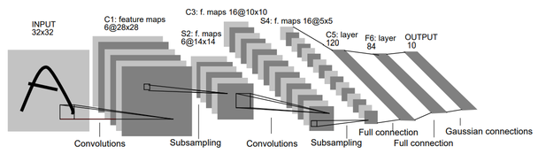

참고: http://yann.lecun.com/exdb/publis/pdf/lecun-01a.pdf

### Convolutional Neural Network 의 특징

Convolutional Neural Network(ConvNet, CNN)는 이미지 데이터에 최적화된 신경망이다. ConvNet 의 특징은 세 가지로 정리된다.

- **이미지 데이터에 최적화** — 이미지의 특징을 encoding 하도록 설계되어 있다.
- **Parameter 를 크게 줄임** — Convolution 연산을 쓰면 이미지 연산에 필요한 parameter 가 fully-connected 방식보다 크게 줄어든다.
- **3D data** — 이미지가 color 인 경우 깊이(depth)의 차원을 가진다. 즉 $H \times W \times D$ 형태이고 $D$ 는 R, G, B 채널이다.

Convolution 은 작은 filter 가 이미지 위를 훑으면서 각 위치에서 filter 와 겹치는 영역의 값을 곱해 더하는 연산이다. 아래 애니메이션은 filter 가 입력(아래 평면)을 훑으며 출력(위 평면)의 값을 하나씩 만들어 가는 모습이다.

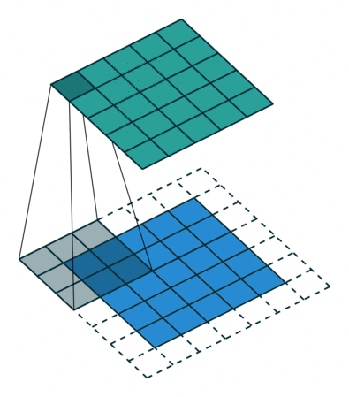

filter 의 크기와 stride(filter 가 한 번에 이동하는 칸 수)에 따라 출력의 크기가 달라진다. 5x5 이미지에 3x3 filter 를 stride 1 로 적용하면 3x3 의 convolved feature 가 나온다. 반면 큰 이미지에 10x10 filter 를 stride 10 으로 적용하면 filter 가 겹치지 않고 10 칸씩 건너뛰므로 출력이 훨씬 작아진다.

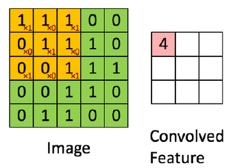

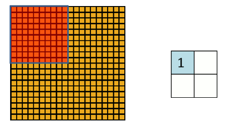

ConvNet 을 구성하는 layer 는 세 가지이며 역할이 뚜렷하게 나뉜다.

| Layer | 역할 |
|---|---|
| Convolutional layer | Convolution 을 이용한 특징 추출, dimension 축소 |
| Pooling layer | 추출한 특징을 더욱 압축적으로 표현 |
| Fully-connected layer | 정제된 특징을 기반으로 분류 |

### ConvNet 기본 구조

정리하면 CNN 은 **Convolution + Subsampling + Full Connection** 이다. Convolution 과 subsampling(pooling)이 반복되는 앞부분이 특징 추출을 담당하고, 뒤의 fully connected 부분이 추출된 특징을 사용해 분류한다. LeNet-5 의 구조도를 보면 입력 → C1 feature maps(convolutions) → S1 feature maps(subsampling) → C2 → S2 → full connection → output 으로 이어지는 흐름이 그대로 보인다.


그렇다면 ConvNet 의 장점은 어디서 오는가? 세 가지로 요약된다.

- **Local invariance(위치 불변성)** — conv. filter 가 이미지를 scan 한다. 적은 parameter 로 많은 영역을 처리하는 parameter sharing 이 가능하다.
- **Compositionality(구성성)** — 계층화된 구조로 특징을 체계화한다.
- **Local connectivity(로컬 연결성)** — 작지만 깊게 본다.

세 가지를 차례로 살펴본다.

---

## 3.1.3 ConvNet 의 장점은 어디서 오는가
<!-- 슬라이드 184~185 -->

### Local invariance(위치 불변성)와 parameter sharing

Conv filter 는 image 영역을 scan 한다. 즉 하나의 filter 가 이미지의 모든 위치에 같은 가중치로 적용된다. 어떤 특징(예를 들어 세로 방향의 edge)이 이미지의 왼쪽 위에 있든 오른쪽 아래에 있든 같은 filter 가 반응하므로, 위치에 불변(invariant)한 특징 추출이 된다.

이렇게 filter 하나를 모든 위치에서 공유하는 것을 **parameter sharing** 이라고 한다. Fully-connected layer 라면 입력 픽셀 하나하나마다 별도의 가중치가 필요하지만, convolution 은 filter 크기만큼의 parameter 로 이미지 전체 영역을 처리한다. Parameter 가 적으면 연산량이 줄고, overfitting 이 방지되는 등 여러 이점이 따라온다.

MNIST 분류 모델을 비교하면(실습 코드 참조) 유사한 성능에서 두 모델의 parameter 수가 크게 차이 난다.

| 모델 | Parameter 수 |
|---|---|
| MLP(512, 10) | 305,290 |
| CNN(3x3x32/s=3, 10) | 31,482 |

### Local connectivity(로컬 연결성)

Filter 의 크기는 작지만 깊이는 전체를 본다. 3x3 filter 는 공간적으로는 3x3 의 좁은 영역만 보지만, 채널 방향으로는 입력의 모든 채널(depth)을 한꺼번에 본다. 이렇게 얻은 출력이 다시 다음 layer 의 입력 채널이 되므로, 앞 layer 의 다양한 filter 들이 맡았던 역할이 뒤 layer 에서 통합되고, 특징은 고차원에서 통합된다.

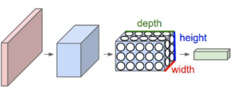

### Compositionality(구성성)

ConvNet 은 계층화된 구조로 특징을 체계화한다. 첫 layer 는 edge 같은 low-level feature 를 학습하고, layer 가 진행될수록 눈, 코 같은 high-level feature 를 학습한다. 아래 그림은 학습된 ConvNet 의 layer 1, 2, 3 에서 각 filter 가 가장 강하게 반응하는 패턴과, 그 패턴에 해당하는 실제 이미지 조각을 나란히 보여 준다. Layer 1 은 방향성 있는 edge 와 색 대비에, layer 2 는 모서리·원·격자 같은 조합에, layer 3 은 더 복잡한 질감과 물체의 일부에 반응한다.

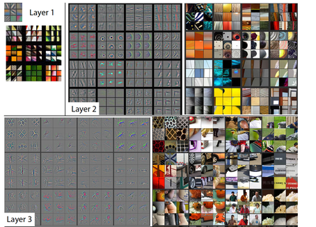

> **핵심 메시지**
> ConvNet 의 장점은 parameter sharing(위치 불변성), 작지만 깊게 보는 filter(로컬 연결성), 그리고 층을 쌓아 특징을 체계화하는 구조(구성성)에서 온다.

---

## 3.1.4 Convolution 연산
<!-- 슬라이드 186~188 -->

### 1D convolution

Convolution(합성곱, 길쌈)은 두 함수 $f$, $g$ 로부터 새 함수 $f * g$ 를 만드는 연산이다. 한 함수를 반전(뒤집기)한 뒤 전이(shift)시켜 가며, 두 함수의 값을 곱하고, 그 결과를 적분한 값이다. 이 말을 식으로 옮기면 다음과 같다.

$$ (f * g)(t) = \int f(\tau)\, g(t - \tau)\, d\tau $$

Cross-correlation 은 반전 없이 전이만 하면서 곱하고 적분하는 연산으로, convolution 과 유사하다. Autocorrelation 은 같은 함수끼리의 cross-correlation 이다. 아래 그림에서 파란 $f$ 와 빨간 $g$ 중 하나를 이동시키며 겹치는 부분(초록)의 넓이를 구한 것이 검은 곡선이다.

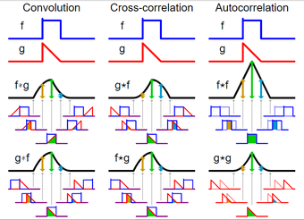

Convolution 은 신호 배열(vector)의 유사성을 재는 연산으로 볼 수 있다. $g$ 와 비슷한 모양이 $f$ 안에 있는 위치에서 $f * g$ 가 큰 값을 갖기 때문이다. 그래서 convolution 은 특정 신호만 통과시키는 **filter** 로 쓰인다.

참고: https://en.wikipedia.org/wiki/Convolution

### 2D convolution

Image 에 적용하는 2D convolution 도 원리는 같다. 수학적 정의로는 kernel 을 대각선으로 뒤집어서 곱하지만, 실제 신경망에서는 그냥 곱한다. Kernel 의 값이 학습 대상이므로 뒤집든 뒤집지 않든 학습 결과는 같기 때문이다.

$$ \left( \begin{bmatrix} a & b & c \\ d & e & f \\ g & h & i \end{bmatrix} * \begin{bmatrix} 1 & 2 & 3 \\ 4 & 5 & 6 \\ 7 & 8 & 9 \end{bmatrix} \right)[2,2] = (i \cdot 1) + (h \cdot 2) + (g \cdot 3) + (f \cdot 4) + (e \cdot 5) + (d \cdot 6) + (c \cdot 7) + (b \cdot 8) + (a \cdot 9) $$

위 식은 3x3 kernel 을 뒤집어 곱하는 수학적 convolution 이다. 위치 $[2,2]$ 의 출력을 계산할 때 kernel 의 1 이 이미지의 $i$ 와, 9 가 $a$ 와 짝지어진다. 뒤집지 않고 그대로 곱하면 $a \cdot 1 + b \cdot 2 + \cdots + i \cdot 9$ 가 되며, 이것이 신경망에서 실제로 하는 계산이다.

4x4 image 에 3x3 kernel 을 적용하는 예를 보자. Kernel 의 왼쪽 열이 1, 가운데가 0, 오른쪽 열이 $-1$ 이므로 왼쪽이 밝고 오른쪽이 어두운 곳에서 큰 값이 나온다. 4x4 입력에 3x3 kernel 을 stride 1 로 적용하면 2x2 출력이 된다.

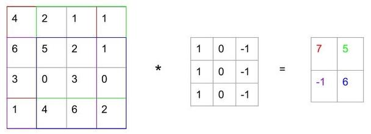

Image processing 에서 2D convolution 에 쓰이는 이 작은 행렬을 convolution matrix, kernel, filter, mask 라고 부르며 특징 추출을 위해 사용한다. Convolution 연산이 핵심인 neural network 에서는 conv layer 의 가중치(weight)가 곧 kernel, filter 다. 즉 **weight = kernel = filter** 이고, 학습되는 것은 이 filter 의 값이다.

컴퓨터가 보는 손 글씨 숫자 이미지도 결국 숫자 배열이다. 아래는 MNIST 의 숫자 4 이미지와, 그 일부 영역의 픽셀 값을 0\~1 로 scale 하여 나타낸 것이다. 획이 지나가는 곳은 0.9 대의 값이고 배경은 0.0 이다.

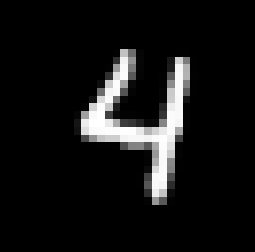

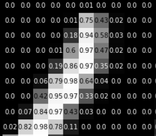

이런 이미지에 여러 filter 를 적용하면 filter 마다 다른 특징이 통과된다. 아래 첫 그림은 입력 이미지이고, 다음 그림은 서로 다른 네 filter 를 통과한 결과다. Filter 에 따라 특정 방향의 획 경계만 밝게 남는다.

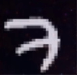

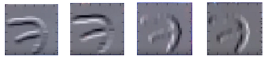

### Color image 의 convolution layer

Color image 는 $H \times W \times D$ 의 3D 데이터이고 $D$ 는 R, G, B 채널, 즉 입력 채널(input channel)의 수다. 입력 채널이 3 개이면 filter 도 channel 별로 3 개, 즉 3x3x3 의 3 차원 filter 가 된다. Filter 하나는 세 채널을 모두 곱해 더한 뒤 하나의 값을 내므로, filter 하나에 bias 도 1 개다. Bias 의 수는 output channel 에 따라 정해진다. 출력 채널이 2 개면 filter 도 2 개, bias 도 2 개다.

크기로 정리하면 (5,5,3) 입력에 (3,3,3,2) filter 와 2 개의 bias 를 적용하면 (3,3,2) 출력이 나온다. 아래 그림이 이 과정이다. 5x5x3 입력에 padding 1 을 붙여 7x7x3 이 되고, 3x3x3 filter W0, W1 두 개를 stride 2 로 적용해 3x3x2 의 output volume 을 만든다. Output 의 각 값은 red, green, blue 세 채널(plane)에서 filter 와 겹치는 영역을 곱해 더한 값에 bias 를 더한 것이다.

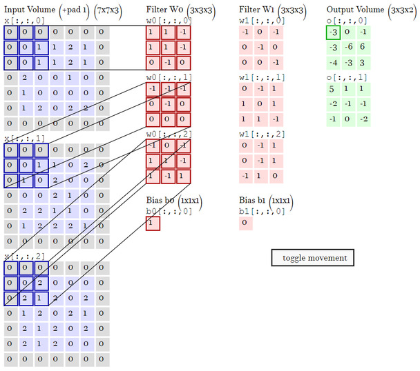

Filter 가 학습된다는 것은 무엇을 뜻하는가? Filter 는 특징을 통과시키는 것이므로, filter 가 학습된다는 것은 데이터에서 유용한 특징을 찾도록 filter 의 값이 변해 간다는 뜻이다. 앞의 edge filter 는 사람이 정한 값이었지만, ConvNet 에서는 어떤 filter 가 분류에 도움이 되는지를 역전파로 배운다.

여기서 두 가지 질문을 해 볼 수 있다. 이 convolution layer 의 뉴런은 몇 개일까? 그리고 bias 는 몇 개일까? Fully-connected layer 에서 뉴런 하나가 가중치 벡터 하나와 bias 하나를 갖듯, convolution layer 에서는 filter 하나가 뉴런 하나에 해당한다. 위 예제의 뉴런은 W0, W1 의 2 개이고 bias 도 b0, b1 의 2 개다. 이것이 "bias 는 output channel 에 따라" 정해진다는 말의 뜻이다.

참고: http://aikorea.org/cs231n/convolutional-networks/

---

## 3.1.5 torch.nn.Conv2d 와 receptive field
<!-- 슬라이드 189~190 -->

### torch.nn.Conv2d

PyTorch 에서 2D convolution layer 는 `torch.nn.Conv2d` 다.

```python
torch.nn.Conv2d(in_channels, out_channels, kernel_size, stride=1, padding=0, ...)
```

주요 인자의 뜻은 다음과 같다.

| 인자 | 뜻 | 예 |
|---|---|---|
| `in_channels` | 입력 feature(채널)의 수 | `3` |
| `out_channels` | 출력 feature 의 수 = conv. node(filter)의 수 | `7` |
| `kernel_size` (int 또는 tuple) | filter 의 크기 | `3` 또는 `(3, 3)` |
| `stride` (int 또는 tuple) | filter 가 이동하는 간격 | `1` 또는 `(1, 1)` |
| `padding` (int, tuple 또는 str) | 가장자리에 덧대는 칸 수 | `0`, `(0, 0)` 또는 `'valid'` / `'same'` |

`out_channels` 가 곧 filter 의 수이며, 앞 소절에서 본 뉴런의 수다. `padding='same'` 은 출력의 공간 크기가 입력과 같아지도록 자동으로 padding 을 넣고, `'valid'` 는 padding 없이(0) 계산한다.

Parameter 수는 filter 하나의 크기(입력 채널 수 x kernel 높이 x kernel 너비)에 filter 수를 곱하고, filter 수만큼의 bias 를 더한 것이다.

$$ \text{Parameters} = in_c \times k_h \times k_w \times out_c + out_c $$

예를 들어 `in_channels=3, out_channels=7, kernel_size=(3,3), stride=1, padding=1` 이면

$$ 3 \times 3 \times 3 \times 7 + 7 = 196 $$

이다. 노트북에서는 같은 layer 를 두 가지 방법으로 만들어 본다.

```python
nn.Conv2d(3, 7, (3, 3), stride=1, padding=1)
nn.Conv2d(3, 7, 3, padding='same')
```

두 줄은 같은 layer 를 만든다. 3x3 kernel 에 stride 1 이면 padding 1 이 곧 `'same'` 이기 때문이다. `kernel_size` 를 정수 하나로 주면 정사각 kernel 로 해석된다.

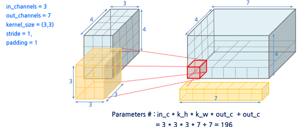

### Receptive field

Receptive field 는 output feature 하나를 생성하는 데 관여하는 input 영역의 크기다. 첫 conv layer 의 출력 한 칸은 3x3 kernel 이면 입력의 3x3 영역만 본다. 그 위에 3x3 conv 를 하나 더 쌓으면 두 번째 layer 의 출력 한 칸은 첫 layer 출력의 3x3, 곧 입력의 5x5 영역을 보게 된다. Stride 나 pooling 이 들어가면 receptive field 는 층마다 더 빨리 커진다.

Receptive field 는 입력 신호가 출력에 영향을 미치는 범위를 이해하는 데 필요하다. 특히 여러 path 로 갈라지는 복잡한 구조의 모델을 설계하는 경우, 각 path 가 적절한 receptive field 를 갖는지 검토해야 한다. 아래 그림은 kernel 크기, padding, stride 를 바꿔 가며 각 layer 의 출력 한 칸이 입력의 어느 범위에서 오는지를 시각화한 것이다.

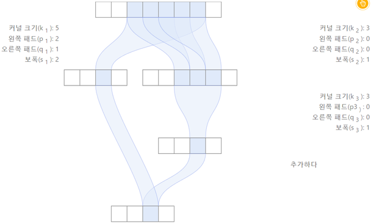

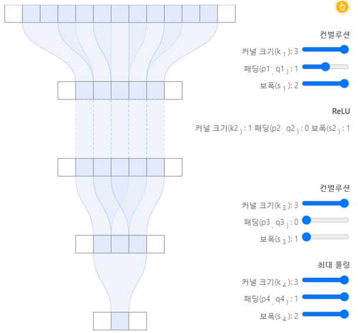

참고: https://distill.pub/2019/computing-receptive-fields/

---

## 3.1.6 CNN layer 를 사용한 모델 만들기
<!-- 슬라이드 191~195 -->

### 실습 3.1.1 — MLP, CNN 모델 비교

> 노트북: `code/3.1.1.ConvNet.ipynb`
> [](https://colab.research.google.com/github/AI-BoostCamp/intermediate-deep-learning-pytorch/blob/main/code/3.1.1.ConvNet.ipynb)

**실습 개요**

Fully connected layer 로만 구성된 MLP 모델과 convolutional layer 로 구성된 CNN 모델을 만들어 두 모델의 특징을 비교한다. 진행 순서는 다음과 같다.

1. MNIST dataset 을 준비한다(28x28 흑백 image).
2. Fully connected layer 만 사용한 MLP 모델을 준비한다.
3. Convolutional layer 를 사용한 CNN 모델을 준비한다.
4. 두 모델의 성능이 비슷해지도록 설계한 뒤, 모델의 복잡도(parameter 수)를 비교한다.

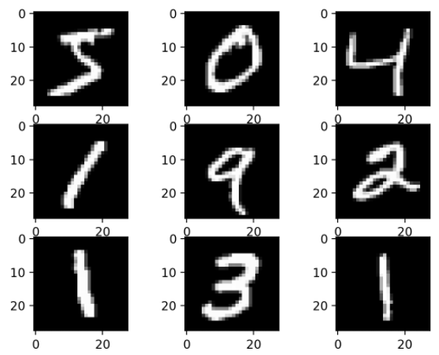

**MNIST data 준비**

```python
from torchvision.datasets import MNIST

transform = v2.Compose([
    v2.ToImage(),
    v2.ToDtype(torch.float32, scale=True) ] )

batch_size = 512
download_root = ''
train_dataset = MNIST(download_root, train=True, download=True, transform=transform)
test_dataset = MNIST(download_root, train=False, download=True, transform=transform)
trainDataLoader = DataLoader(train_dataset, batch_size, True,num_workers=4)
valDataLoader = DataLoader(test_dataset, batch_size, False,num_workers=4)
```

torchvision 의 `MNIST` 는 처음 한 번 download 하고, 이미지를 꺼낼 때마다 `transform` 을 적용한다. `v2.ToImage()` 는 PIL 이미지나 H x W 배열을 (C, H, W) 순서의 tensor image 로 바꾸고, `v2.ToDtype(torch.float32, scale=True)` 는 0\~255 의 정수를 0\~1 의 float32 로 scale 한다. 이것이 data shape 변경이다. 결과적으로 모델에 들어가는 한 장의 shape 은 (1, 28, 28) 이 되고, batch 로 묶이면 (512, 1, 28, 28) 이다. `DataLoader` 는 batch_size 512 로 묶고 학습용은 shuffle 한다.

```python
pst(trainDataLoader.dataset.data)    # image
pst(trainDataLoader.dataset.targets) # label
plt.imshow(trainDataLoader.dataset.data[0])
plt.show()
```

`dataset.data` 는 transform 을 거치기 전의 원본으로, 60,000 x 28 x 28 의 `torch.Tensor` 다. `targets` 는 60,000 개의 label 이다. 첫 이미지를 그려 보면 숫자 5 다.

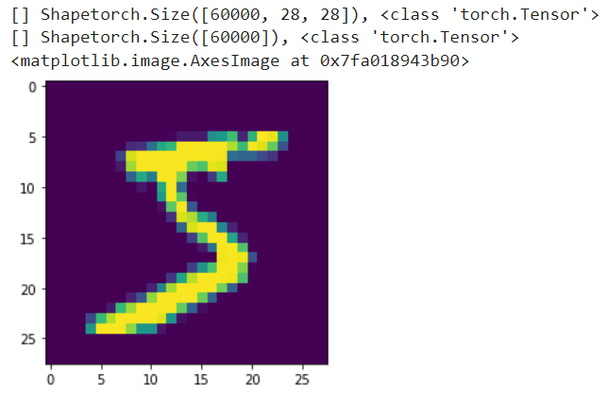

**공통 학습 루틴**

두 모델은 층 구성만 다르고 학습 방법은 같다. 그래서 학습 step, 검증 step, optimizer 를 `LightningModule` 을 상속한 공통 클래스 `Wrap_10` 에 한 번만 정의하고, 각 모델은 이를 상속해 층과 `forward` 만 정의한다. 이름의 10 은 class 수다.

```python
class Wrap_10(L.LightningModule):
    def training_step(self, batch, batch_idx):
        x, y = batch
        y_pred = self(x)
        loss = F.cross_entropy(y_pred, y)
        acc = FM.accuracy(y_pred, y, task="multiclass",num_classes=10)
        metrics={'loss':loss, 'acc':acc}
        self.log_dict(metrics,prog_bar=True,on_step=False,on_epoch=True)
        return loss

    def validation_step(self, batch, batch_idx):
        x, y = batch
        y_pred = self(x)
        loss = F.cross_entropy(y_pred, y)
        acc = FM.accuracy(y_pred, y, task="multiclass",num_classes=10)
        metrics={'val_loss':loss, 'val_acc':acc}
        self.log_dict(metrics,prog_bar=True,on_step=False,on_epoch=True)

    def configure_optimizers(self):
        return torch.optim.Adam(self.parameters(), lr=0.001)
```

`training_step` 은 batch 를 받아 모델 출력 `y_pred` 를 구하고, `F.cross_entropy` 로 loss 를, torchmetrics 의 `FM.accuracy` 로 정확도를 계산한다. `log_dict(..., on_step=False, on_epoch=True)` 는 step 마다가 아니라 epoch 단위로 평균을 내어 기록하라는 뜻이다. `validation_step` 은 같은 계산을 검증 데이터에 대해 하되 `val_loss`, `val_acc` 라는 이름으로 기록한다. `configure_optimizers` 는 Adam 을 learning rate 0.001 로 돌려준다.

**Fully connected 모델(MLP)**

10 epoch 학습에서 두 모델이 유사한 성능이 되도록 설계한다. 먼저 fully connected layer 만 쓴 MLP 모델이다.

```python
# MLP model
class MLP(Wrap_10):
    def __init__(self):
        super(MLP, self).__init__()
        self.layers = nn.Sequential(  # Container
            nn.Flatten(),
            nn.Linear(28*28, 384),
            nn.ReLU(),
            nn.Linear(384, 10))

    def forward(self, x):
        out = self.layers(x)
        return out

mlp = MLP()
summary(mlp, input_size=(batch_size, 28, 28))
```

`nn.Flatten()` 이 (1, 28, 28) 이미지를 784 개의 값으로 펼치고, 784 → 384 → 10 의 두 linear layer 를 지난다. 2D 구조는 첫 단계에서 사라지고 픽셀 하나하나가 독립된 입력이 된다. `torchinfo.summary` 로 층별 출력 shape 과 parameter 수를 확인한다.

| Layer (type:depth-idx) | Output Shape | Param # |
|---|---|---|
| MLP | [512, 10] | -- |
| Sequential: 1-1 | [512, 10] | -- |
| Flatten: 2-1 | [512, 784] | -- |
| Linear: 2-2 | [512, 384] | 301,440 |
| ReLU: 2-3 | [512, 384] | -- |
| Linear: 2-4 | [512, 10] | 3,850 |

Total params 305,290, trainable params 305,290, non-trainable params 0, total mult-adds(M) 39.08 이다. 첫 linear layer 만으로 784 x 384 + 384 = 301,440 개의 parameter 가 든다.

```python
%%time
model = MLP()

epochs = 10
name="mlp"
logger = CSVLogger("logs", name=name)
trainer = Trainer(max_epochs=epochs, logger=logger,enable_model_summary=False)
trainer.fit(model, trainDataLoader, valDataLoader)
```

`CSVLogger` 는 `log_dict` 로 기록한 값을 `logs/mlp/version_N/metrics.csv` 에 쓴다. `Trainer` 에 epoch 수와 logger 를 주고 `fit` 에 모델과 두 DataLoader 를 넘기면 학습과 검증이 진행된다.

```python
v_num = logger.version
history = pd.read_csv(f'./logs/{name}/version_{v_num}/metrics.csv')
```

```python
h1 = history.drop('step', axis=1).groupby('epoch').last()
max_ = h1['val_acc'].max()

plt.figure(figsize=(10,3))
title = name
plt.subplot(121)
plt.title(f"{title}\nMax Val_Acc:{max_:.4f}")
plt.plot(h1['val_acc'], label='val_acc')
plt.legend()
plt.grid()

plt.subplot(122)
plt.title("Loss")
plt.plot(h1['val_loss'], label='val_loss')
plt.semilogy()
plt.legend()
plt.grid()
plt.show()
```

metrics.csv 에는 학습 지표와 검증 지표가 서로 다른 행에 기록되므로, `groupby('epoch').last()` 로 epoch 마다 각 열의 마지막 값을 모아 한 행으로 합친다. 그 결과 `h1` 은 epoch 별 `acc`, `loss`, `val_acc`, `val_loss` 를 갖는 표가 되고, 여기서 validation accuracy 와 loss 곡선을 그린다.

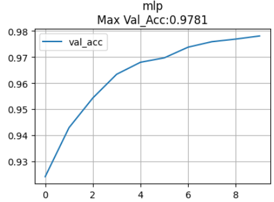

**Convolutional 모델(CNN)**

다음은 convolutional layer 를 사용한 CNN 모델이다.

```python
class CNN(Wrap_10):
    def __init__(self):
        super(CNN, self).__init__()
        self.layers = nn.Sequential(
            nn.Conv2d(1, 32, (3, 3), stride=2),
            nn.ReLU(),
            nn.Conv2d(32, 32, (3, 3), stride=2),
            nn.ReLU(),
            nn.Flatten(),
            nn.Linear(32*6*6, 10) )

    def forward(self, x):
        out = self.layers(x)
        return out

cnn = CNN()
summary(cnn, input_size=(batch_size, 1, 28, 28))
```

첫 `Conv2d(1, 32, (3, 3), stride=2)` 는 입력 채널 1(흑백), 출력 채널 32, 즉 3x3 filter 32 개를 stride 2 로 적용한다. Padding 이 없으므로 28x28 입력은 (28 - 3) / 2 + 1 을 내림한 13x13 이 되고, 두 번째 conv 에서 다시 (13 - 3) / 2 + 1 = 6x6 이 된다. Stride 2 가 pooling 없이도 공간 크기를 절반씩 줄이는 역할을 한다. 마지막에 32 x 6 x 6 = 1,152 개의 값을 펼쳐 linear layer 로 10 개 class 를 분류한다. CNN 은 channel 차원이 필요하므로 `summary` 의 `input_size` 를 (batch, 1, 28, 28) 로 준다.

| Layer (type:depth-idx) | Output Shape | Param # |
|---|---|---|
| CNN | [512, 10] | -- |
| Sequential: 1-1 | [512, 10] | -- |
| Conv2d: 2-1 | [512, 32, 13, 13] | 320 |
| ReLU: 2-2 | [512, 32, 13, 13] | -- |
| Conv2d: 2-3 | [512, 32, 6, 6] | 9,248 |
| ReLU: 2-4 | [512, 32, 6, 6] | -- |
| Flatten: 2-5 | [512, 1152] | -- |
| Linear: 2-6 | [512, 10] | 11,530 |

첫 conv 의 parameter 는 1 x 3 x 3 x 32 + 32 = 320, 두 번째 conv 는 32 x 3 x 3 x 32 + 32 = 9,248 로 앞 소절의 공식과 일치한다. Linear layer 가 1,152 x 10 + 10 = 11,530 으로 가장 많고, 세 층의 합은 21,098 개다. MLP 의 305,290 개와 비교하면 10 분의 1 이 채 되지 않는다.

```python
%%time
model = CNN()

model_name="cnn"
logger = CSVLogger("logs", name=model_name)
trainer = Trainer(max_epochs=epochs, logger=logger,enable_model_summary=False)
trainer.fit(model, trainDataLoader, valDataLoader)
```

```python
v_num = logger.version
history = pd.read_csv(f'./logs/{model_name}/version_{v_num}/metrics.csv')
```

```python
h2 = history.drop('step', axis=1).groupby('epoch').last()
max_1 = h1['val_acc'].max()
max_2 = h2['val_acc'].max()

plt.figure(figsize=(10,3))
title = "MLP / CNN"
plt.subplot(121)
plt.title(f"{title}\nMax Val_Acc:{max_1:.4f} / {max_2:.4f}")
plt.plot(h1['val_acc'],'--', label='val_acc1')
plt.plot(h2['val_acc'], label='val_acc2')
plt.legend()
plt.grid()

plt.subplot(122)
plt.title("Loss")
plt.plot(h1['val_loss'],'--', label='val_loss1')
plt.plot(h2['val_loss'], label='val_loss2')
plt.semilogy()
plt.legend()
plt.grid()
plt.show()
```

MLP 의 기록 `h1` 과 CNN 의 기록 `h2` 를 한 그래프에 겹쳐 그린다. 점선이 MLP, 실선이 CNN 이다.

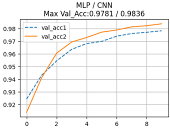

**Model training 결과 읽기**

두 모델 모두 10 epoch 에서 0.97\~0.98 대의 validation accuracy 에 이르고, CNN 이 오히려 조금 높다. 성능이 비슷한데 parameter 수는 CNN 이 훨씬 적다. 이것이 앞에서 본 parameter sharing 의 효과다. 같은 3x3 filter 32 개가 이미지의 모든 위치를 scan 하므로, 픽셀마다 가중치를 따로 두는 MLP 보다 훨씬 적은 parameter 로 같은 일을 한다. 뒤에 나오는 실습과제에서는 여기에 pooling 을 더한 LeNet 형태의 모델로 정확도를 더 끌어올린다.

---

## 3.1.7 실습과제
<!-- 슬라이드 196~197 -->

### 실습과제 1 — MNIST: LeNet-5 와 유사한 모델

LeNet-5 와 유사한 모델을 만들어 보자. 모델을 개선하여 10 epoch 에서 accuracy 99% 이상의 모델을 만드는 것이 목표다.


참고사항은 다음과 같다.

1. **Overfitting 이 발생하도록 모델을 키울 것.** Training accuracy 가 1\~2 epoch 에서 최고가 되고 overfitting 이 발생하는 것이 좋다. 모델을 키우고 BN(batch normalization)을 사용하여 overfitting 을 유도한다.
2. **Dropout, learning rate, batch size 등을 조정할 것.** 학습 속도를 늦추고 변동성을 줄이는 방향으로 최적화에 접근한다.

즉 먼저 충분히 큰 모델로 학습 데이터를 완전히 맞추는 능력을 확보한 뒤, 정규화와 하이퍼파라미터로 일반화 성능을 끌어올리는 순서다. 노트북에는 출발점이 될 LeNet 과 유사한 모델이 준비되어 있다.

```python
class LeNet_like(Wrap_10):
    def __init__(self):
        super(LeNet_like, self).__init__()
        self.layers = nn.Sequential(
            nn.Conv2d(1, 8, (3, 3), padding=1),
            nn.ReLU(),
            nn.MaxPool2d(2,2),
            nn.Conv2d(8, 16, (3, 3), padding=1),
            nn.ReLU(),
            nn.MaxPool2d(2,2),
            nn.Conv2d(16, 32, (3, 3), padding=1),
            nn.ReLU(),
            nn.MaxPool2d(2,2),
            nn.Flatten(),
            nn.Linear(32*3*3, 10)
           )

    def forward(self, x):
        out = self.layers(x)
        return out

LeNet = LeNet_like()
summary(LeNet, input_size=(batch_size, 1, 28, 28))
```

LeNet-5 처럼 convolution 과 subsampling 을 반복한다. `padding=1` 의 3x3 conv 는 공간 크기를 유지하고, `MaxPool2d(2,2)` 가 크기를 절반으로 줄인다. 28 → 14 → 7 → 3 으로 줄어드는 동안 채널은 8 → 16 → 32 로 늘어나므로 마지막 flatten 크기는 32 x 3 x 3 이다. 학습과 곡선 그리기는 실습 3.1.1 과 같은 코드를 쓰되 이번에는 `acc` 와 `val_acc`, `loss` 와 `val_loss` 를 함께 그려 overfitting 여부를 본다. 아래는 이 모델을 손본 LeNet-6 의 학습 곡선이다.

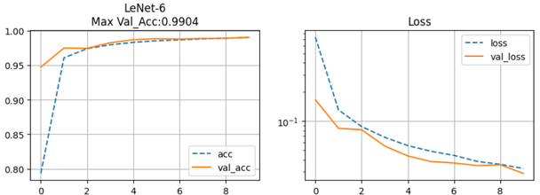

### 실습과제 2 — CIFAR-10 적용

CIFAR-10 dataset 을 적용해 보자. 앞에서 만든 모델에 적용하되, input data shape 을 (3, 32, 32) 로 수정하고, 모델을 개선하여 10 epoch 에서 accuracy 73% 를 넘기는 것이 목표다.

```python
from torchvision.datasets import CIFAR10
transform = v2.Compose([
    v2.ToImage(),
    v2.ToDtype(torch.float32, scale=True) ] )

batch_size = 512
download_root = 'CIFAR10'
train_dataset = CIFAR10(download_root, train=True, download=True, transform=transform)
test_dataset = CIFAR10(download_root, train=False, download=True, transform=transform)
trainDataLoader = DataLoader(train_dataset, batch_size, True,num_workers=7)
valDataLoader = DataLoader(test_dataset, batch_size, False,num_workers=7)
```

CIFAR-10 은 32x32 의 color 이미지이므로 한 장의 shape 이 (3, 32, 32) 다. 데이터 준비 코드는 MNIST 와 같고 dataset class 만 바뀐다.

```python
# LeNet like model
class LeNet_like(Wrap_10):
    def __init__(self):
        super(LeNet_like, self).__init__()
        self.layers = nn.Sequential(
            nn.Conv2d(3, 8, (3, 3), padding=1),
            nn.ReLU(),
            nn.MaxPool2d(2,2),

            nn.Conv2d(8, 16, (3, 3), padding=1),
            nn.ReLU(),
            nn.MaxPool2d(2,2),

            nn.Conv2d(16, 32, (3, 3), padding=1),
            nn.ReLU(),
            nn.MaxPool2d(2,2),

            nn.Flatten(),
#            nn.Dropout(0.4),
            nn.Linear(32*4*4, 10)
        )
    def forward(self, x):
        out = self.layers(x)
        return out

model = LeNet_like()
summary(model, input_size=(batch_size, 3, 32, 32))
```

모델에서 바뀌는 곳은 두 군데다. 첫 conv 의 `in_channels` 가 1 에서 3 으로 바뀌고, 32 → 16 → 8 → 4 로 줄어드므로 마지막 linear layer 의 입력이 32 x 4 x 4 가 된다. 주석 처리된 `nn.Dropout(0.4)` 를 켜고 끄면서 곡선이 어떻게 달라지는지 비교해 본다. Dropout 이 없는 상태에서는 overfitting 이 일어나야 정상이고, dropout 이 있으면 validation accuracy 가 training accuracy 보다 높게 나오는 구간이 생기는데 그 이유를 생각해 본다.

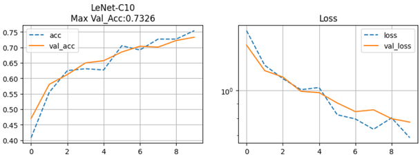

---

## 3.1.8 정리
<!-- 슬라이드 198 -->

- 컴퓨터가 보는 영상은 0\~255 의 값으로 된 거대한 배열(color 는 R, G, B 채널 포함)이며, 밝기 변화·변형·가림·배경 장애·다양성 때문에 영상인식은 대단히 어려운 문제다.
- 전통적 컴퓨터 비전은 사람이 설계한 특징 추출기(feature engineering)에 의존했지만, 딥러닝은 raw image 로부터 특징을 end-to-end 로 학습한다.
- ConvNet 의 시초는 Yann LeCun 의 LeNet(1998)이며 Convolution + Pooling + FC 의 기본 구조를 확립했다. Convolution 과 subsampling 이 특징을 추출하고 fully connected layer 가 분류한다.
- ConvNet 의 장점은 parameter sharing 에 의한 위치 불변성, 작지만 깊게 보는 로컬 연결성, 층을 쌓아 특징을 체계화하는 구성성에서 온다.
- Convolution 은 한 함수를 반전·전이하며 곱하고 적분하는 연산이고, 신경망에서는 뒤집지 않고 그냥 곱한다. Conv layer 의 weight 가 곧 kernel, filter 이며 학습되는 것은 filter 의 값이다.
- Color image 의 conv layer 에서 filter 는 입력 채널 수만큼의 깊이를 가지며, filter(뉴런) 하나에 bias 하나가 붙는다. `torch.nn.Conv2d` 의 parameter 수는 $in_c \times k_h \times k_w \times out_c + out_c$ 다.
- Receptive field 는 출력 한 칸에 영향을 주는 입력 영역의 크기이며, 복잡한 모델을 설계할 때 각 path 의 receptive field 를 검토해야 한다.
- MNIST 에서 MLP 와 CNN 은 비슷한 정확도를 내지만 CNN 의 parameter 수가 훨씬 적다. 실습과제에서는 LeNet 형태의 모델로 MNIST 99%, CIFAR-10 73% 를 목표로 모델을 개선한다.
