# 3.2 AlexNet / VGGNet

**학습 목표**

- ImageNet 데이터셋과 ILSVRC 대회의 과제(classification, localization, detection)와 평가 지표(top-5 error rate)를 설명할 수 있다.
- AlexNet 의 구조도를 읽고, 각 층의 parameter 수를 직접 계산할 수 있다.
- AlexNet 이 deep 구조를 가능하게 하려고 도입한 ReLU, LRN, data augmentation, dropout 의 역할을 설명할 수 있다.
- VGGNet 이 3x3 filter 를 고정한 이유와 multi-scale training/testing, dense evaluation, multi-crop 의 뜻을 설명할 수 있다.
- PyTorch(Lightning)로 AlexNet 형태의 모델과 VGG-11 을 직접 만들고, 224x224 로 키운 MNIST 로 학습시킬 수 있다.

**이 절의 구성**

- 3.2.1 CNN 대표 모델의 계보
- 3.2.2 ImageNet 과 ILSVRC
- 3.2.3 AlexNet: ImageNet 의 전환점
- 3.2.4 Deep NN 을 가능하게 한 기술들
- 3.2.5 AlexNet 의 parameter 와 연산량
- 3.2.6 VGGNet: 2위였지만 더 많은 관심을 받은 모델
- 3.2.7 VGGNet 의 기여 1 — 3x3 filter 고정
- 3.2.8 VGGNet 의 기여 2 — LRN 폐기와 multi-scale training/testing
- 3.2.9 VGGNet 의 기여 3 — testing 기법
- 3.2.10 실습: AlexNet like 모델과 VGG-11 모델 만들기
- 3.2.11 정리

---

## 3.2.1 CNN 대표 모델의 계보
<!-- 슬라이드 200 -->

CNN 이 image 분류의 표준 도구가 된 뒤, 구조(architecture)의 발전은 몇 개의 대표 모델을 따라 이어졌다.
이 절과 다음 절에서 다루는 모델은 다음 넷이다.

- **AlexNet** — deep 한 CNN 이 실제로 학습된다는 것을 처음 보여 준 모델
- **VGG** — 3x3 convolution 만으로 깊이를 늘려 간 모델
- **GoogLeNet** — 여러 크기의 filter 를 병렬로 묶은 module 을 쌓은 모델
- **ResNet** — 잔차(residual) 연결로 100층 이상을 학습한 모델

이 절은 앞의 두 모델, AlexNet 과 VGGNet 을 다룬다. GoogLeNet 과 ResNet 은 4장에서 다룬다.

세 모델의 구조도를 먼저 나란히 보아 두자. AlexNet 은 5개의 convolutional layer 와 3개의 fully-connected
layer, 그리고 1000-way softmax 로 끝난다.

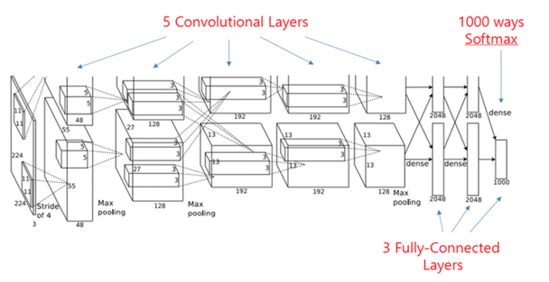

VGGNet 은 convolution 과 pooling 이 규칙적으로 반복되고 끝에 FC 층 셋과 softmax 가 붙는 단순한 구조다.

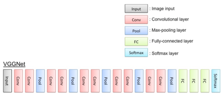

세 번째 그림은 여러 갈래로 갈라졌다가 다시 합쳐지는 module 을 길게 이어 붙인 GoogLeNet 의 전체 구조다.

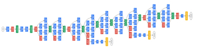

---

## 3.2.2 ImageNet 과 ILSVRC
<!-- 슬라이드 201~205 -->

### ImageNet 데이터셋

AlexNet 과 VGGNet 이 겨룬 무대는 ImageNet 이다. ImageNet 사진을 1000종(class)으로 분류하는 문제이며,
학습 data 120만 장, 검증 data 5만 장, 테스트 data 10만 장으로 이루어져 있다. 이전까지 CNN 이 다루던
MNIST(28x28 흑백, 10종)나 CIFAR 와는 규모가 완전히 다르다.

ImageNet 은 WordNet 의 명사 계층을 따라 class 가 조직되어 있다. 예를 들어 `carnivore > canine > fox > kit fox`
처럼 상위 개념에서 하위 종으로 내려가며, 각 종마다 수백 장의 사진이 달려 있다.

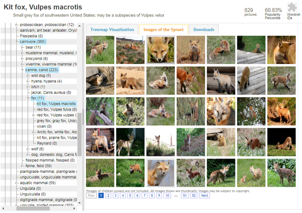

### ILSVRC 의 과제

ILSVRC(ImageNet Large Scale Visual Recognition Challenge)는 ImageNet 을 쓰는 대회로, 2010 년부터 열렸다.
2012 년 대회 기준으로 과제는 다음과 같다.

**Task 1: Classification.** 사진 한 장에 어떤 물체가 있는지 맞힌다. 평가 지표는 **top-5 error rate** 다.
모델이 확률이 높은 순서로 5개의 class 를 내놓고, 그 5개 안에 정답이 들어 있으면 맞은 것으로 친다.
1000종 가운데는 서로 구분하기 어려운 종이 많으므로 top-1 이 아니라 top-5 로 평가한다.

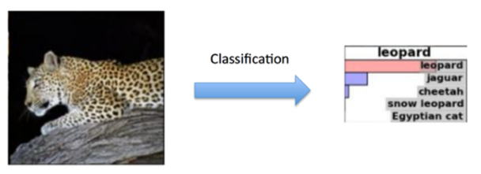

**Task 2: Classification with localization.** class 를 맞히는 데 더해 물체가 어디 있는지 bounding box 로 표시한다.
모델은 bounding box 5개와 각각의 label 을 내놓으며, label 이 맞고 box 가 정답 영역과 50% 이상 일치하면
정답으로 인정한다.

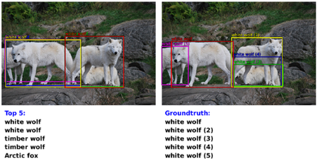

**Task 3: Fine-grained classification.** 200종의 물체를 학습하고, 영상 안에 있는 모든 물체를 찾아낸다.
한 장의 사진 안에 여러 물체가 있으면 모두 찾아 box 와 label 을 붙여야 한다.

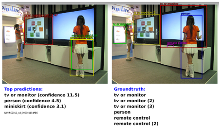

### 4년 만에 인간의 인지 수준에 근접

ILSVRC 는 4년 만에 인간의 인지 수준에 근접했다. 이 과제가 얼마나 어려운지는 ILSVRC 2014 의 1000개 분류
가운데 두 가지, 시베리안 허스키와 에스키모 개의 사진을 나란히 놓아 보면 실감이 난다. 사람도 한눈에
구분하기 어렵다.

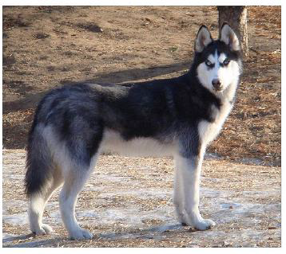

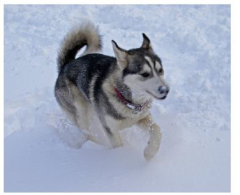

2010 년 이후의 대회 결과를 그래프로 보면 deep learning 이 등장한 2012 년이 분기점이다. 전통적인
computer vision 기법은 2010\~2012 년에 정확도 70% 대 초반에 머물렀는데, 2012 년 deep learning 모델이
84.7% 를 기록하면서 전통 기법의 최고치 73.9% 를 단번에 넘어섰고, 이후로는 deep learning 모델만 상위권에
남는다.

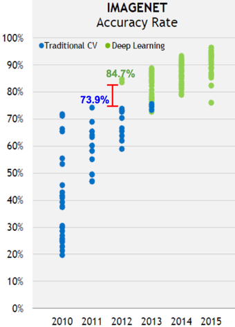

같은 흐름을 top-5 error 로 정리하면 다음과 같다. 연도별 우승 모델의 top-5 classification error 가
2011 년 26.0% 에서 2016 년 3.1% 까지 떨어졌고, 2015 년 ResNet 이 처음으로 사람의 오차(5.0%)보다 낮아졌다.

| 연도(모델) | Top-5 error (%) |
|---|---|
| 2011 (XRCE) | 26.0 |
| 2012 (AlexNet) | 16.4 |
| 2013 (ZF) | 11.7 |
| 2014 (VGG) | 7.3 |
| 2014 (GoogLeNet) | 6.7 |
| 사람 | 5.0 |
| 2015 (ResNet) | 3.6 |
| 2016 (GoogLeNet-v4) | 3.1 |

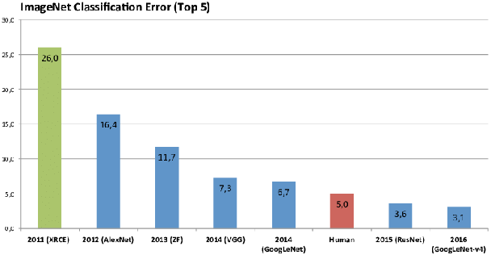

대회가 끝난 뒤에도 top-1 accuracy 는 계속 올라갔다. 2014 년 VGG-16 의 0.72 부근에서 Inception, ResNet152,
Inception-ResNetV2, PolyNet, DPN131 로 이어지는 전문가 설계 모델이 0.80 을 넘겼고, 2017 년 이후에는
NasNetA, AmoebaNet 처럼 구조 자체를 자동으로 찾는 AutoML 모델이 0.82\~0.84 에 이르렀다.

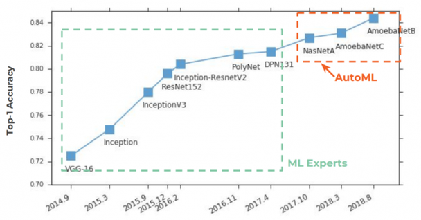

---

## 3.2.3 AlexNet: ImageNet 의 전환점
<!-- 슬라이드 206 -->

AlexNet 은 ImageNet 에서 획기적인 성능을 내며 DNN(deep neural network)의 전환점이 된 모델이다.
주요 기여는 **신경망에서 deep 한 구조가 실제로 가능하다는 것을 확인**한 데 있다. 8 layer 를 학습시키면서
다양한 기법을 선보였고, 이것이 DNN 붐의 시작이 되어 유사한 연구가 폭발적으로 증가했다.

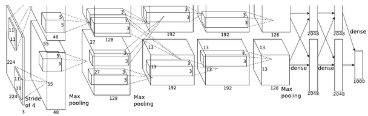

구조도를 읽을 때 두 가지를 스스로 물어 보자.

**왜 층이 두 갈래로 나뉘어 있는가?** 구조도의 모든 convolutional layer 와 dense 층이 위아래 두 갈래로
그려져 있다. 채널 수 48, 128, 192, 192, 128 과 dense 2048 은 각각 한 갈래의 크기이고, 두 갈래를 합친
전체는 96, 256, 384, 384, 256 채널과 4096 이다. 이는 당시 GPU 메모리 한계 때문에 모델을 GPU 두 장에 나누어
올렸기 때문이다(3.2.5 의 "GTX580 Dual GPU" 참조). 뒤의 실습에서는 이 가운데 한 갈래만 구현한다.

**parameter 수는 얼마인가?** convolution 층의 parameter 수는 (입력 채널 x filter 높이 x filter 너비 x
출력 채널) + (출력 채널 수만큼의 bias) 로 센다. 구조도의 수치를 그대로 넣으면 다음과 같다.

- 첫 번째 convolution: $3 \times 11 \times 11 \times (48 + 48) + 96 = 34{,}944$ (약 35k).
  입력은 RGB 3 채널, filter 는 11x11, 출력은 두 갈래 합쳐 96 채널이고 bias 가 96 개다.
- 두 번째 convolution: $(48 \times 5 \times 5 \times 128 + 128) \times 2 = 307{,}456$ (약 307k).
  한 갈래에서 48 채널 입력을 5x5 filter 로 128 채널로 만들고, 갈래가 둘이므로 2 를 곱한다.
- dense 층 사이: $(2048 \times 2) \times (2048 \times 2) + (2048 \times 2) = 16{,}781{,}312$ (약 16M).
  4096 개 node 와 4096 개 node 를 완전 연결하고 bias 4096 개를 더한다.

convolution 층은 filter 를 공유하므로 parameter 가 수만\~수십만 개에 그치지만, dense 층 하나가 1600 만 개를
차지한다. 이렇게 큰 dense 층에는 **dropout** 이 적용되어 있는데, 그 이유는 3.2.4 에서 설명한다.

---

## 3.2.4 Deep NN 을 가능하게 한 기술들
<!-- 슬라이드 207~210 -->

AlexNet 이 8 layer 를 학습시킬 수 있었던 것은 다음 네 가지 기술 덕분이다.

- activation function 개선: **ReLU**
- **LRN**(Local Response Normalization)
- **Data augmentation**
- **Dropout**

하나씩 살펴본다.

### ReLU (Rectified Linear Unit)

ReLU 는 입력이 양수이면 그대로, 음수이면 0 을 내보내는 activation function 이다. sigmoid 나 tanh 대신
ReLU 를 쓰면 다음 이점이 있다.

- **학습 속도가 빨라진다.**
- **backpropagation 계산이 간단하다.** 미분값이 0 아니면 1 이다.
- **입력 data 의 normalization 이 필요 없다.** sigmoid 와 tanh 은 입력이 크거나 작으면 출력이 포화(saturation)되는
  구간이 있어 gradient 가 사라지지만, ReLU 는 양수 쪽에 상한이 없다.

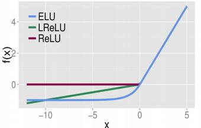

효과는 학습 곡선에서 바로 드러난다. 같은 망을 tanh 과 ReLU 로 학습시켰을 때, training error 가 0.25 에
이르기까지 tanh 은 30 epoch 이 넘게 걸리는 반면 ReLU 는 몇 epoch 만에 도달한다. 수렴이 훨씬 빠르다(faster
convergence).

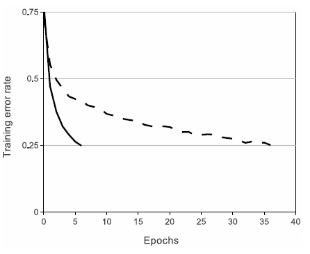

### LRN (Local Response Normalization)

LRN 은 feature map 을 normalization 하는 기법이다. 생물학적 뉴런의 **측면 억제(lateral inhibition)** 효과,
즉 강한 자극이 주변의 약한 자극의 신호 전달을 막는 효과를 흉내 낸 것으로, generalization 관점에서 성능이
개선된다. 측면 억제는 아래 헤르만의 격자에서 체험할 수 있다. 검은 사각형 사이의 흰 교차점이 회색으로
보이는 것은 주변의 강한 자극이 교차점의 신호를 억제하기 때문이다.

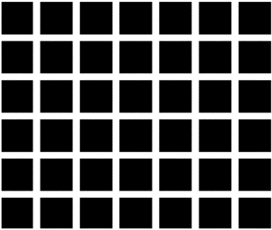

AlexNet 에서는 첫 번째와 두 번째 convolution 결과에 ReLU 를 수행한 뒤, **max pooling 전에** LRN 을 적용한다.
아래 구조도의 화살표가 그 위치다.

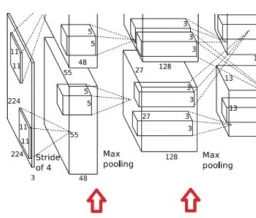

LRN 의 식은 다음과 같다.

$$
b^{i}_{x,y} = \frac{a^{i}_{x,y}}{\left( k + \alpha \sum_{j=\max(0,\, i-n/2)}^{\min(N-1,\, i+n/2)} \left( a^{j}_{x,y} \right)^{2} \right)^{\beta}}
$$

$a^{i}_{x,y}$ 는 $i$ 번째 kernel(채널)의 feature map 에서 위치 $(x, y)$ 의 activation, $b^{i}_{x,y}$ 는 정규화된
값이다. $N$ 은 전체 kernel 수, $n$ 은 함께 볼 인접 채널의 개수이며, $k$, $\alpha$, $\beta$ 는 hyperparameter 다.
즉 같은 위치의 인접 채널 $n$ 개의 activation 제곱합으로 나누어, 주변 채널의 반응이 크면 자기 값을 줄인다.

LRN 으로 top-1, top-5 error rate 가 각각 1.4%, 1.2% 개선되었다. 왜 효과가 있는가? ReLU 는 상한이 없어 큰 값이
그대로 다음 층으로 전달될 수 있는데, LRN 은 max pooling 에 너무 큰 값이 들어가는 것을 막아 준다.

### Data augmentation

학습 data 를 인위적으로 늘리는 두 가지 방법을 썼다.

**1) Crop + flip augmentation.** 256x256 원본 이미지에서 224x224 patch 를 잘라 내고 좌우로 뒤집는다.
가로세로 각각 32 가지 위치에서 자를 수 있으므로 flip 까지 합치면 한 장이 $2048 = 32 \times 32 \times 2$ 장이 된다.

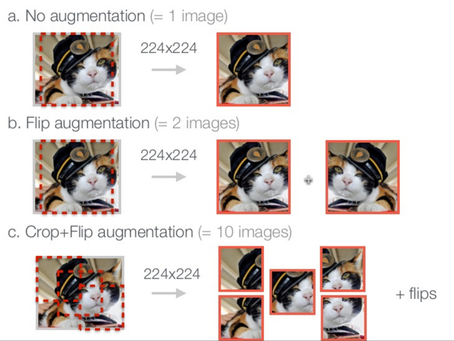

**2) Color space distortion.** RGB 색 값에 주성분 분석(PCA)을 적용하고, 주성분 방향으로 표준 편차 0.1 의
변화를 주어 색 공간에서 다양성을 확보한다. 픽셀 $I_{xy}$ 는 다음처럼 바뀐다.

$$
I_{xy} = \left[ I^{R}_{xy},\ I^{G}_{xy},\ I^{B}_{xy} \right]^{T}
+ \left[ \mathbf{p}_1,\ \mathbf{p}_2,\ \mathbf{p}_3 \right]
\left[ \alpha_1 \lambda_1,\ \alpha_2 \lambda_2,\ \alpha_3 \lambda_3 \right]^{T},
\qquad \alpha_i \sim N(0,\ 0.1)
$$

$\mathbf{p}_i$ 와 $\lambda_i$ 는 RGB 값의 $i$ 번째 주성분(eigenvector)과 그 eigenvalue 이고, $\alpha_i$ 는 표준 편차
0.1 의 정규 분포에서 뽑은 난수다. 조명이 바뀌어도 물체의 정체는 그대로라는 사실을 data 로 가르치는 셈이다.
이 기법으로 top-1 error 가 1% 이상 감소했다.

### Dropout

Dropout 은 강력한 regularization 기법이다. **학습 단계에서 일부 node 를 무작위로 제외**시켜, overfitting 을
억제하고 학습 효과를 지속적으로 유지시킨다.

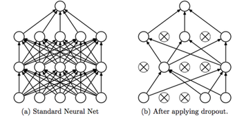

dropout 이 잘 되는 이유는 두 가지로 설명한다.

- **ensemble 효과.** node 를 제외할 때마다 서로 다른 부분 망(sub-network)이 학습되므로, 여러 모델을 결합한
  효과가 난다. 아래 그림처럼 hidden node 둘, 입력 둘인 작은 망에서도 어떤 node 가 살아남느냐에 따라
  여러 개의 부분 망이 만들어진다.
- **동조화(co-adaptation) 억제.** node 들이 비슷한 특징에 집중하는 동조화를 막아, node 들이 기능적으로
  차별화된다.

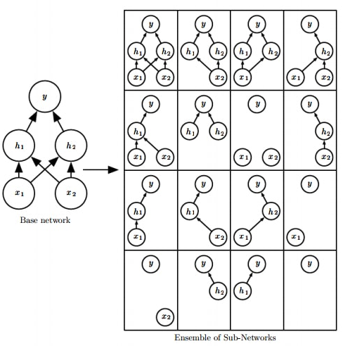

효과는 classification error 곡선에서 확인된다. dropout 이 없는 여러 학습 곡선은 1.5\~2% 부근에 머무는 반면,
dropout 을 쓴 곡선은 1% 근처까지 내려간다.

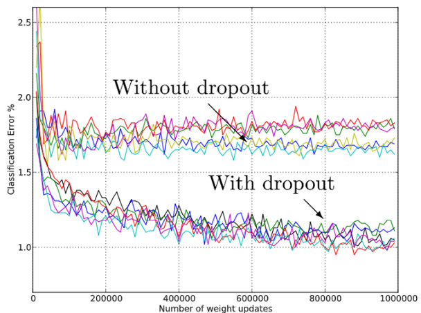

---

## 3.2.5 AlexNet 의 parameter 와 연산량
<!-- 슬라이드 211 -->

AlexNet 은 6억 3000만 개의 connection 을 가진 망으로, GTX580 GPU 두 장으로 1주일 이상 학습했다.
아래 그림은 층별 parameter 수(왼쪽)와 연산량 FLOPs(오른쪽)를 보여 준다.


| 층 | parameter | FLOPs |
|---|---|---|
| Conv 11x11 s4, 96 / ReLU | 35K | 105M |
| Local Response Norm, Max Pool 3x3 s2 | -- | -- |
| Conv 5x5 s1, 256 / ReLU | 307K | 223M |
| Local Response Norm, Max Pool 3x3 s2 | -- | -- |
| Conv 3x3 s1, 384 / ReLU | 884K | 149M |
| Conv 3x3 s1, 384 / ReLU | 1.3M | 112M |
| Conv 3x3 s1, 256 / ReLU | 442K | 74M |
| Max Pool 3x3 s2 | -- | -- |
| FC 4096 / ReLU | 37M | 37M |
| FC 4096 / ReLU | 16M | 16M |
| FC 1000 | 4M | 4M |

이 표에서 읽어야 할 것은 두 가지다.

- 첫 번째 convolution 35K 와 두 번째 convolution 307K, 그리고 FC 4096 사이의 16M 은 3.2.3 에서 직접 계산한
  34,944 개, 307,456 개, 16,781,312 개와 같다. 구조도만 있으면 parameter 수는 손으로 셀 수 있다.
- **parameter 는 FC 층에, 연산은 convolution 층에 몰려 있다.** convolution 층은 parameter 가 수십만 개에
  불과하지만 feature map 의 모든 위치에서 filter 를 적용하므로 FLOPs 가 1억 단위로 크다. 반대로 FC 층은
  parameter 하나가 곱셈 한 번에 쓰이므로 parameter 수와 FLOPs 가 같다. 그림의 parameter 수를 모두 더하면
  약 6천만 개이며, 슬라이드가 말하는 "6억 3000만 connection" 은 parameter 수가 아니라 연산 연결 수다.

---

## 3.2.6 VGGNet: 2위였지만 더 많은 관심을 받은 모델
<!-- 슬라이드 212 -->

VGGNet 은 2014 년 ILSVRC 에서 GoogLeNet 에 밀려 2위에 그쳤지만, 우승 모델보다 더 많은 관심을 받았다.
**간단한 구조와 훌륭한 성능** 덕분에 이후 많은 연구의 기준 모델이 되었고, 12만 8천 회 이상 참조되었다.

VGGNet 연구의 본질은 **ConvNet 망의 깊이에 따른 성능**을 체계적으로 조사한 데 있다. 다른 조건을 고정하고
층 수만 다르게 한 6 가지 모델로 성능을 비교했다. 모든 모델은 3x3 convolution 을 쌓은 5 개의 block 을 max
pooling 으로 나누고, 채널 수를 64, 128, 256, 512, 512 로 두 배씩 늘려 가며, 끝에 FC-4096 둘과 FC-1000,
softmax 를 둔다. 모델 이름의 숫자는 weight 를 가진 층(convolution + FC)의 개수다.

| 모델 | 특징 | parameter 수(백만) | Top-5 error (%) |
|---|---|---|---|
| VGG-11 | conv 8 + FC 3 | 133 | 10.4 |
| VGG-11 (LRN) | VGG-11 의 첫 conv 뒤에 LRN | 133 | 10.5 |
| VGG-13 | conv 10 + FC 3 | 133 | 9.9 |
| VGG-16 (Conv1) | VGG-16 에서 세 번째, 네 번째 block 의 마지막을 1x1 conv 로 | 134 | 9.4 |
| VGG-16 | conv 13 + FC 3 | 138 | 8.8 |
| VGG-19 | conv 16 + FC 3 | 144 | 9.0 |

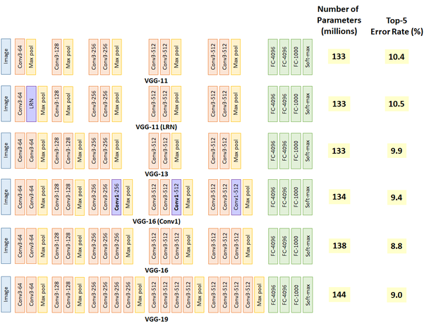

표에서 parameter 수가 133M 에서 144M 까지 조금밖에 늘지 않는 것에 주목하자. parameter 의 대부분은 FC 층에
있고 그 부분은 여섯 모델이 같기 때문에, convolution 층을 8 개에서 16 개로 두 배 늘려도 전체 parameter 는
10% 도 늘지 않는다. 깊이는 parameter 수가 아니라 표현력의 문제라는 뜻이다.

---

## 3.2.7 VGGNet 의 기여 1 — 3x3 filter 고정
<!-- 슬라이드 213 -->

VGGNet 의 첫 번째 기여는 **convolution filter 를 3x3 으로 고정**한 것이다. AlexNet 이 11x11, 5x5 같은 큰 filter 를
썼던 것과 달리, 5x5 나 7x7 filter 하나보다 3x3 filter 를 여러 번 쓰는 편이 낫다는 것을 보였다.

아래 그림이 그 근거다. 7x7 입력에 3x3 filter 를 stride 1 로 한 번 적용하면 5x5 가 되고, 한 번 더 적용하면
3x3 이 된다. 이는 7x7 입력에 5x5 filter 를 한 번 적용해 3x3 을 얻는 것과 결과 크기가 같다. 즉 **3x3 두 번은
5x5 한 번과 같은 범위(receptive field)를 본다.**

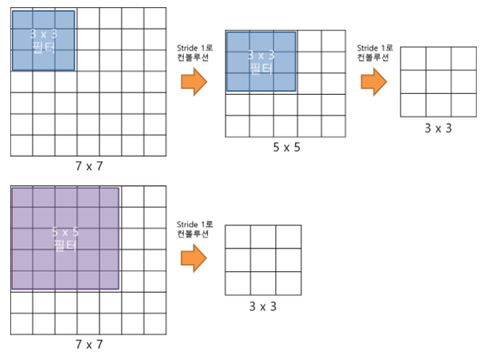

같은 범위를 보면서도 3x3 을 여러 번 쓰는 쪽이 유리한 이유는 다음과 같다.

- **parameter 수(#P)가 적다.** 5x5 filter 하나는 weight 가 25 개이지만 3x3 두 개는 18 개다.
- **image size 감소가 적어 layer 를 늘리기에 유리하다.** 층마다 ReLU 가 한 번 더 들어가 비선형성도 늘어난다.

이 결과로 **3x3 filter 가 ConvNet 의 기본**이 되었다.

두 번째 성과는 이런 **단순한 ConvNet 만으로 최고 성능을 달성**한 것이다. 다만 깊이를 계속 늘린다고 성능이
계속 좋아지지는 않았고, **19 layer 에서 한계**에 도달했다. 아래 그림처럼 층을 무작정 늘리면 오히려
training error 가 커지는 현상이 나타나는데, 이것이 다음 장의 ResNet 이 풀려는 문제다.

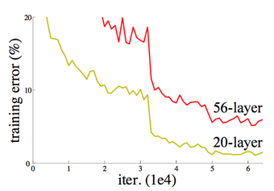

VGG-16 의 구조를 크기 변화로 보면 224x224x3 입력이 224x224x64, 112x112x128, 56x56x256, 28x28x512,
14x14x512, 7x7x512 로 max pooling 마다 반으로 줄면서 채널이 두 배로 늘고, 끝에 1x1x4096 둘과 1x1x1000 의
FC 층이 온다.

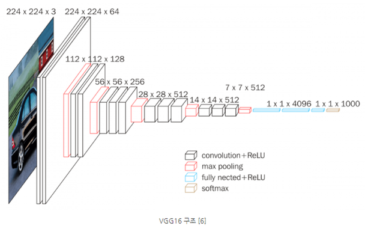

---

## 3.2.8 VGGNet 의 기여 2 — LRN 폐기와 multi-scale training/testing
<!-- 슬라이드 214 -->

### LRN 의 한계 확인

3.2.6 의 표에서 VGG-11 과 VGG-11 (LRN) 을 비교하면 LRN 을 넣어도 top-5 error 가 10.4% 에서 10.5% 로 오히려
나빠졌다. AlexNet 이 도입한 LRN 의 한계를 확인한 것이며, 이후 VGGNet 은 **LRN 을 폐기**했다.

### Multi-scale training / multi-scale testing

**Single-scale training/testing** 에서는 영상의 짧은 쪽을 256 혹은 384 로 만들고, 거기서 224x224 를 잘라
모델에 입력한다. 원본이 256 이상이면 256 으로, 384 이상이면 384 로 줄인 뒤 자른다.

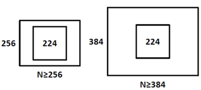

VGG 에서는 영상의 짧은 쪽을 **256\~512 사이에서 무작위로 sampling(scale jittering)** 하여 224x224 로 잘라
모델에 입력했다. 같은 물체가 다양한 크기로 나타나는 영상으로 학습하고 테스트하면 성능이 향상되며,
이를 통해 **multi-scale training / testing 의 필요성**을 확인했다.

아래 표는 학습 scale $S$(학습 시 짧은 변 길이)와 테스트 scale $Q$(테스트 시 짧은 변 길이)를 바꾸어 가며
잰 결과다. $S$ 가 $[256; 512]$ 로 적힌 행이 scale jittering 이고, $Q$ 는 세 가지 크기로 테스트한 뒤 평균한
것이다.

| ConvNet 구성 | 학습 $S$ | 테스트 $Q$ | top-1 val. error (%) | top-5 val. error (%) |
|---|---|---|---|---|
| B | 256 | 224, 256, 288 | 28.2 | 9.6 |
| C | 256 | 224, 256, 288 | 27.7 | 9.2 |
| C | 384 | 352, 384, 416 | 27.8 | 9.2 |
| C | [256; 512] | 256, 384, 512 | 26.3 | 8.2 |
| D | 256 | 224, 256, 288 | 26.6 | 8.6 |
| D | 384 | 352, 384, 416 | 26.5 | 8.6 |
| D | [256; 512] | 256, 384, 512 | **24.8** | **7.5** |
| E | 256 | 224, 256, 288 | 26.9 | 8.7 |
| E | 384 | 352, 384, 416 | 26.7 | 8.6 |
| E | [256; 512] | 256, 384, 512 | **24.8** | **7.5** |

구성 B, C, D, E 는 각각 VGG-13, VGG-16 (Conv1), VGG-16, VGG-19 에 해당한다. 어느 구성이든 $S$ 를 256 이나 384 로
고정할 때보다 $[256; 512]$ 에서 jittering 할 때 error 가 가장 낮고, D 와 E 는 top-1 24.8%, top-5 7.5% 로 같다.

---

## 3.2.9 VGGNet 의 기여 3 — testing 기법
<!-- 슬라이드 215 -->

### Multi-scale testing 을 위한 모델 변경

**Dense evaluation.** 테스트 영상을 여러 scale 로 넣으려면 입력 크기가 달라져도 모델이 동작해야 한다.
그런데 FC 층은 입력 크기가 고정되어 있다. VGG 는 **뒷단의 FC 층을 convolution layer 로 바꾸어** 이 문제를
풀었다. FC-4096 은 7x7 convolution 4096 채널로, 그 다음 FC-4096 과 FC-1000 은 1x1 convolution 으로 바꾼다.
이렇게 하면 input image resolution 에 무관하게 처리할 수 있다.

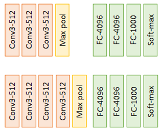

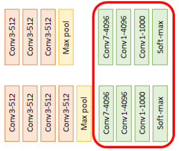

**Multi-crop.** 테스트 영상을 네 모서리와 중앙에서 자르고 각각 flip 하여 10 가지로 변형해 입력한 뒤,
10 가지 영상의 softmax 값을 평균한다. 한 장의 영상에 대해 ensemble(voting)을 하는 셈이다.

두 기법의 효과는 다음과 같다. D(VGG-16)와 E(VGG-19) 모두 dense 만 쓸 때보다 multi-crop 을 더할 때, 그리고
둘을 함께 쓸 때 error 가 가장 낮다.

| ConvNet 구성 | 평가 방법 | top-1 val. error (%) | top-5 val. error (%) |
|---|---|---|---|
| D | dense | 24.8 | 7.5 |
| D | multi-crop | 24.6 | 7.5 |
| D | multi-crop & dense | **24.4** | **7.2** |
| E | dense | 24.8 | 7.5 |
| E | multi-crop | 24.6 | 7.4 |
| E | multi-crop & dense | **24.4** | **7.1** |

### ConvNet fusion

마지막으로 **VGG-16 과 VGG-19 모델의 결과(softmax) 값을 ensemble** 한다. 대회 제출 당시에는 여러 scale 로 학습한
D, C, E 모델 7 개를 합쳐 top-5 test error 7.3% 를 얻었고, 대회 뒤에 scale jittering 으로 학습한 D 와 E 두 모델만
multi-crop & dense 로 합쳐 6.8% 까지 낮추었다.

| 결합한 모델 | top-1 val | top-5 val | top-5 test |
|---|---|---|---|
| ILSVRC 제출: (D/256/224,256,288), (D/384/352,384,416), (D/[256;512]/256,384,512), (C/256/224,256,288), (C/384/352,384,416), (E/256/224,256,288), (E/384/352,384,416) | 24.7 | 7.5 | 7.3 |
| 제출 후: (D/[256;512]/256,384,512), (E/[256;512]/256,384,512), dense eval. | 24.0 | 7.1 | 7.0 |
| 제출 후: 같은 두 모델, multi-crop | 23.9 | 7.2 | - |
| 제출 후: 같은 두 모델, multi-crop & dense eval. | **23.7** | **6.8** | **6.8** |

VGGNet 의 그림과 표는 https://oi.readthedocs.io/en/latest/computer_vision/cnn/vggnet.html 에서 가져온 것이다.

---

## 3.2.10 실습: AlexNet like 모델과 VGG-11 모델 만들기
<!-- 슬라이드 216 -->

### 실습 3.2.1 — AlexNet like 모델과 VGG-11 모델을 만들어 보자

> 노트북: `code/3.2.1.AlexNet_VggNet.ipynb`
> [](https://colab.research.google.com/github/AI-BoostCamp/intermediate-deep-learning-pytorch/blob/main/code/3.2.1.AlexNet_VggNet.ipynb)

이 실습의 목표는 앞에서 본 두 구조를 PyTorch 코드로 옮겨 보는 것이다. ImageNet 을 쓸 수는 없으므로
**MNIST 를 (224, 224) 로 resize 하여 입력**으로 받아 학습시킨다. 입력 크기를 224 로 맞추는 이유는 AlexNet 과
VGG 가 모두 224x224 입력을 전제로 설계되었고, 그래야 구조도에 적힌 feature map 크기(55, 27, 13, 6 과
112, 56, 28, 14, 7)가 그대로 재현되기 때문이다.

**준비.** Lightning, torchmetrics, torchinfo 를 함께 쓴다.

```python
import torch
from torch import nn
from torch.nn import functional as F
from torchmetrics import functional as FM
from torch.utils.data import Dataset, DataLoader, random_split
from torchvision.transforms import v2
from torchinfo import summary

import lightning as L
from lightning.pytorch import Trainer
from lightning.pytorch.callbacks import ModelCheckpoint
from lightning.pytorch.loggers import CSVLogger

import numpy as np
import pandas as pd
import matplotlib.pyplot as plt

device ='cuda:0'
torch.__version__,L.__version__
```

**Dataset.** torchvision 의 MNIST 를 받되, transform 에서 `v2.Resize((224,224))` 로 키운다. 학습 시간을 줄이려고
`train=False` 인 테스트 셋 1 만 장을 받아 5,000 장씩 학습용과 검증용으로 나눈다. batch size 는 10 이다.

```python
from torchvision.datasets import MNIST

transform = v2.Compose([
    v2.ToImage(),
    v2.Resize((224,224)),
    v2.ToDtype(torch.float32, scale=True) ] )

batch_size = 10
download_root = './mnist'
mnist_dataset = MNIST(download_root, train=False, download=True, transform=transform)
mnist_train, mnist_val = random_split(mnist_dataset, [5000, 5000])
trainDataLoader = DataLoader(mnist_train, batch_size, True,num_workers=4)
valDataLoader = DataLoader(mnist_val, batch_size, False,num_workers=4)
```

`v2.ToImage()` 는 PIL 이미지를 tensor 이미지로 바꾸고, `v2.ToDtype(torch.float32, scale=True)` 는 0\~255 정수를
0\~1 실수로 바꾼다. batch 하나를 꺼내 shape 을 확인하면 `[10, 1, 224, 224]`, 즉 batch 10 장, 채널 1 개(흑백),
224x224 가 나와야 한다. `pst` 는 노트북 맨 앞에 정의된 shape 출력 helper 다.

```python
sample = next(iter(trainDataLoader))
pst(sample[0])    # image
pst(sample[1])    # label
img = sample[0][0]# image[0]

plt.imshow(img.permute(1, 2, 0))
plt.show()
```

**공통 LightningModule.** 두 모델은 구조만 다르고 학습 절차는 같으므로, 학습 절차를 `Wrap_10` 에 한 번만
써 두고 두 모델이 상속한다. `training_step` 과 `validation_step` 은 cross entropy loss 와 10-class accuracy 를
계산해 epoch 단위로 기록하고, optimizer 는 Adam(learning rate 0.001)이다.

```python
class Wrap_10(L.LightningModule):
    def training_step(self, batch, batch_idx):
        x, y = batch
        y_pred = self(x)
        loss = F.cross_entropy(y_pred, y)
        acc = FM.accuracy(y_pred, y, task="multiclass",num_classes=10)
        metrics={'loss':loss, 'acc':acc}
        self.log_dict(metrics,prog_bar=True,on_step=False,on_epoch=True)
        return loss

    def validation_step(self, batch, batch_idx):
        x, y = batch
        y_pred = self(x)
        loss = F.cross_entropy(y_pred, y)
        acc = FM.accuracy(y_pred, y, task="multiclass",num_classes=10)
        metrics={'val_loss':loss, 'val_acc':acc}
        self.log_dict(metrics,prog_bar=True,on_step=False,on_epoch=True)

    def configure_optimizers(self):
        return torch.optim.Adam(self.parameters(), lr=0.001)
```

`on_step=False, on_epoch=True` 로 두면 batch 마다가 아니라 epoch 마다 평균값이 기록되므로, 뒤에서
학습 곡선을 그릴 때 epoch 당 한 점씩 얻는다.

**AlexNet like 모델.** 3.2.3 의 구조도에서 **한쪽 path 만 구현**한다. 그래서 채널 수가 48, 128, 192, 192, 128 이고
dense 층이 2048 이다. 입력은 RGB 3 채널이 아니라 MNIST 의 1 채널, 출력은 1000 이 아니라 10 이다.

```python
## 한쪽 path만 구현해 보자

class AlexNet_like(Wrap_10):
    def __init__(self):
        super(AlexNet_like, self).__init__()
        self.layers = nn.Sequential(
            nn.Conv2d(1, 48, (11,11), stride=4, padding=2),
            nn.ReLU(),
            nn.MaxPool2d((3,3), stride=2),

            nn.Conv2d(48, 128, (5,5), padding=2),
            nn.ReLU(),
            nn.MaxPool2d((3,3), stride=2),

            nn.Conv2d(128, 192, (3,3), padding=1),
            nn.ReLU(),
            nn.Conv2d(192, 192, (3,3), padding=1),
            nn.ReLU(),
            nn.Conv2d(192, 128, (3,3), padding=1),
            nn.ReLU(),
            nn.MaxPool2d((3,3), stride=2),

            nn.Flatten(),
            nn.Linear(128 * 6 * 6, 2048),
            nn.ReLU(),
            nn.Dropout(0.1),

            nn.Linear(2048, 2048),
            nn.ReLU(),
            nn.Dropout(0.1),

            nn.Linear(2048, 10),
        )

    def forward(self, x: torch.Tensor) -> torch.Tensor:
        x = self.layers(x)
        return x

model = AlexNet_like()
summary(model, input_size=(batch_size, 1, 224, 224))
```

코드와 구조도를 대응시켜 읽자.

- 첫 convolution 은 11x11 filter 를 stride 4 로 적용한다. 224 입력이 $(224 + 2 \times 2 - 11)/4 + 1 = 55$ 로 줄어
  구조도의 55 가 된다. 3x3 max pooling 을 stride 2 로 적용하면 27 이다. pooling 창(3)이 stride(2)보다 커서
  창이 겹치는 overlapping pooling 이다.
- 5x5 convolution 은 padding 2 로 크기를 유지하고(27), pooling 으로 13 이 된다. 3x3 convolution 셋은 padding 1 로
  13 을 유지하고, 마지막 pooling 으로 6 이 된다. 그래서 flatten 결과가 $128 \times 6 \times 6 = 4608$ 이다.
- dense 층 둘에는 ReLU 다음에 `nn.Dropout(0.1)` 이 붙는다. 3.2.4 에서 본 대로 parameter 가 몰린 dense 층의
  overfitting 을 막기 위한 것이다. LRN 은 넣지 않았다.

`torchinfo.summary` 는 층마다 출력 shape 과 parameter 수를 표로 보여 준다. convolution 부분은 다음과 같다.

| 층 | 출력 shape | parameter |
|---|---|---|
| Conv2d (11x11, s4) | [10, 48, 55, 55] | 5,856 |
| MaxPool2d | [10, 48, 27, 27] | -- |
| Conv2d (5x5) | [10, 128, 27, 27] | 153,728 |
| MaxPool2d | [10, 128, 13, 13] | -- |
| Conv2d (3x3) | [10, 192, 13, 13] | 221,376 |
| Conv2d (3x3) | [10, 192, 13, 13] | 331,968 |
| Conv2d (3x3) | [10, 128, 13, 13] | 221,312 |
| MaxPool2d | [10, 128, 6, 6] | -- |
| Flatten | [10, 4608] | -- |

첫 convolution 의 5,856 은 $1 \times 11 \times 11 \times 48 + 48$ 이다. 3.2.3 의 계산과 같은 방식인데 입력 채널이
3 에서 1 로, 갈래가 둘에서 하나로 바뀐 것뿐이다. 슬라이드에 실린 summary 는 dense 층 폭이 4096 인 판에서
찍은 것이어서 Linear 층이 18,878,464 개, 16,781,312 개, 40,970 개, 전체 36,634,986 개(mult-adds 2.96G)로
나온다. 이 가운데 16,781,312 는 3.2.3 에서 계산한 4096-4096 dense 층 값과 정확히 같다. 노트북 코드는 폭이
2048 이므로 직접 실행하면 dense 층 parameter 가 이보다 적게 나온다.

**학습.** Lightning `Trainer` 로 10 epoch 학습한다. `limit_train_batches=0.5` 와 `limit_val_batches=0.5` 는
epoch 마다 batch 의 절반만 쓰라는 뜻으로, 시간을 줄이기 위한 설정이다. CSVLogger 가 epoch 마다 metric 을
`logs/AlexNet/version_N/metrics.csv` 에 기록한다.

```python
%%time
model = AlexNet_like()
epochs = 10
name="AlexNet"
logger = L.pytorch.loggers.CSVLogger("logs", name=name)
trainer = L.Trainer(max_epochs=epochs, logger=logger,enable_model_summary=False,
                    limit_train_batches=0.5, limit_val_batches=0.5 )  #####
trainer.fit(model, trainDataLoader, val_dataloaders=valDataLoader)
```

**학습 곡선.** metrics.csv 를 읽어 epoch 별 마지막 값을 뽑고, accuracy 와 loss 를 나란히 그린다. loss 는
log scale(`semilogy`)로 그려야 초반의 큰 값과 후반의 작은 값이 한 그림에 들어온다.

```python
v_num = logger.version
history = pd.read_csv(f'./logs/{name}/version_{v_num}/metrics.csv')

h1 = history.drop('step', axis=1).groupby('epoch').last()
max_ = h1['val_acc'].max()

plt.figure(figsize=(10,3))
title = name
plt.subplot(121)
plt.title(f"{title}\nMax Val_Acc:{max_:.4f}")
plt.plot(h1['acc'],'--', label='acc')
plt.plot(h1['val_acc'], label='val_acc')
plt.legend()
plt.grid()

plt.subplot(122)
plt.title("Loss")
plt.plot(h1['loss'],'--', label='loss')
plt.plot(h1['val_loss'], label='val_loss')
plt.semilogy()
plt.legend()
plt.grid()
plt.show()
```

metrics.csv 에는 학습 행과 검증 행이 따로 기록되어 있어 `groupby('epoch').last()` 로 epoch 당 한 행으로
합친다. 결과는 다음과 같다. 검증 정확도가 첫 epoch 에 이미 0.89 를 넘고 이후 0.96\~0.98 사이를 오가며, 최고
검증 정확도는 0.9808 이다. 첫 epoch 의 학습 정확도가 검증 정확도보다 낮은 것은 학습 정확도는 epoch 동안의
평균이고 검증 정확도는 epoch 이 끝난 모델로 잰 값이기 때문이다.

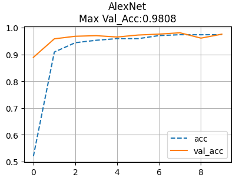

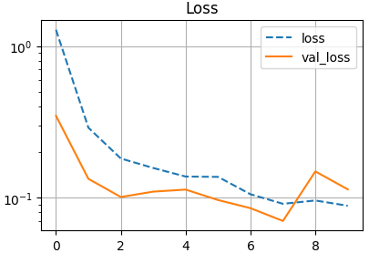

loss 곡선에서 검증 loss 가 8 epoch 근처에서 한 번 튀는 것을 볼 수 있다. 검증 정확도 곡선의 같은 위치에서
잠깐 내려간 것과 짝을 이룬다. 학습이 안정적으로 끝났는지는 마지막 값이 아니라 곡선 전체로 판단해야 한다.

**VGG-11 모델.** 3.2.6 의 첫 행인 VGG-11 을 옮긴다. 3x3 convolution 을 1, 1, 2, 2, 2 개씩 쌓은 5 개의 block 을
2x2 max pooling(stride 2)으로 나누고 채널을 64, 128, 256, 512, 512 로 늘린다. pooling 이 다섯 번이므로 224 는
112, 56, 28, 14, 7 로 줄고, flatten 결과는 $512 \times 7 \times 7$ 이다.

```python
class VGG_11(Wrap_10):
    def __init__(self):
        super(VGG_11, self).__init__()
        self.layers = nn.Sequential(
            nn.Conv2d(1, 64, (3,3), stride=1, padding=1),
            nn.ReLU(),
            nn.MaxPool2d((2,2), stride=2),

            nn.Conv2d(64, 128, (3,3), stride=1, padding=1),
            nn.ReLU(),
            nn.MaxPool2d((2,2), stride=2),

            nn.Conv2d(128, 256, (3,3), stride=1, padding=1),
            nn.ReLU(),
            nn.Conv2d(256, 256, (3,3), stride=1, padding=1),
            nn.ReLU(),
            nn.MaxPool2d((2,2), stride=2),

            nn.Conv2d(256, 512, (3,3), stride=1, padding=1),
            nn.ReLU(),
            nn.Conv2d(512, 512, (3,3), stride=1, padding=1),
            nn.ReLU(),
            nn.MaxPool2d((2,2), stride=2),

            nn.Conv2d(512, 512, (3,3), stride=1, padding=1),
            nn.ReLU(),
            nn.Conv2d(512, 512, (3,3), stride=1, padding=1),
            nn.ReLU(),
            nn.MaxPool2d((2,2), stride=2),

            nn.Flatten(),
            nn.Dropout(0.1),
            nn.Linear(512*7*7, 10),

            # nn.Linear(512*7*7, 4096),
            # nn.Linear(4096, 4096),
            # nn.Linear(4096, 1000),
        )

    def forward(self, x: torch.Tensor) -> torch.Tensor:
        x = self.layers(x)
        return x

model = VGG_11()
summary(model, input_size=(batch_size, 1, 224, 224))
```

원래 VGG-11 의 FC-4096, FC-4096, FC-1000 은 주석으로 남겨 두고, 대신 `Linear(512*7*7, 10)` 하나로 바로 10 class
를 낸다. 3.2.6 에서 본 대로 parameter 의 대부분이 FC 층에 있으므로, MNIST 에서는 FC 층을 줄여야 학습 시간이
현실적이 된다. 모든 convolution 이 `(3,3), stride=1, padding=1` 로 크기를 유지하고 pooling 만 크기를 줄이는
규칙성이 VGG 의 특징이다.

학습 코드는 AlexNet 과 같고 이름과 batch 비율만 다르다. VGG-11 은 연산량이 훨씬 커서
`limit_train_batches=0.3` 으로 줄였다.

```python
%%time
model = VGG_11()
epochs = 10
name="VGG-11"
logger = L.pytorch.loggers.CSVLogger("logs", name=name)
trainer = L.Trainer(max_epochs=epochs, logger=logger,enable_model_summary=False,
                    limit_train_batches=0.3, limit_val_batches=0.3 )  #####
trainer.fit(model, trainDataLoader, val_dataloaders=valDataLoader)
```

학습 곡선은 `name` 만 바뀌므로 AlexNet 의 곡선 코드를 그대로 다시 실행하면 된다. 노트북은 VGG-11 에서
**종종 학습에 실패하는 경우도 발생**한다고 적어 두었다. 층이 깊은데 batch normalization 이나 잔차 연결이
없어서 초기값에 따라 loss 가 줄지 않은 채 머무는 일이 있으니, 곡선이 평평하면 다시 실행해 본다.

노트북 끝에는 "VGG-16 모델을 만들어 보자 — VGG_11 code 에서 수정해서 만들어 보자" 는 과제가 있다. 3.2.6 의
표에서 VGG-16 은 세 번째, 네 번째, 다섯 번째 block 의 convolution 이 셋씩이므로, 그 block 에 3x3 convolution 을
하나씩 더 넣으면 된다.

---

## 3.2.11 정리
<!-- 슬라이드 200~216 -->

- ImageNet 은 1000종, 학습 120만 장의 대규모 데이터셋이며, ILSVRC 는 classification(top-5 error),
  localization, 영상 내 모든 물체 검출을 과제로 삼는다. deep learning 이 등장한 2012 년 이후 top-5 error 는
  16.4% 에서 3.1% 까지 떨어졌고, 4년 만에 인간 수준에 근접했다.
- AlexNet 은 8 layer 로 deep 구조의 가능성을 확인해 DNN 붐을 열었다. 이를 가능하게 한 기술은 ReLU(빠른 수렴),
  LRN(측면 억제, max pooling 앞 정규화), data augmentation(crop + flip 2048 배, PCA 색 변화), dropout(ensemble
  효과, co-adaptation 억제)이다.
- parameter 는 FC 층에, 연산은 convolution 층에 몰려 있다. 구조도만 있으면 층별 parameter 수를 손으로 셀 수 있다.
- VGGNet 은 3x3 filter 를 고정하고 깊이만 바꾼 6 가지 모델로 깊이의 효과를 보였다. 3x3 두 번은 5x5 한 번과 같은
  범위를 보면서 parameter 가 적고, 이후 3x3 이 ConvNet 의 기본이 되었다. LRN 은 효과가 없어 폐기했고,
  19 layer 에서 한계에 도달했다.
- multi-scale training(scale jittering 256\~512)과 testing, FC 를 convolution 으로 바꾼 dense evaluation, multi-crop,
  두 모델의 softmax 를 합치는 ConvNet fusion 으로 top-5 test error 6.8% 에 이르렀다.
- 실습에서는 AlexNet 의 한쪽 path 와 FC 를 줄인 VGG-11 을 Lightning 으로 구현해, 224x224 로 키운 MNIST 를
  학습시켰다. AlexNet like 모델의 최고 검증 정확도는 0.9808 이었다.

> **핵심 메시지**
> AlexNet 은 "깊게 쌓아도 학습된다" 를 ReLU, LRN, augmentation, dropout 으로 증명했고, VGGNet 은 "작은 3x3 filter 를
> 규칙적으로 깊게 쌓는 것" 이 답이라는 사실을 보여 주었다. 두 모델의 구조도를 읽고 parameter 수와 feature map
> 크기를 손으로 따라 셀 수 있으면, 이후의 GoogLeNet 과 ResNet 도 같은 눈으로 읽을 수 있다.
