# 3.3 Optimization

**학습 목표**

- 협의의 최적화(손실을 줄이는 parameter 갱신)와 광의의 최적화(초기화·hyper parameter·regularization·정규화까지 포함한 설계 결정)를 구분하고, 학습 성능에 관여하는 요소를 열거할 수 있다.
- SGD 에서 Momentum, NAG, Adagrad, RMSprop, Adam, AdamW 로 이어지는 최적화 알고리즘의 계보를 "무엇을 고치려 했는가" 기준으로 설명할 수 있다.
- Overfitting 을 막는 네 가지 접근(데이터 확충, 적절한 capacity, ensemble, DropOut/BatchNorm)을 알고, weight decay(L1/L2)·early stopping·learning rate schedule 을 PyTorch 코드로 적용할 수 있다.
- Batch / Layer / Instance / Unit normalization 이 각각 어느 축을 기준으로 정규화하는지 구분하고, batch size 에 따라 어느 것이 유리한지 실습 결과로 설명할 수 있다.
- Imbalanced data, label 품질 문제, labeled data 부족에 대응하는 전략(weighted loss, focal loss, semi-supervised, self-paced learning 등)을 설명할 수 있다.

**이 절의 구성**

- 3.3.1 최적화의 두 가지 뜻
- 3.3.2 가중치 초기화(Weight Initialization)
- 3.3.3 Hyper parameter 최적화 — 수동 탐색, Bayesian, 진화 전략
- 3.3.4 Gradient descent, learning rate, batch size
- 3.3.5 최적화 알고리즘의 계보 — SGD 에서 Adam 까지
- 3.3.6 최근의 optimizer — AdamW, Lion, Adafactor
- 3.3.7 Generalization 과 Overfitting
- 3.3.8 Approach 1 — Data augmentation
- 3.3.9 Approach 2 — Right capacity 와 weight decay (실습 3.3.1)
- 3.3.10 Early stopping 과 learning rate schedule
- 3.3.11 Approach 3 — Ensemble
- 3.3.12 Approach 4 — DropOut 과 DropConnect (실습 3.3.1 계속)
- 3.3.13 Batch Normalization
- 3.3.14 Layer / Instance / Unit normalization 과 그 밖의 정규화 층
- 3.3.15 실습 3.3.1 (계속) — Normalization 기법 비교
- 3.3.16 Dataset 의 문제점 — label 품질과 supervision 의 경계
- 3.3.17 Imbalanced data (참고 실습 3.3.2.0 WCE)
- 3.3.18 Not enough data — semi-supervised learning
- 3.3.19 그 밖의 최적화·학습 전략 (참고 실습 3.3.2.0 Self-Paced Learning)
- 3.3.20 정리

---

## 3.3.1 최적화의 두 가지 뜻
<!-- 슬라이드 218 -->

딥러닝에서 "최적화(optimization)" 라는 말은 두 가지 범위로 쓰인다.

**협의의 최적화**는 목적함수(cost function, loss function)가 최소가 되도록 parameter 를 변경하는 과정 그 자체를 가리킨다. 딥러닝 모델은 수백만 개 이상의 parameter 를 동시에 최적화해야 하는데, 이 많은 parameter 들이 서로 상호작용을 일으켜 최적화를 방해한다. 어느 한 층의 weight 가 바뀌면 그 뒤 층이 받는 입력 분포가 바뀌고, 그것이 다시 앞 층의 gradient 에 영향을 주는 식이다. 그래서 단순히 gradient 방향으로 한 걸음씩 옮기는 것만으로는 잘 되지 않고, 여러 장치가 필요하다.

**광의의 최적화**는 그 과정을 잘 되게 하기 위해 설계자가 결정해야 하는 요소 전부를 포함한다. 이 절에서 차례로 다루는 것이 바로 이 결정 항목들이다.

- Weight initialization : zeros, normal distribution, Xavier, He initialization 등
- Hyper parameter search : grid search, random search 등
- Optimization algorithm : SGD, NAG, Adagrad, RMSprop, Adam 등
- Regularization : L1, L2, L1_L2
- Learning rate schedule : exponential decay, polynomial decay 등
- Normalization : batch normalization 등

> **핵심 메시지**
> 협의의 최적화는 "loss 를 줄이는 parameter 갱신"이고, 광의의 최적화는 "그 갱신이 잘 되도록 초기값·hyper parameter·알고리즘·규제·정규화를 고르는 일"이다. 이 절은 광의의 최적화 항목을 하나씩 짚어 간다.

---

## 3.3.2 가중치 초기화(Weight Initialization)
<!-- 슬라이드 219 -->

Weight 의 초기값은 학습 성능에 중요한 영향을 끼친다. 가장 단순한 방법은 난수를 쓰는 것이다.

- Normal distribution : $W \sim N(0, 1)$, 가우시안 분포에 따른 랜덤 값
- Uniform distribution : $W \sim U(0, 1)$, 균등 분포에 따른 랜덤 값

그러나 이렇게 분포의 크기를 층의 구조와 무관하게 고정하면 층을 지날수록 활성값이 한쪽으로 몰리는, 즉 가중치가 편중되는 현상이 발생한다. 그래서 이전 층과 이후 층의 노드 수에 맞추어 초기 분포의 폭을 정하는 방법들이 나왔다. 여기서 $n_{in}$ 과 $n_{out}$ 은 각각 이전 층과 이후 층의 노드 수를 뜻한다.

- LeCun initialization : 이전 층의 노드 수 $n_{in}$ 으로 분산의 크기를 정한다. 슬라이드에 보이는 식은 $\mathrm{Var}(W) = \sqrt{\dfrac{1}{n_{in}}}$ 이다.
- Xavier initialization : $n_{in}$ 과 $n_{out}$ 을 함께 반영해 초기 분포의 폭을 정한다.
- He initialization : ReLU 계열 활성함수를 전제로 초기 분포의 폭을 정한다.

이 초기화 방법들은 활성함수에 따라 성능이 다르다. Sigmoid 와 tanh 에는 Xavier 가, ReLU 에는 He 가 선호된다. 그럼에도 현대의 모델 대부분이 ReLU 계열을 쓰기 때문에 실무에서는 He initialization 이 가장 널리 사용된다.

---

## 3.3.3 Hyper parameter 최적화 — 수동 탐색, Bayesian, 진화 전략
<!-- 슬라이드 220~222 -->

### Hyper parameter 와 수동 탐색

Epochs, batch_size, learning_rate, optimizer 의 파라미터, regularization 파라미터 등 학습 전에 사람이 정해야 하는 값을 hyper parameter 라 한다. 선택해야 할 hyper parameter 가 매우 많고, 그 값이 최적화 결과에 중요한 영향을 준다.

수동으로 탐색하는 대표적인 방법이 **Grid search** 와 **Random search** 다. Grid search 는 각 hyper parameter 의 후보값을 격자로 배열해 모든 조합을 시도하고, random search 는 후보 범위 안에서 무작위로 값을 뽑아 시도한다. 아래 그림은 두 방법이 탐색 공간을 어떻게 덮는지 비교한 것이다. 격자 배치에서는 "중요한 parameter" 축에서 실제로 시험해 보는 값이 세 개뿐이지만, 무작위 배치에서는 같은 횟수로도 그 축의 여러 값을 시험하게 되어 중요한 축을 더 촘촘히 훑는다. Random search 를 쓸 때는 다음 번 입력값을 고르면서 앞서 이미 찾아 본 값이 다시 뽑히지 않도록 주의해야 한다.

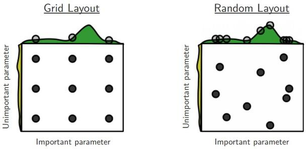

### 자동 최적화 — Bayesian optimization

Hyper parameter 탐색을 자동화하는 대표적 방법이 **Bayesian optimization** 이다. 지금까지 시험한 (hyper parameter, 성능) 쌍으로부터 성능 함수의 근사 모델을 세우고, 그 모델이 "다음에 시험해 볼 가치가 가장 큰 지점"을 고르게 한다.

- Surrogate model : 성능 함수를 근사하는 모델. Gaussian process 등이 쓰인다.
- Acquisition function : surrogate model 위에서 다음 시험 지점을 고르는 기준.
  - PI (Probability of Improvement) : 현재 최고값보다 좋아질 확률
  - EI (Expected Improvement) : 좋아지는 정도의 기댓값

(슬라이드에서는 Keras 시절의 예제 노트북 `PR_03_01_bayesian_keras_hyperparameters.ipynb` 와 kaggle 튜토리얼 `https://www.kaggle.com/clair14/tutorial-bayesian-optimization`, `http://sanghyukchun.github.io/99/` 를 참고 자료로 들고 있다.)

### 자동 최적화 — Population-based / Evolutionary / Genetic algorithm

또 다른 갈래는 여러 해를 동시에 다루는 방법이다. 포함 관계로 보면 Population-based optimization ⊃ Evolutionary optimization ⊃ Genetic algorithm 이다.

- **Population-based optimization** : 여러 개의 해(개체)를 동시에 유지하고 발전시키며 최적해를 찾는 방법의 총칭. Evolutionary algorithm, Particle swarm optimization, Swarm intelligence, Differential evolution 등이 있다.
- **Evolutionary optimization** : 자연 선택과 진화 과정에서 영감을 받아 설계된 최적화 알고리즘의 총칭. Evolution strategy, Genetic algorithm, Genetic programming 등이 있다.
- **Genetic algorithm** : 교배와 돌연변이 과정을 통해 다음 세대의 해를 만들어 간다.
  - 선택(Selection) : 적합도가 높은 개체를 선택해 다음 세대를 구성하는 데 사용한다.
  - 교차(Crossover) : 선택된 두 개체의 유전 정보를 교환해 새로운 개체를 생성한다.
  - 돌연변이(Mutation) : 일부 개체의 유전자를 임의로 변화시켜 다양성을 유지한다.

### Evolution Strategies (ES)

**Evolution strategy** 는 돌연변이와 선택 과정을 통해 개체군을 발전시키며 최적해를 찾는 최적화 기법이다. 주로 연속적 최적화 문제를 해결하는 데 특화되어 있다. 그 중 **공분산 행렬 적응(CMA-ES)** 은 개체군의 분포를 공분산 행렬로 표현하고 그것을 갱신해 가므로, 복잡한 다차원 연속형 문제에서 특정 방향으로 집중된 탐색이 가능하다.

아래 두 애니메이션은 같은 2차원 함수 위에서 두 ES 변형이 개체군(점 구름)을 이동시키며 최적점(붉은 점)으로 다가가는 모습이다. 개체군이 한 점으로 수렴하는 것이 아니라, 분포 전체가 좋은 영역으로 이동한다는 점이 gradient 기반 방법과 다르다.


이런 방법을 지원하는 라이브러리로 슬라이드는 다음을 들고 있다.

- Optuna : `https://optuna.org/`
- Sklearn-genetic-opt : `https://github.com/rodrigo-arenas/Sklearn-genetic-opt`
- Gentun : `https://github.com/gmontamat/gentun`
- PyGAD : `https://pygad.readthedocs.io/en/latest/`

다만 **ES 가 만능은 아니다.** ES 는 gradient 기반으로는 찾기 어려운 해를 찾는 방법일 수 있지만, gradient 를 계산할 수 있는 많은 문제에서는 오히려 낮은 성능을 보인다. 아래 표는 MNIST ConvNet 을 여러 방법으로 학습시킨 정확도(%) 비교다. Gradient 를 쓰는 Adam 이 가장 높고, 단순 GA 는 크게 뒤진다.

| Method | Train Set | Test Set |
|---|---|---|
| Adam | 99.8 | 98.9 |
| Simple GA | 82.1 | 82.4 |
| CMA-ES | 98.4 | 98.1 |
| OpenAI-ES | 96.0 | 96.2 |

(ES 시각화 자료 : `https://blog.otoro.net/2017/10/29/visual-evolution-strategies/`)

---

## 3.3.4 Gradient descent, learning rate, batch size
<!-- 슬라이드 223~225 -->

### Gradient descent 와 step 크기

최적화란 loss 함수를 최소화시키는 parameter(weight)를 찾는 과정이다. **Gradient descent(기울기 하강법)** 는 모든 parameter 에 대한 loss 의 미분값(기울기)을 계산하고 — 벡터에 대한 미분이므로 편미분이다 — 그것을 모아 놓은 벡터를 gradient 라 부른 뒤, 전체로 볼 때 기울기가 가장 큰 방향의 반대쪽으로 1 step 만큼 parameter 를 수정하는 것이다.

$$
w_{t+1} = w_t - \alpha \frac{\partial \mathrm{loss}}{\partial w}, \qquad
g_t = \frac{\partial \mathrm{loss}}{\partial w}, \qquad \alpha = \text{learning rate}
$$

여기서 $g_t$ 는 $t$ 번째 step 의 gradient, $\alpha$ 는 한 걸음의 크기를 정하는 learning rate 다.

방향은 gradient 가 정해 주는데, **수정하는 크기**는 어떻게 정할 것인가가 문제다. Learning rate 가 크면 최소점을 지나쳐 진동하거나 발산하고, 작으면 수렴이 너무 느리거나 얕은 local minimum 에 갇힌다. 커도 문제, 작아도 문제이므로 learning rate 를 제어하는 것(learning rate control)이 최적화의 핵심 과제 중 하나가 된다.


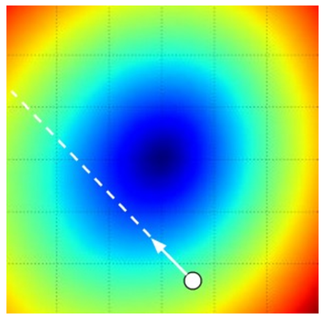

### Batch size

Gradient 를 한 번 계산하는 데 데이터를 얼마나 쓸 것인가는 학습 효율의 문제이며, 이것도 hyper parameter 다.

- **Batch gradient descent** : 모든 data 에 대해 gradient 를 계산하여 parameter 를 1번 수정한다. data 가 100만 개라면 한 번 수정하기 위해 100만 개를 모두 훑어야 하므로 효율적이지 못하다.
- **Mini-batch gradient descent (MGD)** : 작은 batch 단위로 data 를 나누어 GD 를 수행한다.
- **Stochastic gradient descent (SGD)** : batch 단위가 1인 경우, 즉 data 하나씩 GD 를 수행한다. 프로그램이 벡터·행렬 연산으로 여러 샘플을 한꺼번에 처리할 수 있는데 하나씩 처리하는 것이므로 이것도 효율적이지 못하다.

관례상 MGD 와 SGD 를 구분하지 않고 그냥 **SGD** 라 부른다. PyTorch 의 `torch.optim.SGD` 도 mini-batch 로 쓰는 것이 보통이다. Batch size 는 연산 효율(메모리 정렬, GPU 병렬성) 때문에 $2^n$ 값(32, 64, 128, …)을 주로 사용한다.

### Loss 함수의 복잡도와 초기값 문제

Learning rate 와 batch size 를 잘 정해도, loss 함수의 지형 자체가 복잡하면 어디서 출발하느냐(초기값)에 따라 도착하는 곳이 달라진다. 아래 그림들은 실제 신경망의 loss 지형을 2차원으로 투영해 그린 것이다. VGG-56 의 지형은 날카로운 봉우리와 골이 뒤엉켜 있어 초기값에 따라 전혀 다른 골짜기로 떨어질 수 있고, ResNet-56 의 지형은 상대적으로 매끄러워 어디서 출발해도 넓은 골짜기로 모인다. 두 개의 parameter $\theta_0, \theta_1$ 만 있는 작은 예에서도 출발점이 다르면 서로 다른 local minimum 으로 내려가는 것을 볼 수 있다.

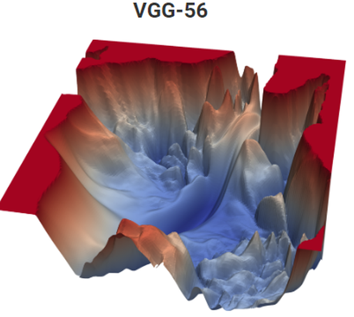

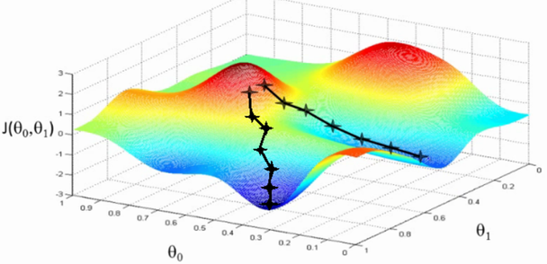

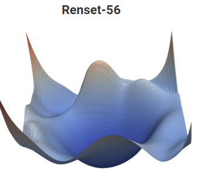

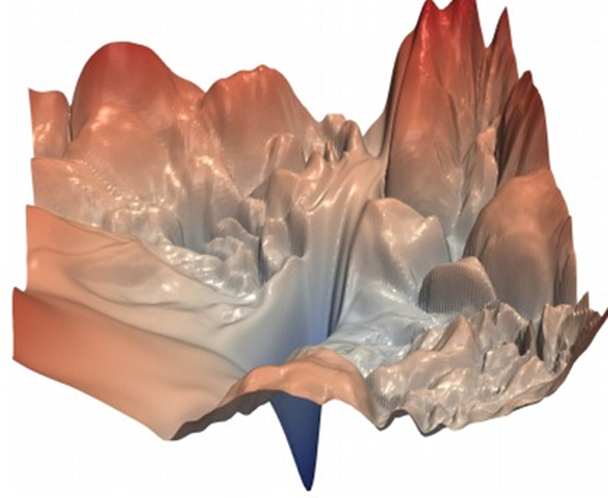

> **핵심 메시지**
> Gradient 는 방향만 알려 준다. 얼마나 갈지(learning rate), 몇 개의 샘플로 방향을 잴지(batch size), 어디서 출발할지(초기값)는 모두 설계자의 결정이며, 지형이 복잡할수록 이 결정이 결과를 좌우한다.

---

## 3.3.5 최적화 알고리즘의 계보 — SGD 에서 Adam 까지
<!-- 슬라이드 226~231 -->

### 한눈에 보는 계보

최적화 알고리즘들은 앞의 것이 가진 문제를 하나씩 고치며 발전해 왔다.

- **SGD (Stochastic Gradient Descent)** : batch 단위로 기울기를 계산하여 $W$ 를 수정한다.
- **Momentum** : 기울기에 속도 개념을 추가한다.
- **NAG (Nesterov Accelerated Gradient)** : momentum 을 먼저 적용한 위치에서 gradient 를 적용한다.
- **Adagrad** : $W$ 의 변화량에 따라 가중치를 부여한다. 변화량이 적었던 parameter 는 좀 더 변화량을 키운다.
- **Adadelta, RMSprop** : Adagrad 의 단점(learning rate 가 0 으로 수렴)을 개선한다.
- **Adam (Adaptive Moment Estimation)** : RMSprop 에 momentum 을 혼합한 특성을 가진다.
- **Nadam (Nesterov Adaptive Moment Estimation)** : Adam 에서 momentum 대신 NAG 를 적용한다.

아래 두 애니메이션은 이 알고리즘들이 같은 지형에서 어떻게 움직이는지 비교한 것이다. 첫 번째는 완만한 골짜기 지형이고, 두 번째는 가운데에 안장점(saddle point)이 있는 지형이다. 안장점 근처에서는 gradient 가 거의 0 이라 SGD 는 오래 머무르지만, momentum 이나 adaptive learning rate 를 쓰는 방법들은 빠져나온다.


(보충자료 : `https://www.ruder.io/optimizing-gradient-descent/`, `https://home.ttic.edu/~shubhendu/Pages/Files/Lecture6_flat.pdf`)

### SGD + Momentum

Momentum 은 물리학적 관점에서 이해하는 것이 쉽다. 손실함수를 구릉지대의 높이라고 보면, 최적화 과정은 parameter 벡터(입자)를 그 지형 위에서 "굴리는" 과정과 같다. 입자가 느끼는 힘은 손실함수의 gradient 의 반대 부호이고, $F = ma$ 이므로 gradient 는 위치가 아니라 **속도(velocity)** 에 직접 영향을 준다. 즉 매 step 의 gradient 가 속도에 누적되고, parameter 는 그 속도만큼 움직인다.

이렇게 하면 gradient 가 같은 방향으로 계속 나올 때 속도가 붙어 빨리 내려가고, 방향이 오락가락하는 축에서는 서로 상쇄되어 진동이 줄어든다. 그래서 SGD 를 안정적이고 빠르게 학습할 수 있게 한다. 반대로 힘이 축적되어 최소점을 지나쳐 버리는 **over shooting** 경향이 있다.

SGD 가 겪는 어려움을 세 가지로 정리하면 다음과 같다. Momentum 은 이 세 경우 모두에서 도움이 된다.

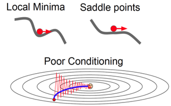

또 mini-batch 로 계산한 gradient 는 전체 데이터의 gradient 와 다르므로 잡음(gradient noise)이 섞여 있다. 아래 그림에서 검은 경로는 잡음 섞인 SGD 의 경로이고 파란 경로는 momentum 을 쓴 경로다. Momentum 이 잡음을 평균해 주어 경로가 매끄러워진다.

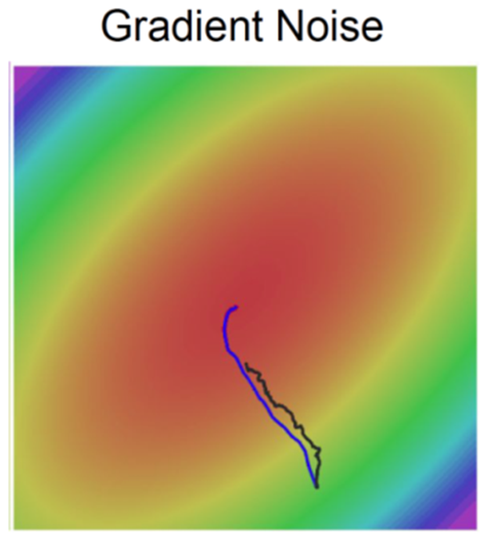

### Nesterov accelerated gradient (NAG)

NAG 는 momentum 의 over shooting 을 줄이기 위해 gradient 를 재는 위치를 바꾼다. 현재 위치에서 gradient 를 계산하는 것이 아니라, momentum 에 의해 "예견된" 위치 — 현재 위치에서 속도 항 $\gamma v_{t-1}$ 만큼 미리 가 본 지점 — 에서 gradient 를 계산한다. 이것을 **lookahead** 라 한다.

$$
v_t = \gamma v_{t-1} + \eta \nabla_{\theta_t} J(\theta_t - \gamma v_{t-1}), \qquad
\theta_{t+1} = \theta_t - v_t
$$

여기서 $\gamma$ 는 momentum 계수, $\eta$ 는 learning rate, $J$ 는 손실함수다. 식에서 gradient 를 계산하는 인자가 $\theta_t$ 가 아니라 $\theta_t - \gamma v_{t-1}$ 인 것이 momentum 과의 유일한 차이다. 미리 가 본 지점에서 gradient 가 이미 반대 방향을 가리키고 있다면 속도가 줄어들기 시작하므로, 최소점을 지나치는 정도가 작아진다.

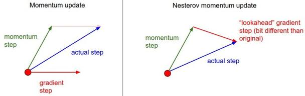

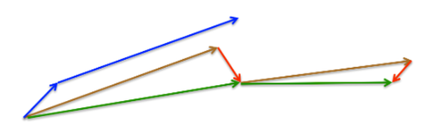

### Adagrad

지금까지는 모든 parameter 에 같은 learning rate 를 적용했다. 그런데 parameter 마다 gradient 의 크기와 빈도가 다르므로 parameter 별로 learning rate 를 다르게 주고 싶어진다. 문제는 learning rate 가 hyper parameter 라서 이것을 parameter 마다 손으로 정하면 tuning 이 아주 복잡해진다는 것이다. **Adagrad** 는 이 학습 속도를 자동으로 조정하려는 노력이다.

Adagrad 는 각 parameter 에 대해 과거 gradient 의 제곱을 누적(cumulative gradient)하고, 그 제곱근으로 learning rate 를 나눈다. 그 결과 parameter update 에서 성분별로 일종의 normalize 기능을 하게 된다.

- 높은 gradient 값을 갖는 parameter 들은 점점 effective learning rate 가 감소한다.
- Gradient 값이 낮거나 변화가 거의 없는 parameter 들은 상대적으로 effective learning rate 가 증가한다.

즉 변화가 드문 parameter 는 변화 값을 키우고, 변화가 많은 parameter 는 변화 값을 줄인다. 이 성질 때문에 Adagrad 는 sparse 한 데이터(빈도가 적은 단어 등)의 출현에 유용하고, parameter 가 많아 tuning 이 어려운 대규모 모델에서 유용하다.

단점은 **과거의 모든 gradient 가 축적된다**는 것이다. 누적값은 단조 증가하므로 effective learning rate 는 단조 감소한다. 학습 속도가 한 방향으로 aggressive 하게 진행하는 경향이 생기고, learning rate 가 너무 작아져 학습을 너무 빨리 멈출 가능성이 있다.

### Adadelta 와 RMSprop

두 방법 모두 Adagrad 의 이 단점을 보완한다.

- **Adadelta** : 과거의 gradient 를 무한정 축적하지 않고 time window 로 제한한다. 누적값이 monotonically decreasing 하게 learning rate 를 줄이는 것을 막아, learning rate 가 0 으로 수렴하는 경향을 줄인다.
- **RMSprop** : Hinton 교수의 강의자료에서 제안된 방법으로, 과거의 gradient 를 축적하지 않고 **moving average** 로 제한한다. 즉 gradient 제곱의 지수 이동 평균(2차 momentum)을 유지한다. 많은 경우 훌륭한 결과를 가져온다.

RMSprop 의 갱신식은 다음과 같다. 감쇠 계수는 $\gamma = 0.9$ 를 쓴다.

$$
E[g^2]_t = 0.9\, E[g^2]_{t-1} + 0.1\, g_t^2, \qquad
\theta_{t+1} = \theta_t - \frac{\eta}{\sqrt{E[g^2]_t + \epsilon}}\, g_t
$$

$E[g^2]_t$ 는 gradient 제곱의 이동 평균이고, $\epsilon$ 은 0 으로 나누는 것을 막는 작은 상수다. 최근 gradient 가 컸던 parameter 는 분모가 커져 보폭이 줄고, 작았던 parameter 는 보폭이 커진다. 오래된 gradient 는 $0.9$ 를 거듭 곱하며 잊혀지므로 Adagrad 처럼 learning rate 가 0 으로 죽지 않는다.

PyTorch 에서는 다음과 같이 쓴다. `alpha` 가 위 식의 감쇠 계수에 해당한다.

```python
torch.optim.RMSprop(params, lr=0.01, alpha=0.99, eps=1e-08, weight_decay=0, momentum=0)
```

아래 그림은 잡음이 있는 지형에서 SGD(검정), momentum(파랑), RMSprop(빨강)의 경로를 비교한 것이다. Momentum 은 속도가 붙어 크게 돌아가고, RMSprop 은 축별로 보폭을 조절해 비교적 곧게 내려간다.

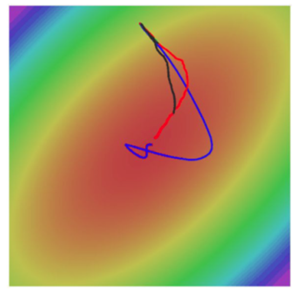

### Adam 과 Nadam

**Adam (Adaptive Moment Estimation)** 은 RMSprop 에 momentum 을 혼합한 특성을 가진다. Gradient 의 1차 moment(평균)와 2차 moment(제곱의 평균)를 각각 지수 이동 평균으로 유지한다.

$$
m_t = \beta_1 m_{t-1} + (1 - \beta_1)\, g_t \qquad \text{(momentum term, } \beta_1 = 0.9\text{)}
$$

$$
v_t = \beta_2 v_{t-1} + (1 - \beta_2)\, g_t^2 \qquad \text{(RMSprop term, } \beta_2 = 0.999\text{)}
$$

$m_t$ 는 momentum 처럼 gradient 의 방향을 누적하고, $v_t$ 는 RMSprop 처럼 gradient 의 크기를 추적해 parameter 별 보폭을 정한다. 한 가지 더, $m_0 = v_0 = 0$ 으로 시작하므로 학습 초기에는 두 값이 실제보다 작게 추정되는 bias 가 발생한다. Adam 은 이를 보정하는 **bias correction** 단계를 둔다.

PyTorch 의 기본값은 위 식의 $\beta_1, \beta_2$ 와 같다.

```python
torch.optim.Adam(params, lr=0.001, betas=(0.9, 0.999), eps=1e-08, weight_decay=0)
```

**Nadam (Nesterov Adaptive Moment Estimation)** 은 Adam 에서 momentum 대신 NAG 를 적용하여 개선한 것이다.

> **핵심 메시지 — 무엇을 쓸 것인가**
> Adam 은 기본 알고리즘으로 추천되고 있고, 종종 RMSprop 보다 조금 더 잘 한다. SGD + Nesterov momentum 도 대안이다. 그럼에도 많은 논문에서 SGD 를 사용하는데, 직관적이고 제어가 쉽기 때문이다.

(정리 논문 : "An overview of gradient descent optimization algorithms", 2017)

---

## 3.3.6 최근의 optimizer — AdamW, Lion, Adafactor
<!-- 슬라이드 232~234 -->

### AdamW (Adam + Weight Decay)

**AdamW** 는 "Decoupled Weight Decay Regularization"(2019) 에서 제안된 것으로, weight decay 를 Adam 의 적응적 learning rate 로부터 분리(decouple)한다. Adam 에서는 weight decay 항이 gradient 에 더해진 뒤 적응적 보폭으로 나뉘기 때문에 weight decay 의 실제 효과가 learning rate 에 민감하게 달라지는데, AdamW 는 weight decay 를 parameter 에 직접 적용하여 learning rate 에 민감하지 않도록 한다.

```python
torch.optim.AdamW(params, lr=0.001, weight_decay=0.01)
```

아래 그림은 CIFAR-10 에서 learning rate(세로축)와 weight decay 계수(가로축)를 바꿔 가며 test error 를 heat map 으로 그린 것이다. 윗줄이 Adam, 아랫줄이 AdamW 이고 왼쪽부터 학습률 schedule 없음 / step-drop / cosine annealing 이다. Adam 은 좋은 영역(파란색)이 대각선 방향으로 좁게 나타나 두 hyper parameter 가 얽혀 있음을 보여 주고, AdamW 는 좋은 영역이 넓고 두 축이 서로 독립적이다.

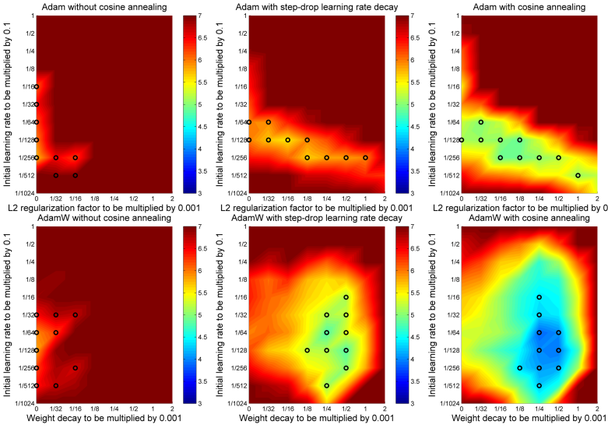

다음 두 그래프는 epoch 에 따른 test error 곡선이다. Adam, AdamW, SGDW 와 warm restart 를 붙인 AdamWR, SGDWR 을 비교한다. 톱니 모양은 warm restart 로 learning rate 를 주기적으로 다시 키운 흔적이다.

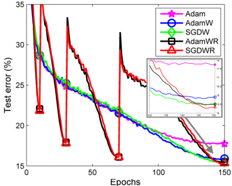

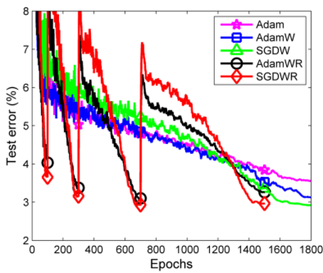

(참고 : `https://hiddenbeginner.github.io/deeplearning/paperreview/2019/12/29/paper_review_AdamW.html`, `https://arxiv.org/pdf/1711.05101.pdf`)

### Lion

슬라이드는 두 가지 "Lion" 을 함께 소개한다. 하나는 "The Lion Optimization Algorithm (LOA): A nature-inspired metaheuristic algorithm"(2019)으로, 사자들의 협력과 경쟁 행동을 모델로 적용하여 다양한 최적화 문제를 해결하는 데 쓰는 metaheuristic 이다. 다른 하나는 "Symbolic Discovery of Optimization Algorithms"(2023)에서 탐색으로 찾아낸 딥러닝용 optimizer 로, **부호(sign) 연산자를 사용하여 update 크기를 제어하는 확률적 경사 하강 방법**이다.

- Momentum 만 추적하므로 2차 moment 에 의존하는 Adam 과 달리 메모리 효율이 좋다.
- Adam 에 비한 성능 향상은 batch 크기에 따라 증가한다.
- 구현 : `https://github.com/lucidrains/lion-pytorch`, `https://github.com/google/automl/tree/master/lion`

아래 그래프는 학습 연산량에 대한 ImageNet 정확도와, 생성 모델 학습 iteration 에 대한 FID 를 AdamW 와 비교한 것이다. 같은 정확도(또는 FID)에 도달하는 데 드는 연산이 각각 약 3배, 약 2.3배 줄어든다는 것이 그림의 주장이다.

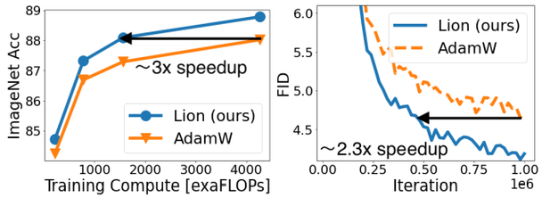

다음 표는 BASIC-L 모델을 Adafactor 와 Lion 으로 학습시켰을 때의 ImageNet 및 여러 robustness benchmark 정확도다.

| Optimizer | ImageNet | V2 | Zero-shot A | Zero-shot R | Sketch | ObjectNet | Fine-tune ImageNet |
|---|---|---|---|---|---|---|---|
| Adafactor | 85.7 | 80.6 | 85.6 | 95.7 | 76.1 | 82.3 | 90.9 |
| Lion | **88.3** | **81.2** | **86.4** | **96.8** | **77.2** | **82.9** | **91.1** |

### Adafactor (Adaptive Factored Learning Rate)

**Adafactor** 는 "Adafactor: Adaptive Learning Rates with Sublinear Memory Cost"(2018)에서 제안되었고 `torch.optim.Adafactor()` 로 제공된다. Gradient 의 일부 정보만 저장하므로 메모리를 덜 차지하며, NLP 작업에서 흔히 사용된다.

왜 메모리가 문제가 되는지는 Adam 의 구조를 보면 알 수 있다.

- Adam = RMSprop + Momentum 이고, 두 항의 gradient 통계를 각각 저장한다.
- Momentum 은 이전 단계의 weight update 를 고려하여 다음 단계의 update 를 조정한다.
- RMSprop 은 weight 의 제곱 이동 평균을 사용하여 update 를 조정한다.
- 따라서 Adam 을 쓰면 optimizer 가 모델 크기의 3배(parameter 자체 + $m$ + $v$)에 해당하는 메모리를 필요로 한다.

Adafactor 는 momentum 을 사용하지 않고, RMSprop 의 2차 moment 행렬을 행·열 합으로 인수분해(factored)하여 더 적은 메모리로 근사한다. 또한 **relative step size** 를 사용하여, 초기 learning rate 가 주어지면 스스로 learning rate 를 조절한다.

메모리 크기를 비교하면 다음과 같다. $N$ 은 weight 수, $M$ 은 weight 의 차원이다. Adafactor 는 Adam 보다 약 $n/m$ 만큼 적은 메모리를 사용한다.

| 알고리즘 | 메모리 사용량 |
|---|---|
| Adafactor | $O(n + m)$ |
| Adam | $O(n \times m)$ |

| Algorithm | Memory requirement |
|---|---|
| Adam | 4 × 4 × 8 bytes × number of variables |
| Adafactor | 4 × 8 bytes × number of variables |

(참고 : `https://heegyukim.medium.com/adafactor-optimizer-for-deep-learning-8268ca91e506`)

---

## 3.3.7 Generalization 과 Overfitting
<!-- 슬라이드 235~236 -->

### Generalization performance 향상

광의의 최적화에서 알고리즘 다음으로 중요한 것은 **generalization(일반화) 성능**, 즉 학습에 쓰지 않은 데이터에서의 성능을 높이는 일이다. 이것은 곧 **overfitting 을 막는 것**과 같다. Overfitting 이란 모델이 training data 에만 최적화되는 것을 말하며, overfitting 을 막으면 generalization 이 향상된다.

학습을 오래 할수록 모델은 점점 복잡해져서 training data 의 세부까지 외우게 되고, 그 결과 overfitting 이 발생한다. 반대로 학습이 부족하면 표현력이 낮아서 **underfitting** 이 발생한다. 아래 그림은 모델의 복잡도(VC dimension)에 따라 in-sample error(training error)와 out-of-sample error(test error)가 어떻게 달라지는지 보여 준다. Training error 는 복잡도가 커질수록 계속 내려가지만, test error 는 어느 지점부터 다시 올라간다. 두 곡선의 간격이 generalization performance 이고, 간격이 벌어지는 오른쪽 영역이 overfitting 이다.

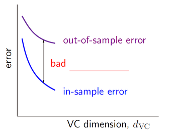

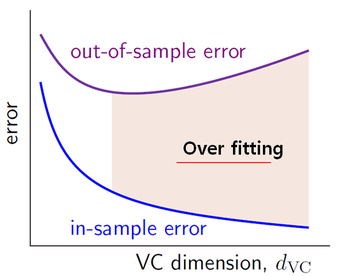

그래서 질문은 이렇게 된다 — **어떻게 overfitting 을 막거나, 늦추거나, 피할 것인가?**

### Overfitting 을 막는 4가지 접근법

Overfitting 을 막는 것을 통틀어 **regularization** 이라 부른다. 접근법은 크게 네 가지로 나뉜다.

- **Approach 1 : Get more data** — 데이터를 더 모으거나 만든다.
- **Approach 2 : Use a model with the right capacity** — 모델이 데이터에 맞는 적절한 용량을 갖게 한다.
- **Approach 3 : Average many different models (Ensemble)** — 여러 모델의 결과를 평균한다.
- **Approach 4 : Use DropOut, DropConnect, or BatchNorm** — 학습 중 확률적으로 구조를 바꾸거나 출력 분포를 정규화한다.

아래 두 그림은 approach 3 과 4 의 개념이다. Ensemble 은 서로 다른 결정 경계를 가진 분류기들을 합쳐 더 부드러운 경계를 만든다. DropOut 은 학습 중 일부 노드를 끄는(×) 것으로, 매 step 서로 다른 얇은 network 를 학습시키는 셈이 된다.

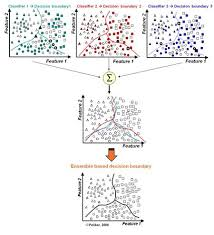

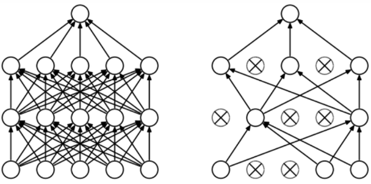

---

## 3.3.8 Approach 1 — Data augmentation
<!-- 슬라이드 237 -->

Overfitting 을 막고 generalization 성능을 높이는 최고의 방법은 **더 많은 데이터(more data)** 다. 데이터를 새로 모을 수 없다면 있는 데이터를 변형해 늘리는 **dataset augmentation** 이 generalization 성능을 극적으로 증가시킬 수 있다.

- **라벨보존변환(label preserving transformation)** : data 의 label 은 유지하면서 data 를 변환시키는 것. 고양이 사진을 뒤집거나 살짝 회전해도 여전히 고양이다. 이것이 data augmentation 의 기본 개념이다.
- **Noise 추가** : data 에 적절한 noise 를 추가한다.
- 그래도 모자라면 **fake data 를 만든다(create fake data)** — 생성 모델 등으로 합성한다.

어떤 변환을 얼마나 적용할지도 선택의 문제인데, Google 의 **AutoAugment(2018)** 는 dataset 에 적합한 변환 전략을 스스로 선택한다(`https://arxiv.org/abs/1803.09501v1`, code : `https://goo.gl/1CnNog`).

이미지 augmentation 기법은 아래 그림처럼 세 갈래로 나뉜다. 이미지를 기하학적·색상적으로 조작하는 것, 일부를 지우는 것, 두 이미지를 섞는 것이다.

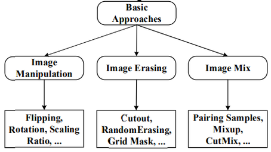

(survey : "A survey on Image Data Augmentation for Deep Learning", 2019, `https://journalofbigdata.springeropen.com/articles/10.1186/s40537-019-0197-0#Sec1` ; "Image Data Augmentation for Deep Learning: A Survey", 2022, `https://arxiv.org/pdf/2204.08610.pdf`)

---

## 3.3.9 Approach 2 — Right capacity 와 weight decay
<!-- 슬라이드 238~241 -->

### 모델이 적절한 capacity 를 갖도록 하는 방법

모델의 capacity(표현력)를 데이터에 맞게 제한하는 방법은 네 가지다.

1. **Architecture 측면** : layer 의 수와 node 의 수를 제한한다. CNN / RNN / GNN / Transformer 등 data 에 적합한 구조를 사용한다.
2. **Early stopping** : 학습 중에 validation data 를 사용하여 학습 시간을 제한한다. Overfitting 이 시작되기 전에 학습을 중단한다.
3. **Weight-decay (regularization)** : 가중치(weight)의 크기를 제한한다. 가중치의 squared values(L2) 또는 absolute values(L1)의 크기에 따라 가중치에 penalty 를 부여한다.
4. **Learning rate scheduling** : 학습이 진행됨에 따라 learning rate 를 줄여 간다.

이 소절에서는 3(weight decay)을 다루고, 2 와 4 는 다음 소절에서 다룬다.

### Weight decay (regularization) 의 원리

Weight decay 는 cost function 에 **penalty 를 부과**하는 것이다. 가중치가 크면 update 가 적게 되도록 하여 모델의 표현력(학습력)을 제한한다. 결과적으로 **weight 값의 분포를 제어**하는 효과가 있다.

아래 그림은 같은 데이터를 다항식으로 fitting 하면서 regularization 계수 $\lambda$ 를 키워 간 결과다. $\lambda = 0$ 이면 fit 곡선이 데이터 점을 모두 지나며 심하게 구부러지고(overfitting), $\lambda$ 가 커질수록 곡선이 부드러워지다가 $\lambda = 1$ 에서는 target 을 따라가지 못한다(underfitting). 아주 작은 regularization 만으로도 효과가 크다는 것이 그림의 요지다.

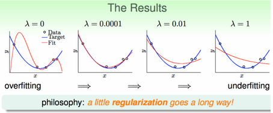

구체적으로는 cost function 에 **regularization term** 을 더한다.

$$
\text{L1 Regularization: } \mathrm{Cost} = \mathrm{Cost}_0 + \lambda \sum_{j=1}^{n} |w|
$$

$$
\text{L2 Regularization: } \mathrm{Cost} = \mathrm{Cost}_0 + \lambda \sum_{j=1}^{n} w^2
$$

- $\mathrm{Cost}$ : 실제로 최소화하는 cost function
- $\mathrm{Cost}_0$ : 기존 cost function (예 : cross entropy)
- $\lambda$ : regularization parameter. 클수록 penalty 가 강하다.

두 term 의 차이는 미분했을 때 드러난다. Weight update 에서 regularization term 의 미분이 어떻게 작용하는지 비교하면 다음과 같다.

- L1 : $W \leftarrow W \mp \lambda$ — $W$ 의 부호에 따라 **상수** $\lambda$ 를 빼거나 더한다. $W$ 가 0 이 되도록 유도한다.
- L2 : $W \leftarrow W \mp \lambda W$ — $W$ 에 **비례하는** 값을 뺀다. $W$ 가 0 에 가까워지도록 유도하지만 정확히 0 이 되지는 않는다.

아래 표는 두 방법의 수식·미분·특성을 나란히 놓은 것이다.

| | L1 | L2 |
|---|---|---|
| 수식 | $\|w\|_1$ (V 자 모양) | $\frac{1}{2}\|w\|^2$ (포물선 모양) |
| 미분 | $1$ ($w < 0$), $-1$ ($w > 0$) — 계단 모양 | $w$ — 직선 |
| 특성 | 가중치 값을 정확하게 0 으로 만듦. 중요한 특징을 '선택'하는 효과. 모델에 sparsity 를 가함 | 큰 가중치의 값을 작게 만듦. 모델 전반적인 복잡도를 감소시키는 효과. 가중치의 값이 0 이 되게 하지는 못함 |

### L1 Regularization (Lasso / L1 penalty)

L1 은 cost 를 미분하여 weight update 할 때 $W$ 에서 상수값 $\lambda$ 를 빼게 한다. 크기와 무관하게 일정량씩 깎이므로 작은 weight 는 금방 0 에 도달한다.

- $\lambda$ 가 커지면 weight 가 0 인 항이 빠르게 증가한다.
- 소수의 node 가 책임지게 되어 **중요한 feature 만 사용**하게 된다.
- **Shrinkage method** 로 동작한다 — 중요한 변수만 추리기.

그래서 상관관계가 높을 것으로 생각되는 feature 들이 많을 때 그 중 필요한 것을 적절히 골라내는 효과가 발생한다.

아래 그림은 L1 을 적용한 학습에서 여러 weight 값이 step 에 따라 어떻게 변하는지 그린 것이다. 양수든 음수든 모두 일정한 기울기로 0 을 향해 수렴하고, 0 에 닿으면 그대로 머문다.

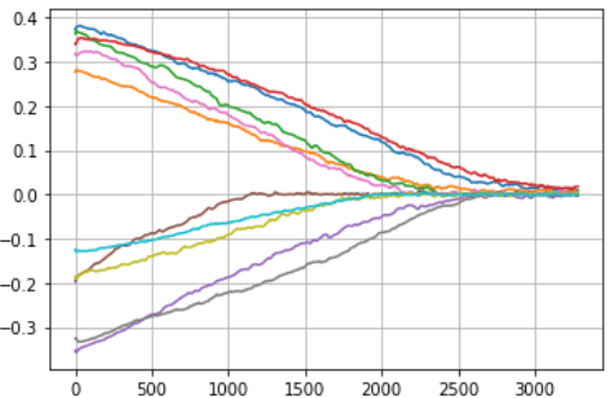

### L2 Regularization (Ridge / L2 penalty)

L2 는 cost 를 미분하여 weight update 할 때 weight 의 **일정 비율**을 빼는 효과를 낸다.

- Weight 가 비정상적으로 커지지 못하게 한다.
- Weight 가 작아지더라도 0 이 되지는 않는다.
- 다수의 node 가 책임지게 되어, 강제로 **모든 feature 가 사용**된다.

결과적으로 학습 속도를 늦추면서 feature 들이 각자 자기 역할을 찾을 수 있도록 조정하는 효과가 발생한다. 일반적으로 L2 가 선호된다. 아래 그림은 L2 를 적용한 학습의 weight 궤적이다. 큰 weight 는 빠르게, 작은 weight 는 느리게 줄어들며 0 근처에 모이지만 정확히 0 이 되지는 않는다.

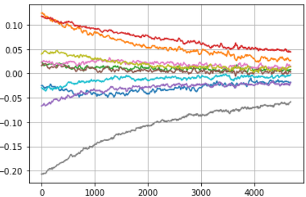

PyTorch 에서 L2 regularization 은 optimizer 의 `weight_decay` 인자 하나로 적용된다.

```python
torch.optim.Adam(self.parameters(), lr=0.001, weight_decay=0.001)
```

### 실습 3.3.1 — Optimization : L2 / L1 regularization
<!-- 슬라이드 240~241 -->

> 노트북: `code/3.3.1.Optimization.ipynb`
> [](https://colab.research.google.com/github/AI-BoostCamp/intermediate-deep-learning-pytorch/blob/main/code/3.3.1.Optimization.ipynb)

**목적** — MNIST 를 분류하는 작은 MLP 에 L2, L1 regularization, Dropout, 그리고 Batch / Layer / Unit normalization 을 차례로 적용해 보고 validation 곡선으로 효과를 비교한다. 이 소절에서는 L2 와 L1 부분을 다루고, Dropout 은 3.3.12 에서, normalization 비교는 3.3.15 에서 이어서 다룬다.

**Dataset 준비** — Lightning 의 `LightningDataModule` 로 MNIST 를 읽는다. `v2.ToImage()` 와 `v2.ToDtype(torch.float32, scale=True)` 로 0~1 실수 텐서로 바꾸고, 학습 데이터 60,000 장을 55,000 / 5,000 으로 나누어 validation 을 확보한다.

```python
from torchvision.datasets import MNIST

class MNISTDataModule(L.LightningDataModule):
  def __init__(self, data_dir: str = '', batch_size: int = 32):
    super().__init__()
    self.data_dir = data_dir
    self.batch_size = batch_size

  def setup(self, stage):
    transform=v2.Compose([
        v2.ToImage(),
        v2.ToDtype(torch.float32, scale=True),])

    self.mnist_test = MNIST(self.data_dir, train=False, transform=transform, download=True)
    mnist_full = MNIST(self.data_dir, train=True, transform=transform, download=True)
    self.mnist_train, self.mnist_val = random_split(mnist_full, [55000, 5000])

  def train_dataloader(self):
    return DataLoader(self.mnist_train, batch_size=self.batch_size, num_workers=4)
  def val_dataloader(self):
    return DataLoader(self.mnist_val, batch_size=self.batch_size, num_workers=4)
  def test_dataloader(self):
    return DataLoader(self.mnist_test, batch_size=self.batch_size, num_workers=4)

batch_size=256
data_module = MNISTDataModule(batch_size=batch_size)
```

**Base model** — 학습·검증 step 과 optimizer 정의를 `Wrap_10` 이라는 LightningModule 에 모아 두고, 모델 구조만 바꾼 자식 클래스를 여러 개 만든다. 이렇게 하면 비교 실험에서 바뀌는 부분(층 구성, optimizer 인자)만 눈에 띈다. 기본 optimizer 는 `weight_decay` 가 없는 Adam 이다.

```python
class Wrap_10(L.LightningModule):
    def training_step(self, batch, batch_idx):
        x, y = batch
        y_pred = self(x)
        loss = F.cross_entropy(y_pred, y)
        acc = FM.accuracy(y_pred, y, task="multiclass",num_classes=10)
        metrics={'loss':loss, 'acc':acc}
        self.log_dict(metrics,prog_bar=True,on_step=False,on_epoch=True)
        return loss

    def validation_step(self, batch, batch_idx):
        x, y = batch
        y_pred = self(x)
        loss = F.cross_entropy(y_pred, y)
        acc = FM.accuracy(y_pred, y, task="multiclass",num_classes=10)
        metrics={'val_loss':loss, 'val_acc':acc}
        self.log_dict(metrics,prog_bar=True,on_step=False,on_epoch=True)

    def configure_optimizers(self):
        return torch.optim.Adam(self.parameters(), lr=0.001)
```

```python
class Model(Wrap_10):
    def __init__(self):
        super(Model, self).__init__()
        self.layers = nn.Sequential(
            nn.Flatten(),
            nn.Linear(28*28, 256),
            nn.ReLU(),
            nn.Linear(256, 10))

    def forward(self, x):
        x = self.layers(x)
        return x

model = Model()
summary(model, input_size=(8, 28, 28))
```

학습할 때 `overfit_batches=0.1` 을 준다. 이것은 Lightning 이 학습 데이터의 10% 만 반복해서 쓰게 하는 옵션으로, **일부러 overfitting 이 일어나기 쉬운 조건**을 만드는 것이다. 데이터가 적을수록 regularization 의 효과가 뚜렷이 보인다. 학습 이력은 `CSVLogger` 가 `logs/<name>/version_N/metrics.csv` 에 남기므로, 그것을 읽어 epoch 별로 묶으면 곡선을 그릴 수 있다.

```python
model = Model()

overfit_batches = 0.1 #0.3
epochs = 50

name="ReLU_Model"
logger = CSVLogger("logs", name=name)
trainer = L.Trainer(max_epochs=epochs, logger=logger,enable_model_summary=False,
                    overfit_batches=overfit_batches)
trainer.fit(model, data_module)
```

```python
v_num = logger.version
history = pd.read_csv(f'./logs/{name}/version_{v_num}/metrics.csv')
df = history.groupby('epoch').last().drop('step', axis=1)
```

**L2 regularization** — 모델 구조는 그대로 두고 `configure_optimizers` 만 override 하여 Adam 에 `weight_decay=0.001` 을 준다. 코드 한 줄 차이가 곧 L2 penalty 다.

```python
class Model3(Model):
    def __init__(self):
        super(Model3, self).__init__()

    def configure_optimizers(self):
        return torch.optim.Adam(self.parameters(), lr=0.001, weight_decay=0.001)

model = Model3()

epochs = 50
name="L2_Reg._Model"
logger = CSVLogger("logs", name=name)
trainer = L.Trainer(max_epochs=epochs, logger=logger,enable_model_summary=False,
                    overfit_batches=overfit_batches)
trainer.fit(model, data_module)
```

```python
v_num = logger.version
history = pd.read_csv(f'./logs/{name}/version_{v_num}/metrics.csv')
df2 = history.groupby('epoch').mean().drop('step', axis=1)

plt.figure(figsize=(10, 3.))
plt.subplot(1, 2, 1)
plt.title(f"ReLU({df['val_acc'].max():.3f}),L2_Reg({df2['val_acc'].max():.3f})")
plt.plot(df['val_acc'], linestyle='-', label="ReLU_val_acc")
plt.plot(df2['val_acc'], linestyle='--', label="L2reg_val_acc")
plt.grid()
plt.ylabel('Accuracy')
plt.legend()

plt.subplot(1, 2, 2)
plt.plot(df['val_loss'], linestyle='-', label="ReLU_val_loss")
plt.plot(df2['val_loss'], linestyle='--', label="L2reg_val_loss")
plt.grid()
plt.ylabel('Loss')
plt.legend()
plt.show()
```

**L1 regularization** — PyTorch optimizer 에는 L1 옵션이 없으므로 loss 에 직접 더한다. 개념은 다음 네 줄이다. 모든 parameter 의 절댓값 합(`l1_norm`)에 $\lambda$ 를 곱해 loss 에 더하면, backward 가 알아서 $W$ 의 부호에 따른 상수항을 gradient 에 포함시킨다.

```python
loss = loss_fn(outputs, labels)
l1_lambda = 0.001
l1_norm = sum(p.abs().sum() for p in model.parameters())

loss = loss + l1_lambda*l1_norm
```

이것을 LightningModule 에 넣으려면 `training_step` 을 override 한다. `####` 로 표시한 두 줄이 추가된 부분이다. `validation_step` 에서는 regularization 항을 더하지 않는다 — 검증에서 보고 싶은 것은 순수한 cross entropy 이기 때문이다.

```python
l1_lambda = 0.0001

class Model4(Model):
    def __init__(self):
        super(Model4, self).__init__()

    def training_step(self, batch, batch_idx):
        x, y = batch
        y_pred = self(x)
        loss = F.cross_entropy(y_pred, y)
####
        l1_norm = l1_lambda * sum(p.abs().sum() for p in model.parameters())
        loss = loss + l1_norm
####
        acc = FM.accuracy(y_pred, y, task="multiclass",num_classes=10)
        metrics={'loss':loss, 'acc':acc }
        self.log_dict(metrics,prog_bar=True,on_step=False,on_epoch=True)
        return loss

    def validation_step(self, batch, batch_idx):
        x, y = batch
        y_pred = self(x)
        loss = F.cross_entropy(y_pred, y)
        acc = FM.accuracy(y_pred, y, task="multiclass",num_classes=10)
        metrics={'val_loss':loss, 'val_acc':acc}
        self.log_dict(metrics,prog_bar=True,on_step=False,on_epoch=True)

    def configure_optimizers(self):
        return torch.optim.Adam(self.parameters(), lr=0.001)

model = Model4()

epochs = 50
name="L1_Reg._Model"
logger = CSVLogger("logs", name=name)
trainer = L.Trainer(max_epochs=epochs, logger=logger,enable_model_summary=False,
                    overfit_batches=overfit_batches)
trainer.fit(model, data_module)
```

학습 후에는 L2 때와 같은 방식으로 `df3` 을 만들어 기본 모델의 곡선과 겹쳐 그린다. 노트북은 "항상 성공적이지 않을 수 있음" 이라고 적어 두고 있다. Regularization 이 언제나 validation 성능을 올리는 것은 아니며, $\lambda$ 가 너무 크면 underfitting 으로 기울고, 너무 작으면 효과가 없다. 값을 바꿔 가며 곡선의 변화를 직접 보는 것이 이 실습의 목적이다.

**Layer 단위 L1 regularization** — 모델 전체가 아니라 특정 층에만, 혹은 층마다 다른 $\lambda$ 로 L1 을 걸고 싶을 때는 `named_parameters()` 로 이름을 보고 고른다. 이름에 `weight` 가 든 것만 고르는 이유는 bias 는 보통 regularization 에서 제외하기 때문이다.

```python
  self.fc1 = nn.Linear(100, 50)
  self.fc2 = nn.Linear(50, 10)

  ## layer name으로 접근, w / bias 구분 필요
  l1_loss = 0.0
  for name, param in model.named_parameters():
      if "weight" in name:  # bias는 보통 제외
          if "fc1" in name:
              l1_loss += l1_lambda['fc1'] * torch.sum(torch.abs(param))
          elif "fc2" in name:
              l1_loss += l1_lambda['fc2'] * torch.sum(torch.abs(param))
  total_loss = loss + l1_loss
```

---

## 3.3.10 Early stopping 과 learning rate schedule
<!-- 슬라이드 242~243 -->

### Early stopping

학습이 진행되면 training error(loss)는 지속적으로 감소하지만, validation error 는 어느 시점부터 다시 증가한다(validation accuracy 는 감소한다). 그래서 **training loss 와 validation loss 를 구분해서 봐야** 하며, validation loss 의 증가는 overfitting 의 전조다. Early stopping 은 이 전조가 보이는 시점에서 학습을 멈추는 것이다.

아래 그림은 세 가지 경우를 보여 준다. 왼쪽은 그대로 두어 validation loss 가 다시 오르는 과적합 발생, 가운데는 너무 일찍 멈춘 성급한 조기종료, 오른쪽은 validation loss 가 바닥에 닿은 지점에서 멈춘 적절한 조기종료다.

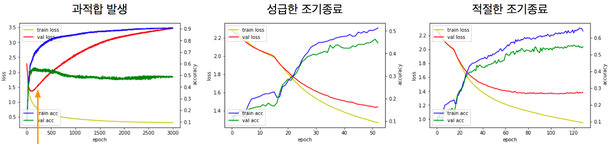

실제 학습 곡선은 아래처럼 훨씬 요동친다. Training loss 는 거의 0 까지 내려가는데 validation loss 는 일찍 바닥을 치고 그 뒤로 오르내리며 서서히 상승한다. 이런 곡선에서는 "가장 낮은 validation loss 를 기록한 epoch 의 가중치를 저장해 두는 것"(checkpoint)이 early stopping 의 실제 구현이 된다.

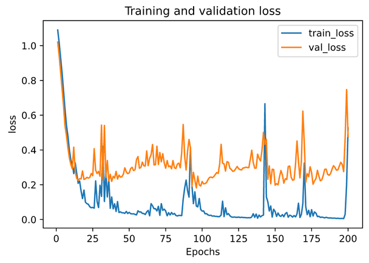

### Learning rate schedule

Learning rate 를 학습 중에 바꾸는 것을 learning rate schedule 이라 하며, 학습 속도와 성능에 큰 영향을 준다.

- **Time-based learning rate schedule** : step 이나 epoch 이 진행됨에 따라 연속적으로 learning rate 를 줄인다.
- **Drop-based learning rate schedule** : 일정 epoch 마다 learning rate 를 계단식으로 떨어뜨린다. 언제 얼마나 떨어뜨렸는지 해석이 쉬워서 좀 더 선호된다.

Learning rate 가 왜 문제인지는 아래 그림이 요약한다. 너무 높으면 loss 가 발산하고, 높으면 빨리 내려가지만 일찍 정체하며, 낮으면 느리고, 적절하면 빠르면서도 끝까지 내려간다. Schedule 은 "처음엔 높게, 나중엔 낮게" 로 이 장점들을 모두 취하려는 것이다.


PyTorch 의 `torch.optim.lr_scheduler` 가 제공하는 schedule 들을 그려 보면 다음과 같다.

Time-based schedule 의 예 —

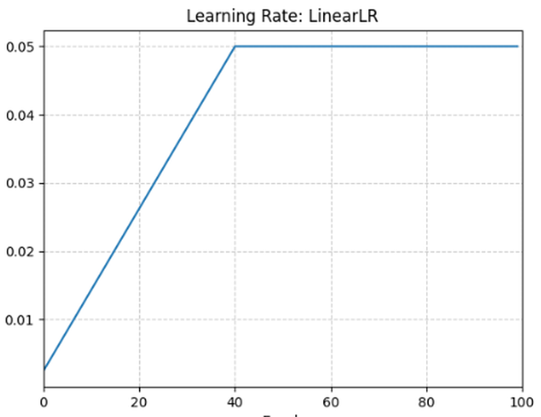

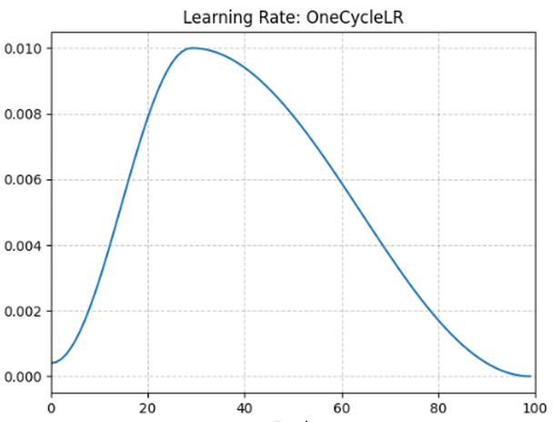

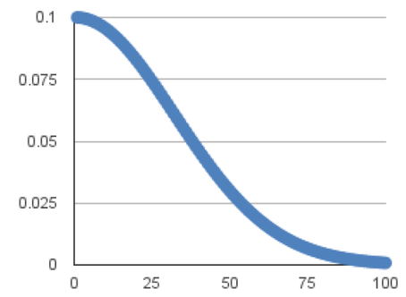

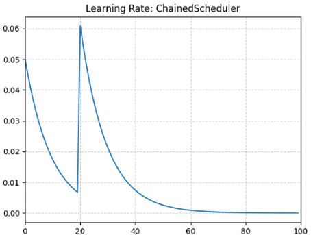

Drop-based schedule 의 예 —

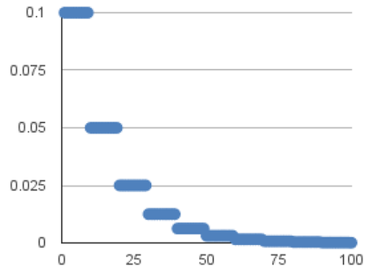

---

## 3.3.11 Approach 3 — Ensemble
<!-- 슬라이드 244 -->

**Ensemble** 은 다수의 sub model 의 결과를 취합하는 것이다. 각 모델이 저지르는 오류가 서로 다르면 평균했을 때 오류가 상쇄되어 generalization 이 좋아진다. 취합 방식에 따라 네 가지 기본형이 있다.

- **Bagging** : 원 데이터에서 bootstrap 으로 뽑은 서로 다른 데이터 샘플로 독립된 모델을 학습시키고 결과를 합친다.
- **Boosting** : 앞 모델이 틀린 데이터를 다음 모델이 집중해서 학습하도록 순차적으로 모델을 쌓는다. 딥러닝에서는 쉽지 않다.
- **Stacking + Meta learner** : 여러 모델의 출력을 입력으로 받는 meta learner 를 두어 최종 예측을 학습한다. 기본형이다.
- **Mixture of Experts** : 입력에 따라 어느 모델(expert)의 출력을 얼마나 반영할지 정하는 gating network 도 함께 학습한다.

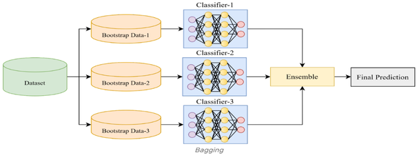

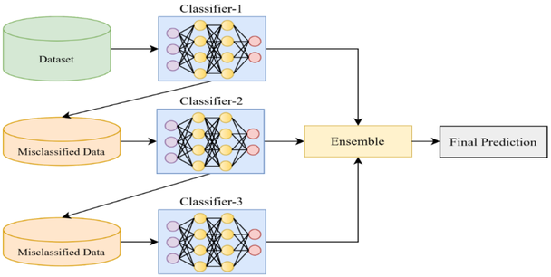

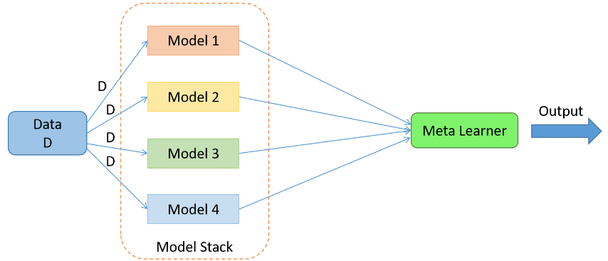

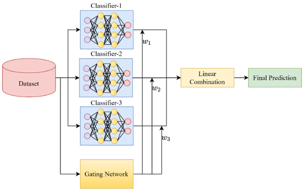

---

## 3.3.12 Approach 4 — DropOut 과 DropConnect
<!-- 슬라이드 245~246 -->

### DropOut, DropConnect, Stochastic Depth

**DropOut** 과 그것을 일반화한 **DropConnect(2013)** 는 모델의 capacity 를 제한하는 방법이다. DropOut 은 학습 중 매 step 마다 node 의 출력을 확률적으로 0 으로 만들고, DropConnect 는 node 가 아니라 **weight(연결)** 를 확률적으로 0 으로 만든다. 아래 그림에서 $m(\cdot)$ 은 masking function 이다. DropOut 은 출력 $r = m \ast a(Wv)$ 처럼 활성화 뒤에 mask 를 곱하고, DropConnect 는 $r = a((M \ast W)v)$ 처럼 weight 행렬에 mask 를 곱한다.

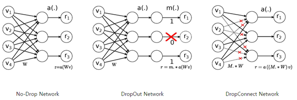

DropOut 은 모델 용량을 제한하여 신경망의 일반화 성능을 향상시킨다. 효과는 좋지만 매 step 다른 부분 network 를 학습시키는 셈이라 학습 속도가 느려진다.

**Stochastic depth** 는 node 나 weight 가 아니라 **layer 를 통째로 drop** 하는 것이다. Skip connection 을 갖는 대규모 다층 모델(ResNet 계열)에 적용한다 — skip connection 이 있어야 layer 를 건너뛰어도 신호가 흐르기 때문이다.

### DropOut 의 역할 — Ensemble network

DropOut 이 왜 효과가 있는지는 ensemble 로 설명된다. 학습 때는 확률적 행동으로 학습시키고, 예측 때는 확률적 결정값들을 평균하여 예측값을 구하는 것이 된다. 아래 그림처럼 base network 에서 node 를 끄는 모든 조합은 서로 다른 sub network 이고, DropOut 학습은 이 sub network 들을 번갈아 학습시키는 것이며, 추론 때 전체 network 를 쓰는 것은 그 sub network 들의 예측을 평균하는 것에 해당한다. 즉 **하나의 network 를 ensemble network 처럼 동작하게 한다.**

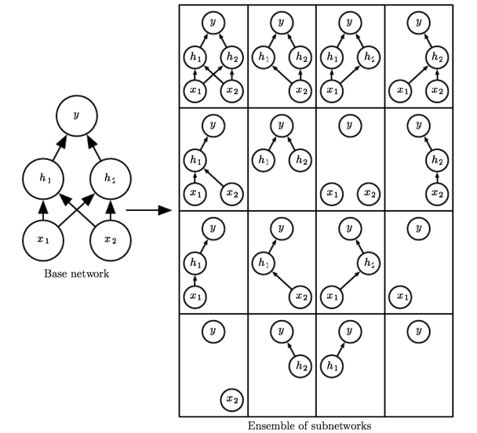

### Dropout 과 Batch normalization 의 적용 순서

DropOut 과 batch normalization 을 함께 쓸 때 층을 쌓는 순서는 다음과 같다.

| Convolution layer 사용 시 | Dense layer 사용 시 |
|---|---|
| Convolution layer | Dense layer |
| Batch normalization | Batch normalization |
| Activation | Activation |
| Dropout | Dropout |
| Maxpooling | |

### 실습 3.3.1 (계속) — Dropout
<!-- 슬라이드 245~246 -->

앞의 실습 노트북(`code/3.3.1.Optimization.ipynb`)에서 이어진다. 기본 모델의 ReLU 뒤에 `nn.Dropout(0.3)` 한 층을 넣는다. 위 표의 순서(Dense → Activation → Dropout)대로다. `0.3` 은 학습 중 각 node 를 끌 확률이다. `nn.Dropout` 은 `model.train()` 상태에서만 동작하고 `model.eval()` 에서는 아무것도 하지 않으므로, Lightning 이 validation 때 자동으로 eval 모드로 바꿔 주는 덕에 별도 처리가 필요 없다.

```python
class Model4(Wrap_10):
    def __init__(self):
        super(Model4, self).__init__()
        self.layers = nn.Sequential(
            nn.Flatten(),
            nn.Linear(28*28, 256),
            nn.ReLU(),
            nn.Dropout(0.3),
            nn.Linear(256, 10))

    def forward(self, x):
        x = self.layers(x)
        return x

model = Model4()

name = 'Dropout'
logger = CSVLogger("logs", name=name)
trainer = L.Trainer(max_epochs=50, logger=logger,enable_model_summary=False,
                    overfit_batches=overfit_batches)
trainer.fit(model, data_module)
```

학습 후 `metrics.csv` 를 읽어 기본 모델(`df`)과 겹쳐 그리는 코드는 L2 때와 같다(`label` 만 `Dropout_val_acc`, `Dropout_val_loss` 로 바꾼다). `overfit_batches` 로 데이터를 줄인 조건이므로 기본 모델은 training accuracy 가 1 에 가까워지면서 validation loss 가 올라가는데, Dropout 을 넣으면 그 상승이 완만해지는지를 곡선에서 확인한다.

---

## 3.3.13 Batch Normalization
<!-- 슬라이드 247~248 -->

### 왜 필요한가 — internal covariate shift

**Batch normalization** 은 학습 속도 향상을 위한 층이다. 배경에는 **내부 공변량 이동(internal covariate shift)** 문제가 있다.

- Mini-batch 단위로 학습하면 batch 마다 통계적 특성(평균, 분산)이 다르다.
- 그 결과 어느 층의 출력 분포가 batch 마다 흔들리고, 다음 층은 매번 달라진 입력 분포에 적응해야 한다.
- 층이 깊을수록 이 흔들림이 누적되어 부정적 영향을 주게 된다.
- 결과적으로 학습 속도가 둔화된다.


해결책은 **batch 단위로 node 의 출력값(활성화 전)을 normalize** 하는 것이다. 평균을 0 에 가깝게, 표준편차를 1 에 가깝게 맞춘다. 결과적으로 $W$ 가 만들어 내는 출력의 범위가 제한되어 안정적으로 학습되며, 학습 속도가 향상된다.

아래 그림은 batch 안의 여섯 샘플이 세 node 에서 낸 값으로부터 **node(열)마다** 평균과 표준편차를 구하는 모습이다. 같은 node 의 통계는 batch 안의 모든 training example 에 대해 동일하게 적용된다.

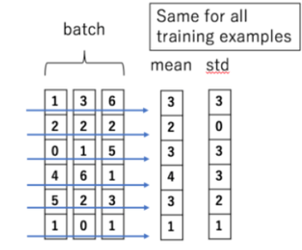


### Batch normalization 알고리즘

Batch 의 샘플 수를 $m$ 이라 할 때, 알고리즘은 세 단계다.

1. **Batch statistics 계산** : batch 단위에서 통계적 특성(평균, 분산)을 계산한다.
2. **Normalize layer inputs** : 활성함수에 들어가기 전의 값을 그 평균과 분산으로 normalization 하여 활성함수에 제공한다.
3. **Scaling & shifting** : 정규화된 출력에 scaling factor $\gamma$ 를 곱하고 shifting factor $\beta$ 를 더한다.

3 단계가 필요한 이유는 이렇다. 평균 0, 분산 1 로 맞춰 버리면 값이 활성함수의 원점 부근(sigmoid·tanh 라면 거의 선형인 구간)에 몰려 **비선형성이 감소**한다. 그래서 출력에 곱(scaling)과 합(shifting)을 더해 활성함수로 들어가는 값의 범위를 넓혀 주고, 활성함수의 비선형성을 활용할 수 있게 한다. $\gamma$ 와 $\beta$ 는 역전파 과정에서 학습되는 parameter 다(node 마다 parameter 가 추가된다).

**추론할 때는 평균, 분산 값을 어떻게 찾나?** 추론 시에는 batch 가 없거나 한 장일 수 있다. 그래서 학습 단계에서 본 batch 들의 평균과 분산을 평균한 값을 쓰거나, 학습 단계의 평균과 분산을 이동 평균한 값을 적용한다. PyTorch 의 `BatchNorm` 층이 `running_mean`, `running_var` 로 유지하는 것이 이 값이다.

주의사항으로, batch normalization 은 **batch size 의 영향을 받는다.** Batch 가 너무 작으면 그 안에서 구한 평균·분산이 전체 분포를 대표하지 못하므로, batch size 가 적당히 커야 한다. Parameter 수는 node 당 trainable 2개($\gamma, \beta$) + non-trainable 2개(running mean, running var) 다.

장점을 정리하면 — 빠르고 안정적이다.

- Gradient vanishing 을 해결하고, learning rate / decay rate 를 가속할 수 있다.
- 가중치 초기화의 영향이 감소한다.
- Drop out 을 제거해도 성능이 유지된다.

---

## 3.3.14 Layer / Instance / Unit normalization 과 그 밖의 정규화 층
<!-- 슬라이드 249~252 -->

### Layer normalization

**Layer normalization** 은 batch 축이 아니라 **동일한 층의 뉴런 출력**을 normalization 한다. 즉 하나의 sample 에 대해 그 층의 node 출력값들을 normalize 한다. 한 층의 node 출력을 $H = \{x_0, \dots, x_h\}$ ($h$ 는 node 수)라 하면 평균은 다음과 같다.

$$
\mu_H = \frac{1}{h} \sum_{i=1}^{h} x_i
$$

분산도 같은 집합에서 구하며, batch 안의 다른 sample 은 전혀 관여하지 않는다. 그래서

- mini-batch size 와 의존관계가 없다 — batch size 가 작은 경우에도 성능이 유지된다.
- 시퀀스 길이가 변하는 RNN, Transformer 에서 주로 사용된다.

아래 그림은 batch normalization 과 layer normalization 이 어느 축을 따라 통계를 내는지 비교한다. 앞 소절의 표(s247_03)가 열(node) 방향으로 mean/std 를 냈다면, layer normalization 은 행(sample) 방향으로 낸다.

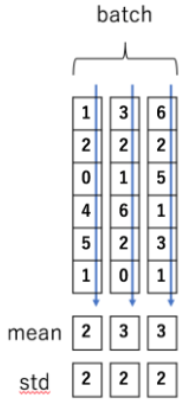

ConvNet(image)에서는 feature map 텐서가 (N, C, H, W) 이므로 세 가지가 구분된다. **Batch norm** 은 channel 하나를 고정하고 N, H, W 전체에서 통계를 내고, **layer norm** 은 sample 하나를 고정하고 C, H, W 전체에서 통계를 낸다. **Instance normalization** 은 sample 하나, channel 하나를 고정하고 H, W 에서만 통계를 낸다 — feature channel 별로 norm 하는 것이며 주로 style transfer 모델에서 쓰인다.

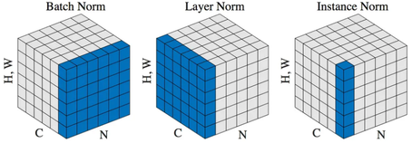

Dense net 에서 두 방법을 그림으로 그리면 아래와 같다. Batch normalization 은 node 마다 $(\gamma_i, \beta_i)$ 를 가지고, layer normalization 은 층 전체에 대해 $(\gamma, \beta)$ 를 가진다.

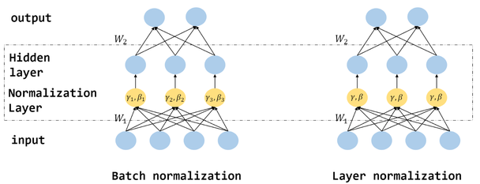

### RNN, Transformer 에서의 layer normalization

시퀀스 모델에서 layer normalization 을 어디에 두는지에 따라 세 가지로 부른다.

- **Input norm** : 시퀀스 입력의 scale 을 정규화한다.
- **Recurrent norm** : 순환 연결 안에서 정규화한다. 직접 구현해야 하고 느리다.
- **Output norm** : 시퀀스 출력의 분포를 정규화한다.

아래 그림은 (Batch, Sentence length, Feature) 텐서에서 layer normalization 과 batch/power normalization 이 잡는 통계 단위를 비교한 것이다. Layer normalization 은 한 token 의 feature 벡터를 단위로 하고, batch normalization 은 한 feature 를 고정하고 batch 와 문장 길이 전체를 단위로 한다. **Power normalization** 은 NLP 에서 BN 을 사용하기 위해 알고리즘을 수정한 것이다.

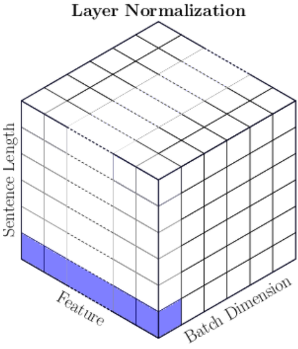

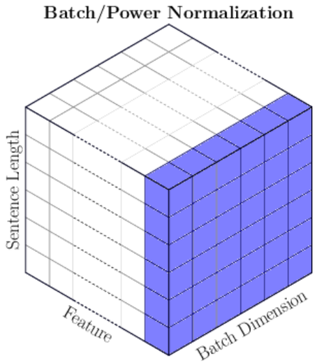

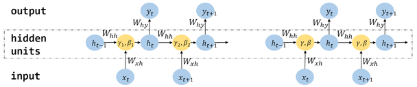

### Unit normalization

**Unit normalization** 은 각 sample 의 feature 를 normalization 하되, feature vector 의 **방향은 유지하고 크기만 normalize** 한다(보통 L2 norm 사용). 입력 벡터 $x$ 에 L2 norm 을 적용하여 L2 norm 이 1 인 unit vector $u$ 를 출력한다.

- Feature 의 크기 변화가 큰 dataset 에 유용하다.
- Sample 간의 상대적인 특징 비교를 용이하게 도와준다 — 모델이 특징의 크기보다 방향성, 패턴을 더 잘 인식하도록 한다.
- Residual connection 이 있는 구조에 효과적이다.

학습 경향으로는 학습 초기에 빠르게 수렴하고 안정성이 향상되며, 높은 학습 속도에서 overfitting 이 적다. 넣는 위치에 따라 효과가 다르다.

- Input layer : data scale 조정, 학습 안정화
- Hidden layer : feature vector 의 방향성에 집중
- Output layer : prediction 의 크기 무시, 분류 안정성 향상

### 그 밖의 normalization layer

| 종류 | 특징 | PyTorch |
|---|---|---|
| Weight norm | RNN / 강화 학습에서 효율적. 정규화보다 안정적 학습이 목적 | `nn.utils.weight_norm(nn.Linear(20, 40), name='weight')` |
| RMS norm | 평균을 계산하지 않고 RMS 값으로 나눔(연산 감소). 최신 LLM 에서 적용 | 구현체 없음. 코드에서 직접 계산 |
| Spectral norm | $\|W\|_2$ 정규화(Lipschitz 제어). GAN 등에서 안정성 향상 | `nn.utils.spectral_norm(nn.Conv2d(64, 128, 3, stride=2, padding=1))` |
| Group norm | CNN(grouped conv.)에서 channel group 단위 정규화. BN 과 LN 의 중간(소규모 batch 에서 효과적) | `nn.GroupNorm(num_groups=32, num_channels=C)` |

---

## 3.3.15 실습 3.3.1 (계속) — Normalization 기법 비교
<!-- 슬라이드 253 -->

> 노트북: `code/3.3.1.Optimization.ipynb`
> [](https://colab.research.google.com/github/AI-BoostCamp/intermediate-deep-learning-pytorch/blob/main/code/3.3.1.Optimization.ipynb)

**목적** — 같은 MLP 에 Batch normalization, Layer normalization, Unit normalization 을 각각 넣고, **batch size 를 512 와 4 로 바꿔** 가며 validation 곡선을 비교한다. Batch normalization 이 batch size 에 민감하다는 앞 소절의 설명을 눈으로 확인하는 것이 목적이다.

**조건 설정** — `batch_size` 를 바꾸면 `DataModule` 을 새로 만든다. `limit_train_batches` 로 학습 데이터 일부만 쓰게 하여 실행 시간을 줄인다.

```python
#### Batch_size 변경 ####
batch_size = 4 # 512
epochs = 20
limit_train_batches = 0.015 #0.15

data_module = MNISTDataModule(batch_size=batch_size)
```

**Batch normalization 모델** — `nn.Linear(784, 32)` 뒤, ReLU 앞에 `nn.BatchNorm1d(32)` 를 둔다(Dense → BN → Activation 순서). 학습 이력은 `history` 에 남긴다. 노트북 주석대로 training accuracy 도 함께 확인해 두면 뒤의 비교에 도움이 된다.

```python
class MLP_BN(Wrap_10):
    def __init__(self):
        super(MLP_BN, self).__init__()
        self.layers = nn.Sequential(
            nn.Flatten(),
            nn.Linear(28*28, 32),
            nn.BatchNorm1d(32),
            nn.ReLU(),
            nn.Linear(32, 10),)

    def forward(self, x):
        out = self.layers(x)
        return out

model = MLP_BN()
name="mlp"
logger = CSVLogger("logs", name=name)
trainer = L.Trainer(max_epochs=epochs, logger=logger,enable_model_summary=False,
                     limit_train_batches=limit_train_batches,limit_val_batches=0.25)
trainer.fit(model, data_module)

v_num = logger.version
history = pd.read_csv(f'./logs/{name}/version_{v_num}/metrics.csv')
```

**Layer normalization 모델** — 같은 자리에 `nn.LayerNorm(32)` 를 둔다. 인자 32 는 정규화할 마지막 차원의 크기, 즉 한 sample 의 node 수 $h$ 다.

```python
class MLP_LN(Wrap_10):
    def __init__(self):
        super(MLP_LN, self).__init__()
        self.layers = nn.Sequential(
            nn.Flatten(),
            nn.Linear(784, 32),
            nn.LayerNorm(32),
            nn.ReLU(),
            nn.Linear(32, 10),)

    def forward(self, x):
        out = self.layers(x)
        return out

model = MLP_LN()
name = "mlp_ln"
logger = CSVLogger("logs", name=name)
trainer = L.Trainer(max_epochs=epochs, logger=logger,enable_model_summary=False,
                     limit_train_batches=limit_train_batches,limit_val_batches=0.25)
trainer.fit(model, data_module)

mlp_ln_v_num = logger.version
history2 = pd.read_csv(f'logs/{name}/version_{mlp_ln_v_num}/metrics.csv')
```

**Unit normalization 모델** — PyTorch 에 층으로 준비된 것이 없으므로 `F.normalize(x, p=2, dim=1)` 을 감싼 작은 `nn.Module` 을 만든다. `dim=1` 은 (batch, feature) 텐서에서 feature 축, 즉 sample 하나의 벡터를 단위 길이로 만든다는 뜻이다. 이 층은 ReLU **뒤**에 둔다 — 활성화된 feature vector 의 방향만 남기는 것이다.

```python
# Unit Normalization Layer
class UnitNormLayer(nn.Module):
    def __init__(self, dim=1):
        super(UnitNormLayer, self).__init__()
        self.dim = dim
    def forward(self, x):
        return F.normalize(x, p=2, dim=self.dim)
```

```python
class MLP_UN(Wrap_10):
    def __init__(self):
        super(MLP_UN, self).__init__()
        self.layers = nn.Sequential(
            nn.Flatten(),
            nn.Linear(784, 32),
            nn.ReLU(),
            UnitNormLayer(),
            nn.Linear(32, 10),)

    def forward(self, x):
        out = self.layers(x)
        return out

mlp_un = MLP_UN()
logger = CSVLogger("logs", name="mlp_un")
trainer = L.Trainer(max_epochs=epochs, logger=logger,enable_model_summary=False,
                     limit_train_batches=limit_train_batches,limit_val_batches=0.25)
trainer.fit(mlp_un, data_module)

mlp_wn_v_num = logger.version
history3 = pd.read_csv(f'logs/mlp_un/version_{mlp_wn_v_num}/metrics.csv')
```

**세 곡선 비교** — 세 이력을 epoch 별 평균으로 묶어 accuracy 와 loss 를 겹쳐 그린다.

```python
df1 = history.drop('step', axis=1).groupby('epoch').mean()
df2 = history2.drop('step', axis=1).groupby('epoch').mean()
df3 = history3.drop('step', axis=1).groupby('epoch').mean()

fig = plt.figure(figsize = (10, 3))
plt.subplot(121)
plt.title(f'Batch size : {batch_size}')
plt.plot(df1['val_acc'], linestyle='--', label="BN_val_acc")
plt.plot(df2['val_acc'], linestyle='-', label="LN_val_acc")
plt.plot(df3['val_acc'], linestyle='-', label="UN_val_acc")
plt.legend()
plt.grid()

plt.subplot(122)
plt.title(f'Batch size : {batch_size}')
plt.plot(df1['val_loss'], linestyle='--', label="BN_val_loss")
plt.plot(df2['val_loss'], linestyle='-', label="LN_val_loss")
plt.plot(df3['val_loss'], linestyle='-', label="UN_val_loss")
plt.legend()
plt.grid()
plt.show()
```

**결과 읽기** — Batch size 512 에서는 BN 과 LN 의 곡선이 거의 겹치며 둘 다 빠르게 0.9 근처에 도달하고, UN 은 초반이 느리지만 따라잡는다. Loss 곡선에서도 BN 과 LN 은 거의 같고 UN 만 느리게 내려온다.

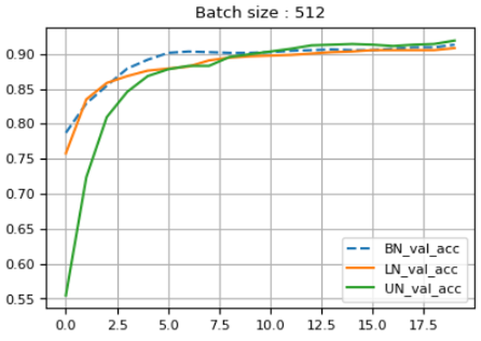

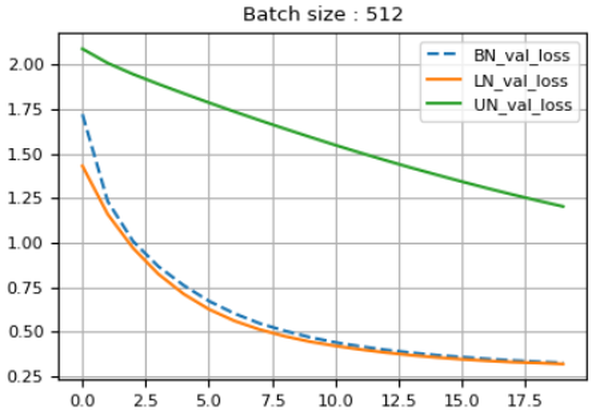

Batch size 4 로 줄이면 사정이 달라진다. BN 의 validation accuracy 가 세 모델 중 가장 낮게 머물고 loss 도 LN 보다 높다 — 네 장짜리 batch 로 구한 평균·분산이 분포를 대표하지 못하기 때문이다. LN 은 batch 와 무관하므로 영향을 받지 않고, UN 은 초반이 느리지만 결국 가장 높은 accuracy 에 이른다.

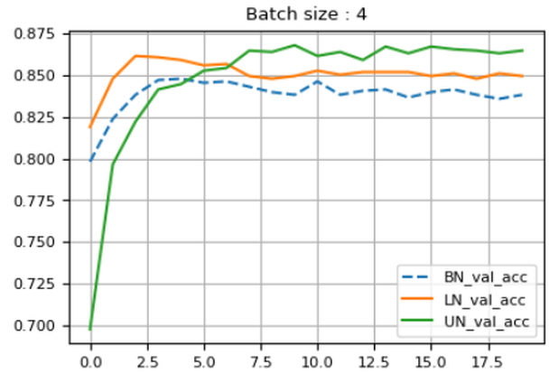

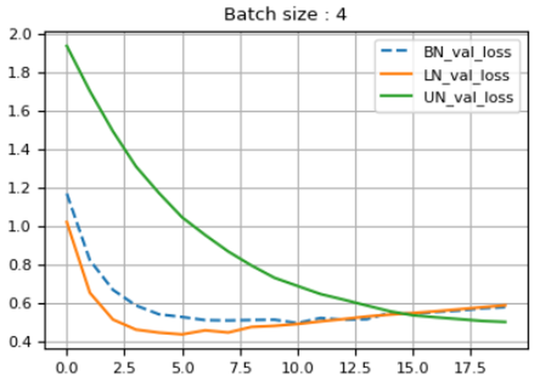

> **핵심 메시지**
> Batch normalization 은 batch 가 충분히 클 때 가장 무난하고, batch 가 작아지면 layer normalization 이 안전하다. Unit normalization 은 수렴은 느리지만 작은 batch 에서도 흔들리지 않는다.

---

## 3.3.16 Dataset 의 문제점 — label 품질과 supervision 의 경계
<!-- 슬라이드 254~255 -->

### DL 에서 일반적으로 발생하는 데이터 문제

알고리즘과 모델을 아무리 잘 골라도 데이터 자체에 문제가 있으면 최적화가 되지 않는다. 딥러닝에서 일반적으로 발생하는 데이터 문제는 두 가지다.

**1) Class 비대칭(imbalanced data)** — 다음 소절에서 다룬다.

**2) 데이터 품질 문제** — 세 갈래로 나뉜다.

**2.1 Label 품질 문제** : label 이 부적절하거나 불완전한 정보를 갖거나 포함하는 경우다.

- **Inexact supervision** : label 이 원하는 만큼 정확하지 않고 대략적인 수준으로 제공되는 경우. 이미지 전체에 "얼룩말" 이라는 label 만 있고 어느 부분이 얼룩말인지는 없는 식이다. → Weakly supervised learning, Multi-instance learning
- **Inaccurate supervision** : data, label 의 일부가 부정확한(낮은 오류) 경우.
- **Incorrect supervision** : label 의 일부가 부적절한(오류) 경우. → Label noise learning

**2.2 Data 의 일부만 labeling 된 경우** : **Incomplete supervision** — data 일부에만 (정확한) label 이 부여된 경우다. → Semi-supervised learning

**2.3 효율적인 labeling** : Active learning — 모델이 label 이 필요한 sample 을 고르고 전문가와 협업하여 labeling 한다.

아래 그림은 multi-instance learning 의 예다. 얼룩말·호랑이 사진에서 잘라낸 여러 조각(instance)이 "zebra bag", "tiger bag" 처럼 가방(bag) 단위로만 label 을 갖는다. 가방 안의 조각 중 어느 것이 얼룩말인지는 모르지만, 여러 가방을 비교하면 zebra-like concept(줄무늬 조각)을 학습할 수 있다. 얼룩말 무늬 손가방(handbag bag)이나 케이크(cake bag)도 같은 무늬 조각을 포함하는 것이 보인다.

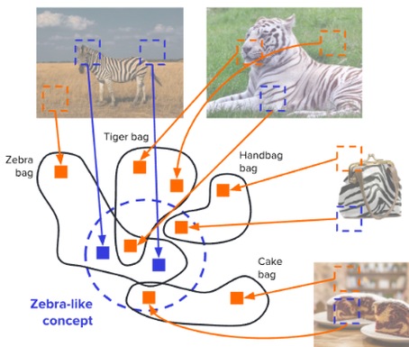

### Supervised / Unsupervised learning 의 경계

Label 의 상태에 따라 학습 방식의 이름이 달라진다. 경계가 뚜렷하지 않고 혼용·결합되는 경우가 많으므로 정리해 둔다.

- **Unsupervised** : label 이 없는 경우.
  - Clustering(dimension reduction), Association, Anomaly detection 등
  - Generative model : Autoencoder, GAN, Diffusion model 등
- **Weakly supervised** : label 이 온전하지 않은 경우.
  - Poor quality : label 이 부적절하거나 불완전하거나 부분적인 경우. Weakly supervised ⊃ Semi-supervised 로 보며, 혼용되거나 결합된 경우가 많다.
  - 높은 추상화 수준의 문제 해결을 위해 낮은 수준(낮은 수준으로 구조화된)의 label 을 사용하는 경우.
- **Semi-supervised** : 일부에만 label 이 부여된 경우. Unlabeled data 를 활용하여 성능을 향상시킨다. Pseudo-labelling, Generative methods.
- **Self-supervised** : 입력 데이터로부터 label(또는 유용한 정보)을 생성하여 학습한다.
  - Autoencoders : unsupervised 에도 포함된다.
  - Self-training : label 이 없는 데이터를 학습에 활용한다(semi-supervised 에 포함). 부족한 label 또는 참조할 만한 data 로 supervised learning 을 한 뒤, 모델이 예측한 결과에서 확률이 높은 데이터에 "pseudo label" 을 지정하여 학습에 참여시키고, 이를 반복 적용한다.
  - Contrastive learning : 유사성과 차이점을 비교함으로써 특징을 학습한다.
  - Predictive coding : 기억(model)에서 얻은 정보(predict)와 입력을 비교하여 model 을 학습한다. 뇌의 학습을 주변 환경에 대한 모형을 지속적으로 만들고 수정하는 과정으로 설명하는 이론에서 왔다.
  - Delayed reconstruction : data 재구성 과정에서 delay 를 도입하여 더 나은 특징을 학습하려는 전략.

---

## 3.3.17 Imbalanced data (class 비대칭 문제)
<!-- 슬라이드 256 -->

### 문제와 접근 방법

Class 별 data 분포가 불균형하면 model 이 분포가 적은 class 를 잘 표현하지 못한다. 다수 class 만 맞혀도 accuracy 가 높게 나오므로 model 은 소수 class 를 무시하는 쪽으로 학습된다. 접근 방법은 데이터 쪽과 loss 쪽, 평가 쪽으로 나뉜다.

**Resampling**

- Oversampling : 소수 class 에 대한 샘플을 복제하거나 생성한다.
- Undersampling : 다수 class 에서 일부를 제거한다(Tomek links, Neighborhood Cleaning Rule 등 적용).
- SMOTE(Synthetic Minority Over-sampling Technique) : 소수 sample 간 interpolation 을 통해 새 sample 을 생성한다.
- 다만 이런 resampling 은 DL 에 적용하기 어렵다. 이미지처럼 고차원 데이터에서는 interpolation 이 의미 있는 sample 을 만들지 못하기 때문이다. `pip install -U imbalanced-learn` 으로 설치하는 imbalanced-learn 라이브러리가 이 기법들을 제공한다.

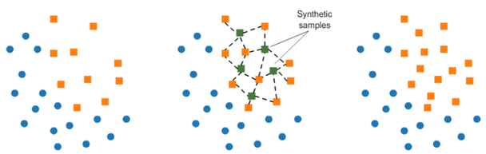


**데이터 쪽의 다른 방법**

- Data augmentation : 회전, 뒤집기, 확대/축소와 같은 변환을 적용하여 원본 sample 의 수정된 버전을 생성한다.
- Transfer learning : pre-trained model 을 시작점으로 imbalanced dataset 으로 fine tune 한다. 관련 작업의 사전 지식을 활용하기 때문에 잘 알려지지 않은 class 에서 model 의 성능을 향상시킬 수 있다.

**Loss 쪽의 방법**

- Weighted loss function : 소수 class 에 더 높은 가중치를 할당하여 소수 class 의 오류에 penalty 를 부여한다.
  - Weighted cross-entropy (balanced cross entropy) : 직관적이지만 적절한 가중치를 결정하기 어렵다.
  - Focal loss : 극단적 불균형에 적합하고 가중치를 자동 조정하지만 직관적이지 않다.
- Ensemble methods : data 의 서로 다른 subset 으로 여러 model 을 학습한 뒤 예측을 결합한다.
- Cost-sensitive learning : class 별로 다른 cost function 을 적용한다.

**평가 쪽의 방법**

- Evaluation metrics : F1-score, precision, recall, ROC-AUC, PR-AUC 등 적절한 평가 지표를 사용한다. Imbalanced dataset 에서는 accuracy 보다 많은 정보를 제공한다.
- Cross-validation 과 다양한 metric 을 통해 model 성능을 비교하여, 사용하는 전략의 유효성을 확인·검증해야 한다.

### 참고 실습 3.3.2.0 — WCE : Weighted cross-entropy 와 Focal loss
<!-- 슬라이드 256 -->

> 노트북: `code/3.3.2.0.WCE.ipynb`
> [](https://colab.research.google.com/github/AI-BoostCamp/intermediate-deep-learning-pytorch/blob/main/code/3.3.2.0.WCE.ipynb)

**목적** — MNIST 를 일부러 불균형하게 만든 뒤, 보통의 cross entropy(CE), F1 loss, weighted cross entropy(WCE), focal loss 로 각각 학습시켜 **숫자별 accuracy** 를 비교한다.

**Imbalanced dataset 준비** — 학습 데이터를 numpy 로 꺼내 숫자별로 나누면서, 0~4 는 절반만, 5~9 는 10% 만 남긴다. `prob >= 0.5` 또는 `prob >= 0.10` 이면 버리고(`pass`) 나머지만 `mnist_sub` 에 넣는 구조다. 그 결과 0~4 가 다수 class, 5~9 가 소수 class 가 된다.

```python
mnist_x = np.array([np.array(x[0]) for x in mnist_full])
mnist_y = np.array([np.array(x[1]) for x in mnist_full])

## 숫자별로 재배치
mnist_sub = [[],[],[],[],[],[],[],[],[],[]]
for x,y in zip(mnist_x,mnist_y):
  prob = np.random.random(1)
  if (y < 5 and prob >= 0.5) or (y >= 5 and prob >= 0.10):
    pass
  else :
    mnist_sub[y].append(x)

mnist2 = []
for i,imgs in enumerate(mnist_sub):
  for j in range(len(imgs)):
    mnist2.append((mnist_sub[i][j], np.array(i)))
```

```python
class CustomDataset(Dataset):
    def __init__(self, x):
        self.x = x
    def __len__(self):
        return len(self.x)
    def __getitem__(self, index: int):
        img,label = self.x[index]
        img = img.reshape(1,28,28)
        return img,label

mnist2_dataset = CustomDataset(mnist2)

train_n = len(mnist2_dataset)
split_n = int(0.3*train_n)
mnist_train, mnist_val = utils.data.random_split(mnist2_dataset, [train_n-split_n, split_n])

train_loader = DataLoader(mnist_train, batch_size=64)
val_loader = DataLoader(mnist_val, batch_size=64)
```

**Base model (normal CE)** — 보통의 `F.cross_entropy` 로 학습한 뒤, 균형 잡힌 test set 으로 숫자별 accuracy 를 구한다. 마지막 두 줄의 `np.mean(acc), np.std(acc)` 가 핵심 지표다 — 평균 accuracy 가 높아도 class 간 표준편차가 크면 소수 class 를 못 맞히고 있는 것이다.

```python
acc_num = [[],[],[],[],[],[],[],[],[],[]]
for x,y in test_loader:
  pred = model(x)
  pred_y = torch.argmax(pred,axis=1)
  for i, y1 in enumerate(y):
    acc_num[y1].append((pred_y[i]==y1))

acc_mean = 0
acc = []
for i,l in enumerate(acc_num):
  acc.append(sum(l)/len(l))
  print(f"{i}: acc({acc[-1]:.4f})")
  acc_mean += acc[-1]*(len(l)/len(mnist_test))
print("acc_mean:",acc_mean)

print(np.mean(acc),np.std(acc))
```

**Weighted CE loss 적용** — class 별 sample 수의 역수를 가중치로 쓴다. `nn.CrossEntropyLoss` 는 `weight` 인자로 class 별 가중치 텐서를 받으므로, loss 함수만 바꾸면 된다. Sample 수가 적은 class 일수록 `tot_num / count` 가 커져 그 class 의 오류가 loss 에 더 크게 반영된다.

```python
tot_num_l = []
for i in mnist_sub:
  tot_num_l.append(len(i))
tot_num = sum(tot_num_l)

class_weights = [(tot_num / count) for count in tot_num_l]
class_weights_tensor = torch.tensor(class_weights, dtype=torch.float32)

loss_func = nn.CrossEntropyLoss(class_weights_tensor).to(device)
```

```python
class Model6(pl.LightningModule):
    def __init__(self):
        super(Model6, self).__init__()
        self.layers = nn.Sequential(
            nn.Flatten(),
            nn.Linear(28*28, 128),
            nn.ReLU(),
            nn.Linear(128, 10))

    def forward(self, x):
        x = self.layers(x)
        return x

    def training_step(self, batch, batch_idx):
        x, y = batch
        y_pred = self(x)
        loss = loss_func(y_pred, y)
        acc = FM.accuracy(y_pred, y, task="multiclass",num_classes=10)
        metrics={'loss':loss, 'acc':acc}
        self.log_dict(metrics, prog_bar=True)
        return loss

    def validation_step(self, batch, batch_idx):
        x, y = batch
        y_pred = self(x)
        loss = loss_func(y_pred, y)
        acc = FM.accuracy(y_pred, y, task="multiclass",num_classes=10)
        metrics={'val_loss':loss, 'val_acc':acc}
        self.log_dict(metrics, prog_bar=True)

    def configure_optimizers(self):
        return torch.optim.Adam(self.parameters(), lr=0.001)

model = Model6()
name = 'Weighted CE'
logger = pl.loggers.CSVLogger("logs", name=name)
trainer = pl.Trainer(max_epochs=50, logger=logger,limit_train_batches=0.3,limit_val_batches=0.3)
trainer.fit(model, train_loader, val_loader)
```

**Focal loss** — cross entropy 에 $(1 - p_t)^\gamma$ 를 곱한다. $p_t$ 는 정답 class 의 예측 확률이므로, 이미 잘 맞히는(쉬운) sample 은 $(1-p_t)$ 가 작아 loss 기여가 줄고, 잘 못 맞히는(어려운) sample 의 loss 가 상대적으로 커진다. `gamma` 가 클수록 이 효과가 강하다. Class 가중치 `weight` 는 WCE 와 같은 역수 가중치를 합이 1 이 되게 정규화해 넣는다.

```python
# 클래스별 반비례 weight 계산
alphaWeights = [(tot_num / count) for count in tot_num_l]
# 정규화: 총합이 1이 되도록
alphaWeights = [alpha / sum(alphaWeights) for alpha in alphaWeights]
alphaWeights_tensor = torch.FloatTensor(alphaWeights)

class FocalLoss(nn.modules.loss._WeightedLoss):
    def __init__(self, weight=None, gamma=2, reduction='mean'):
        super(FocalLoss, self).__init__(weight, reduction=reduction)
        self.gamma = gamma
        self.weight = weight  # alpha weights for class imbalance

    def forward(self, input, target):
        # Cross-entropy loss with weights
        ce_loss = F.cross_entropy(input, target, reduction=self.reduction, weight=self.weight)
        pt = torch.exp(-ce_loss)  # Probabilities for true classes
        focal_loss = ((1 - pt) ** self.gamma * ce_loss).mean()
        return focal_loss

loss_func = FocalLoss(weight=alphaWeights_tensor, gamma=0.7).to(device)
```

모델 클래스는 WCE 때와 같고 `loss_func` 만 바뀐다. 네 가지 loss 의 validation 곡선을 겹쳐 그린 뒤, 각각 test set 에서 숫자별 accuracy 의 평균과 표준편차를 비교한다. 노트북에 기록된 한 실행 결과는 다음과 같다(평균, 표준편차 순).

| Loss | 숫자별 accuracy 평균 | 표준편차 |
|---|---|---|
| CE | 0.899 | 0.074 |
| F1 | 0.884 | 0.082 |
| WCE | 0.905 | 0.059 |
| Focal loss | 0.901 | 0.060 |

WCE 와 focal loss 가 평균을 조금 올리면서 class 간 표준편차를 줄인다 — 소수 class 의 accuracy 가 올라왔다는 뜻이다. 다만 난수로 만든 dataset 이므로 실행마다 수치는 달라진다.

---

## 3.3.18 Not enough data — semi-supervised learning
<!-- 슬라이드 257~258 -->

### Labeled data 가 부족할 때의 기본 전략

Labeled dataset 이 부족한 것은 딥러닝의 일반적인 과제다. 기본 전략은 네 가지다.

- **Pre-training + fine tuning** : 강력한 model 을 사전 학습한 뒤, 적은 sample 세트로 미세 조정한다.
- **Semi-supervised learning** : label 이 있는 sample 과 없는 sample 을 함께 학습한다.
- **Active learning** : 가장 가치 있는 unlabeled sample 을 선택하는 방법을 학습하여 labeling 비용과 시간을 절감한다.
- **Pre-training + dataset auto-generation** : 사전 학습된 model 로 unlabeled sample 에 labeling 한다.

### Semi-supervised learning — Pseudo labeling

가장 단순한 semi-supervised 방법이 **pseudo labeling** 이다.

1. 현재 model 이 예측한 확률을 기반으로 unlabeled sample 에 pseudo label 을 할당한다.
2. Pseudo label 된 sample 을 포함하여 model 을 학습한다.
3. 이것을 반복한다. Teacher model 로 pseudo label 을 생성하고 student model 로 학습하는 식으로 진행한다.

아래 두 그림은 MNIST 에서 labeled data 600 장만으로 학습한 model 의 출력(왼쪽)과, 거기에 unlabeled data 60,000 장을 pseudo label 하여 함께 학습한 model 의 출력(오른쪽)을 t-SNE 로 그린 것이다. 오른쪽에서 숫자별 군집이 훨씬 또렷하게 분리된다.

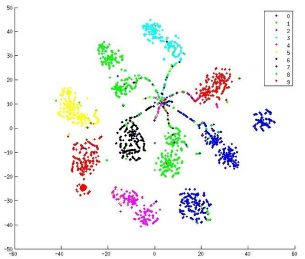


(논문 : "Pseudo-Label : The Simple and Efficient Semi-Supervised Learning Method for Deep Neural Networks" ; 정리 자료 : `https://lilianweng.github.io/posts/2021-12-05-semi-supervised/`)

### Label propagation 과 Self-training

- **Label propagation** ("Label Propagation for Deep Semi-supervised Learning") : feature embedding 을 기반으로 sample 간의 유사성 그래프를 구성하고, labeled sample 에서 유사성이 있는 unlabeled sample 로 pseudo label 을 '확산' 시킨다. k-NN 분류기와 유사하다.
- **Self-training** ("Self-training with Noisy Student improves ImageNet classification") : labeled data 로 model 을 학습하고, 그 model 로 unlabeled data 의 label 을 예측한 뒤 그 중 가장 신뢰할 수 있는 label 을 확정한다. 모든 data 에 labeling 이 끝날 때까지 반복한다.

아래 그림은 label propagation 의 두 단계다. Phase 1 에서 labeled example 만으로 network 를 $T$ epoch 학습하고, phase 2 에서 feature extractor 로 descriptor 를 뽑아 유사도 행렬을 만들고 label 을 확산시켜 pseudo label(확신도에 비례한 크기)을 붙인 뒤 전체 data 로 1 epoch 학습하는 것을 $T'$ 번 반복한다.


---

## 3.3.19 그 밖의 최적화·학습 전략
<!-- 슬라이드 259~260 -->

### 최적화를 위한 그 밖의 전략들

다양한 시도가 있다.

- **Curriculum learning** : 쉬운 문제부터 어려운 문제로, 의미 있는 순서로 training 시킨다. 초기 overfitting 을 방지한다.
- **Self-paced learning (SPL)** : model 이 "현재 단계에서" 학습하기 쉬운 sample 을 스스로 선택한다. Curriculum learning 이 외부에서 난이도를 정의한다면, SPL 은 내부 학습 진행도에 따라 자동으로 조절한다.
- **Sharpness-Aware Minimization (SAM)** : loss 가 평탄한 영역(flat minima)으로 수렴하도록 유도한다. Parameter 의 미세한 변화에 민감하지 않은 지점을 선택하여 일반화를 향상시킨다.
- **Gradient noise** : gradient 계산 값에 적절한 noise 를 추가하여 overfitting 을 감소시키고 최적화를 개선한다.
- **Noise robustness** : hidden unit 에 noise 를 추가하거나(drop out 과 같이), weight 에 noise 를 추가하거나, dataset 의 label 에 noise 를 추가한다(label smoothing).

### 참고 실습 3.3.2.0 — Self-Paced Learning
<!-- 슬라이드 259 -->

> 노트북: `code/3.3.2.0.Self-Paced Learning.ipynb`
> [](https://colab.research.google.com/github/AI-BoostCamp/intermediate-deep-learning-pytorch/blob/main/code/3.3.2.0.Self-Paced%20Learning.ipynb)

**목적** — FashionMNIST 를 CNN 으로 학습하되, 매 epoch 마다 "지금 model 이 쉽게 맞히는 sample" 만 골라 가중치를 주는 self-paced learning 을 구현해 본다. 학습이 진행될수록 허용 난이도 $\lambda$ 를 키워 어려운 sample 까지 점차 받아들인다.

**핵심 : sample 별 가중치** — `LitSPL` 의 `training_step` 이 SPL 의 전부다. `reduction='none'` 으로 sample 별 cross entropy `ce_each` 를 구하고, 현재 epoch 의 $\lambda$ 와 비교해 가중치 $w$ 를 정한다.

- `hard` 모드 : $\mathrm{CE} \le \lambda$ 인 sample 만 1, 나머지는 0 (이진 선택).
- `soft` 모드 : $w = 1 - \mathrm{CE}/\lambda$ 를 0~1 로 자른다 (연속 가중). CE 가 작을수록 가중치가 크다.

선택된 sample 이 너무 적으면 학습이 멈추므로, `min_keep_ratio` 만큼은 CE 가 작은 순으로 강제로 남긴다. 최종 loss 는 가중 평균 `(w * ce_each).sum() / w.sum()` 이다. $\lambda$ 는 `lambda_start * (1 + grow_rate * epoch)` 로 epoch 마다 선형으로 커진다.

```python
class LitSPL(pl.LightningModule):
    def __init__(self, lr=2e-3, weight_decay=1e-4, lambda_start=0.8,
                 grow_rate=0.25, mode="soft", min_keep_ratio=0.05):
        super().__init__()
        self.save_hyperparameters()
        self.model = BaseCNN()
        self.lr = lr
        self.weight_decay = weight_decay
        self.lambda_start = lambda_start
        self.grow_rate = grow_rate
        self.mode = mode
        self.min_keep_ratio = min_keep_ratio

    def _lambda_at(self, epoch_idx):
        return self.lambda_start * (1.0 + self.grow_rate * epoch_idx)

    def configure_optimizers(self):
        return torch.optim.AdamW(self.parameters(), lr=self.lr, weight_decay=self.weight_decay)

    def training_step(self, batch, batch_idx):
        x, y, idx, diff = batch
        logits = self.model(x)
        ce_each = F.cross_entropy(logits, y, reduction='none')  # (B,)
        pred = logits.argmax(dim=1)
        acc = (pred == y).float().mean()

        # 현재 epoch의 λ
        lam = self._lambda_at(self.current_epoch)

        # Self-Paced weight
        if self.mode == "hard":
            w = (ce_each.detach() <= lam).float()
        else:
            w = (1.0 - ce_each.detach() / lam).clamp(min=0.0, max=1.0)

        # 최소 유지 비율
        if w.sum() < self.min_keep_ratio * w.numel():
            k = max(1, int(self.min_keep_ratio * w.numel()))
            topk_idx = torch.topk(-ce_each, k=k).indices  # 작은 CE 상위 k (=-loss)
            w[topk_idx] = 1.0

        # 가중 손실
        weighted_loss = (w * ce_each).sum() / (w.sum() + 1e-8)
        ce_mean = ce_each.mean()

        self.log_dict(
            {"train_acc":acc, "train_spl": weighted_loss, "train_ce": ce_mean, "train_keep": w.mean()},
            on_step=False, on_epoch=True, prog_bar=True
        )
        return weighted_loss

    def validation_step(self, batch, batch_idx):
        x, y, idx, diff = batch
        logits = self.model(x)
        loss = F.cross_entropy(logits, y)
        pred = logits.argmax(dim=1)
        acc = (pred == y).float().mean()
        self.log_dict({"val_loss": loss, "val_acc": acc}, on_step=False, on_epoch=True, prog_bar=True)
        return {"val_loss": loss.detach(), "val_acc": acc.detach()}
```

노트북에는 이 밖에 sample 의 난이도를 미리 추정해 dataset 에 주입하는 `DifficultyEstimator`(얕은 CNN 을 1 epoch 만 학습시켜 sample 별 CE 를 재는 `warmup_ce`, 이미지 histogram 엔트로피를 쓰는 `entropy`, 둘을 가중합하는 `hybrid`)와, `(img, target, idx, difficulty)` 를 돌려주는 `IndexedFashionMNIST` 가 들어 있다. 학습 후에는 epoch 별 keep ratio, $\lambda$, validation accuracy, 그리고 평균 CE 와 SPL 가중 loss 의 차이를 그려 SPL 이 초반에 sample 을 얼마나 걸러 냈고 후반에 얼마나 받아들였는지 본다.

```python
model = LitSPL(
    lr=2e-3,
    weight_decay=1e-4,
    lambda_start=0.8,   # 초기 허용 난이도(CE 기준)
    grow_rate=0.25,     # epoch별 증가율
    mode="soft",        # 'soft' 또는 'hard'
    min_keep_ratio=0.05 # 최소 유지 비율
)

trainer = pl.Trainer(
    max_epochs=10,
    enable_progress_bar=True,
    log_every_n_steps=10,
)
trainer.fit(model, datamodule=dm)
```

### 그 밖의 학습 전략 — Multi-task, Multi-source

**Multi-task learning** 은 출력 task 가 여럿인 경우다. 하나의 model 이 여러 task 의 결과를 동시에 학습한다.

- 여러 장비의 정보(task)를 하나의 model 에서 학습한다.
- 하나의 model 에서 출력 head 를 분리한다 — 장비 1 상태(정상/비정상), 장비 3 품질 예측, 장비 3 온도 예측 등.
- 공통된 표현(특징)을 학습하므로 일반화가 향상되고 데이터 효율이 좋아진다.
- 다만 서로 다른 분포(source, domain)의 데이터를 한꺼번에 학습하면 task 간 상충(interference)으로 학습이 어려워진다.

**Multi-source(multimodal) learning / Domain adaptation** 은 특성이 다른 source(task)의 데이터를 다루는 경우다.

- 특성이 다른 source 의 데이터를 한꺼번에 모아서 학습하면 어렵다. 하나의 장비에서 성격이 전혀 다른 data 가 수집된다면 묶어서 학습하기 어렵고, 장비별 sensor data 통합 등이 그 예다.
- 그래서 source 별(장비별, lot 별)로 학습시키고 결과를 종합하여 전체 성능을 향상시킨다. 다양한 장비별, lot 별로 model 을 수립하는 것이며, 특히 개별 source 의 data 가 적을 때 유용하다.
- 이것이 **domain-specific model ensemble** 이다.

---

## 3.3.20 정리
<!-- 슬라이드 218~260 -->

이 절은 "광의의 최적화" 의 결정 항목을 순서대로 훑었다.

- **초기화** — 층의 노드 수에 맞춰 분포의 폭을 정한다. ReLU 계열에는 He initialization 이 기본이다.
- **Hyper parameter 탐색** — grid / random search 에서 Bayesian optimization, 진화 전략으로 자동화되지만, gradient 를 쓸 수 있는 문제에서는 gradient 기반이 여전히 강하다.
- **최적화 알고리즘** — SGD 의 문제(local minima, saddle point, poor conditioning, gradient noise)를 momentum → NAG → Adagrad → RMSprop → Adam 이 차례로 고쳤다. Adam 이 기본 추천이고, AdamW 는 weight decay 를 learning rate 로부터 분리했으며, Lion 과 Adafactor 는 메모리를 줄인다.
- **Regularization 네 접근** — more data(augmentation), right capacity(architecture, early stopping, weight decay, LR schedule), ensemble, DropOut/BatchNorm.
- **Weight decay** — L1 은 weight 를 정확히 0 으로 만들어 feature 를 선택하고, L2 는 큰 weight 를 줄여 모든 feature 를 쓰게 한다. 일반적으로 L2 를 선호하며 `weight_decay` 인자로 적용한다.
- **Normalization** — BatchNorm 은 batch 축, LayerNorm 은 층 축, InstanceNorm 은 channel 축, UnitNorm 은 벡터 크기를 정규화한다. Batch 가 작으면 LayerNorm 이 안전하다는 것을 실습 3.3.1 로 확인했다.
- **데이터 문제** — imbalanced data 에는 weighted CE / focal loss (참고 실습 3.3.2.0 WCE), label 부족에는 pseudo labeling 등 semi-supervised 방법, 학습 순서에는 curriculum / self-paced learning (참고 실습 3.3.2.0 Self-Paced Learning)이 있다.

**참고 노트북** — `code/3.3.2.0.WCE.ipynb` 에는 본문에서 다루지 않은 F1 loss(`F1Loss` 클래스)도 들어 있고, `code/3.3.1.Optimization.ipynb` 의 뒷부분에는 TensorBoard 로 층별 활성 분포와 gradient norm 을 기록하는 Lightning callback(`TBActGradCallback`) 예제가 있다. 슬라이드 범위 밖이므로 관심 있는 독자만 열어 보면 된다.
