# 3.4 실습 : CNN model handling

**학습 목표**

- 기본 CNN 에 Dropout 층과 Batch normalization 층을 넣은 모델을 만들고, 세 모델을 같은 조건으로 학습시켜 학습 곡선을 비교할 수 있다.
- Conv layer 의 weight 를 꺼내 필터를 n×n 격자로 그리고, 4차원 weight 텐서의 어느 축을 보고 있는지 설명할 수 있다.
- 학습된 모델의 층을 잘라 중간 feature map 을 출력하는 모델을 만들고, 입력 영상이 층을 지나며 어떻게 바뀌는지 시각화할 수 있다.
- torchvision 의 pre-trained VGG16 을 읽어 구조를 살펴보고, 전처리한 영상의 conv block 별 feature map 을 추출해 representation 의 의미를 살펴볼 수 있다.

**이 절의 구성**

- 3.4.1 실습 3.4.1 — Modern CNN : regularization 층에 따른 학습 비교
- 3.4.2 실습 3.4.2 — CNN Feature map 시각화
- 3.4.3 실습 3.4.3 — Pre-trained VGG model Feature Maps
- 3.4.4 실습과제

---

## 3.4.1 실습 3.4.1 — Modern CNN
<!-- 슬라이드 262 -->

> 노트북: `code/3.4.1.CNN_Tuning.ipynb`
> [](https://colab.research.google.com/github/AI-BoostCamp/intermediate-deep-learning-pytorch/blob/main/code/3.4.1.CNN_Tuning.ipynb)

**목적** — CNN 기본 모델을 살펴보고, regularization 기법을 적용했을 때 성능이 어떻게 달라지는지 검토한다.

**실습 개요**

- CNN 기본 모델을 만든다.
- 같은 골격에 Dropout layer 를 추가한 모델을 만든다.
- 같은 골격에 Batch normalization layer 를 추가한 모델을 만든다.
- 세 모델의 학습 결과를 비교 검토한다. 결과를 보고 문제점을 검토하고, 데이터와 모델의 특성에 따라 어떤 튜닝 접근이 맞는지(layer 구성, hyper parameter, batch size 등에 따른 차이)를 검토한다.

이 실습에서 다루는 층을 한 블록 안에 쌓을 때의 순서는 정해져 있다. 세 모델 모두 이 순서를 따르므로, 코드를 읽을 때 각 층이 어디에 끼어드는지 이 순서와 대조해 보면 된다.

> **핵심 메시지 — Layer 적용 순서**
> Convolution / Dense layer → Batch normalization → Activation → Dropout → (Maxpooling)

즉 Batch normalization 은 conv 의 선형 출력 바로 뒤, 활성화 함수 앞에 두고, Dropout 은 활성화 뒤에 둔다. Maxpooling 은 블록의 맨 마지막이며 괄호를 친 것은 블록에 따라 없을 수도 있다는 뜻이다.

### 모델 정의 : 기본 CNN
<!-- 슬라이드 263~264 -->

기본 CNN 모델의 구성은 (Conv + MaxPooling) × 3 + Flatten + Linear(relu) + Linear 이다. 3×3 conv 와 2×2 max pooling 을 세 번 반복해 28×28 입력을 3×3 까지 줄인 뒤, 펼쳐서 두 개의 Linear 층으로 10 개 class 의 logit 을 낸다.

모델은 `Wrap_10` 을 상속한다. `Wrap_10` 은 학습 step·검증 step·optimizer 를 정의한 `LightningModule` 로, 세 모델이 똑같은 학습 절차를 공유하도록 뽑아 둔 것이다(학습 절차에서 설명한다). 모델 클래스는 `__init__` 에서 층을 `nn.Sequential` 로 쌓고 `forward` 에서 그대로 통과시키기만 한다.

```python
class CNN(Wrap_10):
    def __init__(self):
        super(CNN, self).__init__()
        self.layers = nn.Sequential(
            nn.Conv2d(1, 64, 3, padding=1),
            nn.ReLU(),
            nn.MaxPool2d(2, 2),

            nn.Conv2d(64, 128, 3, padding=1),
            nn.ReLU(),
            nn.MaxPool2d(2, 2),

            nn.Conv2d(128, 256, 3, padding=1),
            nn.ReLU(),
            nn.MaxPool2d(2, 2),

            nn.Flatten(),
            nn.Linear(256*3*3, 1000),
            nn.Linear(1000, 10))

    def forward(self, x):
        out = self.layers(x)
        return out

cnn = CNN()
summary(cnn, input_size=(8, 1, 28, 28))
```

`padding=1` 을 준 3×3 conv 는 공간 크기를 바꾸지 않고 채널 수만 1 → 64 → 128 → 256 으로 늘린다. 공간 크기를 줄이는 것은 `MaxPool2d(2, 2)` 이며 28 → 14 → 7 → 3 으로 절반씩 줄어든다(7 을 2 로 나눈 몫이 3 이므로 마지막은 3×3 이 된다). 그래서 Flatten 뒤의 길이가 `256*3*3 = 2304` 이고, 첫 Linear 층의 입력 크기를 이 값으로 맞춰야 한다. `summary()` 에 batch 8 짜리 입력 크기를 넘기면 층별 출력 shape 과 파라미터 수를 다음과 같이 확인할 수 있다.

| Layer | Output shape | Param # |
|---|---|---|
| Conv2d(1 → 64, 3×3) | [8, 64, 28, 28] | 640 |
| ReLU | [8, 64, 28, 28] | — |
| MaxPool2d(2, 2) | [8, 64, 14, 14] | — |
| Conv2d(64 → 128, 3×3) | [8, 128, 14, 14] | 73,856 |
| ReLU | [8, 128, 14, 14] | — |
| MaxPool2d(2, 2) | [8, 128, 7, 7] | — |
| Conv2d(128 → 256, 3×3) | [8, 256, 7, 7] | 295,168 |
| ReLU | [8, 256, 7, 7] | — |
| MaxPool2d(2, 2) | [8, 256, 3, 3] | — |
| Flatten | [8, 2304] | — |
| Linear(2304 → 1000) | [8, 1000] | 2,305,000 |
| Linear(1000 → 10) | [8, 10] | 10,010 |
| **Total params** | | **2,684,674** |

파라미터 수를 보면 conv 층 세 개를 합쳐도 37 만 개 남짓인데 `Linear(2304, 1000)` 하나가 230 만 개다. 전체 파라미터의 대부분이 Flatten 직후의 Linear 층에 몰려 있다는 점은 뒤의 실습과제에서 Dense(1000) 을 Dense(256) 으로 바꾸거나 없애 보라는 힌트와 이어진다.

같은 모델을 계산 그래프로 그리면 입력 8×1×28×28 이 Conv → Relu → MaxPool 을 세 번 지나 Flatten 되고, 두 개의 Gemm(행렬곱, Linear 층)을 거쳐 8×10 이 되는 흐름이 한눈에 보인다. 각 Conv 노드에는 weight W 와 bias B 의 크기가 적혀 있는데, W 의 shape 이 (out_ch, in_ch, 3, 3) 이라는 점은 뒤의 filter 시각화에서 다시 쓴다.

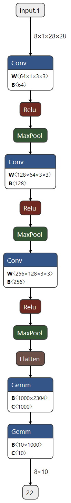

### Dropout 을 넣은 모델
<!-- 슬라이드 265 -->

Dropout 모델의 구성은 (Conv + DO + MaxPooling) × 3 + Flatten + Linear(relu) + Linear 이다. 기본 모델의 각 블록에서 활성화 뒤, pooling 앞에 `nn.Dropout(0.2)` 을 끼워 넣은 것이 전부다. 앞의 layer 적용 순서에서 Activation → Dropout → (Maxpooling) 에 해당한다.

```python
class CNN_DO(Wrap_10):
    def __init__(self):
        super(CNN_DO, self).__init__()
        self.layers = nn.Sequential(
            nn.Conv2d(1, 64, 3, padding=1),
            nn.ReLU(),
            nn.Dropout(0.2),
            nn.MaxPool2d(2, 2),

            nn.Conv2d(64, 128, 3, padding=1),
            nn.ReLU(),
            nn.Dropout(0.2),
            nn.MaxPool2d(2, 2),

            nn.Conv2d(128, 256, 3, padding=1),
            nn.ReLU(),
            nn.Dropout(0.2),
            nn.MaxPool2d(2, 2),

            nn.Flatten(),
            nn.Linear(256*3*3, 1000),
            nn.Linear(1000, 10))

    def forward(self, x):
        out = self.layers(x)
        return out

model_DO = CNN_DO()
summary(model_DO, input_size=(8, 1, 28, 28))
```

Dropout 은 학습 중에만 출력의 20% 를 무작위로 0 으로 만들고, 추론 때는 아무 일도 하지 않는다. 학습해야 할 파라미터가 없으므로 `summary()` 의 출력 shape 과 총 파라미터 수(2,684,674)는 기본 모델과 똑같다. 즉 모델의 용량은 그대로 두고 학습 방식만 바꾼 셈이다.

### Batch normalization 을 넣은 모델
<!-- 슬라이드 266 -->

Batch normalization 모델의 구성은 (Conv + BN + ReLU + DO + MaxPooling) × 3 + Flatten + Linear(relu) + Linear 이다. Dropout 모델에 다시 `nn.BatchNorm2d` 를 conv 바로 뒤, ReLU 앞에 넣었다. 이 블록이 앞의 layer 적용 순서를 다섯 단계 모두 채운 형태다.

```python
class CNN_BN(Wrap_10):
    def __init__(self):
        super(CNN_BN, self).__init__()
        self.layers = nn.Sequential(
            nn.Conv2d(1, 64, 3, padding=1),
            nn.BatchNorm2d(64),
            nn.ReLU(),
            nn.Dropout(0.2),
            nn.MaxPool2d(2, 2),

            nn.Conv2d(64, 128, 3, padding=1),
            nn.BatchNorm2d(128),
            nn.ReLU(),
            nn.Dropout(0.2),
            nn.MaxPool2d(2, 2),

            nn.Conv2d(128, 256, 3, padding=1),
            nn.BatchNorm2d(256),
            nn.ReLU(),
            nn.Dropout(0.2),
            nn.MaxPool2d(2, 2),

            nn.Flatten(),
            nn.Linear(256*3*3, 1000),
            nn.Linear(1000, 10))

    def forward(self, x):
        out = self.layers(x)
        return out

model_BN = CNN_BN()
summary(model_BN, input_size=(8, 1, 28, 28))
```

`BatchNorm2d(C)` 의 인자는 채널 수이며, 채널마다 scale 과 shift 두 개의 학습 파라미터를 가진다. 그래서 `summary()` 에는 BatchNorm2d 행마다 128, 256, 512 개의 파라미터가 더해져 총 파라미터 수가 2,685,570 개가 된다. 파라미터가 늘어난 양은 미미하지만, 각 conv 출력을 batch 단위로 정규화한 뒤 활성화에 넘기므로 학습이 진행되는 양상은 앞의 두 모델과 뚜렷이 달라진다.

### 세 모델을 같은 조건으로 학습
<!-- 슬라이드 267 -->

세 모델을 같은 조건으로 학습시킨다. 데이터셋은 FashionMNIST 다. 변환은 `v2.ToImage()` 로 PIL 이미지를 텐서로 바꾸고 `v2.ToDtype(torch.float32, scale=True)` 로 0\~1 범위의 실수로 만드는 두 단계뿐이다. batch size 는 512 이고, 검증에는 test 셋을 그대로 쓴다.

```python
from torchvision.datasets import FashionMNIST, MNIST, CIFAR10
from torch.utils.data import DataLoader, Subset

transform = v2.Compose([
    v2.ToImage(),
    v2.ToDtype(torch.float32, scale=True) ] )

batch_size=512

## Fashion MNIST
download_root = './F-MNIST'
train_dataset = FashionMNIST(download_root, transform=transform, train=True, download=True)
test_dataset = FashionMNIST(download_root, transform=transform, train=False, download=True)

D_name = "Fashion MNIST"

trainDataLoader = DataLoader(train_dataset, batch_size=batch_size, shuffle=True, num_workers=4)
valDataLoader = DataLoader(test_dataset, batch_size=batch_size, shuffle=False, num_workers=4)
```

노트북에는 같은 자리에 MNIST 와 CIFAR10 을 읽는 코드가 주석으로 남아 있어, `download_root` 와 데이터셋 클래스, 그림 제목에 쓸 `D_name` 만 바꾸면 데이터셋을 갈아 끼울 수 있다. 단 CIFAR10 은 3 채널 32×32 이므로 첫 conv 의 입력 채널과 Flatten 뒤의 크기를 함께 고쳐야 한다(실습과제 참고).

학습 절차는 세 모델이 상속한 `Wrap_10` 에 들어 있다. `training_step` 은 batch 를 받아 모델을 통과시키고 cross entropy 손실과 정확도를 계산해 `log_dict` 로 기록한 뒤 손실을 돌려준다. `validation_step` 도 같은 계산을 하되 `val_loss`, `val_acc` 라는 이름으로 기록한다. `on_step=False, on_epoch=True` 이므로 기록은 epoch 단위로 모아지고, optimizer 는 학습률 0.001 의 Adam 이다.

```python
class Wrap_10(L.LightningModule):
    def training_step(self, batch, batch_idx):
        x, y = batch
        y_pred = self(x)
        loss = F.cross_entropy(y_pred, y)
        acc = FM.accuracy(y_pred, y, task="multiclass",num_classes=10)
        metrics={'loss':loss, 'acc':acc}
        self.log_dict(metrics,prog_bar=True,on_step=False,on_epoch=True)
        return loss

    def validation_step(self, batch, batch_idx):
        x, y = batch
        y_pred = self(x)
        loss = F.cross_entropy(y_pred, y)
        acc = FM.accuracy(y_pred, y, task="multiclass",num_classes=10)
        metrics={'val_loss':loss, 'val_acc':acc}
        self.log_dict(metrics,prog_bar=True,on_step=False,on_epoch=True)

    def configure_optimizers(self):
        return torch.optim.Adam(self.parameters(), lr=0.001)
```

모델의 출력은 softmax 를 거치지 않은 logit 이다. `F.cross_entropy` 가 내부에서 log-softmax 를 적용하므로 모델 끝에 softmax 를 두지 않는 것이 맞다.

학습은 `Trainer` 로 돌린다. 세 모델의 코드는 모델 이름과 logger 이름만 다르고 나머지는 같다. `CSVLogger` 는 `logs/<name>/version_<k>/metrics.csv` 에 epoch 별 지표를 남기며, 나중에 파일을 찾으려면 `logger.version` 을 변수에 보관해 둔다. `limit_train_batches=0.20, limit_val_batches=0.2` 는 매 epoch 에 전체 batch 의 20% 만 쓰라는 뜻으로, 30 epoch 을 빠르게 돌려 세 모델을 비교하기 위한 설정이다.

```python
epochs=30

cnn = CNN()
logger = CSVLogger("logs", name="cnn_basic")
trainer = Trainer(max_epochs=epochs, logger=logger,enable_model_summary=False,
                     limit_train_batches=0.20,limit_val_batches=0.2)
trainer.fit(cnn, trainDataLoader, val_dataloaders=valDataLoader)
cnn_v_num = logger.version

model_DO = CNN_DO()
logger = CSVLogger("logs", name="cnn_drop_out")
trainer = Trainer(max_epochs=epochs, logger=logger,enable_model_summary=False,
                     limit_train_batches=0.20,limit_val_batches=0.2)
trainer.fit(model_DO, trainDataLoader, val_dataloaders=valDataLoader)
model_DO_v_num = logger.version

model_BN = CNN_BN()
logger = CSVLogger("logs", name="cnn_batchnorm")
trainer = Trainer(max_epochs=epochs, logger=logger,enable_model_summary=False,
                     limit_train_batches=0.20,limit_val_batches=0.2)
trainer.fit(model_BN, trainDataLoader, val_dataloaders=valDataLoader)
model_BN_v_num = logger.version
```

학습이 끝나면 세 개의 `metrics.csv` 를 읽어 학습 곡선을 그린다. CSV 에는 step 단위 행과 epoch 단위 행이 섞여 있으므로 `step` 열을 버리고 `groupby('epoch').last()` 로 epoch 마다 마지막 행만 남긴다. 왼쪽 그림은 검증 정확도, 오른쪽은 검증 손실이며 손실은 `semilogy()` 로 로그 눈금을 써서 작은 차이를 보이게 한다. 제목에는 세 모델의 최고 검증 정확도를 함께 적는다.

```python
history1 = pd.read_csv(f'./logs/cnn_basic/version_{cnn_v_num}/metrics.csv')
history2 = pd.read_csv(f'./logs/cnn_drop_out/version_{model_DO_v_num}/metrics.csv')
history3 = pd.read_csv(f'./logs/cnn_batchnorm/version_{model_BN_v_num}/metrics.csv')

h1 = history1.drop('step', axis=1).groupby('epoch').last()
h2 = history2.drop('step', axis=1).groupby('epoch').last()
h3 = history3.drop('step', axis=1).groupby('epoch').last()

max_1 = h1['val_acc'].max()
max_2 = h2['val_acc'].max()
max_3 = h3['val_acc'].max()

plt.figure(figsize=(12,3))
title = D_name
plt.subplot(121)
plt.title(f"{title}\nMax Val_Acc(CNN / DO / BN)\n{max_1:.4f} / {max_2:.4f} / {max_3:.4f}")
plt.plot(h1['val_acc'], label='val_acc1')
plt.plot(h2['val_acc'], label='val_acc2')
plt.plot(h3['val_acc'], label='val_acc3')
plt.ylim(0.6, )
plt.legend()
plt.grid()

plt.subplot(122)
plt.title("Loss")
plt.plot(h1['val_loss'], label='val_loss1')
plt.plot(h2['val_loss'], label='val_loss2')
plt.plot(h3['val_loss'], label='val_loss3')
plt.semilogy()
plt.legend()
plt.grid()
plt.show()
```

주석 처리된 `h1['acc']` 줄들을 살리면 학습 정확도·학습 손실이 점선으로 함께 그려져, 학습 곡선과 검증 곡선이 벌어지는 정도를 볼 수 있다.

### 학습 결과 비교
<!-- 슬라이드 268 -->

다음은 FashionMNIST 와 CIFAR10 에서 세 모델을 학습시킨 결과다. 위 그림이 정확도, 아래 그림이 손실이고, 점선(t)이 학습, 실선(v)이 검증 곡선이다.

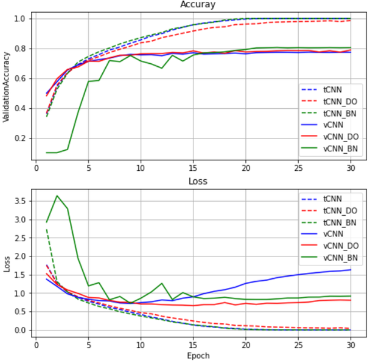

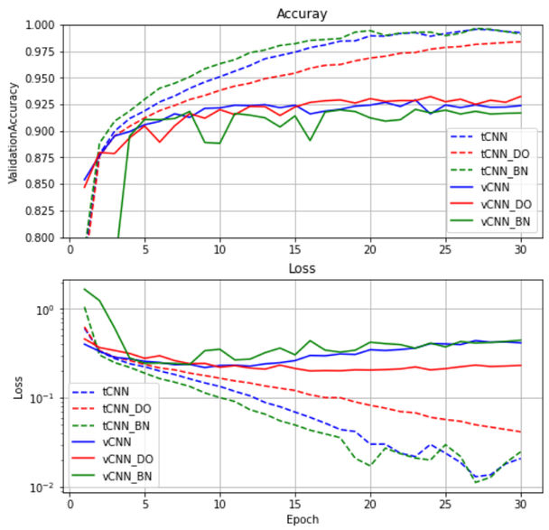

결과를 읽을 때는 다음을 본다.

- **학습 곡선과 검증 곡선의 간격.** 학습 정확도는 계속 오르는데 검증 정확도가 일찍 멈추고, 검증 손실이 어느 epoch 부터 다시 올라간다면 과적합이다. 이 간격이 세 모델 사이에서 어떻게 다른지가 regularization 의 효과다.
- **초반의 상승 속도.** Batch normalization 을 넣은 모델이 초기 epoch 에서 어떤 속도로 올라오는지를 다른 두 모델과 비교한다.
- **데이터셋에 따른 차이.** 같은 세 모델이라도 FashionMNIST 와 CIFAR10 에서 곡선의 모양이 다르다. 문제가 어려울수록 규제 없는 기본 모델의 과적합이 두드러진다.

결과를 보고 문제점을 찾았으면, 그 특성에 맞는 튜닝 접근을 검토한다. 층 구성(conv block 을 더 쌓을지, Dense 층을 줄일지), hyper parameter(학습률, dropout 비율, epoch 수), batch size 를 바꿔 가며 곡선이 어떻게 달라지는지 보는 것이 실습과제의 내용이다.

---

## 3.4.2 실습 3.4.2 — CNN Feature map 시각화
<!-- 슬라이드 270 -->

> 노트북: `code/3.4.2.FeatureMap.ipynb`
> [](https://colab.research.google.com/github/AI-BoostCamp/intermediate-deep-learning-pytorch/blob/main/code/3.4.2.FeatureMap.ipynb)

**목적** — CNN 모델의 특정 layer 의 feature map 과 conv filter 를 시각화해 본다.

**실습 개요**

- 간단한 CNN 모델을 만들고 MNIST 로 학습시킨다. 각 conv layer 의 `filters=64`, 즉 층마다 64 개의 feature map 이 만들어진다.
- 특정 layer 의 conv filter 를 추출해 plot 하여 상태를 확인한다.
- Feature map 을 출력으로 하는 모델을 만들고, MNIST 입력으로 feature map 을 추출한다.
- 추출한 feature 를 plot 한다.

실습이 끝나면 다음 두 종류의 그림을 얻는다. 왼쪽은 숫자 7 을 넣었을 때 첫 conv layer 가 만든 64 장의 feature map 이고, 오른쪽은 그 layer 가 가진 64 개의 3×3 filter 다. 같은 층을 "무엇을 내보내는가"와 "무엇을 곱하는가"의 두 시각으로 보는 셈이다.

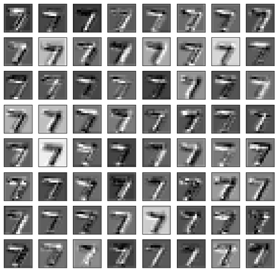

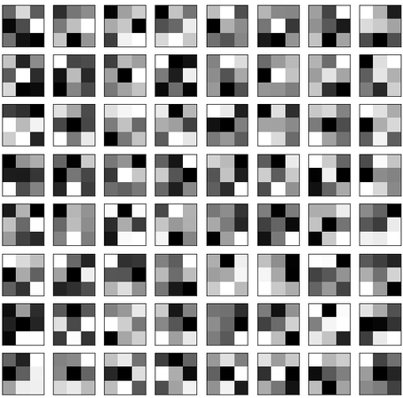

노트북의 `ps()`, `pst()`, `p()` 는 첫 셀에 정의된 헬퍼로, 각각 텐서의 shape, shape 과 type, shape·type·값을 출력한다. 아래 코드에서 그대로 쓴다.

### CNN 모델 정의와 학습
<!-- 슬라이드 271 -->

데이터셋은 MNIST 이고 변환은 앞 실습과 같다. batch size 는 1024 다.

```python
from torchvision.datasets import FashionMNIST, MNIST

transform = v2.Compose([
    v2.ToImage(),
    v2.ToDtype(torch.float32, scale=True) ] )

epochs=10
batch_size=1024

download_root = './MNIST'
train_dataset = MNIST(download_root, transform=transform, train=True, download=True)
test_dataset = MNIST(download_root, transform=transform, train=False, download=True)

trainDataLoader = DataLoader(train_dataset, batch_size=batch_size, shuffle=True, num_workers=4)
valDataLoader = DataLoader(test_dataset, batch_size=batch_size, shuffle=False, num_workers=4)
```

모델 `CNN_BN2` 는 (Conv + BN + ReLU + MaxPooling) 블록 세 개에 Linear 두 개를 붙인 것이다. 앞 실습과 달리 세 conv layer 의 출력 채널을 모두 64 로 맞췄다. 그래야 층마다 64 개의 feature map 이 나오고, filter 를 그릴 때도 8×8 격자 하나로 한 층을 다 볼 수 있다. 첫 conv 에 `bias=False` 를 준 것은 바로 뒤에 BatchNorm 이 오면 conv 의 bias 가 정규화 과정에서 상쇄되어 의미가 없기 때문이다. 학습 절차 `Wrap_10` 은 앞 실습과 같다.

```python
class CNN_BN2(Wrap_10):
    def __init__(self):
        super(CNN_BN2, self).__init__()
        self.layers = nn.Sequential(
            nn.Conv2d(1, 64, 3, padding=1,bias=False),
            nn.BatchNorm2d(64),
            nn.ReLU(),
            nn.MaxPool2d(2, 2),

            nn.Conv2d(64, 64, 3, padding=1),
            nn.BatchNorm2d(64),
            nn.ReLU(),
            nn.MaxPool2d(2, 2),

            nn.Conv2d(64, 64, 3, padding=1),
            nn.BatchNorm2d(64),
            nn.ReLU(),
            nn.MaxPool2d(2, 2),

            nn.Flatten(),
            nn.Linear(64*3*3, 256),
            nn.Linear(256, 10))

    def forward(self, x):
        out = self.layers(x)
        return out

model= CNN_BN2()
summary(model, input_size=(8, 1, 28, 28))
```

`summary()` 로 확인한 층별 출력 shape 은 다음과 같다. `nn.Sequential` 안의 인덱스(0\~14)를 함께 적어 두었는데, 뒤에서 filter 와 feature map 을 꺼낼 때 이 인덱스로 층을 지목한다.

| index | Layer | Output shape |
|---|---|---|
| 0 | Conv2d(1 → 64) | [8, 64, 28, 28] |
| 1 | BatchNorm2d(64) | [8, 64, 28, 28] |
| 2 | ReLU | [8, 64, 28, 28] |
| 3 | MaxPool2d | [8, 64, 14, 14] |
| 4 | Conv2d(64 → 64) | [8, 64, 14, 14] |
| 5 | BatchNorm2d(64) | [8, 64, 14, 14] |
| 6 | ReLU | [8, 64, 14, 14] |
| 7 | MaxPool2d | [8, 64, 7, 7] |
| 8 | Conv2d(64 → 64) | [8, 64, 7, 7] |
| 9 | BatchNorm2d(64) | [8, 64, 7, 7] |
| 10 | ReLU | [8, 64, 7, 7] |
| 11 | MaxPool2d | [8, 64, 3, 3] |
| 12 | Flatten | [8, 576] |
| 13 | Linear(576 → 256) | [8, 256] |
| 14 | Linear(256 → 10) | [8, 10] |

학습 조건은 optimizer Adam, 손실 CrossEntropyLoss, batch_size=1024, epochs=10 이다(노트북은 `epochs = 5` 로 줄여 두었다). 이 실습의 목적은 높은 정확도가 아니라 학습된 filter 와 feature map 을 관찰하는 것이므로 몇 epoch 이면 충분하다.

```python
model = CNN_BN2()
epochs = 5
name = "cnn_batchnorm2"
logger = CSVLogger("logs", name=name)
trainer = Trainer(max_epochs=epochs, logger=logger,enable_model_summary=False)
trainer.fit(model, trainDataLoader, val_dataloaders=valDataLoader)
```

### Conv layer 의 filter 추출
<!-- 슬라이드 272 -->

학습된 conv layer 의 filter 는 그 층의 weight 다. `nn.Sequential` 은 인덱스로 층에 접근할 수 있으므로 `model.layers[n].weight` 로 n 번째 층의 weight 를 꺼낸다. 같은 값에 닿는 방법은 여러 가지가 있다.

```python
## weight에 접근하여 shape을 보는 방법 ##
ps(model.layers[0].weight)
ps(model.layers[0].get_parameter('weight'))
ps(model.layers[0].state_dict()['weight'])
ps(model.layers[0].__getattr__('weight'))

## layer에 얻어내는 정보들 ##
ps(model.layers[0].weight)
print(model.layers[0].__class__)
print(model.layers[0].__class__.__name__)
```

첫 conv layer 의 weight shape 은 `torch.Size([64, 1, 3, 3])` 이고 클래스는 `torch.nn.modules.conv.Conv2d` 다. Conv2d 의 weight 는 항상 [out_ch, in_ch, filter_h, filter_w] 순서다. 첫 층은 입력이 흑백 1 채널이므로 in_ch 가 1 이고, 3×3 filter 가 출력 채널 수만큼 64 개 있다.

모델의 모든 층을 돌면서 conv layer 만 골라 weight 를 모으면 세 층의 filter 를 한 번에 얻는다. 층의 클래스 이름 문자열에 `'Conv'` 가 들어 있는지로 conv 인지 판별하고, bias 는 빼고 weight 만 리스트에 담는다.

```python
# summarize filter shapes
filter_list = []
filter_name = []
for i, layer in enumerate(model.layers):
    # check for convolutional layer
    if 'Conv' not in str(layer.__class__):
        continue #'conv'가 포함되지 않으면 skip
    # get filter weights
    filters = layer.weight # bias는 뺴고
    filter_list.append(filters)
    filter_name.append(f'[{i}]:{layer.__class__.__name__}')
    print(f'[{i}]th layer:{layer.__class__.__name__}  {filters.shape}')
```

출력은 다음과 같다. conv layer 는 `layers` 의 0, 4, 8 번에 있고, filter 크기는 각각 다음과 같다.

- conv_1 (`layers[0]`): [64, 1, 3, 3] — [out_ch, in_ch, filter_h, filter_w]
- conv_2 (`layers[4]`): [64, 64, 3, 3]
- conv_3 (`layers[8]`): [64, 64, 3, 3]

### Filter plotting
<!-- 슬라이드 273~274 -->

n×n 격자로 그림을 그리는 함수 `square()` 를 만든다. 입력 `imgs` 는 (장수, 높이, 너비) 모양의 numpy 배열이고, 앞에서부터 n×n 장을 꺼내 그린다. 그리기 전에 전체의 min, max 를 출력하고, 그 값으로 0\~1 로 normalize 한다. 타일마다 따로 정규화하지 않고 전체를 한 번에 정규화하므로 타일 사이의 밝기 차이가 그대로 보존된다. 각 subplot 은 눈금을 지우고 회색조로 그린다.

```python
# plot n x n images
def square(imgs, n):
    img_num = n
    plt.figure(figsize=(6,6))
    print(f'min[{np.min(imgs):2.2f}],max[{np.max(imgs):2.2f}]')
    f_min, f_max = imgs.min(), imgs.max() #(3,3,64,64)
    imgs = (imgs - f_min) / (f_max - f_min)
    for i in range(n):
        for j in range(n):
            p_num = i*n + j
            ax = plt.subplot(n, n, p_num+1)#(row,col,index)
            ax.set_xticks([])
            ax.set_yticks([])
            # plot filter channel in grayscale
            plt.imshow(imgs[p_num, :, :], cmap='gray')
    plt.show()
```

첫 번째 conv layer 의 filter 를 그려 보자. weight 는 (64, 1, 3, 3) 이므로 첫 번째(유일한) 입력 채널을 보는 `filters[:,0,:,:]` 를 취하면 (64, 3, 3), 즉 3×3 filter 64 장이 되고 이것을 8×8 로 그린다. 텐서는 GPU 에 있고 gradient 추적이 붙어 있으므로 `.cpu().detach().numpy()` 로 numpy 배열로 바꿔 넘긴다.

```python
filter_no = 0
filters = filter_list[filter_no]
print(filter_name[filter_no])
print(filters[:,0,:,:].shape)   #(out_ch,in_cn,3,3)
square(filters[:,0,:,:].cpu().detach().numpy(), 8)
```

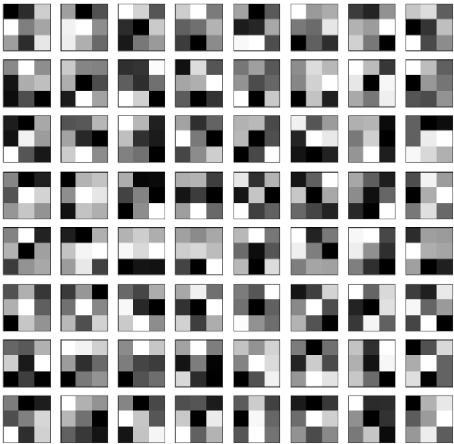

**어디를 보고 있는걸까?** 두 번째, 세 번째 conv layer 의 weight 는 (64, 64, 3, 3) 이므로 64×64 = 4,096 개의 3×3 filter 가 있다. 8×8 격자에는 64 장밖에 못 그리므로 어느 축을 고정하고 어느 축을 펼칠지 정해야 한다. 아래 그림이 이 4 차원 텐서를 보는 두 가지 방법을 나타낸다. 왼쪽은 in_ch 하나를 고정하고 64 개 out_ch 의 filter 를 늘어놓은 것, 오른쪽은 out_ch 하나를 고정하고 그 node 가 64 개 입력 채널 각각에 적용하는 filter 를 늘어놓은 것이다.

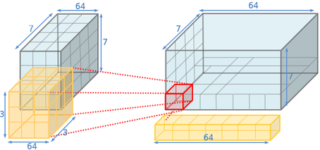

`filters[:,0,:,:]` 는 입력 채널 0 번에 적용되는 64 개 node 의 filter 이고, `filters[0,:,:,:]` 는 출력 채널 0 번 node 가 64 개 입력 채널 각각에 적용하는 filter 다. 두 경우 모두 shape 은 (64, 3, 3) 으로 같지만 뜻이 다르다. 예를 들어 첫 번째 방식으로 그린 격자의 8 번 타일은 in_ch 0 번, out_ch 8 번에 해당하는 3×3 filter 이고, 두 번째 방식의 7 번 타일은 out_ch 0 번 node 가 in_ch 7 번에 적용하는 filter 다.

```python
filter_no = 1
filters = filter_list[filter_no]
print(filter_name[filter_no])
print(filters[:,0,:,:].shape)   #(out_ch,in_cn,3,3)
square(filters[:,0,:,:].cpu().detach().numpy(), 8)

filter_no = 2
filters = filter_list[filter_no]
print(filter_name[filter_no])
print(filters[0,:,:,:].shape)   #(out_ch,in_cn,3,3)
square(filters[0,:,:,:].cpu().detach().numpy(), 8)
```

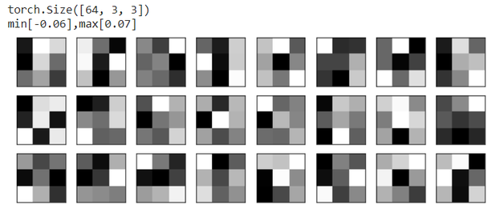

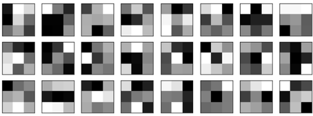

`square()` 가 출력하는 min, max 를 보면 첫 층의 filter 값 범위와 깊은 층의 값 범위가 다르다는 것도 알 수 있다. 정규화를 거쳐 그리므로 그림의 대비는 비슷해 보이지만 실제 weight 의 크기는 층마다 다르다.

### Feature map 을 추출하는 모델
<!-- 슬라이드 275~276 -->

Feature map 은 입력이 층을 지나며 만들어지는 중간 출력이다. 이것을 보려면 학습시킨 모델을 상속하거나 감싸서, 입력은 그대로 두고 출력을 "보고 싶은 feature" 로 바꾼 새 모델을 만든다. 새 모델에 입력을 넣으면 출력으로 feature 가 나온다. 이때 기존 모델의 학습된 파라미터까지 그대로 가져와야 한다 — PyTorch 에서는 학습된 `model.layers` 를 새 모듈의 속성으로 넘겨주면 같은 파라미터를 공유하므로 따로 복사할 필요가 없다.

어디를 잘라 출력할지 정하려면 conv layer 의 위치를 알아야 한다. 앞의 filter 추출 때와 같은 반복문으로 conv layer 의 인덱스를 확인한다.

```python
# conv layer 위치 확인
for i, layer in enumerate(model.layers):
    # check for convolutional layer
    if 'Conv' not in str(layer.__class__):
        continue #'conv'가 포함되지 않으면 skip
    # get filter weights
    filters = layer.weight
    print(f'[{i}]th layer:{layer.__class__.__name__}  {filters.shape}')
```

```text
[0]th layer:Conv2d  torch.Size([64, 1, 3, 3])
[4]th layer:Conv2d  torch.Size([64, 64, 3, 3])
[8]th layer:Conv2d  torch.Size([64, 64, 3, 3])
```

Conv layer 는 0, 4, 8 번에 있다. 출력으로 삼을 feature 는 세 군데다. `layers[0]` 의 출력(첫 conv 의 결과, 28×28), `layers[:5]` 의 출력(첫 블록을 다 지나 두 번째 conv 까지, 14×14), `layers[:11]` 의 출력(세 번째 블록의 ReLU 까지, 7×7). `nn.Sequential` 은 슬라이스가 되므로 `self.layers[:5](x)` 처럼 앞부분만 잘라서 호출할 수 있다.

```python
class CNN_BN2_FM(nn.Module):
    def __init__(self,model):
        super(CNN_BN2_FM, self).__init__()
        self.layers = model.layers

    def forward(self, x):
        out1 = self.layers[0](x)
        out2 = self.layers[:5](x)
        out3 = self.layers[:11](x) ## ReLU 까지
        return out1, out2, out3

model_FM = CNN_BN2_FM(model)
summary(model_FM, input_size=(8, 1, 28, 28))
```

이 모델은 학습하지 않고 추론에만 쓰므로 `Wrap_10` 이 아니라 `nn.Module` 을 상속했다. `forward` 가 세 개의 텐서를 tuple 로 돌려주는 것이 보통의 분류 모델과 다른 점이다.

`summary()` 의 출력을 보면 같은 층이 여러 번 나타나고 파라미터 수 자리에 `(recursive)` 라고 적힌 행이 보인다. `forward` 가 `layers[0]`, `layers[:5]`, `layers[:11]` 을 각각 따로 호출하므로 첫 conv 는 세 번, 첫 블록은 두 번 실행되는데, torchinfo 는 이미 센 파라미터를 다시 세지 않고 `(recursive)` 로 표시한다. 모델을 그냥 출력(`model_FM`)하면 `summary` 와 달리 `layers` 에 담긴 15 개 층 전체가 한 번씩 나열된다 — `summary` 는 실행 경로를, 출력은 보유한 모듈을 보여 주기 때문이다.

```python
model_FM ## summary와 다르게 model 전체 다 있음
```

계산 그래프로 그리면 입력이 세 갈래로 나뉘어 각각 다른 깊이에서 끝나는 구조가 드러난다. 첫 갈래는 Conv 하나를 지나 8×64×28×28 을 내고, 둘째 갈래는 Conv → Relu → MaxPool → Conv 를 지나 8×64×14×14 를, 셋째 갈래는 세 번째 Conv 까지 지나 8×64×7×7 을 낸다.

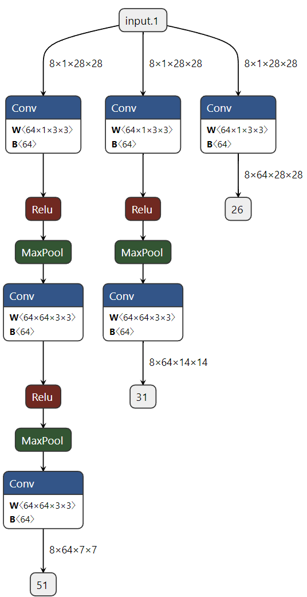

### Feature map plotting
<!-- 슬라이드 277 -->

테스트 이미지를 준비한다. `test_dataset[i]` 는 (image, label) tuple 이고 image 는 (1, 28, 28) 이다. 0 번 sample 은 숫자 7 이다.

```python
# test_dataset[i'th][0:image,1:label]
ps(test_dataset[0][0])    #(1,28,28) : 0번sample의 image
ps(test_dataset[0][0][0]) #(28,28)
print(test_dataset[0][1]) # 7        : 0번sample의 label

plt.imshow(test_dataset[0][0][0])
plt.show()
```

모델은 batch 를 받으므로 `unsqueeze(dim=0)` 으로 (1, 28, 28) 을 (1, 1, 28, 28) 로 만든다. 이 입력을 추론하는 과정에서 만들어지는 feature map 이 tuple 로 반환된다. 모델이 GPU 에 있으므로 입력도 `.to(device)` 로 같은 장치에 올린다.

```python
# Returns 3 items tuple(tensor, grad_fn)
n=0  # 첫번째 이미지를 넣고 추론하면서, feature를 반환 받음
image = test_dataset[n][0].unsqueeze(dim=0) #(1,1,28,28)<-(1,28,28)

feature_maps = model_FM(image.to(device))

pst(feature_maps[0]) #(1,64,28,28)
pst(feature_maps[1]) #(1,64,14,14)
pst(feature_maps[2]) #(1,64,7,7)
```

```text
[] Shapetorch.Size([1, 64, 28, 28]), <class 'torch.Tensor'>
[] Shapetorch.Size([1, 64, 14, 14]), <class 'torch.Tensor'>
[] Shapetorch.Size([1, 64, 7, 7]), <class 'torch.Tensor'>
```

레이어별로 64 개의 map 이 나오며 공간 크기는 28, 14, 7 로 줄어든다. 각 feature map 의 batch 차원을 벗겨 `(64, H, W)` 로 만들고 `square()` 에 넘기면 층마다 64 장을 8×8 로 그린다.

```python
# 3개의 레이어가 출력한 각64개의 feature map
for i, fmap in enumerate(feature_maps):
    square(fmap.cpu().detach().numpy()[0], 8)
```

다음은 세 층의 feature map 가운데 일부다. 첫 conv 의 28×28 map 에서는 입력 7 의 획이 그대로 보이고 타일마다 강조되는 방향과 밝기가 다르다. 14×14 map 에서는 획이 굵어지고 배경 대비가 커지며, 7×7 map 에 이르면 원래 숫자의 형태는 거의 알아볼 수 없는 거친 패턴이 된다.

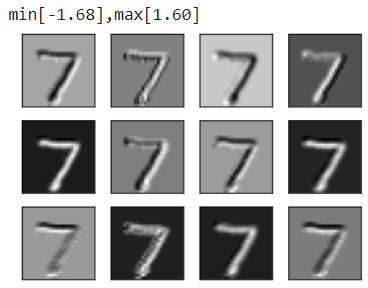

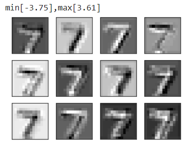

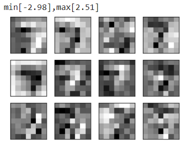

### Feature map 을 보는 것이 의미가 있을까?
<!-- 슬라이드 278 -->

Filter 와 feature map 을 나란히 놓고 보자. 왼쪽은 첫 conv layer 의 3×3 filter 64 개이고, 가운데는 그 filter 들이 숫자 7 에서 만들어 낸 28×28 feature map 64 장, 오른쪽은 세 번째 층의 7×7 feature map 64 장이다.

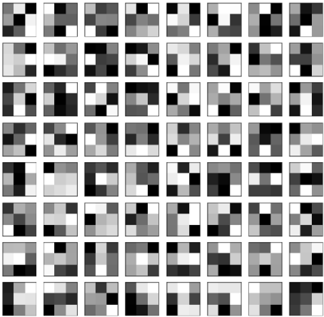

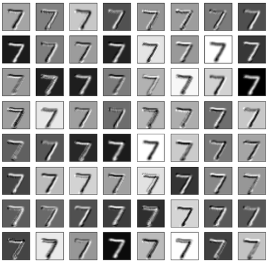

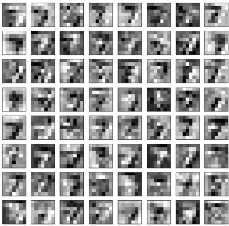

Filter 자체는 3×3 weight 아홉 개일 뿐이어서 그림으로 보아도 어떤 특징을 잡아내는지 읽어 내기 어렵다. Filter 는 추상적인 특징을 갖고 있기 때문이다. 반면 feature map 은 실제 입력에 filter 를 적용한 결과이므로, 어느 filter 가 어떤 획에 반응하는지, 층이 깊어지면서 정보가 어떻게 압축되는지를 눈으로 따라갈 수 있다. 그래서 모델의 동작을 추적하려면 filter 보다 feature map 을 확인하는 것이 유리하다. 다음 실습에서는 같은 방법을 훨씬 깊은 pre-trained 모델에 적용해 본다.

---

## 3.4.3 실습 3.4.3 — Pre-trained VGG model Feature Maps
<!-- 슬라이드 279 -->

> 노트북: `code/3.4.3.FM_VGG.ipynb`
> [](https://colab.research.google.com/github/AI-BoostCamp/intermediate-deep-learning-pytorch/blob/main/code/3.4.3.FM_VGG.ipynb)

**목적** — Pre-trained 된 model 들을 활용하기 위한 기본 실습이다.

**실습 개요**

- Pre-trained 된 VGG16 model 을 읽는다.
- VGG16 model 각 layer 들의 feature map 을 추출해 본다.
- 층이 깊어짐에 따라 representation 이 어떻게 달라지는지, 그 의미를 살펴본다.

입력으로는 새 사진 한 장(`bird.jpg`)을 쓴다. 앞 실습의 28×28 흑백 숫자와 달리 컬러 사진이므로, 모델이 기대하는 입력 형식에 맞추는 전처리가 필요하다. 오른쪽은 VGG16 의 깊은 층에서 얻은 feature map 하나로, 원본 사진의 형태는 사라지고 검은 배경에 작은 밝은 점들만 남아 있다. 이런 표현이 어떻게 만들어지는지를 층별로 따라가는 것이 이 실습이다.


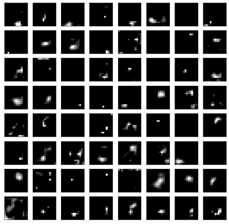

### Torchvision 이 제공하는 pre-trained 모델
<!-- 슬라이드 280 -->

Torchvision 은 다양한 pre-trained 모델을 제공한다. 가져오는 방법은 두 가지다.

- `torchvision.models` 에서 가져오기 — <https://pytorch.org/vision/stable/models.html#classification>
- GitHub 저장소에서 `torch.hub` 로 가져오기 — <https://github.com/pytorch/vision>

전체 문서는 <https://pytorch.org/vision/stable/index.html> 에 있다. 분류(classification)용으로 제공되는 모델 계열은 다음과 같다.

| 계열 | 모델 |
|---|---|
| 초기 CNN | AlexNet, VGG, GoogLeNet, Inception v3 |
| Residual 계열 | ResNet, ResNeXt, Wide ResNet |
| 경량 모델 | SqueezeNet, ShuffleNet v2, MobileNetV2, MobileNetV3, MNASNet |
| 그 밖의 CNN | DenseNet, EfficientNet, RegNet, ConvNeXt |
| Transformer | VisionTransformer |

Models and pre-trained weights 문서는 분류 외에도 semantic segmentation, object detection · instance segmentation · person keypoint detection, video classification, optical flow 용 모델을 다룬다.

문서에 실린 사용 예는 다음과 같이 모델 함수 하나로 학습된 weight 까지 받아 오는 형태다.

```python
import torchvision.models as models
resnet18 = models.resnet18(pretrained=True)
alexnet = models.alexnet(pretrained=True)
squeezenet = models.squeezenet1_0(pretrained=True)
vgg16 = models.vgg16(pretrained=True)
densenet = models.densenet161(pretrained=True)
inception = models.inception_v3(pretrained=True)
googlenet = models.googlenet(pretrained=True)
shufflenet = models.shufflenet_v2_x1_0(pretrained=True)
mobilenet_v2 = models.mobilenet_v2(pretrained=True)
```

`pretrained=True` 는 옛 인자이고, 최근 torchvision 은 어떤 weight 를 쓸지 이름으로 지정하는 `weights=` 인자를 쓴다. 노트북에서는 GitHub 의 `pytorch/vision` 저장소가 제공하는 모델 목록과 `torchvision.models` 의 모델 목록을 먼저 확인한다.

```python
torch.hub.list('pytorch/vision:v0.19.0')

import torchvision
torchvision.models.list_models()
```

### VGG16 model handling
<!-- 슬라이드 281~282 -->

**Model loading.** `models.vgg16()` 에 `weights='IMAGENET1K_V1'` 을 주면 ImageNet 으로 학습된 weight 를 내려받아 채운 모델이 만들어진다. VGG16 의 입력은 3 채널 224×224 이므로 `summary()` 에는 `(8, 3, 224, 224)` 를 넘긴다.

```python
import torchvision.models as models
#model_vgg = models.vgg16(pretrained=True)
model_vgg = models.vgg16(weights='IMAGENET1K_V1')

summary(model_vgg, input_size=(8, 3, 224, 224))
```

`summary()` 출력을 블록 단위로 간추리면 다음과 같다. VGG16 은 3×3 conv 만 쓰며, conv 블록 다섯 개가 채널을 64 → 128 → 256 → 512 → 512 로 늘리는 동안 max pooling 이 공간을 224 → 112 → 56 → 28 → 14 → 7 로 줄인다.

| 구간 | 층 | Output shape | Param # |
|---|---|---|---|
| features 블록 1 | Conv2d(3 → 64), ReLU, Conv2d(64 → 64), ReLU | [8, 64, 224, 224] | 1,792 / 36,928 |
| | MaxPool2d | [8, 64, 112, 112] | — |
| features 블록 2 | Conv2d(64 → 128), ReLU, Conv2d(128 → 128), ReLU | [8, 128, 112, 112] | 73,856 / 147,584 |
| | MaxPool2d | [8, 128, 56, 56] | — |
| features 블록 3 | Conv2d(128 → 256), ReLU, Conv2d(256 → 256) × 2, ReLU | [8, 256, 56, 56] | 295,168 / 590,080 × 2 |
| | MaxPool2d | [8, 256, 28, 28] | — |
| features 블록 4 | Conv2d(256 → 512), ReLU, Conv2d(512 → 512) × 2, ReLU | [8, 512, 28, 28] | 1,180,160 / 2,359,808 × 2 |
| | MaxPool2d | [8, 512, 14, 14] | — |
| features 블록 5 | Conv2d(512 → 512) × 3, ReLU | [8, 512, 14, 14] | 2,359,808 × 3 |
| | MaxPool2d | [8, 512, 7, 7] | — |
| avgpool | AdaptiveAvgPool2d | [8, 512, 7, 7] | — |
| classifier | Linear(25088 → 4096), ReLU, Dropout | [8, 4096] | 102,764,544 |
| | Linear(4096 → 4096), ReLU, Dropout | [8, 4096] | 16,781,312 |
| | Linear(4096 → 1000) | [8, 1000] | 4,097,000 |
| **Total params** | | | **138,357,544** |

**Model 들여다 보기.** 모델 객체를 그대로 출력하거나 헬퍼 `p()` 로 찍어 보면 구조를 이루는 module 의 이름이 보인다. VGG 클래스는 `features`(conv 블록들), `avgpool`, `classifier`(Linear 층들) 세 개의 하위 module 로 이루어져 있고, `features` 는 `nn.Sequential` 이라 인덱스로 층에 접근할 수 있다.

```python
model_vgg

## 모델 들여다 보기
p(model_vgg.features,'cr')
p(model_vgg.features[0],'cr')
p(model_vgg.features[0].__class__,'cr')
p(model_vgg.features[0].weight,'cr')
```

- `model_vgg` 의 type 은 `torchvision.models.vgg.VGG` 이고, 출력의 첫 줄 `(features): Sequential(` 이 module name 이다.
- `model_vgg.features` 는 `Sequential` 이며 `(0): Conv2d(3, 64, kernel_size=(3, 3), stride=(1, 1), padding=(1, 1))`, `(1): ReLU(inplace=True)`, … 로 이어진다.
- `model_vgg.features[0]` 은 첫 conv layer, 그 클래스는 `Conv2d` 다.
- `model_vgg.features[0].weight` 는 shape `torch.Size([64, 3, 3, 3])` 의 `Parameter` 로, 컬러 입력이므로 in_ch 가 3 이다.

**Conv layer 확인.** `features` 의 31 개 층을 인덱스와 함께 적으면 다음과 같다. 뒤에서 어느 층의 출력을 꺼낼지 정할 때 이 표를 쓴다.

| index | features 층 | index | features 층 |
|---|---|---|---|
| 0 | Conv2d(3, 64) | 16 | MaxPool2d |
| 1 | ReLU | 17 | Conv2d(256, 512) |
| 2 | Conv2d(64, 64) | 18 | ReLU |
| 3 | ReLU | 19 | Conv2d(512, 512) |
| 4 | MaxPool2d | 20 | ReLU |
| 5 | Conv2d(64, 128) | 21 | Conv2d(512, 512) |
| 6 | ReLU | 22 | ReLU |
| 7 | Conv2d(128, 128) | 23 | MaxPool2d |
| 8 | ReLU | 24 | Conv2d(512, 512) |
| 9 | MaxPool2d | 25 | ReLU |
| 10 | Conv2d(128, 256) | 26 | Conv2d(512, 512) |
| 11 | ReLU | 27 | ReLU |
| 12 | Conv2d(256, 256) | 28 | Conv2d(512, 512) |
| 13 | ReLU | 29 | ReLU |
| 14 | Conv2d(256, 256) | 30 | MaxPool2d |
| 15 | ReLU | | |

`features` 뒤에는 `avgpool`(AdaptiveAvgPool2d, 출력 7×7)과 `classifier`(Linear(25088, 4096) → ReLU → Dropout(0.5) → Linear(4096, 4096) → ReLU → Dropout(0.5) → Linear(4096, 1000)) 가 이어진다.

앞 실습과 같은 반복문으로 conv layer 만 골라 filter shape 을 출력한다.

```python
# summarize filter shapes
for i, layer in enumerate(model_vgg.features):
    # check for convolutional layer
    if 'Conv' not in str(layer.__class__):
        continue    # get filter weights
    filters = layer.weight
    print(i,': ', layer.__class__.__name__, filters.shape)
```

```text
0 :  Conv2d torch.Size([64, 3, 3, 3])
2 :  Conv2d torch.Size([64, 64, 3, 3])
5 :  Conv2d torch.Size([128, 64, 3, 3])
7 :  Conv2d torch.Size([128, 128, 3, 3])
10 :  Conv2d torch.Size([256, 128, 3, 3])
12 :  Conv2d torch.Size([256, 256, 3, 3])
14 :  Conv2d torch.Size([256, 256, 3, 3])
17 :  Conv2d torch.Size([512, 256, 3, 3])
19 :  Conv2d torch.Size([512, 512, 3, 3])
21 :  Conv2d torch.Size([512, 512, 3, 3])
24 :  Conv2d torch.Size([512, 512, 3, 3])
26 :  Conv2d torch.Size([512, 512, 3, 3])
28 :  Conv2d torch.Size([512, 512, 3, 3])
```

13 개의 conv layer 가 모두 3×3 filter 를 쓰고, 채널 수만 64 부터 512 까지 늘어난다는 것을 확인할 수 있다. 각 블록의 마지막 conv 는 2, 7, 14, 21, 28 번이다.

### Data 준비
<!-- 슬라이드 283 -->

테스트 이미지(`bird.jpg`)를 `/content/datasets/` 에 올려 둔다. PIL 로 파일을 열어 화면에 그려 보면 원본 크기의 컬러 사진이 나온다.

```python
from PIL import Image   # python imaging library

# set test file path
bird_file_path = '/content/datasets/bird.jpg'
# load the image with the required shape
input_image = Image.open(bird_file_path)
plt.imshow(input_image)
```

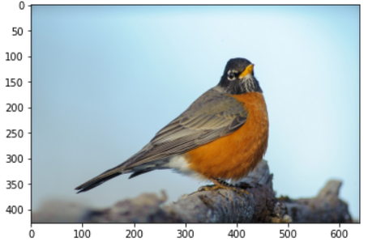

VGG16 은 (batch, 3, 224, 224) 모양의 입력을 기대하므로 이 사진을 그대로 넣을 수 없다. Resize(224, 224), crop, normalize 를 거친 뒤 batch 차원을 붙여 (1, 3, 224, 224) 로 만드는 전처리가 필요하다. Normalize 의 평균과 표준편차는 모델을 학습시킬 때 쓴 값을 그대로 써야 하며, torchvision 문서(<https://docs.pytorch.org/vision/stable/models/generated/torchvision.models.vgg16.html#torchvision.models.vgg16>)에 적혀 있다. 모델에 내장된 전용 변환 `VGG16_Weights.IMAGENET1K_V1.transforms` 가 하는 일은 다음과 같다.

1. PIL image 입력: (B, C, H, W) 또는 (C, H, W)
2. interpolation: `InterpolationMode.BILINEAR`, `resize_size=[256]`
3. center crop: `crop_size=[224]`
4. scale: [0.0, 1.0]
5. normalize: `mean=[0.485, 0.456, 0.406]`, `std=[0.229, 0.224, 0.225]`

노트북은 같은 일을 `v2` 변환으로 직접 조립한다. 사진을 224×224 로 바로 resize 하고, 0\~1 로 scale 한 뒤 ImageNet 의 평균·표준편차로 정규화한다. 주석 처리된 줄처럼 내장 변환 하나로 바꿔도 된다.

```python
# prepare the image (e.g. scale pixel for the vgg)
preprocess = v2.Compose([
    v2.ToImage(),
    v2.Resize((224,224)),
    v2.ToDtype(torch.float32, scale=True),
    v2.Normalize(mean=[0.485, 0.456, 0.406], std=[0.229, 0.224, 0.225]),
    # models.VGG16_Weights.IMAGENET1K_V1.transforms(),
    ])

input_tensor = preprocess(input_image)
# expand dimensions
input_batch = input_tensor.unsqueeze(0) # #(1,3,224,224)
p(input_batch)
```

전처리한 텐서를 다시 그려 보자. 텐서는 (C, H, W) 순서인데 `imshow` 는 (H, W, C) 를 받으므로 `permute(1, 2, 0)` 으로 축을 바꾼다.

```python
min = np.min(input_batch.cpu().detach().numpy())
max = np.max(input_batch.cpu().detach().numpy())
print(min,max)
#permute(1,2,0): (c,h,w)->(h,w,c)
plt.imshow(input_batch[0].permute(1, 2, 0)) #(C,H,W)->(H,W,C)
plt.show()
```

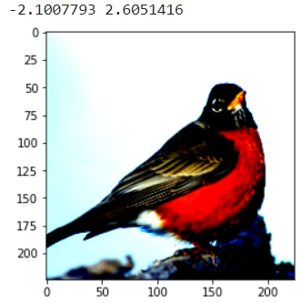

값의 범위가 0\~1 을 벗어나 음수와 2 이상까지 퍼져 있다. `imshow` 는 범위 밖의 값을 잘라 내어 그리므로 색이 왜곡되어 보이지만, 이것이 정규화가 제대로 된 상태다. 모델이 학습 때 본 입력이 바로 이런 분포다.

### 첫 번째 · 두 번째 conv layer 의 feature map
<!-- 슬라이드 284 -->

앞 실습처럼 `features` 를 슬라이스해 앞부분만 통과시키면 그 위치의 feature map 을 받는다. `features[:1]` 은 첫 conv 만, `features[:2]` 는 첫 conv 와 ReLU 까지다. 입력은 모델이 있는 GPU 로 `.to(device)` 해서 넣는다. 출력 shape 은 (1, 64, 224, 224) 이며, batch 차원을 벗긴 `feature_maps[0]` 을 `square()` 에 넘겨 64 장을 8×8 로 그린다.

```python
## 준비한 img를 입력으로 넣고 추론 실행
feature_maps = model_vgg.features[:1](input_batch.to(device)) #input_batch.cuda()
ps(feature_maps)
# plot 64 feature maps
square(feature_maps[0].cpu().detach().numpy(), 8)

feature_maps = model_vgg.features[:2](input_batch.to(device)) #input_batch.cuda()
ps(feature_maps)
# plot 64 feature maps
square(feature_maps[0].cpu().detach().numpy(), 8)
```

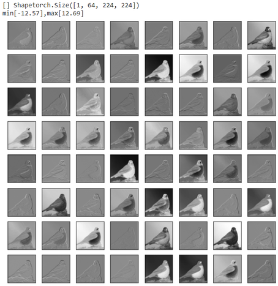

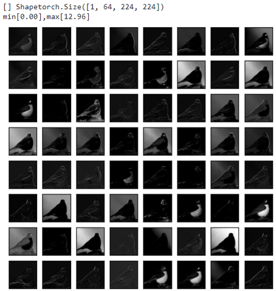

Conv 직후의 map 은 음수와 양수가 섞여 있어 회색 바탕에 윤곽이 드러나는 모양이고, ReLU 를 지나면 음수가 모두 0 이 되어 배경이 검게 가라앉고 반응이 큰 부분만 밝게 남는다. 두 번째 conv layer 는 `features[:3]`(conv 까지)과 `features[:4]`(ReLU 까지)로 같은 방식으로 확인한다.

```python
feature_maps = model_vgg.features[:3](input_batch.to(device))
ps(feature_maps)
square(feature_maps[0].cpu().detach().numpy(), 8)

feature_maps = model_vgg.features[:4](input_batch.to(device))
ps(feature_maps)
square(feature_maps[0].cpu().detach().numpy(), 8)
```

### 모든 conv block 의 feature map 시각화
<!-- 슬라이드 285~286 -->

VGG16 의 `features` 는 conv 블록 다섯 개가 max pooling 으로 나뉜 구조다. 아래 그림은 이 순서를 한 줄로 나타낸 것이다.

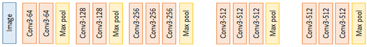

블록마다 feature map 을 하나씩 뽑기 위해 feature map 추출용 새 모델을 선언한다. 추출할 layer 는 각 블록의 마지막 conv 인 2, 7, 14, 21, 28 번이며, 그 conv 의 ReLU 까지 포함하도록 슬라이스를 `[:4]`, `[:9]`, `[:16]`, `[:23]`, `[:30]` 으로 잡는다. 즉 각 블록에서 max pooling 에 들어가기 직전의 출력이다. 새 모델은 `model_vgg.features` 를 그대로 받아 다섯 개의 출력을 tuple 로 돌려준다.

```python
class VGGFeatureMap(nn.Module):
    def __init__(self, features):
        super(VGGFeatureMap, self).__init__()
        self.features = features

    def forward(self, x):
        out1 = self.features[:4](x)
        out2 = self.features[:9](x)
        out3 = self.features[:16](x)
        out4 = self.features[:23](x)
        out5 = self.features[:30](x)
        return out1, out2, out3, out4, out5

vggFeatureMap = VGGFeatureMap(model_vgg.features)
#summary(vggFeatureMap, input_size=(8, 3, 224, 224))
```

이 모델에 전처리한 이미지를 넣고, 블록마다 shape 을 출력한 뒤 앞 64 장을 8×8 로 그린다.

```python
## 모델에 image넣어 실행
feature_maps = vggFeatureMap(input_batch.to(device))
# plot the output from each block
for i, fmap in enumerate(feature_maps):
    print(f'[{i+1} Block] Features :',fmap[0].shape)
    square(fmap[0].cpu().detach().numpy(), 8)
```

다음은 layer 2, 7, 14, 21, 28 의 출력, 즉 다섯 블록의 feature map 이다. 블록이 깊어질수록 채널은 64 → 128 → 256 → 512 → 512 로 늘고 공간은 224 → 112 → 56 → 28 → 14 로 줄어든다.

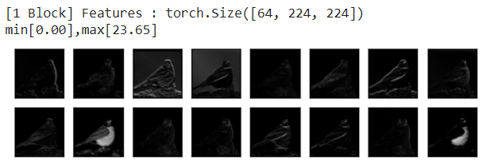

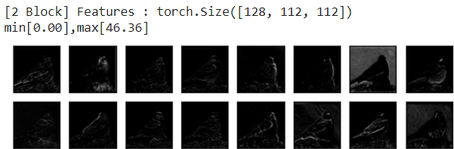

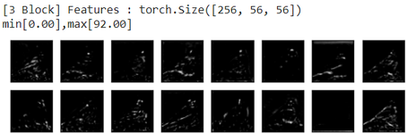

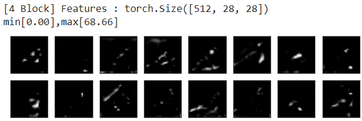

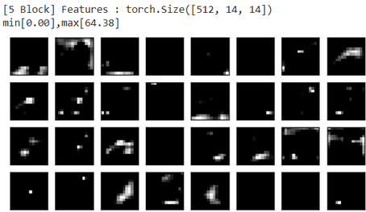

1 블록의 map 은 원본 사진의 윤곽과 밝기를 거의 그대로 담고 있어 edge 검출기 같은 모양이다. 2, 3 블록으로 가면 배경이 사라지고 새의 윤곽선이나 특정 부위에만 반응하는 map 이 늘어난다. 4, 5 블록에서는 공간 해상도가 28, 14 로 작아지고 대부분의 map 이 검게 비어 있으며, 몇몇 map 만 새의 특정 위치에서 강하게 반응한다. 층이 깊어질수록 representation 이 "픽셀의 배열" 에서 "어디에 무엇이 있는가" 로 바뀌는 것이며, 이것이 pre-trained 모델의 앞부분을 feature extractor 로 재활용하는 근거가 된다.

---

## 3.4.4 실습과제
<!-- 슬라이드 269, 278, 287~288 -->

### 실습 3.4.1 의 과제 — 모델 개선과 learning rate schedule

**과제 1.** Dataset 을 CIFAR-10 으로 수정하고, 최고 성능이 82% 이상이 되도록 모델을 개선하자(batch_size=512, epoch=30 사용, `limit_train_batches=0.5` 적용). 결과 plot 을 보고 성능 향상을 위해 무엇을 해볼지 검토해 보자.

- Conv. block 을 추가해 보자.
- Dense(1000) layer 를 Dense(256) 으로 바꿔 보자.
- Conv. block 에 dropout layer 를 추가해 보자.
- Dense(10) layer 앞에 dropout layer 를 추가해 보자.
- Conv. block 에 conv. layer 를 추가해 보자.
- Dense(256) layer 를 제거해 보자.

CIFAR-10 은 3 채널 32×32 이므로 첫 conv 의 입력 채널을 3 으로, `summary()` 의 입력 크기를 `(8, 3, 32, 32)` 로 바꾸고, Flatten 뒤의 크기를 새 구조에 맞게 다시 계산해야 한다.

**과제 2.** Learning rate schedule 을 적용해 보자. 최고 성능이 85% 이상이 되도록 scheduler 를 튜닝해 보자.

- `start_learning_rate`, `decay_steps`, `decay_rate` 를 수정해 보자.
- 모델의 학습 속도에 따라 적당한 학습률을 어떻게 결정할 것인가?

노트북에는 learning rate scheduling 참고 코드가 있다. epoch 이 `decay_steps` 를 지날 때마다 학습률에 `decay_rate` 를 곱하는 계단형 지수 감소 함수를 만들고, `LambdaLR` 에 넘긴다. Lightning 에서는 `configure_optimizers` 가 optimizer 와 scheduler 의 리스트를 함께 돌려주면 된다.

```python
epochs=30
lr_start = 0.001

decay_steps = epochs//3.5
decay_rate=0.5
def exponential_decay_lambda(epoch):
    return decay_rate ** (epoch // decay_steps)

class CNN_2(CNN): ## Inherit the CNN model
    def __init__(self):
        super(CNN_2, self).__init__()

    def configure_optimizers(self):
        optimizer =  torch.optim.Adam(self.parameters(), lr=lr_start)
        lr_scheduler = torch.optim.lr_scheduler.LambdaLR(optimizer, lr_lambda = exponential_decay_lambda)
        return [optimizer], [lr_scheduler]
```

다음은 두 과제의 참고 결과다. 왼쪽이 과제 1(모델 개선), 오른쪽이 과제 2(learning rate scheduling)의 학습 곡선이며 점선이 학습 정확도, 실선이 검증 정확도다. Scheduling 을 적용한 쪽은 후반 epoch 에서 곡선의 흔들림이 줄어드는 것을 볼 수 있다.

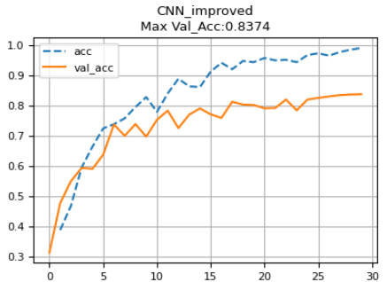

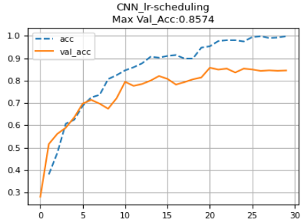

### 실습 3.4.2 의 과제 — feature map 을 관찰해 보자

- Conv layer 의 입력 feature 를 확인해 보자.
- MaxPooling layer 통과 전후의 feature map 을 비교해 보자.
- BatchNormalization layer 통과 전후의 feature map 을 비교해 보자.

층 하나하나의 출력을 보려면 슬라이스 대신 층을 하나씩 차례로 호출해 중간 결과를 모두 돌려주면 된다. 노트북의 참고 코드는 첫 블록의 네 층(Conv2d, BatchNorm2d, ReLU, MaxPool2d)의 출력을 순서대로 반환한다.

```python
class CNN_BN2_FM(L.LightningModule):
    def __init__(self,model):
        super(CNN_BN2_FM, self).__init__()
        self.layers = model.layers

    def forward(self, x):
        out1 = self.layers[0](x)
        out2 = self.layers[1](out1)
        out3 = self.layers[2](out2)
        out4 = self.layers[3](out3)
        return out1, out2, out3, out4

model_FM = CNN_BN2_FM(model)
```

### 실습 3.4.3 의 과제 — feature map 의 depth 방향 합

**과제 1.** Conv block 의 출력 feature map 을 depth 차원에서 reduce sum 하여 시각화하자.

**과제 2.** Conv layer 와 ReLU layer 의 출력들을 시각화하여 비교해 보자. 이 feature map 을 depth 차원에서 reduce sum 하여 시각화하자.

블록의 출력 `fmap[0]` 은 (C, H, W) 이므로 `dim=0` 으로 줄이면 (H, W) 한 장이 된다. 채널 방향으로 합치면 "어느 채널이" 가 아니라 "어느 위치에서" 반응이 큰지가 한 장의 heatmap 으로 보인다. 참고 코드는 합 대신 평균(`torch.mean`)을 쓰는데, 그림의 모양은 같다.

```python
ps(fmap)
fmap_sum = torch.mean(fmap[0], dim=0)
ps(fmap_sum)
plt.imshow(fmap_sum.cpu().detach().numpy())
```

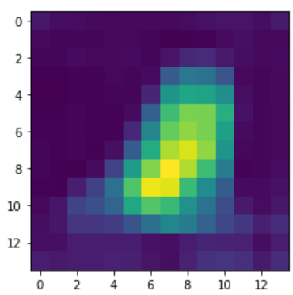

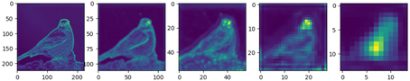

다섯 장을 나란히 보면 1 블록에서는 새의 윤곽 전체가 밝게 그려지지만, 블록이 깊어질수록 윤곽은 사라지고 새가 있는 위치에 밝은 덩어리가 모인다. 채널 하나하나는 추상적이어도 depth 방향으로 모으면 모델이 영상의 어느 부분을 보고 있는지 드러난다.
