# 3.5 실습 : Image Dataset handling

**학습 목표**

- 클래스별 폴더에 나뉘어 저장된 이미지 파일을 `torchvision.datasets.ImageFolder` 로 읽어 Dataset 으로 만들 수 있다.
- `DataLoader` 가 Dataset 에서 sampling 한 이미지를 batch 단위로 공급하는 과정을 shape 으로 확인할 수 있다.
- `torchvision.transforms.v2` 의 basic transform 과 augmentation transform 을 구분하고 `Compose` 로 묶어 쓸 수 있다.
- `Dataset` 클래스를 상속한 CustomDataset 으로 시험용 batch 를 만들어 각 augmentation 이 이미지를 어떻게 바꾸는지 눈으로 확인할 수 있다.
- transform 을 Dataset 에 붙여 학습 중에 이미지가 매번 달라지는 real-time augmentation 을 구성할 수 있다.

**이 절의 구성**

- 3.5.1 실습 개요 — 폴더로 구분된 이미지 데이터
- 3.5.2 데이터 준비 — 내려받기, 분할, 확인
- 3.5.3 ImageFolder 와 DataLoader 로 이미지 읽기
- 3.5.4 torchvision.transforms.v2 — transform 과 augmentation
- 3.5.5 시험용 batch 와 CustomDataset
- 3.5.6 주요 augmentation transform 의 시각적 확인
- 3.5.7 실습과제
- 3.5.8 정리

---

## 3.5.1 실습 개요 — 폴더로 구분된 이미지 데이터
<!-- 슬라이드 290 -->

### 실습 3.5.1 — image file 로 dataset 만들기

> 노트북: `code/3.5.1.ImageDataHandling.ipynb`
> [](https://colab.research.google.com/github/AI-BoostCamp/intermediate-deep-learning-pytorch/blob/main/code/3.5.1.ImageDataHandling.ipynb)

`torchvision.datasets` 가 미리 포장해 둔 데이터셋은 함수 한 번으로 tensor 가 되어 나온다. 그러나 실제 과제에서 만나는 이미지는 대개 디스크의 폴더 안에 jpg 파일로 흩어져 있다. 이 실습의 목적은 그런 **custom dataset 을 다룰 준비**를 하는 것이다. 구체적으로 세 가지를 익힌다.

- 폴더로 구분된 image data 를 사용하는 방법
- `torchvision.datasets.ImageFolder` API 의 사용법
- 학습 중에 이미지를 그때그때 변형하는 real-time augmentation

**실습 개요**

실습은 세 요소로 짜여 있다.

첫째, **이미지 data 는 폴더 구조를 갖는다.** 각 폴더의 이름이 곧 class 가 되고, 그 폴더 밑에 해당 class 의 이미지 파일이 들어 있다. 별도의 label 파일이 없어도 폴더 이름만으로 label 이 정해지는 셈이다.

둘째, **`torchvision.datasets.ImageFolder` API** 는 이런 폴더 구조를 그대로 Dataset 으로 바꿔 준다. 폴더 위의 image 를 Dataset 으로 사용할 수 있고, image 마다 transforms 를 적용할 수 있으며, 그 transform 에 무작위 변형을 넣으면 real-time augmentation 이 된다.

셋째, **`torch.utils.data.DataLoader` API** 는 Dataset 을 받아서 sampling 하여 batch 단위로 공급한다. 모델은 이 DataLoader 가 내놓는 batch 만 보면 된다.

정리하면 `폴더 → ImageFolder(Dataset) → DataLoader(batch)` 의 세 단계다. 이 실습에서 다루는 데이터는 다섯 종류의 꽃 사진이다.

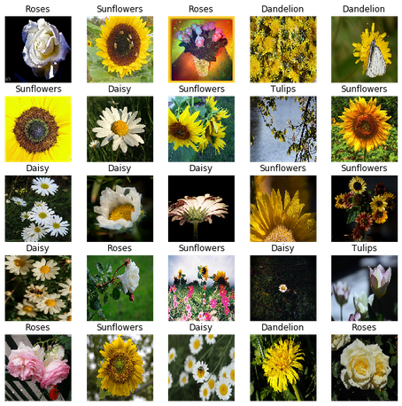

> **핵심 메시지**
> 폴더 이름이 label 이다. `ImageFolder` 가 폴더를 Dataset 으로, `DataLoader` 가 Dataset 을 batch 로 바꾸고, transform 은 그 사이에서 image 한 장마다 적용된다.

---

## 3.5.2 데이터 준비 — 내려받기, 분할, 확인
<!-- 슬라이드 291~293 -->

### 데이터 내려받기와 폴더 구조

먼저 꽃 사진 데이터(flower_photos)를 내려받는다. `torchvision.datasets.utils` 의 `download_and_extract_archive()` 는 URL 의 압축 파일(tgz)을 `root` 에 받아 `data_dir` 아래에 풀어 준다.

```python
from torchvision.datasets.utils import download_and_extract_archive

dataset_url = \
      "https://storage.googleapis.com/download.tensorflow.org/example_images/flower_photos.tgz"
root = './'
data_dir='Dataset'
download_and_extract_archive(dataset_url, root, data_dir)
data_dir = root+data_dir+'/flower_photos'
data_dir
```

압축을 풀고 `!ls {data_dir}` 로 들여다보면 다음 구조가 나온다. `flower_photos` 아래에 class 이름을 가진 다섯 폴더가 있고, 각 폴더 안에 그 class 의 jpg 파일이 들어 있다. `LICENSE.txt` 는 이미지가 아니므로 뒤에서 걸러내야 한다.

```text
Dataset/
└── flower_photos/
    ├── daisy/
    ├── dandelion/
    ├── roses/
    ├── sunflowers/
    ├── tulips/
    └── LICENSE.txt
```

### Train / Test 분할

내려받은 데이터는 class 별 폴더만 있고 train / test 구분이 없다. `splitfolders` 패키지(`split-folders`)의 `ratio()` 는 이런 폴더를 지정한 비율로 나누어, 출력 폴더 아래에 `train` 과 `val` 폴더를 만들고 그 안에 class 폴더 구조를 그대로 다시 만들어 준다.

```python
import splitfolders
import pathlib

sp_path = "./flower_photos_sp"
splitfolders.ratio(data_dir, output=sp_path,
    seed=1337, ratio=(.7, .3), group_prefix=None, move=True )
sp_train = pathlib.Path(sp_path+'/train')
sp_test = pathlib.Path(sp_path+'/val')

sp_train,sp_test
```

- `ratio=(.7, .3)` — 각 class 의 파일을 70 % 는 `train`, 30 % 는 `val` 로 나눈다. 비율이 두 개이므로 `test` 폴더는 만들지 않는다.
- `seed=1337` — 무작위 분할을 다시 실행해도 같게 나오도록 seed 를 고정한다.
- `group_prefix=None` — 파일 이름 접두어가 같은 파일을 한 묶음으로 나누는 기능은 쓰지 않는다.
- `move=True` — 복사하지 않고 파일을 옮긴다. 디스크를 절약하는 대신 원래 폴더는 비게 된다.

나눈 결과를 `pathlib.Path` 로 감싸 두면 뒤에서 `glob()` 으로 파일을 찾기 편하다. 이 실습에서는 `val` 폴더를 test 용으로 쓴다(`sp_test`).

```text
flower_photos_sp/
├── train/
│   ├── daisy/
│   ├── dandelion/
│   ├── roses/
│   ├── sunflowers/
│   └── tulips/
└── val/
    ├── daisy/
    ├── dandelion/
    ├── roses/
    ├── sunflowers/
    └── tulips/
```

### 폴더와 이미지 확인, 폴더 이름 정렬

폴더가 제대로 나뉘었는지 확인하는 함수 `check_dir()` 를 만든다. `glob('*/*.jpg')` 로 하위 폴더 안의 jpg 파일 수를 세고, 하위 폴더 이름을 모아 class 목록을 만든다. 이때 `LICENSE.txt` 는 제외한다.

```python
# 지정 폴더 아래에 있는 모든 *.jpg 파일의 수
#  및 폴더명 목록을 리턴
def check_dir(d_path):
    img_count = len(list(d_path.glob('*/*.jpg')))
    c_name = np.array([item.name for item in d_path.glob('*') if item.name != "LICENSE.txt"])
    return img_count, c_name, len(c_name)

# check_dir()로 폴더명과 이미지 숫자 확인
image_count, CLASS_train, class_num = check_dir(sp_train)
CLASS_train.sort()
print('Train image_count: {}\nclasses: {}'.format(image_count, CLASS_train))
image_count, CLASS_test, class_num = check_dir(sp_test)
CLASS_test.sort()
print('Test image_count: {}\nclasses: {}'.format(image_count, CLASS_test))
```

class 목록을 `sort()` 로 **정렬해 두는 것이 중요하다.** `glob()` 이 돌려주는 폴더 순서는 파일 시스템에 따라 달라질 수 있는데, 뒤에서 쓸 `ImageFolder` 는 폴더 이름을 정렬한 순서로 label 번호(0, 1, 2, …)를 매긴다. 정렬해 둔 `CLASS_train` 은 이 label 번호를 class 이름으로 되돌리는 표가 된다.

```text
Train image_count: 2567
classes: ['daisy' 'dandelion' 'roses' 'sunflowers' 'tulips']
Test image_count: 1103
classes: ['daisy' 'dandelion' 'roses' 'sunflowers' 'tulips']
```

train 과 test 의 class 목록이 같고, 이미지 수는 대략 7 : 3 으로 나뉘었다.

### 이미지 확인

class 마다 이미지를 두 장씩 열어 본다. `check_image()` 는 class 폴더별로 파일 목록을 만들고 앞의 두 장을 PIL 로 열어 `IPython.display` 로 보여 준다.

```python
from IPython import display
from PIL import Image

# 지정 path 아래에 있는 폴더에서 이미지 두장씩을 확인
def check_image(d_path, class_list):
    for i in range(len(class_list)):
        class_temp = list(d_path.glob(str(class_list[i])+'/*'))
        for image_path in class_temp[:2]:
            display.display(Image.open(str(image_path)))
# check_image()로 이미지 두장씩 확인
check_image(sp_train, CLASS_train)
```

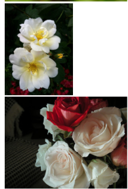

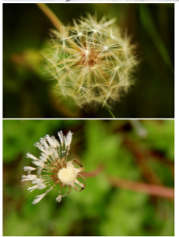

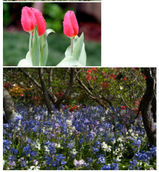

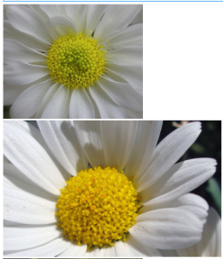

열어 본 사진은 크기와 가로세로 비율이 제각각이다. 이대로는 여러 장을 하나의 tensor 로 쌓을 수 없으므로, Dataset 을 만들 때 transform 으로 크기를 맞춰야 한다.

---

## 3.5.3 ImageFolder 와 DataLoader 로 이미지 읽기
<!-- 슬라이드 294~295 -->

### 기본적인 사용 절차

`ImageFolder` 로 image Dataset 을 읽어 오는 기본 절차는 세 단계다. (1) 이미지 한 장에 적용할 transform 을 정의하고, (2) 폴더와 transform 을 `ImageFolder` 에 넘겨 Dataset 을 만들고, (3) 그 Dataset 을 `DataLoader` 에 넘겨 batch 를 만든다.

```python
from torchvision.transforms import v2
from torchvision.datasets import ImageFolder
from torch.utils.data import DataLoader

## loader에 적용할 transform
transform = v2.Compose([
    v2.ToImage(),
    v2.Resize((224,224)),
    v2.ToDtype(torch.float32, scale=True) ] )

## ImageFolder : folder로 구성된 image set을 위한 loader
train_imgs = ImageFolder(sp_train, transform=transform) #(image,label)
test_imgs = ImageFolder(sp_test, transform=transform)

## DataLoader : dataset과 sampler를 결합 batch단위 제공 #(image,label)*batch
train_loader = DataLoader(train_imgs, batch_size=320, shuffle=True,num_workers=4)
test_loader = DataLoader(test_imgs, batch_size=320, shuffle=False,num_workers=4)

len(train_imgs),len(test_imgs)
```

`v2.Compose()` 는 transform 여러 개를 순서대로 이어 붙인다. 여기 쓴 세 개는 augmentation 이 아니라 이미지를 tensor 로 만드는 basic transform 이다.

- `v2.ToImage()` — PIL Image 를 torchvision 의 tensor image 로 바꾼다. 채널이 앞에 오는 (C, H, W) 모양의 uint8 tensor 가 된다.
- `v2.Resize((224,224))` — 크기가 제각각인 사진을 모두 224 x 224 로 맞춘다. 크기가 같아야 batch 로 쌓을 수 있다.
- `v2.ToDtype(torch.float32, scale=True)` — 0\~255 의 정수를 float32 로 바꾸면서, `scale=True` 로 0\~1 범위로 나눈다.

`ImageFolder(sp_train, transform=transform)` 은 `sp_train` 아래의 class 폴더를 훑어 (image, label) 쌍을 돌려주는 Dataset 을 만든다. label 은 정렬된 폴더 순서의 정수이고, transform 은 image 를 꺼낼 때마다 적용된다.

`DataLoader` 는 Dataset 과 sampler 를 결합하여 batch 단위로 제공한다. batch 하나는 (image, label) 이 `batch_size` 개 쌓인 것이다. 학습용은 `shuffle=True` 로 매 epoch 순서를 섞고, 시험용은 `shuffle=False` 로 순서를 고정한다. `num_workers=4` 는 이미지를 읽고 transform 하는 일을 4개의 worker 프로세스로 나눈다. 마지막 줄의 `len(train_imgs)`, `len(test_imgs)` 는 앞에서 `check_dir()` 로 센 이미지 수와 같아야 한다.

### 첫 batch 꺼내 보기

DataLoader 는 iterator 다. `next(iter(train_loader))` 로 첫 batch 를 꺼내면 (images, labels) 튜플이 나온다. 노트북의 `p()`, `ps()`, `pst()` 는 변수의 shape 과 type 을 찍어 보는 helper 함수다.

```python
(imgs,labels) = next(iter(train_loader)) # (images,labels)
ps(imgs,'imgs')       # images
ps(labels,'labels')   # labels
print(CLASS_train[labels[0]])       # 0번 label
plt.imshow(imgs[0].permute(1, 2, 0))# 0번 image
plt.show()
```

`imgs` 의 shape 은 (320, 3, 224, 224), `labels` 는 (320,) 이다. `labels[0]` 은 정수이므로 `CLASS_train[labels[0]]` 으로 class 이름을 되찾는다 — 앞에서 class 목록을 정렬해 둔 이유가 여기 있다. `plt.imshow()` 는 (H, W, C) 순서를 기대하므로 (C, H, W) 인 tensor 를 `permute(1, 2, 0)` 으로 바꿔서 그린다.

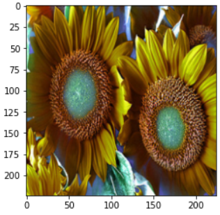

### Dataset 과 DataLoader 의 차이

Dataset 과 DataLoader 가 각각 무엇을 돌려주는지 shape 으로 확인해 둔다.

```python
p(train_imgs,'train_imgs') #dataset을 folder에서 읽어서 제공

print(len(train_imgs))     #dataset의 수를 알고 있음
img, label = train_imgs[0] #첫번째 data tuple: (image[0],label[0])
# img: (3,224,224)
# label: int

p(train_loader,'train_loader')            # dataloader object
p(len(train_loader),'len(train_loader)')  # batch단위 iteration 수
ps(next(iter(train_loader))[0],'next(iter())[0]')# images:(320,3,224,224)
ps(next(iter(train_loader))[1],'next(iter())[1]')# labels:(320,)

print(next(iter(train_imgs))[0].shape)  #첫번째 tuple의 image:(3,224,224)
print(next(iter(train_loader))[0].shape)#첫번째 batch의 images:(320,3,224,224)
```

- **Dataset**(`train_imgs`)은 index 로 한 장씩 꺼낸다. `train_imgs[0]` 은 (image, label) 튜플이고 image 는 (3, 224, 224), label 은 정수다. `len(train_imgs)` 는 이미지 수다.
- **DataLoader**(`train_loader`)는 batch 단위로 꺼낸다. `len(train_loader)` 는 한 epoch 의 iteration 수, 즉 이미지 수를 `batch_size` 로 나눈 batch 의 개수다. 한 batch 의 images 는 (320, 3, 224, 224), labels 는 (320,) 이다.

같은 데이터인데 Dataset 에서는 (3, 224, 224), DataLoader 에서는 (320, 3, 224, 224) 로 batch 차원이 하나 붙는다는 점만 기억하면 된다.

### Dataset 일부 확인

batch 하나를 꺼내 앞의 25장을 class 이름과 함께 격자로 그려 본다. `plt.title()` 에 `CLASS_train[l_batch[n]]` 을 넣어 label 번호를 이름으로 바꿔 표시한다.

```python
img_batch, l_batch = next(iter(train_loader))
plt.figure(figsize=(10,10))
for n in range(25):
    i = img_batch[n]
    ax = plt.subplot(5,5,n+1)
    plt.imshow(i.permute(1, 2, 0))
    plt.title(CLASS_train[l_batch[n]])
    plt.axis('off')
```

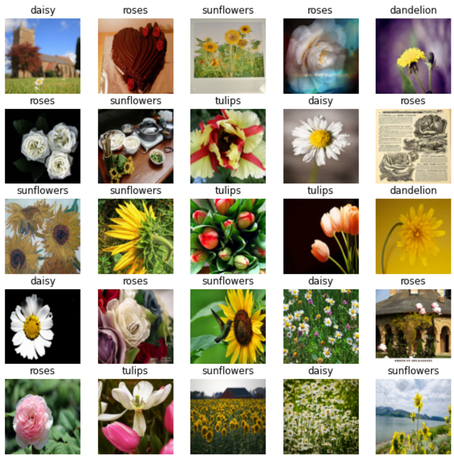

`shuffle=True` 이므로 다섯 class 가 섞여 나오고, 모든 이미지가 같은 크기로 맞춰져 있다.

---

## 3.5.4 torchvision.transforms.v2 — transform 과 augmentation
<!-- 슬라이드 296 -->

`torchvision.transforms` (v2) API 는 두 종류의 기능을 한 곳에 모아 둔다. 하나는 이미지를 tensor 로 바꾸고 dtype·크기·정규화를 맞추는 **basic transform** 이고, 다른 하나는 이미지를 무작위로 변형하는 **augmentation** 이다. 둘 다 `v2.Compose()` 로 이어 붙여 Dataset 의 `transform` 인자로 넘기면 image 한 장을 꺼낼 때마다 적용된다. augmentation 은 매번 다른 난수로 적용되므로 같은 이미지라도 epoch 마다 다른 모습으로 모델에 들어간다 — 이것이 real-time augmentation 이다. 전체 목록은 공식 문서(https://pytorch.org/vision/stable/transforms.html)에 있다.

먼저 basic transform 이다. 이 실습에서는 `ToImage()`, `ToDtype()` 을 쓴다.

| basic transform | 설명 |
|---|---|
| `Normalize(mean, std[, inplace])` | tensor image 를 mean, std 로 정규화 |
| `ToImage()` | tensor(Image) 로 변환 |
| `ToDtype()` | 지정한 dtype 으로 변환, scaling 가능 |
| `PILToTensor()` | PIL Image 를 tensor 로 |
| `ToPILImage([mode])` | tensor 를 PIL Image 로 |

다음은 이미지를 변형하는 transform 함수다. 이름이 `Random` 으로 시작하는 것은 난수에 따라 결과가 달라지므로 augmentation 으로 쓴다.

| 구분 | image transform function | 설명 |
|---|---|---|
| 자르기·뒤집기·회전·크기 | `CenterCrop(size)` | 가운데를 잘라낸다 |
| | `FiveCrop(size)` | 네 모서리와 가운데를 잘라낸다 |
| | `TenCrop(size[, vertical_flip])` | 네 모서리·가운데를 잘라내고 뒤집은 것까지 |
| | `RandomCrop(size[, padding, pad_if_needed, …])` | 무작위 위치에서 잘라낸다 |
| | `RandomResizedCrop(size[, scale, ratio, …])` | 무작위 부분을 잘라내어 크기를 맞춘다 |
| | `RandomVerticalFlip([p])` | 상하로 뒤집는다 |
| | `RandomHorizontalFlip([p])` | 좌우로 뒤집는다 |
| | `RandomRotation(degrees[, interpolation, …])` | 각도만큼 회전한다 |
| | `Resize(size[, interpolation, max_size, …])` | 입력 이미지 크기를 바꾼다 |
| 채우기·색 | `Pad(padding[, fill, padding_mode])` | 네 변을 pad 값으로 채운다 |
| | `ColorJitter([brightness, contrast, …])` | 밝기·대비·채도·색상을 바꾼다 |
| | `RandomInvert([p])` | 색을 반전한다 |
| 흑백 | `Grayscale([num_output_channels])` | 흑백으로 바꾼다 |
| | `RandomGrayscale([p])` | 무작위로 흑백으로 바꾼다 |
| 기하 변환 | `RandomAffine(degrees[, translate, scale, …])` | 무작위 affine 변환 |
| | `RandomApply(transforms[, p])` | transform 목록을 확률적으로 적용한다 |
| | `RandomPerspective([distortion_scale, p, …])` | 무작위 원근 변환 |
| 흐림·색 단계 | `GaussianBlur(kernel_size[, sigma])` | Gaussian blur 로 흐리게 한다 |
| | `RandomPosterize(bits[, p])` | 색 채널의 비트 수를 줄인다 |

이 표의 transform 가운데 자주 쓰는 것을 3.5.6 에서 하나씩 이미지에 적용해 보며 확인한다.

---

## 3.5.5 시험용 batch 와 CustomDataset
<!-- 슬라이드 297~299 -->

augmentation 이 이미지를 어떻게 바꾸는지 보려면 **같은 이미지 여러 장**으로 batch 를 만들어 transform 을 통과시키는 것이 가장 알기 쉽다. 결과가 서로 다르다면 그 차이는 전부 transform 의 난수에서 온 것이기 때문이다. 이를 위해 Test data 를 따로 준비한다.

### 적당한 이미지 고르기

`sp_train` 의 roses 폴더에서 파일 목록을 만들고 그 가운데 한 장(10번째)을 PIL 로 연다.

```python
roses = list(sp_train.glob('roses/*'))
img = Image.open(roses[9])
img
```


### 같은 이미지 9장으로 batch 만들기

PIL Image 를 `np.array()` 로 바꾸면 (h, w, c) 모양의 배열이 된다. 여기에 batch 차원을 앞에 붙여 (9, h, w, c) 크기의 빈 배열을 만들고, 9칸 모두에 같은 이미지를 복사해 넣는다.

```python
# (h,w,c) -> (9,h,w,c)
data = np.array(img)
pst(data,'data')
batch_image = \
  np.ndarray([9,data.shape[0],data.shape[1],3])
for i in range(9): batch_image[i] = img
pst(batch_image,'batch_image')
```

### CustomDataset 클래스

이 배열을 DataLoader 의 입력으로 쓰려면 Dataset 이어야 한다. `torch.utils.data.Dataset` 을 상속하여 세 메서드만 채우면 된다.

```python
from PIL import Image

class CustomDataset(torch.utils.data.Dataset):
    def __init__(self, x, transforms):
        self.x = x
        self.transforms = transforms
    def __len__(self):
        return len(self.x)
    def __getitem__(self, index: int):
        image = Image.fromarray(self.x[index].astype(np.uint8))
        if self.transforms is not None:
            image = self.transforms(image)
        return image
```

- `__init__()` — 이미지 배열 `x` 와 적용할 `transforms` 를 저장한다.
- `__len__()` — 이미지 수를 돌려준다. DataLoader 가 몇 개를 sampling 할지 여기서 안다.
- `__getitem__()` — index 번째 배열을 `Image.fromarray()` 로 PIL Image 로 되돌린 뒤 transform 을 적용해 돌려준다. `ImageFolder` 와 달리 label 은 없고 image 만 돌려준다. transform 이 `__getitem__()` 안에서 호출되므로, 꺼낼 때마다 새로 적용된다.

`ImageFolder` 도 내부적으로는 이와 같은 구조다. 폴더에서 파일을 열어 PIL Image 로 만들고 transform 을 적용한 뒤 (image, label) 로 돌려주는 `__getitem__()` 을 갖고 있다.

### transform 적용 및 확인

transform 을 `Compose()` 로 구성한다. 주석으로 막아 둔 줄이 뒤에서 하나씩 켜 볼 augmentation 목록이다. 지금은 basic transform 만 살아 있으므로 이미지가 바뀌지 않아야 한다.

```python
transforms = v2.Compose([
    v2.ToImage(),
    v2.Resize((224, 224)),
    # v2.RandomHorizontalFlip(0.5),
    # v2.RandomVerticalFlip(0.5),
    # v2.RandomRotation(degrees=(0, 180)),
    # v2.RandomResizedCrop(224, scale=(0.5, 1.0)),
    # v2.RandomAffine(degrees=0, shear=45),
    # v2.ColorJitter(hue=0.2),
    # v2.RandomAffine(degrees=(30, 70),
    #                 translate=(0.1, 0.3),
    #                 scale=(0.5, 0.75)),
    # v2.AutoAugment(),
    # v2.RandAugment(),
    # v2.TrivialAugmentWide(),
    v2.ToDtype(torch.float32, scale=True) ] )

dataset = CustomDataset(batch_image, transforms=transforms)
dataloader = DataLoader(dataset, batch_size=6)

batch = next(iter(dataloader))
pst(batch, 'batch')
```

`batch_size=6` 이므로 9장 가운데 6장이 한 batch 로 나온다. `pst()` 출력은 다음과 같다.

```text
[batch] Shape torch.Size([6, 3, 224, 224]), <class 'torch.Tensor'>
```

CustomDataset 이 돌려준 PIL Image 가 transform 을 거쳐 (3, 224, 224) tensor 가 되고, DataLoader 가 6장을 쌓아 (6, 3, 224, 224) 가 되었다.

batch 를 그리는 일은 앞으로 여러 번 반복되므로 함수 `dataset_plt()` 로 묶는다. Dataset 을 받아 DataLoader 로 batch 하나를 꺼내고, `permute(0,2,3,1)` 로 (B, H, W, C) 로 바꾼 뒤 3 x 3 격자에 최대 9장을 그린다. 값이 1 보다 크면(0\~255 정수 이미지) uint8 로 바꾸고, `ToDtype(scale=True)` 를 거쳐 0\~1 인 경우는 그대로 그린다.

```python
def dataset_plt(dataset):
    dataloader = DataLoader(dataset, batch_size=6)
    batch = next(iter(dataloader))
    batch = batch.permute(0,2,3,1)
    plt.figure(figsize=(8,8))
    for i in range(min(9,batch.shape[0])):
        plt.subplot(330 + 1 + i)
        # plt을 위해 type 변경
        if max(batch[i,0,:,0])>1 :
            image = batch[i].astype('uint8')
        else:
            image = batch[i]
        # plot raw pixel data
        plt.axis('off')
        plt.imshow(image)
    # show the figure
    plt.show()

dataset = CustomDataset(batch_image, transforms=transform)
dataset_plt(dataset)
```

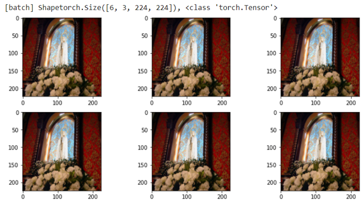

예상대로 6장이 모두 같다. 이제 이 상태를 기준으로 augmentation 을 하나씩 넣어 본다.

---

## 3.5.6 주요 augmentation transform 의 시각적 확인
<!-- 슬라이드 300~303 -->

아래 실험은 모두 같은 틀이다. `_transforms` 의 `Resize()` 와 `ToDtype()` 사이에 augmentation 한 줄을 끼우고, `CustomDataset(batch_image, transforms=_transforms)` 으로 Dataset 을 만들어 `dataset_plt()` 로 그린다. 바뀌는 것은 가운데 한 줄뿐이므로 두 번째 실험부터는 `Compose()` 부분만 적는다. 결과 격자의 6장이 원래 같은 이미지였다는 점을 기억하며 보자.

### RandomAffine — shift, shear, rotate, scale

`RandomAffine` 은 좌우 shift(`translate`), shear, rotate(`degrees`), scale 을 한 번에 적용할 수 있는 transform 이다. 어느 인자가 무엇을 하는지 보기 위해 하나씩 따로 켜 본다. 첫 번째는 `translate` 다.

```python
_transforms = v2.Compose([
    v2.ToImage(),
    v2.Resize((224, 224)),
    # degrees, translate, scale, shear
    v2.RandomAffine(degrees=0, translate = (0.2, 0.3)),
    v2.ToDtype(torch.float32, scale=True) ] )
dataset = CustomDataset(batch_image, transforms=_transforms)

dataset_plt(dataset)
```

`degrees=0` 은 회전을 끈다는 뜻이고(`degrees` 는 필수 인자다), `translate=(0.2, 0.3)` 은 가로로 최대 폭의 20 %, 세로로 최대 높이의 30 % 까지 무작위로 옮긴다는 뜻이다. 옮겨서 비는 부분은 검게 채워진다.

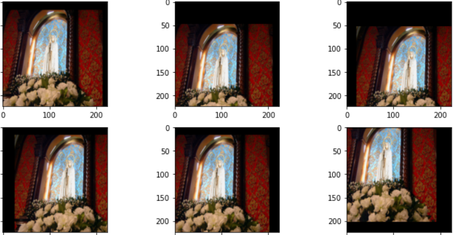

다음은 `shear` 다. `shear=45` 는 최대 45 도 범위에서 무작위로 기울인다.

```python
_transforms = v2.Compose([
    v2.ToImage(),
    v2.Resize((224, 224)),
    v2.RandomAffine(degrees=0, shear=45),
    v2.ToDtype(torch.float32, scale=True) ] )
```

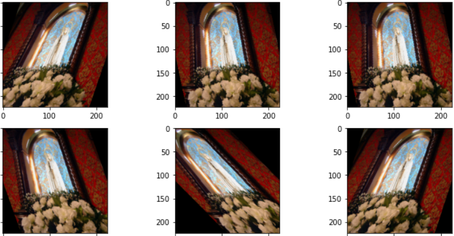

`degrees=45` 만 주면 -45 도에서 45 도 사이의 각도로 무작위 회전한다.

```python
_transforms = v2.Compose([
    v2.ToImage(),
    v2.Resize((224, 224)),
    v2.RandomAffine(degrees=45),
    v2.ToDtype(torch.float32, scale=True) ] )
```

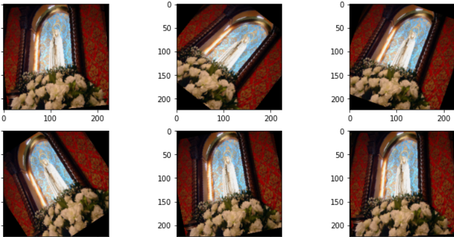

`scale=(1.0, 1.5)` 는 이 범위에서 고른 배율로 크기를 바꾼다.

```python
_transforms = v2.Compose([
    v2.ToImage(),
    v2.Resize((224, 224)),
    v2.RandomAffine(degrees=0,scale=(1.0,1.5)),
    v2.ToDtype(torch.float32, scale=True) ] )
```

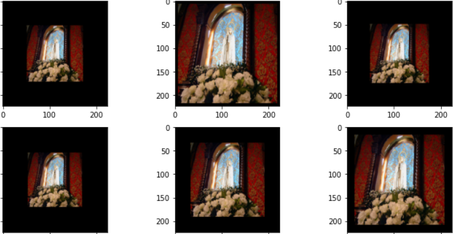

네 인자를 한꺼번에 주면 shift·shear·rotate·scale 이 동시에 적용된다. 3.5.5 의 주석에 있던 `RandomAffine(degrees=(30, 70), translate=(0.1, 0.3), scale=(0.5, 0.75))` 가 그런 예다.

### RandomHorizontalFlip / RandomVerticalFlip, RandomRotation

뒤집기는 좌우(`RandomHorizontalFlip`)와 상하(`RandomVerticalFlip`)가 따로 있다. 인자 `0.5` 는 뒤집을 확률 p 다. 둘을 이어 놓으면 각각 독립적으로 확률 0.5 로 적용되므로, 원본·좌우 뒤집힘·상하 뒤집힘·둘 다 뒤집힘의 네 경우가 나온다.

```python
_transforms = v2.Compose([
    v2.ToImage(),
    v2.Resize((224, 224)),
    v2.RandomHorizontalFlip(0.5),
    v2.RandomVerticalFlip(0.5),
    v2.ToDtype(torch.float32, scale=True) ] )

dataset = CustomDataset(batch_image, transforms=_transforms)

dataset_plt(dataset)
```

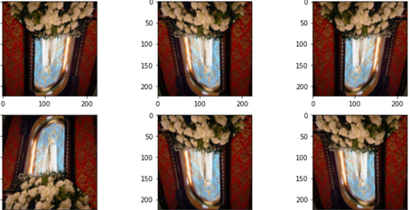

`RandomRotation(degrees=45)` 는 -45 도에서 45 도 사이에서 무작위로 회전한다. `RandomAffine` 의 `degrees` 와 같은 효과를 회전만 따로 떼어 낸 것이다.

```python
_transforms = v2.Compose([
    v2.ToImage(),
    v2.Resize((224, 224)),
    v2.RandomRotation(degrees = 45),
    v2.ToDtype(torch.float32, scale=True) ] )
```

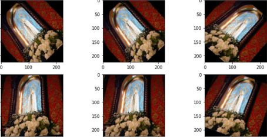

### RandomResizedCrop, ColorJitter

`RandomResizedCrop` 은 이미지의 무작위 부분을 잘라낸 뒤 지정한 크기로 늘린다. `scale=(0.5, 1.0)` 은 원본 면적의 50\~100 % 를 잘라낸다는 뜻이고, `ratio=(3/4, 4/3)` 은 잘라낼 영역의 가로세로 비율 범위다. 결과 크기를 (224, 224) 로 지정하므로 앞의 `Resize()` 는 필요 없어 주석으로 막았다.

```python
_transforms = v2.Compose([
    v2.ToImage(),
#    v2.Resize((224, 224)),
    v2.RandomResizedCrop((224,224), scale=(0.5, 1.0),ratio=(3./4.,4./3.)),
    v2.ToDtype(torch.float32, scale=True) ] )
```

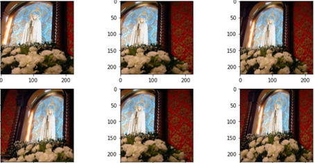

`ColorJitter` 는 밝기(brightness)·대비(contrast)·채도(saturation)·색상(hue)을 무작위로 바꾼다. `brightness=(0.5, 1.5)` 는 밝기 배율을 이 범위에서 고르고, `hue=0.2` 는 색상을 -0.2\~0.2 범위에서 옮긴다.

```python
_transforms = v2.Compose([
    v2.ToImage(),
    v2.Resize((224, 224)),
    v2.ColorJitter(brightness=(0.5, 1.5)),
    v2.ToDtype(torch.float32, scale=True) ] )
```

```python
_transforms = v2.Compose([
    v2.ToImage(),
    v2.Resize((224, 224)),
    v2.ColorJitter(hue=0.2),
    v2.ToDtype(torch.float32, scale=True) ] )
```

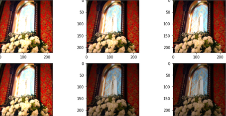

### RandomEqualize, RandomAutocontrast

`RandomEqualize` 는 histogram equalization 을 확률 p 로 적용한다. 어두운 곳과 밝은 곳의 픽셀 값을 고르게 펴서 대비를 키운다.

```python
_transforms = v2.Compose([
    v2.ToImage(),
    v2.Resize((224, 224)),
    v2.RandomEqualize(p=0.5),
    v2.ToDtype(torch.float32, scale=True) ] )
```

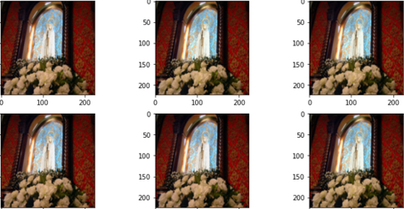

`RandomAutocontrast` 는 채널마다 가장 어두운 값과 가장 밝은 값이 전체 범위를 쓰도록 늘려 대비를 자동으로 맞춘다. 역시 확률 p 로 적용된다.

```python
_transforms = v2.Compose([
    v2.ToImage(),
    v2.Resize((224, 224)),
    v2.RandomAutocontrast(p=0.5),
    v2.ToDtype(torch.float32, scale=True) ] )
```

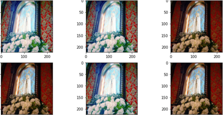

`p=0.5` 로 준 두 transform 은 격자의 절반 정도에만 적용되고 나머지는 원본 그대로다. augmentation 은 "항상 바꾸는 것"이 아니라 "확률적으로 바꾸는 것"임을 보여 준다.

### RandomPerspective, RandomInvert

`RandomPerspective` 는 네 모서리를 무작위로 옮겨 원근 변환을 한다. `distortion_scale=0.6` 은 모서리를 얼마나 크게 옮길지 정하는 값으로, 클수록 심하게 찌그러진다.

```python
_transforms = v2.Compose([
    v2.ToImage(),
    v2.Resize((224, 224)),
    v2.RandomPerspective(distortion_scale=0.6),
    v2.ToDtype(torch.float32, scale=True) ] )
```

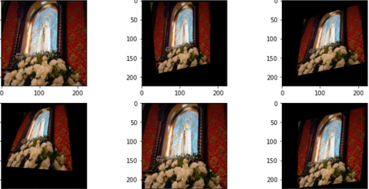

`RandomInvert` 는 색을 반전한다. 인자를 주지 않으면 기본 확률로 적용된다.

```python
_transforms = v2.Compose([
    v2.ToImage(),
    v2.Resize((224, 224)),
    v2.RandomInvert(),
    v2.ToDtype(torch.float32, scale=True) ] )
```

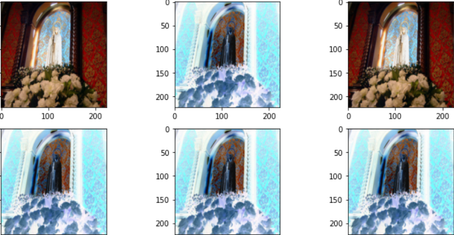

### RandomPosterize, RandomSolarize

`RandomPosterize` 는 각 색 채널의 비트 수를 줄인다. `bits=2` 이면 채널당 256 단계이던 색이 4 단계로 줄어 색이 뭉친다. 비트 연산이므로 uint8 이미지에 적용해야 하고, 그래서 `ToDtype()` 보다 앞에 둔다.

```python
_transforms = v2.Compose([
    v2.ToImage(),
    v2.Resize((224, 224)),
    # reducing the number of bits of each color channel.
    v2.RandomPosterize(bits=2,p=0.5),
    v2.ToDtype(torch.float32, scale=True) ] )
```

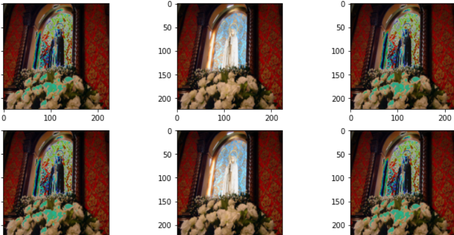

`RandomSolarize` 는 threshold 보다 밝은 픽셀만 반전한다. `threshold=200.0` 이면 0\~255 가운데 200 을 넘는 밝은 부분만 뒤집힌다.

```python
_transforms = v2.Compose([
    v2.ToImage(),
    v2.Resize((224, 224)),
    #inverting all pixel values above the threshold.
    v2.RandomSolarize(threshold=200.0),
    v2.ToDtype(torch.float32, scale=True) ] )
```

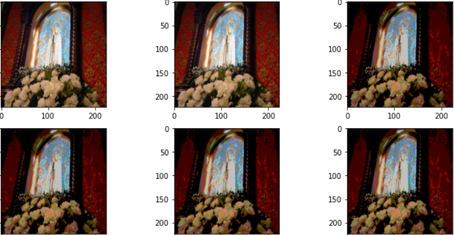

### AutoAugment, RandAugment, TrivialAugmentWide

지금까지는 transform 을 하나씩 골라 인자를 정했다. 이와 달리 **여러 변형을 자동으로 골라 조합해 주는** transform 도 있다. `AutoAugment` 는 데이터셋별로 미리 찾아 둔 policy 를 쓰며, `v2.AutoAugmentPolicy` 에 CIFAR10, IMAGENET, SVHN 세 가지가 준비되어 있다. 여기서는 IMAGENET policy 를 고른다.

```python
# “AutoAugment: Learning Augmentation Strategies from Data”.2019
policies = [v2.AutoAugmentPolicy.CIFAR10,
            v2.AutoAugmentPolicy.IMAGENET,
            v2.AutoAugmentPolicy.SVHN]

_transforms = v2.Compose([
    v2.ToImage(),
    v2.Resize((224, 224)),
    v2.AutoAugment(policies[1]),
    v2.ToDtype(torch.float32, scale=True) ] )
```

`RandAugment` 는 policy 탐색 없이 변형을 무작위로 골라 적용하고, `TrivialAugmentWide` 는 이미지마다 변형 하나를 무작위 강도로 적용한다. 둘 다 인자 없이 바로 쓸 수 있다.

```python
# “RandAugment: Practical automated data augmentation with a reduced search space”.2019
_transforms = v2.Compose([
    v2.ToImage(),
    v2.Resize((224, 224)),
    v2.RandAugment(),
    v2.ToDtype(torch.float32, scale=True) ] )
```

```python
# “TrivialAugment: Tuning-free Yet State-of-the-Art Data Augmentation”.2021
_transforms = v2.Compose([
    v2.ToImage(),
    v2.Resize((224, 224)),
    v2.TrivialAugmentWide(),
    v2.ToDtype(torch.float32, scale=True) ] )
```

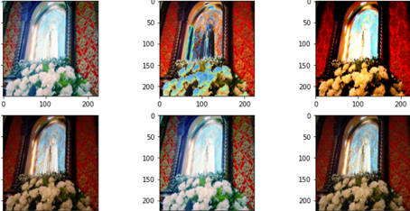

세 transform 은 이미지마다 다른 종류의 변형을 골라 쓰기 때문에, 한 격자 안에 색·대비·기하 변형이 섞여 나타난다. 노트북 주석에 각 기법이 제안된 논문 제목이 적혀 있다.

---

## 3.5.7 실습과제
<!-- 슬라이드 290 -->

augmentation option 을 다양하게 넣어 **동시에 작동**하도록 구성하고, 폴더에서 읽은 image 들에 적용하여 plot 으로 확인해 보자. 지금까지는 같은 이미지 9장으로 만든 CustomDataset 에 transform 을 하나씩 걸었지만, 이번에는 `ImageFolder` 의 `transform` 인자에 augmentation 을 넣는다. 이렇게 하면 DataLoader 가 batch 를 꺼낼 때마다 폴더의 실제 이미지가 매번 다르게 변형되어 나온다 — 실습 목적으로 든 real-time augmentation 이 바로 이것이다.

과제 예시는 다음과 같다. 회전, 밝기, 부분 잘라내기, 좌우 뒤집기 네 가지를 한 `Compose()` 에 넣었다.

```python
_transforms = v2.Compose([
    v2.ToImage(),
    v2.Resize((224, 224)),
    v2.RandomAffine(degrees=45),
    v2.ColorJitter(brightness=(0.5, 1.5)),
    v2.RandomResizedCrop(224, scale=[0.5, 1.0]),
    v2.RandomHorizontalFlip(0.5),
    v2.ToDtype(torch.float32, scale=True) ] )

## ImageFolder : folder로 구성된 image set을 위한 loader
train_imgs = ImageFolder(sp_train, transform=_transforms) #(image,label)
test_imgs = ImageFolder(sp_test, transform=_transforms)

## DataLoader : dataset과 sampler를 결합 batch단위 제공 #(image,label)*batch
train_loader = DataLoader(train_imgs, batch_size=320, shuffle=True)
test_loader = DataLoader(test_imgs, batch_size=320, shuffle=True)
```

```python
img_batch, l_batch = next(iter(test_loader))
plt.figure(figsize=(10,10))
for n in range(25):
    i = img_batch[n]
    ax = plt.subplot(5,5,n+1)
    plt.imshow(i.permute(1, 2, 0))
    plt.title(CLASS_train[l_batch[n]])
    plt.axis('off')
```

3.5.3 의 25장 격자 코드를 그대로 쓰되 loader 만 바꾼 것이다. 셀을 다시 실행할 때마다 같은 이미지가 다른 모습으로 나오는지, 그리고 class 이름(제목)은 변형과 무관하게 유지되는지 확인한다. 이 예시는 확인을 위해 test 용 loader 에도 같은 augmentation 을 걸었지만, 실제 학습에서는 무작위 변형을 train 용에만 걸고 test 용에는 basic transform 만 두는 것이 보통이다.

참고 셀: 노트북 끝에는 `v2.AugMix()` 를 같은 틀로 적용해 보는 셀이 더 있다.

---

## 3.5.8 정리
<!-- 슬라이드 290~303 -->

이 절은 폴더에 흩어진 이미지 파일을 PyTorch 가 먹을 수 있는 batch 로 만드는 전 과정을 다루었다.

- **폴더 구조가 label 이다.** class 이름의 폴더 아래에 이미지를 두면, `ImageFolder` 가 폴더 이름을 정렬한 순서로 label 번호를 매겨 (image, label) Dataset 을 만든다. class 목록도 같은 순서로 정렬해 두어야 번호를 이름으로 되돌릴 수 있다.
- **데이터 준비는 내려받기 → 분할 → 확인 순서다.** `download_and_extract_archive()` 로 받고, `splitfolders.ratio()` 로 train / val 을 나누고, `check_dir()` 와 `check_image()` 로 폴더·이미지 수와 실제 사진을 확인한다.
- **Dataset 은 한 장, DataLoader 는 batch 를 돌려준다.** Dataset 의 (3, 224, 224) 가 DataLoader 에서 (320, 3, 224, 224) 가 된다. `len(train_loader)` 는 한 epoch 의 iteration 수다.
- **transform 은 basic transform 과 augmentation 으로 나뉜다.** `ToImage()`, `Resize()`, `ToDtype()` 은 모든 이미지에 같은 결과를 내고, `Random*` 은 꺼낼 때마다 다른 결과를 낸다. `Compose()` 로 이어 Dataset 의 `transform` 에 넘긴다.
- **같은 이미지로 만든 batch 가 augmentation 의 시험대다.** `Dataset` 을 상속한 CustomDataset 과 `dataset_plt()` 로 RandomAffine, Flip, Rotation, ResizedCrop, ColorJitter, Equalize, Autocontrast, Perspective, Invert, Posterize, Solarize, 그리고 AutoAugment · RandAugment · TrivialAugmentWide 의 효과를 눈으로 확인했다.
- **transform 을 ImageFolder 에 걸면 real-time augmentation 이다.** 별도의 이미지 파일을 만들지 않아도 epoch 마다 다른 변형이 모델에 들어간다.

> **핵심 메시지**
> 이미지 데이터 처리의 핵심은 `Dataset.__getitem__()` 이다. 파일을 열고 transform 을 적용하는 일이 모두 거기서 한 장 단위로 일어나므로, augmentation 을 바꾸는 일은 `Compose()` 의 한 줄을 바꾸는 일로 끝난다.
