# 4.1 GoogLeNet

**학습 목표**

- Inception module 이 어떤 문제(깊고 넓게 만들수록 커지는 연산량·과적합·vanishing)를 풀기 위해 나왔는지 설명할 수 있다.
- Network in Network 과 1×1 convolution(bottleneck)이 파라미터를 줄이는 원리를 직접 계산으로 보일 수 있다.
- GoogLeNet 의 전체 구조(Average pooling, 보조 분류기)와 Inception v2·v3·v4 의 개선 방향을 설명할 수 있다.
- PyTorch 로 Inception module 과 GoogLeNet 을 코딩하고 torchinfo 로 구조와 파라미터 수를 확인할 수 있다.
- flower photos 데이터로 GoogLeNet 을 학습시켜 3.4 절의 CNN 모델·사전학습 모델과 성능·파라미터·연산량을 비교할 수 있다.

**이 절의 구성**

- 4.1.1 GoogLeNet 과 Inception module
- 4.1.2 Network in Network 과 1×1 convolution
- 4.1.3 GoogLeNet 의 구조 — Average pooling 과 보조 분류기
- 4.1.4 Inception 의 발전 — v2·v3·v4
- 4.1.5 Inception module 코딩
- 4.1.6 GoogLeNet 코딩과 구조 확인
- 4.1.7 PyTorch Hub 의 GoogLeNet 과 성능 비교 · 실습 4.1.1
- 4.1.8 정리

---

## 4.1.1 GoogLeNet 과 Inception module
<!-- 슬라이드 311~312 -->

GoogLeNet 은 22개 층(layer)으로 이루어진 깊은 신경망(DNN)이다. 효율을 극대화한 **Inception module** 을 제시하였고, 이 모듈을 반복해 쌓은 구조로 ILSVRC14 에서 차별화된 성적으로 우승하였다. 전체 구조를 한눈에 보면 같은 모양의 블록이 반복되는 것이 보이는데, 그 반복 단위가 Inception module 이다.

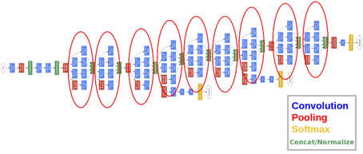

Inception 이라는 이름은 영화 "인셉션"에서 왔다. 영화의 "더 깊이 들어가야 한다"는 대사처럼, 망을 더 깊게 만들겠다는 뜻을 담은 이름이다.

### DNN 의 문제와 Inception module 의 출발점

망을 깊고 넓게 만들수록 성능은 올라간다. 그러나 그 대가로 연산량이 늘고, 과적합이 심해지고, 기울기가 사라지는 vanishing 문제도 커진다. 이 문제를 줄이는 방법으로 알려진 것이 망의 계층 간 연결을 **성기게(sparse)** 하는 것이다. 그러면 질문은 이렇게 정리된다.

> **핵심 질문**
> 각 계층의 표현 능력은 올리면서, 계층 사이의 연결은 어떻게 줄일 수 있을까?

Inception module 은 이 질문에 대한 답이다. 가장 단순한 형태(naive version)는 이전 층의 출력에 1×1, 3×3, 5×5 convolution 과 3×3 max pooling 을 **나란히** 적용하고, 네 결과를 채널 방향으로 이어 붙이는(filter concatenation) 것이다. 하나의 큰 필터 대신 크기가 다른 여러 필터를 병렬로 두어, 각 층이 여러 스케일의 특징을 동시에 뽑게 한다.

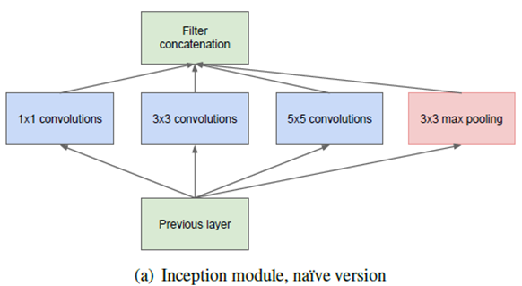

### Inception module 의 효과

Inception module 의 효과는 파라미터 수(#P)로 바로 드러난다. GoogLeNet 을 기준(1배)으로 두면 다른 모델의 파라미터 수는 다음과 같다.

| 모델 | 파라미터 수(#P) | GoogLeNet 대비 |
|---|---|---|
| AlexNet | 61M | 9배 |
| VGG-16 | 138M | 20배 |
| GoogLeNet | 7M | 1 |

즉 GoogLeNet 은 AlexNet 보다 훨씬 깊고 넓은데도 파라미터는 9분의 1 이다. "깊고, 넓고, 좁은" 망이 Inception module 로 실현된 것이다.

여러 모델의 연산량과 파라미터를 함께 비교한 표는 다음과 같다. MACC 는 곱셈-누산(multiply-accumulate) 연산 수, COMP·ADD·DIV 는 각각 비교·덧셈·나눗셈 연산 수, Activations 는 활성값 개수, Params 는 파라미터 수, SIZE 는 모델 파일 크기(MB)다.

| Model | MACC | COMP | ADD | DIV | Activations | Params | SIZE(MB) |
|---|---|---|---|---|---|---|---|
| SimpleNet | 1.9G | 1.82M | 1.5M | 1.5M | 6.38M | 6.4M | 24.4 |
| SqueezeNet | 861.34M | 9.67M | 226K | 1.51M | 12.58M | 1.25M | 4.7 |
| Inception v4* | 12.27G | 21.87M | 53.42M | 15.09M | 72.56M | 42.71M | 163 |
| Inception v3* | 5.72G | 16.53M | 25.94M | 8.97M | 41.33M | 23.83M | 91 |
| Incep-Resv2* | 13.18G | 31.57M | 38.81M | 25.06M | 117.8M | 55.97M | 214 |
| ResNet-152 | 11.3G | 22.33M | 35.27M | 22.03M | 100.11M | 60.19M | 230 |
| ResNet-50 | 3.87G | 10.89M | 16.21M | 10.59M | 46.72M | 25.56M | 97.70 |
| AlexNet | 7.27G | 17.69M | 4.78M | 9.55M | 20.81M | 60.97M | 217.00 |
| GoogleNet | 16.04G | 161.07M | 8.83M | 16.64M | 102.19M | 7M | 40 |
| NIN | 11.06G | 28.93M | 380K | 20K | 38.79M | 7.6M | 29 |
| VGG16 | 154.7G | 196.85M | 10K | 10K | 288.03M | 138.36M | 512.2 |

표에서 GoogleNet 의 파라미터(7M)와 모델 크기(40MB)가 VGG16(138.36M, 512.2MB)이나 AlexNet(60.97M, 217MB)에 비해 얼마나 작은지 확인할 수 있다.

---

## 4.1.2 Network in Network 과 1×1 convolution
<!-- 슬라이드 313~314 -->

Inception module 의 특징은 두 가지로 요약된다. 하나는 **Network in Network(NiN)** 이고, 다른 하나는 **1×1 convolution(bottleneck)** 이다. 이 둘은 서로 이어져 있다.

### Network in Network

Convolution 층 자체는 선형 연산이다. 필터를 입력 위에서 미끄러뜨리며 가중합을 구할 뿐이므로, 한 층이 표현할 수 있는 것은 선형 함수에 머문다. Network in Network 은 이 한계를 넘기 위해 convolution 뒤에 작은 MLP(다층 퍼셉트론)를 붙인 **MlpConv layer** 를 제안하였다. 필터가 지나가는 각 위치에서 작은 신경망이 한 번 더 계산하므로, 층 하나에 비선형 특성이 추가된다.

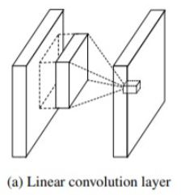

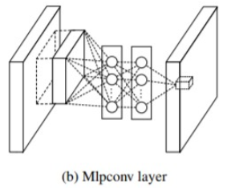

GoogLeNet 은 이 MLP 를 **1×1 convolution** 으로 바꾸었다. 1×1 convolution 은 공간 방향으로는 아무것도 섞지 않고 채널 방향으로만 가중합을 구하므로, 각 위치에 같은 작은 완전연결층을 적용하는 것과 같다. 그래서 MLP 를 대신하면서도 convolution 연산으로 구현되는 새로운 NiN 구조가 된다.

여기에는 또 다른 의미가 담겨 있다. 1×1 convolution 은 **채널 간 상관관계(cross-channel correlation)** 만 다루고, 3×3·5×5 convolution 은 **공간 상관관계(spatial correlation)** 를 다룬다. 두 종류의 상관관계를 적절히 분리해 두었기 때문에, 채널 간의 관계와 이미지의 지역적인 관계를 따로따로 학습할 수 있는 구조가 된다.

이 생각을 Inception module 에 적용한 것이 **차원 축소가 들어간 Inception module** 이다. 3×3 과 5×5 convolution 앞에 1×1 convolution 을 두어 채널 수를 먼저 줄이고, max pooling 뒤에도 1×1 convolution 을 두어 출력 채널 수를 조절한다.

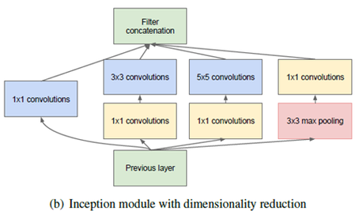

### 1×1 convolution(bottleneck)의 효과

1×1 convolution 을 병목(bottleneck)으로 쓰면 다음 효과가 연쇄적으로 생긴다.

- **차원 축소(dimension reduction)** — 채널 수가 줄어든다.
- **파라미터 감소(#P reduce)** — 뒤따르는 큰 필터가 적은 채널만 보므로 가중치가 줄어든다.
- 가중치가 줄면 학습 효율이 올라가고, 결국 망 전체의 효율이 올라간다.

차원 축소를 예로 계산해 보자. 18 채널 입력을 1×1 convolution 으로 5 채널로 줄인 뒤 3×3 convolution 으로 30 채널을 만드는 경우와, 18 채널에서 바로 3×3 convolution 으로 30 채널을 만드는 경우를 비교한다. 파라미터 수는 "입력 채널 × 커널 높이 × 커널 너비 × 출력 채널 + 편향(출력 채널 수)" 으로 센다.

| 경로 | 파라미터 수 계산 | 합계 |
|---|---|---|
| 1×1 (18→5) 다음 3×3 (5→30) | $18 \times 1 \times 1 \times 5 + 5 = 95$, $5 \times 3 \times 3 \times 30 + 30 = 1{,}380$ | $95 + 1{,}380 = 1{,}475$ |
| 3×3 (18→30) 바로 적용 | $18 \times 3 \times 3 \times 30 + 30$ | $4{,}890$ |

1×1 convolution 층을 하나 더 넣었는데도 파라미터는 4,890 에서 1,475 로 줄어든다. 채널 수를 18 에서 5 로 줄인 뒤에 3×3 필터를 적용하기 때문이다.

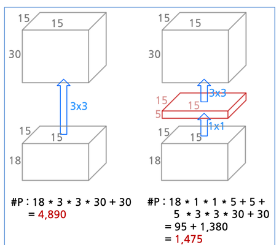

이렇게 채널을 줄여도 괜찮은 이유는 feature map 중에 중복되거나 실제로 쓰이지 않는 것들이 있기 때문이다. 그래서 bottleneck 은 깊이(채널 수)를 크게 줄이지 않는 한 성능에 거의 영향을 미치지 않는다. 게다가 GoogLeNet 에는 한 경로에서 잃은 정보를 보상할 **병렬 layer** 가 있다. 1×1·3×3·5×5·pooling 네 경로가 서로 다른 정보를 뽑아 합치므로, 한 경로의 채널을 줄여도 전체 표현력은 유지된다.

> **핵심 메시지**
> 1×1 convolution 은 채널 방향의 작은 신경망이다. 채널 간 상관관계를 먼저 압축한 뒤 큰 필터로 공간 상관관계를 보게 하면, 층은 늘어도 파라미터는 줄어든다.

---

## 4.1.3 GoogLeNet 의 구조 — Average pooling 과 보조 분류기
<!-- 슬라이드 315~316 -->

### Fully connected 층을 Average pooling 으로

GoogLeNet 은 마지막 단의 fully connected(FC) 층을 줄이고 **Average pooling** 으로 바꾸었다. AlexNet·VGG 에서 파라미터의 대부분을 차지하던 FC 층이 사라지므로 파라미터 수가 극적으로 감소한다. 마지막 Inception module 의 출력(7×7×1024)에 7×7 average pooling 을 적용하면 1×1×1024 가 되고, 그 뒤에 분류를 위한 FC 층 하나와 softmax 만 남는다.

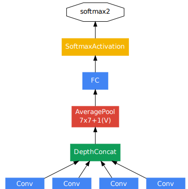

GoogLeNet 의 층별 구성은 다음 표와 같다. patch size/stride 는 필터 크기와 stride, output size 는 그 층을 지난 뒤의 feature map 크기(높이×너비×채널), params 는 파라미터 수, ops 는 연산량이다.

| type | patch size / stride | output size | params | ops |
|---|---|---|---|---|
| convolution | 7×7/2 | 112×112×64 | 2.7K | 34M |
| max pool | 3×3/2 | 56×56×64 | | |
| convolution | 3×3/1 | 56×56×192 | 112K | 360M |
| max pool | 3×3/2 | 28×28×192 | | |
| inception (3a) | | 28×28×256 | 159K | 128M |
| inception (3b) | | 28×28×480 | 380K | 304M |
| max pool | 3×3/2 | 14×14×480 | | |
| inception (4a) | | 14×14×512 | 364K | 73M |
| inception (4b) | | 14×14×512 | 437K | 88M |
| inception (4c) | | 14×14×512 | 463K | 100M |
| inception (4d) | | 14×14×528 | 580K | 119M |
| inception (4e) | | 14×14×832 | 840K | 170M |
| max pool | 3×3/2 | 7×7×832 | | |
| inception (5a) | | 7×7×832 | 1072K | 54M |
| inception (5b) | | 7×7×1024 | 1388K | 71M |
| avg pool | 7×7/1 | 1×1×1024 | | |
| dropout (40%) | | 1×1×1024 | | |
| linear | | 1×1×1000 | 1000K | 1M |
| softmax | | 1×1×1000 | | |

표를 읽으면 구조가 보인다. 앞부분은 보통의 convolution 과 max pooling 두 단으로 224×224 입력을 28×28×192 까지 줄이고, 그 뒤로 Inception module 이 3a·3b, 4a\~4e, 5a·5b 의 세 묶음(각각 28×28, 14×14, 7×7 크기)으로 이어진다. 묶음 사이의 max pool 이 크기를 절반으로 줄이고, 묶음 안에서는 Inception module 이 채널 수만 늘려 간다(256→480, 512→528→832, 832→1024). 마지막의 avg pool 이 7×7 을 1×1 로 만들고, dropout 40% 를 거쳐 linear(1000 클래스)와 softmax 로 끝난다. linear 층의 파라미터가 1000K 로 하나의 Inception module 과 비슷한 수준에 그치는 것이 FC 층을 줄인 효과다.

### 보조 분류기의 역할

GoogLeNet 은 망 중간에 두 개의 **보조 분류기(auxiliary classifier)** 를 둔다. 망이 깊어짐에 따라 역전파되는 기울기가 앞쪽 층까지 닿지 못하는 vanishing 이 생기는데, 이를 줄이기 위한 장치다.

- 보조 분류기에서도 loss 를 계산해 역전파(backprop)를 수행한다. 중간 층에 기울기를 직접 공급하는 셈이다.
- 보조 분류기의 loss 는 0.3 배로 줄여 최종 loss 계산에 더한다.
- 보조 분류기에는 Dropout(0.7)을 적용한다.
- 학습이 끝나면 보조 분류기는 제거한다. 추론에는 주 분류기만 쓴다.

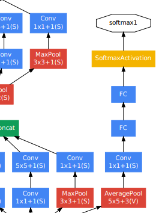

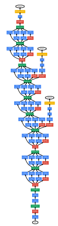

---

## 4.1.4 Inception 의 발전 — v2·v3·v4
<!-- 슬라이드 317~318 -->

### Inception-v2, v3 — convolution 의 분해

Inception-v2·v3 는 2015년 12월의 논문 "Rethinking the Inception Architecture for Computer Vision" 에서 제안되었다. 핵심은 convolution 을 지속적으로 개선한 것, 곧 **큰 필터를 작은 필터의 조합으로 분해**하는 것이다.

1. **5×5 → 3×3 + 3×3** — 5×5 convolution 하나를 3×3 convolution 두 개를 쌓은 것으로 바꾼다. 3×3 을 두 번 거치면 수용 영역(receptive field)은 5×5 와 같지만 연산은 28% 감소한다.
2. **n×n → 1×n + n×1** — n×n convolution 을 1×n 과 n×1 의 두 단계로 나눈다. 예를 들어 3×3 은 1×3 과 3×1 로 나뉜다. 이렇게 하면 연산이 33% 감소한다.

원래의 Inception module 과 두 가지 분해를 적용한 module 을 그림으로 비교하면 다음과 같다.

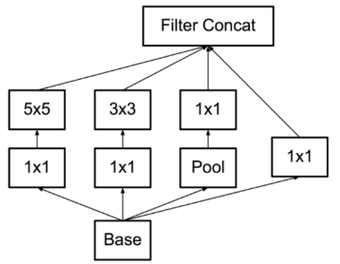

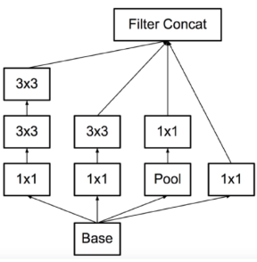

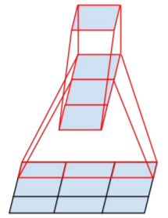

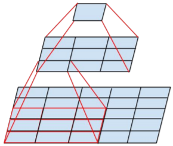

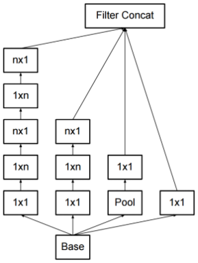

### Inception-v4

Inception-v4 는 2016년 논문 "Inception-v4, Inception-ResNet and the Impact of Residual Connections on Learning" 에서 제안되었다. 전체 구조는 입력(299×299×3)부터 다음 순서로 이어진다.

1. **Stem** — 입력을 받아 35×35×384 로 만드는 앞단.
2. **4 × Inception-A** — 35×35 크기에서 동작하는 module 4개.
3. **Reduction-A** — 35×35 를 17×17×1024 로 줄인다.
4. **7 × Inception-B** — 17×17 크기에서 동작하는 module 7개.
5. **Reduction-B** — 17×17 을 8×8×1536 으로 줄인다.
6. **3 × Inception-C** — 8×8 크기에서 동작하는 module 3개.
7. Average Pooling → Dropout(keep 0.8) → Softmax(1000).

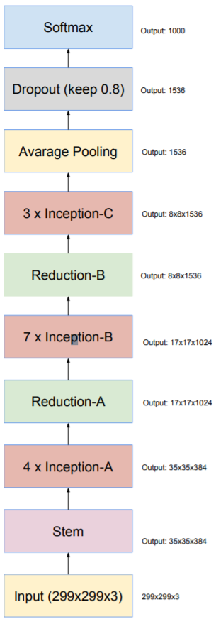

각 블록의 내부는 다음과 같다. 그림 안의 V 는 padding 없는(valid) convolution, 괄호 안 숫자는 출력 채널 수다.

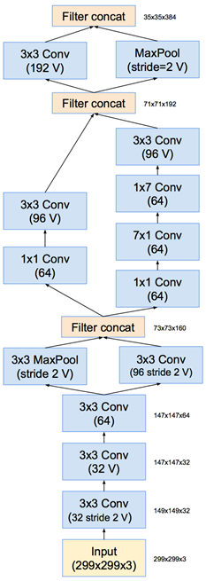

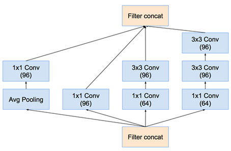

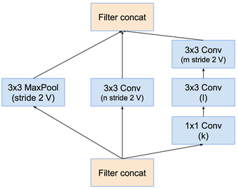

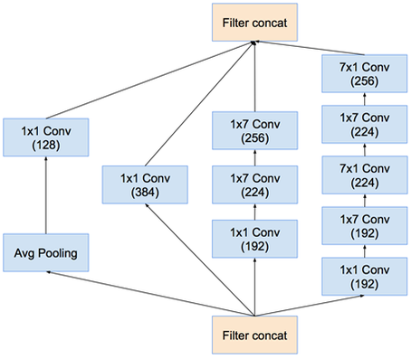

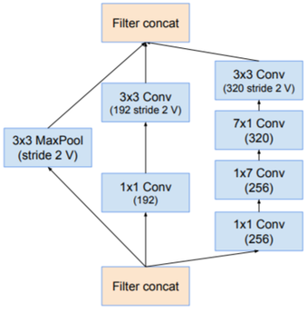

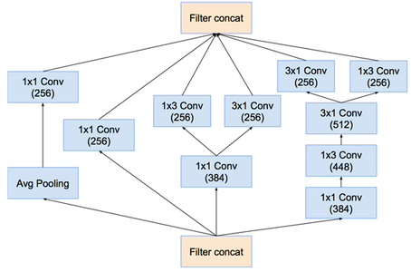

v2·v3 에서 도입한 분해가 v4 의 세 종류 module 에 그대로 쓰인다. Inception-A 는 3×3 두 개로 5×5 를 대신하고, Inception-B 는 1×7 과 7×1 로 7×7 을 대신하며, Inception-C 는 1×3 과 3×1 을 나란히 둔다. Reduction 블록은 stride 2 convolution 과 max pooling 을 병렬로 두어 크기를 줄이는 역할만 맡는다.

---

## 4.1.5 Inception module 코딩
<!-- 슬라이드 319~320 -->

이제 Inception module 을 PyTorch 로 직접 만든다. 이 소절과 다음 소절, 그리고 실습 4.1.1 의 코드는 모두 노트북 `code/4.1.1.GoogleNet.ipynb` 에 있다.

### 인자와 반환값

Inception module 은 네 갈래 경로의 채널 수를 인자로 받는다. 이름은 다음과 같이 정한다.

| 인자 | 뜻 |
|---|---|
| `in_dim` | 입력 채널 수 |
| `out_dim_1` | 1×1 conv 출력 채널 수 |
| `mid_dim_3` | 3×3 conv 이전 1×1 conv 출력 채널 수 |
| `out_dim_3` | 3×3 conv 출력 채널 수 |
| `mid_dim_5` | 5×5 conv 이전 1×1 conv 출력 채널 수 |
| `out_dim_5` | 5×5 conv 출력 채널 수 |
| `pool_dim` | max pooling 다음 1×1 conv 출력 채널 수 |

반환값은 네 경로의 결과를 **채널 방향으로 concatenate** 한 것이다. 따라서 출력 채널 수는 `out_dim_1 + out_dim_3 + out_dim_5 + pool_dim` 이 된다. `mid_dim_3`, `mid_dim_5` 는 경로 안에서만 쓰이는 병목 채널 수라 출력 채널 수에는 들어가지 않는다. GoogLeNet 의 첫 convolution 채널 수 `base_dim` 은 64 로 둔다.

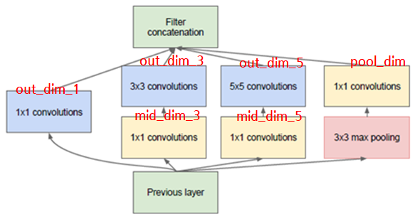

### 네 갈래 경로 함수

`nn.Conv2d` 의 인자 순서는 `Conv2d(in, out, kernel_size, stride, padding)` 이다. 네 경로를 각각 작은 `nn.Sequential` 로 만드는 함수를 먼저 정의한다.

```python
## Conv2d(in_c, out_c, kernel_size, stride, padding)

def conv_1(in_dim,out_dim):
    module = nn.Sequential(
        nn.Conv2d(in_dim,out_dim,1,1), #(in,out,kernel_size,stride)
        nn.ReLU())
    return module

def conv_1_3(in_dim,mid_dim,out_dim):
    module = nn.Sequential(
        nn.Conv2d(in_dim,mid_dim,1,1),
        nn.ReLU(),
        nn.Conv2d(mid_dim,out_dim,3,1,1),
        nn.ReLU())
    return module

def conv_1_5(in_dim,mid_dim,out_dim):
    module = nn.Sequential(
        nn.Conv2d(in_dim,mid_dim,1,1),
        nn.ReLU(),
        nn.Conv2d(mid_dim,out_dim,5,1,2),
        nn.ReLU())
    return module

def max_3_1(in_dim,out_dim):
    module = nn.Sequential(
        nn.MaxPool2d(kernel_size=3,stride=1,padding=1),
        nn.Conv2d(in_dim,out_dim,1,1),
        nn.ReLU())
    return module
```

- `conv_1` — 1×1 convolution 한 층. kernel 1, stride 1 이므로 feature map 크기는 그대로고 채널만 `out_dim` 으로 바뀐다.
- `conv_1_3` — 1×1 convolution 으로 `mid_dim` 채널로 줄인 뒤 3×3 convolution 을 적용한다. 3×3 에 padding 1 을 주어 크기가 줄지 않게 한다.
- `conv_1_5` — 같은 방식으로 1×1 다음 5×5 를 적용한다. 5×5 에는 padding 2 를 준다.
- `max_3_1` — 3×3 max pooling(stride 1, padding 1)으로 크기를 유지한 채 pooling 하고, 1×1 convolution 으로 채널 수를 `out_dim` 으로 맞춘다.

네 경로 모두 stride 1 에 크기를 유지하는 padding 을 썼다는 점이 중요하다. 네 결과의 높이·너비가 같아야 채널 방향으로 이어 붙일 수 있기 때문이다. 각 convolution 뒤에는 ReLU 를 두어 비선형성을 준다.

### Inception module 클래스

네 경로 함수를 모아 `nn.Module` 로 만든다. `__init__` 에서 네 경로를 만들어 두고, `forward` 에서 같은 입력 `x` 를 네 경로에 넣은 뒤 `torch.cat` 으로 합친다.

```python
# Inception 모듈 정의
class inception_module(nn.Module):
    def __init__(self,in_dim,out_dim_1,mid_dim_3,out_dim_3,mid_dim_5,out_dim_5,pool_dim):
        super(inception_module,self).__init__()
        # 1x1 Convolution
        self.conv_1 = conv_1(in_dim,out_dim_1)
        # 1x1 Convolution -> 3x3 Convolution
        self.conv_1_3 = conv_1_3(in_dim,mid_dim_3,out_dim_3)
        # 1x1 Convolution -> 5x5 Convolution
        self.conv_1_5 = conv_1_5(in_dim,mid_dim_5,out_dim_5)
        # 3x3 MaxPooling -> 1x1 Convolution
        self.max_3_1 = max_3_1(in_dim,pool_dim)

    def forward(self,x):
        out_1 = self.conv_1(x)
        out_2 = self.conv_1_3(x)
        out_3 = self.conv_1_5(x)
        out_4 = self.max_3_1(x)
        # concat
        output = torch.cat([out_1,out_2,out_3,out_4],1)#(bs,c,h,w)
        return output
```

`torch.cat(..., 1)` 의 두 번째 인자 1 은 이어 붙일 차원이다. PyTorch 의 이미지 텐서는 `(batch, channel, height, width)` 순서이므로 차원 1 이 채널이다. 네 경로의 입력이 모두 같은 `x` 이고 출력이 채널 방향으로 합쳐진다는 것, 이것이 "병렬 layer" 의 구현이다.

---

## 4.1.6 GoogLeNet 코딩과 구조 확인
<!-- 슬라이드 321~322 -->

### 원래 구조에서 바꾼 것

교재의 GoogLeNet 코드는 원래 구조에서 두 가지를 바꾼다.

- **LRN → BN** — 원래 앞단에 있던 Local Response Normalization 대신 Batch Normalization 을 쓴다.
- **보조 분류기 제거** — 학습 후 제거되는 두 보조 분류기는 처음부터 넣지 않는다.

### 학습 뼈대 — Lightning 래퍼

모델 클래스를 `L.LightningModule` 로 만들면 `Trainer` 가 학습 루프를 대신 돌려 준다. `training_step`, `validation_step`, `configure_optimizers` 만 정의한 래퍼 클래스를 두고, GoogLeNet 은 이를 상속한다. 클래스 수 5(flower photos)에 맞춘 accuracy 를 계산하므로 이름을 `Wrap_5` 로 두었다.

```python
class Wrap_5(L.LightningModule):
    def training_step(self, batch, batch_idx):
        x, y = batch
        y_pred = self(x)
        loss = F.cross_entropy(y_pred, y)
        acc = FM.accuracy(y_pred, y, task="multiclass",num_classes=5)
        metrics={'loss':loss, 'acc':acc}
        self.log_dict(metrics, prog_bar=True)
        return loss

    def validation_step(self, batch, batch_idx):
        x, y = batch
        y_pred = self(x)
        loss = F.cross_entropy(y_pred, y)
        acc = FM.accuracy(y_pred, y, task="multiclass",num_classes=5)
        metrics = {'val_loss':loss, 'val_acc':acc}
        self.log_dict(metrics, prog_bar=True)

    def configure_optimizers(self):
        return torch.optim.Adam(self.parameters(), lr=0.001)
```

손실은 `cross_entropy`, 정확도는 torchmetrics 의 `accuracy`, 최적화는 Adam(lr 0.001)이다. `log_dict` 로 기록한 값은 뒤에서 `CSVLogger` 가 파일로 남긴다.

### GoogLeNet 클래스

앞 소절의 `inception_module` 을 쌓아 GoogLeNet 을 만든다. 4.1.3 의 층별 표와 나란히 놓고 읽으면 각 줄이 표의 어느 행인지 보인다.

```python
# Conv2d(in_c, out_c, kernel_size, stride, padding)

batch_size = 16

class GoogLeNet(Wrap_5):
    def __init__(self, base_dim=64, num_classes=1000):
        super(GoogLeNet, self).__init__()
        self.num_classes=num_classes
        self.layer_1 = nn.Sequential(
            nn.Conv2d(3,base_dim,7,2,3),
            nn.BatchNorm2d(base_dim),
            nn.ReLU(),
            nn.MaxPool2d(3,2,1),
            nn.Conv2d(base_dim,base_dim*3,3,1,1),
            nn.BatchNorm2d(base_dim*3),
            nn.ReLU(),
            nn.MaxPool2d(3,2,1),
        )
        self.layer_2 = nn.Sequential(
            inception_module(base_dim*3,64,96,128,16,32,32),  #256=64+128+32+32
            inception_module(base_dim*4,128,128,192,32,96,64),#480
            nn.MaxPool2d(3,2,1),
        )
        self.layer_3 = nn.Sequential(
            inception_module(480,192,96,208,16,48,64),        #512
            inception_module(512,160,112,224,24,64,64),       #512
            inception_module(512,128,128,256,24,64,64),       #512
            inception_module(512,112,144,288,32,64,64),       #528
            inception_module(528,256,160,320,32,128,128),     #832
            nn.MaxPool2d(3,2,1),
        )
        self.layer_4 = nn.Sequential(
            inception_module(832,256,160,320,32,128,128),     #832
            inception_module(832,384,192,384,48,128,128),     #1024
            nn.AvgPool2d(7,1),
        )
        self.layer_5 = nn.Dropout2d(0.4)
        self.fc_layer = nn.Linear(1024,self.num_classes)

    def forward(self, x):
        out = self.layer_1(x)
        out = self.layer_2(out)
        out = self.layer_3(out)
        out = self.layer_4(out)  #(bs,1024,1,1)
        out = self.layer_5(out)
        out = out.view(-1, 1024) #(bs,1024)
        out = self.fc_layer(out) #(bs,classes)
        return out
```

- `layer_1` — 앞단. 7×7 stride 2 convolution(3→64)과 3×3 stride 2 max pooling, 3×3 convolution(64→192)과 다시 max pooling 이다. 각 convolution 뒤에 `BatchNorm2d` 와 ReLU 를 두었다(LRN → BN). 224×224 입력이 여기서 56×56 을 거쳐 28×28×192 가 된다.
- `layer_2` — Inception (3a), (3b). 첫 module 의 출력 채널이 64+128+32+32 = 256, 둘째가 480 이다. 주석의 숫자가 이 합계다. max pooling 으로 14×14 가 된다.
- `layer_3` — Inception (4a)\~(4e). 출력 채널이 512, 512, 512, 528, 832 로 늘어나고 max pooling 으로 7×7 이 된다.
- `layer_4` — Inception (5a), (5b). 출력 채널 832, 1024 이고, `AvgPool2d(7,1)` 이 7×7 을 1×1 로 만든다.
- `layer_5` — Dropout(0.4). 표의 dropout (40%) 에 해당한다.
- `fc_layer` — 1024 → `num_classes`. `forward` 에서 `view(-1, 1024)` 로 `(bs,1024,1,1)` 을 `(bs,1024)` 로 펴서 넣는다.

각 `inception_module(...)` 의 인자는 표의 `in_dim, out_dim_1, mid_dim_3, out_dim_3, mid_dim_5, out_dim_5, pool_dim` 순서다. 예를 들어 `inception_module(480,192,96,208,16,48,64)` 는 480 채널을 받아 1×1 로 192, 1×1(96)→3×3 으로 208, 1×1(16)→5×5 로 48, pooling→1×1 로 64 채널을 만들어 총 512 채널을 낸다.

### 구조 확인

모델을 만들고 `torchinfo.summary` 로 층별 출력 크기와 파라미터 수를 확인한다. 기본값 `num_classes=1000` 으로 만들면 ImageNet 용 GoogLeNet 이 된다.

```python
img_shape = (224, 224, 3)
model = GoogLeNet()
#model = GoogLeNet(num_classes=5)
summary(model, input_size=(16, 3, 224, 224))
```

```python
model
```

`summary` 의 `input_size` 는 `(batch, channel, height, width)` 다. 출력의 각 행이 앞의 층별 표와 맞는지, 마지막 Linear 의 출력이 클래스 수와 같은지 확인한다. `model` 을 그대로 출력하면 `nn.Sequential` 안에 어떤 층이 어떤 순서로 들어 있는지 트리 형태로 볼 수 있다.

층별 입력·출력·커널·stride·활성함수(Af)와 Inception module 의 인자를 정리한 표는 다음과 같다. inception module 열의 표기는 `out_dim_1,(mid_dim_3,out_dim_3),(mid_dim_5,out_dim_5),pool_dim` 이다.

| 층 | 입력 | 출력 | 커널 | Stride | Af | inception module |
|---|---|---|---|---|---|---|
| 입력 | (224,224,3) | | | | | |
| Conv | (224,224,3) | (56,56,96) | (7,7) | 2 | ReLU | |
| maxpool | (56,56,256) | (27,27,256) | (3,3) | 2 | | |
| LRN | | | | | | |
| Conv | (56,56,96) | (56,56,64) | (1,1) | 1 | ReLU | |
| Conv | (56,56,64) | (56,56,192) | (3,3) | 1 | ReLU | |
| LRN | | | | | | |
| maxpool | (56,56,192) | (28,28,192) | (3,3) | 2 | | |
| Inception module | (27,27,192) | (28,28,256) | | | ReLU | 64,(96,128),(16,32),32 |
| Inception module | (27,27,256) | (28,28,480) | | | ReLU | 128,(128,192),(32,96),64 |
| maxpool | (28,28,480) | (14,14,480) | (3,3) | 2 | | |
| Inception module | (14,14,256) | (14,14,512) | | | ReLU | 192,(96,208),(16,48),64 |
| Inception module | (14,14,512) | (14,14,512) | | | ReLU | 160,(112,224),(24,64),64 |
| Inception module | (14,14,512) | (14,14,512) | | | ReLU | 128,(128,256),(24,64),64 |
| Inception module | (14,14,512) | (14,14,528) | | | ReLU | 112,(144,288),(32,64),64 |
| Inception module | (14,14,528) | (14,14,832) | | | ReLU | 256,(160,320),(32,128),128 |
| maxpool | (14,14,832) | (7,7,832) | (3,3) | 2 | | |
| Inception module | (7,7,832) | (7,7,832) | | | ReLU | 256,(160,320),(32,128),128 |
| Inception module | (7,7,832) | (7,7,1024) | | | ReLU | 384,(192,384),(48,128),128 |
| Average pool | (7,7,1024) | (1,1,1024) | (7,7) | 1 | | |
| Dropout(0.4) | (1,1,1024) | (1,1,1024) | | | | |
| FCN | (1,1,1024) | (1,1,1000) | | | | |
| softmax | (1,1,1000) | (1,1,1000) | | | | |

모델을 그래프로 그려 보면 Inception module 의 병렬 구조가 눈에 들어온다. 다음 두 그림은 학습된 모델을 내보내 그래프 뷰어로 연 것으로, 각 Conv 노드에 가중치 W 의 크기(출력 채널×입력 채널×커널 높이×커널 너비)와 편향 B 의 크기가 적혀 있다.


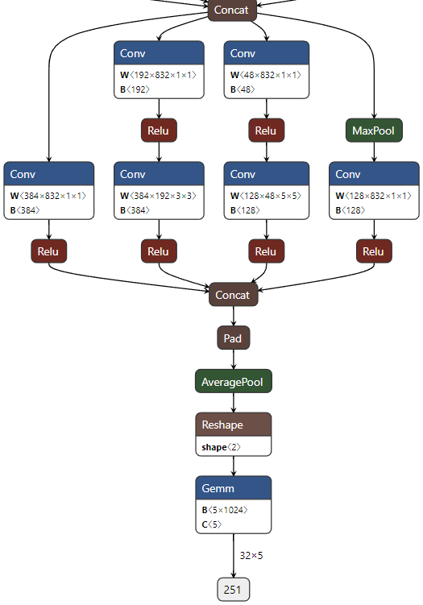

그래프의 첫 Inception module 을 보면 `inception_module(192,64,96,128,16,32,32)` 의 인자가 그대로 W 의 크기로 나타난다. 1×1 경로의 W 가 64×192×1×1, 3×3 경로가 96×192×1×1 뒤에 128×96×3×3, 5×5 경로가 16×192×1×1 뒤에 32×16×5×5, pooling 경로가 32×192×1×1 이다. 뒷부분 그림의 Gemm 은 FC 층으로, B 가 5×1024 인 것은 이 그래프가 클래스 5개짜리 모델을 그린 것이기 때문이다.

---

## 4.1.7 PyTorch Hub 의 GoogLeNet 과 성능 비교
<!-- 슬라이드 323~324 -->

### GoogLeNet in PyTorch Hub

직접 코딩하지 않아도 ImageNet 으로 학습된 GoogLeNet 과 Inception v3 모델을 PyTorch 가 제공한다. 가져오는 방법은 두 가지다.

- **GitHub 에서 가져오기** — `torch.hub` 로 https://github.com/pytorch/vision 저장소의 모델을 받는다.
- **torchvision.models 에서 가져오기** — `torchvision.models.googlenet(...)` 을 호출한다. 문서는 다음 두 곳이다.
  - https://pytorch.org/vision/stable/models.html#classification
  - https://pytorch.org/vision/stable/generated/torchvision.models.googlenet.html#torchvision.models.googlenet

`torchvision.models.googlenet` 의 문서를 정리하면 다음과 같다. 함수 서명은 `torchvision.models.googlenet(pretrained: bool = False, progress: bool = True, **kwargs) → GoogLeNet` 이고, "Going Deeper with Convolutions" 의 GoogLeNet(Inception v1) 구조이며 입력 크기는 최소 15×15 이어야 한다.

| 인자 | 뜻 |
|---|---|
| `pretrained` (bool) | True 이면 ImageNet 으로 사전학습된 모델을 돌려준다 |
| `progress` (bool) | True 이면 다운로드 진행 막대를 stderr 에 표시한다 |
| `aux_logits` (bool) | True 이면 학습에 도움이 되는 두 개의 보조 가지(auxiliary branch)를 추가한다. 기본값은 `pretrained=True` 이면 False, 아니면 True |
| `transform_input` (bool) | True 이면 ImageNet 학습 때와 같은 방법으로 입력을 전처리한다. 기본값은 `pretrained=True` 이면 True, 아니면 False |

`aux_logits` 의 기본값이 사전학습 모델에서는 False 인 것은 4.1.3 에서 본 대로 보조 분류기가 학습용 장치이기 때문이다.

### GoogLeNet 성능 비교

여러 CNN 모델을 정확도와 연산량의 평면에 놓고 비교한 그림을 보자. 가로축은 연산량(Operations, G-Ops), 세로축은 ImageNet Top-1 정확도(%), 원의 크기는 파라미터 수(5M 부터 155M 까지)다.

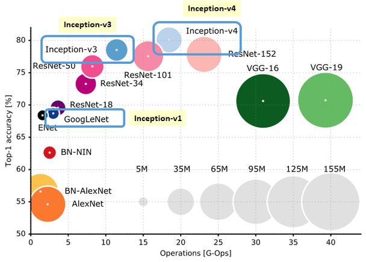

그림에서 GoogLeNet 은 왼쪽(적은 연산량)에 작은 원(적은 파라미터)으로 놓이면서도 AlexNet 보다 훨씬 높은 정확도를 낸다. 오른쪽의 VGG-16·VGG-19 는 큰 원에 연산량도 가장 많다. Inception-v3, v4 로 갈수록 정확도는 올라가지만 연산량과 파라미터도 함께 늘어난다는 것을 같은 그림에서 읽을 수 있다.

### 실습 4.1.1 — GoogLeNet 수정 및 flower photos 분류 학습
<!-- 슬라이드 325~328 -->

> 노트북: `code/4.1.1.GoogleNet.ipynb`
> [](https://colab.research.google.com/github/AI-BoostCamp/intermediate-deep-learning-pytorch/blob/main/code/4.1.1.GoogleNet.ipynb)

**목적** — GoogLeNet 으로 직접 학습해 본다. 앞에서 만든 GoogLeNet 에 flower photos dataset 을 적용하여 학습하고, pre-trained model 과의 성능 차이를 확인한다.

**실습 개요**

- flower photos dataset 학습하기
  - flower photos 를 사용하기 위해 모델을 수정한다(클래스 수 1000 → 5).
  - Dataset 을 준비한다.
  - Training 을 하고 성능을 확인한다.
- 3.4 절에서 개선한 모델(`CNN_BN`)을 수정하여 같은 데이터에 적용한다.
  - 15 epoch 까지만 학습하면서 두 모델을 비교한다.
  - 목표: 62% 이상.
- 두 모델의 parameter 와 total operation 을 비교한다.
- pre-trained GoogLeNet 을 불러와 추론해 보고, 그 결과가 왜 그런지 생각해 본다.

#### 1) Dataset 준비

flower photos 는 5 종류 꽃(daisy, dandelion, roses, sunflowers, tulips)의 사진이 폴더별로 들어 있는 데이터다. 압축 파일을 받아 풀고, 폴더 구조를 그대로 train/val 로 나눈 뒤 `ImageFolder` 와 `DataLoader` 로 읽는다.

```python
from torchvision.datasets.utils import download_and_extract_archive

dataset_url = \
      "https://storage.googleapis.com/download.tensorflow.org/example_images/flower_photos.tgz"
root = './'
data_dir='Dataset'
download_and_extract_archive(dataset_url, root, data_dir)
data_dir = root+data_dir+'/flower_photos'
data_dir
```

```python
import splitfolders
import pathlib

sp_path="flower_photos_sp"
splitfolders.ratio(data_dir, output=sp_path,
    seed=1337, ratio=(.7, .3), group_prefix=None, move=True )
sp_train = pathlib.Path(sp_path+'/train')
sp_test = pathlib.Path(sp_path+'/val')
sp_train,sp_test
```

`splitfolders.ratio` 는 클래스 폴더마다 7:3 비율로 파일을 나누어 `train/`, `val/` 아래에 같은 폴더 구조로 옮긴다. `seed` 를 고정해 두면 나눌 때마다 같은 결과가 나온다.

```python
# Imagae size 결정 **
IMG_SIZE = 224
batch_size = 32 #64
```

```python
from torchvision.transforms import v2
from torchvision.datasets import ImageFolder
from torch.utils.data import DataLoader

## loader에 적용할 transform
train_transforms = v2.Compose([
    v2.ToImage(),
    v2.Resize((IMG_SIZE, IMG_SIZE)),
    # v2.RandomAffine(degrees=40, translate=(0.2, 0.2), shear=0.2),
    # v2.RandomResizedCrop(IN_IMG_SIZE, scale=[0.8, 1.0]),
    # v2.RandomHorizontalFlip(0.5),
    v2.ToDtype(torch.float32, scale=True) ] )

test_transforms = v2.Compose([
    v2.ToImage(),
    v2.Resize((IMG_SIZE, IMG_SIZE)),
    v2.ToDtype(torch.float32, scale=True) ] )

## ImageFolder : folder로 구성된 image set을 위한 loader
train_imgs = ImageFolder(sp_train, transform=train_transforms) #(image,label)
test_imgs = ImageFolder(sp_test, transform=test_transforms)

## DataLoader : dataset과 sampler를 결합 batch단위 제공 #(image,label)*batch
train_loader = DataLoader(train_imgs, batch_size=batch_size, shuffle=True, num_workers=4)
test_loader = DataLoader(test_imgs, batch_size=batch_size, shuffle=False, num_workers=4)

len(train_imgs),len(test_imgs)
```

이미지 크기를 224 로 둔 이유는 GoogLeNet 의 `AvgPool2d(7,1)` 이 7×7 feature map 을 전제로 하기 때문이다. 224 입력이 앞단과 세 번의 max pooling 을 거쳐 정확히 7×7 이 된다. transform 은 텐서로 바꾸고(`ToImage`), 크기를 맞추고(`Resize`), 0\~1 실수로 스케일링(`ToDtype(..., scale=True)`)하는 것만 두었다. 주석으로 남긴 `RandomAffine`, `RandomResizedCrop`, `RandomHorizontalFlip` 을 살리면 data augmentation 이 된다. `ImageFolder` 는 폴더 이름을 클래스 라벨로 삼아 `(image, label)` 쌍을 만들고, `DataLoader` 가 이를 batch 단위로 묶어 준다. 학습용은 `shuffle=True`, 검증용은 `shuffle=False` 다.

#### 2) GoogLeNet 수정 및 학습

모델 수정은 간단하다. `num_classes=5` 로 만들면 마지막 `fc_layer` 가 1024 → 5 가 된다. `summary` 로 마지막 Linear 의 출력이 5 인지 확인한 뒤 학습한다.

```python
model = GoogLeNet(num_classes=5)
summary(model,input_size=(16, 3, 224, 224))
```

```python
%%time
model = GoogLeNet(num_classes=5)
model_name = "GoogLeNet-5"

epochs = 30
logger = CSVLogger("logs", name=model_name)
trainer = Trainer(max_epochs=epochs, logger=logger,
                  limit_train_batches=0.7, limit_val_batches=1.0)
trainer.fit(model, train_loader, test_loader)
```

`CSVLogger("logs", name=model_name)` 는 `log_dict` 로 기록한 loss·acc 를 `logs/GoogLeNet-5/version_N/metrics.csv` 에 남긴다. `limit_train_batches=0.7` 은 한 epoch 에 학습 batch 의 70% 만 쓰라는 뜻이고, 검증은 전부(`1.0`) 쓴다. `trainer.fit(model, train_loader, test_loader)` 에서 두 번째 loader 가 검증용이다. `%%time` 은 셀 전체의 실행 시간(wall time)을 출력한다.

학습이 끝나면 `metrics.csv` 를 읽어 epoch 별 마지막 값을 뽑고, 정확도와 손실 곡선을 그린다.

```python
v_num = logger.version
history = pd.read_csv(f'./logs/{model_name}/version_{v_num}/metrics.csv')
```

```python
h1 = history.drop('step', axis=1).groupby('epoch').last()
max_1 = h1['val_acc'].max()

plt.figure(figsize=(10,3))
title = model_name
plt.subplot(121)
plt.title(f"{title}\nMax Val_Acc:{max_1:.4f}")
plt.plot(h1['acc'],'--', label='acc')
plt.plot(h1['val_acc'], label='val_acc')
#plt.ylim(0.7, 1)
plt.legend()
plt.grid()

plt.subplot(122)
plt.title("Loss")
plt.plot(h1['loss'],'--', label='loss')
plt.plot(h1['val_loss'], label='val_loss')
#plt.semilogy()
plt.legend()
plt.grid()
plt.show()
```

`metrics.csv` 에는 step 단위 기록과 epoch 단위 기록이 섞여 있어 값이 비어 있는 행이 많다. `groupby('epoch').last()` 로 epoch 마다 마지막 유효값을 취하면 epoch 별 곡선이 된다.

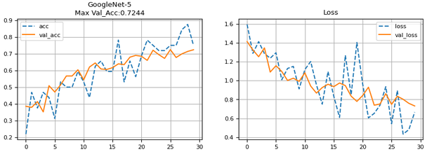

30 epoch 학습에서 검증 정확도가 꾸준히 올라 최고 0.7244 에 이른다. 학습 정확도(점선)가 검증 정확도보다 크게 앞서지 않고 두 곡선이 함께 오르는 것이 보인다.

#### 3) 3.4 절의 CNN 모델(CNN_BN)과 비교

3.4 절에서 BatchNorm 과 Dropout 으로 개선한 CNN 모델을 flower photos(224×224, 5 클래스)에 맞추어 다시 정의한다. 3×3 convolution 과 2×2 max pooling 을 다섯 번 쌓고 `Linear(512*7*7, 5)` 로 분류하는 구조다.

```python
class CNN_BN(Wrap_5):
    def __init__(self):
        super(CNN_BN, self).__init__()
        self.layers = nn.Sequential(
            nn.Conv2d(3, 128, 3, padding=1),
            nn.BatchNorm2d(128),
            nn.ReLU(),
            nn.MaxPool2d(2, 2),

            nn.Conv2d(128, 128, 3, padding=1),
            nn.BatchNorm2d(128),
            nn.ReLU(),
            nn.MaxPool2d(2, 2),

            nn.Conv2d(128, 256, 3, padding=1),
            nn.BatchNorm2d(256),
            nn.ReLU(),
            nn.Dropout(0.2),
            nn.MaxPool2d(2, 2),

            nn.Conv2d(256, 256, 3, padding=1),
            nn.BatchNorm2d(256),
            nn.ReLU(),
            nn.Dropout(0.2),
            nn.MaxPool2d(2, 2),

            nn.Conv2d(256, 512, 3, padding=1),
            nn.BatchNorm2d(512),
            nn.ReLU(),
            nn.Dropout(0.2),
            nn.MaxPool2d(2, 2),

            nn.Flatten(),
            nn.Dropout(0.4), ##
            nn.Linear(512*7*7, 5)
            )

    def forward(self, x):
        out = self.layers(x)
        return out

model_BN = CNN_BN()
summary(model_BN, input_size=(16, 3, 224, 224))
```

```python
%%time
model_BN = CNN_BN()
model_name = "CNN_BN"

epochs=15
logger = CSVLogger("logs", name=model_name)
trainer = Trainer(max_epochs=epochs, logger=logger,
                  limit_train_batches=0.7, limit_val_batches=1.0)
trainer.fit(model_BN, train_loader, test_loader)
```

학습 조건은 GoogLeNet 과 같고 epoch 만 15 다. 학습 뒤 같은 코드로 `metrics.csv` 를 읽어 곡선을 그리면 두 모델을 나란히 비교할 수 있다.

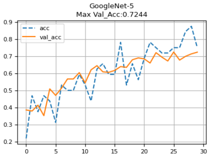

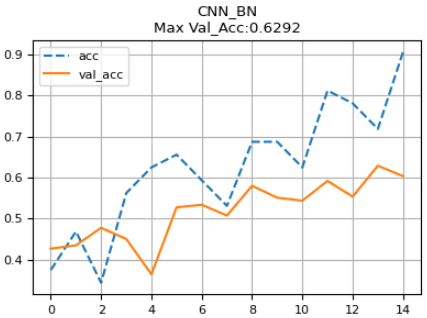

CNN_BN 은 15 epoch 에 최고 검증 정확도 0.6292 로 목표 62% 를 간신히 넘고, 학습 정확도(점선)가 0.9 까지 치솟아 검증 정확도와 벌어진다. GoogLeNet-5 는 같은 15 epoch 부근에서 이미 0.6 을 넘고 30 epoch 에 0.7244 에 이르며, 두 곡선의 간격도 작다. 학습에 걸린 시간은 GoogLeNet 이 epochs=30 에 2min 40s, CNN-BN 이 epochs=15 에 2min 58s 였다. GoogLeNet 이 두 배의 epoch 를 돌고도 더 빨리 끝난 것이다.

**모델 비교 — parameter, operation.** 왜 그런지 `summary` 로 확인한다. 두 모델을 같은 조건으로 비교하려면 `input_size=(1, 3, 224, 224)` 로 batch 를 1 로 두어야 연산량(mult-adds)이 batch 크기에 흔들리지 않는다.

```python
model = GoogLeNet(num_classes=5)
summary(model, input_size=(1, 3, 224, 224))
```

```python
model_BN = CNN_BN()
summary(model_BN, input_size=(1, 3, 224, 224))
```

`summary` 출력의 마지막 요약 부분만 옮기면 다음과 같다.

| 모델 | Total params | Trainable params | Non-trainable params | Total mult-adds (G) |
|---|---|---|---|---|
| GoogLeNet(num_classes=5) | 5,975,029 | 5,975,029 | 0 | 1.57 |
| CNN_BN | 2,344,581 | 2,344,581 | 0 | 3.65 |

GoogLeNet 은 파라미터가 CNN_BN 의 2.5 배쯤 되지만 연산량(mult-adds)은 절반 이하(1.57G 대 3.65G)다. 파라미터가 많은데 연산이 적은 이유는 GoogLeNet 이 첫 층에서 stride 2 convolution 과 max pooling 으로 feature map 을 빨리 줄이고, 1×1 bottleneck 으로 큰 필터의 입력 채널을 줄이기 때문이다. CNN_BN 은 224×224 전체 크기에서 128 채널 3×3 convolution 을 두 번 돌리므로 연산이 앞단에 몰린다. 학습 시간 차이는 여기서 온다.

#### 4) Pre-trained model 사용하기

ImageNet 으로 학습된 GoogLeNet 을 불러와 flower photos 에 그대로 추론해 본다. 모델 카드는 https://pytorch.org/hub/pytorch_vision_googlenet/ 에 있다.

```python
import torchvision.models as models
model = models.googlenet(pretrained=True)
#inception = models.inception_v3(pretrained=True)
```

`torch.hub.load('pytorch/vision', 'googlenet', pretrained=True)` 로 GitHub 에서 직접 받아도 같은 모델이다. ImageNet 모델의 출력은 1000 클래스이므로 클래스 이름 목록을 받아 둔다.

```python
# Download ImageNet labels
!wget https://raw.githubusercontent.com/pytorch/hub/master/imagenet_classes.txt
```

```python
# Read the categories
with open("imagenet_classes.txt", "r") as f:
    categories = [s.strip() for s in f.readlines()]
```

`categories` 는 'tench', 'goldfish' 로 시작해 'toilet tissue' 로 끝나는 1000개 이름의 리스트다. 이제 loader 에서 batch 하나를 꺼내 추론하고, 각 이미지의 실제 꽃 이름과 모델이 가장 높은 확률로 고른 ImageNet 범주를 나란히 출력한다.

```python
model.eval() ##
imgs, labels = next(iter(train_loader)) #(64,img),(64,label)
p(labels)
outputs = model(imgs) # (64,1000)

idx = F.softmax(outputs, dim=1)
# Show top categories per image
top5_prob, top5_catid = torch.topk(idx, 5) #(64,1),(64,1)
for i in range(top5_prob.size(0)): # 64
      print(f'{CLASS_test[labels[i]]:10s}:{categories[top5_catid[i,0]]:15s},{top5_prob[i,0]:0.4f}')
```

`model.eval()` 은 dropout·batchnorm 을 추론 모드로 바꾼다. 출력 `(batch, 1000)` 에 softmax 를 적용해 확률로 만들고, `torch.topk(idx, 5)` 로 확률이 높은 5 개 범주의 확률과 인덱스를 얻는다. 출력 줄에는 그중 1 위만 찍는다. 결과의 일부는 다음과 같다.

```text
tulips    :daisy          ,0.0874
sunflowers:shower curtain ,0.0919
daisy     :daisy          ,0.9756
roses     :bell pepper    ,0.0666
tulips    :daisy          ,0.1462
sunflowers:daisy          ,0.1448
sunflowers:admiral        ,0.0839
tulips    :fountain       ,0.6272
dandelion :spotlight      ,0.0480
sunflowers:birdhouse      ,0.1625
roses     :jellyfish      ,0.4722
roses     :hen-of-the-woods,0.3242
sunflowers:daisy          ,0.4936
dandelion :lorikeet       ,0.2739
daisy     :daisy          ,0.9443
roses     :hen-of-the-woods,0.1069
daisy     :daisy          ,0.6517
```

**Inference 결과 확인 — 무엇이 문제인가?** daisy 는 daisy 로, 그것도 0.97, 0.94 같은 높은 확률로 맞힌다. 그러나 roses 는 bell pepper·jellyfish·hen-of-the-woods 로, sunflowers 는 shower curtain·birdhouse 로, dandelion 은 spotlight·lorikeet 으로 나오고 확률도 낮다. 모델이 나쁜 것이 아니라, ImageNet 의 1000 범주 안에 flower photos 의 다섯 꽃 이름이 모두 들어 있지는 않기 때문이다. 없는 범주는 맞힐 수가 없다. 다음 코드로 ImageNet 범주 목록과 flower photos 의 클래스 이름이 겹치는 것을 찾아보면 원인이 확인된다.

```python
# categories와 CLASS_train 겹치는 경우
# categorie id와 name 확인
for i in range(len(categories)):
  if categories[i] in CLASS_train:
    print( i, categories[i])
```

사전학습 모델을 다른 데이터에 쓰려면 마지막 분류층을 새 데이터의 클래스 수에 맞게 바꾸어 다시 학습해야 한다. 이것이 다음 절들에서 다루는 transfer learning 의 출발점이다.

---

## 4.1.8 정리
<!-- 슬라이드 311~328 -->

- GoogLeNet 은 22 층의 깊은 망이면서 파라미터는 7M 으로, AlexNet(61M)의 9분의 1, VGG-16(138M)의 20분의 1 이다. 그 비결이 Inception module 이다.
- Inception module 은 1×1·3×3·5×5 convolution 과 3×3 max pooling 을 병렬로 두고 채널 방향으로 이어 붙인다. 깊고 넓되 계층 간 연결은 성기게 만드는 구조다.
- 1×1 convolution 은 Network in Network 의 MLP 를 대신하는 채널 방향 신경망이다. 채널 간 상관관계와 공간 상관관계를 분리하고, bottleneck 으로 채널을 줄여 파라미터를 크게 줄인다(18→5→30 의 예에서 4,890 → 1,475).
- 마지막 FC 층을 average pooling 으로 바꾸어 파라미터를 더 줄였고, 학습 중에는 두 보조 분류기(loss 0.3 배, Dropout 0.7)로 vanishing 을 줄인 뒤 학습 후 제거한다.
- Inception-v2·v3 는 5×5 를 3×3 두 개로, n×n 을 1×n 과 n×1 로 분해해 연산을 줄였고, Inception-v4 는 Stem 과 Inception-A/B/C, Reduction-A/B 블록으로 구조를 정리하였다.
- PyTorch 에서는 네 경로 함수와 `inception_module` 클래스, 이를 쌓은 `GoogLeNet` 클래스로 구현하며, `torchinfo.summary` 로 층별 크기와 파라미터를 확인한다.
- flower photos 실습에서 GoogLeNet-5 는 30 epoch 에 검증 정확도 0.7244, CNN_BN 은 15 epoch 에 0.6292 였고, GoogLeNet 은 파라미터는 많지만(5,975,029 대 2,344,581) 연산량은 적었다(1.57G 대 3.65G). ImageNet 사전학습 모델을 그대로 쓰면 범주가 겹치지 않아 맞힐 수 없으므로, 분류층을 바꾸어 다시 학습해야 한다.
