# 4.2 ResNet(Residual neural network)

**학습 목표**

- 망을 깊게 쌓을 때 나타나는 degradation 문제가 무엇이고, 왜 초기화·batch normalization·regularization 만으로는 해결되지 않았는지 설명할 수 있다.
- Residual learning 의 아이디어 $H(x) = F(x) + x$ 와 skip connection 이 gradient vanishing 을 막는 이유를 설명할 수 있다.
- Identity block · Conv block · Bottleneck block 의 차이와 pre-activation 구조의 개선점을 구분할 수 있다.
- PyTorch 로 `BottleNeck` 블록과 `_make_blocks` 를 구현해 ResNet50 · ResNet152 를 만들고 `torchinfo.summary` 로 구조를 확인할 수 있다.
- ResNet 을 ensemble 로 보는 해석을 이해하고, torchvision 의 ImageNet 사전학습 ResNet 을 불러 쓸 수 있다.

**이 절의 구성**

- 4.2.1 ResNet 개요
- 4.2.2 깊은 망의 문제점과 Highway Network
- 4.2.3 Residual learning 과 skip connection
- 4.2.4 CIFAR-10 성능 평가와 pre-activation block
- 4.2.5 ImageNet 모델의 구조와 Bottleneck block
- 4.2.6 ResNet 모델 만들기 (실습 4.2.1)
- 4.2.7 ResNet 에 대한 다른 해석 — ensemble
- 4.2.8 PyTorch Hub 의 사전학습 ResNet
- 4.2.9 정리
- 4.2.10 실습과제

---

## 4.2.1 ResNet 개요
<!-- 슬라이드 330 -->

ResNet(Residual neural network)은 152개의 층(layer)을 쌓은 망이다. 그 전까지의 망이 수십 층에서 멈춰 있던 것과 견주면 자릿수가 다른 깊이다. 이렇게 깊은 망을 학습시킬 수 있었던 열쇠가 이 절의 주제인 **Residual Learning(잔차 학습)** 이다.

ResNet 이 거둔 성과는 다음과 같다.

- 152 layers network 을 학습시켰다.
- Residual Learning 개념을 도입했다.
- ImageNet 분류에서 top-5 error 3.6% 를 기록해 인간의 인식 능력을 능가했다.
- 여러 대회에서 1위를 차지했다.
  - ILSVRC 2015 classification task 1위
  - ImageNet detection 1위
  - ImageNet localization 1위
  - COCO detection 1위
  - COCO segmentation 1위

분류(classification)뿐 아니라 검출(detection)·위치 추정(localization)·분할(segmentation)까지 한 구조로 석권했다는 점에서, ResNet 은 특정 과제용 모델이 아니라 **범용 backbone** 으로 자리 잡았다.

여기서 COCO 는 ImageNet 과 함께 자주 등장하는 dataset 이다. COCO 는 image recognition · segmentation · captioning 을 위한 dataset 으로, 다음과 같은 특징을 갖는다.

- Object segmentation
- Recognition in context (맥락 속에서의 인식)
- 한 이미지에 여러 객체(multiple objects per image)
- 300,000장 이상의 이미지, 200만 개 이상의 instance
- 80개 object category
- 이미지당 5개의 caption
- 100,000명에 대한 keypoint

---

## 4.2.2 깊은 망의 문제점과 Highway Network
<!-- 슬라이드 331~332 -->

### 깊은 망의 문제점

망을 깊게 만들면(deeper network) 두 가지 문제가 따라온다.

첫째는 **vanishing / exploding gradients** 다. 역전파가 여러 층을 거치는 동안 gradient 가 0 으로 사라지거나 발산한다. 이에 대해서는 이미 여러 대책이 나와 있다.

- 더 나은 초기화 방법(better initialization methods)
- batch normalization
- ReLU
- 그 밖의 여러 기법

둘째는 **overfitting** 이다. 층이 많아지면 파라미터가 늘어 훈련 데이터에 과적합하기 쉽다. 이에 대한 대책이 regularization 이다.

- Data augmentation
- Learning rate decay
- L1 / L2 weight decay
- 그 밖의 여러 기법

그런데 이 대책들을 모두 동원해도 풀리지 않는 문제가 남는다. **degradation problem** 이다. 층을 더 쌓았는데 오히려 성능이 나빠지는 현상이다. 아래 그래프는 20층 망과 56층 망의 training error 와 test error 를 비교한 것이다. 56층 망이 training error 에서도 20층 망보다 높다. test error 만 나빠졌다면 overfitting 이라 부를 수 있지만, training error 자체가 높으므로 overfitting 으로 설명되지 않는다. 깊은 망이 얕은 망보다 **학습 자체를 못 하는** 것이다.

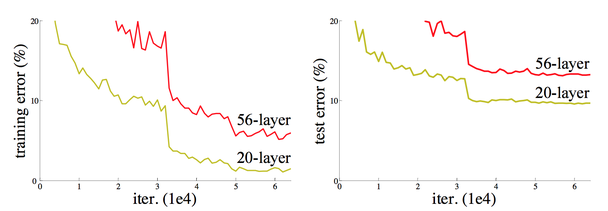

### Highway Network

ResNet 연구에 영감을 준 모델이 **Highway Network** 다. LSTM 의 conveyor belt(cell state 가 층을 가로질러 흘러가는 통로)에서 착안해, 정보 전달을 쉽게 하기 위해 두 개의 gate 를 설치한다.

- **T(transform gate)** : 변환 결과 $H(x)$ 를 얼마나 반영할지 제어한다.
- **C(carry gate)** : 입력 $x$ 를 얼마나 그대로 전달할지 제어한다.

아래 회로도에서 입력 $x$ 는 세 갈래로 나뉜다. 변환 $H$ 를 거친 값에는 $T$ 가 곱해지고, 원래의 $x$ 에는 $C$ 가 곱해진 뒤 둘을 더해 출력 $y$ 가 된다. $C$ 가 열려 있으면 입력이 변환 없이 다음 층으로 "고속도로(highway)" 를 타고 넘어간다.

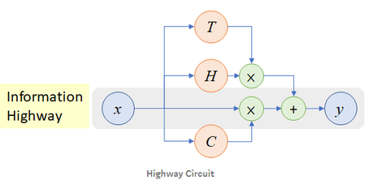

효과는 깊이가 깊어질수록 뚜렷하다. 아래 두 그림은 plain network 과 highway network 의 학습 곡선(mean cross entropy error)을 깊이 10, 20, 50, 100 에서 비교한 것이다. 깊이 10 에서는 둘 다 잘 수렴하지만, 깊이가 늘수록 plain network 은 수렴이 느려지고 깊이 100 에서는 거의 학습하지 못한다. 반면 highway network 은 어느 깊이에서든 빠르게 수렴한다.

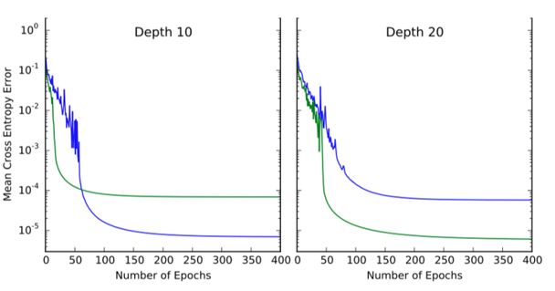

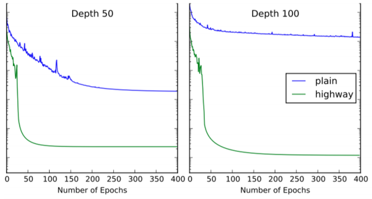

---

## 4.2.3 Residual learning 과 skip connection
<!-- 슬라이드 333 -->

ResNet 은 **Residual learning(잔차 학습)** 을 제안했다. 매우 깊은 망을 만들 수 있는 효율적인 방식이다.

일반적인 학습은 층이 만들어 내는 함수 $H(x)$ 와 정답 $y$ 의 차이, 즉 $H(x) - y$ 를 최소화하는 것이다. 아래 왼쪽 그림처럼 임의의 두 층(any two stacked layers)을 weight layer, ReLU, weight layer, ReLU 순으로 쌓으면 그 출력이 $H(x)$ 다. 이 두 층은 $H(x)$ 전체를 처음부터 배워야 한다.

학습 목표를 이렇게 수정해 보자.

- 출력과 입력의 잔차를 $F(x) = H(x) - x$ 라 하고,
- $F(x)$ 를 찾는 것을 목표로 하면,
- 층은 **잔차를 학습**하는 것으로 볼 수 있다.
- 학습 목표가 명확하므로 학습이 잘될 것이라고 가정한다.
- 식은 $H(x) = F(x) + x$ 가 되고,
- 그래프에는 입력 $x$ 를 출력에 바로 더하는 **skip connection** 이 생긴다.

아래 오른쪽 그림이 그 구조다. 두 weight layer 가 만드는 것은 $F(x)$ 이고, 입력 $x$ 가 identity 경로로 건너와 $\oplus$ 에서 더해진 뒤 ReLU 를 거친다. Highway Network 의 carry gate 를 항상 열어 둔 것(항등 사상)으로 볼 수 있다.

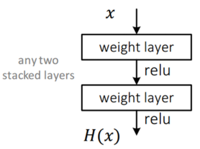

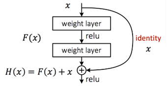

**Skip connection 의 가치**는 역전파에서 드러난다. $H(x) = F(x) + x$ 를 $x$ 로 미분하면 $F$ 쪽의 미분에 identity 경로에서 오는 1 이 더해진다. 그래서 weight 가 아무리 작아도 gradient 가 사라지지 않는다. vanishing gradient 문제가 구조적으로 해결되는 것이다. ResNet 구조에서 gradient 가 어떻게 계산되는지에 대한 추가 설명은 다음 글을 참고한다.

- https://stackoverflow.com/questions/44512126/how-to-calculate-gradients-in-resnet-architecture/44861321

> **핵심 메시지**
> Residual block 은 층이 배워야 할 것을 $H(x)$ 전체가 아니라 잔차 $F(x) = H(x) - x$ 로 바꾼다. 그 결과 그래프에 skip connection 이 생기고, 이 경로 덕분에 gradient 가 깊은 망을 지나도 사라지지 않는다.

---

## 4.2.4 CIFAR-10 성능 평가와 pre-activation block
<!-- 슬라이드 334~335 -->

### Plain network 과의 비교

Residual learning 의 효과는 같은 깊이의 plain network 과 비교해 평가한다. CIFAR-10 을 기준으로 삼되, 이미지가 32×32 로 작으므로 ImageNet 용 구조를 다음과 같이 손본다.

- 첫 번째 conv filter 를 7×7 에서 3×3 으로 바꾼다.
- Conv layer 는 아래 표의 확장 규칙을 따라 쌓는다. 출력 map 크기가 절반이 될 때마다 filter 수를 두 배로 늘린다.
- 마지막에는 global average pooling 과 FC(10) 을 둔다.
- 전체 층 수는 $6n + 2$ 가 된다.
- $n = 3, 5, 7, 9, 18$ 로 두면 각각 20, 32, 44, 56, 110 layers 가 된다.

다음 표가 CIFAR-10 용 망의 conv layer 확장 규칙이다.

| output map size | 32×32 | 16×16 | 8×8 |
|---|---|---|---|
| # layers | 1 + 2n | 2n | 2n |
| # filters | 16 | 32 | 64 |

아래 그림이 그렇게 만든 plain network 과 residual network 의 구조다. 3×3 convolution 이 filter 16, 32, 64 의 세 단계로 각각 $2n$ 개씩 이어지고, 마지막에 10-way softmax 가 온다. 두 망의 차이는 오른쪽에 두 층마다 하나씩 붙은 skip connection 뿐이다.

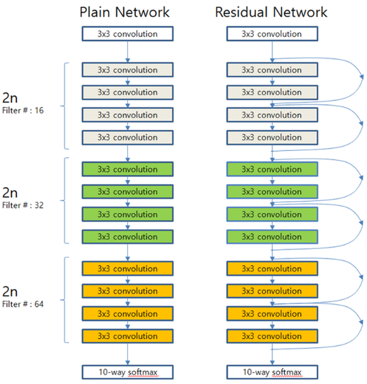

결과는 아래 학습 곡선에 나타난다. 왼쪽의 plain network 은 20, 32, 44, 56 층으로 깊어질수록 error 가 **높아진다** — 앞서 본 degradation problem 이다. 오른쪽의 ResNet 은 20, 32, 44, 56, 110 층으로 깊어질수록 error 가 **지속적으로 개선된다**. 이 실험은 regularization 기법을 사용하지 않은 상태에서 얻은 것이다.

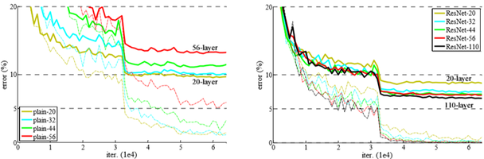

### Residual block 구조 개선 — pre-activation

Deep ResNet 의 성능은 residual block 의 구조를 바꾸어 한 번 더 개선되었다. 원래 block 과 개선된 block 의 연산 순서를 비교하면 다음과 같다.

- 원래(post-activation) : Conv → BN → ReLU → Conv → BN → **+ skip** → ReLU
- 개선(pre-activation) : BN → ReLU → Conv → BN → ReLU → Conv → **+ skip**

원래 구조에서는 skip 경로와 합쳐진 뒤에 ReLU 가 오지만, 개선된 구조에서는 활성화가 conv 앞으로 옮겨져(pre-activation) 합산 이후에는 아무 연산도 없다. 이 변화가 가져오는 이점은 두 가지다.

1. Skip pass 위에서 연산이 제거된다. identity 경로가 깨끗하게 유지되므로 backpropagation 에 유리하다.
2. BN 의 위치가 바뀌어 BN 의 역할이 강화된다. 각 conv 가 정규화된 입력을 받게 된다.

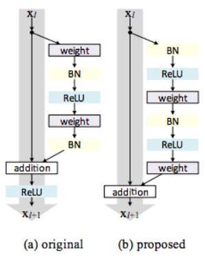

아래 그래프는 1001 층 ResNet 에서 두 구조의 training loss 와 test error 를 비교한 것이다. 범례에 보이듯 원래 구조의 error 는 7.61%, 개선된 구조는 4.92% 로, 매우 깊은 망에서 pre-activation 의 효과가 크다.

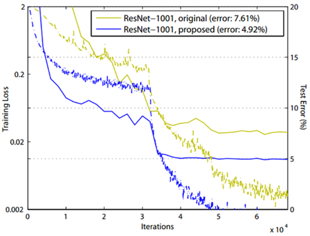

CIFAR-10 과 CIFAR-100 에서 baseline unit 과 pre-activation unit 의 error(%) 를 비교하면 다음과 같다. 망이 깊을수록 개선 폭이 커지며, 특히 baseline 에서는 1001 층이 164 층보다 오히려 나빴던 것이 pre-activation 에서는 역전된다.

| dataset | network | baseline unit | pre-activation unit |
|---|---|---|---|
| CIFAR-10 | ResNet-110 (1layer) | 9.90 | 8.91 |
| CIFAR-10 | ResNet-110 | 6.61 | 6.37 |
| CIFAR-10 | ResNet-164 | 5.93 | 5.46 |
| CIFAR-10 | ResNet-1001 | 7.61 | 4.92 |
| CIFAR-100 | ResNet-164 | 25.16 | 24.33 |
| CIFAR-100 | ResNet-1001 | 27.82 | 22.71 |

---

## 4.2.5 ImageNet 모델의 구조와 Bottleneck block
<!-- 슬라이드 336~337 -->

### 실선과 점선 — identity block 과 conv block

ImageNet 에 참가한 ResNet 의 구조를 보면 skip connection 이 실선과 점선 두 종류로 그려져 있다.

- **실선 : identity block.** 입력과 출력의 차원이 같아 $x$ 를 그대로 더한다.
- **점선 : conv block.** 점선이 있는 곳에서 채널 수가 늘고(64 → 128 → 256 → 512) feature map 크기는 절반이 된다. 입력을 그대로 더할 수 없으므로 skip 경로에 1×1 conv 가 숨어 있어 차원을 맞춘다.

아래 그림은 34 층 ResNet 의 앞부분이다. image 가 7×7 conv 64 (stride 2) 와 pool (stride 2) 을 지난 뒤 3×3 conv 64 가 여섯 번 이어지고, 3×3 conv 128 로 넘어가는 지점에서 stride 2 와 함께 점선 skip 이 나타난다.

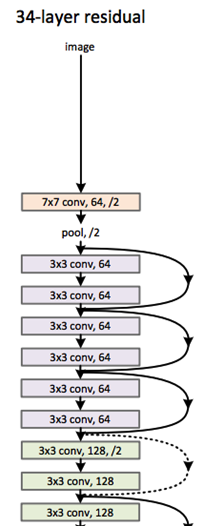

ImageNet 용 ResNet 은 깊이에 따라 18, 34, 50, 101, 152 층의 다섯 가지가 있다. 아래 표가 각 모델의 층 구성이다. conv1 과 max pool, 마지막의 average pool · 1000-d fc · softmax 는 모든 깊이에 공통이고, conv2_x 부터 conv5_x 까지 네 단계에서 block 의 종류와 반복 횟수만 달라진다. 대괄호 안이 block 하나의 구성이고 그 뒤의 ×N 이 반복 횟수다.

| layer name | output size | 18-layer | 34-layer | 50-layer | 101-layer | 152-layer |
|---|---|---|---|---|---|---|
| conv1 | 112×112 | 7×7, 64, stride 2 (모든 깊이 공통) | | | | |
| | | 3×3 max pool, stride 2 (모든 깊이 공통) | | | | |
| conv2_x | 56×56 | [3×3, 64 / 3×3, 64] ×2 | [3×3, 64 / 3×3, 64] ×3 | [1×1, 64 / 3×3, 64 / 1×1, 256] ×3 | [1×1, 64 / 3×3, 64 / 1×1, 256] ×3 | [1×1, 64 / 3×3, 64 / 1×1, 256] ×3 |
| conv3_x | 28×28 | [3×3, 128 / 3×3, 128] ×2 | [3×3, 128 / 3×3, 128] ×4 | [1×1, 128 / 3×3, 128 / 1×1, 512] ×4 | [1×1, 128 / 3×3, 128 / 1×1, 512] ×4 | [1×1, 128 / 3×3, 128 / 1×1, 512] ×8 |
| conv4_x | 14×14 | [3×3, 256 / 3×3, 256] ×2 | [3×3, 256 / 3×3, 256] ×6 | [1×1, 256 / 3×3, 256 / 1×1, 1024] ×6 | [1×1, 256 / 3×3, 256 / 1×1, 1024] ×23 | [1×1, 256 / 3×3, 256 / 1×1, 1024] ×36 |
| conv5_x | 7×7 | [3×3, 512 / 3×3, 512] ×2 | [3×3, 512 / 3×3, 512] ×3 | [1×1, 512 / 3×3, 512 / 1×1, 2048] ×3 | [1×1, 512 / 3×3, 512 / 1×1, 2048] ×3 | [1×1, 512 / 3×3, 512 / 1×1, 2048] ×3 |
| | 1×1 | average pool, 1000-d fc, softmax (모든 깊이 공통) | | | | |
| FLOPs | | 1.8×10^9 | 3.6×10^9 | 3.8×10^9 | 7.6×10^9 | 11.3×10^9 |

### Bottleneck block

표에서 보듯 ResNet50 이상에서는 block 의 모양이 달라진다. 18 · 34 층은 3×3 conv 두 개로 된 기본 block 을 쓰지만, 50 · 101 · 152 층은 **1×1 conv 를 이용한 bottleneck block** 을 쓴다.

아래 왼쪽이 기본 block 이다. 64 채널 입력에 3×3, 64 conv 를 두 번 적용하고 skip 을 더한다. 오른쪽이 bottleneck block 이다. 256 채널 입력을 먼저 1×1, 64 conv 로 **채널을 줄이고**, 줄어든 64 채널에서 3×3, 64 conv 를 수행한 뒤, 다시 1×1, 256 conv 로 **채널을 되돌린다**. 연산량이 큰 3×3 conv 를 좁은 채널(병목)에서 수행하므로 깊이를 크게 늘려도 계산 비용을 감당할 수 있다. 표의 FLOPs 를 보면 50 층 모델이 34 층 모델과 비슷한 연산량으로 훨씬 깊어졌음을 알 수 있다.

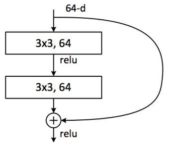

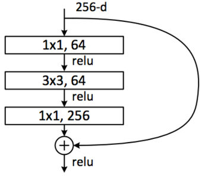

ImageNet 에서 여러 모델의 top-1 · top-5 오류율(%) 을 비교하면 다음과 같다. ResNet 은 깊어질수록 오류율이 낮아지며, ResNet-152 가 가장 낮다.

| method | top-1 err. | top-5 err. |
|---|---|---|
| VGG (ILSVRC'14) | - | 8.43 |
| GoogLeNet (ILSVRC'14) | - | 7.89 |
| VGG (v5) | 24.4 | 7.1 |
| PReLU-net | 21.59 | 5.71 |
| BN-inception | 21.99 | 5.81 |
| ResNet-34 B | 21.84 | 5.71 |
| ResNet-34 C | 21.53 | 5.60 |
| ResNet-50 | 20.74 | 5.25 |
| ResNet-101 | 19.87 | 4.60 |
| ResNet-152 | **19.38** | **4.49** |

test set 의 top-5 오류율(%) 로 보면 ResNet 이 ILSVRC 2015 에서 기록한 3.57 이 이전 우승 모델들을 크게 앞선다. 앞의 개요에서 말한 "top-5 error 3.6%" 가 이 수치다.

| method | top-5 err. (test) |
|---|---|
| VGG (ILSVRC'14) | 7.32 |
| GoogLeNet (ILSVRC'14) | 6.66 |
| VGG (v5) | 6.8 |
| PReLU-net | 4.94 |
| BN-inception | 4.82 |
| **ResNet (ILSVRC'15)** | **3.57** |

---

## 4.2.6 ResNet 모델 만들기
<!-- 슬라이드 338 -->

이제 앞에서 본 구조를 PyTorch 로 직접 만들어 본다. 논문에서 제시된 기본 모델 ResNet50 과 ResNet152 를 대상으로 한다. 두 모델은 block 의 반복 횟수만 다르므로, 공통 부분을 한 번 만들고 반복 횟수를 바꾸어 두 모델을 얻는 것이 목표다.

### 실습 4.2.1 — ResNet 모델 만들기
<!-- 슬라이드 338~342 -->

> 노트북: `code/4.2.1.ResNet.ipynb`
> [](https://colab.research.google.com/github/AI-BoostCamp/intermediate-deep-learning-pytorch/blob/main/code/4.2.1.ResNet.ipynb)

**목적** — ResNet 구조에 익숙해진다. ResNet 을 직접 만들어 보고, 논문에서 제시된 기본 모델 ResNet50 과 ResNet152 를 만들어 본다.

**실습 개요**

- Residual block 설계
  - Identity block (skip connection 을 가진 block) 과
  - Conv block (1×1 conv 를 통해 depth 를 늘리는 block) 을 설계한다.
- ResNet50, ResNet152 만들기
  - 두 모델의 공통 부분을 만들고,
  - 반복 횟수를 바꾸어 두 모델을 만든다.
  - Classification class 수를 변경할 수 있도록 설계한다.

먼저 필요한 모듈을 불러온다. 모델 정의에는 `torch.nn` 이, 학습 wrapper 에는 Lightning 이, 구조 확인에는 `torchinfo.summary` 가 쓰인다.

```python
import torch
from torch import nn
from torch.nn import functional as F
from torchmetrics import functional as FM
from torch.utils.data import Dataset, DataLoader, random_split
from torchvision.transforms import v2
from torchinfo import summary

import lightning as L
from lightning.pytorch import Trainer
from lightning.pytorch.callbacks import ModelCheckpoint
from lightning.pytorch.loggers import CSVLogger

import numpy as np
import pandas as pd
import matplotlib.pyplot as plt

device = 'cuda:0'
```

노트북에서는 `BottleNeck` 클래스가 먼저 정의되어 있다(사용하기 전에 정의되어야 하므로). 여기서는 큰 골격인 `ResNet` 클래스부터 읽고, 그 안에서 쓰이는 `_make_blocks` 와 `BottleNeck` 으로 내려간다.

#### 공통 부분 — ResNet 클래스
<!-- 슬라이드 339 -->

ResNet50 과 ResNet152 의 공통 부분은 세 덩어리다.

- **전처리 부분** : `conv1`. 7×7 conv (64 채널, stride 2) → BN → ReLU → 3×3 max pool (stride 2).
- **반복되는 Residual block** : `conv2_x` ~ `conv5_x`. `_make_blocks` 에서 block 을 구성한다.
- **후처리 부분** : average pooling 과 fc. softmax 는 loss 함수(`cross_entropy`) 안에서 처리된다.

`nn.Conv2d(in_c, out_c, kernel_size, stride, padding, bias=True)` 의 인자 순서를 기억해 두면 아래 코드의 숫자들을 읽기 쉽다.

```python
# nn.Conv2d(in_c, out_c, kernel_size, stride, padding, bias=True)
# nn.MaxPool2d(kernel_size, stride, padding)

class ResNet(nn.Module):
    def __init__(self, num_block, num_classes=1000):
        super().__init__()
        self.in_channels=64
        self.conv1 = nn.Sequential(
            nn.Conv2d(3, 64, 7, 2, 3, bias=False),           #(64,112,112)
            nn.BatchNorm2d(64),
            nn.ReLU(),
            nn.MaxPool2d(kernel_size=3, stride=2, padding=1) #(64,56,56)
        )
        ## Stacking Conv Block ##
        self.conv2_x = self._make_blocks(64, 64, num_block[0], 1)
        self.conv3_x = self._make_blocks(256, 128, num_block[1], 2)
        self.conv4_x = self._make_blocks(512, 256, num_block[2], 2)
        self.conv5_x = self._make_blocks(1024, 512, num_block[3], 2)
        ##
        self.avg_pool = nn.AdaptiveAvgPool2d((1,1))#out:(1,1)#(2048,1,1)
        self.fc = nn.Linear(512*4, num_classes)              #(1000)

    def _make_blocks(self, in_channels, base_channels, num_blocks, stride):
        strides = [stride] + [1] * (num_blocks - 1) #[1,1,1] or [2,1,1]
        layers = []
        layers.append(BottleNeck(in_channels, base_channels, strides[0],
                                                                   conv_shortcut=True))
        for n_block in range(1, num_blocks):
            layers.append(BottleNeck(base_channels*4, base_channels, strides[n_block]))
        return nn.Sequential(*layers)

    def forward(self,x):
        x = self.conv1(x)
        x = self.conv2_x(x)
        x = self.conv3_x(x)
        x = self.conv4_x(x)
        x = self.conv5_x(x)
        x = self.avg_pool(x)
        x = x.view(x.size(0), -1) ## flatten
        x = self.fc(x)
        return x
```

`__init__` 의 인자 `num_block` 은 네 단계의 반복 횟수를 담은 리스트다. 앞 소절의 표에서 50-layer 열은 [3, 4, 6, 3], 152-layer 열은 [3, 8, 36, 3] 이다. `num_classes` 를 인자로 두어 분류 class 수를 바꿀 수 있게 했다.

`conv1` 은 224×224 입력을 받아 stride 2 의 7×7 conv 로 (64, 112, 112) 를 만들고, stride 2 의 max pool 로 (64, 56, 56) 까지 줄인다. padding 3 과 1 은 각각 7×7 과 3×3 kernel 에서 크기가 정확히 절반이 되도록 맞춘 값이다.

`conv2_x` ~ `conv5_x` 네 줄이 표의 네 단계에 대응한다. `_make_blocks(in_channels, base_channels, num_blocks, stride)` 의 인자를 표와 맞추어 보면 다음과 같다.

| 단계 | in_channels | base_channels | 출력 채널 (base×4) | stride | 출력 크기 |
|---|---|---|---|---|---|
| conv2_x | 64 | 64 | 256 | 1 | 56×56 |
| conv3_x | 256 | 128 | 512 | 2 | 28×28 |
| conv4_x | 512 | 256 | 1024 | 2 | 14×14 |
| conv5_x | 1024 | 512 | 2048 | 2 | 7×7 |

- `in_channels` 는 이전 단계의 출력 채널이다. conv2_x 는 max pool 의 64 채널을 받고, 그 뒤는 앞 단계의 base×4 를 받는다.
- `base_channels` 는 bottleneck 안쪽의 채널(1×1 로 줄였을 때의 채널)이며, block 의 출력은 그 4배다.
- `stride` 는 conv2_x 만 1 이고 나머지는 2 다. max pool 이 이미 56×56 으로 줄였으므로 conv2_x 에서는 크기를 유지하고, 이후 단계마다 절반씩 줄여 7×7 에 이른다.

후처리는 `nn.AdaptiveAvgPool2d((1,1))` 로 7×7 feature map 을 (2048, 1, 1) 로 모은 뒤 flatten 하고, `nn.Linear(512*4, num_classes)` 로 class 수만큼의 logit 을 낸다. `AdaptiveAvgPool2d` 는 입력 크기와 상관없이 출력 크기를 (1, 1) 로 맞춰 주므로 global average pooling 에 해당한다.

#### Conv block stacking — `_make_blocks`
<!-- 슬라이드 340 -->

각 단계 안에서 block 을 반복하는 규칙은 하나다. **첫 block 은 conv block, 나머지는 identity block** 이다. 첫 block 이 1×1 conv 로 depth 를 맞춰 주고 나면(예: 64 → 256), 그 뒤의 block 들은 입출력 채널이 같아(256 → 256) skip 경로에 아무 연산이 필요 없다.

```python
    def _make_blocks(self, in_channels, base_channels, num_blocks, stride):
        strides = [stride] + [1] * (num_blocks - 1) #[1,1,1] or [2,1,1]
        layers = []
        layers.append(BottleNeck(in_channels, base_channels, strides[0],
                                                                   conv_shortcut=True))
        for n_block in range(1, num_blocks):
            layers.append(BottleNeck(base_channels*4, base_channels, strides[n_block]))
        return nn.Sequential(*layers)
```

- `strides` 는 첫 block 에만 단계의 stride 를 주고 나머지는 1 로 채운 리스트다. 반복 횟수가 3 이면 `[1,1,1]` 또는 `[2,1,1]` 이 된다. 크기를 줄이는 일은 단계의 첫 block 이 맡는다.
- 첫 block 은 `conv_shortcut=True` 로 만든다. 이것이 **Conv block** 이다. `in_channels` 를 받아 `base_channels*4` 를 내보내며, skip 경로에 1×1 conv 가 들어간다.
- 두 번째부터는 `conv_shortcut` 기본값(False)으로 만든다. 이것이 **Identity block** 이다. 입력이 이미 `base_channels*4` 채널이므로 `in_channels` 자리에 `base_channels*4` 를 넘긴다.
- 만든 block 들을 `nn.Sequential` 로 묶어 돌려준다.

반복 횟수 `num_blocks` 만 바꾸면 conv2_x ~ conv5_x 의 각 단계가 [3, 4, 6, 3] 또는 [3, 8, 36, 3] 으로 늘어난다. 이것이 ResNet50 과 ResNet152 의 유일한 차이다.

#### BottleNeck block
<!-- 슬라이드 341 -->

이제 block 하나를 만든다. 앞 소절의 bottleneck block 그림 그대로, 1×1 conv 로 채널을 줄이고 3×3 conv 를 거친 뒤 1×1 conv 로 채널을 4배로 되돌린다. `conv_shortcut` 인자 하나로 conv block 과 identity block 을 모두 만들 수 있게 설계한다.

```python
class BottleNeck(nn.Module):
    def __init__(self, in_channels, base_channels, stride=1, conv_shortcut=False):
        super().__init__()
        if conv_shortcut: # Conv Block
            self.shortcut = nn.Sequential(
                nn.Conv2d(in_channels, base_channels*4, 1, stride, bias=False),
                nn.BatchNorm2d(base_channels*4)
            )
        else : # Identity Block
            self.shortcut = nn.Sequential()

        self.residual_function = nn.Sequential(
            nn.Conv2d(in_channels, base_channels, 1, 1, bias=False),
            nn.BatchNorm2d(base_channels),
            nn.ReLU(),
            nn.Conv2d(base_channels, base_channels, 3, stride, padding=1, bias=False),
            nn.BatchNorm2d(base_channels),
            nn.ReLU(),
            nn.Conv2d(base_channels, base_channels * 4, 1, 1, bias=False),
            nn.BatchNorm2d(base_channels * 4),
        )
        self.relu = nn.ReLU()

    def forward(self, x):
        x = self.residual_function(x) + self.shortcut(x)
        x = self.relu(x)
        return x
```

**skip 경로 `self.shortcut`** 은 두 가지다.

- `conv_shortcut=True` (Conv block) : 1×1 conv 로 `in_channels` → `base_channels*4` 로 채널을 맞추고, 단계의 `stride` 를 그대로 적용해 크기도 맞춘다. 뒤에 BN 을 둔다.
- `conv_shortcut=False` (Identity block) : 빈 `nn.Sequential()` 이다. 아무 연산 없이 입력을 그대로 통과시키므로 $x$ 가 그대로 더해진다.

**잔차 경로 `self.residual_function`** 은 세 개의 conv 로 구성된다. 그림의 256-d 예에 대응시키면 `in_channels=256`, `base_channels=64` 다.

1. 1×1 conv : `in_channels` → `base_channels`. 채널을 줄인다(256 → 64).
2. 3×3 conv : `base_channels` → `base_channels`, `padding=1`. 공간 정보를 처리하며, 단계의 `stride` 는 여기에 걸린다.
3. 1×1 conv : `base_channels` → `base_channels*4`. 채널을 되돌린다(64 → 256).

각 conv 뒤에 BN 이 오고 앞의 두 conv 뒤에는 ReLU 가 온다. 마지막 conv 뒤에는 ReLU 를 두지 않는다. `forward` 에서 잔차 경로와 skip 경로를 **더한 뒤** `self.relu` 를 적용하기 때문이다. 이것이 앞에서 본 원래(post-activation) block 의 순서 Conv → BN → ReLU → … → + skip → ReLU 다. 모든 conv 에 `bias=False` 를 준 것은 바로 뒤의 BN 이 평행 이동을 담당하므로 bias 가 필요 없기 때문이다.

`forward` 의 한 줄 `self.residual_function(x) + self.shortcut(x)` 이 $H(x) = F(x) + x$ 다. 두 경로의 출력 shape 이 같아야 더할 수 있으므로, 채널이나 크기가 바뀌는 첫 block 에서만 `conv_shortcut=True` 가 필요한 것이다.

#### ResNet50, ResNet152 만들기 — 구조 확인하기
<!-- 슬라이드 342 -->

학습과 평가를 위해 `ResNet` 을 Lightning 모듈로 감싼다. `training_step` 과 `validation_step` 에서 cross entropy loss 와 accuracy 를 기록하고, optimizer 로 Adam 을 쓴다.

```python
class ResNet_pl(L.LightningModule):
    def __init__(self, num_block, num_classes=1000):
        super().__init__()
        self.net = ResNet(num_block, num_classes)

    def forward(self,x):
        x = self.net(x)
        return x

    def training_step(self, batch, batch_idx):
        x, y = batch
        y_pred = self(x)
        loss = F.cross_entropy(y_pred, y)
        acc = FM.accuracy(y_pred, y, task="multiclass",num_classes=5)
        metrics={'loss':loss, 'acc':acc}
        self.log_dict(metrics, prog_bar=True)
        return loss

    def validation_step(self, batch, batch_idx):
        x, y = batch
        y_pred = self(x)
        loss = F.cross_entropy(y_pred, y)
        acc = FM.accuracy(y_pred, y, task="multiclass",num_classes=5)
        metrics = {'val_loss':loss, 'val_acc':acc}
        self.log_dict(metrics, prog_bar=True)

    def configure_optimizers(self):
        return torch.optim.Adam(self.parameters(), lr=0.001)
```

이제 두 모델은 반복 횟수 리스트 하나로 구분된다.

```python
def resnet50():
    return ResNet_pl([3, 4, 6, 3])

def resnet152():
    return ResNet_pl([3, 8, 36, 3])
```

`torchinfo.summary` 로 ResNet50 의 구조를 확인한다. `input_size` 에 (batch, channel, height, width) 를 넘기면 각 층의 출력 shape 과 파라미터 수가 표로 나온다.

```python
model = resnet50()
summary(model, input_size=(1, 3, 224, 224))
```

summary 의 출력 shape 을 따라가면 앞의 표와 정확히 맞아떨어진다. `conv1` 의 Conv2d 에서 (64, 112, 112), MaxPool2d 에서 (64, 56, 56) 이 되고, `conv2_x` 의 첫 BottleNeck 을 지나면 (256, 56, 56), `conv3_x` 로 넘어가면 (512, 28, 28) 이 된다. 파라미터 수는 총 25,557,032 개(모두 trainable)이고, 곱셈-덧셈 연산량(mult-adds)은 65.43 G 다.

`model` 을 그대로 출력하면 모듈 트리가 나온다. `conv2_x` 의 `(0): BottleNeck` 에는 `shortcut` 에 `Conv2d(64, 256, kernel_size=(1, 1))` 과 `BatchNorm2d(256)` 이 들어 있고, `(1): BottleNeck` 의 `shortcut` 은 빈 `Sequential()` 이다. 앞에서 설계한 대로 첫 block 만 conv block 이고 나머지는 identity block 임을 눈으로 확인할 수 있다.

```python
model
```

ResNet152 도 같은 방법으로 만들고 확인한다.

```python
model2 = resnet152()
summary(model2, input_size=(1, 3, 224, 224))
```

ResNet152 의 파라미터 수는 총 60,192,808 개, mult-adds 는 184.22 G 다. 두 모델의 크기를 나란히 놓으면 다음과 같다.

| 모델 | num_block | Total params | Total mult-adds (G) |
|---|---|---|---|
| ResNet50 | [3, 4, 6, 3] | 25,557,032 | 65.43 |
| ResNet152 | [3, 8, 36, 3] | 60,192,808 | 184.22 |

conv4_x 의 반복이 6 에서 36 으로 늘어난 것이 파라미터와 연산량 증가의 대부분을 차지한다. 코드는 한 줄도 바뀌지 않았고 리스트의 숫자만 바뀌었다는 점이 이 실습의 핵심이다.

---

## 4.2.7 ResNet 에 대한 다른 해석 — ensemble
<!-- 슬라이드 344~345 -->

ResNet 이 왜 잘 되는지에 대해서는 "gradient 가 사라지지 않는다" 와는 다른 해석도 있다. **ResNet 은 ensemble model 이다** 라는 관점이다.

Residual block 을 building block 으로 보면 skip connection 과 residual module $f_i$ 가 나란히 놓여 있다. 아래 그림에서 $f_1, f_2, f_3$ 세 block 이 이어진 망을 생각하자.

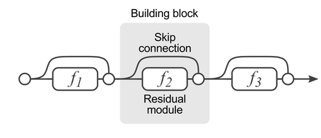

각 block 에서 신호는 skip 을 타거나 $f_i$ 를 거치거나 둘 중 하나를 고를 수 있다. 이 선택을 모두 펼치면(unrolled view) 아래 그림처럼 여러 갈래의 경로가 된다. block 이 3개면 경로는 8가지가 되고, 각 경로는 서로 다른 깊이의 작은 망이다. 즉 ResNet 은 길이가 다른 여러 망의 출력을 합친 ensemble 처럼 동작한다.

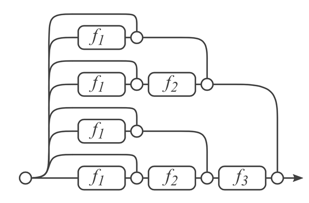

이 관점에서 두 번째 layer $f_2$ 를 제거해 보자. skip connection 이 있으므로 $f_2$ 를 지나는 경로만 끊기고, 나머지 경로는 그대로 남는다. 다른 layer 들이 모여 $f_2$ 의 역할을 대신하는 것이다. 실험적으로 **어떤 layer 를 제거해도 성능이 줄지 않는다**.

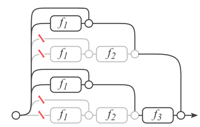

제거하는 layer 를 늘리면 어떻게 될까. 아래 그래프는 제거한 layer 수를 1 개에서 20 개까지 늘리면서 error 를 측정한 것이다. error 는 갑자기 무너지지 않고 **조금씩 하락**한다. 이것은 ensemble 의 특징이다. ensemble 의 성능은 모델 수에 연관되어 있어서, 모델을 하나씩 빼면 성능이 완만하게 떨어진다.

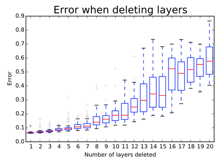

경로의 길이 분포를 보면 이 해석이 더 구체적으로 드러난다. 110 layers ResNet 은 54 개의 module 로 이루어지는데, skip connection 의 영향으로 실제 신호가 거치는 module 수는 훨씬 적다. 아래 그림의 path length 분포에서 19 ~ 35 개 module 을 거치는 경로가 전체의 95% 이상이다. 즉 110 층 망이라 해도 실제로 학습에 기여하는 것은 그보다 훨씬 얕은 경로들의 집합이다.

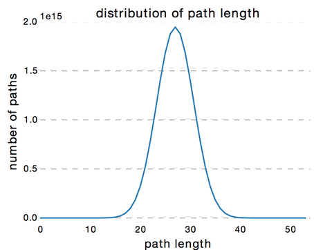

Skip connection 은 loss 의 지형(landscape)도 바꾼다. "Visualizing the Loss Landscape of Neural Nets" 에서 그린 아래 그림은 같은 망의 loss 지형을 skip connection 없이(왼쪽)와 있게(오른쪽) 그린 것이다. skip connection 이 없으면 지형이 험준해 최적화가 어렵고, 있으면 매끄러운 그릇 모양이 되어 최적점을 찾기 쉽다.

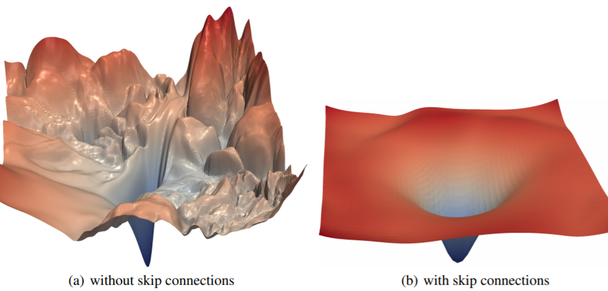

---

## 4.2.8 PyTorch Hub 의 사전학습 ResNet
<!-- 슬라이드 346 -->

ResNet 은 직접 만들지 않아도 된다. torchvision 이 ImageNet 으로 학습된 ResNet 모델을 제공한다.

- 모델 목록 : https://pytorch.org/vision/stable/models.html#classification
- 예 : `torchvision.models.resnet18(pretrained: bool = False, progress: bool = True)`

`pretrained=True` 로 부르면 ImageNet 으로 학습된 가중치를 내려받아 채워 준다. `progress` 는 내려받는 진행 상황을 표시할지 여부다. 최근 torchvision 에서는 `pretrained` 대신 `weights=` 인자로 가중치를 지정하는 방식으로 바뀌었으므로, 쓰는 버전의 문서를 확인한다.

torchvision 이 제공하는 ImageNet 사전학습 ResNet 의 정확도는 다음과 같다. Acc@1 은 top-1, Acc@5 는 top-5 정확도(%) 다. 깊을수록 정확하지만, 앞 실습에서 본 것처럼 파라미터와 연산량도 함께 늘어난다.

| Model | Acc@1 | Acc@5 |
|---|---|---|
| ResNet-18 | 69.758 | 89.078 |
| ResNet-34 | 73.314 | 91.420 |
| ResNet-50 | 76.130 | 92.862 |
| ResNet-101 | 77.374 | 93.546 |
| ResNet-152 | 78.312 | 94.046 |

---

## 4.2.9 정리
<!-- 슬라이드 330~346 -->

- 망을 깊게 쌓으면 vanishing / exploding gradient 와 overfitting 은 기존 기법으로 어느 정도 다스릴 수 있지만, 깊은 망이 얕은 망보다 학습 자체를 못 하는 **degradation problem** 은 해결되지 않았다.
- Highway Network 은 LSTM 의 conveyor belt 에서 착안해 transform gate 와 carry gate 로 정보를 그대로 흘려보내는 길을 만들었고, ResNet 에 영감을 주었다.
- ResNet 은 층이 $H(x)$ 대신 잔차 $F(x) = H(x) - x$ 를 배우게 한다. $H(x) = F(x) + x$ 의 skip connection 덕분에 weight 가 작아도 gradient 가 사라지지 않는다.
- CIFAR-10 실험에서 plain network 은 깊어질수록 나빠지지만 ResNet 은 110 층까지 지속적으로 개선된다. Pre-activation block 은 skip 경로의 연산을 없애고 BN 의 역할을 강화해 1001 층에서도 성능을 끌어올린다.
- ImageNet 용 ResNet 은 identity block(실선)과 conv block(점선, 1×1 conv 로 차원 맞춤)으로 구성되며, ResNet50 이상은 1×1 conv 로 채널을 줄였다 되돌리는 bottleneck block 을 쓴다.
- 실습에서는 `BottleNeck` 클래스와 `_make_blocks` 로 공통 골격을 만들고, 반복 횟수 리스트 [3, 4, 6, 3] 과 [3, 8, 36, 3] 만 바꾸어 ResNet50 과 ResNet152 를 만들었다.
- ResNet 은 길이가 다른 여러 경로의 ensemble 로도 해석된다. layer 를 하나 제거해도 성능이 줄지 않고, 여러 개를 제거하면 완만하게 떨어진다.
- torchvision 은 ImageNet 사전학습 ResNet-18 ~ 152 를 제공한다.

---

## 4.2.10 실습과제
<!-- 슬라이드 343 -->

**Custom ResNet : ResNet26**

실습 4.2.1 에서 만든 골격으로 자신만의 ResNet 을 설계해 Flower Photos dataset 으로 학습시켜 본다.

- 네 단계의 block 숫자를 어떻게 분배하는 것이 좋을지 생각해 본다.
- 목표 : validation accuracy 68% 이상
- lr-scheduler 를 적용해 75% 이상

노트북에는 뼈대가 준비되어 있다. Flower Photos dataset 을 불러오는 코드는 직접 추가한다(노트북에 자리만 비워져 있다). 모델은 `blocks` 리스트만 바꾸면 되고, Flower Photos 는 5 class 이므로 `num_classes=5` 로 만든다.

```python
##
blocks = [2,2,2,2]
##

def resnet26():
    return ResNet_pl(blocks,num_classes=5)
```

`[2,2,2,2]` 이면 bottleneck block 이 8 개, block 마다 conv 가 3 개이므로 conv 24 개에 `conv1` 과 fc 를 더해 26 층이 된다. 이 분배를 바꾸면 층 수도 이름도 달라진다.

```python
model = resnet26()
summary(model, input_size=(1, 3, 224, 224))
```

학습은 Lightning `Trainer` 로 한다. `CSVLogger` 에 기록된 로그로 학습 곡선을 그릴 수 있다.

```python
model = resnet26()
model_name = "ResNet26"

epochs=20
logger = CSVLogger("logs", name=model_name)
trainer = Trainer(max_epochs=epochs, logger=logger,
                  limit_train_batches=1.0, limit_val_batches=1.0)
trainer.fit(model, train_loader, test_loader)
```

아래는 `[2,2,2,2]` 로 20 epoch 학습한 결과다. 훈련 정확도(acc)는 꾸준히 오르지만 검증 정확도(val_acc)는 흔들리며, 최고 검증 정확도는 0.7180 이다.

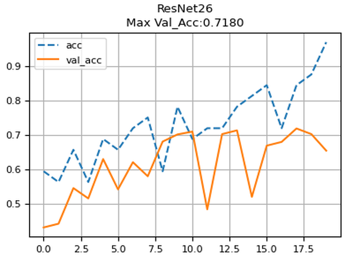

**lr-scheduler 적용**

두 번째 목표를 위해 learning rate 를 단계적으로 줄이는 scheduler 를 붙인다. 시작 learning rate 와 감쇠 규칙을 정한다. `decay_steps` epoch 마다 learning rate 에 `decay_rate` 를 곱하는 계단형 exponential decay 다.

```python
epochs=20
lr_start = 0.001

decay_steps = epochs//3.5
decay_rate=0.6
def exponential_decay_lambda(epoch):
    return decay_rate ** (epoch // decay_steps)
```

학습 전에 epoch 별 learning rate 가 어떻게 변하는지 그려 보면 의도한 대로 계단형으로 줄어드는지 확인할 수 있다.

```python
exp_lr_s=[]

for step in range(epochs):
    exp_lr_s.append(exponential_decay_lambda(step)*lr_start)

plt.plot(exp_lr_s, linestyle='--', label="ExponentialDecay_step")
plt.legend()
plt.grid()
```

scheduler 는 `ResNet_pl` 을 상속해 `configure_optimizers` 만 바꾸면 붙일 수 있다. `LambdaLR` 은 epoch 을 받아 배율을 돌려주는 함수(`lr_lambda`)를 받아 optimizer 의 learning rate 에 곱한다. Lightning 에서는 optimizer 리스트와 scheduler 리스트를 함께 돌려주면 epoch 마다 scheduler 를 호출해 준다.

```python
class ResNet_lr(ResNet_pl):
    def __init__(self, num_block, num_classes=5):
        super(ResNet_lr,self).__init__( num_block, num_classes)

    def configure_optimizers(self):
        optimizer =  torch.optim.Adam(self.parameters(), lr=lr_start)
        lr_scheduler = torch.optim.lr_scheduler.LambdaLR(optimizer, lr_lambda = exponential_decay_lambda)
        return [optimizer], [lr_scheduler]
```

아래는 같은 block 분배에 lr-scheduler 를 적용해 학습한 결과다. 후반부로 갈수록 검증 정확도의 흔들림이 줄고, 최고 검증 정확도는 0.7688 로 올라간다. learning rate 를 줄여 가면 후반 학습이 안정되어 목표 75% 를 넘길 수 있다.

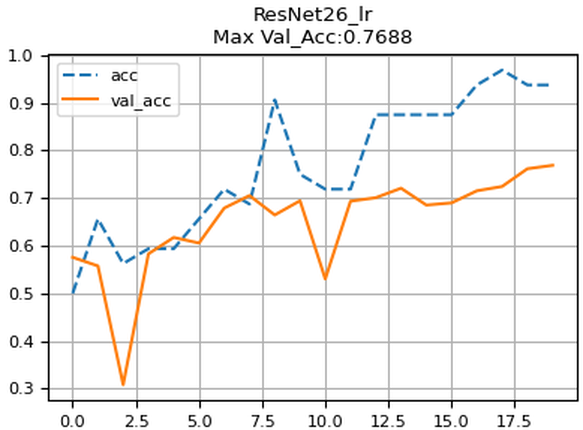

block 분배와 scheduler 의 `decay_steps`, `decay_rate` 를 바꾸어 가며 두 목표를 달성해 본다.
