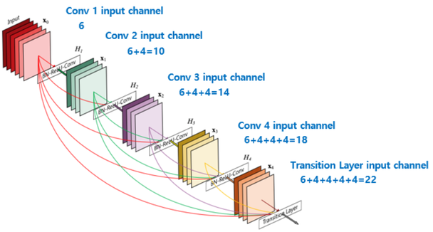
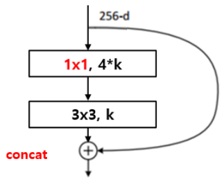
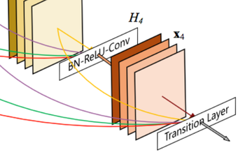
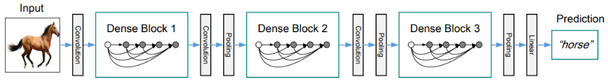
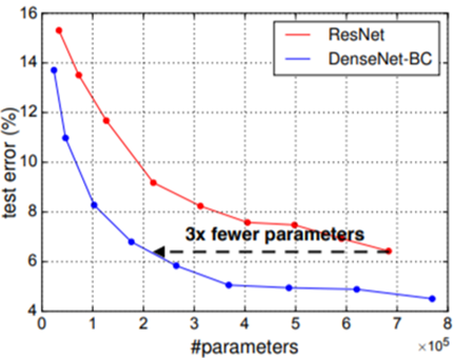

# 4.3 DenseNet

**학습 목표**

- ResNet 이후의 CNN 구조 연구가 깊이·넓이·층 연결·채널 변화의 네 갈래로 나뉜다는 것을 설명할 수 있다.
- Dense block 이 이전 층의 출력을 더하지 않고 이어 붙이는(concatenation) 이유와, growth rate $k$ 에 따른 채널 수 변화를 계산할 수 있다.
- DenseNet-B(bottleneck)·DenseNet-C(compression)·DenseNet-BC 와 transition layer 의 구성을 구분할 수 있다.
- Dense block 과 transition layer 를 반복해 깊은 DenseNet 을 만드는 방식을 구조표에서 읽을 수 있다.
- 비슷한 파라미터 수에서 DenseNet-BC 가 ResNet 보다 유리하다는 것을 비교표와 그래프로 설명할 수 있다.

**이 절의 구성**

- 4.3.1 ResNet 이후의 주요 연구
- 4.3.2 Dense block — skip connection 을 concatenation 으로
- 4.3.3 DenseNet-BC — bottleneck 과 compression
- 4.3.4 Deep DenseNet 의 구조
- 4.3.5 DenseNet-BC 의 효과와 ResNet 비교
- 4.3.6 정리

---

## 4.3.1 ResNet 이후의 주요 연구
<!-- 슬라이드 348 -->

ResNet 이 residual connection 으로 100층이 넘는 망도 학습할 수 있다는 것을 보인 뒤, CNN 구조 연구는
"망의 무엇을 늘릴 것인가" 를 기준으로 몇 갈래로 나뉜다. 아래 표는 ResNet 이후의 대표적인 네 연구 방향을
비교한 것이다.

| 모델 | 연구 방향 | 늘리거나 바꾸는 것 |
|---|---|---|
| ResNet | 망 깊이 연구 | Layer 의 depth 를 늘린다 |
| WideResNet | 망 넓이 연구 | Layer 의 width(채널 수)를 늘린다 |
| DenseNet | 층 연결 연구 | Layer 간 skip connection 을 늘린다 |
| PyramidNet | 채널 변화 연구 | Layer 간 채널(feature map) 수의 변화 방식을 바꾼다 |

ResNet 은 층을 깊게 쌓는 쪽을, WideResNet 은 층은 얕게 두되 각 층의 채널을 넓히는 쪽을 택했다.
PyramidNet 은 층 사이에서 채널(feature map) 수가 어떻게 변해야 하는지, 곧 채널 변화 방식을 다룬다. 이 절에서 다루는 DenseNet 은 이 가운데 **층과 층의 연결** 에 주목한 연구다.
ResNet 의 skip connection 이 효과가 있었다면, 연결을 더 늘리면 어떻게 될까 하는 질문에서 출발한다.

---

## 4.3.2 Dense block — skip connection 을 concatenation 으로
<!-- 슬라이드 349 -->

ResNet 의 residual block 은 바로 앞 블록의 출력 하나만 건너뛰어 더한다. DenseNet 은 이 skip connection 을
더 늘려서, 한 층이 **이전 모듈들의 정보를 모두** 받도록 한다. 단, ResNet 처럼 정보를 add 하지 않고
**concatenation** 한다. Add 는 채널 수가 같은 두 텐서를 원소별로 합쳐 하나로 섞어 버리지만, concatenation
은 이전 층들의 feature map 을 채널 방향으로 나란히 이어 붙이므로 각 층이 만든 feature 가 그대로 보존되고,
뒤 층은 그 가운데 필요한 것을 골라 쓸 수 있다.

> **핵심 메시지**
> DenseNet 의 한 층은 같은 block 안의 이전 층 출력을 모두 입력으로 받는다. 이때 더하지 않고 이어 붙이므로
> 층을 지날 때마다 채널 수가 growth rate $k$ 만큼 늘어난다.

이렇게 연결된 층들의 묶음을 **Dense block** 이라 한다. Dense block 은 conv layer(BN-ReLU-Conv) 4개와
그 뒤의 transition layer 로 구성된다. 각 conv layer 가 새로 만들어 내는 채널 수를 **growth rate** $k$(채널
증가량)라 부른다.

5-layer Dense block 에서 채널이 어떻게 늘어나는지 세어 보자. 입력 채널이 6, $k = 4$ 이고 conv layer 가
4개라면, 각 layer 의 입력 채널은 다음과 같다.

| 위치 | 입력 채널 수 | 계산 |
|---|---|---|
| Conv 1 | 6 | 입력 그대로 |
| Conv 2 | 10 | $6 + 4$ |
| Conv 3 | 14 | $6 + 4 + 4$ |
| Conv 4 | 18 | $6 + 4 + 4 + 4$ |
| Transition layer | 22 | $6 + 4 + 4 + 4 + 4$ |

즉 출력 채널은 $6 + 4(\text{layer}) \times 4(k) = 22$ 채널이다. 각 conv layer 는 $k = 4$ 채널만 새로
만들지만, 이전 층의 출력을 모두 이어 붙이므로 block 을 지나는 동안 채널이 6에서 22로 늘어난다.

그림에서 각 층의 출력 $x_0, x_1, \ldots$ 가 곡선 화살표로 뒤에 오는 모든 층에 이어지는 것이 DenseNet 의
연결 방식이고, 마지막에 이어 붙인 22채널이 transition layer 로 넘어간다.

---

## 4.3.3 DenseNet-BC — bottleneck 과 compression
<!-- 슬라이드 350 -->

DenseNet 의 기본 conv layer 는 skip 으로 들어온 입력에 BN → ReLU → Conv 를 차례로 적용하는 **pre-activation**
구조다. 여기에 bottleneck 과 compression 두 가지를 더한 것이 DenseNet-BC 다.

**DenseNet-B — conv layer 에 bottleneck 구조 추가**

Concatenation 으로 채널이 계속 늘어나므로 3×3 conv 의 입력 채널이 커진다. DenseNet-B 는 conv layer 를
bottleneck 구조로 바꿔 이 문제를 다룬다.

- skip → BN → ReLU → conv(1×1, $4k$)
- → BN → ReLU → conv(3×3, $k$)

3×3 conv 는 1×1 conv 가 $4k$ 로 먼저 줄여 놓은 입력 위에서 $k$ 채널을 새로 만든다.
비슷한 파라미터 수에서 성능이 올라가며, 입력 채널 수(계속 늘어난 값)와 출력 채널 수($k$)의 차이를
극복하는 역할을 한다.

그림의 예에서는 256채널 입력이 1×1 conv(4k) → 3×3 conv(k) 를 거친 뒤 입력과 **concat** 된다. ResNet 의
bottleneck 그림과 모양은 비슷하지만 합치는 연산이 add 가 아니라 concat 이라는 점이 다르다.

**Transition layer**

Dense block 안에서는 feature map 의 해상도가 그대로 유지된다. 해상도를 줄이는 일은 block 사이의
transition layer 가 맡는다.

- skip → BN → ReLU → 1×1 conv → 2×2 avg. pool

2×2 average pooling 으로 feature map 의 해상도를 절반으로 줄인다.

**DenseNet-C — transition layer 에서 압축(channel compression) 적용**

Transition layer 의 1×1 conv 에서 채널을 줄인다. 압축 비율 $\theta$ 는 $0 < \theta < 1$ 이고 논문에서는
0.5를 적용했다. 즉 block 을 지나며 늘어난 채널을 다음 block 에 넘기기 전에 절반으로 줄인다.

**DenseNet-BC**

Conv layer 에 bottleneck 을 적용하고 transition layer 에 compression 을 적용한 것이 DenseNet-BC 다.
네 변형을 한 표로 정리하면 다음과 같다.

| 이름 | Conv layer | Transition layer |
|---|---|---|
| DenseNet | BN-ReLU-Conv(3×3) | BN-ReLU-1×1 conv-2×2 avg. pool |
| DenseNet-B | bottleneck: BN-ReLU-conv($1 \times 1$, $4k$)-BN-ReLU-conv($3 \times 3$, $k$) | 그대로 |
| DenseNet-C | 그대로 | 1×1 conv 에서 채널을 $\theta$ 배로 압축 |
| DenseNet-BC | bottleneck | compression |

---

## 4.3.4 Deep DenseNet 의 구조
<!-- 슬라이드 351 -->

깊은 DenseNet 은 Dense block 과 transition layer 를 반복한 뒤 global average pooling 으로 마무리한다.
Dense block 안에서는 해상도를 유지한 채 채널을 늘리고, transition layer 에서 해상도와 채널을 줄이는 일을
되풀이하는 구조다.

아래 표는 ImageNet 용 DenseNet 네 가지(DenseNet-121·169·201·264)의 구조를 층별로 정리한 것이다.
네 모델은 앞부분(convolution·pooling)과 Dense Block (1)·(2)까지는 같고, Dense Block (3)·(4)의 반복
횟수만 다르다. 대괄호 안은 한 conv layer 의 구성(1×1 conv 뒤 3×3 conv, 곧 bottleneck)이고 ×N 은 그
layer 의 반복 횟수다.

| Layers | Output size | DenseNet-121 | DenseNet-169 | DenseNet-201 | DenseNet-264 |
|---|---|---|---|---|---|
| Convolution | 112×112 | 7×7 conv, stride 2 | ← | ← | ← |
| Pooling | 56×56 | 3×3 max pool, stride 2 | ← | ← | ← |
| Dense Block (1) | 56×56 | [1×1 conv, 3×3 conv] ×6 | ×6 | ×6 | ×6 |
| Transition Layer (1) | 56×56 | 1×1 conv | ← | ← | ← |
|  | 28×28 | 2×2 average pool, stride 2 | ← | ← | ← |
| Dense Block (2) | 28×28 | [1×1 conv, 3×3 conv] ×12 | ×12 | ×12 | ×12 |
| Transition Layer (2) | 28×28 | 1×1 conv | ← | ← | ← |
|  | 14×14 | 2×2 average pool, stride 2 | ← | ← | ← |
| Dense Block (3) | 14×14 | [1×1 conv, 3×3 conv] ×24 | ×32 | ×48 | ×64 |
| Transition Layer (3) | 14×14 | 1×1 conv | ← | ← | ← |
|  | 7×7 | 2×2 average pool, stride 2 | ← | ← | ← |
| Dense Block (4) | 7×7 | [1×1 conv, 3×3 conv] ×16 | ×32 | ×32 | ×48 |
| Classification Layer | 1×1 | 7×7 global average pool | ← | ← | ← |
|  |  | 1000D fully-connected, softmax | ← | ← | ← |

표를 읽는 법은 이렇다. 입력이 7×7 conv(stride 2)와 3×3 max pool 을 거쳐 56×56 이 되면, 그 해상도에서
Dense Block (1)이 bottleneck conv layer 를 6번 반복하며 채널을 늘린다. Transition Layer 는 1×1 conv 로
채널을 압축한 뒤 2×2 average pool 로 해상도를 절반(56 → 28)으로 줄인다. 이것을 세 번 되풀이해 7×7 까지
내려온 뒤 Dense Block (4)를 지나고, 마지막에 7×7 global average pool 로 공간 차원을 없애 1000 클래스
fully-connected + softmax 로 분류한다. 모델 이름의 숫자(121, 169, …)는 층 수이며, 깊은 모델일수록 뒤쪽
block 의 반복 횟수가 많다.

---

## 4.3.5 DenseNet-BC 의 효과와 ResNet 비교
<!-- 슬라이드 352 -->

DenseNet-BC 의 효과는 같은 계열의 다른 모델, 특히 ResNet 과 견주어 보면 분명해진다. 아래 표는 여러 모델의
깊이(Depth)·파라미터 수(Params)와 C10·C10+ 조건에서의 test error(%) 를 비교한 것이다. 값이 작을수록 좋다.

| Method | Depth | Params | C10 | C10+ |
|---|---|---|---|---|
| Network in Network | - | - | 10.41 | 8.81 |
| All-CNN | - | - | 9.08 | 7.25 |
| Deeply Supervised Net | - | - | 9.69 | 7.97 |
| Highway Network | - | - | - | 7.72 |
| FractalNet | 21 | 38.6M | 10.18 | 5.22 |
| └ with Dropout/Drop-path | 21 | 38.6M | 7.33 | 4.60 |
| ResNet | 110 | 1.7M | - | 6.61 |
| ResNet (Stochastic Depth 논문의 재측정값) | 110 | 1.7M | 13.63 | 6.41 |
| ResNet with Stochastic Depth | 110 | 1.7M | 11.66 | 5.23 |
|  | 1202 | 10.2M | - | 4.91 |
| Wide ResNet | 16 | 11.0M | - | 4.81 |
|  | 28 | 36.5M | - | 4.17 |
| └ with Dropout | 16 | 2.7M | - | - |
| ResNet (pre-activation) | 164 | 1.7M | 11.26* | 5.46 |
|  | 1001 | 10.2M | 10.56* | 4.62 |
| DenseNet ($k = 12$) | 40 | 1.0M | 7.00 | 5.24 |
| DenseNet ($k = 12$) | 100 | 7.0M | 5.77 | 4.10 |
| DenseNet ($k = 24$) | 100 | 27.2M | 5.83 | 3.74 |
| DenseNet-BC ($k = 12$) | 100 | 0.8M | 5.92 | 4.51 |
| DenseNet-BC ($k = 24$) | 250 | 15.3M | 5.19 | 3.62 |
| DenseNet-BC ($k = 40$) | 190 | 25.6M | - | 3.46 |

표에서 눈여겨볼 짝은 두 가지다.

- **ResNet 110층(1.7M, C10+ 6.61)** 과 **DenseNet-BC $k = 12$ 100층(0.8M, C10+ 4.51)**: DenseNet-BC 는
  파라미터가 절반 이하인데도 오류율이 낮다.
- **ResNet 1202층(10.2M, 4.91)·ResNet pre-activation 1001층(10.2M, 4.62)** 과 **DenseNet-BC $k = 24$
  250층(15.3M, 3.62)**: 1000층이 넘는 ResNet 보다 훨씬 얕은 DenseNet-BC 가 더 낮은 오류율을 보인다.

또한 DenseNet 계열 안에서도 bottleneck 과 compression 을 넣은 DenseNet-BC 가 같은 $k$ 의 DenseNet 보다
훨씬 적은 파라미터로 비슷하거나 더 좋은 결과를 낸다($k = 12$, 100층: 7.0M → 0.8M).

파라미터 수에 따른 test error 를 그래프로 보면 이 차이가 한눈에 들어온다.

DenseNet-BC 곡선이 ResNet 곡선보다 전 구간에서 아래에 있고, 같은 test error 를 약 **3배 적은
파라미터** 로 얻는다. 이전 층의 feature 를 재사용하므로 새로 만들어야 할 채널이 적고, 그만큼 파라미터를
아끼면서도 성능이 유지된다는 뜻이다.

끝으로 깊이가 다른 DenseNet 네 모델의 top-1·top-5 정확도(%)를 비교하면 다음과 같다. 대체로 깊을수록 정확도가
높아지지만, 층 수가 161인 모델이 201인 모델보다 높은 것에서 정확도가 층 수만으로 정해지지는 않는다는 것도
알 수 있다.

| Model | Acc@1 | Acc@5 |
|---|---|---|
| Densenet-121 | 74.434 | 91.972 |
| Densenet-169 | 75.600 | 92.806 |
| Densenet-201 | 76.896 | 93.370 |
| Densenet-161 | 77.138 | 93.560 |

---

## 4.3.6 정리
<!-- 슬라이드 348~352 -->

- ResNet 이후의 CNN 연구는 깊이(ResNet)·넓이(WideResNet)·층 연결(DenseNet)·채널 변화(PyramidNet)로
  갈라진다. DenseNet 은 skip connection 을 늘리는 쪽이다.
- Dense block 의 각 층은 이전 층의 출력을 모두 받되, add 가 아니라 **concatenation** 한다. 층마다
  growth rate $k$ 채널이 새로 생기므로 입력 6, $k = 4$, conv layer 4개면 출력은 $6 + 4 \times 4 = 22$
  채널이다.
- Conv layer 는 BN-ReLU-Conv 의 pre-activation 구조다. **DenseNet-B** 는 여기에 1×1 conv($4k$) →
  3×3 conv($k$) bottleneck 을 넣고, **DenseNet-C** 는 transition layer 의 $1 \times 1$ conv 에서 채널을 $\theta$
  (논문에서 0.5) 배로 압축한다. 둘을 합친 것이 **DenseNet-BC** 다.
- Transition layer 는 BN-ReLU-1×1 conv-2×2 avg. pool 로 채널과 해상도를 줄이며, 깊은 DenseNet 은
  Dense block + transition layer 의 반복 뒤 global average pooling 으로 끝난다.
- DenseNet-BC 는 ResNet 과 비교해 같은 test error 를 약 3배 적은 파라미터로 얻는다.
