# 4.4 Weakly Supervised Learning

**학습 목표**

- CNN 의 supervised learning 이 labeling 된 data 에 의존하며, bounding box·segmentation annotation 비용이 왜 문제가 되는지 설명할 수 있다.
- Class label 만으로 object 를 찾고 위치를 표시하려는 weakly supervised learning 의 발상을 설명할 수 있다.
- FC layer 를 없애고 global average pooling 으로 분류기를 만들면 classifier CNN 이 이미 갖고 있던 localization 정보가 드러나는 이유를 설명할 수 있다.
- 출력층의 가중치를 마지막 conv feature map 에 투영해 Class Activation Map(CAM) 을 만드는 과정을 설명할 수 있다.
- CAM 이 scene recognition·medical image·action·event·text detection 에 어떻게 응용되는지 예를 들 수 있다.

**이 절의 구성**

- 4.4.1 Weakly supervised learning 의 필요성
- 4.4.2 분류 모델이 보는 기준 들여다보기
- 4.4.3 Object detection 을 넘어 — scene recognition 과 medical image
- 4.4.4 Classifier 로 localization 하기
- 4.4.5 Class Activation Map(CAM)
- 4.4.6 Deep feature localization 의 응용
- 4.4.7 정리

---

## 4.4.1 Weakly supervised learning 의 필요성
<!-- 슬라이드 354 -->

CNN 은 supervised learning 이다. Labeling 된 data 를 통해 학습하므로 data 에 대한 의존도가 높고, data 자체는
많아도 labeling 된 것은 부족하다. 게다가 labeling 은 그 자체가 비용이 많이 드는 작업이다. 이미지 한 장에
"고양이" 라는 class label 을 붙이는 일은 비교적 쉽지만, object 의 bounding box 를 그리는 일은 훨씬 손이
많이 가고, 픽셀 단위로 영역을 칠하는 segmentation annotation 은 아주 힘든 작업이다. 이것은 data 의 문제이면서
동시에 그런 data 없이는 학습할 수 없는 CNN 의 문제이기도 하다.

그래서 다음과 같은 질문이 나온다. **부족한 정보(label)로 더 복잡한 문제를 풀 수 있을까?** 이 질문에 답하려는
것이 **weakly supervised learning** 이다. 이 절의 목표를 한 문장으로 쓰면 이렇다.

> **핵심 메시지**
> Class label 만으로 object 를 찾고, 그 위치를 표시해 보자.

즉 "이 사진은 고양이다" 라는 이미지 수준의 약한(weak) label 만 가지고 학습한 분류 모델에서, bounding box
같은 위치 정보를 끌어내려는 것이다. 이것이 가능하다면 값비싼 위치 annotation 없이도 object 의 위치를
찾는 문제에 접근할 수 있다.

---

## 4.4.2 분류 모델이 보는 기준 들여다보기
<!-- 슬라이드 355 -->

Class label 만으로 위치를 찾으려면 먼저 이런 질문에 답해야 한다. **분류 모델이 분류하는 기준은 무엇이고,
그 기준을 어떻게 들여다볼 수 있을까?** 분류 모델이 이미지의 어느 부분을 보고 "goldfish" 라고 판단했는지
알 수 있다면, 그 부분이 곧 object 의 위치다.

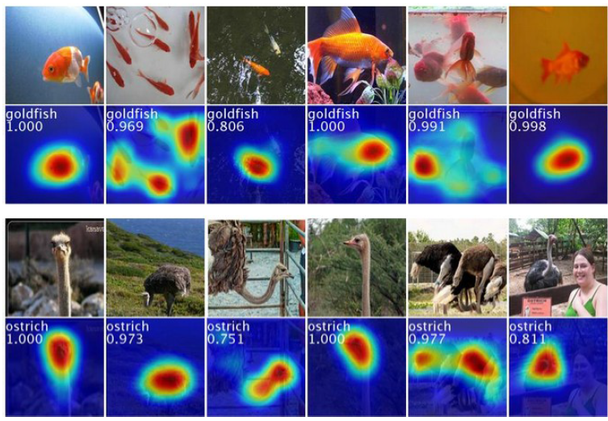

그림의 위 줄은 원본 이미지, 아래 줄은 모델이 각 클래스(goldfish, ostrich)로 판단할 때 강하게 반응한 위치를
붉은색으로 표시한 heatmap 이다. 각 heatmap 에는 클래스 이름과 점수(goldfish 1.000, 0.969, 0.806, …,
ostrich 1.000, 0.973, 0.751, …)가 적혀 있다. 붉은 영역이 실제 금붕어와 타조가 있는 자리와 겹친다는 것, 곧
모델이 배경이 아니라 object 를 보고 판단했다는 것을 확인할 수 있다. 이 heatmap 을 만드는 방법이 이 절의
주제이며, 4.4.4 와 4.4.5 에서 그 원리를 다룬다.

---

## 4.4.3 Object detection 을 넘어 — scene recognition 과 medical image
<!-- 슬라이드 356~357 -->

분류 모델이 보는 기준을 들여다볼 수 있다면 object detection 이상의 것도 할 수 있다.

**Scene recognition — scene 을 규정하는 기준은?**

"음식점", "푸드코트" 같은 scene 은 하나의 object 가 아니라 여러 요소가 모여 정해진다. 분류 모델이 어느
부분을 근거로 scene 을 판단했는지 볼 수 있으면 scene 을 규정하는 기준을 알 수 있다. 다음은 scene
recognition 데모(http://places2.csail.mit.edu/demo.html)에 푸드코트 사진을 넣은 결과다.

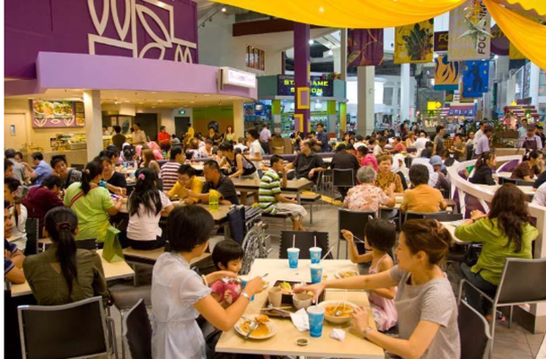

데모가 돌려준 예측은 다음과 같다.

| 항목 | 예측 결과 |
|---|---|
| Type of environment | indoor |
| Scene categories | food_court (0.690), cafeteria (0.163) |
| Scene attributes | no horizon, enclosed area, man-made, socializing, indoor lighting, cloth, congregating, eating, working |
| Informative region for predicting the category "food_court" | 아래 heatmap |

환경 유형(실내), scene 범주(food_court 0.690, cafeteria 0.163), scene 속성(지평선 없음, 닫힌 공간, 인공물,
사교, 실내 조명, 옷, 모임, 식사, 일)까지 예측하고, 마지막으로 "food_court" 라는 범주를 예측하는 데 근거가
된 영역을 heatmap 으로 보여 준다.

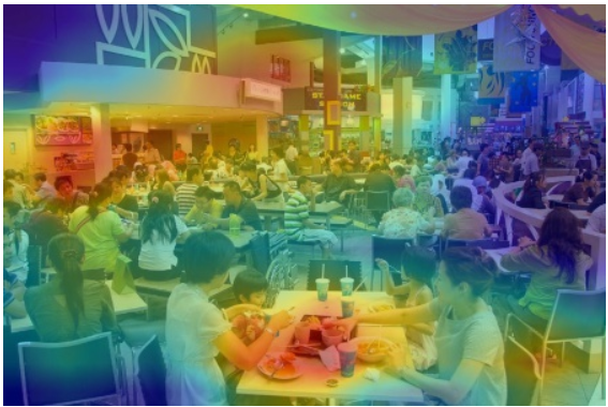

사람들이 앉아 식사하는 테이블 부분이 붉게 강조되어 있다. 모델은 천장이나 간판이 아니라 "여러 사람이
테이블에서 먹고 있다" 는 부분을 근거로 푸드코트라고 판단한 것이다.

**Medical image recognition**

의료 영상은 이런 접근이 특히 필요한 분야다. 영상 수집 자체가 어렵고, 의료 영상에는 주석(annotation)이
없는 경우가 많다. 병변의 위치를 표시하는 주석 처리는 전문가가 해야 하는 너무 어려운 작업이기 때문이다.
따라서 주석이 적거나 없는 영상으로 학습해야 하며, "정상/비정상" 같은 영상 수준의 label 만으로 병변 위치를
찾아내는 weakly supervised 방식이 요구된다.

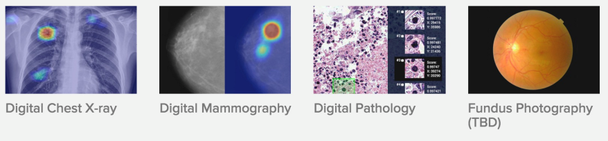

그림은 digital chest X-ray, digital mammography, digital pathology, fundus photography 네 종류의 의료
영상에서 모델이 주목한 영역을 heatmap 으로 표시한 것이다. 픽셀 단위 주석 없이도 영상의 어느 부분이 판단의
근거가 되었는지 보여 준다.

---

## 4.4.4 Classifier 로 localization 하기
<!-- 슬라이드 358 -->

그러면 분류 모델에서 위치 정보를 어떻게 끌어낼까? 가장 쉬운 접근(easy approach)은 모델 구조를 다음과
같이 바꾸는 것이다.

- Conv layer 만으로 모델을 구성한다.
- 마지막 feature map 의 수를 class 숫자와 동일하게 맞춘다.
- FC layer 를 제거하고, global average pooling 으로 feature map 을 출력과 mapping 한다.

이렇게 하면 마지막 feature map 하나하나가 곧 한 class 에 대응하고, 그 feature map 의 각 위치 값이 "이
위치에 이 class 가 있다" 는 증거가 된다. Global average pooling 은 그 증거를 공간 전체에서 평균해 class
점수로 만든다. 따라서 **classifier CNN 은 이미 localize 정보를 갖고 있다** — 다만 FC layer 가 그것을 뭉개
버렸을 뿐이다.

FC layer 와 global average pooling 의 차이를 그림으로 보면 다음과 같다.

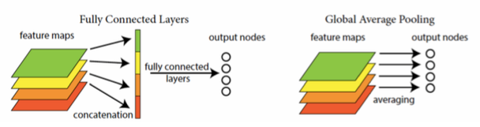

Fully connected layer 는 모든 feature map 을 하나로 이어 붙인(concatenation) 뒤 출력 노드와 모두 연결하므로
공간 정보가 섞여 사라진다. Global average pooling 은 feature map 하나를 평균(averaging)해 출력 노드 하나에
바로 잇는다. 어느 feature map 이 어느 class 에 대응하는지가 그대로 유지된다.

AlexNet 과 비슷한 8층 모델로 이 구조를 만들면 feature map 의 크기는 다음처럼 변한다.

| 단계 | 크기 |
|---|---|
| 입력 | 451×451×3 |
| AlexNet like 8 layers model 의 conv 출력 | 13×13×256 |
| 이어지는 conv 출력 | 8×8×1024 |
| 이어지는 conv 출력 | 8×8×1024 |
| 마지막 feature map (class 수와 동일) | 8×8×1000 |
| Global average pooling → Output (classes) | cat (0.53), dog (0.46), person (0.02), cup (0.02) |

마지막 8×8×1000 feature map 은 "8×8 의 각 pixel 이 어느 class 로 분류되는가(8×8 pixel classified as)" 를
담고 있다. 이것을 global average pooling 으로 평균하면 cat 0.53, dog 0.46, person 0.02, cup 0.02 같은 class
점수가 나오고, 평균하기 전의 8×8 map 을 보면 각 class 가 이미지의 어디에 있는지 알 수 있다.

실제 예를 보자. 새 사진을 넣었을 때 마지막 conv feature map 은 13×13 크기의 응답으로 나타난다.

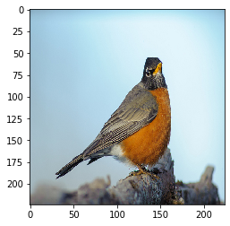

13×13 map 에서 값이 높은(밝은) 부분이 새의 몸통 위치와 겹친다. 원본 이미지의 해상도보다 훨씬 거칠지만,
분류만 학습한 모델이 object 의 위치를 알고 있다는 것이 드러난다.

---

## 4.4.5 Class Activation Map(CAM)
<!-- 슬라이드 359~360 -->

앞의 방법은 마지막 feature map 수를 class 수에 맞추어야 한다는 제약이 있고, map 도 거칠다. 더 정교한 CAM
은 **다시 투영(re-projection)** 으로 만든다. Global average pooling 뒤 출력층의 가중치를 마지막 conv
feature map 에 투영하는 것이다.

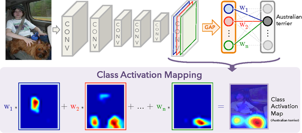

그림의 위쪽은 모델 구조다. 이미지가 CONV 층들을 지나 마지막 conv feature map 이 되고, 각 feature map 을
GAP 으로 평균한 값이 가중치 $w_1, w_2, \ldots, w_n$ 을 거쳐 "Australian terrier" 출력 노드에 연결된다.
아래쪽이 CAM 이다. 출력 노드로 들어가는 가중치 $w_1, w_2, \ldots, w_n$ 을 그대로 마지막 conv feature map
에 곱해 더한다.

$$
\text{CAM} = w_1 \cdot F_1 + w_2 \cdot F_2 + \cdots + w_n \cdot F_n
$$

여기서 $F_i$ 는 마지막 conv layer 의 $i$ 번째 feature map 이고, $w_i$ 는 그 feature map 의 GAP 값이 해당
class 출력 노드로 들어갈 때의 가중치다. GAP 이 공간을 평균해 버리기 전의 feature map 에 같은 가중치를
적용하므로, 출력 점수에 크게 기여한 feature map 이 이미지의 어느 위치에서 활성화되었는지가 map 으로
나타난다. 마지막 feature map 수를 class 수에 맞출 필요가 없고, 어떤 class 에 대해서도 그 class 의 가중치를
쓰면 CAM 을 얻을 수 있다.

CAM 은 영상에 있는 클래스에 대해 생성된다. 주어진 이미지에서 각 카테고리의 영역이 개별적으로 생성되므로,
같은 건물 사진이라도 궁전, 돔, 교회 등 카테고리마다 다른 영역이 표현된다.

**Object localization — top-5 예측의 CAM 비교**

모델이 예측한 상위 5개 후보(top 5 predicted categories)의 CAM 을 나란히 보면 모델의 학습 결과를 시각적으로
비교할 수 있다.

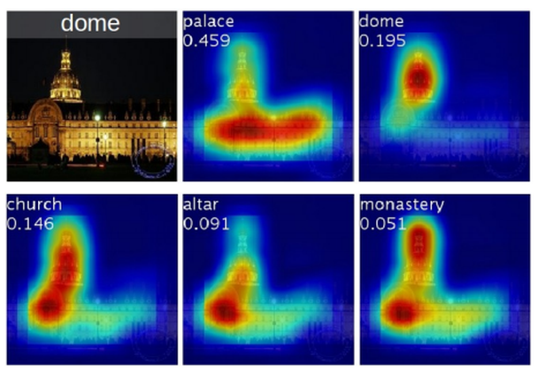

dome 사진에 대해 모델은 palace(0.459), dome(0.195), church(0.146), altar(0.091), monastery(0.051)를
예측했다. 후보마다 CAM 이 다르다. palace 는 건물 전체와 아래쪽 넓은 부분을, dome 은 위쪽 돔 부분을
강조한다. 같은 이미지에서도 class 마다 근거로 삼는 영역이 다르다는 것, 그리고 정답인 dome 의 CAM 이
실제 돔 위치를 가리킨다는 것을 확인할 수 있다.

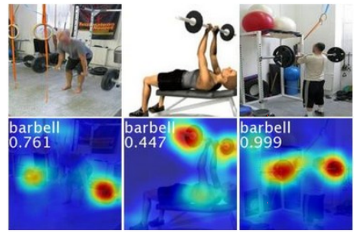

barbell 예에서는 점수가 0.761, 0.447, 0.999 로 다른 세 이미지 모두에서 바벨 원판이 있는 위치가 붉게
강조된다. 사람이 아니라 바벨을 보고 "barbell" 이라 판단했다는 것이 CAM 으로 드러난다.

---

## 4.4.6 Deep feature localization 의 응용
<!-- 슬라이드 361~362 -->

**Scene recognition 과 action·event 인식**

CNN + GAP + classifier 구조는 generic task 에 대한 일반화된 deep feature 를 효율적으로 localize 한다.
특정 object 가 아니라 "바닥 청소", "요리" 같은 행동이나 "폴로", "조정" 같은 사건(event)처럼 여러 요소로
규정되는 개념에 대해서도 CAM 이 근거 영역을 보여 준다는 뜻이다. 다음 두 그림은 각각 Stanford Action40 과
UIUC Event8 데이터셋의 예다.

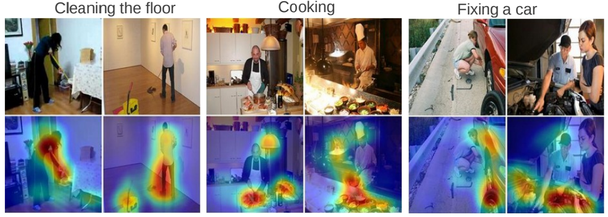

Cleaning the floor 에서는 사람과 걸레가 닿는 바닥, Cooking 에서는 조리대 위 음식과 손, Fixing a car 에서는
차량과 사람이 맞닿은 부분이 강조된다.

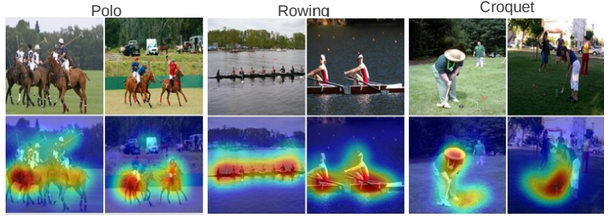

Polo 에서는 말과 기수, Rowing 에서는 물 위의 보트와 사람, Croquet 에서는 채를 든 사람 주변이 강조된다.
행동·사건을 규정하는 요소가 무엇인지 모델이 스스로 찾아낸 셈이다.

**Weakly supervised text detector**

Text detection 에도 같은 방법이 쓰인다. 학습 data 는 다음과 같이 구성한다.

| 구분 | Data |
|---|---|
| Positive set | 텍스트가 들어 있는 Google Street View 이미지 350장 — 'Street View Text (SVT) Dataset', Google StreetView 에서 수집 |
| Negative set | SUN dataset 의 outdoor scene 이미지 |

이미지에 "텍스트가 있다/없다" 라는 label 만 있고 텍스트가 어디 있는지 bounding box 는 없다. 그런데도
positive/negative 를 구분하도록 학습한 모델의 CAM 은 텍스트 영역을 감지한다.

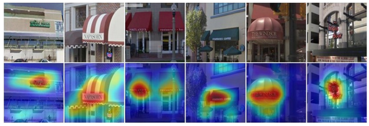

상점 앞 사진에서 간판의 글자 부분이 붉게 강조된다. Bounding box 없는 image 만으로 text 영역을 감지한
것이다.

---

## 4.4.7 정리
<!-- 슬라이드 363~364 -->

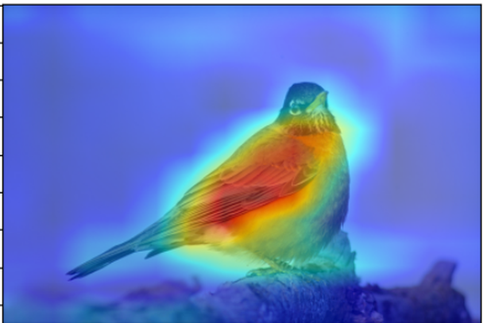

- **분류 교육을 받은 CNN 은 객체 localization 정보를 가진다.** Bounding box 주석은 없어도 된다. FC layer
  대신 global average pooling 을 쓰면 그 정보가 드러난다.
- **CAM 은 예측한 클래스를 시각화하는 데 유용하다.** 출력층의 가중치를 마지막 conv feature map 에 투영해
  만들며, 감지한 객체를 차별적으로(discriminative) 강조 표시하고, 정확한 object localization 을 수행할
  수 있다. 4.4.4 의 새 사진에 CAM 을 겹치면 위 그림처럼 새의 몸통이 가장 붉게 나타난다.
- **CAM 기술은 다른 다양한 영상 인식에 적용할 수 있다.** Deep feature localization 은 scene & object
  detection, concept localization, text detection 등 다양한 영상 처리에 적용된다.
- CAM 을 PyTorch 로 직접 만들어 보는 실습은 4.6 절에서 다룬다.
