# 4.5 Transfer Learning 실습

**학습 목표**

- 전이학습(transfer learning)이 무엇이고, 사전학습 모델을 "불러오기 → 구조 바꾸기 → 일부 freeze → 새 layer 추가 → 내 데이터로 fine tuning" 하는 절차가 왜 그 순서인지 설명할 수 있다.
- torchvision 의 사전학습 VGG16 에서 `features` 부분만 떼어 내고, `requires_grad` 속성으로 학습할 layer 와 얼려 둘 layer 를 나눌 수 있다.
- 입력 크기와 class 수가 다른 데이터(CIFAR10, flower_photos)에 맞춰 classifier 를 새로 붙이고 Lightning 으로 학습·평가할 수 있다.
- 폴더 구조로 된 custom dataset 을 `splitfolders`·`ImageFolder`·`random_split` 로 나누어 `DataLoader` 에 올릴 수 있다.
- InceptionV3 처럼 구조가 복잡한 모델에서 `named_children()` 으로 freeze 범위를 정하고 `fc` 를 바꾸며, 학습 모드 출력(`InceptionOutputs`)의 `.logits` 를 다룰 수 있다.

**이 절의 구성**

- 4.5.1 Transfer Learning 과 사전학습 모델
- 4.5.2 사전학습 VGG16 을 CIFAR10 에 맞추기 (실습 4.5.1)
- 4.5.3 사전학습 VGG16 과 custom dataset (실습 4.5.2)
- 4.5.4 사전학습 InceptionV3 fine tuning (실습 4.5.3)
- 4.5.5 실습과제
- 4.5.6 정리

---

## 4.5.1 Transfer Learning 과 사전학습 모델
<!-- 슬라이드 366~367 -->

### 전이학습이란

전이학습(Transfer Learning)은 하나의 학습에서 얻은 지식을 유사한 다른 학습에 적용하는 것이다. 처음부터 내 데이터만으로 모델을 학습시키는 대신, 제3자가 대규모 데이터로 미리 학습해 둔 모델(pre-trained model)과 그 학습 결과(parameters)를 그대로 가져와 출발점으로 삼는다. 절차는 세 단계로 정리된다.

1. 제3자의 사전학습 모델과 학습 결과(parameters)를 load 한다.
2. 내 문제에 맞도록 모델을 변경·개선한다 — 필요 없는 부분을 떼어 내고, 출력 class 수에 맞는 새 layer 를 붙인다.
3. 내 데이터를 사용해 모델을 fine tuning 한다.

이렇게 하면 대규모 학습 결과를 기반으로 내 모델을 빠르게 구축할 수 있고, 적은 데이터로도 좋은 결과를 얻을 수 있다. ImageNet 처럼 큰 데이터로 학습된 convolution 층은 이미 edge·texture·부분 형태 같은 일반적인 시각 feature 를 뽑아내도록 학습되어 있다. 그래서 이 부분은 거의 그대로 두고, 내 문제에 맞는 분류기 부분만 새로 학습해도 충분한 경우가 많다. 이 절의 세 실습은 모두 "convolution 부분은 재활용, 분류기는 새로" 라는 같은 틀을 따른다.

> **핵심 메시지**
> 전이학습 = 사전학습 모델(구조 + 파라미터) load → 내 문제에 맞게 구조 변경 → 내 데이터로 fine tuning.
> 대규모 학습 결과를 재활용하므로 적은 데이터로도 빠르게 좋은 모델을 얻는다.

### 사전학습 모델은 어디서 얻나 — PyTorch Hub

사전학습 모델(Pre-trained Models)은 PyTorch Hub(pytorch.org/hub/)에서 얻는다. 연구용으로 공개된 모델이 분야별(Vision, Audio, NLP, Generative …)로 정리되어 있고, 모델마다 `torch.hub.load()` 로 불러오는 코드와 입력 전처리 규칙이 페이지에 함께 적혀 있다.

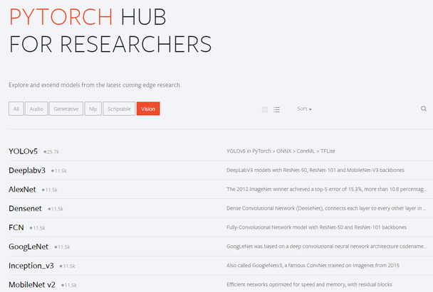

이 절에서 적용할 사전학습 모델은 두 가지다. 아래 표는 두 모델의 크기와 ImageNet 정확도, 그리고 어떤 데이터에 적용할지를 정리한 것이다.

| 사전학습 모델 | Hub 페이지 | Size | 파라미터 수 | Depth | ImageNet 정확도 (top-1 / top-5) | 적용할 dataset |
|---|---|---|---|---|---|---|
| VGG16 | https://pytorch.org/hub/pytorch_vision_vgg/ | 528 MB | 138M | 23 | 0.713 / 0.901 | CIFAR-10, custom dataset |
| Inception v3 | https://pytorch.org/hub/pytorch_vision_inception_v3/ | 215 MB | 55.8M | 572 | 0.803 / 0.953 | custom dataset |

VGG16 은 3×3 convolution 과 max pooling 이 일렬로 쌓인 단순한 구조라서 "어디까지 얼리고 어디부터 학습할지" 를 layer 순서대로 정하기 쉽다. 그래서 첫 두 실습에서 CIFAR-10 과 custom dataset 에 차례로 적용한다. Inception v3 는 여러 갈래(branch)가 합쳐지는 inception module 이 반복되는 복잡한 구조라서, 세 번째 실습에서 "복잡한 모델을 다루는 법" 을 익히는 데 쓴다.

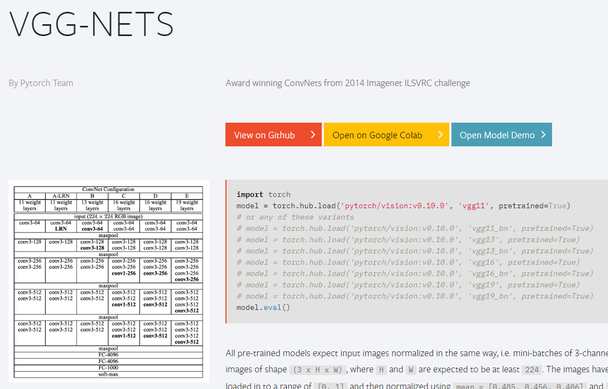

Hub 페이지가 알려 주는 것 가운데 실습에서 바로 쓰이는 정보가 둘 있다. 하나는 로드 코드(`torch.hub.load('pytorch/vision', 'vgg16', pretrained=True)` 또는 `torchvision.models.vgg16(pretrained=True)`)이고, 다른 하나는 모든 사전학습 모델이 같은 방식으로 정규화된 입력(3×H×W, [0, 1] 로 읽은 뒤 채널별 mean·std 로 정규화)을 기대한다는 점이다. 뒤의 InceptionV3 실습에서 transform 에 `v2.Normalize()` 를 넣는 이유가 여기에 있다.

---

## 4.5.2 사전학습 VGG16 을 CIFAR10 에 맞추기
<!-- 슬라이드 368~374 -->

### 실습 4.5.1 — Fine tuning Pretrained VGG16
<!-- 슬라이드 368 -->

> 노트북: `code/4.5.1.VGG_C10.ipynb`
> [](https://colab.research.google.com/github/AI-BoostCamp/intermediate-deep-learning-pytorch/blob/main/code/4.5.1.VGG_C10.ipynb)

**목적**: Pretrain 된 VGG16 model 을 CIFAR10 dataset 에 맞추어 fine tuning 한다.

**실습 개요**

- ImageNet 으로 train 된 VGG16 model 을 이용하여 CIFAR10 을 classification 하는 model 을 design 한다.
- CIFAR10 dataset 을 VGG16 의 input 에 맞추는 작업을 실습한다.
- Trainable option 을 활용하여 fine tuning 할 layer 를 설정한다.
- CIFAR10 에 맞춘 classification layer 를 추가한다.

CIFAR10 은 32×32 컬러 이미지 10 class 이고, VGG16 은 224×224 ImageNet 1000 class 로 학습된 모델이다. 입력 크기도 class 수도 다르므로 "입력을 맞추는 일" 과 "출력을 맞추는 일" 이 이 실습의 두 축이다.

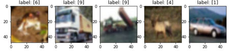

### Fine tuning 모델 설계
<!-- 슬라이드 369 -->

Fine tuning 모델은 네 단계를 거쳐 만든다. 아래 표는 각 단계에서 모델이 어떤 모습이 되는지를 정리한 것이다.

| 단계 | 모델 상태 | 내용 |
|---|---|---|
| 1 | VGG16 full model | features module(convolution 부분) + classifier module(FC 층들 + softmax) 전체를 불러온다 |
| 2 | FC layer 제거 model | classifier module 을 떼어 내고 features module 만 남긴다 |
| 3 | Layer freeze | features module 의 앞부분은 Freeze Layer 로 고정하고, 마지막 conv block 만 Trainable Layer 로 둔다 |
| 4 | Add custom Layer | Flatten → FC-512 → FC-10 → softmax 를 Added Layer 로 붙여 10 class 분류기를 완성한다 |

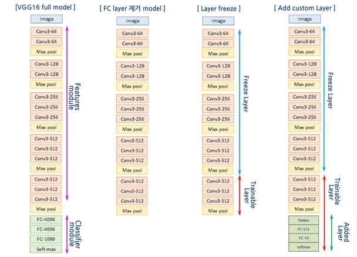

왜 이런 순서인가. ImageNet 용 classifier(FC-4096 → FC-4096 → FC-1000)는 1000 class 출력이라 CIFAR10 에는 쓸 수 없으므로 통째로 버린다(2 단계). features module 의 앞쪽 층은 일반적인 시각 feature 를 뽑는 부분이라 그대로 두고, 뒤쪽의 마지막 conv block 만 내 데이터에 맞게 조금 더 학습시킨다(3 단계). 마지막으로 CIFAR10 의 10 class 에 맞는 작은 분류기를 새로 붙인다(4 단계). 학습되는 것은 마지막 conv block 과 새로 붙인 분류기뿐이다.

### VGG16 불러오기와 layer freeze
<!-- 슬라이드 370~371 -->

torchvision 은 사전학습 VGG16 을 한 줄로 제공한다. `pretrained=True` 를 주면 ImageNet 으로 학습된 파라미터까지 내려받는다(최근 torchvision 은 `weights=` 인자를 권장하지만 동작은 같다).

```python
import torchvision
vgg16 = torchvision.models.vgg16(pretrained=True)

print(vgg16)
print(vgg16.features)
vgg16_f = vgg16.features
```

모델을 출력해 보면 세 부분(3 part)으로 구성되어 있다.

- `features` module — 13 개의 Conv2d 와 ReLU, 5 개의 MaxPool2d 가 순서대로 든 `Sequential`
- `avgpool` layer — 출력을 7×7 로 맞추는 `AdaptiveAvgPool2d`
- `classifier` module — Linear(25088→4096) → ReLU → Dropout → Linear(4096→4096) → ReLU → Dropout → Linear(4096→1000)

이 가운데 `features` module 만 사용한다. `vgg16.features` 로 꺼내 `vgg16_f` 에 담아 두면 이것이 곧 "FC layer 를 제거한 model" 이다. `features` 의 마지막 부분을 출력하면 512 채널 Conv2d 와 ReLU 가 세 번 반복된 뒤 MaxPool2d 로 끝난다 — 이 마지막 conv block 이 학습에 참여시킬 부분이다.

**Layer freeze 하기** — freeze 는 layer 의 속성을 바꾸어 한다. 각 파라미터의 `requires_grad` 를 `False` 로 두면 autograd 가 그 파라미터의 gradient 를 만들지 않고, optimizer 도 갱신하지 않는다. `features` 의 자식 module 을 순서대로 돌면서 뒤에서 7 개를 뺀 나머지를 모두 얼린다.

```python
vgg16_f = vgg16.features
for i, child in enumerate(vgg16_f.children()):
  if i < len(vgg16_f) - 7:
    # Freeze the layers except the last 7 layers
    print(f"Freeze:[{i}]",child)
    for param in child.parameters():
      param.requires_grad = False
  else :
    print(f"Trainable:[{i}]",child)
```

`vgg16_f` 의 자식은 31 개(Conv2d 13 + ReLU 13 + MaxPool2d 5)이므로 index 0\~23 은 freeze 되고 24\~30 이 trainable 로 남는다. 마지막 7 개는 Conv2d·ReLU·Conv2d·ReLU·Conv2d·ReLU·MaxPool2d, 즉 마지막 conv block 이다. 파라미터를 가진 층은 그 안의 Conv2d 3 개뿐이므로 **마지막 3 개 Conv layer 만 학습 가능** 한 trainable model 이 된다. `- 7` 을 `- 14` 로 바꾸면 conv block 두 개가 학습되고, `- 0` 으로 두면 전부 얼려 feature extractor 로만 쓰는 셈이 된다.

**속성 확인** — 제대로 얼렸는지는 각 자식의 첫 파라미터의 `requires_grad` 를 찍어 확인한다.

```python
for child in vgg16_f.children():
    for param in child.parameters():
        print(child, param.requires_grad)
        break
```

ReLU 와 MaxPool2d 는 파라미터가 없어서 안쪽 loop 가 한 번도 돌지 않으므로 출력에 나타나지 않는다. Conv2d 만 줄줄이 찍히는데, 앞쪽은 `False`, 마지막 세 줄만 `True` 로 나온다.

**Trainable parameter 확인** — `torchinfo.summary()` 는 파라미터 수를 Trainable 과 Non-trainable 로 나누어 보여 주므로 freeze 결과를 숫자로 확인할 수 있다. 입력 `(16, 3, 48, 48)` 로 세 모델을 요약한 결과를 아래 표에 모았다.

```python
summary(vgg16, input_size=(16, 3, 48, 48))      # 모델 전체
summary(vgg16_f, input_size=(16, 3, 48, 48))    # features part
# freeze 뒤
summary(vgg16_f, input_size=(16, 3, 48, 48))
```

| 모델 | Total params | Trainable params | Non-trainable params | Total mult-adds (G) |
|---|---|---|---|---|
| `vgg16` (전체) | 138,357,544 | 138,357,544 | 0 | 13.26 |
| `vgg16.features` | 14,714,688 | 14,714,688 | 0 | 11.29 |
| freeze 한 `vgg16.features` | 14,714,688 | 7,079,424 | 7,635,264 | 11.29 |

VGG16 의 1억 3천 8백만 파라미터 가운데 1억 2천만 이상이 classifier 의 FC 층에 몰려 있고, convolution 부분(`features`)은 1천 4백 7십만이다. FC 층을 버리는 것만으로 모델이 크게 가벼워진다. 그중 마지막 conv block 의 Conv2d 3 개(각 512×512×3×3 + bias = 2,359,808)만 남겨 7,079,424 개가 학습되고, 나머지 7,635,264 개는 고정된다. 계산량(mult-adds)은 freeze 와 무관하다 — forward 는 어차피 전부 거치기 때문이다.

### Classification layer 추가
<!-- 슬라이드 372 -->

`vgg16_f` 의 출력을 받아 classification layer 를 추가한다. 설계는 VGG16 + Flatten + Linear + BN + LeakyReLU + Linear classifier 이고, 노트북 코드는 Flatten 뒤에 바로 BatchNorm1d 를 두고 ReLU·Dropout 을 거쳐 Linear 하나로 10 class 를 내는 형태다.

```python
class VGGFineTune(L.LightningModule):
    def __init__(self, vggnet, num_classes=10):
        super(VGGFineTune, self).__init__()
        self.features = vggnet
        self.classifier = nn.Sequential(
            nn.Flatten(),
            nn.BatchNorm1d(512),
            nn.ReLU(),
            nn.Dropout(0.2), ##
            nn.Linear(512, num_classes) )

    def forward(self, x):
        x = self.features(x)
        x = self.classifier(x)
        return x

    def training_step(self, batch, batch_idx):
        x, y = batch
        y_pred = self(x)
        loss = F.cross_entropy(y_pred, y)
        acc = FM.accuracy(y_pred, y, task="multiclass",num_classes=10)
        metrics={'loss':loss, 'acc':acc}
        self.log_dict(metrics,prog_bar=True,on_step=False,on_epoch=True)
        return loss

    def validation_step(self, batch, batch_idx):
        x, y = batch
        y_pred = self(x)
        loss = F.cross_entropy(y_pred, y)
        acc = FM.accuracy(y_pred, y, task="multiclass",num_classes=10)
        metrics = {'val_loss':loss, 'val_acc':acc}
        self.log_dict(metrics,prog_bar=True,on_step=False,on_epoch=True)

    def configure_optimizers(self):
        return torch.optim.Adam(self.parameters(), lr=0.0001)
```

읽는 요령은 다음과 같다.

- 생성자는 freeze 를 마친 `vgg16_f` 를 `self.features` 로 받고, 새 분류기를 `self.classifier` 로 붙인다. 사전학습 부분과 새로 붙인 부분이 두 속성으로 분리되어 있어 어느 쪽이 무엇인지 분명하다.
- `nn.Flatten()` 의 출력이 512 인 이유는 입력 크기 때문이다. 48×48 입력이 MaxPool2d 5 번을 거치면 48 → 24 → 12 → 6 → 3 → 1 로 줄어 `features` 의 출력이 `[N, 512, 1, 1]` 이 되고, 펴면 512 가 된다. 입력이 224 였다면 7×7×512 = 25088 이 된다(다음 실습).
- `nn.BatchNorm1d(512)` 는 사전학습 feature 의 분포를 새 분류기에 맞게 정규화한다. 노트북은 "batch normalization 을 필히 사용할 것" 이라고 강조한다.
- `configure_optimizers()` 는 `self.parameters()` 전체를 Adam 에 넘기지만, `requires_grad=False` 인 파라미터는 gradient 가 없으므로 갱신되지 않는다. 학습률 0.0001 은 사전학습된 conv block 을 크게 흔들지 않기 위한 작은 값이다.
- `log_dict(..., on_step=False, on_epoch=True)` 로 epoch 단위의 loss·acc 만 기록한다. 뒤의 학습 곡선은 이 기록을 그린 것이다.

모델을 만들고 `summary()` 로 확인하면 `features` 의 끝(Conv2d → ReLU → MaxPool2d `[N, 512, 1, 1]`) 뒤에 `classifier` 가 Flatten `[N, 512]` → BatchNorm1d(파라미터 1,024) → 활성화 → Linear `[N, 10]`(파라미터 5,130) 으로 이어지는 것이 보인다. 새로 붙인 분류기의 파라미터는 6천 개 남짓으로, 학습 대상의 대부분은 여전히 마지막 conv block 이다.

```python
vggFineTune = VGGFineTune(vgg16_f, 10)
summary(vggFineTune, input_size=(batch_size, 3, 48, 48))
```

### 데이터 전처리 — 입력 크기 맞추기
<!-- 슬라이드 373 -->

Data preprocessing 의 핵심은 model 의 input shape 을 맞추는 것이다. CIFAR10 원본은 32×32 인데 이를 48×48 로 Resize 해서 넣는다. 텐서 shape 으로는 `(N, 3, 32, 32)` 가 `(N, 3, 48, 48)` 이 된다.

```python
from torchvision.datasets import CIFAR10

transform = v2.Compose([
    v2.ToImage(),
    v2.Resize((48, 48), antialias=True),
    v2.ToDtype(torch.float32, scale=True) ] )

batch_size = 256
trainset = CIFAR10(root='./CIFAR10', train=True, download=True, transform=transform)
testset = CIFAR10(root='./CIFAR10', train=False, download=True, transform=transform)
trainloader = DataLoader(trainset, batch_size=batch_size, shuffle=True, num_workers=7)
testloader = DataLoader(testset, batch_size=batch_size, shuffle=False, num_workers=7)
```

`v2.Compose` 안의 순서를 보자. `ToImage()` 로 PIL 이미지를 텐서 이미지로 바꾸고, `Resize((48, 48), antialias=True)` 로 키운 뒤, `ToDtype(torch.float32, scale=True)` 로 0\~255 정수를 0\~1 실수로 바꾼다. 이 transform 을 `CIFAR10` dataset 에 넘기면 `DataLoader` 가 batch 를 꺼낼 때마다 자동으로 적용된다. `num_workers` 는 데이터를 읽는 subprocess 수로, 0 이면 main process 에서 읽는다.

**이미지 확인** — batch 하나를 꺼내 shape 과 값의 범위를 보고, 앞의 몇 장을 label 과 함께 그려 본다.

```python
batch = next(iter(trainloader))
print(batch[0].shape, batch[1].shape)        # torch.Size([N, 3, 48, 48]) torch.Size([N])
print(batch[0][0].min(), batch[0][1].max())  # 0~1 범위

plt.figure(figsize=(20, 6))
for i in range(10):
    plt.subplot(1,10,i+1)
    plt.imshow(batch[0][i].permute(1, 2, 0))
    plt.title(f'label: {batch[1][i]}')
plt.show()
```

`imshow()` 는 `(H, W, C)` 순서를 기대하므로 `(C, H, W)` 텐서를 `permute(1, 2, 0)` 으로 바꿔 넘긴다.

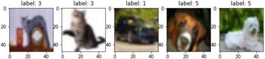

### 학습 결과와 예측
<!-- 슬라이드 374 -->

학습은 Lightning `Trainer` 에 맡긴다. `CSVLogger` 를 붙여 epoch 마다 지표를 csv 로 남기고, `limit_train_batches=0.5` 로 epoch 당 학습 batch 의 절반만 써서 시간을 줄인다.

```python
vggFineTune = VGGFineTune(vgg16_f, 10)
model_name="VGGNetFineTune"
epochs=10
logger = CSVLogger("logs", name=model_name)
trainer = Trainer(max_epochs=epochs, logger=logger,
                  limit_train_batches=0.5,)
trainer.fit(vggFineTune, trainloader, val_dataloaders=testloader)
```

**Training history** — 로그 파일 `metrics.csv` 를 읽어 학습 곡선을 그린다. `on_step=False` 로 기록했더라도 train 과 validation 이 다른 행에 남으므로, `epoch` 로 묶어 마지막 값을 취해 한 행으로 합친다.

```python
v_num = logger.version
history = pd.read_csv(f'./logs/{model_name}/version_{v_num}/metrics.csv')

h1 = history.drop('step', axis=1).groupby('epoch').last()
max_ = h1['val_acc'].max()

plt.figure(figsize=(10,3))
title = model_name
plt.subplot(121)
plt.title(f"{title}\nMax Val_Acc:{max_:.4f}")
plt.plot(h1['acc'],'--', label='acc')
plt.plot(h1['val_acc'], label='val_acc')
plt.legend()
plt.grid()

plt.subplot(122)
plt.title("Loss")
plt.plot(h1['loss'],'--', label='loss')
plt.plot(h1['val_loss'], label='val_loss')
plt.semilogy()
plt.legend()
plt.grid()
plt.show()
```

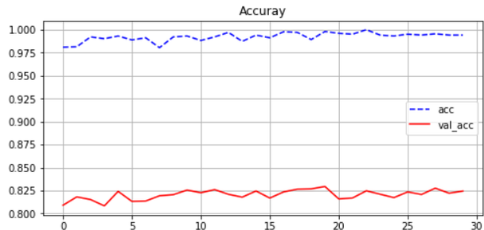

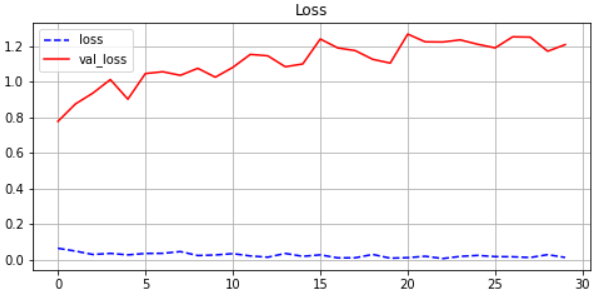

곡선을 읽어 보면 train acc 는 몇 epoch 만에 1.0 에 닿는 반면 val_acc 는 0.82 근처에서 더 오르지 않고, val_loss 는 epoch 이 갈수록 커진다. 사전학습 feature 덕분에 학습 자체는 매우 빠르지만, 마지막 conv block 과 분류기가 학습 데이터에 과적합되고 있다는 신호다. 뒤의 실습과제에서 freeze 범위·augmentation 을 바꿔 보는 이유가 여기에 있다.

**Prediction** — test batch 를 꺼내 한 장씩 모델에 넣고 예측 label 과 실제 label 을 비교한다. 모델은 batch 차원을 기대하므로 이미지 한 장 `[3, 48, 48]` 에 `unsqueeze(dim=0)` 을 해서 `[1, 3, 48, 48]` 로 만들어 넣어야 한다(`testset[10][0].unsqueeze(dim=0).shape` 가 `torch.Size([1, 3, 48, 48])`).

```python
imgs, labels = next(iter(testloader))

n_index = 0
n_plot = 10

plt.figure(figsize=(2.3*n_plot, n_plot))
vggFineTune.eval() # evaluation mode
for i in range(n_plot):
    img_idx = n_index+i
    predict = vggFineTune(imgs[img_idx].unsqueeze(dim=0)).cpu().detach().numpy()
    img = imgs[img_idx].permute(1, 2, 0)
    plt.subplot(1,n_plot,i+1)
    plt.imshow(img, cmap='gray')
    plt.title(f'pre:{np.argmax(predict)} / true:{labels[img_idx]}')

plt.show()
```

`eval()` 로 evaluation mode 로 바꾸어 Dropout 과 BatchNorm 이 추론 방식으로 동작하게 하고, 출력 10 개 logit 중 가장 큰 index(`np.argmax`)를 예측 class 로 삼는다.

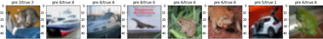

---

## 4.5.3 사전학습 VGG16 과 custom dataset
<!-- 슬라이드 375~380 -->

### 실습 4.5.2 — Fine tuning pre-trained VGG16 + Custom dataset
<!-- 슬라이드 375~376 -->

> 노트북: `code/4.5.2.VGG_flower.ipynb`
> [](https://colab.research.google.com/github/AI-BoostCamp/intermediate-deep-learning-pytorch/blob/main/code/4.5.2.VGG_flower.ipynb)

**목적**: Pretrain 된 VGG16 model 을 자신의 dataset 에 맞추어 fine tuning 한다.

**실습 개요**

- ImageNet 으로 train 된 VGG16 model 을 이용하여 flower_photos dataset 을 classification 하는 model 을 design 한다.
- 폴더로 정리된 이미지를 `ImageFolder` 와 `DataLoader` 로 읽어 Data 를 준비한다.

앞 실습과 다른 점은 데이터다. CIFAR10 은 torchvision 이 다 준비해 주지만, 내 데이터는 폴더에 흩어진 jpg 파일이다. 이를 train/test 로 나누고 label 을 붙여 batch 로 공급하는 과정을 직접 만든다. flower_photos 는 daisy·dandelion·roses·sunflowers·tulips 다섯 class 의 꽃 사진이다.

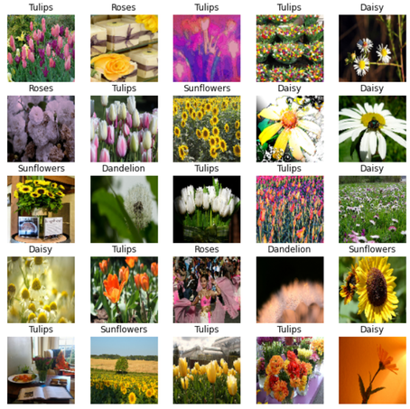

**Fine tuning Model 설계** — Model 구조는 앞 실습과 동일하다. 다른 점은 입력 Image 가 224×224 이고 출력 class 가 5 개라는 것뿐이다. 아래 그림이 전체 구조다. Conv3-64 부터 네 번째 conv block(Conv3-512 ×3 + Max pool)까지는 Freezed Layer, 마지막 conv block(Conv3-512 ×3 + Max pool)은 Trainable Layer, 그 뒤의 Flatten → FC-512 → FC-5 → softmax 가 Added Layer 다.

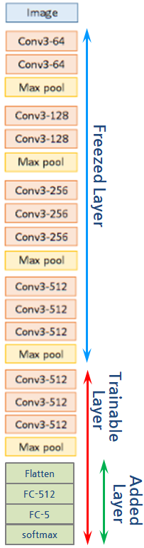

### VGG16 불러오기와 layer freeze
<!-- 슬라이드 377 -->

ImageNet dataset 으로 학습된 VGG16 을 load 하고 `vgg16.features`(classifier part 를 제거한 모델)만 취한다. 이번에는 입력이 224×224 이므로 `summary()` 도 그 크기로 확인한다.

```python
IN_IMG_SIZE = 224
batch_n = 32

import torchvision
vgg16 = torchvision.models.vgg16(pretrained=True)
model_vgg = vgg16.features
summary(model_vgg, input_size=(batch_n, 3, IN_IMG_SIZE, IN_IMG_SIZE))
```

요약의 첫 줄은 `Sequential [32, 512, 7, 7]` 이다. 224 가 MaxPool2d 다섯 번을 거쳐 7 이 되므로 `features` 의 출력은 `[N, 512, 7, 7]` 이다. 파라미터는 앞 실습과 같은 14,714,688 개(모두 trainable)지만, 입력이 커진 만큼 batch 32 기준 mult-adds 는 491.53 G 로 늘어난다 — 48×48 때의 40 배가 넘는다.

**Layer freeze 하기** — freeze 도 앞 실습과 같이 layer 속성을 바꾸어 선택한다. 뒤에서 7 개를 뺀 나머지를 얼린다(`## 수정 point ##` 가 실습과제에서 바꿔 볼 자리다).

```python
vgg16_f = vgg16.features
for i, child in enumerate(vgg16_f.children()):
  if i < len(vgg16_f) - 7: ## 수정 point ##
    for param in child.parameters():
      param.requires_grad = False
  else :
    print(f"Trainable:[{i}]",child)
```

출력으로 **Freeze 안 된 7 개 레이어**(index 24\~30: Conv2d·ReLU·Conv2d·ReLU·Conv2d·ReLU·MaxPool2d)를 확인한다. 이어서 파라미터의 `requires_grad` 와 크기를 함께 찍어 본다.

```python
for child in vgg16_f.children():
    for param in child.parameters():
        print(param.requires_grad,":",child, param.size())
        #break
```

이번에는 `break` 를 빼서 weight 와 bias 가 모두 찍히게 했다. **Parameter 가 없는 레이어(ReLU, MaxPool2d)는 skip** 되어 출력에 나오지 않는다. `summary(vgg16_f, ...)` 를 다시 부르면 Trainable 7,079,424 / Non-trainable 7,635,264 로 앞 실습과 같은 값이 나온다 — 입력 크기는 파라미터 수와 무관하다.

### Custom layer 추가
<!-- 슬라이드 378 -->

Custom layer 는 VGG16 + Flatten + Linear + BN + ReLU + Linear(5) 로 붙인다. 앞 실습과 달리 Flatten 뒤에 Linear(512) 가 하나 더 들어가는데, `features` 출력이 7×7×512 = 25088 로 커졌기 때문에 이를 512 로 줄이는 층이 필요해서다.

```python
lr=0.0001

class VGGFineTune2(L.LightningModule):
    def __init__(self, vggnet, num_classes):
        super(VGGFineTune2, self).__init__()
        self.features = vggnet
        self.linear = nn.Sequential(
            nn.Flatten(),
            nn.Linear(512*7*7,512),
            nn.BatchNorm1d(512),
            nn.ReLU(),
            nn.Dropout(0.3),
            nn.Linear(512, num_classes) )

    def forward(self, x):
        x = self.features(x)
        x = self.linear(x)
        return x

    def training_step(self, batch, batch_idx):
        x, y = batch
        y_pred = self(x)
        loss = F.cross_entropy(y_pred, y)
        acc = FM.accuracy(y_pred, y, task='multiclass', num_classes=5)
        metrics={'loss':loss, 'acc':acc}
        self.log_dict(metrics,prog_bar=True)
        return loss

    def validation_step(self, batch, batch_idx):
        x, y = batch
        y_pred = self(x)
        loss = F.cross_entropy(y_pred, y)
        acc = FM.accuracy(y_pred, y, task='multiclass', num_classes=5)
        metrics = {'val_loss':loss, 'val_acc':acc}
        self.log_dict(metrics,prog_bar=True)

    def configure_optimizers(self):
        return torch.optim.Adam(self.parameters(), lr=lr)

vggFineTune2 = VGGFineTune2(vgg16_f, class_num)
summary(vggFineTune2, input_size=(batch_n, 3, IN_IMG_SIZE, IN_IMG_SIZE))
```

`num_classes` 는 뒤의 데이터 준비에서 폴더 수로 얻는 `class_num`(= 5) 을 넘긴다. `nn.Linear(512*7*7, 512)` 의 `7*7` 은 입력 크기 224 에 묶여 있다. 입력을 112 로 줄이면 `features` 출력이 3×3 이 되어 `512*3*3` 으로 고쳐야 한다. `FM.accuracy()` 의 `num_classes` 도 5 로 바꿔야 한다는 점에 주의한다.

`summary()` 의 끝부분은 아래처럼 나온다. 새로 붙인 첫 Linear 가 12,845,568 개로 가장 큰 층이 된다.

| Layer | Output shape | Param # |
|---|---|---|
| Conv2d 2-29 | [32, 512, 14, 14] | 2,359,808 |
| ReLU 2-30 | [32, 512, 14, 14] | -- |
| MaxPool2d 2-31 | [32, 512, 7, 7] | -- |
| Sequential 1-2 | [32, 5] | -- |
| Flatten 2-32 | [32, 25088] | -- |
| Linear 2-33 | [32, 512] | 12,845,568 |
| BatchNorm1d 2-34 | [32, 512] | 1,024 |
| ReLU 2-35 | [32, 512] | -- |
| Dropout 2-36 | [32, 512] | -- |
| Linear 2-37 | [32, 5] | 2,565 |

첫 Linear 를 `nn.Linear(512*3*3, 512)`(입력 112×112)로 두면 이 층의 파라미터가 2,359,808 개로 줄어, 모델 전체는 Total 17,078,085 / Trainable 9,442,821 / Non-trainable 7,635,264 가 된다. Non-trainable 7,635,264 는 어느 경우든 freeze 한 conv 층의 수이고, Trainable 은 마지막 conv block 7,079,424 에 새 분류기 파라미터를 더한 값이다.

### 데이터 불러오기 — 폴더 나누기와 ImageFolder
<!-- 슬라이드 379 -->

**Data load** 는 세 단계다: 압축 파일 내려받기 → Train / Test Data split + Label sort → `ImageFolder` API + `DataLoader` API 적용.

```python
from torchvision.datasets.utils import download_and_extract_archive
import pathlib
dataset_url = \
      "https://storage.googleapis.com/download.tensorflow.org/example_images/flower_photos.tgz"
root = './'
data_dir='Dataset'
download_and_extract_archive(dataset_url, root, data_dir)
data_dir = root+data_dir+'/flower_photos'
```

`download_and_extract_archive()` 는 tgz 를 받아 `Dataset/` 아래에 풀어 준다. 풀린 폴더는 class 이름의 하위 폴더 다섯 개로 되어 있다.

```text
Dataset/
└── flower_photos/
    ├── daisy/
    ├── dandelion/
    ├── roses/
    ├── sunflowers/
    └── tulips/
```

**Train / Test Data split** — `splitfolders.ratio()` 는 이 폴더 구조를 유지한 채 각 class 폴더의 파일을 지정한 비율로 `train/` 과 `val/` 로 나누어 준다. `move=True` 이므로 복사가 아니라 이동이다.

```python
import splitfolders
sp_path="flower_photos_sp"
splitfolders.ratio(data_dir, output=sp_path,
    seed=1337, ratio=(.7, .3), group_prefix=None, move=True )
sp_train = pathlib.Path(sp_path+'/train')
sp_test = pathlib.Path(sp_path+'/val')
```

```text
flower_photos_sp/
├── train/
│   ├── daisy/  dandelion/  roses/  sunflowers/  tulips/
└── val/
    ├── daisy/  dandelion/  roses/  sunflowers/  tulips/
```

**Label sort** — 폴더명을 모아 class 이름 목록을 만들고 이미지 수를 센다. `ImageFolder` 는 하위 폴더 이름을 **정렬한 순서**로 label index(0, 1, 2, …)를 매기므로, 나중에 index 를 이름으로 되돌리려면 class 이름 목록도 `sort()` 해 두어야 한다.

```python
# 지정 폴더 아래에 있는 모든 *.jpg 파일의 수
#  및 폴더명 목록을 리턴
def check_dir(d_path):
    img_count = len(list(d_path.glob('*/*.jpg')))
    c_name = np.array([item.name for item in d_path.glob('*') if item.name != "LICENSE.txt"])
    return img_count, c_name, len(c_name)

# check_dir()로 폴더명과 이미지 숫자 확인
image_count, CLASS_train, class_num = check_dir(sp_train)
CLASS_train.sort()
print('Train image_count: {}\nclasses: {}'.format(image_count, CLASS_train))
image_count, CLASS_test, class_num = check_dir(sp_test)
CLASS_test.sort()
print('Test image_count: {}\nclasses: {}'.format(image_count, CLASS_test))
```

**ImageFolder API + DataLoader API** — `ImageFolder(경로, transform)` 는 폴더 구조를 그대로 `(image, label)` dataset 으로 만든다. train 용 transform 에는 `RandomResizedCrop` 을 넣어 매 epoch 조금씩 다른 crop 이 들어가게 하고, test 용에는 Resize 만 둔다. 두 dataset 을 `DataLoader` 에 올리면 앞 실습의 CIFAR10 loader 와 똑같이 쓸 수 있다.

```python
from torchvision.datasets import ImageFolder

## loader에 적용할 transform
train_transforms = v2.Compose([
    v2.Resize((IN_IMG_SIZE, IN_IMG_SIZE)),
#    v2.RandomAffine(degrees=15, translate=(0.2, 0.2), shear=0.2),
    v2.RandomResizedCrop(IN_IMG_SIZE, scale=[0.8, 1.2], ratio=[0.75,1.33],antialias=True ),
#    v2.RandomHorizontalFlip(0.5),
    v2.ToImage(),
    v2.ToDtype(torch.float32, scale=True) ] )

test_transforms = v2.Compose([
    v2.Resize((IN_IMG_SIZE, IN_IMG_SIZE)),
    v2.ToImage(),
    v2.ToDtype(torch.float32, scale=True) ] )

train_imgs = ImageFolder(sp_train, transform=train_transforms) #(image,label)
test_imgs = ImageFolder(sp_test, transform=test_transforms)
train_loader = DataLoader(train_imgs, batch_size=batch_n, shuffle=True,num_workers=4)
test_loader = DataLoader(test_imgs, batch_size=batch_n, shuffle=False,num_workers=4)

len(train_imgs),len(test_imgs)
```

주석 처리된 `RandomAffine`·`RandomHorizontalFlip` 은 실습과제 3 에서 켜 볼 augmentation 이다. batch 하나를 꺼내 class 이름과 함께 그려 보면 앞의 5×5 그림이 나온다.

```python
def show_batch(data_gen, class_l):
    # get image and label from data generator
    img_batch, l_batch = next(iter(data_gen))
    plt.figure(figsize=(10,10))
    for n in range(25):
        ax = plt.subplot(5,5,n+1)
        plt.imshow(img_batch[n].permute(1, 2, 0))
        plt.title(class_l[l_batch[n]].title())
        plt.axis('off')
    return img_batch, l_batch

# check dataset
_,_ = show_batch(train_loader, CLASS_train)
```

`class_l[l_batch[n]]` 이 정수 label 을 이름으로 되돌리는 부분이다. `CLASS_train` 을 정렬해 두지 않았다면 여기서 엉뚱한 이름이 붙는다.

### 학습과 결과 확인
<!-- 슬라이드 380 -->

Model Fit 은 앞 실습과 같다. `Trainer` 에 loader 두 개를 넘기면 된다.

```python
vggFineTune2 = VGGFineTune2(vgg16_f, class_num)
model_name = "VGGNetFineTune_2"
epochs=5 #15
logger = CSVLogger("logs", name=model_name)
trainer = Trainer(max_epochs=epochs, logger=logger,)
trainer.fit(vggFineTune2, train_loader, val_dataloaders=test_loader)
```

학습 곡선은 앞 실습과 같은 코드(`metrics.csv` → `groupby('epoch').last()` → plot)로 그린다. 결과를 확인하면 두 가지가 눈에 띈다.

- **빠르게 학습** — 첫 epoch 부터 val_acc 가 0.93 근처에서 출발한다. 사전학습된 feature 가 꽃 사진에도 그대로 통하기 때문이다.
- **성능도 향상** — 15 epoch 의 최고 val_acc 가 0.9438 로, 같은 데이터를 처음부터 학습한 ResNet26 의 최고 val_acc 0.7389 를 크게 앞선다.

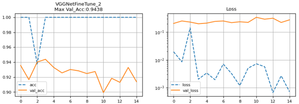

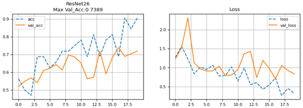

ResNet26 곡선이 20 epoch 내내 출렁이며 천천히 오르는 것과 달리, fine tuning 곡선은 시작부터 높은 곳에서 평탄하다. 적은 데이터(수천 장)로 깊은 모델을 처음부터 학습하면 데이터가 부족해 흔들리지만, 사전학습 모델은 이미 좋은 feature 를 갖고 출발하므로 분류기만 맞추면 되는 것이다.

---

## 4.5.4 사전학습 InceptionV3 fine tuning
<!-- 슬라이드 382~387 -->

### 실습 4.5.3 — Fine tuning pre-trained InceptionV3
<!-- 슬라이드 382~383 -->

> 노트북: `code/4.5.3.InceptionV3.ipynb`
> [](https://colab.research.google.com/github/AI-BoostCamp/intermediate-deep-learning-pytorch/blob/main/code/4.5.3.InceptionV3.ipynb)

**목적**: Pretrain 된 InceptionV3 model 을 자신의 dataset 에 맞추어 fine tuning 한다.

**실습 개요**

- ImageNet 으로 train 된 InceptionV3 model 을 이용하여 flower_photos dataset 을 classification 하는 model 을 design 한다.
- 복잡한 구조의 InceptionV3 를 사용하는 방법을 이해한다.

VGG16 은 층이 일렬이라 "뒤에서 7 개" 처럼 개수로 freeze 범위를 정할 수 있었다. InceptionV3 는 inception module(여러 branch 의 convolution 을 병렬로 돌려 concatenate 하는 블록)이 열 개 넘게 이어지고, 중간에 보조 분류기(AuxLogits)까지 달려 있다. 그래서 자식 module 의 **이름**으로 범위를 정한다.

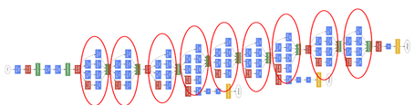

freeze 범위의 기준은 이렇다. **마지막 inception module 은 train 에 참여시키고, 그 앞의 concatenate layer 까지 freeze 한다.** 모델을 출력해 보면 자식 module 이 이름을 갖고 있어 경계를 잡기 쉽다. 맨 앞은 stem 의 convolution 들이고, 맨 뒤 inception module 은 `Mixed_7c` 다.

```text
Inception3(
  (Conv2d_1a_3x3): BasicConv2d(
    (conv): Conv2d(3, 32, kernel_size=(3, 3), stride=(2, 2), bias=False)
    (bn): BatchNorm2d(32, eps=0.001, momentum=0.1, ...)
  )
  ...
  (Mixed_7c): InceptionE(
    (branch1x1): BasicConv2d(
      (conv): Conv2d(2048, 320, kernel_size=(1, 1), ...)
      (bn): BatchNorm2d(320, eps=0.001, momentum=0.1, ...)
    )
    (branch3x3_1): BasicConv2d(
      (conv): Conv2d(2048, 384, kernel_size=(1, 1), ...)
      (bn): BatchNorm2d(384, eps=0.001, momentum=0.1, ...)
    )
    ...
  )
  (avgpool): AdaptiveAvgPool2d(output_size=(1, 1))
  (dropout): Dropout(p=0.5, inplace=False)
  (fc): Linear(in_features=2048, out_features=1000, bias=True)
)
```

`Mixed_7c` 의 branch 들이 2048 채널을 입력으로 받는 것은, 앞 module(`Mixed_7b`)의 branch 출력들이 concatenate 되어 2048 채널이 되기 때문이다. 그래프로 그리면 그 Concat 노드 아래에서 `Mixed_7c` 의 1×1 convolution 들이 갈라져 나오는 것이 보인다.

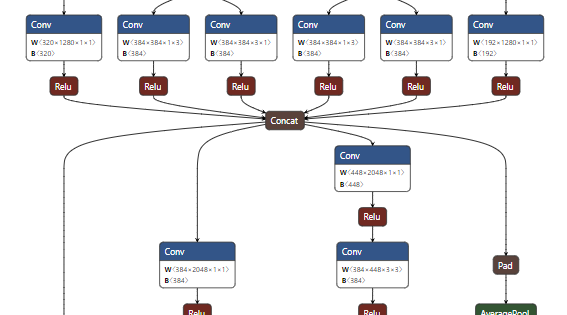

### 모델 불러오기 — final layer 수정과 freeze
<!-- 슬라이드 384 -->

**Model load** — 이번에는 PyTorch Hub 에서 직접 받는다. `torch.hub.load(저장소, 모델 이름, pretrained=True)` 로 `pytorch/vision` 의 `inception_v3` 를 불러온다.

```python
InceptionV3 = torch.hub.load('pytorch/vision', 'inception_v3', pretrained=True)

input_shape=(batch_n, 3, IN_IMG_SIZE, IN_IMG_SIZE)
summary(InceptionV3, input_size=input_shape)
InceptionV3
```

**Final layer 수정 — fc module 대체** — 모델 출력의 끝은 `avgpool` → `dropout` → `fc: Linear(2048, 1000)` 이다. VGG16 때는 classifier 를 통째로 떼어 냈지만, InceptionV3 는 마지막 `fc` 하나만 5 class 짜리로 바꿔 끼우면 된다. module 은 속성이므로 그냥 대입하면 교체된다.

```python
InceptionV3.fc = nn.Sequential(
#                            nn.Linear(2048,512),
#                            nn.Dropout(0.5),
                            nn.Linear(2048, class_num)
                          )
InceptionV3
```

다시 출력하면 `(fc): Linear(in_features=2048, out_features=5, bias=True)` 로 바뀌어 있다. 주석 처리된 두 줄은 fc 를 두 층으로 늘려 보는 변형으로, 실습과제에서 다룬다.

**Mixed_7c 이전 layer 는 freeze** — `named_children()` 은 자식 module 을 (이름, module) 쌍으로 순서대로 준다. 이름이 `'Mixed_7c'` 가 되는 순간 loop 를 끝내므로, 그 앞의 모든 module 이 freeze 되고 `Mixed_7c`·`avgpool`·`dropout`·`fc` 는 trainable 로 남는다.

```python
for i, (name,child_module) in enumerate(InceptionV3.named_children()):
  if name == 'Mixed_7c':
    break
  else :
    print(i,':',name,'freezed')
    for param in child_module.parameters():
            param.requires_grad = False
```

출력은 `0 : Conv2d_1a_3x3 freezed`, `1 : Conv2d_2a_3x3 freezed`, `2 : Conv2d_2b_3x3 freezed`, `3 : maxpool1 freezed` 로 시작해서 `15 : AuxLogits freezed`, `16 : Mixed_7a freezed`, `17 : Mixed_7b freezed` 에서 멈춘다. 18 번째 자식이 `Mixed_7c` 다. 보조 분류기 `AuxLogits` 도 함께 얼려진다는 점을 눈여겨본다. 확인은 VGG16 때와 같은 방법으로 한다.

```python
for child in InceptionV3.children():
    for param in child.parameters():
        print(child.__class__, param.requires_grad)
        break
```

### 새 모델 선언 — logits 주의
<!-- 슬라이드 385 -->

새 모델은 InceptionV3 를 통째로 `self.features` 로 품는 `LightningModule` 이다. fc 를 이미 바꿔 끼웠으므로 따로 붙일 층은 없다.

```python
lr=0.0001

class InceptionFineTune(L.LightningModule):
    def __init__(self, inceptionv3):
        super(InceptionFineTune, self).__init__()
        self.features = inceptionv3

    def forward(self, x):
        x = self.features(x)
        return x

    def training_step(self, batch, batch_idx):
        x, y = batch
        y_pred = self(x)
        ## 주의: InceptionOutputs은 결과 tensor값을 .logits 으로 가짐
        loss = F.cross_entropy(y_pred.logits, y)

        acc = FM.accuracy(y_pred.logits, y, task='multiclass', num_classes=5)
        metrics={'loss':loss, 'acc':acc}
        self.log_dict(metrics,prog_bar=True, on_step=False, on_epoch=True)
        return loss

    def validation_step(self, batch, batch_idx):
        x, y = batch
        y_pred = self(x)
        loss = F.cross_entropy(y_pred, y)

        acc = FM.accuracy(y_pred, y, task='multiclass', num_classes=5)
        metrics = {'val_loss':loss, 'val_acc':acc}
        self.log_dict(metrics, prog_bar=True, on_step=False, on_epoch=True)

    def configure_optimizers(self):
        return torch.optim.Adam(self.parameters(), lr=lr) ###

inceptionFineTune = InceptionFineTune(InceptionV3)
summary(inceptionFineTune, input_size=(batch_n, 3, IN_IMG_SIZE, IN_IMG_SIZE))
```

**`training_step()` 에서는 `y_pred.logits` 를 써야 한다.** torchvision 의 InceptionV3 는 학습 모드(`train()`)에서 보조 분류기의 출력까지 함께 담은 `InceptionOutputs`(`logits`, `aux_logits`) 라는 namedtuple 을 돌려준다. 그래서 loss 와 accuracy 는 `y_pred.logits` 로 계산해야 한다. 반면 `validation_step()` 은 evaluation 모드에서 불리고, 이때는 보조 출력 없이 텐서 하나만 돌아오므로 `y_pred` 를 그대로 쓴다. 두 메서드의 코드가 미묘하게 다른 이유가 이것이다.

**summary** — 요약의 끝은 `AdaptiveAvgPool2d [N, 2048, 1, 1]` → `Dropout` → `Linear [N, 5]`(파라미터 10,245) 로 끝나고, 파라미터 집계는 아래와 같다.

| 항목 | 값 |
|---|---|
| Total params | 25,122,509 |
| Trainable params | 6,087,045 |
| Non-trainable params | 19,035,464 |

Trainable 6,087,045 는 `Mixed_7c` 한 module 과 새 `fc`(2048×5 + 5 = 10,245) 의 합이다. 전체의 4 분의 1 정도만 학습하는 셈이다.

### Dataset 준비 — random_split
<!-- 슬라이드 386 -->

데이터는 앞 실습과 같은 flower_photos 지만 나누는 방법이 다르다. 폴더를 물리적으로 나누는 `splitfolders` 대신, 전체를 하나의 `ImageFolder` 로 읽은 뒤 `random_split` API 로 train/validation 으로 나눈다. 입력 크기는 InceptionV3 에 맞춰 299 다.

```python
### Imagae size 결정 ###
IN_IMG_SIZE = 299
batch_n = 32

from torchvision.datasets import ImageFolder

## loader에 적용할 transform
_transforms = v2.Compose([
    v2.ToImage(),
    v2.Resize((IN_IMG_SIZE, IN_IMG_SIZE)),
    v2.RandomResizedCrop(IN_IMG_SIZE, scale=[0.8, 1.2], ratio=[0.75,1.33],antialias=True ),
    v2.ToDtype(torch.float32, scale=True),
    v2.Normalize(mean=[0.485, 0.456, 0.406], std=[0.229, 0.224, 0.225]) ])

## ImageFolder : folder로 구성된 image set을 위한 loader
imgs = ImageFolder(data_dir, transform=_transforms) #(image,label)

len(imgs)
```

transform 의 마지막 `v2.Normalize(mean, std)` 가 앞 실습과 다른 점이다. 4.5.1 절에서 본 대로 Hub 의 사전학습 모델은 이 mean·std 로 정규화된 입력을 기대한다. 다만 정규화된 텐서를 `imshow()` 로 그리면 색이 원본과 달라 보인다.

**Class name : sort 필요** — 여기서도 폴더명을 정렬해 두어야 `ImageFolder` 의 label index 와 이름이 맞는다.

```python
# check_dir()로 폴더명과 이미지 숫자 확인
image_count, CLASS_name, class_num = check_dir(data_dir)
CLASS_name.sort()
print('Train image_count: {}\nclasses: {}'.format(image_count, CLASS_name))
```

**random_split API** — dataset 길이의 70% 를 train 크기로 잡고, 나머지를 validation 으로 둔 뒤 `random_split(dataset, [n1, n2])` 로 무작위 분할한다. 결과는 원 dataset 의 index 부분집합(`Subset`)이라 이미지가 복사되지 않는다.

```python
train_set_size = int(len(imgs) * 0.7)
valid_set_size = len(imgs) - train_set_size

# split the train set into two
train_set, valid_set = random_split(imgs, [train_set_size, valid_set_size])

print(train_set_size,valid_set_size)

## DataLoader : dataset과 sampler를 결합 batch단위 제공 #(image,label)*batch
train_loader = DataLoader(train_set, batch_size=batch_n, shuffle=True,num_workers=4)
val_loader = DataLoader(valid_set, batch_size=batch_n, shuffle=False,num_workers=4)

_,_ = show_batch(train_loader, CLASS_name)
```

`random_split` 방식은 폴더를 건드리지 않아 간편하지만, transform 이 dataset 하나에 묶여 있어 train 과 validation 에 다른 transform(augmentation 유무)을 주기 어렵다. 앞 실습의 `splitfolders` 방식은 폴더가 둘로 나뉘므로 transform 을 따로 줄 수 있다. 두 방식의 차이를 알고 골라 쓴다.

### 학습 결과
<!-- 슬라이드 387 -->

Training 은 앞과 같다.

```python
inceptionFineTune = InceptionFineTune(InceptionV3)
model_name = "InceptionFineTune"
epochs= 5 #20
logger = CSVLogger("logs", name=model_name)
trainer = Trainer(max_epochs=epochs, logger=logger)
trainer.fit(inceptionFineTune, train_loader, val_dataloaders=val_loader)

v_num = logger.version
history = pd.read_csv(f'./logs/{model_name}/version_{v_num}/metrics.csv')
```

결과를 확인한다. 5 epoch 학습에서는 val_acc 가 0.88 에서 0.925 로 꾸준히 오르며 최고 0.9255 를 기록하고, train acc 는 0.78 에서 0.97 로 오른다. loss 도 train·validation 모두 내려간다.

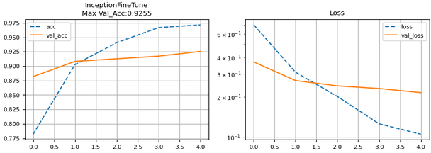

더 길게 30 epoch 을 돌린 곡선을 보면 train acc 는 두 번째 epoch 부터 0.99 근처에 붙고 val_acc 는 0.86\~0.90 사이를 오르내리며 더 오르지 않는다. val_loss 도 0.5\~0.8 사이를 출렁인다. 학습이 빠른 만큼 이른 epoch 에서 이미 과적합 구간에 들어간다는 뜻이며, 긴 학습보다 freeze 범위·fc 구성·augmentation 을 손보는 편이 낫다.

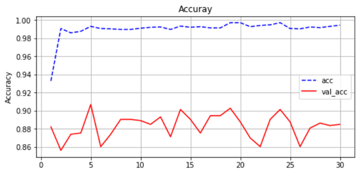

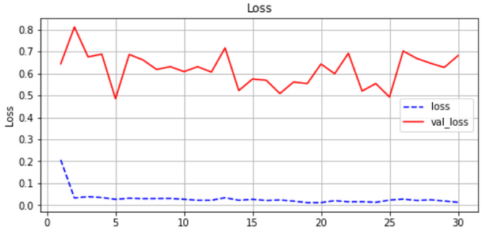

---

## 4.5.5 실습과제
<!-- 슬라이드 381, 388 -->

### VGG16 + custom dataset (실습 4.5.2) 과제

성능 개선을 위한 접근 방법을 생각해 보자.

- 모델의 크기는 적당한가?
- Freeze 하는 레이어는 적당한가?
- 추가 layer 의 수준과 방법은 어떻게 개선할 수 있을까?
  - 추가 layer 에 average pooling 을 사용해 모델의 크기를 줄여 보자.
  - Data Augmentation 을 적용해 보자.

**과제 1** — 마지막 Conv Layer 만 남기고 Freeze 한다. 추가 layer 에는 AvgPool2D Layer(`nn.AvgPool2d(kernel_size, stride)`)를 사용해서 수정해 보자. 7×7×512 를 Flatten 하면 25088 이 되어 첫 Linear 가 1천 2백만 파라미터를 차지했는데, 평균 풀링으로 공간 크기를 줄이면 추가할 layer 의 크기를 훨씬 작게 잡을 수 있다. 추가할 layer 의 크기를 직접 결정하자.

**과제 2** — 모든 Layer 를 Freeze 해서 학습해 보고, 모든 Layer 를 Trainable 상태로 두고도 학습해 보자. 두 경우를 비교하면 "마지막 conv block 만 학습" 이라는 중간 선택이 어디에 놓이는지 알 수 있다. freeze 코드의 `- 7` 을 바꾸면 된다.

**과제 3** — Augmentation 을 적용해 보자. epoch 를 10 으로 늘리고 성능을 검토하자. 후보 transform 은 다음과 같다.

```python
v2.RandomResizedCrop(size=(224, 224), scale=[0.8, 1.0], ratio=[0.75, 1.33], antialias=True)
v2.RandomHorizontalFlip(0.5)
v2.RandomAffine(degrees=40, translate=(0.2, 0.2), shear=0.2)
v2.RandomResizedCrop(IN_IMG_SIZE, scale=[0.2, 1.0])
v2.RandomHorizontalFlip(0.5)
```

노트북 끝의 과제용 셀은 train transform 에 `RandomAffine(degrees=15, ...)`, `RandomResizedCrop`, `RandomHorizontalFlip(0.5)` 를 모두 켠 판을 제공한다. test transform 에는 augmentation 을 넣지 않는다.

### InceptionV3 (실습 4.5.3) 과제

마지막 inception module 을 학습하도록 남겨 놓을 필요가 있을까?

- 마지막까지 freeze 한 경우에 성능은 어떨까 확인해 보자.
- 모델 전체를 freeze 하지 않고 학습시키면 어떤 결과를 얻을 수 있을까 확인해 보자.
- fc 추가 레이어를 좀 더 추가하려면 어떻게 해야 할까? BatchNorm, ReLU 레이어를 추가해 보자.
- avgpool layer 를 제거하려면 어떻게 해야 할까? 성능에 영향이 있을까?

fc 를 늘리는 출발점은 fc 대체 코드에서 주석 처리해 둔 두 줄이다.

```python
InceptionV3.fc = nn.Sequential(
                            nn.Linear(2048,512),
                            nn.Dropout(0.5),
                            nn.Linear(512, class_num)
                          )
```

### 모델 개발 시 문제점을 빠르게 확인하기

모델을 고칠 때마다 전체 데이터로 끝까지 학습하면 실수 하나를 잡는 데도 오래 걸린다. **전체 프로세스는 다 거치되, 처리하는 데이터 양을 줄여** 코드가 끝까지 도는지 먼저 확인한다. Lightning `Trainer` 의 `limit_train_batches`·`limit_val_batches` 로 epoch 당 batch 비율을 줄이고 `max_epochs` 를 작게 잡으면 된다.

```python
## 문제점 빠르게 확인하기
trainer = Trainer(max_epochs=3,
                  limit_train_batches=0.1,
                  limit_val_batches=0.2, accelerator='auto')
trainer.fit(inceptionFineTune, train_loader, val_dataloaders=val_loader)
```

이렇게 돌려 shape 오류·logits 처리·logger 경로 같은 문제를 먼저 잡은 뒤, 제한을 풀고 본 학습을 한다.

---

## 4.5.6 정리
<!-- 슬라이드 366~388 -->

세 실습을 한 표로 견주면 전이학습의 공통 틀과 모델별 차이가 드러난다.

| 항목 | 실습 4.5.1 VGG16 + CIFAR10 | 실습 4.5.2 VGG16 + flower_photos | 실습 4.5.3 InceptionV3 + flower_photos |
|---|---|---|---|
| 모델 load | `torchvision.models.vgg16(pretrained=True)` | 같음 | `torch.hub.load('pytorch/vision', 'inception_v3', pretrained=True)` |
| 구조 변경 | `features` 만 사용(classifier 제거) | 같음 | `fc` 를 `Linear(2048, 5)` 로 대체 |
| freeze 기준 | 자식 index — 뒤에서 7 개 제외 | 같음 | 자식 이름 — `Mixed_7c` 앞까지 |
| 학습되는 사전학습 부분 | 마지막 conv block (Conv2d 3 개) | 같음 | 마지막 inception module `Mixed_7c` |
| 추가 layer | Flatten → BN → ReLU → Dropout → Linear(512→10) | Flatten → Linear(25088→512) → BN → ReLU → Dropout → Linear(512→5) | (fc 대체로 갈음) |
| 입력 크기 | 48×48 | 224×224 | 299×299 + ImageNet 정규화 |
| 데이터 준비 | `CIFAR10` dataset | `splitfolders` + `ImageFolder` ×2 | `ImageFolder` ×1 + `random_split` |
| 학습 시 주의 | — | `Linear` 입력 크기는 입력 이미지 크기에 묶임 | `training_step` 은 `y_pred.logits` |

- 전이학습의 절차는 **load → 구조 변경 → freeze → custom layer → fine tuning** 이며, freeze 는 파라미터의 `requires_grad=False` 로, 확인은 `torchinfo.summary()` 의 Trainable/Non-trainable 로 한다.
- 사전학습 feature 덕분에 학습은 첫 epoch 부터 높은 정확도로 출발하고(빠르게 학습), 처음부터 학습한 모델보다 성능도 높다(성능도 향상). 대신 과적합도 빨리 오므로 freeze 범위·추가 layer·augmentation 을 조절한다.
- 폴더로 된 custom dataset 은 `ImageFolder` 가 `(image, label)` 로 만들어 주며, label index 는 폴더명 정렬 순이므로 class 이름 목록도 정렬해 둔다.
- 구조가 복잡한 모델은 `named_children()` 의 이름으로 freeze 경계를 잡고, 학습 모드 출력이 namedtuple(`InceptionOutputs`)인 경우 `.logits` 를 꺼내 쓴다.
