# 4.6 Class Activation Map(CAM) 실습

**학습 목표**

- 학습된 분류 모델이 영상의 어느 부분을 근거로 class 를 판정했는지 heat map(CAM)으로 확인할 수 있다.
- FC layer 가 있는 VGG16 에서 conv feature map 과 class 사이의 관련성을 편미분(gradient)으로 구하는 Grad-CAM 의 원리를 설명할 수 있다.
- forward hook 과 backward hook 으로 특정 layer 의 출력(feature map)과 gradient 를 가로채어 저장할 수 있다.
- gradient 로 채널별 weight 를 만들고 "가중합 → ReLU → 해상도 확대 → 정규화 → color mapping → blending" 의 순서로 CAM 이미지를 만들 수 있다.
- feature map 을 뽑는 위치나 모델(Inception-v3)을 바꾸고, 여러 객체가 있는 영상에서 결과가 어떻게 달라지는지 실험할 수 있다.

**이 절의 구성**

- 4.6.1 실습 개요
- 4.6.2 모델·이미지 준비와 예측
- 4.6.3 Grad-CAM 의 원리 — conv feature 와 class 사이의 가중치
- 4.6.4 Forward / Backward hook 으로 feature map 과 gradient 얻기
- 4.6.5 CAM 이미지 만들기
- 4.6.6 실습과제
- 4.6.7 정리

---

## 4.6.1 실습 개요
<!-- 슬라이드 390 -->

### 실습 4.6.1 — Class Activation Map(CAM): VGG16

> 노트북: `code/4.6.1.CAM.ipynb`
> [](https://colab.research.google.com/github/AI-BoostCamp/intermediate-deep-learning-pytorch/blob/main/code/4.6.1.CAM.ipynb)

이 실습의 목적은 feature 의 heat map 을 통하여 network 의 classification 을 이해하는 것이다. 분류 모델은 "이 영상은 robin 이다" 라는 답만 내놓을 뿐, 영상의 어느 부분을 보고 그렇게 판단했는지는 말해 주지 않는다. Class Activation Map(CAM)은 마지막 conv layer 의 feature map 을 class 와의 관련성으로 가중합하여, 모델이 판정에 크게 의존한 영역을 원본 영상 위에 색으로 표시한다.

실습은 다음 순서로 진행한다.

1. ImageNet 으로 학습된 VGG16 model 전체(conv 부분과 FC 부분 모두)를 그대로 사용한다. 새로 학습하지 않는다.
2. prediction 과정에서 모델의 특정 layer(마지막 conv layer)의 feature map 을 추출한다.
3. `.backward()` 를 사용하여 class 점수를 feature map 으로 편미분한 gradient 를 얻고, 이것으로 CAM 을 생성한다.
4. 이 과정을 하나의 module 로 만들어 다른 이미지들의 CAM 을 확인한다.
5. 결과를 통하여 feature 의 representation 특성 — 어떤 feature map 이 어떤 class 를 대표하는지 — 을 검토한다.

실습에 쓰는 테스트 이미지(`bird.jpg`, 실습과제용 `4obj2.jpg`)는 Colab 의 `/content/datasets/` 에 올려 둔다. 아래는 이 실습이 도달하려는 결과다. 새 사진 위에 CAM 을 겹치면 새의 몸통 부분이 따뜻한 색으로 강조된다.

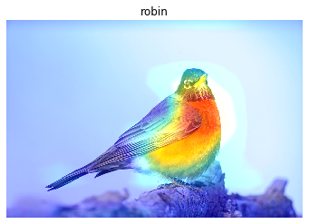

---

## 4.6.2 모델·이미지 준비와 예측
<!-- 슬라이드 391~392 -->

### VGG16 모델 불러오기

먼저 필요한 module 을 import 하고, torchvision 이 제공하는 학습된 VGG16 모델 전체를 loading 한다. `pretrained=True` 로 ImageNet 가중치를 함께 내려받는다.

```python
import torch
from torch import nn
from torch.nn import functional as F
from torchvision.transforms import v2
import torchvision
from torchinfo import summary

import numpy as np
import matplotlib.pyplot as plt

device = 'cuda:0'

model = torchvision.models.vgg16(pretrained=True)
summary(model, input_size=(8, 3, 224, 224))
```

`summary()` 는 batch 8, 224×224 RGB 입력을 가정하고 각 층의 출력 shape 을 표로 보여 준다. 이 표에서 확인해 둘 것은 두 가지다. 첫째, VGG16 은 conv 부분(`features`), 평균 풀링(`avgpool`), FC 부분(`classifier`)의 세 덩어리로 되어 있다. 둘째, 마지막 conv block 의 출력은 채널 512, 공간 크기 14×14 이며, 이것이 뒤에서 CAM 의 재료가 되는 feature map 이다. summary 출력을 block 단위로 간추리면 다음과 같다.

| 구간 | 층 구성 | 출력 shape(batch 8) |
|---|---|---|
| `features` block 1 | Conv2d-ReLU ×2, MaxPool2d | [8, 64, 224, 224] → [8, 64, 112, 112] |
| `features` block 2 | Conv2d-ReLU ×2, MaxPool2d | [8, 128, 112, 112] → [8, 128, 56, 56] |
| `features` block 3 | Conv2d-ReLU ×3, MaxPool2d | [8, 256, 56, 56] → [8, 256, 28, 28] |
| `features` block 4 | Conv2d-ReLU ×3, MaxPool2d | [8, 512, 28, 28] → [8, 512, 14, 14] |
| `features` block 5 | Conv2d-ReLU ×3, MaxPool2d | [8, 512, 14, 14] → [8, 512, 7, 7] |
| `avgpool` | AdaptiveAvgPool2d | [8, 512, 7, 7] |
| `classifier` | Linear-ReLU-Dropout ×2, Linear | [8, 4096] → [8, 4096] → [8, 1000] |

전체 파라미터 수는 138,357,544 개이며 모두 학습 가능한 파라미터다. `model` 을 그대로 출력하면 같은 구조를 module 이름과 함께 볼 수 있다. 한 가지 실무적인 주의점으로, 노트북에는 `model.to(device)` 가 따로 없다. torchinfo 의 `summary()` 는 GPU 가 있으면 모델을 GPU 로 옮긴 채로 돌리므로 그 뒤의 계산이 `input_batch.to(device)` 와 맞아떨어지지만, `summary()` 를 생략한다면 `model.to(device)` 를 직접 호출해야 한다.

### 테스트 이미지 불러오기와 전처리

테스트 이미지 `bird.jpg` 를 PIL 로 열어 확인한다.

```python
from PIL import Image
bird_file_path = '/content/datasets/bird.jpg'
img = Image.open(bird_file_path)
plt.imshow(img)
```

VGG16 은 ImageNet 의 전처리 규약을 따르는 입력을 기대한다. 크기를 224×224 로 맞추고(Resize, Crop), 픽셀 값을 0\~1 로 바꾼 뒤 ImageNet 의 채널별 평균·표준편차로 Normalize 한다.

```python
preprocess = v2.Compose([
    v2.ToImage(),
    v2.Resize((224,224)),
    v2.ToDtype(torch.float32, scale=True),
    v2.Normalize(
        mean=[0.485, 0.456, 0.406],
        std=[0.229, 0.224, 0.225]), ])

input_tensor = preprocess(img)          #[3,224,224]
input_batch = input_tensor.unsqueeze(0) #[1,3,224,224]
input_batch = input_batch.to(device)

ps(input_tensor)
ps(input_batch)
```

각 변환의 역할은 다음과 같다.

- `v2.ToImage()` — PIL 이미지를 채널이 앞에 오는(C, H, W) tensor 이미지로 바꾼다.
- `v2.Resize((224,224))` — 가로세로를 224 로 맞춘다. 옛 `transforms` API 로 쓴 판(슬라이드의 코드)은 `Resize(256)` 뒤에 `CenterCrop(224)` 로 가운데를 잘라 냈다. 두 방식 모두 결과는 224×224 이지만, 노트북의 v2 판은 비율을 유지하지 않고 바로 늘이거나 줄인다.
- `v2.ToDtype(torch.float32, scale=True)` — 0\~255 정수를 0\~1 실수로 바꾼다(옛 API 의 `ToTensor()` 에 해당한다).
- `v2.Normalize(mean, std)` — ImageNet 학습 때 쓴 채널별 평균·표준편차로 표준화한다. 이 값은 VGG16 가중치와 한 쌍이므로 바꾸면 안 된다.

전처리 결과 `input_tensor` 는 `[3, 224, 224]` 이고, 모델은 batch 를 기대하므로 `unsqueeze(0)` 으로 앞에 batch 차원을 붙여 `[1, 3, 224, 224]` 로 만든 뒤 GPU 로 보낸다. `ps()`·`p()` 는 노트북 첫 셀에 정의된 shape 확인용 helper 이며 `print(x.shape)` 로 바꿔 써도 된다. 원본 `img` 는 CAM 을 원래 해상도로 되돌릴 때 다시 쓰므로 그대로 둔다.

### 예측과 label 이름 변환

모델을 eval 모드로 두고 forward 하면 1000 개 class 의 logit 이 나온다. softmax 를 적용하면 1000 개의 확률값이 된다.

```python
model.eval()
logit = model(input_batch)
prob = F.softmax(logit, dim=1)
ps(prob,'prob')   # (1, 1000)
```

`model.eval()` 은 Dropout 을 끄는 역할을 한다(VGG16 의 classifier 에 Dropout 이 두 개 있다). 예측 결과는 index 0\~999 에 대한 확률일 뿐이므로, 사람이 읽으려면 label(index)을 해당 class 의 영문 이름(description)으로 변환해야 한다. PyTorch hub 가 제공하는 `imagenet_classes.txt` 에는 class 이름이 한 줄에 하나씩 index 순서로 들어 있다(tench, goldfish, great white shark, tiger shark, … 로 시작한다). 이 파일을 내려받아 list 로 읽고, 확률이 큰 상위 5개를 이름과 함께 출력한다.

```python
# Download ImageNet labels
!wget https://raw.githubusercontent.com/pytorch/hub/master/imagenet_classes.txt

# Read the categories
with open("imagenet_classes.txt", "r") as f:
    categories = [s.strip() for s in f.readlines()]
# Show top categories per image
top5_prob, top5_catid = torch.topk(prob[0], 5)
for i in range(top5_prob.size(0)):
    print(categories[top5_catid[i]], top5_prob[i].item())
```

`torch.topk(prob[0], 5)` 는 확률이 큰 순서로 값과 index 를 함께 돌려주므로, index 로 `categories` 를 찾으면 이름이 된다. 테스트 이미지에 대해서는 robin(울새)이 0.999 이상의 확률로 1위이고, worm fence·brambling·water ouzel·bulbul 이 아주 작은 확률로 뒤를 잇는다. 모델이 이 영상을 robin 으로 보는 것은 확실하다. 이제 궁금한 것은 "영상의 어느 부분이 robin 이라는 판단을 만들었는가" 이다.

---

## 4.6.3 Grad-CAM 의 원리 — conv feature 와 class 사이의 가중치
<!-- 슬라이드 393 -->

CAM 의 기본 아이디어는 아래 그림과 같다. 마지막 conv layer 의 feature map 들을 Global Average Pooling(GAP)으로 채널마다 값 하나로 줄이고, 그 값들을 가중치 $w_1, w_2, \ldots, w_n$ 으로 묶어 class 점수(그림에서는 Australian terrier)를 만든다. 이 구조에서는 $w_k$ 가 곧 "k 번째 feature map 이 이 class 에 얼마나 중요한가" 이므로, 같은 가중치로 feature map 자체를 가중합하면 class 별 activation map 이 된다.

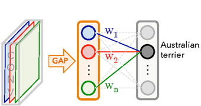

그런데 VGG16 은 마지막 conv block 뒤에 max pool 과 FC-4096, FC-4096, FC-1000 의 FC layer 가 이어지고 마지막에 softmax 가 붙는다. conv feature 와 class 사이에 GAP 한 번이 아니라 FC layer 세 개가 끼어 있으므로, conv layer feature 와 class 간의 가중치를 직접 읽어 낼 수 없다.

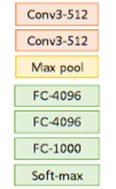

이 문제를 편미분으로 푸는 것이 Grad-CAM 이다. 생각의 순서는 다음과 같다.

- conv layer 의 feature map 이 어떤 class 와 관련이 있다면, class 점수를 그 feature map 으로 편미분했을 때 변화가 있어야 한다. 상관이 없으면 편미분 값은 0 이다.
- feature map 이 영상의 특징을 위치별로 기록하고 있다면, feature map 의 pixel 값으로 class 점수를 편미분한 값이 그 pixel 과 class 의 관련성을 알려 준다.
- 따라서 모든 feature map 의 모든 pixel 로 class 점수를 편미분하면, FC layer 가 가로막고 있어도 conv 출력과 class 의 관계를 얻을 수 있다.

기호로 쓰면, class $c$ 의 점수(logit)를 $y^c$, k 번째 feature map 을 $A^k$, 그 위의 위치를 $(i, j)$ 라 할 때 필요한 것은 $\partial y^c / \partial A^k_{ij}$ 전부다. feature map 이 512 장이고 각각 14×14 이므로 512×14×14 개의 편미분 값이 나오며, 이는 feature map 과 정확히 같은 shape 의 tensor 다.

편미분을 손으로 구할 필요는 없다. PyTorch 의 `.backward()` 가 바로 편미분(gradient)을 계산하는 API 이므로, class logit 하나에서 `backward()` 를 호출하면 backpropagation 과정에서 conv 출력에 대한 gradient 가 계산된다. 다만 gradient 는 중간 layer 를 지나가는 값이라 그냥은 밖으로 나오지 않으므로, backprop 과정에서 그 값을 가로채는 hook method 를 사용한다. 또 `backward()` 는 기본적으로 한 번 실행되면 계산 graph 를 버리는데, `retain_graph=True` 를 주면 backward 수행 후에도 graph 가 유지되어 다른 class 에 대해 backward 를 반복할 수 있다.

feature map 을 어느 layer 에서 뽑을지도 정해야 한다. `model._modules.get('features')` 로 conv 부분을 꺼내면 index 0\~30 의 31 개 층이 들어 있고, 끝에서 세 번째 `[-3]` 이 마지막 Conv2d(512 → 512, 3×3) 이다. 그 뒤에는 ReLU 와 MaxPool2d 만 남는다.

```python
model._modules.get('features')

layer_len = len(model._modules.get('features')[:]) # 31
for i in range(layer_len):
  print(f'[{i}]:',model._modules.get('features')[i])

model._modules.get('features')[-3]   # [28] Conv2d(512, 512, kernel_size=(3, 3), ...)
```

출력의 끝부분은 `[27] ReLU`, `[28] Conv2d(512, 512, …)`, `[29] ReLU`, `[30] MaxPool2d` 이다. 이 실습은 `[28]`, 즉 마지막 conv layer 의 출력(1×512×14×14)을 feature map 으로 쓴다. 가장 깊은 conv layer 는 의미가 가장 추상화되어 있고 공간 해상도는 가장 낮으므로, 뭉뚱그려진 위치 정보를 얻기에 알맞다.

---

## 4.6.4 Forward / Backward hook 으로 feature map 과 gradient 얻기
<!-- 슬라이드 394~395 -->

### hook 함수와 등록

hook 은 특정 module(layer)의 입·출력 값이 지나갈 때 사용자가 정의한 함수를 끼워 넣어 그 값을 가져오는 장치다. PyTorch 의 module 은 두 가지 hook 을 제공한다.

- `torch.nn.modules.module.register_forward_hook(hook_function)` — forward 때 그 module 의 input 과 output 이 hook 함수로 전달된다.
- `torch.nn.modules.module.register_backward_hook(hook_function)` — backward 때 그 module 의 grad_input 과 grad_output 이 hook 함수로 전달된다.

아래 그림은 conv2d 와 ReLU 두 module 을 값이 지나가는 모습이다. 왼쪽 열은 forward 의 흐름(input → output → 다음 module 의 output), 오른쪽 열은 backward 의 흐름(grad Output → grad Output → grad Input)이다. forward hook 은 왼쪽 열의 output 을, backward hook 은 오른쪽 열의 grad Output 을 가로챈다. 이 실습에서는 `[28]` Conv2d 에 두 hook 을 모두 걸어, forward 때는 그 층의 출력(feature map)을, backward 때는 그 출력에 대한 gradient 를 받는다.

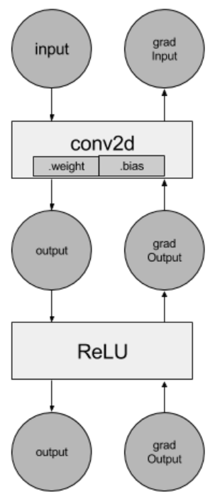

hook 함수는 정해진 인자 형식을 따라야 한다. forward hook 은 `(module, input, output)`, backward hook 은 `(module, grad_input, grad_output)` 을 받는다. 여기서는 받은 값을 list 에 append 하는 것이 하는 일의 전부다.

```python
forward_features = [] # activations
backward_feature = [] # gradients

# output으로 나오는 feature를 append
def hook_feature(module, input, output):
    forward_features.append(output) #(1,512,14,14)
    ps(output,'feature'+str(len(forward_features)))

# output으로 나오는 gradient를 append
def backward_hook(module, gradInput, gradOutput):
    backward_feature.append(gradOutput[0]) #((1,512,14,14),)
    ps(gradOutput[0],'gradient'+str(len(backward_feature)))

## 반복호출하면 복수의 hook가 생성됨
fh_handel = model._modules.get('features')[-3].register_forward_hook(hook_feature)
bh_handel = model._modules.get('features')[-3].register_backward_hook(backward_hook)
```

몇 가지 세부 사항을 짚어 둔다.

- forward hook 의 `output` 은 tensor 하나이지만, backward hook 의 `gradOutput` 은 tuple 이다(출력이 여러 개인 module 을 위한 형식). 그래서 `gradOutput[0]` 을 꺼내 저장한다. 그 shape 은 feature map 과 같은 (1, 512, 14, 14) 이다.
- 두 list 는 전역 변수다. forward 가 한 번 일어날 때마다 `forward_features` 에, backward 가 한 번 일어날 때마다 `backward_feature` 에 tensor 가 하나씩 쌓인다. 따라서 첫 이미지의 결과는 index `[0]`, 다음 이미지의 결과는 `[1]` 로 꺼내야 한다.
- 등록 셀을 반복 실행하면 같은 층에 hook 이 여러 개 걸려 한 번의 forward 에 값이 여러 번 append 된다. 등록은 한 번만 하고, 지우고 싶을 때는 돌려받은 handle 로 `fh_handel.remove()` 를 호출한다.
- 최근 PyTorch 는 `register_backward_hook` 대신 `register_full_backward_hook` 을 권장한다. 이 실습처럼 단일 Conv2d module 에 걸 때는 두 API 가 같은 gradient 를 준다.

### Forward processing 과 hook — feature map 얻기

hook 을 걸어 둔 상태에서 다시 forward 하면 `hook_feature` 가 호출되어 `[28]` 층의 출력이 `forward_features` 에 들어간다. 이때 backward 를 어디서 시작할지도 정한다. logit 에서 값이 가장 큰 class(top-1)의 logit 하나만 골라 `t1_logit` 으로 둔다.

```python
model.eval()
logit = model(input_batch)
t1_logit = logit[:, torch.argmax(logit)].squeeze()
p(t1_logit,'t1_logit')

ps(forward_features[0],'forward_features')   # (1, 512, 14, 14)
```

`torch.argmax(logit)` 은 1000 개 중 가장 큰 logit 의 index(여기서는 robin)이고, `logit[:, idx]` 는 shape (1,) 의 tensor 이므로 `squeeze()` 로 스칼라(shape `[]`)로 만든다. `backward()` 는 스칼라에서 시작해야 하므로 이 단계가 필요하다. forward 가 끝나면 `forward_features[0]` 의 shape 이 (1, 512, 14, 14) 인 것을 확인할 수 있다. 참고로 backward 의 시작점을 softmax 확률이 아니라 logit 으로 잡는 이유는, softmax 는 다른 class 의 점수까지 섞어 넣어 "이 class 만의" 편미분이 흐려지기 때문이다.

### Backpropagation 과 hook — logit 값에 대한 편미분 구하기

`t1_logit` 에서 `backward()` 를 호출하면 robin logit 을 모델의 모든 중간 값으로 편미분한 gradient 가 거꾸로 흘러가고, `[28]` 층을 지날 때 `backward_hook` 이 그 gradient 를 `backward_feature` 에 담는다.

```python
t1_logit.backward(retain_graph = True) #t1 값으로 backprop
print("===")
ps(backward_feature[0],'backward_feature')   # (1, 512, 14, 14)

features = forward_features[0]  #(1,512,14,14)
gradients = backward_feature[0] #(1,512,14,14)
```

`retain_graph=True` 는 backward 후에도 계산 graph 를 남겨 두라는 뜻이다. 이렇게 해 두면 같은 forward 결과에서 다른 class 의 logit 으로 다시 `backward()` 를 호출할 수 있다(실습과제의 multi object 실험에 필요하다). `gradients` 의 shape 이 `features` 와 같은 (1, 512, 14, 14) 라는 점이 핵심이다. feature map 의 pixel 하나마다 "이 값이 커지면 robin logit 이 얼마나 변하는가" 가 하나씩 대응하며, 이것이 앞 소절에서 말한 "모든 feature map, 모든 pixel 로 class 를 편미분한" 결과다. 이제 재료(`features`, `gradients`)가 다 갖추어졌다.

---

## 4.6.5 CAM 이미지 만들기
<!-- 슬라이드 396~397 -->

### Weight 계산 — 채널별 weight

512 장의 feature map 각각에 가중치 하나씩을 준다. k 번째 feature map 의 가중치는 그 map 에 대한 gradient 14×14 개의 평균이다. gradient 가 전반적으로 크면 그 feature map 이 robin 판정에 많이 쓰였다는 뜻이고, 0 근처이면 무관하다는 뜻이다.

```python
b, k, h, w = gradients.size()  #(1,512,14,14)
# (1, 512) <= (1, 512, 14*14): feature map k_plane의'weight'
alpha = gradients.view(b, k, -1).mean(dim=2) #dim:to reduce
ps(alpha,'alpha')     #(1,512)
weights = alpha.view(b, k, 1, 1)
ps(weights,'weights') #(1,512,1,1)
```

`view(b, k, -1)` 로 (1, 512, 196) 으로 펴고 `mean(dim=2)` 로 pixel 차원을 평균하면 (1, 512) 의 `alpha` 가 된다. 이것을 `view(b, k, 1, 1)` 로 (1, 512, 1, 1) 로 바꾸는 이유는 다음 단계에서 (1, 512, 14, 14) 의 feature map 과 broadcasting 으로 곱하기 위해서다.

### CAM 생성 — sum(weights × features) 과 해상도 향상

CAM 은 feature map 의 가중합이다. 아래 그림처럼 각 feature map 에 자기 가중치를 곱해 모두 더하면, robin 과 관련된 feature map 들이 밝은 위치가 살아남고 무관한 map 들은 가중치가 작아 묻힌다.

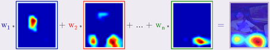

코드가 하는 계산을 식으로 쓰면 다음과 같다. $A^k$ 는 k 번째 feature map, $w_k$ 는 앞에서 구한 채널별 weight 다.

$$
L^{c} = \mathrm{ReLU}\Big( \sum_{k} w_k \, A^{k} \Big), \qquad
w_k = \frac{1}{h \cdot w} \sum_{i,j} \frac{\partial y^{c}}{\partial A^{k}_{ij}}
$$

```python
# weights * features : (1,512,1,1)*(1,512,14,14) -> (1,1,14,14)
grad_cam_map = (weights.cpu()*features.cpu()).sum(1, keepdim = True)
grad_cam_map = F.relu(grad_cam_map) # Apply ReLU
ps(grad_cam_map,'grad_cam_map')     #(1,1,14,14)
# (14,14)->(426,640)
grad_cam_map = F.interpolate(grad_cam_map, size=(img.size[1], img.size[0]),
                             mode='bilinear', align_corners=False)
ps(grad_cam_map,'grad_cam_map')     #(1, 1, 426, 640)
```

- `weights * features` 는 (1, 512, 1, 1) 과 (1, 512, 14, 14) 의 broadcasting 곱이고, `sum(1, keepdim=True)` 로 채널 차원을 더해 (1, 1, 14, 14) 의 map 하나로 만든다. 이후 처리는 CPU 의 numpy·OpenCV 로 넘어가므로 `.cpu()` 로 옮겨 둔다.
- `F.relu` 는 음수를 0 으로 잘라 낸다. 음수 값은 "이 위치가 커질수록 robin 점수가 내려간다" 는 뜻이므로 robin 의 근거로 볼 수 없다. 양의 기여만 남긴다.
- 14×14 는 너무 거칠어 원본 영상과 겹칠 수 없다. `F.interpolate` 로 원본 크기까지 bilinear 보간하여 해상도를 향상한다. `img.size` 는 PIL 규약대로 (가로, 세로) = (640, 426) 이므로, (세로, 가로) 순서를 쓰는 `size=` 에는 `(img.size[1], img.size[0])` 로 뒤집어 넣는다. 결과는 (1, 1, 426, 640) 이다.

### Normalize, color mapping, blending

값의 범위가 제각각인 map 을 그림으로 만들려면 세 단계가 더 필요하다. 먼저 min-max scaling 으로 0\~1 로 Normalize 한다.

```python
# min-max scaling
map_min, map_max = grad_cam_map.min(), grad_cam_map.max()
grad_cam_map = (grad_cam_map - map_min).div(map_max - map_min).data  # .data == .detach()
print(grad_cam_map.min(), grad_cam_map.max())
ps(grad_cam_map,'grad_cam_map')
```

끝의 `.data` 는 `.detach()` 와 같은 뜻으로, 계산 graph 에서 떼어 낸 순수한 값을 얻는다. 이후 numpy 로 변환하려면 graph 에 붙어 있으면 안 되기 때문이다. 다음은 color mapping 이다. 0\~1 의 값을 0\~255 정수로 바꾸고 OpenCV 의 JET colormap(작은 값은 파랑, 큰 값은 빨강)을 입혀 3 채널 컬러 영상으로 만든다.

```python
import cv2
# grad_cam_map.squeeze() : (426,640)<-(1,1,426,640)
grad_heatmap = cv2.applyColorMap(np.uint8(255*grad_cam_map.squeeze()),
                                 cv2.COLORMAP_JET)
grad_heatmap = cv2.cvtColor(grad_heatmap, cv2.COLOR_RGB2BGR)
pst(grad_heatmap) #(426,640,3)
plt.imshow(grad_heatmap)
plt.show()
```

`squeeze()` 로 앞의 (1, 1) 을 떼어 (426, 640) 2 차원 배열로 만들어야 `applyColorMap` 이 받는다. OpenCV 는 채널 순서를 BGR 로 다루고 matplotlib 은 RGB 로 그리므로, `cvtColor` 로 채널 순서를 바꿔 주어야 색이 제대로 나온다(BGR ↔ RGB 는 첫 채널과 셋째 채널을 맞바꾸는 것이라 `COLOR_RGB2BGR` 과 `COLOR_BGR2RGB` 는 같은 일을 한다). 결과 shape 은 (426, 640, 3) 이다.

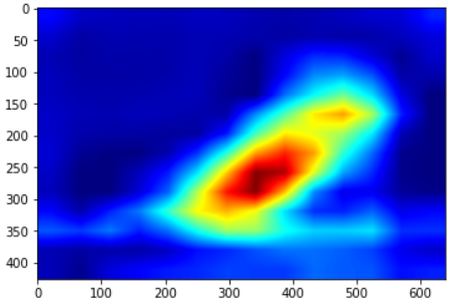

heat map 만으로는 어느 부분이 강조되었는지 알기 어려우므로 원본 영상 위에 blending 한다. 둘 다 0\~1 실수로 맞춘 뒤 더하고, 최댓값으로 나누어 다시 0\~1 로 만든 다음 0\~255 정수로 바꾼다.

```python
grad_heatmap = np.float32(grad_heatmap/255)
_img = np.array(img)/255

grad_result = grad_heatmap + _img
grad_result = grad_result / np.max(grad_result)
grad_result = np.uint8(255 * grad_result)
plt.imshow(grad_result)
plt.show()
```

이 합성이 되려면 heat map 과 원본의 shape 이 (426, 640, 3) 으로 같아야 하며, 그래서 앞에서 원본 크기로 interpolate 했던 것이다. 결과를 보면 새의 몸통, 특히 가슴에서 등으로 이어지는 부분이 붉게 강조된다. 모델은 새의 실루엣이나 배경이 아니라 몸통의 색·무늬를 근거로 robin 이라고 판정한 셈이다. 이것이 "feature 의 heat map 으로 network 의 classification 을 이해한다" 는 실습 목적의 답이다.

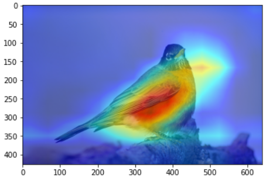

여기까지의 과정(전처리 → forward → backward → weight → 가중합 → interpolate → normalize → colormap → blending)을 함수 하나로 묶어 두면, 이미지 파일명만 바꾸어 다른 이미지들의 CAM 을 바로 확인할 수 있다. 다만 hook 이 전역 list 에 값을 쌓는 구조이므로, 함수 안에서 `forward_features[-1]`, `backward_feature[-1]` 처럼 마지막 항목을 쓰거나 매번 list 를 비워야 한다.

---

## 4.6.6 실습과제
<!-- 슬라이드 398 -->

다음 세 가지를 실험하고 결과를 비교한다.

1. **feature map 을 뽑아올 위치를 바꿔 보자.** feature map 을 뽑아올 위치(층)를 결정하고, 결과를 비교해 본다. `[28]` 대신 더 앞쪽 conv layer(예: 28×28 이나 56×56 출력을 내는 층)에 hook 을 걸면 해상도는 높아지지만 의미는 덜 추상적이다. 어느 층이 가장 읽기 좋은 map 을 주는지 본다.
2. **Inception-v3 model 을 사용하여 CAM 을 만들어 보자.** feature map 을 뽑아올 위치를 결정하고, 결과를 VGG16 모델과 비교해 본다. Inception-v3 는 VGG16 처럼 `features[i]` 로 층을 고를 수 없고 module 이 계층화되어 있다. `_modules.get()` 을 사슬처럼 이어 원하는 conv 에 닿는다.

   ```python
   ### 계층화된 layer에 접근하기
   module_1 = model._modules.get('Mixed_7c')
   module_2 = module_1._modules.get('branch3x3_1')
   bh_handel = module_2._modules.get('conv')
   bh_handel.register_backward_hook(backward_hook)
   ```

   `Mixed_7c` 는 Inception-v3 의 마지막 inception block 이고, 그 안의 `branch3x3_1`, 다시 그 안의 `conv` 가 실제 Conv2d 다. 한 줄로 `model._modules.get('Mixed_7c')._modules.get('branch1x1')._modules.get('conv')` 처럼 이어 써도 된다. forward hook 도 같은 module 에 건다.
3. **multi object 의 경우는 어떻게 될까 확인해 보자.** 여러 객체가 들어 있는 영상(`4obj2.jpg`)에서 activation 된 class 의 feature 만 강조되는지 확인해 본다. 노트북은 같은 hook 을 걸어 둔 채로 두 번째 이미지를 forward 하므로, feature map 과 gradient 는 list 의 두 번째 항목 `[1]` 에 들어간다.

   ```python
   img = Image.open('/content/datasets/4obj2.jpg')
   input_batch = preprocess(img).unsqueeze(0).to(device)

   model.eval()
   logit = model(input_batch)
   t1_logit = logit[:, torch.argmax(logit)].squeeze()
   features = forward_features[1]  #(1,512,14,14)

   t1_logit.backward(retain_graph = True)
   gradients = backward_feature[1] #(1,512,14,14)
   ```

   이어지는 weight·가중합·interpolate·colormap·blending 은 앞과 같다. 노트북은 비교를 위해 gradient 가중치 없이 512 장의 feature map 을 그냥 더한 map(`features.cpu().sum(1, keepdim=True)`)도 그려 본다. 이 map 은 영상 안의 모든 객체가 고르게 나타나고, top-1 class 의 gradient 로 가중한 map 은 그 class 에 해당하는 객체만 남아야 한다. `retain_graph=True` 덕분에 top-2, top-3 class 의 logit 으로 backward 를 다시 호출하여 class 마다 다른 객체가 강조되는지도 볼 수 있다.

아래는 여러 객체(개와 고양이)가 함께 있는 장면에 대한 참고 결과로, 슬라이드가 논문 "Zoom-CAM: Generating Fine-grained Pixel Annotations from Image Labels" 에서 가져와 Grad-CAM 과 Zoom-CAM 을 나란히 놓은 것이다. 두 방법 모두 top-1 class(개) 쪽이 붉게 강조되지만, Grad-CAM 은 위치를 큰 덩어리로 보여 주고 Zoom-CAM 은 더 세밀한 pixel 단위 map 을 준다. 과제 3 의 결과를 볼 때 "다른 객체(고양이)에는 열이 나타나지 않는가" 를 기준으로 삼는다.

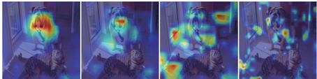

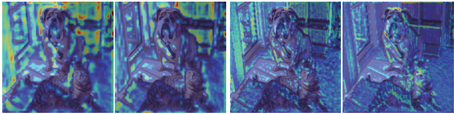

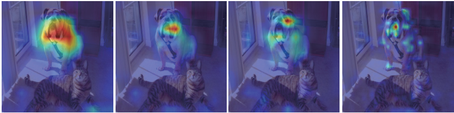

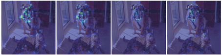

---

## 4.6.7 정리
<!-- 슬라이드 390~398 -->

- CAM 은 마지막 conv layer 의 feature map 을 class 와의 관련성으로 가중합하여, 모델이 판정의 근거로 삼은 영역을 heat map 으로 보여 준다.
- VGG16 은 conv 와 class 사이에 FC layer 가 있어 가중치를 직접 읽을 수 없다. Grad-CAM 은 class logit 을 feature map 의 모든 pixel 로 편미분한 gradient 를 관련성으로 쓴다. 관련이 없으면 편미분은 0 이다.
- `register_forward_hook` 으로 feature map 을, `register_backward_hook` 으로 gradient 를 가로채어 list 에 담는다. backward hook 의 `grad_output` 은 tuple 이므로 `[0]` 을 꺼낸다. `backward(retain_graph=True)` 로 graph 를 남기면 다른 class 로 backward 를 반복할 수 있다.
- 채널별 weight 는 gradient 의 공간 평균, CAM 은 `sum(weights * features)` 에 ReLU 를 적용한 것이다. 14×14 map 을 bilinear 보간으로 원본 크기까지 키우고, min-max 로 정규화한 뒤 JET colormap 을 입혀 원본과 blending 한다.
- feature map 을 뽑는 층·모델(Inception-v3)·객체 수를 바꾸어 가며 feature 의 representation 특성을 검토하는 것이 실습과제다.

> **핵심 메시지**
> Grad-CAM 은 "class 점수를 feature map 으로 편미분한 값이 0 이 아니면 관련이 있다" 는 한 가지 원리로, FC layer 가 있는 어떤 CNN 에서도 판정 근거를 시각화한다. 구현의 핵심은 hook 으로 feature map 과 gradient 를 같은 shape 으로 받아 내는 것이다.
