# 5.1 RNN Cell Architectures

**학습 목표**

- 순환신경망(RNN)이 입력을 시간 축에서 순차적으로 받아 내부 상태에 "기억"을 남기고, 그 기억과 새 입력을 함께 가공해 출력하는 구조임을 설명할 수 있다.
- Basic RNN cell, LSTM cell, GRU cell 의 구조도와 식을 읽고, 각 게이트가 무엇을 선택하는지 말할 수 있다.
- TensorFlow 와 PyTorch 의 LSTM 식이 어디서 다른지(bias 의 수) 알고, 세 셀의 파라미터 수를 $X_n$, $H_n$ 으로 계산할 수 있다.
- BPTT 가 시간 축을 따라 오차를 역전파하는 절차를 chain rule 로 설명하고, Basic RNN 에서 vanishing 문제가 왜 자주 생기는지 말할 수 있다.
- 긴 시퀀스를 학습할 때 TBPTT 가 왜 필요한지 설명할 수 있다.

**이 절의 구성**

- 5.1.1 순환신경망(RNN)의 기본 개념
- 5.1.2 RNN 적용 사례
- 5.1.3 RNN cell 의 세 종류와 Basic RNN cell
- 5.1.4 LSTM 의 구조와 핵심 아이디어
- 5.1.5 LSTM 의 게이트 연산 — forget, input, update, output
- 5.1.6 GRU(Gated Recurrent Unit)
- 5.1.7 LSTM 구현 방식의 차이와 파라미터 수
- 5.1.8 BPTT 와 시간 축의 vanishing 문제
- 5.1.9 TBPTT(Truncated BPTT)
- 5.1.10 정리

---

## 5.1.1 순환신경망(RNN)의 기본 개념
<!-- 슬라이드 407~409 -->

순환신경망(Recurrent Neural Network, RNN)은 출력이 이전 계산 결과의 영향을 받는 신경망이다. 지금까지 계산된 결과를 내부에 "기억"해 두고, 새 입력이 들어오면 기억된 정보와 함께 가공하여 출력한다. 이 동작을 세 단계로 나누어 보면 다음과 같다.

- 입력은 시간 축을 따라 순차적으로 공급된다.
- 셀은 들어온 입력 정보를 내부 상태에 기억한다.
- 새로운 입력과 기억된 정보를 함께 가공하여 출력을 만든다.

이 구조를 가장 널리 알려진 형태로 보여 주는 것이 Colah 의 블로그(http://colah.github.io/)에 실린 그림이다. 같은 셀 A 가 매 시점 $x_0, x_1, x_2, \dots, x_t$ 를 차례로 받아 $h_0, h_1, h_2, \dots, h_t$ 를 내놓고, 각 시점의 상태가 화살표를 따라 다음 시점으로 넘어간다. 셀은 하나인데 시간 축으로 펼쳐 놓았기 때문에 여러 개처럼 보일 뿐이다.

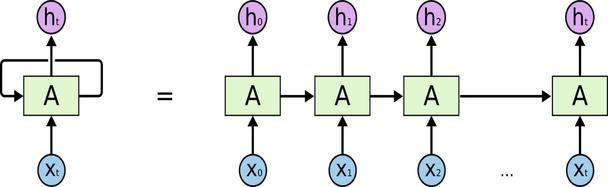

### k 시점에서 본 입출력 관계와 두 종류의 가중치

한 시점 $k$ 에서 셀 안을 들여다보면 입력이 두 갈래다. 현재 입력 $X_k$ 와 이전 시점의 상태 $S_{k-1}$ 이 들어와 새 상태 $S_k$ 가 되고, 이 상태에서 출력 $Y_k$ 가 나온다. 따라서 셀에는 두 종류의 가중치가 있다. 현재 입력에 곱하는 가중치(weight, $W_x$)와 이전 상태에 곱하는 순환 가중치(recurrent weight, $W_{rec}$)다. 왼쪽의 접힌(fold) 그림을 시간 축으로 펼치면(unfold) 오른쪽처럼 $S_0, S_1, S_2, \dots$ 가 사슬로 이어지고, 각 상태마다 입력 $X$ 가 들어오고 출력 $Y$ 가 나온다.

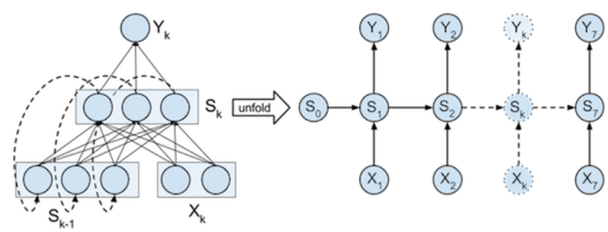

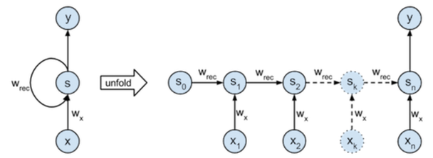

### RNN 모델 전체에서 보는 세 종류의 가중치

unit 하나가 아니라 RNN 모델 전체로 범위를 넓히면 가중치는 세 종류가 된다. 입력 가중치 $U$(weight), 순환 가중치 $W$(recurrent weight), 그리고 출력 가중치 $V$(output weight)다. 출력 가중치 $V$ 는 RNN 밖에 있는 가중치라는 점에 주의한다. 상태 $s$ 에서 출력 $o$ 를 만드는 층(예를 들어 분류를 위한 선형층)이 여기에 해당하며, 뒤에서 다룰 파라미터 수 계산이나 BPTT 유도에서 $U$, $W$, $V$ 를 구분하는 기준이 된다.

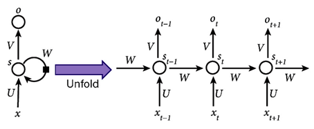

용어 두 가지를 정리해 둔다.

- Unfold 와 unroll 은 같은 뜻이다. 접힌 순환 구조를 시간 축으로 펼쳐 그리는 것을 말하며, 점차 unroll 이라는 말을 많이 쓴다.
- RNN cell, LSTM module, GRU unit 처럼 구조마다 cell, module, unit 이라는 이름이 따로 붙지만 실제로는 혼용된다. 이 절에서도 세 이름을 구분 없이 쓴다.

---

## 5.1.2 RNN 적용 사례
<!-- 슬라이드 410 -->

RNN 은 순서가 있는 데이터를 다루는 여러 문제에 쓰인다. 입력과 출력이 시퀀스인지, 그리고 다른 모델과 결합하는지를 기준으로 사례를 묶으면 다음과 같다.

| 유형 | 사례 |
|---|---|
| 순서 데이터에 꼬리표 달기(sequence labeling) | 리뷰를 읽고 감정 분류하기(sentiment classification), 필기체 인식과 음성 인식(handwriting recognition / speech recognition) |
| 시계열 예측(time series prediction) / 파형 생성(periodic function generation) | 차량과 고객 예측, 경제 예측, 날씨 예측 / 필기체 생성 |
| 비정형 정보 처리 | 사진을 훑어보고 인식하기(sequential processing of a fixed image) |
| 시계열 인코딩 / 디코딩 | 자연어처리(NLP, Natural Language Processing: 요약, 질의 응답, 대화, 번역 등), 기계 번역(NMT, Neural Machine Translation), 지문(story)을 보고 질문에 답하기 |
| CNN 모델과 결합 | 사진을 보고 주석 달기(image captioning) |

첫 줄의 sequence labeling 은 시퀀스를 읽고 꼬리표 하나(감정) 또는 시점마다의 꼬리표(문자, 음소)를 붙이는 문제다. 시계열 예측과 파형 생성은 과거 값으로 다음 값을 예측하거나 예측을 이어 붙여 파형을 만들어 내는 문제다. 고정된 사진을 순차적으로 훑어 인식하는 것처럼 원래 시퀀스가 아닌 데이터를 순서대로 처리하는 데도 쓰이고, 인코딩과 디코딩을 나누어 입력 시퀀스를 다른 시퀀스로 바꾸는 번역과 질의 응답에도 쓰인다. CNN 이 사진에서 뽑은 특징을 RNN 이 문장으로 풀어내는 image captioning 처럼 다른 모델과 결합하는 사례도 있다.

---

## 5.1.3 RNN cell 의 세 종류와 Basic RNN cell
<!-- 슬라이드 411~412 -->

이 절에서 다루는 RNN cell 구조는 세 가지다.

- Basic RNN cell
- LSTM(Long Short Term Memory) cell — module 이라고도 부른다
- GRU(Gated Recurrent Unit) cell — unit 이라고도 부른다

세 구조를 하나의 틀로 보면, 셀 A 가 입력 $x_t$ 를 받아 출력 $h_t$ 를 내고 그 결과를 다시 자기 자신에게 되돌리는 고리(loop)가 있다는 점은 같다. 다른 것은 고리 안에서 이전 상태와 새 입력을 어떻게 가공하느냐다.

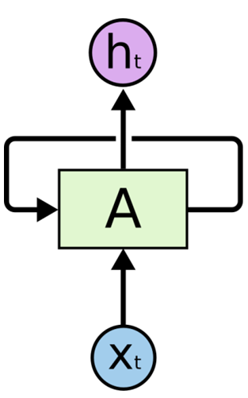

Basic RNN cell 은 고리 안에 $\tanh$ 층 하나만 있다. 이전 상태 $h_{t-1}$ 과 현재 입력 $x_t$ 를 합쳐 $\tanh$ 를 통과시킨 것이 곧 새 상태이자 출력 $h_t$ 다.

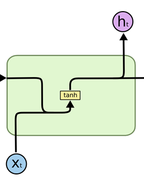

LSTM cell 은 셀을 가로지르는 선이 두 줄이고, 그 사이에 $\sigma$ 층 세 개와 $\tanh$ 층 하나, 곱셈과 덧셈 연산이 배치되어 있다. 위쪽 선이 cell state, 아래쪽 선이 hidden state 다.

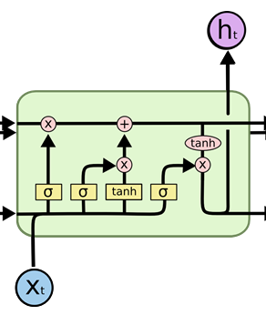

GRU cell 은 LSTM 을 단순화한 구조로, 가로지르는 선이 하나($h_{t-1}$ 에서 $h_t$)이고 $\sigma$ 층 두 개($r_t$, $z_t$)와 $\tanh$ 층 하나($\tilde{h}_t$)를 가진다.

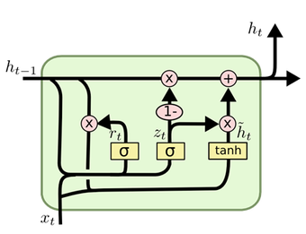

### Basic RNN cell 의 식과 파라미터 수

Basic RNN cell 은 구조는 single cell 로 그리지만, 파라미터 수는 layer 단위로 센다. 먼저 셀 하나의 식은 다음과 같다.

$$
h_t = \tanh\left( W_{hh}\, h_{t-1} + W_{xh}\, x_t + b_n \right)
$$

같은 식을 가중치 이름만 바꾸어 다음처럼도 쓴다(다른 표현).

$$
h_t = \tanh\left( W h_{t-1} + U x_t + b_n \right)
$$

$W_{hh}$(즉 $W$)는 이전 hidden state 에 곱하는 순환 가중치, $W_{xh}$(즉 $U$)는 현재 입력에 곱하는 가중치, $b_n$ 은 bias 다. 앞 소절의 세 가중치 가운데 출력 가중치 $V$ 는 셀 밖에 있으므로 셀 식에는 나타나지 않는다.

파라미터 수(#p)는 다음과 같이 센다.

$$
\#p = H_n \cdot H_n + H_n \cdot X_n + H_n = (H_n + X_n + 1)\, H_n
$$

- $X_n$ : input feature 의 수
- $H_n$ : RNN layer 의 cell 수

셀이 $H_n$ 개 있는 layer 를 생각하면, 각 셀은 $H_n$ 차원의 이전 hidden state 전체와 $X_n$ 차원의 입력 전체를 받고 bias 하나를 가지므로 셀 하나에 $H_n + X_n + 1$ 개의 파라미터가 있고, layer 전체로는 그 $H_n$ 배가 된다. 이것이 "구조는 single cell, 파라미터 수는 layer 단위로"라는 말의 뜻이다.

이 셈법은 일반 신경망(NN) 한 층의 파라미터 수와 같은 원리다. 입력이 $X_n$ 개, 출력이 $Y_n$ 개인 층의 파라미터 수는 다음과 같다.

$$
X_n \cdot Y_n + Y_n = (X_n + 1)\, Y_n
$$

한 층을 함수 $f : X \to Y$ 로 보면 $f : Y = \sigma(X \cdot W + b)$ 이고, 이것을 벡터와 행렬로 펼쳐 쓰면 다음과 같다.

$$
[\, x_1 \; x_2 \; \cdots \; x_d \,] \cdot W + [\, b \,] = [\, y_1 \; y_2 \; \cdots \; y_m \,], \qquad W \in \mathbb{R}^{d \times m}
$$

입력 $d$ 개와 출력 $m$ 개를 잇는 가중치 행렬 $W$ 가 $d \times m$ 개, 출력마다 bias 가 하나씩 $m$ 개이므로 합이 $(d + 1)\, m$ 개다. RNN 의 식에서는 입력 자리에 $[h_{t-1}, x_t]$ 가, 출력 자리에 $h_t$ 가 오므로 $d = H_n + X_n$, $m = H_n$ 을 넣은 것과 같다.

---

## 5.1.4 LSTM 의 구조와 핵심 아이디어
<!-- 슬라이드 413~414 -->

LSTM module 의 구조도는 앞의 Basic RNN cell 보다 훨씬 복잡해 보이지만, 선과 상자가 각각 무엇인지 알고 나면 읽을 수 있다. 이 구조도에는 layer 개념이 포함되어 있다. 노란 상자는 뉴런 하나가 아니라 신경망 층(neural network layer) 하나이고, 분홍 원은 벡터끼리의 원소별 연산(pointwise operation)이다. 화살표는 벡터의 전달(vector transfer), 두 선이 합쳐지는 것은 이어 붙이기(concatenate), 한 선이 갈라지는 것은 복사(copy)다.

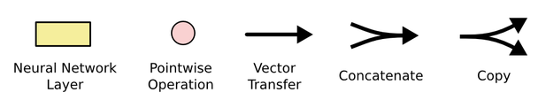

Pointwise 연산은 entrywise product, 즉 같은 위치의 원소끼리 곱하는 연산이며 기호로는 $\circ$ 또는 $\odot$ 로 쓴다. 이 절의 식에서는 $\odot$ 로 통일한다.

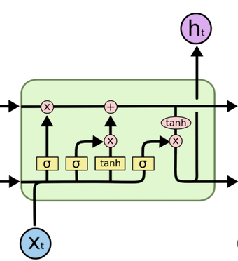

구조도의 각 부분이 무엇인지 표로 정리하면 다음과 같다.

| 구조도의 위치 | 이름 | 뜻 |
|---|---|---|
| 위쪽 가로선의 왼쪽 입구 | (Cell) state | 이전 시점에서 넘어온 cell state $C_{t-1}$ |
| 위쪽 가로선의 오른쪽 출구 | Next (Cell) State | 이번 시점에 갱신된 cell state $C_t$ |
| 아래쪽 가로선의 왼쪽 입구 | Hidden State | 이전 시점의 hidden state $h_{t-1}$ |
| 아래쪽 가로선의 오른쪽 출구, 위로 나가는 화살표 | Next Hidden State = Output | 이번 시점의 hidden state $h_t$. 출력은 hidden state 와 같다 |
| 아래에서 들어오는 화살표 | Input | 현재 입력 $x_t$ |
| 첫 번째 $\sigma$ 층과 위쪽 선의 곱셈 | Forget Gate | cell state 에서 버릴 정보를 정한다 |
| 두 번째 $\sigma$ 층, $\tanh$ 층, 곱셈과 덧셈 | Input Gate | cell state 에 저장할 정보를 정한다 |
| 세 번째 $\sigma$ 층, $\tanh$, 곱셈 | Output Gate | 출력할 정보를 정한다 |

### The core idea — conveyer belt & gates

LSTM 의 핵심 아이디어는 두 가지다. 하나는 컨베이어 벨트(conveyer belt)처럼 셀 위쪽을 곧게 가로지르는 cell state 이고, 다른 하나는 그 벨트에 무엇을 싣고 내릴지를 정하는 게이트(gate)다.

cell state 는 $C_{t-1}$ 에서 $C_t$ 로 셀 위쪽을 직선으로 지나간다. 그 위에서 일어나는 연산은 곱셈 하나와 덧셈 하나뿐이어서, 게이트가 손대지 않으면 정보가 거의 그대로 다음 시점으로 실려 간다. 이것이 긴 시간 동안 정보를 보존하는 통로다.

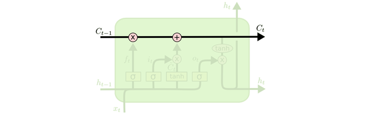

게이트는 $\sigma$ 층 하나와 pointwise 곱셈 하나로 이루어진다. $\sigma$ 층은 이전 hidden state 와 현재 입력을 보고 0 과 1 사이의 값을 벡터의 원소마다 내놓고, 이 값을 지나가는 벡터에 원소별로 곱한다. 0 이면 막고 1 이면 통과시키며, 그 사이의 값이면 그만큼만 통과시킨다. 개찰구처럼 정보를 얼마나 통과시킬지를 정하는 장치다.

> **핵심 메시지**
> LSTM 은 cell state 라는 컨베이어 벨트를 두고, forget, input, output 세 게이트로 벨트에서 무엇을 버리고 무엇을 싣고 무엇을 꺼낼지를 정한다. Basic RNN 이 매 시점 상태 전체를 $\tanh$ 로 다시 쓰는 것과 달리, LSTM 의 cell state 는 게이트가 손대지 않는 한 그대로 흐른다.

---

## 5.1.5 LSTM 의 게이트 연산 — forget, input, update, output
<!-- 슬라이드 415~416 -->

LSTM 한 시점의 계산은 네 단계로 나뉜다. 순서대로 forget gate, input gate, cell state 의 update, output gate 다. 각 단계의 식에서 $[h_{t-1}, x_t]$ 는 이전 hidden state 와 현재 입력을 이어 붙인 벡터이고, $W_f, W_i, W_C, W_o$ 와 $b_f, b_i, b_C, b_o$ 는 단계마다 따로 있는 가중치와 bias 다.

### Forget gate — cell state 에서 버릴 정보를 선택

forget gate 는 cell state 에서 무엇을 얼마나 버릴 것인가를 정한다. $\sigma$ 층이 $[h_{t-1}, x_t]$ 를 보고 cell state 의 원소마다 0 과 1 사이의 값 $f_t$ 를 내놓는다.

$$
f_t = \sigma\left( W_f \cdot [h_{t-1}, x_t] + b_f \right)
$$

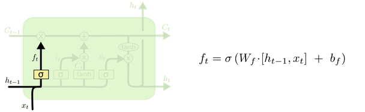

### Input gate — cell state 에 저장할 정보를 선택

input gate 는 cell state 에 무엇을($\tilde{C}_t$) 얼마나($i_t$) 저장할 것인가를 정한다. 두 층이 함께 일한다. $\sigma$ 층은 얼마나 저장할지를 정하는 $i_t$ 를 만들고, $\tanh$ 층은 저장할 후보 값 $\tilde{C}_t$ 를 만든다.

$$
i_t = \sigma\left( W_i \cdot [h_{t-1}, x_t] + b_i \right)
$$

$$
\tilde{C}_t = \tanh\left( W_C \cdot [h_{t-1}, x_t] + b_C \right)
$$

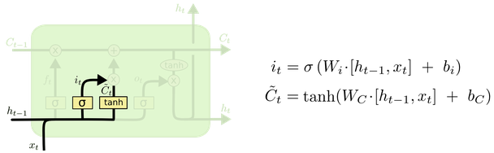

### Update — cell state 의 갱신

앞의 두 게이트 결과로 기억할 정보를 수정한다. 절차는 두 줄로 쓸 수 있다.

- `prev_state * forget_gate -> forget_state` : 이전 cell state 에 forget gate 를 곱해 버릴 것을 버린다.
- `forget_state + curr_state * input_gate -> update_state` : 거기에 후보 값에 input gate 를 곱한 것을 더해 새로 저장할 것을 싣는다.

식으로 쓰면 다음과 같다.

$$
C_t = f_t \odot C_{t-1} + i_t \odot \tilde{C}_t
$$

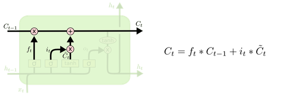

### Output gate — 출력할 정보를 선택

output gate 는 갱신된 cell state 가운데 무엇을 출력(hidden state)으로 내보낼지를 정한다. `updated_state * output_gate -> output(hidden state)` 의 절차다. $\sigma$ 층이 $o_t$ 를 만들고, 갱신된 cell state 를 $\tanh$ 에 통과시킨 값에 $o_t$ 를 곱한 것이 이번 시점의 hidden state 이자 출력 $h_t$ 다.

$$
o_t = \sigma\left( W_o\, [h_{t-1}, x_t] + b_o \right)
$$

$$
h_t = o_t \odot \tanh(C_t)
$$

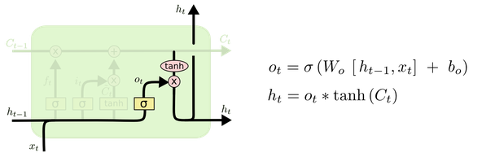

원문 그림의 식은 pointwise 곱을 $*$ 로 쓰고 있다. $*$, $\circ$, $\odot$ 는 모두 같은 원소별 곱셈이다.

---

## 5.1.6 GRU(Gated Recurrent Unit)
<!-- 슬라이드 417 -->

GRU 는 LSTM 의 장점을 유지하면서도 계산 복잡성을 낮춘 구조다. Cho, Kyunghyun, et al. "Learning phrase representations using RNN encoder-decoder for statistical machine translation." (arXiv preprint arXiv:1406.1078, 2014)에서 제안되었다. LSTM 과 달리 cell state 와 hidden state 를 나누지 않고 hidden state 하나만 두며, 게이트도 update gate 와 reset gate 두 개다.

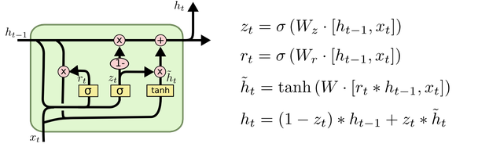

구조도의 식은 다음과 같다. 여기서 $\odot$ 는 앞과 같은 pointwise(entrywise) 곱이다.

- Update gate

$$
z_t = \sigma\left( W_z \cdot [h_{t-1}, x_t] \right)
$$

- Reset gate

$$
r_t = \sigma\left( W_r \cdot [h_{t-1}, x_t] \right)
$$

- 후보 hidden state

$$
\tilde{h}_t = \tanh\left( W \cdot [r_t \odot h_{t-1},\; x_t] \right)
$$

- 새 hidden state

$$
h_t = (1 - z_t) \odot h_{t-1} + z_t \odot \tilde{h}_t
$$

$\tilde{h}_t$($h_t$ tilde)는 현재와 과거 정보를 기준으로, 과거 정보의 일부를 지워서 기억할 정보를 유도한 값이다. reset gate $r_t$ 가 이전 hidden state $h_{t-1}$ 에 원소별로 곱해져 과거 정보 가운데 얼마를 지울지를 정하고, 지우고 남은 과거 정보와 현재 입력 $x_t$ 를 $\tanh$ 층에 넣어 후보 $\tilde{h}_t$ 를 만든다.

update gate $z_t$ 는 LSTM 의 forget gate 와 input gate 의 역할을 하나로 합친 것이다. 마지막 식에서 $(1 - z_t)$ 만큼은 이전 상태 $h_{t-1}$ 을 그대로 유지하고 $z_t$ 만큼은 후보 $\tilde{h}_t$ 로 바꾼다. 구조도에서 $z_t$ 가 두 갈래로 나뉘어 한쪽은 $1-$ 를 거쳐 $h_{t-1}$ 에, 다른 쪽은 $\tilde{h}_t$ 에 곱해지는 것이 이 식이다. 게이트 하나가 유지와 갱신의 비율을 동시에 정하므로 LSTM 보다 층이 하나 적고 파라미터도 그만큼 줄어든다.

---

## 5.1.7 LSTM 구현 방식의 차이와 파라미터 수
<!-- 슬라이드 418~419 -->

같은 LSTM 이라도 TensorFlow 와 PyTorch 는 식을 다르게 쓴다. 차이는 bias 의 수에 있다.

### TensorFlow

TensorFlow 의 식은 앞 소절에서 본 형태 그대로다. $[h_{t-1}, x_t]$ 를 이어 붙인 벡터에 가중치 하나 $W_f$ 를 곱하고 bias 하나 $b_f$ 를 더한다. 나머지 게이트도 같다.

$$
\begin{aligned}
f_t &= \sigma\left( W_f \cdot [h_{t-1}, x_t] + b_f \right) \\
i_t &= \sigma\left( W_i \cdot [h_{t-1}, x_t] + b_i \right) \\
\tilde{C}_t &= \tanh\left( W_C \cdot [h_{t-1}, x_t] + b_C \right) \\
C_t &= f_t \odot C_{t-1} + i_t \odot \tilde{C}_t \\
o_t &= \sigma\left( W_o\, [h_{t-1}, x_t] + b_o \right) \\
h_t &= o_t \odot \tanh(C_t)
\end{aligned}
$$

### PyTorch

PyTorch 는 입력 쪽과 hidden 쪽을 나누어 쓴다. 입력 $x_t$ 에 곱하는 가중치 $W_{ii}$ 와 hidden state 에 곱하는 가중치 $W_{hi}$ 가 따로 있고, bias 도 입력 쪽 $b_{ii}$ 와 hidden 쪽 $b_{hi}$ 두 개다. 후보 값은 $\tilde{C}_t$ 대신 $g_t$ 로, cell state 는 소문자 $c_t$ 로 쓴다.

$$
\begin{aligned}
i_t &= \sigma\left( W_{ii} x_t + b_{ii} + W_{hi} h_{t-1} + b_{hi} \right) \\
f_t &= \sigma\left( W_{if} x_t + b_{if} + W_{hf} h_{t-1} + b_{hf} \right) \\
g_t &= \tanh\left( W_{ig} x_t + b_{ig} + W_{hg} h_{t-1} + b_{hg} \right) \\
o_t &= \sigma\left( W_{io} x_t + b_{io} + W_{ho} h_{t-1} + b_{ho} \right) \\
c_t &= f_t \odot c_{t-1} + i_t \odot g_t \\
h_t &= o_t \odot \tanh(c_t)
\end{aligned}
$$

가중치 자체는 두 방식이 같다. TensorFlow 의 $W_f$ 는 $[h_{t-1}, x_t]$ 전체에 곱하는 하나의 행렬이고, PyTorch 의 $W_{if}$ 와 $W_{hf}$ 는 그것을 입력 부분과 hidden 부분으로 나눈 것이므로 크기의 합이 같다. 다른 것은 bias 뿐이다. TensorFlow 는 게이트마다 bias 가 한 벌, PyTorch 는 두 벌이다. 이 차이가 아래 파라미터 수의 $+1$ 과 $+2$ 로 나타난다.

### 파라미터 수

세 셀의 파라미터 수를 $X_n$(input feature 수)과 $H_n$(layer 의 cell 수)으로 쓰면 다음과 같다. 같은 셀이라도 TensorFlow 와 PyTorch 가 다르다.

| 셀 | TensorFlow | PyTorch |
|---|---|---|
| Basic RNN cell | $(X_n + H_n + 1)\, H_n$ | $(X_n + H_n + 2)\, H_n$ |
| LSTM cell | $\left( (X_n + H_n + 1)\, H_n \right) \times 4$ | $\left( (X_n + H_n + 2)\, H_n \right) \times 4$ |
| GRU cell | $\left( (X_n + H_n + 1)\, H_n \right) \times 3$ | $\left( (X_n + H_n + 2)\, H_n \right) \times 3$ |

Basic RNN cell 의 $(X_n + H_n + 1)\, H_n$ 은 5.1.3 에서 센 것과 같다. 괄호 안의 $+1$ 이 bias 한 벌, $+2$ 가 bias 두 벌이다. LSTM 은 $\sigma$ 층 셋($f_t$, $i_t$, $o_t$)과 $\tanh$ 층 하나($\tilde{C}_t$)가 각각 Basic RNN cell 한 층과 같은 크기의 가중치를 가지므로 4 배가 되고, GRU 는 $\sigma$ 층 둘($z_t$, $r_t$)과 $\tanh$ 층 하나($\tilde{h}_t$)로 3 배가 된다. 5.1.3 의 세 구조도에서 노란 상자의 수를 세어 보면 각각 1, 4, 3 개다. 이 표는 뒤에서 PyTorch 로 layer 를 만들고 파라미터 수를 확인할 때 답을 맞추어 보는 기준이 된다.

---

## 5.1.8 BPTT 와 시간 축의 vanishing 문제
<!-- 슬라이드 420~422 -->

셀 구조를 세 가지 살펴보았으니, 이제 이 셀들이 시간 축에서 어떻게 학습되는지를 본다. 결론부터 말하면 Basic RNN 은 시간 축에서 vanishing 문제가 자주 발생하고, LSTM 과 GRU 는 이 점이 상당히 개선되었다.

### BPTT vanishing problem

아래 두 그림은 시점 1 에 들어온 입력의 정보가 hidden layer 를 거쳐 뒤 시점까지 얼마나 남는지를 진하기로 나타낸 것이다.

Basic RNN 에서는 시점 1 의 입력이 hidden layer 에 진하게 들어왔다가 시점이 지날수록 점점 옅어지고, 시점 7 에 이르면 거의 남지 않는다. 출력도 마찬가지로 옅어진다. 매 시점 상태 전체가 $\tanh$ 를 다시 통과하면서 앞 시점의 정보가 희석되고, 역전파할 때도 그만큼 기울기가 사라지기 때문이다.

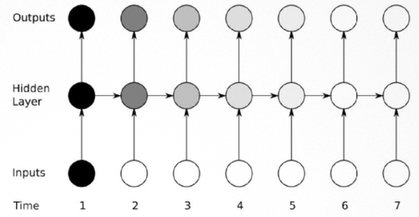

LSTM 과 GRU 에서는 hidden layer 의 게이트가 열리고(원) 닫히는(막대) 것에 따라 시점 1 의 정보가 옅어지지 않고 진하게 유지되다가, 필요한 시점(4 와 6)의 출력으로 나간다. 게이트가 닫혀 있는 동안은 cell state 가 그대로 흐르므로 정보도, 기울기도 사라지지 않는다.

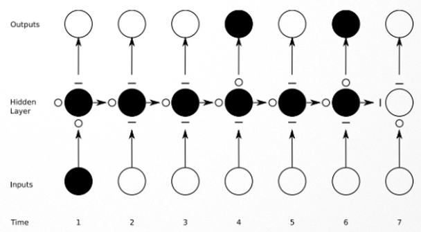

### RNN parameters — many to many 연산 절차

vanishing 이 왜 생기는지를 보려면 먼저 RNN 의 파라미터가 시간 축에서 어떻게 쓰이는지 알아야 한다. many to many 구조, 즉 매 시점 입력이 들어오고 매 시점 출력이 나오는 경우의 연산 절차는 다음과 같다.

- 초기 상태 $h_0$ 에서 시작하여, 시점마다 함수 $f_W$ 가 이전 상태와 현재 입력 $x_t$ 를 받아 다음 상태 $h_t$ 를 만든다.
- 각 상태 $h_t$ 에서 출력 $y_t$ 가 나오고, 정답과 비교하여 시점별 손실 $l_t$ 가 계산된다.
- 시점별 손실을 모아 전체 손실 $L$ 이 된다.

여기서 중요한 것은 동일한 파라미터(가중치 행렬) $W$ 가 매 time step 에 사용된다는 점이다. 그림에서 $W$ 로부터 모든 $f_W$ 에 점선이 이어져 있는 것이 이것이다. 시점이 아무리 길어도 가중치는 한 벌이다. 초기값 $h_0$ 는 0 으로 두거나 학습 결과로 정한다.

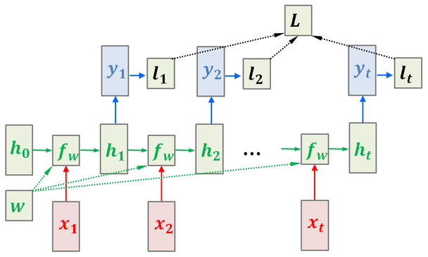

### BPTT(Back Propagation Through Time) training

가중치가 한 벌이므로, 전체 손실을 가중치로 미분하려면 모든 시점을 거슬러 올라가며 기여를 더해야 한다. 이것이 시간 축을 따라 역전파하는 BPTT 다. 5.1.1 의 세 가중치 표기($U$: 입력, $W$: 순환, $V$: 출력)로 한 시점의 순전파를 쓰면 다음과 같다.

$$
s_t = \tanh\left( U x_t + W s_{t-1} \right), \qquad \hat{y}_t = \mathrm{softmax}\left( V s_t \right)
$$

전체 오차(total error, cost)는 시점별 오차 $E_t$ 를 모두 모은 것이다.

$$
E(y, \hat{y}) = -\sum_t E_t(y_t, \hat{y}_t)
$$

시점 3 의 오차 $E_3$ 를 예로 들어 시간 축을 따라 미분해 본다(chain rule 적용). 아래 그림에서 $s_0$ 에서 $s_4$ 로 이어지는 검은 화살표가 순전파이고, $E_3$ 에서 $s_3$ 로, 다시 $s_2$, $s_1$, $s_0$ 로 거슬러 가는 빨간 화살표가 역전파다. 빨간 화살표에 적힌 $\partial s_3 / \partial s_2$ 같은 항이 시점 사이를 건너갈 때마다 곱해진다.

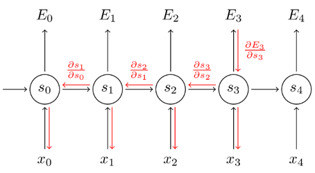

세 가중치에 대한 편미분은 성격이 서로 다르다.

**$V$ 에 대해 편미분하면** — 현재 시점의 값으로 계산할 수 있다. $\hat{y}_3$ 는 $V$ 와 $s_3$ 만으로 정해지므로 시간을 거슬러 갈 필요가 없다.

$$
\begin{aligned}
\frac{\partial E_3}{\partial V}
&= \frac{\partial E_3}{\partial \hat{y}_3} \frac{\partial \hat{y}_3}{\partial V} \\
&= \frac{\partial E_3}{\partial \hat{y}_3} \frac{\partial \hat{y}_3}{\partial z_3} \frac{\partial z_3}{\partial V} \\
&= (\hat{y}_3 - y_3) \otimes s_3
\end{aligned}
$$

여기서 $\otimes$ 는 tensor product 이고, $z_3$ 는 softmax 에 들어가기 전의 값 $V s_3$ 다.

**$W$ 에 대해 편미분하면** — 시간 축을 따라 역전파해야 한다. $s_3$ 는 $W$ 에 직접 의존할 뿐 아니라 $s_2$ 를 통해서도, $s_2$ 는 다시 $s_1$ 을 통해서도 $W$ 에 의존하므로, $k = 0$ 부터 $3$ 까지 모든 시점의 기여를 더한다.

$$
\frac{\partial E_3}{\partial W}
= \sum_{k=0}^{3} \frac{\partial E_3}{\partial \hat{y}_3} \frac{\partial \hat{y}_3}{\partial s_3} \frac{\partial s_3}{\partial s_k} \frac{\partial s_k}{\partial W}
$$

$\partial s_3 / \partial s_k$ 는 $s_3$ 에서 $s_k$ 까지 시점을 하나씩 건너는 항 $\partial s_3 / \partial s_2$, $\partial s_2 / \partial s_1$, $\dots$ 의 곱이다. 이 곱이 시점 수만큼 길어지면서 값이 작아지는 것이 Basic RNN 의 vanishing 문제다.

**$U$ 에 대해 편미분하면** — $\tanh$ 이전의 값 $z$ 로 미분할 수 있다. $\tanh$ 에 들어가기 전의 값을 $z_t = U x_t + W s_{t-1}$ 로 두고, 오차를 $z$ 로 미분한 $\delta$ 를 정의하면 다음과 같다.

$$
\frac{\partial E_3}{\partial U} = \delta_i^{(3)}\, x_i^{T}
$$

$$
\delta_2^{(3)} = \frac{\partial E_3}{\partial z_2}
= \frac{\partial E_3}{\partial s_3} \frac{\partial s_3}{\partial s_2} \frac{\partial s_2}{\partial z_2},
\qquad z_2 = U x_2 + W s_1
$$

$\delta_2^{(3)}$ 는 시점 3 의 오차가 시점 2 의 $\tanh$ 입력 $z_2$ 에 미치는 영향이며, $W$ 의 경우와 마찬가지로 $\partial s_3 / \partial s_2$ 를 거쳐 시간을 거슬러 계산된다. 여기에 그 시점의 입력 $x$ 를 곱한 것이 $U$ 에 대한 기울기다.

---

## 5.1.9 TBPTT(Truncated BPTT)
<!-- 슬라이드 423 -->

시퀀스가 긴 RNN 모델에는 문제가 있다. 순전파에서 loss 를 계산하고 역전파에서 $W$ 를 수정하려면 펼친 모든 시점의 값을 들고 있어야 하므로 많은 메모리가 필요하다. 시퀀스가 길어질수록, 특히 끝이 없는 데이터라면 전체 시퀀스에 대해 BPTT 를 하는 것은 불가능하다.

이 절의 그림에서 쓰는 가중치 표기는 앞의 $U$, $W$, $V$ 와 다음과 같이 대응한다.

| 위치 | 표기 | 앞 소절의 표기 |
|---|---|---|
| 입력 $x_t$ 에서 RNN 으로 | $W_{xh}$ | $U$ |
| RNN 의 순환 연결 | $W_{hh}$ | $W$ |
| RNN 에서 출력 $y_t$ 로 | $W_{hy}$ | $V$ |

BPTT 는 전체 시퀀스에 대해 순전파와 역전파를 모두 수행한다. 아래 그림에서 모든 시점의 출력이 Loss 로 모이고, 역전파(빨간 화살표)가 시퀀스 전체를 거슬러 간다.

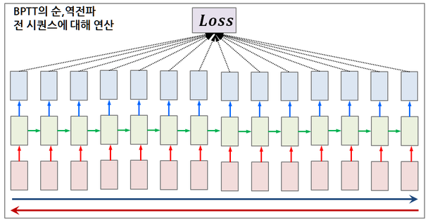

TBPTT(Truncated Back Propagation Through Time)는 역전파하는 시퀀스를 부분적으로 제한한다. 순전파는 시퀀스 전체에 대해 계속 진행하되, Loss 계산과 역전파는 마지막 일정 구간(그림의 파란 상자)에 대해서만 한다. 그 앞 시점들의 상태는 순전파로 계산되어 뒤로 넘어가지만 기울기는 거슬러 가지 않으므로, 들고 있어야 할 시점의 수가 상자의 길이로 제한된다. 무한 길이의 데이터를 학습할 때는 이 방식이 반드시 필요하다.

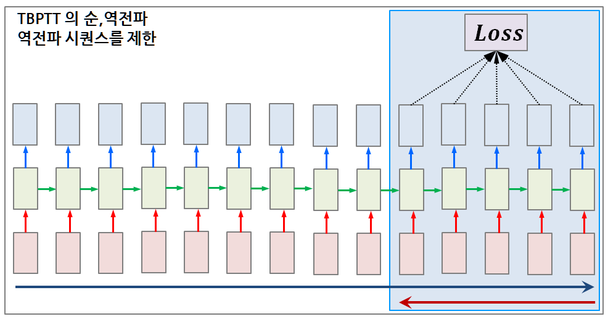

---

## 5.1.10 정리
<!-- 슬라이드 424 -->

- RNN 은 입력을 시간 축에서 순차적으로 받아 내부 상태에 기억을 남기고, 새 입력과 기억을 함께 가공해 출력한다. 접힌 셀을 시간 축으로 펼치는 것을 unfold(unroll)라 하며, 가중치는 입력 $U$, 순환 $W$, 출력 $V$ 세 종류다. 출력 가중치 $V$ 는 RNN 밖에 있다.
- Basic RNN cell 은 $h_t = \tanh(W_{hh} h_{t-1} + W_{xh} x_t + b_n)$ 하나로 이루어지며, 파라미터 수는 layer 단위로 $(H_n + X_n + 1)\, H_n$ 이다.
- LSTM 은 cell state 라는 컨베이어 벨트와 forget, input, output 세 게이트로 이루어진다. forget gate 가 버릴 것을, input gate 가 저장할 것($\tilde{C}_t$)과 그 양($i_t$)을, output gate 가 출력할 것을 정하고, cell state 는 $C_t = f_t \odot C_{t-1} + i_t \odot \tilde{C}_t$ 로 갱신된다.
- GRU 는 hidden state 하나와 update gate, reset gate 두 개로 LSTM 의 장점을 유지하면서 계산 복잡성을 낮춘다. $h_t = (1 - z_t) \odot h_{t-1} + z_t \odot \tilde{h}_t$ 에서 $z_t$ 하나가 유지와 갱신의 비율을 정한다.
- TensorFlow 는 게이트마다 bias 한 벌, PyTorch 는 두 벌을 쓴다. 파라미터 수는 Basic RNN 이 $(X_n + H_n + 1)\, H_n$ 또는 $(X_n + H_n + 2)\, H_n$ 이고, LSTM 은 그 4 배, GRU 는 3 배다.
- 같은 가중치가 매 time step 에 쓰이므로 학습은 시간 축을 따라 역전파하는 BPTT 로 한다. $V$ 는 현재 값으로, $W$ 와 $U$ 는 시점을 거슬러 $\partial s_t / \partial s_{t-1}$ 을 곱해 가며 계산되고, 이 곱이 길어지며 작아지는 것이 Basic RNN 의 vanishing 문제다. LSTM 과 GRU 는 게이트 덕분에 이 문제가 상당히 개선된다.
- 시퀀스가 길면 메모리 때문에 전체 BPTT 가 어려우므로, 순전파는 계속하되 역전파 구간만 제한하는 TBPTT 를 쓴다. 무한 길이 데이터에서는 필수다.
