# 5.2 RNN Model Architectures

**학습 목표**

- 입력과 출력이 각각 하나인지 시퀀스인지에 따라 RNN 구조를 one to one · one to many · many to one · many to many 로 구분하고, 각 구조가 어떤 문제에 쓰이는지 말할 수 있다.
- `torch.nn.LSTM` 의 인자(`input_size`, `hidden_size`, `batch_first`, `proj_size`, `num_layers`, `bidirectional`)와 입출력 텐서의 shape 을 설명할 수 있다.
- `weight_ih` · `weight_hh` · bias 의 shape 으로부터 LSTM 층과 Linear 층의 파라미터 수를 손으로 계산하고 `torchinfo.summary` 의 결과와 맞춰 볼 수 있다.
- TimeDistributed 의 명시적 구현과 PyTorch Linear 층의 묵시적 time distributed 동작을 구분할 수 있다.
- Parallel · Stacked · Bidirectional · LSTM AutoEncoder · seq2seq 구조를 `nn.Module` 로 만들고 구조도와 summary 로 확인할 수 있다.

**이 절의 구성**

- 5.2.1 입출력을 중심으로 본 RNN 구조
- 5.2.2 PyTorch LSTM API 와 실습 준비
- 5.2.3 RNN 층의 기본 동작 — weight 와 proj_size
- 5.2.4 One to one 모델과 파라미터 수
- 5.2.5 Many to many 와 Many to one
- 5.2.6 TimeDistributed — 명시적 · 묵시적
- 5.2.7 LSTM AutoEncoder 와 torch.repeat()
- 5.2.8 레이어를 중심으로 본 RNN 구조
- 5.2.9 Parallel LSTM
- 5.2.10 Stacked LSTM
- 5.2.11 Bidirectional LSTM
- 5.2.12 Sequence to Sequence(seq2seq) 모델
- 5.2.13 정리

---

## 5.2.1 입출력을 중심으로 본 RNN 구조
<!-- 슬라이드 426 -->

RNN 구조는 먼저 **입출력의 형태**로 나눌 수 있다. 입력이 하나인지 시퀀스인지, 출력이 하나인지 시퀀스인지, 그리고 입력과 출력의 time step 이 서로 맞물려 있는지에 따라 다섯 가지가 된다.

1. **Vanilla mode, without RNN (one to one)** — 입력 하나에 출력 하나다. 시간 개념이 없는 데이터를 다루는 image classification 이 여기에 든다. RNN 을 쓰지 않는 보통의 신경망과 같은 형태다.
2. **Sequence output (one to many)** — 입력은 하나인데 출력이 시퀀스다. 이미지 한 장을 받아 단어의 나열을 만들어 내는 image captioning 이 예다.
3. **Sequence input (many to one)** — 입력은 시퀀스이고 출력은 하나다. 문장을 끝까지 읽고 긍정·부정 하나를 내는 sentiment analysis 가 예다.
4. **Sequence input and sequence output (many to many)** — 입력 시퀀스를 모두 읽은 뒤에 출력 시퀀스를 만든다. Machine translation 이 대표적이다. 입력의 길이와 출력의 길이가 달라도 된다.
5. **Synced sequence input and output (many to many, synced)** — 입력의 매 time step 마다 출력이 하나씩 나온다. 동영상의 프레임마다 레이블을 붙이는 video classification with many labels 가 예다.

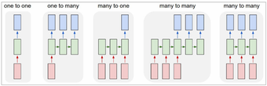

그림에서 붉은 상자는 입력, 초록 상자는 RNN 셀(hidden state), 파란 상자는 출력이다. 초록 상자 사이를 잇는 가로 화살표가 hidden state 를 다음 time step 으로 넘기는 순환 경로이고, 이 경로가 있느냐 없느냐가 one to one 과 나머지 네 구조를 가른다.

> **핵심 메시지**
> "If training vanilla neural nets is optimization over functions, training recurrent nets is optimization over programs." — 보통의 신경망을 학습시키는 것이 **함수**를 최적화하는 일이라면, 순환 신경망을 학습시키는 것은 **프로그램**을 최적화하는 일이다. RNN 은 입력을 한 번에 출력으로 사상하는 것이 아니라, time step 마다 상태를 갱신하면서 같은 셀을 반복 실행하기 때문이다.

이 절의 앞부분(5.2.2\~5.2.7)은 이 입출력 관점의 구조를 PyTorch 코드로 하나씩 만들어 보고, 뒷부분(5.2.8\~5.2.12)은 **레이어의 배치** 관점(Parallel · Stacked · Bidirectional · seq2seq)으로 구조를 넓힌다.

---

## 5.2.2 PyTorch LSTM API 와 실습 준비
<!-- 슬라이드 427 -->

### 실습 5.2.1 — RNN Model Architectures

> 노트북: `code/5.2.1.RnnArchitecture.ipynb`
> [](https://colab.research.google.com/github/AI-BoostCamp/intermediate-deep-learning-pytorch/blob/main/code/5.2.1.RnnArchitecture.ipynb)

이 절의 코드는 모두 이 노트북 한 권에서 나온다. 노트북은 앞의 구조들을 `nn.Module` 로 하나씩 만들고, `torchinfo.summary` 로 출력 shape 과 파라미터 수를 확인한 뒤, `torch.onnx.export()` 로 저장한 모델을 Netron 뷰어로 열어 구조도를 그린다. 아래에 실린 구조도가 그렇게 얻은 것이다. 소절 5.2.2 부터 5.2.12 까지가 노트북의 셀 순서를 그대로 따라간다. 코드에 나오는 `ps()` 는 텐서의 shape 을 찍어 보는 노트북의 헬퍼 함수다.

**torch.nn.LSTM / GRU API 의 인자**

RNN 층을 만드는 `torch.nn.LSTM` 의 시그니처는 다음과 같다. `torch.nn.GRU` 도 `proj_size` 를 뺀 나머지 인자가 같다.

```python
torch.nn.LSTM(
    input_size,        # The number of features in the input x
    hidden_size,       # The number of features in the hidden state h
    num_layers=1,      # Number of recurrent layers.
    bias=True,         # False: then the layer does not use bias weights.
    batch_first=False, # True: (batch, seq, feature), False: (seq, batch,feature)
    dropout=0,         # Dropout layer on the outputs of each LSTM layer except the last layer
    bidirectional=False,# True: bidirectional LSTM
    proj_size=0        # If > 0, will use LSTM with projections of corresponding size.
)
```

- `input_size` — 입력 $x$ 의 feature 수다.
- `hidden_size` — hidden state $h$ 의 feature 수다. 이 절에서는 units 라고도 부른다.
- `num_layers` — 순환 층을 몇 겹 쌓을지 정한다. 2 이상이면 Stacked LSTM 이 된다(5.2.10).
- `bias` — `False` 면 bias 가중치를 쓰지 않는다.
- `batch_first` — `True` 면 입력을 (batch, seq, feature) 순서로, 기본값 `False` 면 (seq, batch, feature) 순서로 해석한다.
- `dropout` — 마지막 층을 뺀 각 LSTM 층의 출력에 적용하는 dropout 비율이다. `num_layers` 가 2 이상일 때만 뜻이 있다.
- `bidirectional` — `True` 면 양방향 LSTM 이 된다(5.2.11).
- `proj_size` — 0 보다 크면 hidden state 를 그 크기로 투영(projection)하는 LSTM 이 된다(5.2.3).

**입출력**

층을 호출하는 형태는 한 줄로 요약된다.

```python
output, (h_n, c_n) = torch.nn.LSTM(...)(input, (h_0, c_0))
```

입력은 시퀀스 텐서 `input` 과 초기 상태 `(h_0, c_0)` 이고, 초기 상태를 생략하면 0 으로 채운다. 출력은 두 가지다. **모든 time step 의 hidden state 를 모은 `output`** 과 **마지막 time step 의 hidden state 와 cell state 인 `(h_n, c_n)`** 이다. 둘 중 어느 쪽을 다음 층에 넘기느냐가 many to many 와 many to one 을 가른다.

**기본 dataset shape**

이 절은 dataset 의 기본 shape 을 `(samples, timesteps, features)` 로 둔다. 그래서 층을 만들 때 거의 항상 `batch_first=True` 를 준다. 실습에서 쓰는 크기는 다음과 같다.

```python
x_dim = data_dim = features = 25
timesteps = sequence_length = 7
units = cells = 50
```

feature 25 개짜리 관측이 7 time step 이어진 시퀀스가 샘플 하나이고, hidden state 의 크기(units)는 50 이다. 같은 값을 여러 이름으로 묶어 둔 것은 문헌마다 부르는 이름이 다르기 때문이다 — `x_dim`/`data_dim`/`features`, `timesteps`/`sequence_length`, `units`/`cells` 는 각각 같은 것을 가리킨다.

먼저 층 하나를 만들어 난수 입력을 넣어 본다.

```python
import torch
import torch.nn as nn
from torchinfo import summary

batch_size = 1
inputs = torch.randn(batch_size, timesteps, features) #(1,7,25)

lstm = nn.LSTM(input_size=25, hidden_size=50, batch_first=True)

whole_seq_output, (h_T, c_T) = lstm(inputs)
```

```python
ps(whole_seq_output) #(1,7,50)
ps(h_T)              #(1,1,50)
ps(c_T)              #(1,1,50)
```

`whole_seq_output` 의 shape 은 (1, 7, 50) 이다. 샘플 1 개, time step 7 개, 각 time step 의 hidden state 50 개라는 뜻이다. `h_T` 와 `c_T` 는 (1, 1, 50) 인데, 이때 첫 축은 batch 가 아니라 **층 수와 방향 수의 곱**이다. `batch_first=True` 를 주어도 `(h_n, c_n)` 의 축 순서는 (층 수 x 방향 수, batch, hidden) 으로 고정된다는 점을 기억해 둔다.

---

## 5.2.3 RNN 층의 기본 동작 — weight 와 proj_size
<!-- 슬라이드 428 -->

**Input-hidden weight 와 hidden-hidden weight**

RNN 층의 특성은 가중치의 shape 에 그대로 드러난다.

```python
ps(lstm.weight_ih_l0) #(4*units,features)(200,25)
ps(lstm.weight_hh_l0) #(4*units,units)   (200,50)
```

`weight_ih_l0` 은 0 번째 층의 입력(input)에서 hidden 으로 가는 가중치로 shape 이 (4 x units, features) = (200, 25) 이고, `weight_hh_l0` 은 hidden 에서 hidden 으로 되돌아가는 순환 가중치로 (4 x units, units) = (200, 50) 이다. 앞에 4 가 붙는 이유는 LSTM 이 input gate · forget gate · cell candidate · output gate 네 묶음을 갖고, PyTorch 가 이 네 묶음의 가중치를 한 행렬에 세로로 이어 붙여 두기 때문이다. bias 도 `bias_ih_l0` 과 `bias_hh_l0` 두 개가 각각 (200,) 으로 있다.

**proj_size — recurrent path 의 차원 바꾸기**

`proj_size` 는 순환 경로(recurrent path)의 차원을 바꾼다. hidden state 의 수를 units 가 아니라 다른 숫자로 사상(mapping)하므로 출력의 수도 함께 바뀐다. 원문은 `hidden_size` 의 1/2 에서 2/3 사이의 값을 권한다.

```python
lstm = nn.LSTM(input_size=features, hidden_size=units, proj_size=4)
ps(lstm.weight_ih_l0) #(4*units,features) (200,25)
ps(lstm.weight_hh_l0) #(4*units,proj_size)(200,4)
```

`proj_size=4` 를 주면 `weight_ih_l0` 은 그대로 (200, 25) 인데 `weight_hh_l0` 이 (200, 4) 로 바뀐다. 순환 경로가 50 차원 hidden state 가 아니라 4 차원으로 투영된 값을 받기 때문이다. 이 투영을 맡는 가중치 `weight_hr_l0` 이 (4, 50) 으로 새로 생긴다(5.2.4 에서 확인한다).

```python
# nn.LSTM(input_size, hidden_size, proj_size, batch_first)
batch_size = 1
inputs = torch.randn(batch_size, timesteps, features) #(1,7,25)
lstm = nn.LSTM(features, units, proj_size=4, batch_first=True)
whole_seq_output, (h_T, c_T) = lstm(inputs)
ps(whole_seq_output) #(1,7,4)
ps(h_T)              #(1,1,4)
ps(c_T)              #(1,1,50)
```

출력 shape 을 보면 `whole_seq_output` 은 (1, 7, 4), `h_T` 는 (1, 1, 4) 로 줄었지만 `c_T` 는 (1, 1, 50) 그대로다. 투영은 hidden state 에만 적용되고 cell state 는 `hidden_size` 크기를 유지한다.

---

## 5.2.4 One to one 모델과 파라미터 수
<!-- 슬라이드 429~431 -->

**One to one 모델**

One to one 은 데이터에 시간 개념이 없는 경우다. image classification 이 그렇다. 시퀀스 길이를 1 로 두면 되므로 입력 shape 은 (1, 1, 25) 가 된다.

```python
inputs = torch.randn(batch_size, 1, features) #(1,1,25)
output, (_,_) = nn.LSTM(25,50, batch_first=True)(inputs)
ps(output) #(1,1,50)
```

같은 것을 `nn.Module` 로 감싸면 다음과 같다. `forward()` 는 LSTM 의 두 출력 가운데 `out` 만 돌려준다.

```python
########## one to one model ##########
# time step이 1인 경우
class OneToOneLSTM(nn.Module):
    def __init__(self, features, units, batch_first=False):
        super(OneToOneLSTM, self).__init__()
        self.lstm = nn.LSTM(input_size=features,
                            hidden_size=units,
                            batch_first=batch_first)
    def forward(self, x):
        out, (hn, cn) = self.lstm(x)
        return out

model = OneToOneLSTM(features, units, batch_first=True)
summary(model, input_size=(1, 1, features))
```

`summary` 결과는 다음과 같다.

| Layer (type:depth-idx) | Output Shape | Param # |
|---|---|---|
| OneToOneLSTM | [1, 1, 50] | -- |
| ├─LSTM: 1-1 | [1, 1, 50] | 15,400 |
| Total params | | 15,400 |

```python
input_1 = torch.randn(1, 1, features)
output = model(input_1)
ps(output) #(1,1,50)
```

**모델 구조 보기 — batch_first 와 Transpose**

노트북은 `torch.onnx.export(model, input_1, 'OneToOneLSTM_batch_first.onnx')` 로 모델을 ONNX 파일로 저장한 뒤 Netron 으로 열어 구조를 본다. `batch_first` 값에 따라 그래프가 어떻게 달라지는지 두 그림을 비교한다.

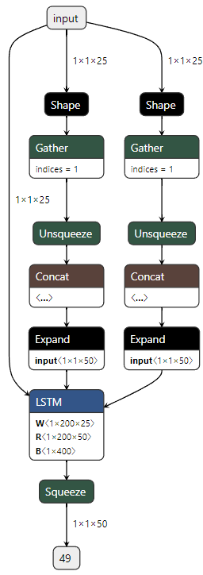

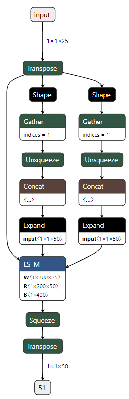

두 그래프의 뼈대는 같다. 입력이 두 갈래의 Shape-Gather-Unsqueeze-Concat-Expand 를 거치는 것은 batch 크기에 맞춰 초기 상태 $h_0$, $c_0$ (1 x 1 x 50) 를 만드는 과정이고, 그 둘과 입력이 LSTM 노드로 들어간 뒤 Squeeze 로 불필요한 축을 없앤다. 차이는 `batch_first=True` 쪽에 **Transpose 가 앞뒤로 하나씩 추가된** 것이다. PyTorch 의 LSTM 연산은 (seq, batch, feature) 순서로 동작하므로, (batch, seq, feature) 로 들어온 입력의 축 순서 (1, 2, 3) 을 (2, 1, 3) 으로 바꿔서 넣고 출력에서 다시 되돌린다. 그런데도 `batch_first=True` 를 쓰는 이유는 TensorFlow 와 data 처리를 통일하기 위해서다. TensorFlow 의 RNN 층은 (samples, timesteps, features) 순서를 기본으로 받으므로, 같은 dataset 코드를 두 프레임워크에서 그대로 쓸 수 있다.

**W · R · B — LSTM 노드의 가중치**

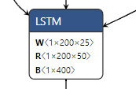

Netron 의 LSTM 노드에 적힌 세 가중치는 PyTorch 의 파라미터와 다음처럼 대응한다.

- **W** = `weight_ih` — 입력에서 hidden 으로 가는 가중치, 1 x 200 x 25
- **R** = `weight_hh` — hidden 에서 hidden 으로 되돌아가는 순환 가중치, 1 x 200 x 50
- **B** = bias — 1 x 400. `bias_ih`(200) 과 `bias_hh`(200) 를 이어 붙인 크기다.

맨 앞의 1 은 방향 수다. 5.2.11 의 Bidirectional LSTM 에서는 이 자리가 2 가 된다. PyTorch 쪽에서는 `all_weights` 로 같은 것을 볼 수 있다.

```python
for w in model.lstm.all_weights[0]:
  print(f"{type(w)}:{w.shape}")
# torch.Size([200, 25]) : lstm.weight_ih_l0 (4*units, features)
# torch.Size([200, 50]) : lstm.weight_hh_l0 (4*units, units)
# torch.Size([200])     : lstm.bias_ih_l0   (4*units)
# torch.Size([200])     : lstm.bias_hh_l0
```

**LSTM 의 파라미터 수**

네 텐서의 원소 수를 더하면 파라미터 수가 나온다. $X_n$ 을 입력 feature 수, $H_n$ 을 hidden(units) 수라 하면

$$
P_{LSTM} = \left( (X_n + H_n + 2) \times H_n \right) \times 4
= (25 + 50 + 2) \times 50 \times 4 = 15{,}400
$$

이다. 괄호 안의 $X_n$ 은 `weight_ih` 의 열, $H_n$ 은 `weight_hh` 의 열, 2 는 두 개의 bias 에 해당하고, 여기에 gate 하나의 출력 수 $H_n$ 을 곱한 뒤 gate 네 개만큼 4 를 곱한다. 실제로 200 x 25 + 200 x 50 + 200 + 200 = 15,400 으로 summary 의 값과 같다.

| Layer (type:depth-idx) | Output Shape | Param # |
|---|---|---|
| ├─LSTM: 1-1 | [1, 1, 50] | 15,400 |

**proj_size 의 역할과 파라미터 변화**

같은 모델에 `proj_size=4` 만 추가하면 파라미터가 어떻게 바뀌는지 본다.

```python
########## one to one model ##########
# time step이 1인 경우
class OneToOneLSTM(nn.Module):
    def __init__(self, features, units, batch_first=False):
        super(OneToOneLSTM, self).__init__()
        self.lstm = nn.LSTM(input_size=features,
                            hidden_size=units, proj_size=4,
                            batch_first=batch_first)
    def forward(self, x):
        out, (hn, cn) = self.lstm(x)
        return out

model = OneToOneLSTM(features, units, batch_first=True)
summary(model, input_size=(1, 1, features))
```

| Layer (type:depth-idx) | Output Shape | Param # |
|---|---|---|
| OneToOneLSTM | [1, 1, 4] | -- |
| ├─LSTM: 1-1 | [1, 1, 4] | 6,400 |
| Total params | | 6,400 |

```python
input_1 = torch.randn(1, 1, features)
output = model(input_1)
ps(output) #(1,1,4)
```

```python
for w in model.lstm.all_weights[0]: # [[200, 25],[200, 4],[200],[200],[4, 50]]
  print(w.shape)
# torch.Size([200, 25]) : lstm.weight_ih_l0 (4*units,features)  200<-25
# torch.Size([200, 4])  : lstm.weight_hh_l0 (4*units,projection)200<-4
# torch.Size([200])     : lstm.bias_ih_l0   (4*units)
# torch.Size([200])     : lstm.bias_hh_l0
## projection param. 추가
# torch.Size([4, 50])   : lstm.weight_hr_l0 (projection,units)   4<-50
```

가중치가 다섯 개가 되었다. `weight_hh_l0` 의 열이 50 에서 4 로 줄고, hidden 50 을 4 로 투영하는 `weight_hr_l0` (4, 50) 이 추가되었다. 출력도 (1, 1, 4) 로 바뀐다. 파라미터 수는 $P_n$ 을 `proj_size` 라 할 때

$$
P_{LSTM}^{proj} = \left( (X_n + P_n + 2) \times H_n \right) \times 4 + H_n \times P_n
= (25 + 4 + 2) \times 50 \times 4 + 50 \times 4 = 6{,}400
$$

이다. 앞 항은 순환 가중치의 열이 $H_n$ 에서 $P_n$ 으로 줄어든 LSTM 본체, 뒤 항은 투영 행렬이다. 15,400 개가 6,400 개로 줄었다.

Projection 의 장점은 두 가지다.

- **유연성** — 출력 크기를 조정하여 다음 계층에 맞는 출력 크기를 제공한다.
- **Overfitting 방지** — 불필요하게 큰 출력 크기를 줄여 모델의 과적합을 막는다.

---

## 5.2.5 Many to many 와 Many to one
<!-- 슬라이드 432~434 -->

**Many to many 구조**

Many to many 는 시계열 또는 시퀀스 데이터를 처리하는 기본 모델이다. Data shape 은 (samples, timesteps, features) 이다. 원문은 이 shape 을 다음 예로 그려 보인다.

| 축 | 크기 | 뜻 |
|---|---|---|
| samples | 507 | 시퀀스 샘플의 수 |
| time_steps | 7 | 샘플 하나에 든 시점의 수 (D1 \~ D7) |
| features | 5 | 시점 하나의 관측값 (o, h, l, v, c) |

시점 하나마다 다섯 개의 값(o, h, l, v, c)이 있고, 그런 시점 7 개(D1 \~ D7)가 한 샘플을 이루며, 그 샘플이 507 개 쌓여 있는 3 차원 텐서다. 기본 코드는 one to one 과 완전히 같다. 다만 입력의 timesteps 가 1 이 아니므로, LSTM 셀이 각 time step 에서 실행되고 time step 마다 출력이 생긴다.

```python
########## many to many ##########
class ManyToManyLSTM(nn.Module):
    def __init__(self, features, units, batch_first=True):
        super(ManyToManyLSTM, self).__init__()
        self.lstm = nn.LSTM(input_size=features,
                            hidden_size=units,
                            batch_first=batch_first)
    def forward(self, x):
        out, (hn, cn) = self.lstm(x)
        return out

model = ManyToManyLSTM(features, units)
summary(model, input_size=(2, timesteps, features))
```

```python
inputs = torch.randn(2, timesteps, features)
output = model(inputs)
output.shape #(2,7,50)
```

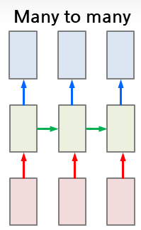

**OneToOne 과 ManyToMany 의 비교**

입력 (1, 1, 25) 을 넣은 OneToOne 과 (2, 7, 25) 를 넣은 ManyToMany 를 나란히 놓으면 출력은 (1, 1, 50) 과 (2, 7, 50) 으로 다르지만, 구조도와 파라미터 수는 같다.

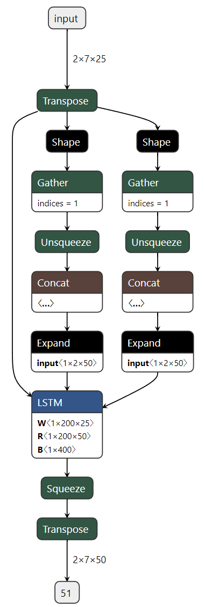

| ManyToManyLSTM | Output Shape | Param # |
|---|---|---|
| ├─LSTM: 1-1 | [2, 7, 50] | 15,400 |
| Total params | | 15,400 |
| Trainable params | | 15,400 |
| Non-trainable params | | 0 |
| Total mult-adds (M) | | 0.22 |

| OneToOneLSTM | Output Shape | Param # |
|---|---|---|
| ├─LSTM: 1-1 | [1, 1, 50] | 15,400 |
| Total params | | 15,400 |
| Total mult-adds (M) | | 0.02 |

파라미터 수는 (25 + 50 + 2) x 50 x 4 = 15,400 으로 동일하다. 구조가 동일하기 때문이다. LSTM 의 파라미터 수는 timesteps 나 batch 크기와 무관하게 `input_size` 와 `hidden_size` 만으로 정해진다. 반면 연산량(Total mult-adds)은 0.02 M 에서 0.22 M 으로 늘어난다. 같은 셀을 7 개 time step 에 대해, 2 개 샘플에 대해 반복 실행하므로 동작은 다르다.

**Many to one 구조**

Many to one 은 many to many 와 같은 LSTM 을 두고 **후처리에서 마지막 출력값만 취하는** 구조다.

```python
########## many to one ##########
class ManyToOneLSTM(nn.Module):
    def __init__(self, features, units):
        super(ManyToOneLSTM, self).__init__()
        self.lstm = nn.LSTM(input_size=features, hidden_size=units)

    def forward(self, x):
        out, (hn, cn) = self.lstm(x) #(2,7,50)
        return out[:, -1, :] #(2,50)

model = ManyToOneLSTM(features, units)
summary(model, input_size=(2, timesteps, features))
```

```python
inputs = torch.randn(2, timesteps, features)
output = model(inputs)
output.shape #(2,50)
```

`forward()` 가 `out[:, -1, :]` 로 출력 텐서의 두 번째 축에서 마지막 원소를 골라낸다. (samples, timesteps, units) 로 배열된 출력이라면 이것이 마지막 time step 의 hidden state 이고, 그 결과 (2, 7, 50) 이 (2, 50) 으로 줄어든다.

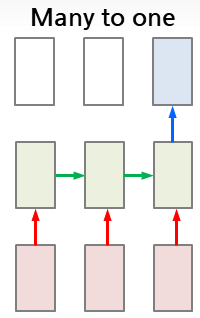

| ManyToOneLSTM | Output Shape | Param # |
|---|---|---|
| ├─LSTM: 1-1 | [2, 7, 50] | 15,400 |
| Total params | | 15,400 |
| Total mult-adds (M) | | 0.22 |

Summary 를 비교하면 파라미터 수 15,400, LSTM 층의 출력 shape [2, 7, 50], 연산량 0.22 M 이 many to many 와 모두 동일하다. 구조는 같고 마지막에 무엇을 취하느냐만 다르기 때문이다.

---

## 5.2.6 TimeDistributed — 명시적 · 묵시적
<!-- 슬라이드 435~439 -->

**TimeDistributed wrapper**

Many to many 모델은 보통 LSTM 뒤에 time step 마다 출력을 만드는 층을 둔다. `TimeDistributed(layer)` 는 감싼 layer 를 **각 time step 에 따로 적용**시키는 wrapper 다. 그림처럼 25 차원 입력이 LSTM 을 거쳐 50 차원이 되고, 7 개 time step 각각에 같은 Dense 층이 적용되어 1 차원 출력이 나온다.

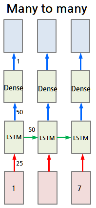

PyTorch 에는 이런 wrapper 가 내장되어 있지 않으므로 직접 만든다. 아래가 명시적(explicit) TimeDistributed 모듈이다.

```python
########## many to many : TimeDistributed-1 ##########

## Explicit TimeDistrbuted module ##
class TimeDistributed(nn.Module):
    def __init__(self, module, batch_first=False):
        super(TimeDistributed, self).__init__()
        self.module = module
        self.batch_first = batch_first
    def forward(self, x):
        if len(x.size()) <= 2:
            return self.module(x)
        y = self.module(x[:,0,:]).reshape(x.size(0),1,-1) #(2,1,1)
        for i in range(x.size()[1]-1): #(2,7,1) <- cat((2,1,1),dim=1)
          y = torch.cat((y,self.module(x[:,i+1,:]).\
                         reshape(x.size(0),1,-1)),dim=1)
        if not  self.batch_first:
            y = y.transpose(0,1).contiguous() #(7,2,1)
        return y
```

`forward()` 의 흐름은 이렇다. 입력이 2 차원 이하이면 time 축이 없으므로 module 을 그대로 적용한다. 3 차원이면 먼저 첫 time step `x[:, 0, :]` 에 module 을 적용하고 결과를 (batch, 1, -1) 로 만든 뒤, 나머지 time step 을 for 문으로 돌면서 같은 module 의 결과를 time 축(dim=1)으로 이어 붙인다. (2, 1, 1) 이 7 번 쌓여 (2, 7, 1) 이 된다. `batch_first=False` 로 만든 경우에는 마지막에 `transpose(0, 1)` 로 (7, 2, 1) 로 바꾼다. 노트북에는 for 문을 없애고 (B x T, F) 로 펼쳐 한 번에 처리하는 `TimeDistributed2` 판도 있다.

**Transpose 와 contiguous**

Transpose 는 메모리 배치를 바꾸지 않고 축의 순서만 바꾸므로 결과가 non-contiguous tensor 가 된다. `view()` 는 contiguous tensor 에서만 동작하므로, 필요할 때 `.contiguous()` 로 메모리를 재배열한 뒤 써야 한다. 위 코드의 `transpose(0,1).contiguous()` 가 그 처리다.

```python
## contiguous vs. non-contiguous tensor
import numpy as np
a = torch.tensor(np.arange(12).reshape(3,4))
at = a.T

if at.is_contiguous() : print("contiguous")
else : print("non-contiguous")

## error!! non-contiguous tensor
#av = at.view(3,4)
acv = at.contiguous().view(3,4)
```

**Many to many (TimeDistributed)**

TimeDistributed 로 `nn.Linear(units, 1)` 을 감싸 LSTM 뒤에 붙인다.

```python
batch_size = 2
inputs = torch.randn(batch_size, timesteps, features)

class ManyToMany(nn.Module):
    def __init__(self, features, units, batch_first=True):
        super(ManyToMany, self).__init__()
        self.lstm = nn.LSTM(features, units, batch_first=batch_first)
        self.timeDistributed = TimeDistributed(nn.Linear(units, 1),
                                               batch_first=batch_first)

    def forward(self, x):
        output, (h_T, c_T) = self.lstm(x) #(2,7,50)
        y = self.timeDistributed(output)  #(2,7,1)
        return y

model = ManyToMany(features, units)
whole_seq_output = model(inputs) #(2,7,1)<-(2,7,25)

summary(model, input_size=(batch_size, timesteps, features))
```

여기서 Linear layer 의 파라미터 수를 세어 본다. 입력 수 in 에 bias 1 을 더한 것에 출력 수 out 을 곱하면 되므로

$$
P_{Linear} = (\text{in} + 1) \times \text{out} = (50 + 1) \times 1 = 51
$$

이다. Summary 는 TimeDistributed 안의 같은 Linear 가 time step 마다 다시 쓰였다는 뜻으로 `(recursive)` 를 표시한다.

| ManyToMany | Output Shape | Param # |
|---|---|---|
| ├─LSTM: 1-1 | [2, 7, 50] | 15,400 |
| ├─TimeDistributed: 1-2 | [2, 7, 1] | -- |
| │    └─Linear: 2-1 | [2, 1] | 51 |
| │    └─Linear: 2-2 \~ 2-7 | [2, 1] | (recursive) |

구조도를 그려 보면 for 문이 무엇을 만드는지 보인다. LSTM 노드 아래에서 그래프가 time step 수만큼의 가지로 갈라지고, 각 가지가 같은 Linear 를 적용한 뒤 Concat 으로 다시 합쳐진다.

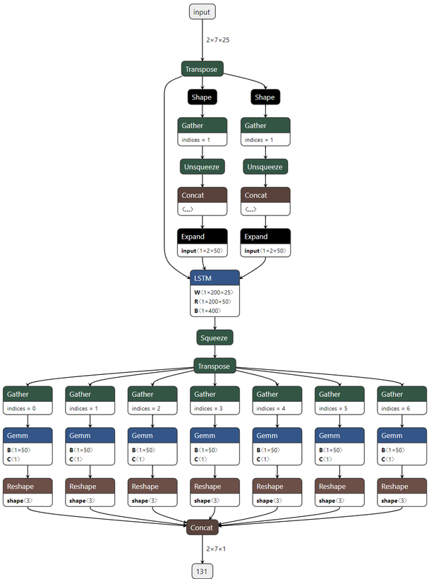

**Many to many (Implicit TimeDistributed)**

사실 PyTorch 에서는 wrapper 없이도 같은 결과가 나온다. `nn.Linear` 는 입력의 **마지막 축**에만 작용하고 앞의 축들은 그대로 두므로, (2, 7, 50) 을 넣으면 (2, 7, 1) 이 나온다. 즉 **LSTM layer 다음에 있는 linear layer 는 묵시적으로 time distributed 동작을 수행**한다.

```python
class ManyToMany(nn.Module):
    def __init__(self, features, units, batch_first=True):
        super(ManyToMany, self).__init__()
        self.lstm = nn.LSTM(features, units, batch_first=batch_first)
        self.linear = nn.Linear(units, 1)

    def forward(self, x):
        output, (h_T, c_T) = self.lstm(x) #(2,7,50)
        y = self.linear(output)  #(2,7,1)
        return y

model = ManyToMany(features, units)
whole_seq_output = model(inputs) #(2,7,1)<-(2,7,25)

summary(model, input_size=(batch_size, timesteps, features))
```

**LSTM 앞과 뒤의 Linear**

LSTM 앞에도 Linear 를 둘 수 있다. 그림처럼 입력 25 차원을 Dense 로 한 번 변환하고(25 차원 유지), LSTM(50) 을 거친 뒤, 다시 Dense 로 1 차원 출력을 낸다.

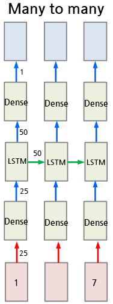

먼저 앞의 Linear 만 명시적 TimeDistributed 로 감싸고 뒤의 Linear 는 그대로 둔 판이다.

```python
########## many to many : TimeDistributed-2 ##########
class ManyToMany(nn.Module):
    def __init__(self, features, units, batch_first=True):
        super(ManyToMany, self).__init__()
        self.timeDistributed = TimeDistributed(nn.Linear(features, features),
                                               batch_first=batch_first)
        self.lstm = nn.LSTM(features, units, batch_first=batch_first)
        self.linear = nn.Linear(units,1)

    def forward(self, x):
        output = self.timeDistributed(x)  #(2,7,25)<-(2,7,25)
        output, (h_T, c_T) = self.lstm(output) #(2,7,50)
        output = self.linear(output) #(2,7,1)
        return output

model = ManyToMany(features, units)
whole_seq_output = model(inputs) #(2,7,1)<-(2,7,25)

summary(model, input_size=(batch_size, timesteps, features))
```

| ManyToMany | Output Shape | Param # |
|---|---|---|
| ├─TimeDistributed: 1-1 | [2, 7, 25] | -- |
| │    └─Linear: 2-1 | [2, 25] | 650 |
| │    └─Linear: 2-2 \~ 2-7 | [2, 25] | (recursive) |
| ├─LSTM: 1-2 | [2, 7, 50] | 15,400 |
| ├─Linear: 1-3 | [2, 7, 1] | 51 |
| Total params | | 16,101 |

앞 Linear 의 파라미터는 (25 + 1) x 25 = 650 이고, 전체는 650 + 15,400 + 51 = 16,101 이다. 이번에는 앞뒤 Linear 를 모두 wrapper 없이 둔다.

```python
class ManyToMany(nn.Module):
    def __init__(self, features, units, batch_first=True):
        super(ManyToMany, self).__init__()
        self.linear1 = nn.Linear(features, features)
        self.lstm = nn.LSTM(features, units, batch_first=batch_first)
        self.linear2 = nn.Linear(units,1)

    def forward(self, x):
        output = self.linear1(x)  #(2,7,25)<-(2,7,25)
        output, (h_T, c_T) = self.lstm(output) #(2,7,50)
        output = self.linear2(output) #(2,7,1)
        return output

model = ManyToMany(features, units)
whole_seq_output = model(inputs) #(2,7,1)<-(2,7,25)

summary(model, input_size=(batch_size, timesteps, features))
```

| ManyToMany | Output Shape | Param # |
|---|---|---|
| ├─Linear: 1-1 | [2, 7, 25] | 650 |
| ├─LSTM: 1-2 | [2, 7, 50] | 15,400 |
| ├─Linear: 1-3 | [2, 7, 1] | 51 |
| Total params | | 16,101 |

출력 shape 과 파라미터 수 16,101 이 앞의 것과 같다. **LSTM layer 전, 후에 있는 linear layer 는 모두 묵시적으로 time distributed 동작을 수행**한다. 이후의 코드는 이 사실을 이용해 wrapper 없이 Linear 를 바로 쓴다.

---

## 5.2.7 LSTM AutoEncoder 와 torch.repeat()
<!-- 슬라이드 440 -->

LSTM AutoEncoder 는 **입력 시퀀스와 출력 시퀀스가 동일하도록 학습**하는 many to many 구조다. 인코더 LSTM 이 7 step 의 입력을 읽고, 그 **마지막 출력 하나만** 남긴다(그림에서 앞쪽 출력에 X 표시). 이 벡터를 디코더의 7 개 time step 에 똑같이 복사(copy)해 넣고, 디코더 LSTM 이 다시 7 step 의 시퀀스를 만들어 낸다.

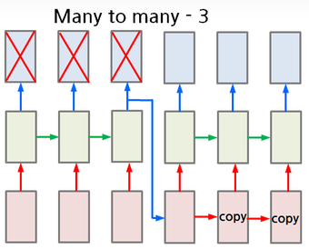

복사에는 `torch.repeat()` 을 쓴다. `tensor.repeat(1, timesteps, 1)` 은 텐서를 두 번째 축 방향으로 timesteps 번 반복해 붙인다.

```python
########### LSTM AutoEncoder ############
latent_dim = 4
class Many2ManyRepeated(nn.Module):
    def __init__(self, features, latent_dim, batch_first=True):
        super(Many2ManyRepeated, self).__init__()
        self.encoder = nn.LSTM(features, latent_dim,
                               batch_first=batch_first)
        self.decoder = nn.LSTM(latent_dim, features,
                               batch_first=batch_first)
    def forward(self, x):
        encoded, _ = self.encoder(x) #(2,7,4)<-(2,7,25)
        decoder_input = encoded[:, -1:, :].repeat(1, timesteps, 1) #(2,7,4)<(2,1,4)
        decoded, _ = self.decoder(decoder_input) #(2,7,25)<-(2,7,4)
        return decoded

model = Many2ManyRepeated(features, latent_dim)
output = model(inputs) #(2,7,25) <- (2,7,25)

summary(model, input_size=(batch_size, timesteps, features))
```

인코더는 25 차원 입력을 `latent_dim=4` 차원으로 압축하고, `encoded[:, -1:, :]` 가 마지막 time step 만 남겨 (2, 1, 4) 를 만든다. `-1` 이 아니라 `-1:` 로 슬라이스한 것은 time 축을 없애지 않고 길이 1 로 유지하기 위해서다. `repeat(1, timesteps, 1)` 로 (2, 7, 4) 가 되고, 디코더 LSTM(4 → 25) 이 이를 (2, 7, 25) 로 되돌린다. 입력과 같은 shape 이므로 입력 자체를 정답으로 두고 학습할 수 있다.

| Many2ManyRepeated | Output Shape | Param # |
|---|---|---|
| ├─LSTM: 1-1 | [2, 7, 4] | 496 |
| ├─LSTM: 1-2 | [2, 7, 25] | 3,100 |

파라미터 수도 5.2.4 의 공식으로 확인된다. 인코더는 (25 + 4 + 2) x 4 x 4 = 496, 디코더는 (4 + 25 + 2) x 25 x 4 = 3,100 이다.

노트북에는 개선판도 있다. 인코더의 마지막 출력만 복사하는 대신 **인코더의 최종 상태 `(h_n, c_n)` 을 디코더의 초기 상태로 넘기고**, 디코더는 latent 차원을 유지한 채 Linear 로 feature 수를 복원한다. 5.2.12 의 seq2seq 가 쓰는 방식과 같다.

```python
########### LSTM AutoEncoder 개선 ############
## encoder 마지막 state를 deocer 초기 state로 전달
class Many2ManyRepeated(nn.Module):
    def __init__(self, features, latent_dim, batch_first=True):
        super(Many2ManyRepeated, self).__init__()
        self.encoder = nn.LSTM(features, latent_dim,
                               batch_first=batch_first)
        self.decoder = nn.LSTM(latent_dim, latent_dim,
                               batch_first=batch_first)
        self.output_layer = nn.Linear(latent_dim, features)

    def forward(self, x):
        encoded, (h_n, c_n) = self.encoder(x)
        decoder_hidden = (h_n, c_n) # Decoder 초기 상태 <= Encoder 최종 상태
        decoder_input = encoded[:, -1:, :].repeat(1, timesteps, 1) #(2,7,4)<(2,1,4)
        decoded, _ = self.decoder(decoder_input, decoder_hidden)   #(2,7,4)<-
        recon = self.output_layer(decoded)  # (2,7,25)
        return recon
```

---

## 5.2.8 레이어를 중심으로 본 RNN 구조
<!-- 슬라이드 441 -->

입출력 형태가 아니라 **레이어를 어떻게 배치하느냐**로 RNN 구조를 나눌 수도 있다. 원문은 다섯 가지를 든다.

**Stacking RNN** — RNN 층을 위아래로 여러 겹 쌓는다. 아래층의 time step 별 출력이 위층의 입력이 된다.

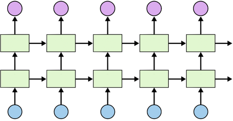

**Bidirectional RNN** — 정방향 셀 A 와 역방향 셀 A' 가 같은 입력 $x_t$ 를 서로 반대 방향으로 읽고, 두 출력을 합쳐 $y_t$ 를 만든다.

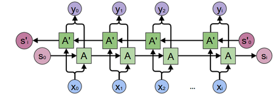

**Residual LSTM** — LSTM 층의 출력에 그 층의 입력을 더해 다음 층으로 넘긴다. 4 장의 ResNet 과 같은 발상이다.

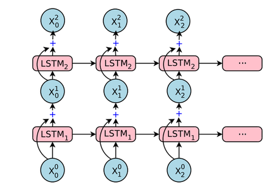

**Dense LSTM** — 각 LSTM 층의 출력이 바로 위층뿐 아니라 뒤따르는 모든 층과 출력층에 연결된다.

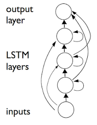

**Skip connection LSTM** — bLSTM 1 부터 M 까지 쌓되, 각 층의 출력을 건너뛰어 마지막 Concat 으로 모아 출력을 만든다.

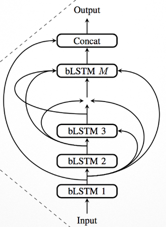

아래 소절에서는 이 가운데 Parallel LSTM · Stacked LSTM · Bidirectional LSTM 을 코드로 만든다.

---

## 5.2.9 Parallel LSTM
<!-- 슬라이드 442~443 -->

Parallel LSTM 은 레이어를 **수평으로 확장**한 구조다. 입력 data 의 특성이 서로 다를 때, 특성별로 따로 LSTM 을 두고 그 출력을 합친다. 원문이 드는 경우는 다음과 같다.

- 서로 다른 장비 신호 — 주기성 신호와 spike 신호
- 온도·습도 같은 환경 센서 데이터와 가속도 같은 움직임 센서 데이터
- Audio 신호를 주파수 대역별로 분리한 것
- 부하·진동 데이터를 받아서 수명을 예측하는 경우

이런 구성은 두 가지 이름으로도 불린다. **Multi-Task Learning** 은 단일 입력에서 여러 출력을 내는 모델이다(단일 입력에서 고장 예측과 잔여 수명을 함께 내는 식). **Multimodal(Multi-Source)** 은 여러 특성의 입력을 각각 처리해서 결합하는 모델이다. Parallel LSTM 은 후자에 해당한다.

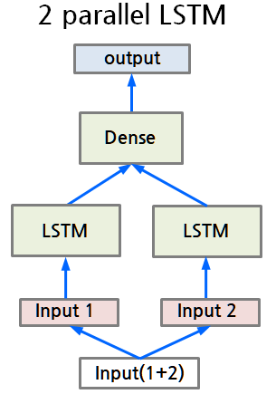

코드는 20 개 feature 를 앞 10 개와 뒤 10 개로 나누어 두 LSTM 에 넣고, 출력을 마지막 축으로 이어 붙인 뒤 Linear 로 6 차원 출력을 만든다.

```python
features = 20
L_units = 6

class ParallelLSTM(nn.Module):
    def __init__(self, features, units, l_units, batch_first=True):
        super(ParallelLSTM, self).__init__()
        self.lstm1 = nn.LSTM(int(features/2), units,
                             batch_first=batch_first)
        self.lstm2 = nn.LSTM(int(features/2), units,
                             batch_first=batch_first)
        self.linear = nn.Linear(units*2, l_units)

    def forward(self, x):
        input1 = x[:, :, :int(features/2)] #(2,7,10)
        input2 = x[:, :, int(features/2):] #(2,7,10)

        output1, _ = self.lstm1(input1)    #(2,7,50)
        output2, _ = self.lstm2(input2)    #(2,7,50)
        concat = torch.cat([output1, output2], dim=-1)#(2,7,100)

        output = self.linear(concat) #(2,7,6)<-(2,7,100)
        output = torch.tanh(output)
        return output

inputs = torch.randn(batch_size, timesteps, features)

model = ParallelLSTM(features, units, L_units)
output = model(inputs) #(2,7,6)<-(2,7,20)

summary(model, input_size=(batch_size, timesteps, features))
```

`forward()` 에서 feature 축을 슬라이스해 `input1`, `input2` (각 (2, 7, 10)) 를 만들고, 각 LSTM 의 출력 (2, 7, 50) 둘을 `torch.cat(..., dim=-1)` 로 (2, 7, 100) 으로 합친다. `nn.Linear(units*2, l_units)` 의 입력 수가 100 인 이유다. 마지막에 `tanh` 를 씌운다.

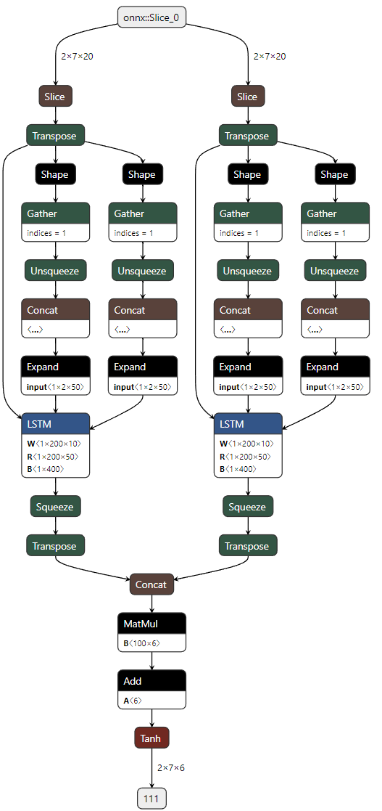

| ParallelLSTM | Output Shape | Param # |
|---|---|---|
| ├─LSTM: 1-1 | [2, 7, 50] | 12,400 |
| ├─LSTM: 1-2 | [2, 7, 50] | 12,400 |
| ├─Linear: 1-3 | [2, 7, 6] | 606 |
| Total params | | 25,406 |
| Total mult-adds (M) | | 0.35 |

구조도의 두 갈래가 코드의 `lstm1`, `lstm2` 이고, Slice 가 feature 축 슬라이스다. 각 LSTM 의 W 가 1 x 200 x 10 으로 입력이 10 차원임을 보여 준다. 파라미터는 LSTM 하나가 (10 + 50 + 2) x 50 x 4 = 12,400, Linear 가 (100 + 1) x 6 = 606 으로 합계 25,406 이다.

---

## 5.2.10 Stacked LSTM
<!-- 슬라이드 444~446 -->

Stacked LSTM 은 LSTM 층을 **수직으로** 쌓은 구조다. 그림처럼 입력 1 부터 7 이 첫 LSTM 줄을 지나고, 그 time step 별 출력이 둘째 LSTM 줄의 입력이 되며, 마지막에 Dense 가 출력을 만든다.

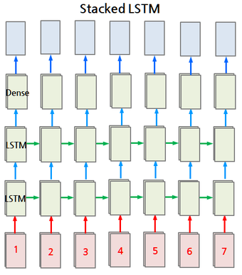

**Stacked LSTM-1 — 층을 따로 두 개 만들기**

```python
features = 20
inputs = torch.randn(batch_size,timesteps,features)
```

```python
##### Stacked LSTM-1 #####
class StackedLSTM(nn.Module):
    def __init__(self, features, units, batch_first=True):
        super(StackedLSTM, self).__init__()
        self.lstm1 = nn.LSTM(features, units,
                             batch_first=batch_first)
        self.lstm2 = nn.LSTM(units, units,
                             batch_first=batch_first)
        self.linear = nn.Linear(units, 1)

    def forward(self, x):
        x, _ = self.lstm1(x)   #(2,7,50)
        x = torch.relu(x)
        x, _ = self.lstm2(x)   #(2,7,50)
        x = torch.relu(x)
        output = self.linear(x)#(2,7,1)
        return output


model = StackedLSTM(features, units)
output = model(inputs) #(2,7,1)

summary(model, input_size=(batch_size, timesteps, features))
```

`lstm1` 은 20 차원 feature 를 받고, `lstm2` 는 `lstm1` 의 출력 50 차원을 받으므로 `input_size` 가 `units` 다. 두 LSTM 의 출력이 모두 (2, 7, 50) 인 many to many 이고, 층 사이에 `relu` 를 끼웠다.

| StackedLSTM | Output Shape | Param # |
|---|---|---|
| ├─LSTM: 1-1 | [2, 7, 50] | 14,400 |
| ├─LSTM: 1-2 | [2, 7, 50] | 20,400 |
| ├─Linear: 1-3 | [2, 7, 1] | 51 |
| Total params | | 34,851 |
| Total mult-adds (M) | | 0.49 |

첫 LSTM 은 (20 + 50 + 2) x 50 x 4 = 14,400, 둘째 LSTM 은 입력이 50 차원이라 (50 + 50 + 2) x 50 x 4 = 20,400 이다.

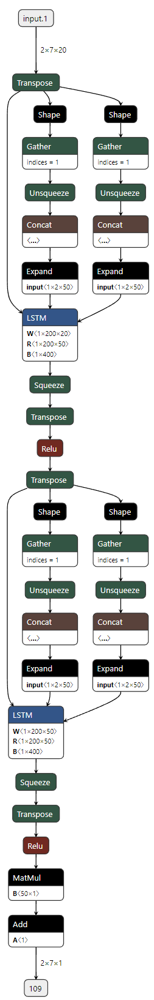

구조도에는 LSTM 노드가 두 개 있고, 각 노드 앞에 초기 상태를 만드는 가지와 Transpose 가 따로 붙어 있다. 첫 LSTM 의 W 는 1 x 200 x 20, 둘째 LSTM 의 W 는 1 x 200 x 50 이다. 두 LSTM 사이에 Relu 노드가 보인다.

**Stacked LSTM-2 — num_layers 로 쌓기**

같은 구조를 `nn.LSTM` 의 `num_layers=2` 인자로도 만들 수 있다. 이때 `dropout=0.2` 는 마지막 층을 제외한 각 층의 time step 별 출력 (7, 50) 에 적용된다.

```python
##### Stacked LSTM-2 #####
## dropout=0.2 : 각 시점의 출력(7,50)에 적용,마지막 layer는 제외
class StackedLSTM(nn.Module):
    def __init__(self, features, units, batch_first=True):
        super(StackedLSTM, self).__init__()
        self.lstm1 = nn.LSTM(features, units,
                             num_layers=2, #####
                             dropout=0.2,  #####
                             batch_first=batch_first)
        self.linear = nn.Linear(units, 1)

    def forward(self, x):
        x, _ = self.lstm1(x)
        x = torch.relu(x)
        output = self.linear(x)
        return output

model = StackedLSTM(features, units)
output = model(inputs)

summary(model, input_size=(batch_size, timesteps, features))
```

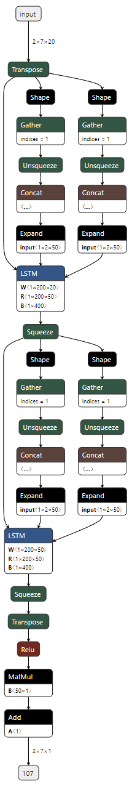

| StackedLSTM | Output Shape | Param # |
|---|---|---|
| ├─LSTM: 1-1 | [2, 7, 50] | 34,800 |
| ├─Linear: 1-2 | [2, 7, 1] | 51 |
| Total params | | 34,851 |
| Total mult-adds (M) | | 0.49 |

Summary 에는 LSTM 이 한 층으로 보이지만 파라미터 수 34,800 은 14,400 + 20,400 과 같고, 전체 34,851 과 연산량 0.49 M 도 Stacked LSTM-1 과 **동일하다**. 구조도에서도 LSTM 노드가 두 개 나타난다. 다른 점은 두 LSTM 사이에 Relu 가 없다는 것이다. `num_layers` 로 쌓으면 층 사이에는 dropout 만 들어가고 활성화 함수를 끼울 자리가 없다. 층 사이에 무언가를 넣고 싶으면 Stacked LSTM-1 처럼 따로 만든다. 노트북에는 `proj_size` 로 파라미터를 줄인 판과 `LayerNorm` 을 넣은 판(Stacked LSTM-3, 4)도 있다.

---

## 5.2.11 Bidirectional LSTM
<!-- 슬라이드 447~448 -->

`bidirectional=True` option 은 RNN layer 를 **양방향 레이어**로 구성한다. RNN 이 과거로부터 현재까지의 정보로 미래를 예측하는 데 더하여, 현재부터 과거로 거슬러 정보를 살펴서 미래를 예측하는 모델을 결합한 것이다. 그림에서 아래 LSTM 1 줄이 입력 1 부터 7 을 왼쪽에서 오른쪽으로 읽고, 위 LSTM 2 줄이 오른쪽에서 왼쪽으로 읽는다. 두 줄의 출력이 time step 마다 합쳐져 Dense 로 들어간다.

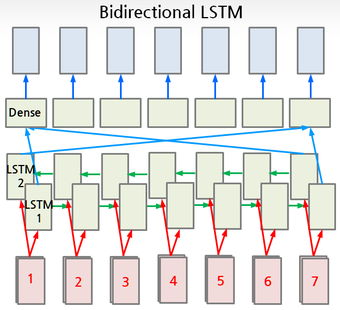

```python
##### Bidirectional LSTM #####
class BidirectionalLSTMManyToMany(nn.Module):
    def __init__(self, features, units, batch_first=True):
        super(BidirectionalLSTMManyToMany, self).__init__()
        self.biLstm = nn.LSTM(features, units,
                              bidirectional=True, ####
                              batch_first=batch_first)
        self.linear = nn.Linear(units*2, 1)

    def forward(self, x):
        out, (hn, cn) = self.biLstm(x)
        x = self.linear(out)            # (2,7,1)<-(2,7,100)
#        x = self.linear(out[:, -1, :]) #(2,1)<-(2,100)
        return x

model = BidirectionalLSTMManyToMany(features, units)
output = model(inputs)

summary(model, input_size=(batch_size, timesteps, features))
```

양방향이면 LSTM 의 출력이 정방향 50 과 역방향 50 을 이어 붙인 100 차원이 되므로 `nn.Linear(units*2, 1)` 로 받는다.

| BidirectionalLSTMManyToMany | Output Shape | Param # |
|---|---|---|
| ├─LSTM: 1-1 | [2, 7, 100] | 28,800 |
| ├─Linear: 1-2 | [2, 7, 1] | 101 |
| Total params | | 28,901 |
| Total mult-adds (M) | | 0.40 |

LSTM 의 파라미터 28,800 은 단방향 (20 + 50 + 2) x 50 x 4 = 14,400 의 두 배다. 정방향과 역방향이 각각 자기 가중치를 갖기 때문이다. Linear 는 (100 + 1) x 1 = 101 이다.

주석 처리된 줄 `self.linear(out[:, -1, :])` 을 대신 쓰면 many to one 이 된다. 마지막 time step 의 100 차원 출력만 Dense 에 넣어 (2, 1) 을 낸다.

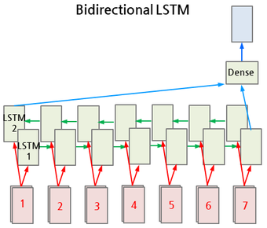

| BidirectionalLSTMManyToMany | Output Shape | Param # |
|---|---|---|
| ├─LSTM: 1-1 | [2, 7, 100] | 28,800 |
| ├─Linear: 1-2 | [2, 1] | 101 |

LSTM 층은 그대로이므로 파라미터 수는 같고 Linear 의 출력 shape 만 [2, 1] 로 바뀐다.

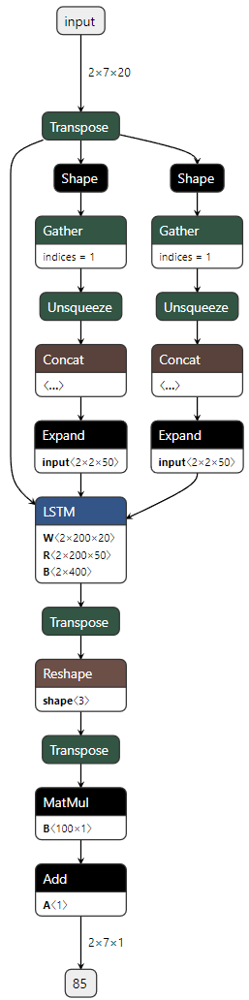

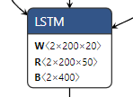

구조도에서 확인할 것은 LSTM 노드의 가중치 shape 이다. W 가 2 x 200 x 20, R 이 2 x 200 x 50, B 가 2 x 400 으로, 5.2.4 에서 1 이던 맨 앞 차원이 **2** 로 바뀌었다. 초기 상태를 만드는 Expand 의 크기도 2 x 2 x 50 이다. Netron 의 노드 속성(ATTRIBUTES) 창에도 direction 이 bidirectional, hidden_size 가 50 으로 표시된다. LSTM 뒤의 Transpose-Reshape-Transpose 는 두 방향의 출력을 100 차원 하나로 이어 붙이는 처리이고, 그 뒤 MatMul(B 100 x 1) 과 Add(A 1) 가 `nn.Linear(100, 1)` 이다.

---

## 5.2.12 Sequence to Sequence(seq2seq) 모델
<!-- 슬라이드 449 -->

Sequence to Sequence(seq2seq) 모델은 **(many to one) + (one to many)** 의 결합이다.

- 인코더(many to one)는 입력 시퀀스를 단일 벡터로 인코딩한다. 이 벡터는 LSTM 의 hidden state 와 cell state 다.
- 인코딩된 값을 디코더의 초기값 $h_0$ 에 전달한다.
- 디코더(one to many)는 단일 벡터를 출력 시퀀스로 디코딩한다. 이때 각 time step 의 출력을 **다음 time step 의 입력으로** 넣는다.

Language 모델에서 자주 쓰인다. 번역처럼 문장의 의미를 encoding 한 뒤 새로운 문장을 생성하는 일이 그렇다.

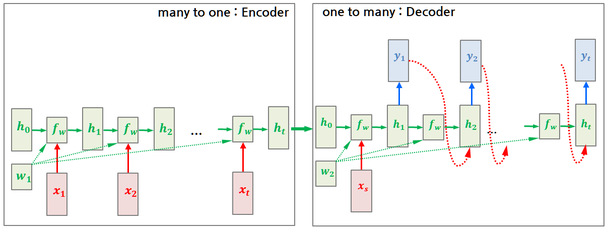

노트북에는 이 구조의 뼈대 코드가 있다. 인코더는 토큰을 임베딩해 LSTM 에 넣고 마지막 `(hidden, cell)` 만 돌려준다. 디코더는 토큰 하나를 받아 임베딩하고, 넘겨받은 `(hidden, cell)` 을 초기 상태로 LSTM 한 step 을 돌린 뒤 Linear 로 다음 토큰의 점수를 낸다. `Seq2Seq` 는 인코더의 상태를 디코더에 넘기고, 디코더가 낸 토큰 가운데 점수가 가장 큰 것(`argmax`)을 다음 입력으로 넣는 일을 `max_len` 번 반복한다.

```python
# 임의 설정값
INPUT_DIM = 1000   # 입력 vocabulary 크기
OUTPUT_DIM = 1000  # 출력 vocabulary 크기
EMB_DIM = 256      # 임베딩 차원
HID_DIM = 512      # LSTM 은닉 차원

# Encoder
class Encoder(nn.Module):
    def __init__(self, input_dim, emb_dim, hid_dim):
        super().__init__()
        self.embed = nn.Embedding(INPUT_DIM, EMB_DIM)
        self.lstm = nn.LSTM(emb_dim, hid_dim, batch_first=True)

    def forward(self, src):
        # src: [bs, src_len]
        embedded = self.embed(src)  # [bs, src_len, emb_dim]
        outputs, (hidden, cell) = self.lstm(embedded)  # outputs: [bs, src_len, hid_dim]
        return hidden, cell                       # hidden, cell: [1, bs, hid_dim]

# Decoder
class Decoder(nn.Module):
    def __init__(self, output_dim, emb_dim, hid_dim):
        super().__init__()
        self.embed = nn.Embedding(INPUT_DIM, EMB_DIM)
        self.lstm = nn.LSTM(emb_dim, hid_dim, batch_first=True)
        self.fc_out = nn.Linear(hid_dim, output_dim)

    def forward(self, input, hidden, cell):
        # input: [bs] -> 단일 토큰
        input = input.unsqueeze(1)                 # [bs, 1]
        embedded = self.embed(input)               # [bs, 1, emb_dim]
        output, (hidden, cell) = self.lstm(embedded, (hidden, cell))  # output: [bs, 1, hid_dim]
        prediction = self.fc_out(output.squeeze(1))  # [bs, output_dim]
        return prediction, hidden, cell

# Seq2Seq wrapper (for structural completeness)
class Seq2Seq(nn.Module):
    def __init__(self, encoder, decoder):
        super().__init__()
        self.encoder = encoder
        self.decoder = decoder

    def forward(self, src, trg_start, max_len):
        # src: [bs, src_len], trg_start: [sb]
        hidden, cell = self.encoder(src)
        inputs = trg_start
        outputs = []

        for _ in range(max_len):
            output, hidden, cell = self.decoder(inputs, hidden, cell)
            inputs = output.argmax(1)  # greedy decoding
            outputs.append(inputs.unsqueeze(1))
        return torch.cat(outputs, dim=1)  # [bs, max_len]
```

인코더가 `outputs` 를 버리고 `(hidden, cell)` 만 돌려주는 것이 many to one 이고, 디코더가 시작 토큰 하나에서 출발해 자기 출력을 되먹이며 시퀀스를 만드는 것이 one to many 다. 5.2.7 의 개선판 AutoEncoder 가 인코더 상태를 디코더 초기 상태로 넘긴 것과 같은 구조이며, 다른 점은 디코더 입력을 복사한 벡터가 아니라 직전 출력에서 가져온다는 것이다. 번역 예제 전체는 PyTorch 튜토리얼 <https://pytorch.org/tutorials/intermediate/seq2seq_translation_tutorial.html> 에 있다.

---

## 5.2.13 정리
<!-- 슬라이드 450 -->

- RNN 구조는 **입출력 형태**로 one to one · one to many · many to one · many to many(입력 후 출력 / 동기) 로 나뉜다. 코드로는 모두 같은 `nn.LSTM` 이고, 입력의 timesteps 와 출력 가운데 무엇을 취하느냐(`output` 전체인지 마지막 step 인지)만 다르다.
- `torch.nn.LSTM(input_size, hidden_size, num_layers, bias, batch_first, dropout, bidirectional, proj_size)` 는 `output, (h_n, c_n)` 을 돌려준다. `batch_first=True` 는 (samples, timesteps, features) 순서를 쓰기 위한 것이며 내부에서는 Transpose 가 앞뒤로 추가된다.
- LSTM 의 파라미터 수는 $((X_n + H_n + 2) \times H_n) \times 4$ 이고 timesteps·batch 와 무관하다. `proj_size` 를 주면 $((X_n + P_n + 2) \times H_n) \times 4 + H_n \times P_n$ 으로 줄어든다. Linear 는 $(\text{in} + 1) \times \text{out}$ 이다.
- PyTorch 의 `nn.Linear` 는 마지막 축에만 작용하므로 LSTM 앞뒤의 Linear 는 묵시적으로 time distributed 로 동작한다. 명시적 TimeDistributed 는 for 문으로 time step 마다 module 을 적용하며, transpose 뒤에는 `.contiguous()` 가 필요하다.
- LSTM AutoEncoder 는 인코더의 마지막 출력을 `repeat()` 으로 복사해 디코더에 넣고 입력을 재구성한다.
- **레이어 배치** 관점에서는 Parallel(수평 확장, 특성이 다른 입력) · Stacked(수직 확장, 따로 만들거나 `num_layers`) · Bidirectional(정방향 + 역방향, 출력 2 배) · seq2seq(many to one 인코더 + one to many 디코더) 가 있다.

이 절에서 만든 모델의 파라미터 수를 한 표로 모으면 다음과 같다. 모두 summary 에서 읽은 값이다.

| 모델 | 입력 shape | LSTM 파라미터 | 전체 파라미터 |
|---|---|---|---|
| OneToOneLSTM | (1, 1, 25) | 15,400 | 15,400 |
| OneToOneLSTM, proj_size=4 | (1, 1, 25) | 6,400 | 6,400 |
| ManyToManyLSTM / ManyToOneLSTM | (2, 7, 25) | 15,400 | 15,400 |
| ManyToMany + Linear(50, 1) | (2, 7, 25) | 15,400 | 15,400 + 51 |
| Linear(25, 25) + LSTM + Linear(50, 1) | (2, 7, 25) | 15,400 | 16,101 |
| Many2ManyRepeated (latent 4) | (2, 7, 25) | 496 + 3,100 | 496 + 3,100 |
| ParallelLSTM | (2, 7, 20) | 12,400 x 2 | 25,406 |
| StackedLSTM-1 / -2 | (2, 7, 20) | 14,400 + 20,400 | 34,851 |
| BidirectionalLSTMManyToMany | (2, 7, 20) | 28,800 | 28,901 |
