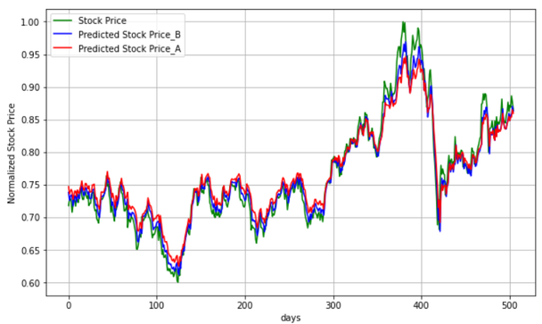
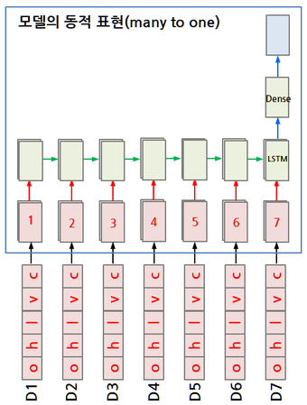
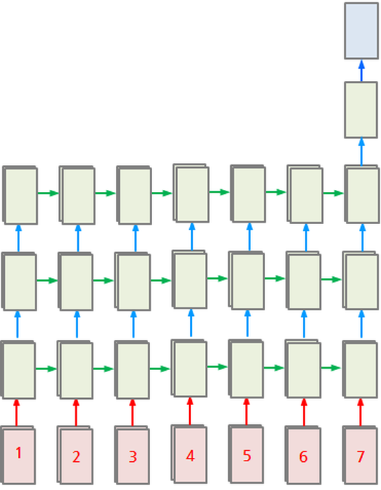
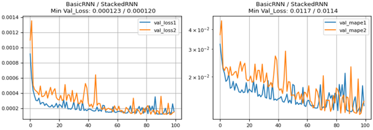
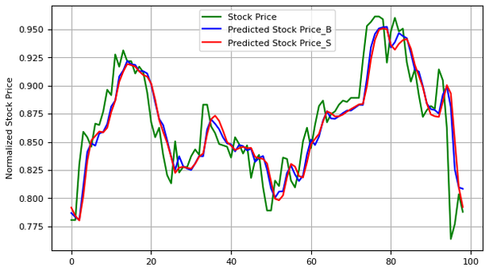
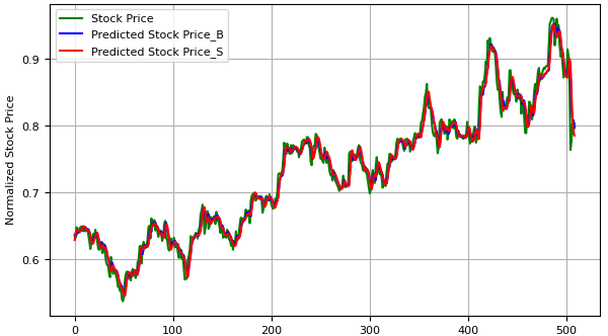
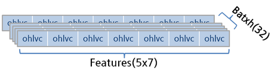
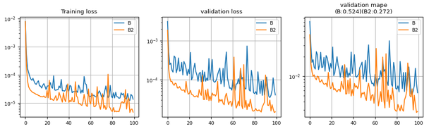

# 5.3 RNN Model Design (Time Series)

**학습 목표**

- 주가 같은 시계열 데이터를 `(samples, timesteps, features)` 형태의 sequence sample 로 바꾸는 window 구성 방법을 설명할 수 있다.
- LSTM 층 하나와 Linear 층 하나로 이루어진 regression 모델을 정의하고, 마지막 time step 의 출력만 쓰는 many to one 구조를 코드로 구현할 수 있다.
- `num_layers` 로 LSTM 을 stacking 한 모델과 basic 모델의 파라미터 수와 성능을 비교할 수 있다.
- regression 문제에 맞는 loss(MSE)와 metric(MAPE)을 고르고, Lightning 으로 학습·로그·예측 결과를 확인할 수 있다.
- 기술 지표(technical indicator)를 feature 로 추가하고 모델 구조를 바꿔 가며 성능을 개선하는 실습을 수행할 수 있다.

**이 절의 구성**

- 5.3.1 실습 개요 — 주가 예측 문제
- 5.3.2 Dataset 준비 — 주가 읽기와 정규화
- 5.3.3 Sequence generator — window 로 sample 만들기
- 5.3.4 Model_B — LSTM 하나를 갖는 basic model
- 5.3.5 Model_S — Stacked LSTM model 과 model summary
- 5.3.6 Training — regression 의 loss 와 로그 확인
- 5.3.7 Prediction 결과 확인
- 5.3.8 Dense model 과 LSTM model 의 입출력 비교
- 5.3.9 실습과제
- 5.3.10 정리

---

## 5.3.1 실습 개요 — 주가 예측 문제
<!-- 슬라이드 452 -->

이 절은 앞 절에서 정리한 RNN 의 구조를 실제 시계열(time series) 데이터에 적용해 보면서 RNN 모델을 어떻게 설계하는지 익히는 절이다. 재료는 주가다. 주가는 날짜 순서로 나열된 숫자이고, 오늘의 값이 어제까지의 값과 무관하지 않으므로 sequence 를 다루는 RNN 에 잘 맞는 예제다. 이 절 전체가 하나의 실습으로 이어지며, 절 끝에 실습과제와 그 확장 실습(지표 추가, attention)이 붙는다.

### 실습 5.3.1 — Stock prediction
<!-- 슬라이드 452 -->

> 노트북: `code/5.3.1.TimeSeries.ipynb`
> [](https://colab.research.google.com/github/AI-BoostCamp/intermediate-deep-learning-pytorch/blob/main/code/5.3.1.TimeSeries.ipynb)

실습의 목표는 20년 간의 주가 정보를 이용하여 주가 예측 모델을 구현하는 것이다. 모델은 두 가지를 만든다.

- **Basic model** — LSTM RNN layer 를 하나만 갖는 모델
- **Advanced model** — RNN layer 를 stacking 한 모델

진행 순서는 다음과 같다. 먼저 7일치 주가로 RNN 을 training 한다.

1. 주가 정보를 읽어 들인다.
2. 주가의 시가·고가·저가·거래량·종가(ohlvc)를 feature 로 삼아 7일치 단위로 time series(sequence)를 생성한다.
3. 8일차 종가(c)를 target 으로 설정한다.
4. LSTM 으로 모델을 훈련한다.

훈련이 끝나면 7일치 주가를 입력하여 8일차, 곧 다음날 종가(c)를 prediction 한다.

이 문제의 입출력은 모두 숫자다. 앞 장의 이미지 분류처럼 클래스 확률을 내는 것이 아니라 값 자체를 맞히는 것이므로 **regression 문제**다. 그리고 주가는 수만 원 단위, 거래량은 수백만 단위처럼 feature 마다 scale 이 크게 다르므로 모든 숫자를 normalize 하여 사용한다.

아래 그림이 이 실습이 도달하려는 결과다. 정규화한 실제 주가(초록) 위에 basic 모델의 예측(파랑, Predicted Stock Price_B)과 advanced 모델의 예측(빨강, Predicted Stock Price_A)을 겹쳐 그렸다. 두 예측선 모두 실제 주가 곡선을 거의 겹치듯 따라간다.



---

## 5.3.2 Dataset 준비 — 주가 읽기와 정규화
<!-- 슬라이드 453 -->

주가 데이터는 `FinanceDataReader` 패키지로 읽는다(`pip install finance-datareader` 로 미리 설치한다). `DataReader()` 에 종목 코드와 시작일을 주면 그날부터 오늘까지의 일별 주가가 pandas `DataFrame` 으로 돌아온다. `'005930'` 은 삼성전자의 종목 코드이고, 주석 처리된 `'KS11'` 은 KOSPI 지수다.

```python
import FinanceDataReader as fdr
#pd_data = fdr.DataReader('KS11', '2000-01-01') # KOSPI
# Samsung(005930), 1992-01-01 ~ 2018-10-31
pd_data = fdr.DataReader('005930', '2015-01-01')
# (Open,High,Low,Close,Volume,change)
pd_data = pd_data.drop(columns=['Change'])
print(pd_data.head())
print(pd_data.tail())
```

돌아오는 `DataFrame` 의 열은 Open, High, Low, Close, Volume, Change 의 여섯 개다. Change 는 전일 대비 등락률로 Close 에서 계산되는 파생값이므로 `drop()` 으로 떼어 내고, 시가·고가·저가·종가·거래량 다섯 열만 남긴다. 시작일은 바꿔도 된다. 슬라이드는 2004-01-01 부터 약 20년치를 읽었고, 노트북은 2015-01-01 부터 읽는다. 다음은 2004-01-01 부터 읽었을 때 `head()` 와 `tail()` 이 보여 주는 앞뒤 5일이다. 날짜가 index 이고, 오래된 날짜가 앞에 온다.

| Date | Open | High | Low | Close | Volume |
|---|---|---|---|---|---|
| 2004-01-02 | 9020 | 9060 | 8930 | 8980 | 378898 |
| 2004-01-05 | 8980 | 9150 | 8950 | 9150 | 447718 |
| 2004-01-06 | 9340 | 9340 | 9170 | 9200 | 448150 |
| 2004-01-07 | 9270 | 9380 | 9240 | 9300 | 399440 |
| 2004-01-08 | 9420 | 9550 | 9370 | 9380 | 750498 |
| … | … | … | … | … | … |
| 2024-08-22 | 78700 | 78900 | 77800 | 78300 | 8149101 |
| 2024-08-23 | 77700 | 78400 | 77500 | 77700 | 9420306 |
| 2024-08-26 | 78100 | 78200 | 76000 | 76100 | 15655938 |
| 2024-08-27 | 75700 | 76500 | 75600 | 75800 | 11130145 |
| 2024-08-28 | 75800 | 76400 | 75400 | 76400 | 9671798 |

표에서 보듯 주가는 수천~수만 원, 거래량은 수십만~수천만 주로 열마다 scale 이 전혀 다르다. 그대로 넣으면 거래량이 다른 feature 를 압도하므로 열마다 최대·최소값으로 정규화한다. `np.min(data, 0)` 과 `np.max(data, 0)` 은 axis 0(날짜 방향)으로 열별 최소·최대를 구하므로, 각 열이 독립적으로 0~1 범위로 옮겨진다. 분모의 `1e-7` 은 최대와 최소가 같은 열이 있을 때 0 으로 나누는 것을 막는 안전장치다.

```python
# 최대,최소값으로 정규화 하기
def MinMaxScaler(data):
    numerator = data - np.min(data, 0)
    denominator = (np.max(data, 0) - np.min(data, 0)) + 1e-7
    return numerator/denominator
```

정규화한 배열에서 입력 `XX` 와 target `YY` 를 나눈다. 입력은 다섯 열 전부이고, target 은 종가 열 하나다. `DataFrame` 의 열 순서가 Open, High, Low, Close, Volume 이므로 종가는 index 3 이다. `xy[:, [3]]` 처럼 index 를 리스트로 주면 결과가 1차원 `(N,)` 이 아니라 2차원 `(N, 1)` 로 유지되어 뒤의 sequence 생성에서 shape 를 따로 맞출 필요가 없다.

```python
xy = np.array(pd_data)  # np <- pandas data format
## 필요시 reordering
#xy = xy[::-1]          # 과거부터로 정렬 (chronically ordered)
xy = MinMaxScaler(xy)   # minmax 정규화
XX = xy                  # input data(Open,High,Low,Close,Volume)
YY = xy[:, [3]]          # 종가만 slicing -> target data

# data type 확인
print ("SHAPE OF X IS %s" % (XX.shape,))
print ("SHAPE OF Y IS %s" % (YY.shape,))
```

주석 처리된 `xy[::-1]` 은 데이터가 최신 날짜부터 거꾸로 정렬되어 있을 때 과거부터 순서대로 뒤집는 코드다. RNN 은 입력 순서가 곧 시간 순서이므로, 데이터 출처에 따라 이 재정렬이 필요한지 반드시 확인해야 한다. `FinanceDataReader` 는 과거부터 정렬해 주므로 여기서는 쓰지 않는다.

---

## 5.3.3 Sequence generator — window 로 sample 만들기
<!-- 슬라이드 454~455 -->

RNN 에 넣는 time series(sequence) 데이터의 shape 는 `(samples, timesteps, features)` 다. 이 실습에서는 7일치 ohlvc 가 sample 하나이므로 입력 x 는 `(?s, 7t, 5f)`, target y 는 8일차 종가 하나이므로 `(?s, 1f)` 가 된다. 물음표 자리의 sample 수는 읽어 온 날짜 수에 따라 정해지는데, 슬라이드의 예에서는 4537 개다.

sample 은 날짜 축을 따라 하루씩 밀어 가며 만든다. 즉 D1~D7 의 ohlvc 가 첫 sample 이고 그 target 은 D8 의 종가, D2~D8 이 두 번째 sample 이고 target 은 D9 의 종가가 된다. 이렇게 하루씩 겹치며 미끄러지는 창을 sliding window 라 한다. 아래 표가 그 대응이다. 열 하나가 time step 하나이고, 칸 하나(예: D1 ohlvc)에는 feature 다섯 개가 들어 있다.

| sample | step 1 | step 2 | step 3 | step 4 | step 5 | step 6 | step 7 | target |
|---|---|---|---|---|---|---|---|---|
| 1 | D1 ohlvc | D2 ohlvc | D3 ohlvc | D4 ohlvc | D5 ohlvc | D6 ohlvc | D7 ohlvc | D8 c |
| 2 | D2 ohlvc | D3 ohlvc | D4 ohlvc | D5 ohlvc | D6 ohlvc | D7 ohlvc | D8 ohlvc | D9 c |
| 3 | D3 ohlvc | D4 ohlvc | D5 ohlvc | D6 ohlvc | D7 ohlvc | D8 ohlvc | D9 ohlvc | D10 c |
| … | … | … | … | … | … | … | … | … |

이 표를 3차원 배열로 보면 다음과 같다.

| 축 | 뜻 | 크기 |
|---|---|---|
| samples | window 하나가 sample 하나 | 4537 (슬라이드의 예) |
| timesteps | 하루가 time step 하나 | 7 |
| features | o, h, l, v, c | 5 |

이 구성을 코드로 옮긴 것이 `seq_gen()` 이다. `i` 를 0 부터 `len(x) - seq_length` 앞까지 움직이면서 `x[i:i+seq_length]` 로 7일치를 잘라 `dataX` 에, 그 바로 다음 날의 종가(index 3)를 `dataY` 에 쌓는다. 마지막 window 의 다음 날이 데이터 범위 안에 있어야 하므로 반복 횟수가 날짜 수보다 `seq_length` 만큼 적다.

```python
# sequence generator
def seq_gen(x,seq_length):
    dataX = []
    dataY = []
    for i in range(0, len(x) - seq_length):
        _x = x[i:i + seq_length] # 7일치 데이터
        _y = x[i+seq_length:i+seq_length+1,3]   # 다음날 종가
        dataX.append(_x)
        dataY.append(_y)
    # train data : test data = 9 : 1
    train_size = int(len(dataY) * 0.9)
    test_size  = len(dataY) - train_size
    x_train = np.array(dataX[0:train_size]).copy()
    y_train = np.array(dataY[0:train_size]).copy()
    x_test  = np.array(dataX[train_size:]).copy()
    y_test  = np.array(dataY[train_size:]).copy()
    return x_train,y_train,x_test,y_test
```

target 을 `x[i+seq_length, 3]` 이 아니라 `x[i+seq_length:i+seq_length+1, 3]` 으로 slicing 하는 것은 `(1,)` 모양을 유지해 `dataY` 가 `(samples, 1)` 이 되게 하려는 것이다. 모델 출력이 `(batch, 1)` 이므로 target 도 같은 모양이어야 loss 를 바로 계산할 수 있다.

train 과 test 는 9:1 로 나눈다. 분류 실습처럼 무작위로 섞어 나누지 않고 **앞 90% 를 train, 뒤 10% 를 test** 로 자른다는 점이 중요하다. 시계열에서는 미래의 값이 train 에 섞여 들어가면 예측 성능이 실제보다 좋게 보이기 때문이다.

```python
## x:7일치 데이터, y:8일차 종가
timesteps = seq_length = 7
x_train,y_train,x_test,y_test = seq_gen(XX,seq_length)
ps(x_train,'x_train')
ps(y_train,'y_train')
ps(x_test,'x_test')
ps(y_test,'y_test')
```

`ps()` 는 이름과 shape 를 출력하는 노트북의 작은 helper 다. `x_train` 이 `(train_size, 7, 5)`, `y_train` 이 `(train_size, 1)` 로 나오면 window 구성이 맞은 것이다. 모델을 만들 때 쓸 두 값도 여기서 정해 둔다. `hidden_dim` 은 LSTM 의 hidden state 크기이고, `data_dim` 은 feature 수로 `x_train.shape[2]` 에서 읽어 5 가 된다.

```python
hidden_dim = 10
data_dim  = x_train.shape[2]
data_dim #input_features = data_dim = 5
```

### Dataset 과 DataLoader
<!-- 슬라이드 455 -->

numpy 배열을 PyTorch 학습 루프에 넣으려면 `Dataset` 으로 감싸고 `DataLoader` 로 batch 를 만든다. `CustomDataset` 은 x 와 y 배열을 받아 두었다가 `__getitem__` 에서 idx 번째 sample 을 `FloatTensor` 로 바꿔 돌려준다. numpy 의 실수는 기본이 float64 인데 모델 파라미터는 float32 이므로 여기서 형을 맞춰 주는 것이다.

```python
class CustomDataset(Dataset):
    def __init__(self, x, y):
        super().__init__()
        self.x = x
        self.y = y
    def __len__(self):
        return len(self.x)
    def __getitem__(self, idx):
        return torch.FloatTensor(self.x[idx]),torch.FloatTensor(self.y[idx])
```

```python
batch_size = 64 ##

trainDataset = CustomDataset(x_train, y_train)
testDataset = CustomDataset(x_test, y_test)
trainDataLoader = DataLoader(trainDataset, batch_size, shuffle=True) # defalut : drop_last=False
testDataLoader = DataLoader(testDataset, batch_size, shuffle=False)
```

train loader 는 `shuffle=True` 다. sample 단위로 섞는 것이므로 각 sample 안의 7일 순서는 그대로 유지되며, 오히려 비슷한 시기의 sample 만 한 batch 에 몰리는 것을 막아 준다. test loader 는 예측 결과를 날짜 순으로 그리기 위해 섞지 않는다. `drop_last` 는 기본값 `False` 라 마지막 batch 가 `batch_size` 보다 작아도 버리지 않는다. batch 크기는 슬라이드에서 32, 노트북에서 64 를 썼는데, 어느 쪽이든 model summary 의 첫 번째 차원으로만 나타나고 파라미터 수에는 영향을 주지 않는다.

---

## 5.3.4 Model_B — LSTM 하나를 갖는 basic model
<!-- 슬라이드 456 -->

Basic model(Model_B)은 LSTM 층 하나와 Linear 층 하나로 이루어진다. 모델을 층의 나열로 그린 정적 표현은 다음과 같다.

| 단계 | 층 | 크기 |
|---|---|---|
| 입력 | feature(5) × 7 time steps | (batch, 7, 5) |
| RNN | LSTM(10) | hidden_dim = 10 |
| 출력층 | Dense(1) | units = 1 |
| 출력 | Output(1) | 다음날 종가 |

- `torch.nn.LSTM` — units 에 해당하는 `hidden_dim` 을 10 으로 둔다. hidden state 와 cell state 가 모두 10차원이다.
- `torch.nn.Linear` — `units = 1`. LSTM 출력(10차원)을 받아 종가 하나를 예측한다. activation function 은 기본값 그대로 없음(linear)이다. regression 이므로 출력을 확률로 눌러 줄 필요가 없고, 정규화한 종가 값을 그대로 내보내면 된다.

같은 모델을 시간 축으로 펼친 동적 표현이 아래 그림이다. D1~D7 의 ohlvc 가 순서대로 LSTM cell 에 들어가고, cell 은 이전 step 의 상태를 받아 다음 step 으로 넘긴다. 7번째 step 의 출력만 Dense 로 보내 값 하나를 얻으므로 **many to one** 구조다.



코드는 다음과 같다. `BasicModel` 은 `Wrap_regression` 을 상속하는데, 이 부모 클래스는 loss·metric·optimizer 를 정의한 `LightningModule` 로 5.3.6 에서 다룬다. 모델 클래스에는 층의 정의(`__init__`)와 순전파(`forward`)만 남는다.

```python
class BasicModel(Wrap_regression):
    def __init__(self, input_features, hidden_dim):
        super().__init__()
        self.lstm = nn.LSTM(input_features, hidden_dim,
                            batch_first=True)
        self.linear = nn.Linear(hidden_dim, 1)

    def forward(self, x):
        x, _ = self.lstm(x)
        x = self.linear(x[:, -1, :])
        return x
```

`nn.LSTM(input_features, hidden_dim, batch_first=True)` 에서 `batch_first=True` 는 입력 tensor 의 첫 번째 축이 batch 라는 뜻이다. 우리 데이터가 `(batch, 7, 5)` 이므로 이 옵션이 필요하다(기본값은 `(seq, batch, feature)` 순서다).

`forward` 에서 `self.lstm(x)` 는 두 값을 돌려준다. 첫 번째는 **모든 time step 의 출력**으로 shape 가 `(batch, 7, 10)` 이고, 두 번째는 마지막 hidden state 와 cell state 의 튜플이다. 여기서는 두 번째를 `_` 로 버리고, 첫 번째에서 `x[:, -1, :]` 로 마지막 step 의 출력 `(batch, 10)` 만 골라 Linear 에 넣는다. 결과는 `(batch, 1)` 로 target 과 같은 모양이 된다. 이 `[:, -1, :]` 한 줄이 many to one 을 만드는 핵심이다.

모델을 만들고 `torchinfo.summary()` 로 구조를 확인한다. `input_size` 에는 batch 를 포함한 입력 shape 를 준다.

```python
model_B = BasicModel(input_features=data_dim, hidden_dim=hidden_dim)
summary(model_B, input_size=(batch_size, timesteps, data_dim))
```

---

## 5.3.5 Model_S — Stacked LSTM model 과 model summary
<!-- 슬라이드 457~458 -->

Stacked LSTM model(Model_S)은 LSTM 을 세 층 쌓고 그 위에 Dense 를 둔 `(LSTM) * 3 + dense` 구조다. PyTorch 에서는 LSTM 을 세 번 따로 만들 필요 없이 `nn.LSTM` 의 `num_layers = 3` 으로 한 번에 쌓는다.

층을 쌓을 때 아래 층은 **각 시퀀스(time step)마다 출력을 리턴**해야 한다. 그래야 위 층이 그 7개 출력을 다시 sequence 로 받아 처리할 수 있다. 즉 아래 두 층은 7개를 받아 7개를 내는 many to many 구조를 형성하고, 맨 위 층만 마지막 출력 하나를 Dense 로 보내는 many to one 이 된다. 모델 전체로는 **many to many + many to one** 이다. `nn.LSTM` 은 원래 모든 step 의 출력을 돌려주므로 `num_layers` 만 바꾸면 이 연결이 자동으로 이루어진다.



정적 표현으로는 feature(5)×7 → LSTM(10) → LSTM(10) → LSTM(10) → Dense(1) → Output(1) 이다. 코드는 Basic model 과 `num_layers=3` 한 줄만 다르다.

```python
class StackedModel(Wrap_regression):
    def __init__(self, input_features, hidden_dim):
        super().__init__()
        self.lstm = nn.LSTM(input_features, hidden_dim,
#                            dropout=0.1, # 마지막을 제외하고 출력에 적용
                            num_layers=3, batch_first=True)
        self.linear = nn.Linear(hidden_dim, 1)

    def forward(self, x):
        x, _ = self.lstm(x)
        x = self.linear(x[:, -1, :])
        return x
```

주석 처리된 `dropout` 은 쌓인 LSTM 층 사이, 곧 마지막 층을 제외한 각 층의 출력에 적용되는 옵션이다. 과적합이 보이면 켜 볼 수 있다. `forward` 는 Basic model 과 완전히 같다. `x[:, -1, :]` 가 맨 위 층의 마지막 step 출력이므로 many to one 이 그대로 성립한다.

```python
model_S = StackedModel(data_dim, hidden_dim)
summary(model_S, input_size=(batch_size, timesteps, data_dim))
```

### Model summary
<!-- 슬라이드 458 -->

두 모델의 `summary()` 결과를 나란히 놓으면 stacking 이 무엇을 바꾸는지 보인다. 아래는 슬라이드가 `input_size=(1, 7, 5)` 로 찍은 결과다(batch 를 64 로 주면 Output Shape 의 첫 숫자만 64 로 바뀐다).

Basic model:

| Layer (type:depth-idx) | Output Shape | Param # |
|---|---|---|
| BasicModel | -- | -- |
| ├─LSTM: 1-1 | [1, 7, 10] | 680 |
| └─Linear: 1-2 | [1, 1] | 11 |
| Total params | | 691 |
| Trainable params | | 691 |

Stacked model:

| Layer (type:depth-idx) | Output Shape | Param # |
|---|---|---|
| AdvancedModel | -- | -- |
| ├─LSTM: 1-1 | [1, 7, 10] | 2,440 |
| └─Linear: 1-2 | [1, 1] | 11 |
| Total params | | 2,451 |
| Trainable params | | 2,451 |

LSTM 의 Output Shape 가 `[1, 7, 10]` 인 것은 7개 step 전부의 출력을 돌려준다는 뜻이고, Linear 의 `[1, 1]` 은 그중 마지막 step 만 골라 값 하나로 만들었다는 뜻이다. 파라미터 수도 확인해 볼 만하다. LSTM 층 하나는 입력 크기 $I$, hidden 크기 $H$ 에 대해 네 개의 gate 가 각각 입력 가중치·hidden 가중치·bias 두 벌을 가지므로 $4H(I+H+2)$ 개의 파라미터를 갖는다. 첫 층은 $I=5$, $H=10$ 이라 680 개이고, 둘째·셋째 층은 입력이 앞 층의 hidden 10 이므로 각각 880 개다. 그래서 stacked 모델의 LSTM 파라미터가 680 + 880 + 880 = 2,440 이 된다. Linear 는 가중치 10 개에 bias 1 개로 11 개다. 층을 두 개 더 쌓아도 파라미터가 2,500 개가 되지 않는, 매우 작은 모델이다.

---

## 5.3.6 Training — regression 의 loss 와 로그 확인
<!-- 슬라이드 459~460 -->

두 모델이 공통으로 상속하는 `Wrap_regression` 이 학습 방법을 정의한다. Lightning 의 `LightningModule` 을 상속하여 `training_step`, `validation_step`, `configure_optimizers` 세 메서드를 채운다.

```python
class Wrap_regression(L.LightningModule):
    def training_step(self, batch, batch_idx):
        x, y = batch
        y_pred = self(x)
        loss = F.mse_loss(y_pred, y)
        mape = FM.mean_absolute_percentage_error(y_pred, y)
        metrics={'loss':loss, 'mape':mape}
        self.log_dict(metrics,prog_bar=True,on_step=False,on_epoch=True)
        return loss

    def validation_step(self, batch, batch_idx):
        x, y = batch
        y_pred = self(x)
        loss = F.mse_loss(y_pred, y)
        mape = FM.mean_absolute_percentage_error(y_pred, y)
        metrics={'val_loss':loss, 'val_mape':mape}
        self.log_dict(metrics,prog_bar=True,on_step=False,on_epoch=True)

    def configure_optimizers(self):
        return torch.optim.Adam(self.parameters(), lr=0.005)
```

> **주의 — loss 는 mean squared error**
> 이 문제는 예측한 값과 실제 값의 **차이**를 줄이는 것이므로 loss 로 `F.mse_loss` 를 쓴다. 분류에서 쓰던 cross entropy 는 확률 분포끼리의 거리이므로 값의 차이를 재는 데 쓰면 안 된다.

metric 으로는 MAPE(mean absolute percentage error)를 함께 기록한다. 오차를 실제 값에 대한 비율로 나타내므로 정규화 scale 과 무관하게 "몇 % 틀렸는지"를 읽을 수 있어 MSE 보다 직관적이다. `log_dict()` 의 `on_step=False, on_epoch=True` 는 batch 마다가 아니라 epoch 마다 평균을 기록하라는 뜻이고, `prog_bar=True` 는 진행 표시줄에도 보여 준다. validation 에서는 이름 앞에 `val_` 을 붙여 train 값과 구분한다. optimizer 는 Adam 이다. 학습률은 슬라이드에서 0.001, 노트북에서 0.005 를 썼다.

### Fit & log plotting
<!-- 슬라이드 460 -->

학습은 `Trainer` 에 맡긴다. `CSVLogger("logs", name=name)` 는 epoch 마다 기록한 metric 을 `logs/<name>/version_<n>/metrics.csv` 에 저장한다. `trainer.fit()` 의 세 번째 인자로 test loader 를 주어 validation 으로 쓴다. 노트북은 여기에 `ModelCheckpoint(monitor='val_loss')` 를 더해 `val_loss` 가 가장 낮았던 epoch 의 가중치를 저장하고, 학습이 끝난 뒤 `best_model_path` 에서 다시 읽어 온다. 100 epoch 의 마지막 상태가 아니라 가장 좋았던 상태로 예측하려는 것이다.

```python
%%time
model_B = BasicModel(data_dim, hidden_dim)
name = "model_B"

checkpoint_callback = ModelCheckpoint(dirpath='./aicamp', monitor='val_loss')
logger = CSVLogger("logs", name=name)
trainer = Trainer(max_epochs=100, logger=logger,callbacks=[checkpoint_callback])
trainer.fit(model_B, trainDataLoader, testDataLoader)

checkpoint = torch.load(checkpoint_callback.best_model_path)
model_B.load_state_dict(checkpoint['state_dict'])

model_B.eval()
```

학습 로그는 `metrics.csv` 를 읽어 `DataFrame` 으로 만든다. Lightning 은 train metric 과 validation metric 을 서로 다른 행에 쓰므로 `groupby('epoch').last()` 로 epoch 당 한 행으로 합치고, 불필요한 `step` 열은 버린다. `logger.version` 은 같은 이름으로 여러 번 학습했을 때 이번 실행의 폴더 번호다.

```python
v_num = logger.version
history = pd.read_csv(f'./logs/{name}/version_{v_num}/metrics.csv')
df = history.groupby('epoch').last().drop('step', axis=1)
```

Stacked model 도 같은 방법으로 학습하고 로그를 `df2` 에 담는다. 모델 클래스와 `name` 만 바뀐다.

```python
%%time
model_S = StackedModel(data_dim, hidden_dim)
name = "model_S"

checkpoint_callback = ModelCheckpoint(dirpath='./aicamp', monitor='val_loss')
logger = CSVLogger("logs", name=name)
trainer = Trainer(max_epochs=100, logger=logger,callbacks=[checkpoint_callback])
trainer.fit(model_S, trainDataLoader, testDataLoader)

checkpoint = torch.load(checkpoint_callback.best_model_path)
model_S.load_state_dict(checkpoint['state_dict'])
model_S.eval()

v_num = logger.version
history = pd.read_csv(f'./logs/{name}/version_{v_num}/metrics.csv')
df2 = history.groupby('epoch').last().drop('step', axis=1)
```

두 로그를 한 그림에 겹쳐 그리는 함수가 `plt_history()` 다. training loss, validation loss, validation MAPE 세 판을 나란히 그리고, 제목에 각 모델의 최소 `val_mape`(% 단위)를 적는다. loss 는 epoch 초반과 후반의 크기 차이가 커서 `semilogy()` 로 세로축을 로그 scale 로 둔다.

```python
def plt_history(historys,names):
    mins =[]
    title_name = ""
    for i,h in enumerate(historys):
        title_name += f"({names[i]}:{min(h['val_mape'])*100:.3f})"
    plt.figure(figsize=(12,3))
    plt.subplot(131)
    for i,h in enumerate(historys):
        plt.plot(h['loss'], label=names[i])
    plt.title("Training loss")
    plt.semilogy()
    plt.legend()
    plt.grid()

    plt.subplot(132)
    plt.title("validation loss")
    for i,h in enumerate(historys):
        plt.plot(h['val_loss'], label=names[i])
    plt.semilogy()
    plt.legend()
    plt.grid()

    plt.subplot(133)
    plt.title(f"validation mape\n{title_name}")
    for i,h in enumerate(historys):
        plt.plot(h['val_mape'], label=names[i])
    plt.semilogy()
    plt.legend()
    plt.grid()
    plt.show()

titles=["Basic","Stacked"]
plt_history([df,df2],titles)
```

아래는 슬라이드가 보여 주는 두 모델의 validation loss(왼쪽)와 validation MAPE(오른쪽) 곡선이다. 제목에 적힌 최소 val_loss 는 BasicRNN 0.000123, StackedRNN 0.000120 이고 최소 val_mape 는 0.0117, 0.0114 로, stacked 모델이 근소하게 낮다. 그러나 곡선을 보면 stacked 모델(주황)이 epoch 사이의 출렁임이 더 크다. 파라미터가 많아진 만큼 학습이 덜 안정적이라는 뜻이다.



---

## 5.3.7 Prediction 결과 확인
<!-- 슬라이드 461 -->

학습한 모델로 test 구간의 종가를 예측하고 실제 종가와 겹쳐 그려 본다. 먼저 결과 plot 함수를 만든다. `stock_plot()` 은 실제 값과 예측값 리스트를 받아 각각 초록·파랑·빨강으로 그린다. `plot_predict()` 는 basic 모델과 비교 대상 모델의 예측을 함께 구해 `stock_plot()` 에 넘긴다. 모델에 numpy 배열을 바로 넣을 수 없으므로 `torch.Tensor(X)` 로 바꿔 넣고, 결과는 `detach().numpy()` 로 그래프 계산에서 떼어 내 numpy 로 돌린다.

```python
history_n = ['Basic','Stacked']
colors=['green','blue','red']
def stock_plot(prices,title="",names=[]):
    plt.figure(figsize=(8, 4))
    for i, pred in enumerate(prices):
        plt.plot(pred,color=colors[i], label=names[i])
    plt.title(title)
    plt.xlabel('days')
    plt.ylabel('Normalized Stock Price')
    plt.legend()
    plt.grid()
    plt.show()
    return

def plot_predict(model,X,Y,title,names):
  pred_price_B = model_B(torch.Tensor(X)).detach().numpy()
  pred_price_o = model(torch.Tensor(X)).detach().numpy()
  stock_plot([Y[:,-1],pred_price_B[:,-1],pred_price_o[:,-1]],title,names)
  return
```

예측은 구간을 바꿔 가며 여러 번 해 본다. test 구간의 마지막 100일과 test 전 구간이 슬라이드가 보여 주는 두 결과다. `x_test[s_p:e_p]` 의 slicing 범위만 바꾸면 되고, `s_p = None, e_p = None` 이면 전체다.

```python
# Test 영역 마지막 100일
s_p = -100
e_p = None
X = x_test[s_p:e_p]
Y = y_test[s_p:e_p]

plot_predict(model_S,X,Y,title=f"TestData[{s_p}:{e_p}]",names=['True','Basic','Stacked'])
```

```python
# Test 영역 전체
s_p = None
e_p = None
X = x_test[s_p:e_p]
Y = y_test[s_p:e_p]
plot_predict(model_S,X,Y,title=f"TestData[{s_p}:{e_p}]",names=['True','Basic','Stacked'])
```

Test 마지막 100일의 결과다. 실제 주가(초록, Stock Price)와 basic 모델(파랑, Predicted Stock Price_B), stacked 모델(빨강, Predicted Stock Price_S)의 예측이 거의 겹쳐 있으며, 주가가 급히 꺾이는 구간에서 예측이 약간 늦게 따라가는 모습이 보인다.



Test 전 구간(약 500일)의 결과다. 전체 추세는 물론 자잘한 등락까지 두 모델이 실제 주가를 잘 따라간다.



노트북은 이 밖에 training 구간의 마지막 100일과 test 구간의 첫 100일도 같은 방법으로 그린다. train 구간의 적합도와 test 구간의 일반화 정도를 나란히 보는 것이 목적이다.

---

## 5.3.8 Dense model 과 LSTM model 의 입출력 비교
<!-- 슬라이드 463 -->

실습과제에는 LSTM 을 Dense layer 로 바꿔 보는 과제가 있다. 그때 무엇이 달라지는지 두 모델의 입출력을 예시로 비교해 둔다.

| | LSTM model | Dense model |
|---|---|---|
| 입력 | (Batch 32, time_steps 7, Features 5) — 7일이 순서 있는 sequence 로 들어간다 | (Batch 32, Features 5×7) — 7일치 ohlvc 를 한 줄로 펴서 35개 feature 로 들어간다 |
| 은닉층 | LSTM(10) — step 을 순서대로 처리하며 상태를 넘긴다 | Dense(50) — 35개 입력을 한 번에 받는다 |
| 출력층 | Dense(1) | Dense(1) |
| 출력 | Output(1) | Output(1) |

핵심 차이는 입력 모양이다. LSTM 은 `(batch, 7, 5)` 를 그대로 받아 시간 순서를 이용하지만, Dense 는 2차원 입력만 받으므로 아래 그림처럼 D1~D7 의 ohlvc 를 이어 붙여 `(batch, 35)` 로 펴야 한다. 이렇게 펴는 순간 "어느 값이 어느 날의 것인지"는 feature 의 위치로만 남고, 순서를 따라 상태를 넘기는 계산은 사라진다.



노트북의 Dense model 예시는 다음과 같다. `nn.Flatten()` 이 `(batch, 7, 5)` 를 `(batch, 35)` 로 펴고, 뒤에 Linear 두 층이 온다. 입력 크기는 `x_train.shape[1]*x_train.shape[2]`, 곧 7×5 로 준다.

```python
class DenseModel(Wrap_regression):
    def __init__(self, input_features,hidden_dim):
        super().__init__()
        self.linear = nn.Sequential(
            nn.Flatten(),
            nn.Linear(input_features, hidden_dim*4),
            nn.ReLU(),
            nn.Linear(hidden_dim*4, 1) )

    def forward(self, x):
        x = self.linear(x)
        return x

model_d = DenseModel(x_train.shape[1]*x_train.shape[2], hidden_dim)
summary(model_d, input_size=x_train[:batch_size].shape) #(64,7,5)
```

Dense model 은 `forward` 에 `[:, -1, :]` 가 없다. 애초에 time step 축이 없기 때문이다. 학습 방법은 `Wrap_regression` 을 그대로 상속하므로 LSTM 모델과 같은 loss·metric 으로 성능을 비교할 수 있다.

---

## 5.3.9 실습과제
<!-- 슬라이드 462, 464 -->

실습 5.3.1 노트북 뒤에 이어지는 과제들이다. 모두 앞에서 만든 `seq_gen()`, `CustomDataset`, `Wrap_regression`, `plt_history()` 를 그대로 쓰고 모델이나 데이터 구성만 바꾼다.

**과제 1. `timesteps = seq_length = 7` 을 줄여 보자.** model_B 에서 5, 3, 1, 14 로 바꿔서 결과를 비교한다. `seq_length` 를 바꾸면 `seq_gen()` 부터 다시 실행해 `x_train` 의 두 번째 축을 새 길이로 만들어야 하고, `Dataset`·`DataLoader` 도 다시 만든다. 모델 정의는 `seq_length` 에 의존하지 않으므로 그대로 쓴다. 각 길이의 로그를 `plt_history()` 로 기준 모델(길이 7)과 겹쳐 보며, window 가 짧아질 때와 길어질 때 validation MAPE 가 어떻게 달라지는지 본다.

**과제 2. model_S 를 개선하여 model_S2 를 만들어 보자.** 개선할 수 있는 부분을 생각해 본다. LSTM layer 를 더 추가할지, Dense layer 를 추가할지가 출발점이다. 예를 들어 LSTM 앞에 Linear 층을 두어 feature 5개를 더 넓은 차원으로 올린 뒤 LSTM 에 넣거나, `num_layers` 를 바꿔 볼 수 있다.

**과제 3. LSTM 을 Dense layer 로 교체한 model 을 만들어 보자.** 5.3.8 의 입출력 비교가 이 과제의 힌트다. `nn.Flatten()` 으로 7일치를 펴서 Dense 에 넣고, LSTM 모델과 성능을 비교해 본다. 순서 정보를 버린 모델이 얼마나 따라오는지가 관찰 포인트다.

**과제 4. Basic model 에 Bidirectional Layer 를 적용하고 성능을 비교해 보자.**

1. `bidirectional=True` 를 적용한다. 순방향과 역방향 LSTM 이 함께 돌아 출력이 `hidden_dim*2` 차원이 되므로, 뒤의 `nn.Linear` 입력 크기도 `hidden_dim*2` 로 바꿔야 한다.
2. whole_seq_output 을 사용하면 어떻게 될까? 마지막 step 만 쓰는 대신 7개 step 의 출력 전부를 쓰는 경우를 검토해 본다.
3. LSTM 과 Dense 사이에 Flatten layer 를 넣으면 어떻게 달라질까 생각해 보고, 결과도 확인한다. 7개 step 의 출력 `(batch, 7, hidden_dim*2)` 를 `nn.Flatten()` 으로 펴면 `nn.Linear(hidden_dim*2*seq_length, 1)` 로 값 하나를 만들 수 있다.

노트북에는 이어서 과제 5(7일치 종가를 target 으로 하는 many to many 모델)와 과제 6(과제 5 의 bidirectional layer 를 stacking)이 있고, 아래 과제 7 은 과제 6 의 모델에서 출발한다.

### 과제 7 — 실습 5.3.2 Indicator 추가
<!-- 슬라이드 464 -->

> 노트북: `code/5.3.2.Add_Indicators.ipynb`
> [](https://colab.research.google.com/github/AI-BoostCamp/intermediate-deep-learning-pytorch/blob/main/code/5.3.2.Add_Indicators.ipynb)

**과제 7. Indicator 를 시계열에 추가하여 성능을 개선해 보자(목표: mape 0.3 이하).** 과제 6 에서 사용한 모델을 수정하여 성능을 높인다. 손댈 수 있는 곳은 다음과 같다.

- hidden_dim 늘리기
- seq_length 늘리기
- learning rate 수정하기
- stack 늘리기
- 앞, 뒤에 Dense 추가하기

지금까지는 feature 가 ohlvc 다섯 개뿐이었다. 이 과제는 주가 기술 분석에서 쓰는 지표(technical indicator)를 열로 추가해 모델에 더 많은 정보를 주는 것이다. 노트북은 `ta` 패키지(Technical Analysis library)를 쓴다. pandas 위에서 동작하며 시가·고가·저가·종가·거래량으로부터 각종 지표를 계산해 준다.

**데이터 정리.** 주가를 읽는 부분은 실습 5.3.1 과 같다. 다만 지표를 계산하기 전에 값이 0 인 날을 정리한다. 거래가 없어 0 으로 기록된 값이 지표 계산에 섞이면 이상한 값이 나오므로 0 을 `NaN` 으로 바꾼 뒤 `interpolate()` 로 앞뒤 값 사이를 보간한다.

```python
pd_data['Open'] = pd_data["Open"].replace(0,np.nan)
pd_data['High'] = pd_data["High"].replace(0,np.nan)
pd_data['Low'] = pd_data["Low"].replace(0,np.nan)
pd_data['Volume'] = pd_data["Volume"].replace(0,np.nan)

pd_data['Open']=pd_data['Open'].interpolate()
pd_data['High']=pd_data['High'].interpolate()
pd_data['Low']=pd_data['Low'].interpolate()
pd_data['Volume']=pd_data['Volume'].interpolate()
pd_data.plot(logy=True)
```

**지표 추가.** 종가·고가·저가 열을 꺼내 지표를 계산하고 새 열로 붙인다. 추가하는 지표는 20일 지수이동평균(`ema_20`), 5일·10일 단순이동평균(`ma_5`, `ma_10`), 14일 Williams %R(`will_r_14`), 그리고 MACD 계열 세 개(`macd_26`, `macd_diff_26`, `macd_signal_26`)다. 열 이름에 window 크기를 붙여 두면 뒤에서 어떤 설정이었는지 바로 알 수 있다. 노트북에는 CCI, ATR, Bollinger Bands, ROC, Stochastic RSI 도 주석으로 준비되어 있어 필요하면 주석을 풀어 더 넣을 수 있다.

```python
import ta

close = pd_data["Close"]
high = pd_data["High"]
low = pd_data["Low"]

window=20
pd_data[f'ema_{window}']=ta.trend.ema_indicator(close, window=window)
window=5
pd_data[f'ma_{window}']=ta.trend.SMAIndicator(close, window=window).sma_indicator()
window=10
pd_data[f'ma_{window}']=ta.trend.SMAIndicator(close, window=window).sma_indicator()
lbp = 14
pd_data[f"will_r_{lbp}"]= ta.momentum.WilliamsRIndicator(high, low, close, lbp= 14).williams_r()

window = 26
pd_data[f"macd_{window}"] = ta.trend.MACD(close, window_slow= window, window_fast= 12, window_sign= 9).macd()
pd_data[f"macd_diff_{window}"] = ta.trend.macd_diff(close, window_slow=26, window_fast=12, window_sign=9)
pd_data[f"macd_signal_{window}"] = ta.trend.macd_signal(close, window_slow=26, window_fast=12, window_sign=9)

len(pd_data.columns),pd_data.columns
```

열은 이제 Open, High, Low, Close, Volume 에 지표 7개를 더한 12개다. 이동평균 같은 지표는 window 만큼의 과거가 있어야 계산되므로 데이터 앞부분 몇십 행이 `NaN` 이 된다. `seaborn` 의 heatmap 으로 어느 열의 어느 구간이 비어 있는지 확인한 뒤, 가장 긴 window 를 쓰는 `macd_signal_26` 이 비어 있지 않은 행만 남겨 앞부분을 잘라 낸다.

```python
import seaborn as sns # Visualization

f, ax = plt.subplots(nrows=1, ncols=1, figsize=(9, 4))
sns.heatmap(pd_data.T.isna(), cmap='Blues', ax=ax)
ax.set_title('Fields with Missing Values', fontsize=12)
ax.tick_params(axis='y', labelsize=10)
plt.show()

pd_data.isna().sum()

# Remove old rows
pd_data = pd_data[pd_data.macd_signal_26.notna()].reset_index(drop=True)
pd_data.isna().sum()
```

**scale 별 정규화.** 실습 5.3.1 에서는 열마다 따로 정규화했지만, 여기서는 **같은 단위를 갖는 열끼리 같은 최소·최대로** 정규화한다. 시가·고가·저가·종가와 세 이동평균은 모두 "가격" 이므로 네 가격 열의 최소·최대 하나로 함께 나눈다. 그래야 정규화 뒤에도 이동평균이 종가보다 위에 있는지 아래에 있는지 같은 상대 관계가 보존된다. 거래량, Williams %R, MACD 세 값은 각각 단위가 다르므로 열마다 따로 정규화한다.

```python
#### Scale별로 정규화 하기 ####
def MinMaxScaler(data):
    min_ = np.min(data[:,:4])
    max_ = np.max(data[:,:4])
    data[:,:4] = (data[:,:4] - min_) / (max_ - min_) # price
    data[:,4] = (data[:,4]-np.min(data[:,4])) / (np.max(data[:,4])-np.min(data[:,4]))#volume
    data[:,5:8] = (data[:,5:8] - min_) / (max_ - min_)# ema 5,10, 20
    data[:,8] = (data[:,8]-np.min(data[:,8])) / (np.max(data[:,8])-np.min(data[:,8]))#Will_R
    data[:,9] = (data[:,9]-np.min(data[:,9])) / (np.max(data[:,9])-np.min(data[:,9]))#macd
    data[:,10] = (data[:,10]-np.min(data[:,10])) / (np.max(data[:,10])-np.min(data[:,10]))#macd_diff
    data[:,11] = (data[:,11]-np.min(data[:,11])) / (np.max(data[:,11])-np.min(data[:,11]))#macd siganl
    return data

x_label = ['Open', 'High', 'Low', 'Close', 'Volume', 'ema_20', 'ma_5', 'ma_10',
        'will_r_14', 'macd_26', 'macd_diff_26', 'macd_signal_26']

xy = np.array(pd_data) #np <- pandas data format
xy = MinMaxScaler(xy)    # minmax 정규화
XX = xy
print ("SHAPE OF XX IS %s" % (XX.shape,))

for i, pred in enumerate(x_label):
    print(f"min:{np.min(XX[:,i]):.4f}, max:{np.max(XX[:,i]):.4f} ,{x_label[i]}")
```

정규화 뒤 열마다 최소·최대를 찍어 보면 가격 계열은 0~1 안에 들어가되 열마다 최소가 0, 최대가 1 이 아닐 수 있다. 같은 기준으로 나눴기 때문이며, 이것이 의도한 결과다.

**many to many sequence.** 이 노트북의 `seq_gen_n()` 은 target 이 다르다. 8일차 종가 하나가 아니라 **D2~D8 의 종가 7일치**를 target 으로 하여 `y` 가 `(samples, 7, 1)` 이 된다. 각 step 의 입력에 대해 그 다음 날 종가를 내는 many to many 구성이다.

```python
# sequence generator
def seq_gen_n(x,seq_length):
    dataX = []
    dataY = []
    for i in range(0, len(x) - seq_length):
        _x = x[i:i + seq_length] # 7일치 데이터
        _y = x[i+1:i+seq_length+1,3] # 다음날 종가 7일치

        dataX.append(_x)
        dataY.append(_y)
    # train data : test data = 9 : 1
    train_size = int(len(dataY) * 0.9)
    test_size  = len(dataY) - train_size
    x_train = np.array(dataX[0:train_size])
    y_train = np.array(dataY[0:train_size]).reshape(-1,seq_length,1)
    x_test  = np.array(dataX[train_size:])
    y_test  = np.array(dataY[train_size:]).reshape(-1,seq_length,1)
    return x_train,y_train,x_test,y_test

timesteps = seq_length = 7
x_train,y_train,x_test,y_test = seq_gen_n(XX,seq_length)
```

`Dataset`, `DataLoader`, `Wrap_regression` 은 실습 5.3.1 과 같다. 기준이 되는 base model 은 과제 6 의 모델, 곧 두 층을 쌓은 bidirectional LSTM 이다. `forward` 에서 `x[:, -1, :]` 를 고르지 않고 7개 step 전체를 `nn.Linear` 에 넣으므로 출력이 `(batch, 7, 1)` 로 target 과 같은 모양이 된다. `feature` 수가 12 로 늘었으므로 `data_dim` 도 12 다.

```python
hidden_dim = 10
data_dim  = x_train.shape[2] #input_features = data_dim = 12

class Model_B(Wrap_regression):
    def __init__(self, input_features, hidden_dim):
        super().__init__()
        self.biLstm = nn.LSTM(input_features, hidden_dim,
                              bidirectional=True, ##
                              num_layers=2,
                              batch_first=True)
        self.linear = nn.Linear(hidden_dim*2, 1)  ##

    def forward(self, x):
        x, _ = self.biLstm(x)
        x = self.linear(x)
        return x

    def configure_optimizers(self):
        return torch.optim.Adam(self.parameters(), lr=0.005)

model_B = Model_B(data_dim, hidden_dim)
summary(model_B, input_size=x_train[:batch_size].shape) #(64,7,12)
```

학습과 로그 확인은 앞과 같다. checkpoint 로 가장 좋은 epoch 를 되살리고, 로그를 `dfB` 에 담아 둔다.

```python
%%time
model_B = Model_B(data_dim, hidden_dim)
name = "model_B"

checkpoint_callback = ModelCheckpoint(dirpath='./aicamp', monitor='val_loss')
logger = CSVLogger("logs", name=name)
trainer = Trainer(max_epochs=100, logger=logger,callbacks=[checkpoint_callback])
trainer.fit(model_B, trainDataLoader, testDataLoader)
checkpoint = torch.load(checkpoint_callback.best_model_path)
model_B.load_state_dict(checkpoint['state_dict'])
model_B.eval()

v_num = logger.version
history = pd.read_csv(f'./logs/{name}/version_{v_num}/metrics.csv')
dfB = history.groupby('epoch').last().drop('step', axis=1)

titles=["Bh10s7_lr.005"]
plt_history([dfB],titles)
```

과제의 본론은 이 base model 을 고쳐 `Model_B2` 를 만드는 것이다. 노트북에는 클래스 이름만 있고 몸통은 비어 있다. 위에 나열한 다섯 방향(hidden_dim, seq_length, learning rate, stack, 앞뒤 Dense) 중 무엇을 어떻게 바꿀지는 학습자의 몫이다.

```python
class Model_B2(Wrap_regression):

###

model_B2 = Model_B2(data_dim, hidden_dim)
summary(model_B2, input_size=x_train[:batch_size].shape)
```

```python
%%time
model_B2 = Model_B2(data_dim, hidden_dim)
name = "model_B2"

checkpoint_callback = ModelCheckpoint(dirpath='./aicamp', monitor='val_loss')
logger = CSVLogger("logs", name=name)
trainer = Trainer(max_epochs=100, logger=logger,callbacks=[checkpoint_callback])
trainer.fit(model_B2, trainDataLoader, testDataLoader)
checkpoint = torch.load(checkpoint_callback.best_model_path)
model_B2.load_state_dict(checkpoint['state_dict'])
model_B2.eval()

v_num = logger.version
history = pd.read_csv(f'./logs/{name}/version_{v_num}/metrics.csv')
dfB2 = history.groupby('epoch').last().drop('step', axis=1)

titles=["B","B2"]
plt_history([dfB,dfB2],titles)
```

아래는 슬라이드가 보여 주는 base model(B)과 수정 model(B2)의 비교다. training loss, validation loss, validation MAPE 모두에서 B2(주황)가 B(파랑) 아래에 있고, 제목에 적힌 최소 validation MAPE 는 B 0.524, B2 0.272 다. 목표로 제시된 0.3 이하에 들어온 예다.



### 실습 5.3.2.2 — Indicator 와 attention
<!-- 슬라이드 464 -->

> 노트북: `code/5.3.2.2.Add_Indicators_attention.ipynb`
> [](https://colab.research.google.com/github/AI-BoostCamp/intermediate-deep-learning-pytorch/blob/main/code/5.3.2.2.Add_Indicators_attention.ipynb)

과제 7 의 한 가지 답으로, 같은 12개 feature 위에 LSTM 과 multi-head attention 을 결합한 모델을 만든 노트북이다. 데이터 읽기, 지표 추가, scale 별 정규화는 실습 5.3.2 와 같고 다음 두 가지가 다르다.

- `seq_length` 를 20 으로 늘려 window 를 길게 잡는다.
- target 을 다시 **window 다음 날의 종가 하나**로 돌려 `y` 가 `(samples, 1)` 인 many to one 구성으로 만든다.

```python
# sequence generator
def seq_gen_n(x,seq_length):
    dataX = []
    dataY = []
    for i in range(0, len(x) - seq_length):
        _x = x[i:i + seq_length] # 7일치 데이터
        _y = x[i+seq_length, 3] # closing price on the day after the sequence

        dataX.append(_x)
        dataY.append(_y)
    # train data : test data = 9 : 1
    train_size = int(len(dataY) * 0.9)
    test_size  = len(dataY) - train_size
    x_train = np.array(dataX[0:train_size])
    # Reshape y_train and y_test to be (samples, 1) since we predict a single value
    y_train = np.array(dataY[0:train_size]).reshape(-1, 1)
    x_test  = np.array(dataX[train_size:])
    y_test  = np.array(dataY[train_size:]).reshape(-1, 1)
    return x_train,y_train,x_test,y_test

timesteps = seq_length = 20
x_train,y_train,x_test,y_test = seq_gen_n(XX,seq_length)
```

모델은 네 단계로 이루어진다. 앞의 `nn.Linear` 가 12개 feature 를 `in_dense`(32) 차원으로 올리고, LSTM 이 hidden 32 로 sequence 를 처리한다. 그 출력 전체를 `nn.MultiheadAttention` 에 query·key·value 로 똑같이 넣어 20개 step 이 서로를 참조하게 한 뒤(self-attention), 작은 feed-forward(`ff`=16)를 거쳐 값 하나를 만든다. 마지막에 `output[:, -1, :]` 로 마지막 step 만 고르는 것은 앞의 basic model 과 같은 many to one 처리다.

```python
in_dense = 32
hidden_dim = 32
ff = 16
data_dim  = x_train.shape[2] #input_features = data_dim = 12

# Multi-Head Attention를 사용하는 LSTM 모델
class LSTMMultiheadAttentionModel(Wrap_regression):
    def __init__(self, input_features, hidden_dim, num_layers=2, output_size=1, num_heads=4):
        super(LSTMMultiheadAttentionModel, self).__init__()
        self.hidden_dim = hidden_dim
        self.num_heads = num_heads
        self.in_dense = nn.Linear(input_features,in_dense)
        # LSTM 레이어
        self.lstm = nn.LSTM(in_dense, hidden_dim, num_layers, dropout=0.2, batch_first=True)
        # Multihead Attention 레이어
        self.multihead_attn = nn.MultiheadAttention(embed_dim=hidden_dim, num_heads=num_heads, batch_first=True)
        # MultiheadAttention 출력 : (batch, seq_len, hidden_dim)
        self.fc = nn.Sequential(
            nn.Linear(hidden_dim, ff),
            nn.ReLU(),
            nn.Linear(ff, 1),
        )

    def forward(self, x):
        # x: (batch_size, seq_len, input_features)
        x = self.in_dense(x)
        # LSTM 레이어
        lstm_out, (hn, cn) = self.lstm(x)
        attn_output, attn_output_weights = self.multihead_attn(query=lstm_out, key=lstm_out, value=lstm_out)
        # attn_output은 각 시점의 어텐션이 적용된 결과이므로,
        # 시계열 전체를 대표하는 하나의 벡터로 압축해야 함
        output = self.fc(attn_output) # 최종 예측값
        return output[:,-1,:] #, attn_output_weights # 어텐션 가중치를 반환할 수도 있음

    def configure_optimizers(self):
        return torch.optim.Adam(self.parameters(), lr=0.005)

# 모델 생성
model_Att = LSTMMultiheadAttentionModel(data_dim, hidden_dim,num_layers=1)
summary(model_Att, input_size=x_train[:batch_size].shape) #(64,7,12)
```

`nn.MultiheadAttention` 의 `embed_dim` 은 LSTM 의 hidden 크기와 같아야 하고, `num_heads` 로 나누어 떨어져야 한다(32 를 4 head 로 나누면 head 당 8차원). `batch_first=True` 를 주어 LSTM 출력 `(batch, seq, hidden)` 을 그대로 넣는다. 반환값의 두 번째 `attn_output_weights` 는 각 step 이 어느 step 을 얼마나 참조했는지를 담은 가중치로, 주석처럼 함께 반환하면 모델이 window 안의 어느 날을 중요하게 봤는지 들여다볼 수 있다. 학습과 로그 확인은 `name = "model_Att"` 로 바꾸는 것 말고는 실습 5.3.2 와 같다.

---

## 5.3.10 정리
<!-- 슬라이드 452~464 -->

이 절은 주가라는 시계열을 놓고 RNN 모델을 설계하는 과정을 처음부터 끝까지 밟았다.

- **문제 정의** — 7일치 ohlvc 로 다음날 종가를 맞히는 regression 문제다. 입출력이 숫자이므로 모든 값을 정규화하고, loss 는 cross entropy 가 아니라 MSE 를 쓴다.
- **데이터 구성** — RNN 입력은 `(samples, timesteps, features)` 다. 하루씩 미끄러지는 window 로 `(N, 7, 5)` 의 x 와 `(N, 1)` 의 y 를 만들고, 시간 순서를 지켜 앞 90% 를 train, 뒤 10% 를 test 로 나눈다.
- **Basic model** — `nn.LSTM(5, 10, batch_first=True)` 와 `nn.Linear(10, 1)`. LSTM 출력 `(batch, 7, 10)` 에서 `[:, -1, :]` 로 마지막 step 만 골라 many to one 을 만든다. 파라미터는 691 개다.
- **Stacked model** — `num_layers=3` 한 줄로 LSTM 을 세 층 쌓는다. 아래 층은 many to many, 맨 위 층은 many to one 이다. 파라미터는 2,451 개로 늘지만 validation MAPE 는 basic 과 큰 차이가 없고 학습 곡선의 출렁임은 더 크다.
- **학습과 확인** — `Wrap_regression` 이 MSE loss 와 MAPE metric, Adam 을 정의하고, `CSVLogger` 의 `metrics.csv` 를 읽어 학습 곡선을 그린다. 예측 결과를 실제 주가와 겹쳐 그려 보면 두 모델 모두 곡선을 잘 따라간다.
- **과제와 확장** — window 길이, stacking, Dense 로의 교체, bidirectional, many to many target 을 바꿔 가며 비교하고, 기술 지표를 feature 로 더한 뒤 모델 구조를 고쳐 MAPE 를 낮춘다. 지표를 더할 때는 같은 단위의 열끼리 같은 기준으로 정규화하는 것이 요령이다.
