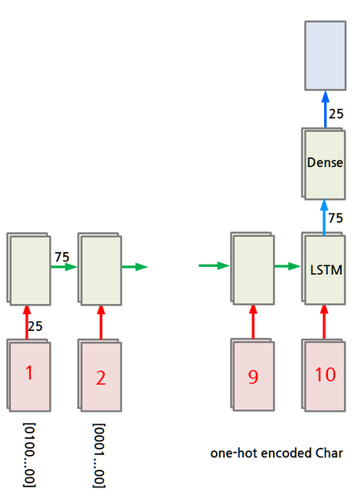
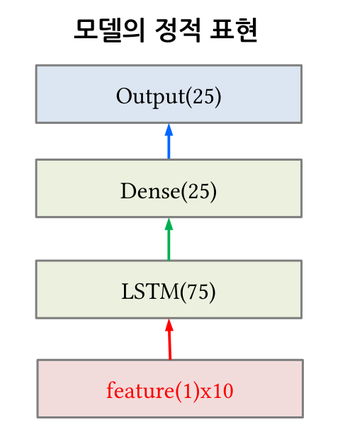
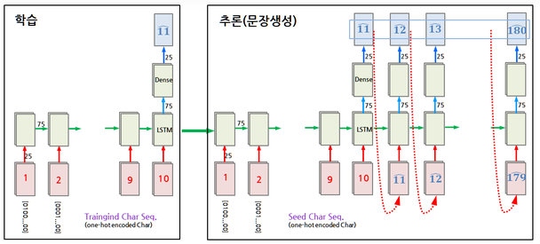
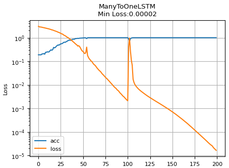
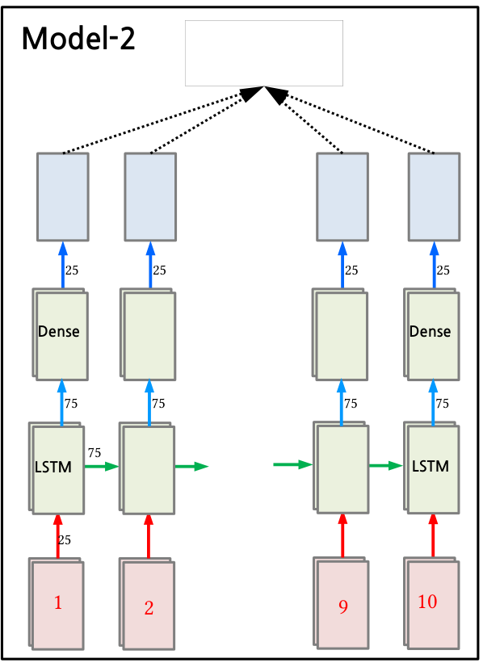

# 5.4 RNN Model Design (Char-RNN)

**학습 목표**

- Char-RNN 이 문장 생성을 "다음 문자를 맞히는 분류 문제"로 바꾸어 학습하는 원리를 설명할 수 있다.
- 한 문장에서 (samples, timesteps, features) 형태의 입력 시퀀스와 many to one · many to many 용 target 을 만들 수 있다.
- LSTM 과 Linear 층으로 many to one 모델을 Lightning 으로 정의하고, 파라미터 수를 손으로 계산해 summary 와 맞춰 볼 수 있다.
- 학습된 모델에 seed 문자열을 넣고 다음 문자를 반복 추론하여 문장을 생성할 수 있다.
- many to one 과 many to many 의 loss 계산 방식 차이와 생성 결과의 차이를 설명할 수 있다.

**이 절의 구성**

- 5.4.1 Char-RNN 개요와 4가지 모델
- 5.4.2 Dataset 준비 — 문자 indexing 과 학습용 시퀀스
- 5.4.3 Model-1 설계 — many to one
- 5.4.4 Model-1 정의 · summary · 학습
- 5.4.5 Model-1 문자열 생성
- 5.4.6 Model-2 — many to many
- 5.4.7 정리

---

## 5.4.1 Char-RNN 개요와 4가지 모델
<!-- 슬라이드 466~467 -->

시퀀스를 처리하는 RNN 모델 설계를 Char-RNN 모델을 통해 익힌다. Char-RNN 은 **문장을 학습하여 새로운 문장을 생성하는 모델**이다. 단어가 아니라 문자(character) 하나하나를 시퀀스의 원소로 보기 때문에 어휘 사전이 필요 없고, 짧은 문장 하나로도 모델의 동작을 끝까지 따라가 볼 수 있다.

실습의 개요는 다음과 같다. 180자 길이의 문장 하나로 RNN 을 training 한다.

1. 주어진 문장으로 문자 시퀀스(char sequence)를 만들고,
2. LSTM 으로 모델을 훈련시킨 뒤,
3. 10개의 임의 문자를 seed sequence 로 하여 11번째 문자부터 차례로 이어 붙여 170개의 문자를 예측한다.

입력도 출력도 문자이므로 이 문제는 회귀가 아니라 **classification 문제**다. 다음에 올 문자를 "문자 집합 가운데 하나"로 고르는 것이기 때문에 문자를 one-hot coding 해서 다루어야 한다.

같은 데이터로 네 가지 모델을 설계해 본다.

- **Model-1 : many to one** — 10개의 입력 문자로 다음 1개의 문자를 예측한다.
- **Model-2 : many to many** — 10개의 입력 문자로 각각의 다음 문자 10개를 예측한다.
- **Model-3 : many to many + stateful** — batch 단위로 state 를 초기화하지 않는다.
- **Model-4 : many to many + stateful + batch_size=2** — stateful 에 더해 두 개의 batch 를 사용한다.

이 절에서는 이 가운데 Model-1 과 Model-2 를 코드로 구현하고 생성 결과를 비교한다.

### 모델의 기본 구조

모델의 뼈대는 LSTM 층 하나와 Dense(Linear) 층 하나다.

- **입력** : one-hot coding 된 10개의 문자열. shape 는 (samples, timesteps, features) 이고, 문자 집합이 25개이면 (samples, 10, 25) 가 된다.
- **LSTM layer** : 75개의 unit.
- **Dense layer** : LSTM 출력을 받아서 25개를 출력한다. activation 으로 softmax 를 사용하는데, classification 문제이므로 출력을 확률로 변환하기 위해서다. loss function 은 CrossEntropy 를 사용한다.

아래 그림은 이 모델을 시간 축으로 펼친 **동적 표현**이다. 1번째부터 10번째 문자가 one-hot 벡터(25차원)로 각 time step 의 LSTM 셀에 들어가고, 셀 사이에는 75차원의 hidden state 가 전달된다. 마지막 step 의 LSTM 출력(75)만 Dense 로 올라가 25개의 출력이 된다.



같은 모델을 층의 순서로만 적은 **정적 표현**은 다음과 같다.

| 층 | 크기 |
|---|---|
| Output | 25 |
| Dense | 25 |
| LSTM | 75 |
| feature(25) x 10 | 입력 (10 step x 25 one-hot) |

---

## 5.4.2 Dataset 준비 — 문자 indexing 과 학습용 시퀀스
<!-- 슬라이드 468~472 -->

### 실습 5.4.1 — Char-RNN 모델 설계
<!-- 슬라이드 468~472 -->

> 노트북: `code/5.4.1.CharRNN.ipynb`
> [](https://colab.research.google.com/github/AI-BoostCamp/intermediate-deep-learning-pytorch/blob/main/code/5.4.1.CharRNN.ipynb)

이 실습은 절 전체에 걸쳐 이어진다. 먼저 Dataset 을 만들고, 이어서 Model-1(many to one)과 Model-2(many to many)를 차례로 정의·학습·생성한다. 사용하는 모듈은 다음과 같다.

```python
import torch
from torch import nn
from torch.nn import functional as F
from torchmetrics import functional as FM
from torch.utils.data import Dataset, DataLoader
from torchinfo import summary

import lightning as L
from lightning.pytorch import Trainer
from lightning.pytorch.callbacks import ModelCheckpoint
from lightning.pytorch.loggers import CSVLogger

import numpy as np
import pandas as pd
import matplotlib.pyplot as plt
```

### 학습할 문장과 문자 indexing

학습할 180자의 문장을 하나 정의한다. 문장 전체가 곧 학습 데이터다.

```python
# 학습할 문장
sentence = ("if you want to build a ship, don't drum up people together to "
            "collect wood and don't assign them tasks and work, but rather "
            "teach them to long for the endless immensity of the sea.")
print ("FOLLOWING IS OUR TRAINING SEQUENCE:")
print (sentence)
print ("Length of 'test sentence' is %s" %len(sentence))
```

신경망은 문자를 직접 받을 수 없으므로 문장에 포함된 문자를 숫자로 mapping 한다. `set(sentence)` 로 문장에 등장하는 서로 다른 문자를 모으면 알파벳·공백·쉼표·따옴표·마침표를 합쳐 25개가 나오고, `enumerate` 로 각 문자에 0 부터 번호를 붙여 `char_dic` 을 만든다. 이것이 **문자 indexing** 이다. `set` 은 순서를 보장하지 않으므로 어떤 문자가 몇 번이 되는지는 실행할 때마다 달라질 수 있지만, 학습과 생성에서 같은 `char_dic` 을 쓰는 한 문제가 되지 않는다.

```python
# make charater dictionary
char_set = list(set(sentence)) # char set 생성
char_dic = {w: i for i, w in enumerate(char_set)}
print ("CHARACTERS: ")
print (len(char_set))
print (char_set)
print ("DICTIONARY: ")
print (len(char_dic))
print (char_dic)
```

이어서 모델 설계에 쓰는 변수를 설정한다. 입력의 차원 `data_dim` 과 분류할 클래스 수 `num_classes` 는 모두 문자 집합의 크기(25)이고, 한 시퀀스의 길이 `sequence_length` 는 임의로 10 으로 잡는다. `features = 1` 은 각 time step 의 입력이 문자 index 하나라는 뜻이다.

```python
data_dim    = len(char_set) # train data X:input
num_classes = len(char_set) # trian data Y:target
sequence_length = 10        # any arbitrary number
features = 1                # X,Y index
print ('data_dim : %d' %data_dim)
print ('num_classes : %d' %num_classes)
```

### 학습용 sequence 생성

문장 위로 길이 10 의 창을 한 글자씩 밀면서 입력 시퀀스 `dataX` 와 target 시퀀스 `dataY` 를 만든다.

- **Input sequence `dataX`** : 문장을 10개 단위로 잘라 입력 시퀀스를 만든다. 180자 문장에서 창을 `len(sentence) - sequence_length` 번 옮길 수 있으므로 170개의 시퀀스가 나온다.
- **Target sequence `dataY`** : 입력 시퀀스를 한 글자 뒤로 민 것, 즉 `dataX[1:] + 다음 문자` 다. 입력의 두 번째 글자부터 시작해 입력 바로 다음 글자로 끝나므로, 각 step 의 target 은 "그 step 입력의 다음 문자"가 된다.

```python
dataX = []  # input sequence list
dataY = []  # target sequence list

# we will make 170 sequences
for i in range(0, len(sentence) - sequence_length):
    # 10 characters = 1 training sequence
    x_str = sentence[i : i+sequence_length]
    y_str = sentence[i+1 : i+sequence_length+1]
    # convert x, y str to index(int)
    x_idx = [char_dic[c] for c in x_str]
    y_idx = [char_dic[c] for c in y_str]
    # append to dataset list
    dataX.append(x_idx)
    dataY.append(y_idx)

    # monitoring
    if i<5:
        print ("[%3d/%3d] [%s]=>[%s]" % (i, len(sentence), x_str, y_str))
        print ("%s%s=>%s" % (' '*10, x_idx, y_idx))
```

앞의 몇 개를 출력해 확인하면 문자열 쌍과 그것을 index 로 바꾼 쌍이 함께 보인다. `if you wan` 의 target 이 `f you want` 인 것처럼 target 은 입력을 한 글자 밀어 놓은 것이다(index 값은 `char_dic` 이 만들어진 순서에 따라 달라진다).

```text
[  0/180] [if you wan]=>[f you want]
          [3, 22, 15, 11, 6, 7, 15, 1, 10, 20]=>[22, 15, 11, 6, 7, 15, 1, 10, 20, 16]
[  1/180] [f you want]=>[ you want ]
          [22, 15, 11, 6, 7, 15, 1, 10, 20, 16]=>[15, 11, 6, 7, 15, 1, 10, 20, 16, 15]
...
```

### Data shape 변환

list 로 모은 시퀀스를 ndarray 로 바꾸고, RNN 이 요구하는 (samples, seq., features) 3차원 shape 로 맞춘다. target 은 두 가지를 만든다.

- **X : (170, 10, 1)** — (samples, seq., features). 170개 시퀀스, 각 10 step, step 마다 index 1개.
- **Y : (170, 10, 1)** — X 와 같은 모양. step 마다 다음 문자가 들어 있으므로 **many to many 모델**에서 사용한다.
- **Y1 : (170, 1)** — 각 시퀀스의 마지막 target 문자만 뽑은 것. 10개를 보고 다음 1개를 맞히는 **many to one 모델**에서 사용한다.

```python
X = np.array(dataX)   # ndarray(170,10)<-[170,10]
X = np.reshape(X,(X.shape[0],X.shape[1],features))
ps(X,'X') # (170,10,1)

# Target tensor 생성 # ndarray(170,10,1)<-[170,10]
Y = np.array(dataY)   # (170,10)<-[170,10]
Y = Y= np.reshape(Y,(Y.shape[0],Y.shape[1],features))
ps(Y,'Y') # (170,10,1)

Y1 = np.array(dataY)[:,-1]  # 마지막 문자만, (170,)<-[170,10]
Y1= np.reshape(Y1,(Y1.shape[0],features)) # (170,1)
ps(Y1,'Y1') # (170,1)
```

`ps()` 와 뒤에 나오는 `p()` 는 노트북 첫머리에 정의된 작은 도우미로, 변수의 shape · type · 값을 찍어 준다. `np.array(dataY)[:, -1]` 은 (170, 10) 배열의 마지막 열만 취해 (170,) 을 만들고, 이를 다시 (170, 1) 로 reshape 한다.

### shape 정리 — list 와 ndarray

여기서 shape 표기를 한 번 정리해 둔다. 같은 숫자 1, 2, 3 을 두고도 표현이 여러 가지다.

| 표현 | 모양 | 비고 |
|---|---|---|
| Vector 표현 | (1, 2, 3) | |
| 행렬 표현 | [1 2 3] | |
| List 표현 | [1, 2, 3] | 파이썬 list. 행렬이 아니므로 shape 이 없다 |
| ndarray 표현 | [1 2 3] 또는 array([1, 2, 3]) | `np.array(list)` 로 만든다. n-dim 행렬을 가진다 |

`np.array` 는 n 차원 행렬이고, 그 **shape 는 tuple `( , )` 로 표현**한다. 값이 하나뿐이면 `(n,)` 처럼 뒤에 쉼표를 남긴 tuple 로 쓴다. 다음 셀은 같은 ndarray 를 `print` 한 것(values)과 그냥 평가한 것(contents)의 차이를 보여 준다.

```python
na = np.array([1,2,3,4,5])
print(na)                   # value를 print
na                          # 무엇인지 보여줌(contents)
```

`print(na)` 는 값만 `[1 2 3 4 5]` 로 찍고, `na` 는 그 객체가 무엇인지 `array([1, 2, 3, 4, 5])` 로 보여 준다. 반면 list 는 `print(list_)` 나 `list_` 나 똑같이 `[1, 2, 3, 4, 5]` 다. 쉼표 없이 나열되면 ndarray, 쉼표가 있으면 list 라고 읽으면 된다.

같은 5개 값을 여러 shape 로 reshape 해 보면 대괄호의 깊이가 차원 수와 어떻게 대응하는지 보인다.

```python
list_ = [1,2,3,4,5]
# list는 shape을 표현할 수 없음(행렬이 아님)
p(list_)                   # [1,2,3,4,5]         shape(x)
na = np.array(list_)
p(na)                      # [1 2 3 4 5]         (5,)
p(np.reshape(na,(5,1)))    # [[1][2][3][4][5]]   (5,1)
p(np.reshape(na,(1,5)))    # [[1 2 3 4 5]]       (1,5)
p(np.reshape(na,(1,5,1)))  # [[[1][2][3][4][5]]] (1,5,1)
p(np.reshape(na,(1,5,1,1)))# [[[[1]][[2]][[3]][[4]][[5]]]]
p(np.reshape(na,(1,1,5,1)))# [[[[1][2][3][4][5]]]]
p(np.squeeze(np.reshape(na,(1,5,1))))# [1 2 3 4 5] (5,)
```

(5, 1) 은 5행 1열, (1, 5) 는 1행 5열이며, (1, 5, 1) 은 sample 1개 · step 5개 · feature 1개로 읽는다 — 바로 뒤에서 모델에 넣을 (1, 10, 1) 과 같은 꼴이다. `np.squeeze` 는 크기가 1인 축을 모두 지워 (5,) 로 되돌린다.

### Custom Dataset 과 DataLoader

ndarray 를 PyTorch 학습 루프에 넣기 위해 `Dataset` 을 상속한 `CustomDataset` 을 정의한다. `__len__` 은 시퀀스 개수(170)를 돌려주고, `__getitem__` 은 `idx` 번째 입력과 target 을 `FloatTensor` 로 바꿔 돌려준다.

```python
class CustomDataset(Dataset):
    def __init__(self, x, y):
        super().__init__()
        self.x = x
        self.y = y
    def __len__(self):
        return len(self.x)
    def __getitem__(self, idx):
        return torch.FloatTensor(self.x[idx]), torch.FloatTensor(self.y[idx])

trainDataset = CustomDataset(X, Y1)
trainDataLoader = DataLoader(trainDataset, shuffle=True,
                             drop_last=False, batch_size=1)

trainDataset_many = CustomDataset(X, Y)
trainDataLoader_many = DataLoader(trainDataset_many, shuffle=True,
                                  drop_last=False, batch_size=1)
```

Dataset 과 DataLoader 를 두 벌 만드는 이유는 target 이 다르기 때문이다. `trainDataLoader` 는 (X, Y1) 쌍으로 many to one 모델에, `trainDataLoader_many` 는 (X, Y) 쌍으로 many to many 모델에 쓴다. 둘 다 `batch_size=1` 이므로 한 epoch 에 170 step 을 돌고, `shuffle=True` 로 시퀀스 순서를 섞는다.

---

**⟨ Model-1 ⟩ many to one**

> 10개의 문자를 읽고 다음 문자 하나를 맞히는 기본 모델이다. 설계 → 정의와 summary → 학습 → 문자열 생성의 순서로 진행한다.

---

## 5.4.3 Model-1 설계 — many to one
<!-- 슬라이드 473~474 -->

Model-1 은 many to one 기본 모델이다. 앞의 기본 구조에서 입력 표현만 달라진다.

- **입력** : 10개의 문자열 index. one-hot coding 은 하지 않는다. shape 는 (samples, timesteps, features) = **(samples, 10, 1)** 로, 각 step 의 feature 가 index 값 하나다.
- **LSTM layer** : 75개의 unit.
- **Dense layer** : LSTM 출력을 받아서 25개를 출력한다. 이 출력은 index 가 아니다.

모델이 정상적으로 출력하려면 x, y 를 index 로 넣어 주어야 한다. Model 의 출력은 **logit 값**이고, loss function 은 `torch.nn.functional.cross_entropy(logits, target)` 을 쓴다. target 은 index 또는 probability 로 줄 수 있다. classification 문제이므로 확률에 대한 loss 를 계산해야 하는데, cross_entropy 가 내부에서 logit 에 softmax 를 적용하므로 모델 안에 softmax 층을 따로 두지 않는다.

| 층 | 크기 |
|---|---|
| Output | 25 |
| Dense | 25 |
| LSTM | 75 |
| feature(1) x 10 | 입력 (10 step x index 1) |



### 학습 후 추론 — 문자열 생성

학습과 추론은 같은 모델을 다르게 쓴다.

1. 10개의 문자 시퀀스로 모델 학습을 완료한다.
2. 10개의 seed 문자를 넣어 11번째 문자를 추론한다.
3. 11번째 문자를 포함한 (2번째부터 11번째까지의) 10개 문자를 넣어 12번째 문자를 추론한다.
4. 이를 반복하여 180문자의 문장을 생성한다.

즉 추론 단계에서는 모델이 방금 출력한 문자가 다음 입력의 마지막 자리로 되먹임된다. 아래 그림의 왼쪽은 1\~10번째 문자로 11번째를 맞히는 학습 단계이고, 오른쪽은 seed 문자열에서 시작해 11, 12, 13, … 을 차례로 추론하며 180번째까지 이어 가는 추론 단계다. 붉은 점선이 추론된 문자가 다시 입력으로 들어가는 흐름이다.



---

## 5.4.4 Model-1 정의 · summary · 학습
<!-- 슬라이드 475~477 -->

### Model-1 define

`ManyToOneLSTM` 을 `LightningModule` 로 정의한다. `nn.LSTM(features, hidden_dim, batch_first=True)` 는 입력 (bs, timesteps, features) 를 받아 (bs, timesteps, units) 를 내놓는다. **many to one 의 핵심은 `forward` 의 `out[:, -1, :]`** 이다 — 10개 step 출력 중 마지막 step 의 (bs, units) 만 골라 Linear 에 넣으므로 결과가 (bs, num_classes) 가 된다.

```python
hidden_dim = 75

class ManyToOneLSTM(L.LightningModule):
    def __init__(self, batch_first=True):
        super(ManyToOneLSTM, self).__init__()
        self.lstm = nn.LSTM(features, hidden_dim,
                            batch_first=batch_first)
        self.linear = nn.Linear(hidden_dim, num_classes)

    def forward(self, x):
        out, (hn, cn) = self.lstm(x)    #(bs,timesteps,units)
        out = self.linear(out[:, -1, :])#(bs,num_classes)<-(bs,units)
        return out

    def training_step(self, batch, batch_idx):
        x, y = batch
        y_hat = self(x)       #(bs, num_classes)
        y = y.squeeze(dim=-1) #(bs,)<-(bs,1)
        loss = F.cross_entropy(y_hat, y.long())
        acc = FM.accuracy(y_hat, y, task='multiclass', num_classes=25 )
        metrics = {'loss':loss, 'acc':acc}
        self.log_dict(metrics,prog_bar=True,on_step=False,on_epoch=True)
        return loss

    def configure_optimizers(self):
        return torch.optim.Adam(self.parameters())

model = ManyToOneLSTM()

inputs = torch.zeros(2,sequence_length,features)
output = model(inputs) #(2,25)
ps(output)
summary(model, input_size=(2, sequence_length, features))
```

`training_step` 에서 target `y` 는 DataLoader 에서 (bs, 1) 로 오므로 `squeeze(dim=-1)` 로 (bs,) 로 만들고, `cross_entropy` 가 class index 를 요구하므로 `long()` 으로 정수형으로 바꾼다. 즉 target 은 **index 로 처리**한다. accuracy 는 `torchmetrics` 의 multiclass 정확도로 계산하고, `log_dict(on_step=False, on_epoch=True)` 로 epoch 단위 평균만 기록한다. 마지막 두 줄은 (2, 10, 1) 짜리 더미 입력을 넣어 출력이 (2, 25) 로 나오는지 확인하고 `torchinfo.summary` 로 층별 shape 와 파라미터 수를 찍는다.

### Model summary

summary 결과는 다음과 같다.

| Layer (type:depth-idx) | Output Shape | Param # |
|---|---|---|
| ManyToOneLSTM | -- | -- |
| LSTM: 1-1 | [2, 10, 75] | 23,400 |
| Linear: 1-2 | [2, 25] | 1,900 |
| Total params | | 25,300 |
| Trainable params | | 25,300 |
| Non-trainable params | | 0 |
| Total mult-adds (M) | | 0.47 |

파라미터 수를 손으로 계산해 보면 summary 와 일치한다. LSTM 은 forget · input · output · cell 의 네 가지 가중치 $W_{forget}, W_{input}, W_{output}, W_{cell}$ 을 가지며, 각각 입력과 이전 출력(hidden = output)을 받고 bias 를 두 개 가진다.

$$
\text{LSTM param \#} = 4 \times \text{hidden\_state} \times (\text{inputs} + \text{outputs} + \text{bias}(2))
= 4 \times 75 \times (1 + 75 + 2) = 23{,}400
$$

여기서 4 는 $W_{forget}, W_{input}, W_{output}, W_{cell}$ 의 네 벌이고, inputs = 1 (feature), outputs = hidden = 75 이다. bias 가 2 인 것은 PyTorch 의 LSTM 이 입력 쪽 bias 와 hidden 쪽 bias 를 따로 두기 때문이다. Dense(Linear) 층은 입력에 bias 하나를 더한 수에 출력 수를 곱한다.

$$
\text{Dense param \#} = (\text{inputs} + \text{bias}(1)) \times \text{outputs} = (75 + 1) \times 25 = 1{,}900
$$

### Model Train

학습은 Lightning `Trainer` 에 맡긴다. `ModelCheckpoint(monitor='loss')` 가 loss 가 가장 낮은 epoch 의 가중치를 `./aicamp` 에 저장하고, `CSVLogger` 가 epoch 마다 metrics 를 csv 로 남긴다. 200 epoch 학습 뒤 best checkpoint 를 다시 불러와 `eval()` 모드로 둔다. 학습 데이터는 (X, Y1) 을 담은 `trainDataLoader` 이고, DataLoader 의 **batch_size**(여기서는 1)가 한 epoch 의 step 수를 정한다.

```python
model = ManyToOneLSTM()
name = "ManyToOneLSTM"

checkpoint_callback = ModelCheckpoint(dirpath='./aicamp', monitor='loss')
logger = CSVLogger("logs", name=name)
trainer = Trainer(max_epochs=200, logger=logger,callbacks=[checkpoint_callback])
trainer.fit(model, trainDataLoader)

checkpoint = torch.load(checkpoint_callback.best_model_path)
model.load_state_dict(checkpoint['state_dict'])
model.eval()
```

CSVLogger 가 남긴 `metrics.csv` 를 읽어 epoch 별 마지막 값으로 정리하고 acc 와 loss 를 함께 그린다. loss 의 변화 폭이 크므로 y 축은 log 스케일(`semilogy`)로 둔다.

```python
v_num = logger.version
history = pd.read_csv(f'./logs/{name}/version_{v_num}/metrics.csv')
df = history.groupby('epoch').last().drop('step', axis=1)

plt.title(f"{name}\nMin Loss:{df['loss'].min():.5f}")
plt.plot(df['acc'], label='acc')
plt.plot(df['loss'], label='loss')
plt.semilogy()
plt.grid()
plt.legend()
plt.ylabel('Loss')
plt.show()
```

학습 곡선을 보면 acc 는 50 epoch 부근에서 1.0 에 도달해 그대로 유지되고, loss 는 log 스케일에서 꾸준히 내려가다가 100 epoch 근처에서 한 번 크게 튀어 오른 뒤 다시 내려가 최소 0.00002 에 이른다. 170개 시퀀스를 모두 외울 만큼 작은 데이터이므로 학습 정확도가 1.0 까지 가는 것은 자연스럽다.



---

## 5.4.5 Model-1 문자열 생성
<!-- 슬라이드 478~480 -->

### 생성 함수 정의 — generate_seq

학습된 모델의 prediction 으로 문자열을 만든다. `generate_seq` 는 10개의 seed 문자를 시작으로 n 개의 문자열을 생성하는 함수다.

- `model` : 생성에 쓸 model object(학습된 모델)
- `char_dic` : dictionary (`'char' : index`)
- `seq_length` : 10
- `seed_text` : 생성 모델의 시동을 걸기 위한 10개의 문자열
- `n_chars` : 생성하고자 하는 문자열 수
- **Return** `in_text` : `seed_text` + 생성된 text

```python
# 문자열 생성하기
def generate_seq(model, char_dic, seq_length, seed_text, n_chars):
    in_text = seed_text    # seed 문자열 + 생성 문자
    # 생성할 문자열의 수 = n_chars
    for i in range(n_chars):
        # 문자 encode : 문자 -> int
        encoded = [char_dic[char] for char in in_text]
        # 뒷부분 10자만 사용
        encoded = encoded[-sequence_length:]
        encoded = np.array(encoded)
        # Tensor(1,10,1) <- np(1,10)
        encoded = torch.FloatTensor(np.reshape(encoded,(1,seq_length,1)))
        # 다음문자 추론
        model.eval()
        yhat = model(encoded)  # yhat.shape=(1,25): class 확률
        yhat = np.argmax(yhat.detach().numpy(), axis=1) # index <- pb.
        # 문자 디코딩 : integer -> character
        for char, index in char_dic.items():
            if index == yhat:
                break
        in_text += char    # 문자열에 추가
    return in_text
```

### For loop — 문자 생성 routine

for 루프 한 바퀴가 문자 하나를 생성한다. 순서대로 따라가면 다음과 같다.

1. `in_text` 의 문자를 `char_dic` 으로 index(숫자)로 바꾼다.
2. 그 가운데 **마지막 10개**만 얻는다. `in_text` 는 한 바퀴마다 한 글자씩 길어지므로 항상 끝의 10자만 쓴다.
3. ndarray (1, 10) 을 Tensor (1, 10, 1) 로 바꾼다. 모델이 학습 때 받던 (samples, time_steps, features) 를 그대로 유지해야 하므로 sample 1개 · step 10개 · feature 1개다.
4. `model(encoded)` 로 10개의 index 시퀀스를 넣고 25개의 값(char 별 확률에 해당하는 logit)을 얻는다. 입력값 `encoded` 의 shape 는 (1, 10, 1) 이다.
5. `np.argmax` 로 가장 큰 값의 위치(index)를 얻는다. 가장 확률이 높은 문자를 고르는 것이다.
6. 얻은 index 를 `char_dic` 을 거꾸로 뒤져 문자로 바꾸고 `in_text` 에 붙인 뒤 반복한다.

세 가지 seed 로 200자를 생성해 본다. 첫 번째는 문장의 첫머리, 두 번째는 문장 중간, 세 번째는 원문에 없는 문자열이다.

```python
# test start of rhyme
print('Trigger characters: "want to bu "\nResult: \n"{}"'.format(
      generate_seq(model, char_dic, sequence_length, 'want to bu', 200)))
# test mid-line
print('\nTrigger characters: "collect wo"\nResult: \n"{}"'.format(
      generate_seq(model, char_dic, sequence_length, 'collect wo', 200)))
# test not in original
print('\nTrigger characters: "abbcr than"\nResult: "{}"'.format(
      generate_seq(model, char_dic, sequence_length, 'abbcr than', 200)))
```

### 생성된 문자열 결과

200 epoch 학습한 Model-1 의 결과다.

```text
Trigger characters: "want to bu"
Result:
"want to build a ship, don't drum up people together to collect wood and
don't assign them tasks and work, but rather teach them to long for the
endless immensity of the sea. eon wood and don't assign them tasks"

Trigger characters: "collect wo"
Result:
"collect wood and don't assign them tasks and work, but rather teach them
to long for the endless immensity of the sea. eon wood and don't assign
them tasks and work, but rather teach them to long for the endles"

Trigger characters: "abbcr than"
Result:
"abbcr thanhimttaagh them to long for the endless immensity of the sea.
eon wood and don't assign them tasks and work, but rather teach them to
long for the endless immensity of the sea. eon wood and don't assig"
```

학습 문장 안의 seed(`want to bu`, `collect wo`)를 주면 원문을 그대로 이어 간다. 문장 끝 `the sea.` 다음에는 학습한 적이 없는 상황이므로 `eon wood and …` 처럼 잠시 이상한 문자열을 낸 뒤 다시 원문의 한 대목으로 되돌아온다. 원문에 없는 seed(`abbcr than`)에서는 `himttaagh` 처럼 의미 없는 문자가 이어지다가 `them to long for …` 로 원문에 합류한다. 모델이 10자 문맥만 보므로 문맥이 원문의 어느 대목과 비슷해지면 그 뒤를 외운 대로 재생하는 것이다.

---

**⟨ Model-2 ⟩ many to many**

> 같은 LSTM 을 쓰되 10개 step 의 출력을 모두 학습에 쓰는 모델이다. target 은 (X, Y) 쌍의 `trainDataLoader_many` 를 쓴다.

---

## 5.4.6 Model-2 — many to many
<!-- 슬라이드 481~482 -->

### Model-2 정의

Model-2 는 many to many 모델이다. LSTM layer 는 Model-1 과 같지만, **각 step 의 출력이 모두 loss 산출에 참여**한다. 시간 축으로 펼쳐 보면 1번째 문자를 받은 LSTM 셀의 출력이 Dense 를 거쳐 2번째 문자의 예측 $\hat{2}$ 가 되고, 2번째 문자를 받은 셀은 $\hat{3}$ 을, 10번째 문자를 받은 셀은 $\hat{11}$ 을 낸다. 이렇게 얻은 $\hat{2}, \hat{3}, \dots, \hat{10}, \hat{11}$ 열 개의 예측이 target Y 의 열 개 문자와 각각 비교되어 하나의 $Loss$ 로 합쳐진다. Model-1 이 마지막 step 의 $\hat{11}$ 하나만으로 loss 를 계산하던 것과 대비된다.



| step | 입력 문자 | LSTM → Dense 출력 | 비교 대상(target) |
|---|---|---|---|
| 1 | 1번째 | $\hat{2}$ | 2번째 문자 |
| 2 | 2번째 | $\hat{3}$ | 3번째 문자 |
| … | … | … | … |
| 9 | 9번째 | $\hat{10}$ | 10번째 문자 |
| 10 | 10번째 | $\hat{11}$ | 11번째 문자 |

코드에서 달라지는 곳은 두 군데다. `forward` 에서 `out[:, -1, :]` 대신 LSTM 출력 (bs, 10, 75) 전체를 Linear 에 넣어 (bs, 10, 25) 를 돌려주고, `training_step` 에서 step 마다 `cross_entropy` 와 accuracy 를 계산해 더한 뒤 `sequence_length` 로 나누어 시퀀스 평균을 구한다.

```python
hidden_dim = 75
class ManyToManyLSTM(L.LightningModule):
    def __init__(self, batch_first=True):
        super(ManyToManyLSTM, self).__init__()
        self.lstm = nn.LSTM(features, hidden_dim, batch_first=batch_first)
        self.linear = nn.Linear(hidden_dim, num_classes) #(bs,10,25)

    def forward(self, x):
        out, (hn, cn) = self.lstm(x)
        out = self.linear(out)
        return out #(bs,10,25)

    def training_step(self, batch, batch_idx):
        x, y = batch    # y:(bs,10,1)
        y_hat = self(x) # (bs,10,25)
        y = y.squeeze(dim=-1) #(bs,10)
        loss = acc = 0.0
        for i in range(x.shape[1]): # seq.에 대한 평균 구하기
            loss += F.cross_entropy(y_hat[:, i, :], y[:, i].long())
            acc += FM.accuracy(y_hat[:, i, :], y[:, i],task='multiclass', num_classes=num_classes )
        loss /= sequence_length
        acc /= sequence_length
        metrics={'loss':loss, 'acc':acc}
        self.log_dict(metrics,prog_bar=True,on_step=False,on_epoch=True)
        return loss

    def configure_optimizers(self):
        return torch.optim.Adam(self.parameters())

model = ManyToManyLSTM()
summary(model, input_size=(2, sequence_length, features))
```

`nn.Linear` 는 마지막 차원에만 작용하므로 (bs, 10, 75) 를 넣으면 step 마다 같은 가중치가 적용되어 (bs, 10, 25) 가 나온다. `y_hat[:, i, :]` 는 i 번째 step 의 (bs, 25) logit 이고 `y[:, i]` 는 그 step 의 target index 다. 층 구성이 Model-1 과 같으므로 파라미터 수도 25,300 으로 같다 — 달라진 것은 출력을 몇 개 쓰느냐뿐이다.

학습 절차는 Model-1 과 동일하며, DataLoader 만 (X, Y) 를 담은 `trainDataLoader_many` 로 바꾼다.

```python
model = ManyToManyLSTM()
name = "ManyToManyLSTM"

checkpoint_callback = ModelCheckpoint(dirpath='./aicamp', monitor='loss')
logger = CSVLogger("logs", name=name)
trainer = Trainer(max_epochs=200, logger=logger,callbacks=[checkpoint_callback])
trainer.fit(model, trainDataLoader_many)

checkpoint = torch.load(checkpoint_callback.best_model_path)
model.load_state_dict(checkpoint['state_dict'])
model.eval()
```

### 생성 함수 수정

Model-2 는 (1, 10, 25) 의 **확률 시퀀스**를 돌려주므로 생성 함수도 그에 맞게 고쳐야 한다. `argmax` 를 마지막 축(`axis=2`)에 대해 취해 step 별 index 10개를 얻고, 그 가운데 시퀀스의 마지막 값 `yhat[9]` — 10번째 입력 문자 다음에 올 문자 — 만 사용한다. 나머지 흐름은 `generate_seq` 와 같다.

```python
# 문자열 생성하기
def generate_seq2(model, char_dic, seq_length, seed_text, n_chars):
    in_text = seed_text    # seed 문자열 + 생성 문자
    for i in range(n_chars):
        # 문자 encode : 문자 -> int
        encoded = [char_dic[char] for char in in_text]
        # 문자열 크기 조정 : max보다 크면 앞부분 제거
        encoded = encoded[-sequence_length:]
        encoded = np.array(encoded)
        # Tensor(1,10,1) <- np(1,10)
        encoded = torch.FloatTensor(np.reshape(encoded,(1,seq_length,1)))
        # 다음문자 추론
        yhat = model(torch.FloatTensor(encoded))  ## yhat.shape=(1,10,25):확률 시퀀스
        yhat = np.argmax(yhat.cpu().detach().numpy(), axis=2) # (1,10)<-(1,10,25)
        yhat = np.squeeze(yhat)        # (10,) <- (1,10)
        # 문자 디코딩 : integer -> character
        for char, index in char_dic.items():
            if index == yhat[9]:         # 시퀀스에서 마지막 값을 사용
                break
        in_text += char    # 문자열에 추가
    return in_text
```

### 생성된 문자열 결과

같은 세 seed 로 200자를 생성한 Model-2 의 결과다.

```text
Trigger characters: "want to bu"
Result:
"want to build a ship, don't drum up people together to collect wood and
don't assign them tasks and work, but rather teach them to long for the
endless immensity of the sea.ddon't assign them tasks and work, bu"

Trigger characters: "collect wo"
Result:
"collect wood and don't assign them tasks and work, but rather teach them
to long for the endless immensity of the sea.ddon't assign them tasks and
work, but rather teach them to long for the endless immensity o"

Trigger characters: "abbcr than"
Result:
"abbcr than tasks and work, but rather teach them to long for the endless
immensity of the sea.ddon't assign them tasks and work, but rather teach
them to long for the endless immensity of the sea.ddon't assign "
```

Model-1 의 결과와 나란히 놓고 비교하면 차이가 보인다.

| seed | Model-1 (many to one) | Model-2 (many to many) |
|---|---|---|
| `want to bu` | 원문을 재생하다 `the sea.` 뒤에 `eon wood and …` | 원문을 재생하다 `the sea.` 뒤에 `ddon't assign …` |
| `collect wo` | 원문 재생, 문장 끝에서 `eon wood and …` | 원문 재생, 문장 끝에서 `ddon't assign …` |
| `abbcr than` | `himttaagh` 가 이어진 뒤 원문 합류 | 바로 ` tasks and work, …` 로 원문 합류 |

두 모델 모두 학습 문장 안에서는 원문을 그대로 이어 가지만, 문장 끝이나 원문에 없는 seed 처럼 학습하지 않은 문맥을 만났을 때 **Model-1 은 이상한 문자열이 지속되는 경향이 더 많다**. Model-2 는 `the sea.` 뒤에서 `d` 하나만 어긋난 채 곧바로 원문으로 돌아오고, `abbcr than` 에서도 한 글자 뒤에 바로 원문 문구로 합류한다. 10개 step 의 출력이 모두 loss 에 참여하면 시퀀스의 앞부분 step 도 "다음 문자"를 맞히도록 학습되므로, 마지막 step 하나만 학습하는 Model-1 보다 각 step 의 hidden state 가 더 좋은 문맥 표현을 갖게 되는 것이다.

---

## 5.4.7 정리

- Char-RNN 은 문장을 문자 시퀀스로 보고 **다음 문자를 맞히는 classification 문제**로 문장 생성을 학습한다. 문자는 `char_dic` 으로 index 화하고, 출력은 25개 클래스의 logit 이며 loss 는 cross entropy 다.
- 180자 문장 위로 길이 10 의 창을 밀어 170개의 (입력, target) 쌍을 만든다. 입력 X 는 (170, 10, 1), target 은 many to many 용 Y (170, 10, 1) 와 many to one 용 Y1 (170, 1) 두 가지다.
- ndarray 의 shape 는 tuple 로 표현하며, 모델에 넣는 텐서는 학습 때나 생성 때나 (samples, time_steps, features) 를 유지해야 한다.
- **Model-1(many to one)** 은 `out[:, -1, :]` 로 마지막 step 출력만 Dense 에 넣는다. LSTM 파라미터는 $4 \times 75 \times (1 + 75 + 2) = 23{,}400$, Dense 는 $(75 + 1) \times 25 = 1{,}900$ 으로 summary 의 25,300 과 맞는다.
- 문자열 생성은 seed 10자 → 다음 문자 추론 → 끝의 10자로 다시 추론을 반복하는 되먹임 루프다.
- **Model-2(many to many)** 는 10개 step 의 출력 $\hat{2}, \dots, \hat{11}$ 을 모두 loss 에 넣는다. 파라미터 수는 같지만 학습하지 않은 문맥에서 Model-1 보다 빨리 원문으로 되돌아오며, Model-1 은 이상한 문자열이 지속되는 경향이 더 많다.
