# 5.5 RNN Model Design (MNIST-RNN)

**학습 목표**

- 2차원 이미지를 line 의 sequence 로 보아 LSTM 으로 분류하는 many to one 모델을 설계하고, 층마다 입출력 shape 을 코드보다 먼저 예측할 수 있다.
- LSTM 층의 parameter 수를 공식으로 계산하고 `torchinfo.summary` 결과와 맞추어 볼 수 있다.
- LSTM 을 Bidirectional LSTM 으로 바꾸었을 때 shape·parameter·성능이 어떻게 달라지는지 설명할 수 있다.
- 한 LSTM 이 line 안의 pixel 을, 다른 LSTM 이 line 의 흐름을 읽는 Hierarchical RNN 을 PyTorch 로 구현하고, TimeDistributed 동작을 반복문으로 표현할 수 있다.

**이 절의 구성**

- 5.5.1 MNIST 를 RNN 으로 인식하기 — Model-1 설계
- 5.5.2 Model-1 구현 — define · summary · plot (실습 5.5.1)
- 5.5.3 Model-2 — Bidirectional LSTM
- 5.5.4 Model-3 — Hierarchical RNN (실습 5.5.2)
- 5.5.5 실습과제
- 5.5.6 정리

---

## 5.5.1 MNIST 를 RNN 으로 인식하기 — Model-1 설계
<!-- 슬라이드 484~486 -->

MNIST-RNN 은 손글씨 숫자 이미지를 CNN 이 아니라 RNN network 을 통해 인식해 보는 실험이다. 이미지는 2차원 정보다. 그런데 이미지를 위에서 아래로 한 line 씩 읽어 나간다고 생각하면, 각 line 은 28 개 pixel 값으로 이루어진 vector 이고, 28 개 line 이 순서대로 이어지는 하나의 sequence 가 된다. 이 절의 출발 질문은 다음 하나다 — image 를 한 line 씩 보면 인식할 수 있을까?


**Model-1 설계 : many to one 기본 모델**

입력은 사진 1 장(28x28)이다. 이것을 28 line, line 당 28 pixel 로 본다. RNN 의 입력 관례인 `(samples, timesteps, features)` 에 대응시키면 다음과 같다.

- Features = 28 (pixels) — 한 time step 에 들어가는 값의 수, 즉 한 line 의 pixel 수
- Timesteps = 28 (lines) — sequence 의 길이, 즉 line 의 수
- Batch size = 가변

따라서 입력 shape 은 `(None, 28, 28)` 이다. 첫 축의 None 은 batch 크기가 미리 정해져 있지 않다는 뜻이다. 출력은 10 개 숫자에 대한 확률이므로 `(None, 1, 10)` 으로 적는다. sequence 전체(28 line)를 다 읽은 뒤 마지막에 한 번만 답을 내므로 many to one 구조다.

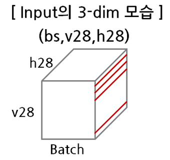

**Layer 와 입출력 shape 예측**

모델을 코드로 옮기기 전에 층마다 shape 을 먼저 예측한다. `v28` 은 세로 방향의 28 line(time step), `h28` 은 가로 방향의 28 pixel(feature), `bs` 는 batch 크기다. 아래 표는 입력에서 출력까지 각 층이 받는 shape 과 내보내는 shape 을 정리한 것이다.

| Layer | 크기 | 입력 shape | 출력 shape |
|---|---|---|---|
| Input | – | X (bs, v28, h28), Y (bs, ) | – |
| Dense | 64 | (bs, v28, h28) | (bs, 28, 64) |
| LSTM | 16 | (bs, 28, 64) | (bs, 16, 1) |
| Dense | 10 | (bs, 16, 1) | (bs, 10, 1) |
| Output | 10 | (bs, 10, 1) | – |

첫 Dense(64) 는 line 하나(28 pixel)를 64 개 feature 로 바꾼다. 28 개 line 각각에 같은 층이 적용되므로 출력은 `(bs, 28, 64)` — line 수는 그대로이고 feature 수만 28 에서 64 로 바뀐다. LSTM(16) 은 이 28 step 의 sequence 를 순서대로 읽고, many to one 이므로 **마지막 step 의 출력 16 개만** 다음 층에 넘긴다. 표에서 `(bs, 16, 1)` 로 적은 것은 "16 개 값이 1 개 time step 만큼" 나온다는 뜻이다. 두 번째 Dense(10) 은 그 16 개 값을 받아 10 개 숫자에 대한 점수 `(bs, 10, 1)` 을 낸다. 아래 그림의 화살표 옆에 적힌 `28,x28`, `64,x28`, `16,x1`, `10,x1` 이 바로 이 표의 shape 을 "값의 수 × time step 수" 로 적은 것이다.

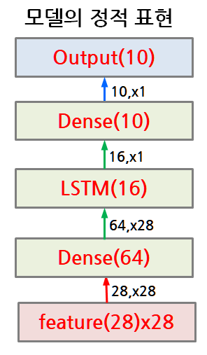

**모델 내부의 Sequence 동작 — 모델의 동적 표현**

위 그림처럼 층을 쌓아 그린 것이 **정적 표현**이라면, 시간축을 따라 펼쳐 그린 것이 **동적 표현**이다. 모델 내부의 sequence 동작은 line 단위로 scan 하듯이 진행된다. 이미지 "3" 의 line 1 부터 line 28 까지 한 줄씩 Dense(64) 에 들어가고, LSTM 은 hidden state(16) 를 다음 step 으로 넘기면서 28 번 동작한다. Dense(64) 와 LSTM 은 28 번 반복해 그려져 있지만 **같은 층이 같은 weight 로 반복 동작**하는 것이지, 층이 28 개 있는 것이 아니다. 마지막 line 을 읽은 뒤의 LSTM 출력만 Dense(10) 으로 올라가 예측값이 된다.

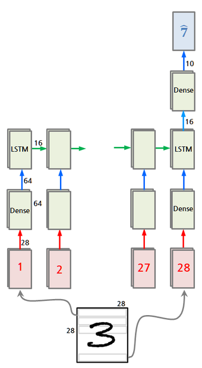

---

## 5.5.2 Model-1 구현 — define · summary · plot
<!-- 슬라이드 487~489 -->

### 실습 5.5.1 — MNIST-RNN (Model-1 · Model-2)

> 노트북: `code/5.5.1.MnistRNN.ipynb`
> [](https://colab.research.google.com/github/AI-BoostCamp/intermediate-deep-learning-pytorch/blob/main/code/5.5.1.MnistRNN.ipynb)

이 노트북은 Model-1(기본 many to one LSTM) 과 Model-2(Bidirectional LSTM) 를 한 파일에서 다룬다. Model-2 는 5.5.3 에서 이어진다.

**데이터 준비**

MNIST 는 `torchvision.datasets.MNIST` 로 받는다. `transforms.ToTensor()` 는 PIL 이미지를 0~1 범위의 float 텐서 `(1, 28, 28)` 로 바꾼다 — 채널 축이 앞에 붙는다는 점을 기억해 두어야 한다. 모델의 `forward` 에서 이 채널 축을 없애 `(bs, 28, 28)` 로 만들기 때문이다. batch 크기는 512 로 하고, 학습용은 섞고 검증용(test)은 섞지 않는다.

```python
import torchvision.transforms as transforms
from torch.utils.data import DataLoader
mnist_transform = transforms.ToTensor()

from torchvision.datasets import MNIST

download_root = './' # ./MNIST
batch_size = 512

train_dataset = MNIST(download_root, transform=mnist_transform, train=True, download=True)
test_dataset = MNIST(download_root, transform=mnist_transform, train=False, download=True)

train_loader = DataLoader(train_dataset, batch_size, shuffle=True, num_workers=4)
test_loader = DataLoader(test_dataset, batch_size, shuffle=False, num_workers=4)
```

loader 에서 batch 하나를 꺼내 shape 을 확인하면 X 는 `(512, 1, 28, 28)`, Y 는 `(512,)` 다. 앞 절에서 예측한 `(bs, v28, h28)` 과 `(bs, )` 에 채널 축 1 이 하나 더 끼어 있는 모습이다.

**주요 변수 정의**

설계에서 정한 수를 변수로 둔다. `features` 와 `time_steps` 는 데이터가 정한 값(28 pixel, 28 line)이고, `in_dense` 와 `lstm_units` 는 설계자가 임의로 고른 값이다. `out_dense` 는 출력이 숫자 0~9 의 확률이므로 10 이다. 이 변수만 바꾸면 모델 크기가 바뀌므로 실습과제에서 units 를 바꿔 볼 때 이 셀을 고친다.

```python
# 주요 변수 정의
features = 28   #pixels
time_steps = 28 #lines
in_dense = 64   # 임의 값
lstm_units = 16 # 임의 값
out_dense = 10    # 출력은 숫자(0~9) 확률
```

**학습 절차를 담는 LightningModule**

모델 class 를 정의하기 전에, 학습·검증 절차를 담은 `Wrap_10` 을 만든다. 이 절의 세 모델은 모두 10 class 분류라서 학습 절차가 같으므로, 절차를 한 번만 써 두고 모델 class 가 이를 상속한다. `training_step` 은 batch 를 받아 모델을 통과시키고(`self.to(device)(x)`), cross entropy 손실과 torchmetrics 의 multiclass accuracy 를 계산해 epoch 단위로 기록한다. `validation_step` 도 같은 일을 `val_loss`, `val_acc` 라는 이름으로 한다. optimizer 는 Adam, learning rate 0.001 이다. `log_dict(..., on_step=False, on_epoch=True)` 로 기록한 값은 뒤에서 `CSVLogger` 가 `metrics.csv` 로 남기고, 학습 곡선은 이 파일을 읽어 그린다.

```python
class Wrap_10(L.LightningModule):
    def training_step(self, batch, batch_idx):
        x, y = batch
        y_hat = self.to(device)(x)
        y = y.squeeze(dim=-1)
        loss = F.cross_entropy(y_hat, y)
        acc = FM.accuracy(y_hat, y,task='multiclass',num_classes=10 )
        metrics = {'loss':loss, 'acc':acc}
        self.log_dict(metrics,prog_bar=True,on_step=False,on_epoch=True)
        return loss

    def validation_step(self, batch, batch_idx):
        x, y = batch
        logits = self.to(device)(x)
        y = y.squeeze(dim=-1)
        loss = F.cross_entropy(logits, y)
        acc = FM.accuracy(logits, y.long(),task='multiclass',num_classes=10 )
        metrics = {'val_loss':loss, 'val_acc':acc}
        self.log_dict(metrics,prog_bar=True,on_step=False,on_epoch=True)

    def configure_optimizers(self):
        return torch.optim.Adam(self.parameters(), lr=0.001)
```

**Model-1 define**

설계의 핵심은 두 Dense 층의 동작 방식이 다르다는 점이다.

- 첫 번째 Dense layer 는 LSTM 에 연결되므로 **TimeDistributed 로 wrapping** 한다. time_steps 만큼 반복 동작해야 하기 때문이다 — 28 개 line 각각을 같은 weight 로 64 개 feature 로 바꾼다.
- 두 번째 Dense layer 는 LSTM 출력이 마지막에 한 번만 나오므로 TimeDistributed 없이 쓴다. 마지막 time step 에 한 번만 동작한다.

PyTorch 에서는 첫 Dense 를 따로 감쌀 필요가 없다. `nn.Linear` 는 입력 텐서의 **마지막 축에만** 작용하므로 `(bs, 28, 28)` 을 넣으면 앞의 두 축은 그대로 두고 `(bs, 28, 64)` 를 돌려준다. 이것이 곧 28 개 time step 에 같은 Linear 를 반복 적용한 TimeDistributed 동작이다. 반면 LSTM 출력 중 마지막 step 만 골라내는 일은 코드로 직접 적어야 한다 — `out[:, -1, :]` 이 그 부분이다.

```python
class ManyToOneLSTM(Wrap_10):
    def __init__(self, features, in_dense, lstm_units, out_dense, batch_first=True):
        super(ManyToOneLSTM, self).__init__()
        self.inLinear = nn.Linear(features, in_dense)
        self.lstm = nn.LSTM(input_size=in_dense, hidden_size=lstm_units, batch_first=batch_first)
        self.outLinear = nn.Linear(lstm_units, out_dense)

    def forward(self, x):
        x = x.reshape(x.size(0),x.size(2),-1) #(bs,28,28)<-(bs,1,28,28)
        out = self.inLinear(x)                #(bs,28,64)
        out, (hn, cn) = self.lstm(out)
        out = self.outLinear(out[:, -1, :])
        return out

model = ManyToOneLSTM(features, in_dense, lstm_units, out_dense)
summary(model, input_size=(batch_size, 1, time_steps, features))
```

`forward` 를 한 줄씩 따라가면 앞 절의 shape 예측표가 그대로 재현된다.

1. `x.reshape(x.size(0), x.size(2), -1)` — `(bs, 1, 28, 28)` 에서 채널 축을 없애 `(bs, 28, 28)` 로 만든다. 둘째 축이 line(time step), 셋째 축이 pixel(feature) 이다.
2. `self.inLinear(x)` — `(bs, 28, 64)`. line 마다 64 개 feature.
3. `self.lstm(out)` — `batch_first=True` 이므로 `(bs, 28, 16)` 의 전체 step 출력 `out` 과, 마지막 hidden·cell state `(hn, cn)` 을 돌려준다.
4. `out[:, -1, :]` — 마지막 line 을 읽은 뒤의 출력 `(bs, 16)` 만 남긴다. 이것이 many to one 을 만드는 한 줄이다.
5. `self.outLinear(...)` — `(bs, 10)`. softmax 를 붙이지 않은 logit 이다. `F.cross_entropy` 가 내부에서 softmax 를 처리하므로 모델 출력은 logit 으로 둔다.

**Model summary — parameter 수 계산**

`summary(model, input_size=(batch_size, 1, time_steps, features))` 로 층별 출력 shape 과 parameter 수를 확인한다. 결과를 표로 옮기면 다음과 같다.

| Layer | Output Shape | Param # |
|---|---|---|
| ManyToOneLSTM | [512, 10] | – |
| Linear (in, TimeDistributed 동작) | [512, 28, 64] | 1,856 |
| LSTM | [512, 28, 16] | 5,248 |
| Linear (out) | [512, 10] | 170 |
| **Total params** | | **7,274** |

이 수는 손으로 계산할 수 있어야 한다. LSTM 의 parameter 수는 다음 공식으로 구한다.

$$
\#P_{\text{LSTM}} = 4 \times \text{lstm\_size} \times (\text{input\_size} + \text{output\_size} + \text{bias}(2))
$$

앞의 4 는 LSTM cell 의 네 가지 weight — $W_{forget}$, $W_{input}$, $W_{output}$, $W_{cell}$ — 에 해당한다. 괄호 안은 gate 하나가 보는 입력의 폭이다. input_size 는 이전 층에서 오는 값의 수, output_size 는 이전 step 의 hidden state 수(= lstm_size), 그리고 bias 항이 2 개 들어간다 — PyTorch 의 `nn.LSTM` 은 입력 쪽 bias(`b_ih`)와 hidden 쪽 bias(`b_hh`)를 따로 두기 때문이다.

- LSTM param # = 4 × 16 × (64 + 16 + 2) = 5,248
- In_Dense param # = (28 + 1) × 64 = 1,856
- Out_Dense param # = (16 + 1) × 10 = 170

Dense 의 `+1` 은 bias 다. 세 값을 더하면 7,274 로 summary 의 Total params 와 일치한다.

**Fit**

Lightning 의 `Trainer` 로 학습한다. `CSVLogger("logs", name=name)` 은 `logs/ManyToOneLSTM/version_N/metrics.csv` 에 epoch 별 지표를 남긴다. `trainer.fit` 에 train loader 와 test loader 를 함께 넘기면 epoch 마다 검증까지 돈다.

```python
model = ManyToOneLSTM(features, in_dense, lstm_units, out_dense)

name = "ManyToOneLSTM"
logger = CSVLogger("logs", name=name)
trainer = Trainer(max_epochs=15, logger=logger,)
trainer.fit(model, train_loader, test_loader)
```

**Model Plot 과 학습 곡선**

모델 구조를 그래프로 그려 보면, 28 개 line 각각에 Linear 가 적용되는 가지가 나란히 늘어서 있다가 LSTM 하나로 모이고, 그 뒤에 Linear 하나가 붙는 모습이 나온다. 정적 표현에서는 Dense(64) 가 한 상자였지만 실제 계산 그래프에서는 time step 수만큼 펼쳐진다는 것을 눈으로 확인할 수 있다.

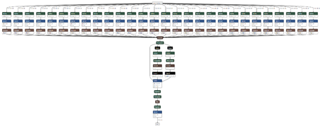

학습 곡선은 `metrics.csv` 를 pandas 로 읽어 그린다. `groupby('epoch').last()` 로 epoch 마다 마지막 행만 남기고 `step` 열은 버린다. `val_acc` 의 최댓값을 제목에 넣고, `val_acc` 와 `val_loss` 를 semilog 축에 함께 그린다.

```python
v_num = logger.version
history = pd.read_csv(f'./logs/{name}/version_{v_num}/metrics.csv')
df = history.groupby('epoch').last().drop('step', axis=1)
print('\t',df['val_acc'].max())
```

```python
plt.title(f"{name}\nMax Acc:{df['val_acc'].max():.3f}")
plt.plot(df['val_acc'], label="val_acc")
plt.plot(df['val_loss'], label="val_loss")
plt.semilogy()
plt.grid()
plt.legend()
plt.ylabel('Loss')
plt.legend()
plt.show()
```

아래 곡선에서 val_acc 는 초반 몇 epoch 사이에 빠르게 올라간 뒤 완만하게 상승하고, val_loss 는 계속 내려간다. 그림에 표시된 최고 val_acc 는 약 0.960 이다. 이미지를 line 의 sequence 로만 읽어도 MNIST 를 상당한 정확도로 분류할 수 있다는 것이 첫 질문에 대한 답이다.

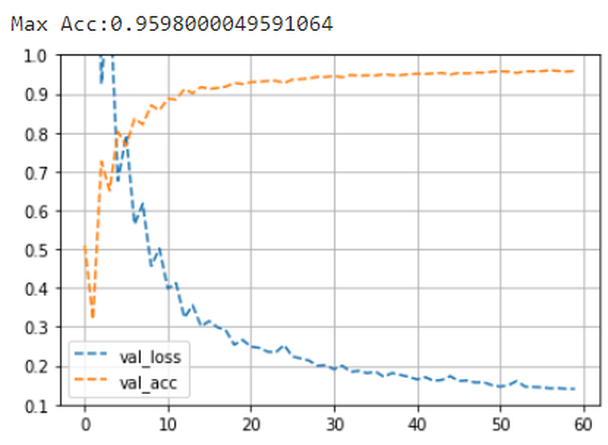

---

## 5.5.3 Model-2 — Bidirectional LSTM
<!-- 슬라이드 490~493 -->

**Model-2 설계 : many to one, Bidirectional LSTM 모델**

Model-1 에서 바꾸는 것은 하나다 — LSTM layer 를 Bidirectional(LSTM layer) 로 바꾼다. 정적 표현에서 `LSTM(16)` 상자가 `Bidir(LSTM(16))` 이 되고, 출력 shape 이 `16,x1` 에서 `16,x2` 로 바뀐다. 앞 방향 LSTM 의 마지막 출력 16 개와 뒤 방향 LSTM 의 마지막 출력 16 개, 합쳐서 32 개 값이 Dense(10) 으로 들어간다.

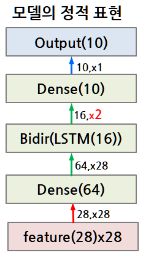

동적 표현으로 보면 차이가 분명하다. Dense(64) 가 line 1~28 을 처리하는 것은 같은데, 그 위에 LSTM 이 두 개 있다. LSTM 1 은 line 1 에서 line 28 쪽으로(앞 방향), LSTM 2 는 line 28 에서 line 1 쪽으로(뒤 방향) hidden state 를 넘기며 읽는다. 두 방향의 마지막 출력(16 + 16)이 Dense 로 모여 예측값이 된다. 위에서 아래로 읽은 요약과 아래에서 위로 읽은 요약을 함께 쓰는 셈이다.

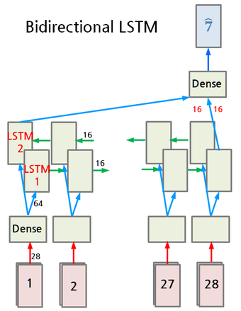

**Model-2 define**

PyTorch 에서 Bidirectional LSTM 은 `nn.LSTM` 에 `bidirectional=True` 를 주는 것으로 끝난다. 달라지는 것은 출력 폭이다. 양방향 출력이 마지막 축에서 이어 붙기 때문에 `out` 의 shape 이 `(bs, 28, 32)` 가 되고, 따라서 `outLinear` 의 입력 크기를 `lstm_units*2` 로 잡아야 한다. `forward` 는 Model-1 과 완전히 같다.

```python
class BidirectionalRNN(Wrap_10):
    def __init__(self, features, in_dense, lstm_units, out_dense, batch_first=True):
        super(BidirectionalRNN, self).__init__()
        self.inLinear = nn.Linear(features, in_dense)
        self.lstm = nn.LSTM(input_size=in_dense, hidden_size=lstm_units,
                            batch_first=batch_first, bidirectional=True)
        self.outLinear = nn.Linear(lstm_units*2, out_dense)

    def forward(self, x):
        #(bs,28,28)<-(bs,1,28,28)
        x = x.reshape(x.size(0),x.size(2),-1)
        out = self.inLinear(x)
        out, (hn, cn) = self.lstm(out)
        out = self.outLinear(out[:, -1, :])
        return out

model = BidirectionalRNN(features, in_dense, lstm_units, out_dense)#.to(device)
summary(model, input_size=(batch_size, 1, time_steps, features))
```

`out[:, -1, :]` 은 마지막 time step(line 28) 위치의 32 개 값이다. 앞 방향 LSTM 에게 line 28 은 sequence 전체를 다 읽은 시점이지만, 뒤 방향 LSTM 에게 line 28 은 읽기를 막 시작한 첫 step 이라는 점은 알아 두어야 한다. 양방향 출력을 어떻게 골라 쓸지는 설계자의 선택이며, 이 실습은 가장 단순한 형태인 마지막 위치를 그대로 쓴다.

**Model summary**

summary 결과를 표로 옮기면 LSTM 과 출력 Dense 의 parameter 수가 달라진 것이 보인다.

| Layer | Output Shape | Param # |
|---|---|---|
| BidirectionalRNN | [512, 10] | – |
| Linear (in, TimeDistributed 동작) | [512, 28, 64] | 1,856 |
| LSTM (bidirectional) | [512, 28, 32] | 10,496 |
| Linear (out) | [512, 10] | 330 |
| **Total params** | | **12,682** |

- LSTM param # = 4 × 16 × (64 + 16 + 2) = 5,248, 방향이 둘이므로 ×2 = 10,496
- In_Dense param # = (28 + 1) × 64 = 1,856
- Out_Dense param # = (32 + 1) × 10 = 330

앞 방향과 뒤 방향 LSTM 은 weight 를 공유하지 않으므로 parameter 가 정확히 두 배가 되고, 출력 Dense 의 입력이 16 에서 32 로 늘어 bias 를 포함한 (32 + 1) × 10 이 된다.

**Model Compile & Train — 동일**

학습 코드는 Model-1 과 같다. 모델 class 와 logger 이름만 바꾼다.

```python
model = BidirectionalRNN(features, in_dense, lstm_units, out_dense)

name = "BidirectionalRNN"
logger = CSVLogger("logs", name=name)
trainer = Trainer(max_epochs=15, logger=logger,)
trainer.fit(model, train_loader, test_loader)
```

```python
v_num = logger.version
history = pd.read_csv(f'./logs/{name}/version_{v_num}/metrics.csv')
df2 = history.groupby('epoch').last().drop('step', axis=1)
print('\t',df2['val_acc'].max())
```

**성능 비교**

Model-1 의 곡선(`df`)과 Model-2 의 곡선(`df2`)을 한 그림에 겹쳐 그린다. LSTM 은 점선, Bi-LSTM 은 실선이다. `plt.ylim(0.1, 1)` 로 y 축을 고정해 두 모델의 val_acc 와 val_loss 를 같은 눈금에서 읽는다.

```python
plt.title(f"LSTM / Bi-LSTM\n MacAcc({df['val_acc'].max():.5f}, {df2['val_acc'].max():.5f})")
plt.plot(df['val_acc'], linestyle='--', label="LSTM")
plt.plot(df['val_loss'], linestyle='--', label="LSTM")
plt.plot(df2['val_acc'], linestyle='-', label="Bi-LSTM")
plt.plot(df2['val_loss'], linestyle='-', label="Bi-LSTM")
plt.ylim(0.1,1)
#plt.semilogy()
plt.grid()
plt.legend()
plt.ylabel('Loss')
plt.legend()
plt.show()
```

아래 그림에서 15 epoch 동안의 최고 val_acc 는 LSTM 0.930, Bi-LSTM 0.951 이다. Bi-LSTM 의 val_acc 곡선이 처음부터 끝까지 LSTM 위에 있고, val_loss 도 더 빠르게 내려간다. parameter 가 7,274 에서 12,682 로 늘어난 대가로 얻은 향상이다.

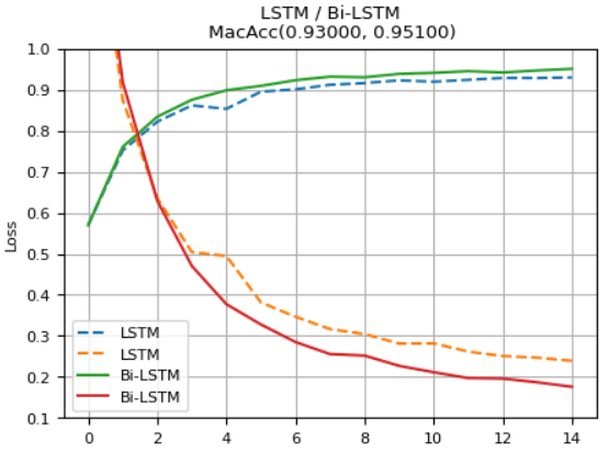

---

## 5.5.4 Model-3 — Hierarchical RNN
<!-- 슬라이드 495~499 -->

**Model-3 : Hierarchical RNN 으로 MNIST classification**

Model-1·2 는 line 하나(28 pixel)를 Dense 로 요약해 LSTM 에 넣었다. Model-3 의 변경사항은 이 요약 방식이다 — **line 단위로 scan 하던 것을, line 안의 pixel 을 scan 한 정보를 LSTM 에 공급**하는 것으로 바꾼다. 즉 line 을 요약하는 일도 RNN 이 맡는다. LSTM 이 두 층으로 쌓여 서로 다른 수준의 sequence 를 읽으므로 Hierarchical RNN 이라 부른다.

- 첫 번째 LSTM layer (LSTM_1) : TimeDistributed layer 로 동작하는 LSTM 이다. 첫 LSTM 레이어가 time_steps(28 line) 만큼 반복 동작한다. 한 line 을 28 개 pixel 의 sequence 로 보고 pixel 하나(값 1 개)씩 28 step 을 읽는다 — 첫 LSTM 에 `1,x28` 입력이 line 수만큼 28 회 반복 공급되어 `50,x28` 을 출력한다. line 하나가 50 개 값으로 요약되고, 그것이 28 line 만큼 나온다.
- 두 번째 LSTM layer (LSTM_2) : `50,x28` 을 받아서 `16,x1` 을 출력한다. line 요약 28 개를 순서대로 읽고 마지막 출력 16 개만 남긴다.
- Dense layer : `16,x1` 을 받아서 `10,x1` 을 출력한다.

shape 의 흐름으로 적으면 `(bs, 28, 28, 1)` → `(bs, 28, 50)` → `(bs, 16)` → `(bs, 10)` 이다. 입력 끝의 1 은 pixel 하나가 값 1 개짜리 feature 라는 뜻이다.

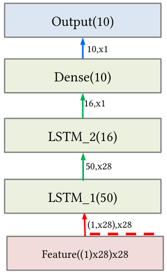

**Model-3 표현하기 — TimeDistributed(LSTM) 의 동작에 주의**

동적 표현으로 그리면 두 LSTM 이 무엇을 학습하는지 드러난다. 아래 그림에서 아래쪽 상자 하나(Line#1, Line#2, …, Line#28)가 LSTM_1 의 한 번 동작이다. 상자 안에서 Pixel#1 부터 Pixel#28 까지 값 1 개씩 들어가고 hidden state(50) 가 pixel 을 따라 넘어가며, 마지막 pixel 을 읽은 출력 50 개가 상자 밖으로 나온다. 같은 LSTM_1 이 28 개 line 에 같은 weight 로 반복 적용되므로, 그림에는 상자가 28 개 그려져 있어도 층은 하나다 — 이것이 TimeDistributed(LSTM) 의 동작이다. 위쪽 LSTM_2 는 이 50 개짜리 line 요약을 Line#1 에서 Line#28 까지 순서대로 읽고, 마지막 출력 16 개를 Dense 에 넘긴다.

- LSTM_1 이 학습하는 것 — 한 line 안에서 pixel 값이 이어지는 pattern(획이 어디서 시작하고 끊기는지)을 50 개 값으로 요약하는 법
- LSTM_2 가 학습하는 것 — 그 line 요약이 위에서 아래로 이어지는 pattern 을 읽어 숫자를 판단하는 법

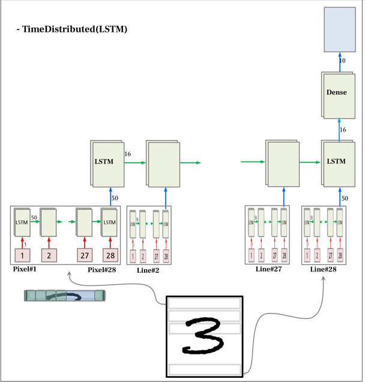

### 실습 5.5.2 — Hierarchical RNN

> 노트북: `code/5.5.2.Mnist_HierarchicalRNN.ipynb`
> [](https://colab.research.google.com/github/AI-BoostCamp/intermediate-deep-learning-pytorch/blob/main/code/5.5.2.Mnist_HierarchicalRNN.ipynb)

데이터 준비와 `Wrap_10` 은 실습 5.5.1 과 같다(저장 경로만 `./MNIST_DATASET` 으로 다르다).

**주요 변수 정의**

변수 이름이 Model-1 과 다르다. LSTM_1 의 입력은 pixel 하나이므로 `pixel = 1` 이 features 역할을 하고, `pixels = 28` 은 한 line 의 pixel 수(LSTM_1 의 time step), `lines = 28` 은 line 수(LSTM_2 의 time step)다. `chennels = 1` 은 흑백 이미지의 채널 수로, summary 의 input_size 를 만들 때 쓴다. `lstm1_units = 50`, `lstm2_units = 16` 은 임의 값이다.

```python
# 주요 변수 정의
pixel = 1          ## features
pixels = 28        ## pixels
lines = 28         ## lines
chennels = 1       ## b/w = 1
lstm1_units = 50    #50 임의 값
lstm2_units = 16   # 임의 값
out_dense = 10   # 출력은 숫자(0~9) 확률
```

**Model define**

PyTorch 에는 Keras 의 `TimeDistributed` 에 해당하는 층이 없으므로, LSTM_1 을 line 마다 반복 호출하는 동작을 `forward` 안에서 **for 문으로 직접** 쓴다. 층 정의는 세 개뿐이다 — `timeDistributed_LSTM`(입력 1, hidden 50), `lstm`(입력 50, hidden 16), `outLinear`(16 → 10).

```python
class HierarchicalRNN(Wrap_10):
    def __init__(self, pixel, lstm1_units, lstm2_units, out_dense, batch_first=True):
        super(HierarchicalRNN, self).__init__()
        self.timeDistributed_LSTM = nn.LSTM(input_size=pixel, hidden_size=lstm1_units,
                                            batch_first=batch_first)
        self.lstm = nn.LSTM(input_size=lstm1_units, hidden_size=lstm2_units,
                                            batch_first=batch_first)
        self.outLinear = nn.Linear(lstm2_units, out_dense)

    def forward(self, x):
        # x1:([512, 28p, 1]) <- x:([512, 1, 28l, 28p])
        x1 = x[:,0,0,:].reshape(x.size(0),-1,1)
        y = self.timeDistributed_LSTM(x1) #([512, 28, 50])
        y = y[0][:,-1,:] #(512,50)
        y = y.view(x.size(0),1,-1) #(512,1,50)
        for i in range(x.size()[2]-1):
          x1 = x[:,0,i+1,:].reshape(x.size(0),-1,1)
          y1 = self.timeDistributed_LSTM(x1)
          y1 = y1[0][:,-1,:] #(512,50)
          y1 = y1.view(x.size(0),1,-1) #(512,1,50)
          y = torch.cat((y, y1),dim=1)
        #y: ([512, 28, 50])
        out, (hn, cn) = self.lstm(y) #(512,28,16)
        out = self.outLinear(out[:, -1, :]) #(512,10)
        return out

model = HierarchicalRNN(pixel, lstm1_units, lstm2_units, out_dense)
summary(model, input_size=(batch_size, chennels, lines, pixels)) #(bs,1,28,28)
```

`forward` 의 흐름을 line 단위로 따라가면 다음과 같다. 입력 `x` 는 `(bs, 1, 28l, 28p)` — 채널, line, pixel 순이다.

1. `x[:, 0, 0, :]` 로 첫 line(28 pixel)을 꺼내고 `reshape(bs, -1, 1)` 로 `(bs, 28, 1)` 을 만든다. LSTM_1 에게는 이것이 "길이 28, feature 1" 의 sequence 다.
2. `self.timeDistributed_LSTM(x1)` 의 결과 `y[0]` 은 전체 step 출력 `(bs, 28, 50)` 이다. `[:, -1, :]` 로 마지막 pixel 을 읽은 뒤의 출력 `(bs, 50)` 만 남기고, `view(bs, 1, -1)` 로 `(bs, 1, 50)` 을 만들어 line 축을 하나 세운다. 이것이 첫 line 의 요약이다.
3. for 문이 나머지 27 개 line(`i+1` = 1 ~ 27)에 대해 같은 일을 한다. 매번 **같은** `timeDistributed_LSTM` 을 호출하므로 weight 가 공유된다. line 마다 나온 `(bs, 1, 50)` 을 `torch.cat(..., dim=1)` 으로 line 축에 이어 붙여 마지막에 `(bs, 28, 50)` 이 된다.
4. 이 `(bs, 28, 50)` 을 두 번째 LSTM `self.lstm` 이 읽는다. 출력은 `(bs, 28, 16)`, 그 중 마지막 line 의 출력 `out[:, -1, :]` → `(bs, 16)`.
5. `outLinear` 로 `(bs, 10)` 의 logit 을 낸다.

`summary` 의 `input_size` 는 `(batch_size, chennels, lines, pixels)` = `(512, 1, 28, 28)` 로 준다. 실제 MNIST loader 가 주는 batch 와 같은 shape 이다.

**Model summary**

summary 결과를 표로 옮기면 다음과 같다. `timeDistributed_LSTM` 은 for 문에서 28 번 호출되므로 summary 에 28 줄이 찍히는데, 첫 줄만 parameter 수가 적히고 나머지는 같은 층의 재사용(recursive)으로 표시된다.

| Layer | Output Shape | Param # |
|---|---|---|
| HierarchicalRNN | [512, 10] | – |
| LSTM_1 (1 회째 호출) | [512, 28, 50] | 10,600 |
| LSTM_1 (2 ~ 28 회째 호출) | [512, 28, 50] | (recursive) |
| LSTM_2 | [512, 28, 16] | 4,352 |
| Linear | [512, 10] | 170 |
| **Total params** | | **15,122** |

같은 공식으로 계산해 보면 다음과 같다.

- TimeDistributed(LSTM1) param # = 4 × lstm_size × (lstm_inputs + lstm_size + bias) = 4 × 50 × (1 + 50 + 2) = 10,600
- LSTM2 param # = 4 × 16 × (50 + 16 + 2) = 4,352
- Dense layer param # = (16 + 1) × 10 = 170

합은 15,122 이다. 비교를 위해 적어 두면 모델 2 의 parameter 수는 12,682 였다. LSTM_1 의 입력은 값 1 개뿐인데도 hidden 이 50 이라 parameter 의 대부분(10,600)이 여기에 몰려 있다. 이 크기가 적절한지는 실습과제에서 다룬다.

**Fit**

학습 코드는 앞의 두 모델과 같은 틀이다. 다만 `max_epochs=30` 으로 더 길게 돌린다. `forward` 안에 28 번의 LSTM 호출이 순차적으로 들어 있으므로, 같은 epoch 수라도 앞의 두 모델보다 학습 시간이 훨씬 오래 걸린다는 점을 감안해야 한다.

```python
model = HierarchicalRNN(pixel, lstm1_units, lstm2_units, out_dense)

name = "HierarchicalRNN"
logger = CSVLogger("logs", name=name)
trainer = Trainer(max_epochs=30, logger=logger,)
trainer.fit(model, train_loader, test_loader)
```

**Analysis 와 Model Plot**

학습 지표는 앞과 같이 `metrics.csv` 에서 읽는다. 이번에는 학습 acc·loss 와 검증 val_acc·val_loss 네 곡선을 한 그림에 그리고, `plt.ylim(0., 1.1)` 로 y 축을 고정한다.

```python
v_num = logger.version
history = pd.read_csv(f'./logs/{name}/version_{v_num}/metrics.csv')
df = history.groupby('epoch').last().drop('step', axis=1)
print('\t',df['val_acc'].max())
```

```python
plt.title(f"{name}\nMax Acc:{df['val_acc'].max():.3f}")
plt.plot(df['acc'], label="acc")
plt.plot(df['val_acc'], label="val_acc")
plt.plot(df['loss'], label="loss")
plt.plot(df['val_loss'], label="val_loss")
plt.ylim(0.,1.1)
#plt.semilogy()
plt.grid()
plt.legend()
plt.ylabel('Loss')
plt.legend()
plt.show()
```

모델 구조 그래프를 그려 보면 Model-1 의 그래프와 모양이 닮았다. line 마다 하나씩, 28 개의 LSTM 가지가 나란히 서 있다가 `Concat` 으로 모이고, 그 아래에 LSTM 하나와 출력 Linear 가 이어진다. Model-1 에서 Linear 가 서 있던 자리에 LSTM 이 들어간 것이 Hierarchical RNN 의 구조적 차이다. 각 가지 안의 Gather·Reshape·Transpose·Squeeze 는 `forward` 에서 line 을 잘라 내고 `(bs, 28, 1)` 로 바꾸고 마지막 출력을 골라내는 index·reshape 연산이 그래프에 드러난 것이다.

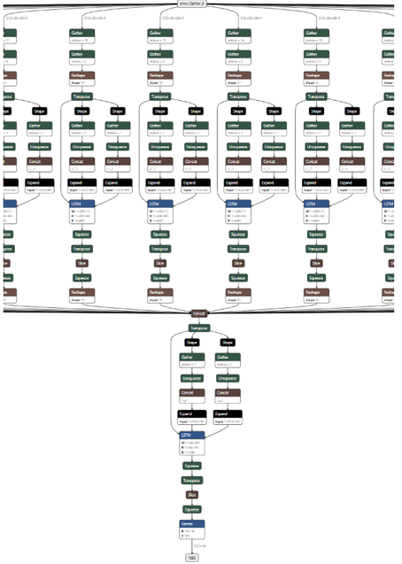

학습 곡선에서 train_loss 와 val_loss 가 함께 내려가고 val_acc 는 올라가 그림에 표시된 최고 val_acc 는 약 0.964 다. line 을 Dense 대신 LSTM 으로 요약해도 MNIST 를 분류할 수 있음을 확인한다.

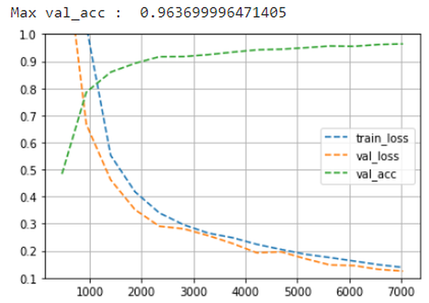

---

## 5.5.5 실습과제
<!-- 슬라이드 494, 500 -->

**실습 5.5.1 (Model-1 · Model-2) 의 과제**

- 과제 1 : ManyToOneLSTM 모델에서 LSTM 출력을 모두 사용하고, Flatten Layer 를 추가하여 ManyToOne 으로 수정해 보자. 성능 변화를 예측해 보고, 결과를 비교해 보자.
- 과제 2 : 과제 1 의 모델에서 LSTM units 을 늘려 보자. 늘리면 계속 성능이 증가할까? 최적의 units 를 찾아 보자.
- 과제 3 : 과제 2 모델을 Bidirectional LSTM 으로 수정하여 성능 향상이 있는지 확인해 보자.

과제 1 의 뜻은 `out[:, -1, :]` 로 마지막 step 만 쓰는 대신 `(bs, 28, 16)` 전체를 펼쳐 `(bs, 448)` 로 만들고 그것을 출력 Dense 에 넣으라는 것이다. 출력 Dense 의 입력 크기와 parameter 수가 어떻게 바뀌는지부터 계산해 본 뒤 결과를 비교한다.

**실습 5.5.2 (Model-3) 의 과제**

- 과제 1 : Model_3 변형 — LSTM_1 의 units 이 적절할까? 너무 큰 것 아닐까? 줄여 보자. 최적의 units 이 얼마일까? 최적인 이유는? Parameter 의 수의 차이도 확인해 보자.
- 과제 2 : in_Dense Layer 와 LSTM1 Layer 성능 비교 — model1 에서 in-Dense Layer 와 model3 에서 LSTM1 의 역할과 성능을 비교하기. 동일한 수준의 parameter 를 가질 때 성능 차이를 확인하기.
- 과제 3 : in_Dense Layer 와 Conv. Layer 성능 비교 — model1 에서 in-Dense Layer 를 Conv. Layer 로 대체하여 역할과 성능을 비교하기. 동일한 수준의 parameter 를 가질 때 성능 차이를 확인하기.

노트북 `5.5.2.Mnist_HierarchicalRNN.ipynb` 뒷부분에는 과제 1 을 시작해 볼 수 있도록 units 를 바꿔 다시 학습하는 셀이 있다. 주요 변수만 다시 정의하고 같은 class 로 모델을 만들면 되므로, 아래처럼 값을 바꾼 뒤 summary 로 parameter 수를 먼저 확인하고 학습 곡선을 원래 모델(`df`)과 겹쳐 비교한다.

```python
# 주요 변수 재정의
lstm1_units = 8    # <-50
lstm2_units = 56   # <-16
```

---

## 5.5.6 정리

이 절은 "이미지를 한 line 씩 보면 인식할 수 있을까" 라는 질문에서 출발해 세 가지 RNN 모델을 설계했다.

- **Model-1 (many to one LSTM)** — 28x28 이미지를 `(bs, 28 line, 28 pixel)` 의 sequence 로 보고, TimeDistributed 로 동작하는 Dense(64) → LSTM(16) → Dense(10) 을 쌓았다. LSTM 출력 중 마지막 step 만 쓰는 `out[:, -1, :]` 한 줄이 many to one 을 만든다. Total params 7,274.
- **Model-2 (Bidirectional LSTM)** — `bidirectional=True` 한 가지 변경으로 출력 폭이 16 에서 32 가 되고, LSTM parameter 가 두 배가 된다. Total params 12,682. 15 epoch 기준 최고 val_acc 가 0.930 에서 0.951 로 올랐다.
- **Model-3 (Hierarchical RNN)** — line 을 Dense 가 아니라 LSTM_1 로 pixel 단위로 읽어 50 개 값으로 요약하고, LSTM_2 가 line 요약의 흐름을 읽는다. PyTorch 에는 TimeDistributed 가 없으므로 LSTM_1 을 line 마다 반복 호출하는 for 문으로 표현했다. Total params 15,122.

설계 단계에서 층별 shape 을 `값의 수 × time step 수` 로 미리 적어 두고, LSTM parameter 수를 $4 \times \text{lstm\_size} \times (\text{input\_size} + \text{output\_size} + 2)$ 로 손으로 계산해 `summary` 와 맞춰 보는 습관이 이 절의 방법론이다. 정적 표현(층 쌓기)과 동적 표현(시간축 펼치기)을 함께 그리면 같은 층이 몇 번 반복 동작하는지, 어느 step 의 출력이 다음 층으로 가는지가 분명해진다.
