# 5.6 Handwriting Generation with RNN

**학습 목표**

- 회귀 문제의 입력과 출력을 뒤집었을 때 생기는 inverse problem 이 왜 보통의 회귀 네트워크로 풀리지 않는지, 이분산성(heteroscedasticity)과 multimodal 분포의 관점에서 설명할 수 있다.
- Mixture Density Network(MDN)가 입력 $x$ 로부터 혼합 가우시안 분포의 parameter($\pi$, $\mu$, $\sigma$)를 출력하는 원리와, 출력 수·변환 함수(softmax, exp)를 고르는 이유를 설명할 수 있다.
- Maximum Likelihood Estimation 에서 출발해 MDN 의 손실 함수 $-\log L$ 을 세우고, PyTorch Lightning 으로 `calc_pdf`, `mdn_loss`, sampling 함수를 구현할 수 있다.
- 학습 중간 결과(sampling 결과, $\mu(x)$, $\pi(x)$, 분산)를 읽고, 결과가 좋지 않을 때 component 수를 조정할 수 있다.
- Graves 의 handwriting prediction 과 synthesis 네트워크가 deep RNN, MDN, soft window 를 어떻게 결합하는지 구조 수준에서 설명할 수 있다.

**이 절의 구성**

- 5.6.1 Handwriting Generation 과 Mixture Density Network
- 5.6.2 Inverse Problem
- 5.6.3 혼합 가우시안 분포와 MDN 의 개념
- 5.6.4 MDN 의 출력 설계와 모델 정의
- 5.6.5 Maximum Likelihood Estimation
- 5.6.6 모델의 Cost Function
- 5.6.7 손실 함수·Dataset·Sampling 구현
- 5.6.8 학습 중간 결과 관찰과 component 수
- 5.6.9 Handwriting Prediction 을 위한 Deep RNN 구조
- 5.6.10 Handwriting Prediction 의 출력 — MDN
- 5.6.11 Handwriting Synthesis 와 Soft Window
- 5.6.12 정리

---

## 5.6.1 Handwriting Generation 과 Mixture Density Network
<!-- 슬라이드 502~503 -->

RNN 의 응용 사례로 손글씨 생성(handwriting generation)을 다룬다. 출발점은 Alex Graves(University of Toronto, Department of Computer Science)의 논문 "Generating Sequences With Recurrent Neural Networks" 다. 이 논문은 LSTM 으로 텍스트와 온라인 손글씨(펜 좌표의 궤적)를 한 점씩 생성하고, 나아가 주어진 문장을 손글씨로 써 내는 handwriting synthesis 까지 보인다.

- 논문: https://arxiv.org/abs/1308.0850
- Graves 의 발표 자료: https://goo.gl/HZ7GGu

같은 문장 "more of national temperament" 를 네트워크가 여러 번 생성한 결과를 보면, 줄마다 획의 모양·기울기·글자 간격이 다르면서도 모두 사람이 쓴 글씨처럼 읽힌다. 하나의 정답 좌표를 내는 것이 아니라 확률분포에서 sampling 하기 때문에 이런 다양성이 생긴다. 이 절의 핵심은 바로 "출력을 확률분포로 만드는 방법" 이다.

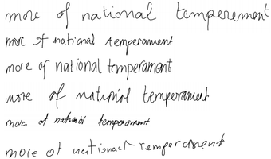

**MDN(Mixture Density Networks)이란?**

Handwriting generation 네트워크는 **MDN + RNN** 구조다. RNN 이 시퀀스의 문맥을 기억하고, 그 위에 얹힌 MDN 이 다음 펜 위치를 하나의 값이 아니라 여러 개의 확률분포로 출력한다. 그래서 이 절은 먼저 MDN 을 Christopher M. Bishop 의 1994 년 논문 "Mixture Density Networks"(Neural Computing Research Group, Aston University)를 중심으로 설명한다.

- 논문: https://publications.aston.ac.uk/id/eprint/373/1/NCRG_94_004.pdf

Bishop 의 MDN 은 두 가지를 보였다.

- Neural network 으로 **inverse problem** 을 해결하였다.
- 네트워크의 출력이 하나의 값이 아니라 **여러 개의 확률분포**를 갖도록 설계하였다.

두 가지는 서로 이어져 있다. inverse problem 이 무엇이고 왜 보통의 회귀로 풀리지 않는지를 먼저 보면, 출력을 여러 확률분포로 만들어야 하는 이유가 자연스럽게 드러난다.

---

## 5.6.2 Inverse Problem
<!-- 슬라이드 504~507 -->

### 실습 5.6.1 — (1) Inverse problem 을 MLP 회귀로 풀어 보기
<!-- 슬라이드 504~505 -->

> 노트북: `code/5.6.1.MixtureDensityNetwork.ipynb`
> [](https://colab.research.google.com/github/AI-BoostCamp/intermediate-deep-learning-pytorch/blob/main/code/5.6.1.MixtureDensityNetwork.ipynb)

이 노트북은 절 전체에 걸쳐 나누어 읽는다. 앞부분은 inverse problem 을 보통의 MLP 회귀로 풀어 보고 실패를 확인하는 실험이고, 뒷부분이 Mixture Density Network 의 구현과 학습이다.

**일반적인 문제의 모습**

먼저 보통의 회귀 문제를 만든다. 입력 $x$ 를 $-10.5$ 와 $10.5$ 사이에서 고르게 뽑고, 출력은 사인 곡선에 완만한 기울기와 잡음을 더한 값으로 만든다.

```python
def create_book_example(n=1000):
    # Train 데이터 준비
    x_data = np.float32(np.random.uniform(-10.5, 10.5, (1, n))).T
    r_data = np.float32(np.random.normal(size=(n,1)))
    yn_data = np.float32(np.sin(0.75*x_data)*7.0 + x_data*0.5)
    y_data = np.float32(np.sin(0.75*x_data)*7.0 + x_data*0.5 + r_data*1.0)
    # Test 데이터 준비
    x_test = np.float32(np.arange(-10.5,10.5,0.05))
    x_test = x_test.reshape(x_test.size, 1)
    return x_data, y_data, x_test

# Plot data (x and y)
X, y, x_test = create_book_example(n=1200)
plt.plot(X, y, 'ro', alpha=0.3)
plt.title("Training Data")
plt.xlabel('Inout')
plt.ylabel('Output')
plt.show()
```

`y_data` 는 $7\sin(0.75x) + 0.5x$ 에 표준정규분포 잡음 `r_data` 를 더한 것이다. `x_test` 는 $-10.5$ 부터 $0.05$ 간격으로 만든 420 개의 점으로, 학습이 끝난 뒤 예측 곡선을 그릴 때 쓴다. 입력 하나에 출력이 하나씩 대응하고 잡음의 폭이 어디서나 비슷하므로, 이런 데이터는 보통의 회귀 네트워크로 잘 맞출 수 있다.

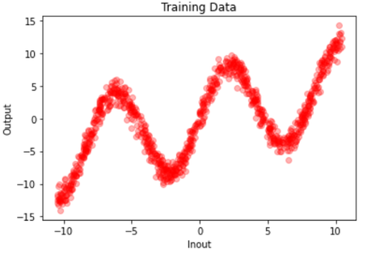

데이터를 `Dataset` 으로 감싸고 `DataLoader` 로 배치를 만든다. `__getitem__` 이 numpy 배열을 `FloatTensor` 로 바꿔 돌려준다.

```python
class CustomDataset:
    def __init__(self, x, y):
        self.x = x
        self.y = y
    def __len__(self): return len(self.x)
    def __getitem__(self, idx):
        return torch.FloatTensor(self.x[idx]), torch.FloatTensor(self.y[idx])

trainDataset = CustomDataset(X, y)
trainDataLoader = DataLoader(trainDataset, shuffle=True, batch_size=64)
```

은닉층 하나짜리 작은 MLP regression net 으로 학습한다. 슬라이드의 표기는 MLP(20 hidden) 이고, 노트북 코드는 hidden node 32 개(`h=32`)를 쓴다. 손실은 MSE, optimizer 는 Adam 이며, `LightningModule` 의 `training_step` 과 `configure_optimizers` 만 채우면 `Trainer` 가 학습 루프를 돌린다.

```python
# MLP Regression model
class MLP(L.LightningModule):
    def __init__(self, h):
        super(MLP, self).__init__()
        self.layers = nn.Sequential(
            nn.Linear(1, h),
            nn.PReLU(h),
            nn.Linear(h, 1))

    def forward(self, x):
        out = self.layers(x)
        return out

    def training_step(self, batch, batch_idx):
        x, y = batch
        y_pred = self(x)
        loss = F.mse_loss(y_pred, y)
        self.log('loss', loss, prog_bar=True)
        return loss

    def configure_optimizers(self):
        return torch.optim.Adam(self.parameters())

model = MLP(h=32)
name = "MLP"
logger = CSVLogger("logs", name=name)
trainer = Trainer(max_epochs=300, logger=logger)
trainer.fit(model, trainDataLoader)
```

학습이 끝나면 `x_test` 420 개 점에 대한 예측을 학습 데이터 위에 겹쳐 그린다.

```python
# Prediction
model.eval()
y_test = model(torch.FloatTensor(x_test)).cpu().detach().numpy()
# plot results
plt.plot(X, y, 'ro', alpha=0.3, label='Training Data')
plt.plot(x_test, y_test, 'bo', alpha=0.2, label='Regression Result')
plt.legend()
plt.title('Regression Results ')
plt.show()
```

파란 회귀 결과가 빨간 학습 데이터의 한가운데를 지나는 사인 곡선을 그대로 따라간다. MLP regression network 으로도 잘 동작하는, 일반적인 문제의 모습이다.

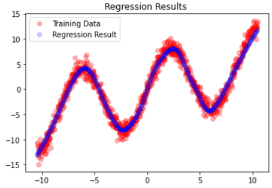

**x, y 축이 뒤집히면 — inverse problem**

이제 같은 데이터에서 입력과 출력을 서로 바꾼다. 코드로는 두 줄이다.

```python
# Plot data (x and y)
X, y, x_test = create_book_example(n=1200)
flipped_x = y
flipped_y = X

plt.plot(flipped_x, flipped_y, 'ro', alpha=0.3)
plt.title("Training Data")
plt.xlabel('Inout')
plt.ylabel('Output')
plt.show()
```

축을 바꾸고 나면 그림은 S 자를 옆으로 눕힌 모양이 된다. 이제 입력 $x$ 하나에 대응하는 출력 $y$ 가 여러 개(곡선이 겹치는 구간에서는 세 개 이상)다. 함수라면 입력 하나에 출력이 하나여야 하므로, 이 데이터는 $y = f(x)$ 꼴의 함수로 표현되지 않는다. 이것이 **inverse problem** 이다. Linear regression(linear algebra) 으로는 해를 찾을 수 없다. 최소제곱 해는 존재하지만, 그 해는 여러 갈래의 $y$ 를 평균 내 버린 값이기 때문이다.

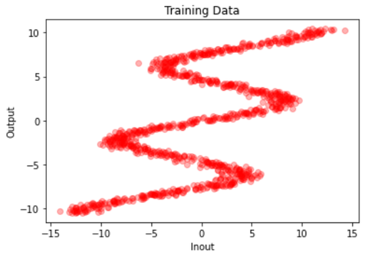

같은 MLP 를 뒤집힌 데이터로 학습시켜 본다.

```python
trainDataset = CustomDataset(flipped_x, flipped_y)
trainDataLoader = DataLoader(trainDataset, shuffle=False, batch_size=64)

model = MLP(h=32)
name = "MLP_flipped"
logger = CSVLogger("logs", name=name)
trainer = Trainer(max_epochs=300, logger=logger)
trainer.fit(model, trainDataLoader)

x_test_inv = np.linspace(-12, 12., 500).reshape(-1, 1)
y_test_inv = model(torch.FloatTensor(x_test_inv)).cpu().detach().numpy()

plt.plot(y, X, 'ro', alpha=0.3)
plt.plot(x_test_inv, y_test_inv, 'b.', alpha=0.3)
plt.show()
```

결과는 실패다. 파란 예측 곡선은 데이터의 어느 갈래도 따라가지 못하고, 여러 갈래의 평균에 해당하는 완만한 곡선으로 가운데를 가로지른다. MSE 를 최소화하는 회귀 네트워크는 본질적으로 "조건부 평균" 을 배우는데, 갈래가 여럿인 데이터에서 조건부 평균은 어느 갈래에도 속하지 않는 값이기 때문이다.

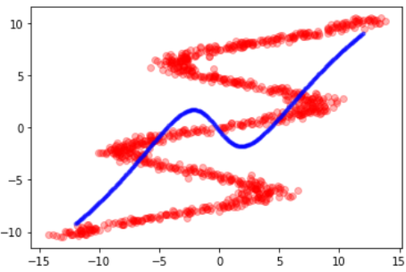

### Inverse problem 의 사례 — 로봇 팔의 운동
<!-- 슬라이드 506 -->

Inverse problem 은 인위적인 예가 아니라 현실에 흔하다. 대표적인 예가 두 개의 관절을 가진 로봇 팔의 운동이다.

- **Forward problem**: 관절 각을 알면 팔 끝의 위치를 알 수 있다. 각 $(\theta_1, \theta_2)$ 가 정해지면 링크 길이 $L_1$, $L_2$ 로부터 끝점 $(x_1, x_2)$ 가 하나로 정해진다.
- **Inverse problem**: 위치를 알면 관절 각을 알 수 있지만, **해가 두 개 존재한다.**
  - two inputs: position $(x_1, x_2)$
  - two outputs: angles $(\theta_1, \theta_2)$
  - two solutions: elbow up, elbow down

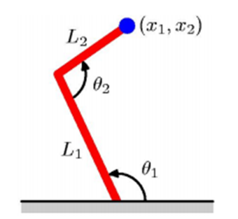

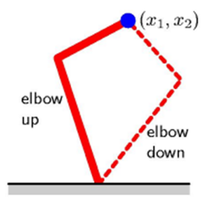

끝점 위치를 입력으로 주고 관절 각을 출력하도록 회귀 네트워크를 학습시키면, 앞의 뒤집힌 데이터에서 본 것과 똑같은 일이 벌어진다. elbow up 과 elbow down 의 평균 각도를 출력하는데, 그 각도로는 팔 끝이 목표 위치에 가지 않는다. 답이 하나가 아닌 문제에서는 "답의 후보들과 각각의 가능성" 을 출력해야 한다.

### 등분산성과 이분산성
<!-- 슬라이드 507 -->

회귀가 실패하는 또 하나의 이유는 분산에 있다. Linear regression 의 기본 가정은 데이터의 **등분산성(homoscedasticity)** 이다.

- **등분산성(homoscedasticity)**: 각 입력에서 출력이 따르는 정규분포의 표준편차가 동일하다는 것. 잡음의 폭이 입력에 관계없이 일정하다.
- **이분산성(heteroscedasticity)**: 입력에 따라 분포의 폭이 변하는 것. 현실의 데이터에는 이쪽이 더 많이 존재한다.

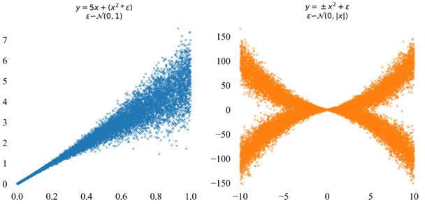

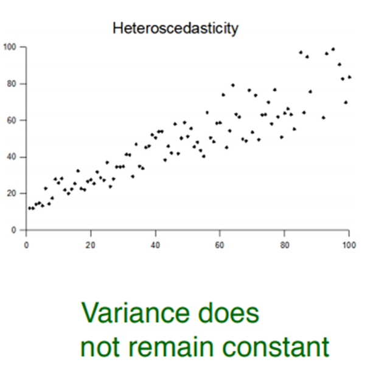

이분산 데이터에서는 입력 $x$ 를 고정했을 때 출력 $y$ 의 분포가 하나의 봉우리가 아닐 수도 있다. 예를 들어 어떤 입력 $x = 8$ 을 고정하고 $y$ 의 조건부 밀도 $p(y \mid x = 8)$ 을 그리면 봉우리가 두 개 나타난다. 평균 하나와 분산 하나로는 이 모양을 표현할 수 없다.

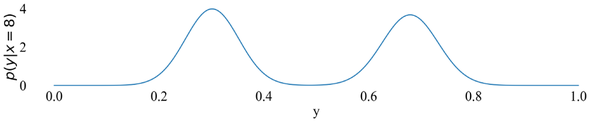

> **핵심 메시지**
> 보통의 회귀 네트워크는 "입력이 주어졌을 때 출력의 평균" 하나만 출력한다. 출력이 여러 갈래이거나 분산이 입력에 따라 변하는 데이터에서는, 평균이 아니라 **출력의 확률분포 자체**를 예측해야 한다.

---

## 5.6.3 혼합 가우시안 분포와 MDN 의 개념
<!-- 슬라이드 508~509 -->

**Multimodal 분포의 예 — 헤드폰 가격대별 판매량**

헤드폰의 가격대별 판매량 분포를 보면 봉우리가 하나가 아니다. 저가·중가·고가 제품군이 각각 자기 봉우리를 만들기 때문에, 분포가 **multimodal**(정보의 모습이나 특성이 여럿)이 된다.

- 이 분포는 **혼합가우시안(mixture of Gaussian) 분포**다.
- 이 분포는 멀티모달이다.
- 세 개의 피크를 가진다.
- 세 개의 혼합가우시안 component 를 가진다.

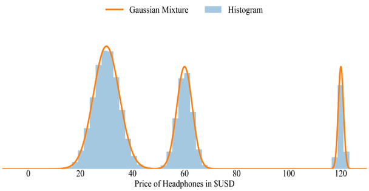

혼합가우시안 분포는 여러 개의 정규분포를 가중치를 두어 더한 것이다. 봉우리마다 정규분포 하나(component)를 배정하고, 각 봉우리의 비중을 가중치로 정하면 어떤 복잡한 모양의 분포도 근사할 수 있다. 앞의 inverse problem 에서 입력 하나에 대응하는 여러 갈래의 출력도, 갈래마다 정규분포 하나를 두면 표현할 수 있다.

**MDN 의 개념**

MDN 의 아이디어는 다음과 같이 정리된다.

- 입력 $x$ 에 대해 $y$ 의 값이 아니라 **확률분포 $p(y \mid x)$ 를 예측**하자.
- Network 이 확률분포 $p(y \mid x)$ 를 표현하게 하자.
  - 확률분포는 정규분포(가우시안 분포)로만 표현하자.
  - 그러면 분포는 mixture model 의 parameter $(\pi, \mu, \sigma)$ 만 있으면 정해진다.
  - 입력 $x$ 로부터 parameter $(\pi, \mu, \sigma)$ 를 출력하도록 모델을 구성하고 학습시키자.
  - (분산 $\sigma^2$ 의 값이 커서 표준편차 $\sigma$ 를 사용한다.)
- 최종 결과는 예측된 분포에서 **sampling** 을 통해 얻는다.

즉 네트워크의 출력층은 "값" 이 아니라 "분포의 parameter" 다. 은닉층까지는 보통의 MLP 와 같고, 마지막에 세 갈래의 출력(mixing coefficient, mean, standard deviation)이 붙어 하나의 혼합 분포를 만든다.

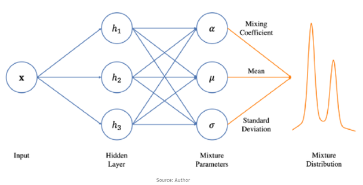

**혼합 가우시안 모델의 일반화**

가우시안 분포는 정규분포 $N(\mu, \sigma^2)$ 이고, $N(0, 1)$ 은 표준정규분포다. $p(y)$ 를 혼합가우시안 모델로 가정하고 $K$ 개의 component 를 갖는 모델로 일반화하면 다음과 같다.

$$
p(y \mid x) = \sum_{k} \pi_k(x)\, N\big(y \mid \mu_k(x),\, \sigma_k^2(x)\big)
$$

- **Component**: 각 component 는 연속변수(continuous variables)를 다루는 정규분포일 수도 있고, 이진변수를 다루는 Bernoulli 분포일 수도 있다. 뒤에서 볼 handwriting 모델은 펜의 좌표에는 정규분포를, 획의 끝 여부에는 Bernoulli 를 쓴다.
- **Mixing coefficient $\pi$**: component 들의 가중치이며 합이 1 이다(sum to 1).
- **mean $\mu$, variance $\sigma^2$**: 각 component 는 입력 $x$ 로부터 산출되는 평균과 분산을 갖는 가우시안 분포로 가정하며, 한 component 안에서는 분산이 하나의 값으로 같다(등분산).

세 parameter 가 모두 $x$ 의 함수 $\pi_k(x)$, $\mu_k(x)$, $\sigma_k(x)$ 라는 점이 핵심이다. 입력이 달라지면 봉우리의 위치·폭·비중이 함께 달라진다.

3 개의 component 를 갖는다면($K = 3$), 네트워크는 입력 $x_1, \dots, x_D$ 를 받아 분포의 parameter $\theta_1, \dots, \theta_M$ 을 출력하고, 그 parameter 가 세 개의 정규분포와 그 합인 $p(t \mid x)$ 를 정한다.

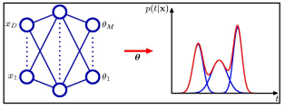

- 참고 자료: https://cedar.buffalo.edu/~srihari/CSE574/Chap5/Chap5.6-MixDensityNetworks.pdf

---

## 5.6.4 MDN 의 출력 설계와 모델 정의
<!-- 슬라이드 510~511 -->

**모델의 출력 수**

Component 하나마다 $\pi$, $\sigma$, $\mu$ 세 값이 필요하므로, 출력 수는 component 수의 3 배다. 24 개 components 모델이라면 $24 \times 3 = 72$ 개의 출력이 된다.

은닉층의 출력을 $Z = \tanh(W_h X + b_h)$ 라 하고, 72 개의 출력을 각 parameter 에 할당하는 예를 들면 다음과 같다.

$$
\pi_k = \frac{\exp(Z_k)}{\sum_{i=0}^{23} \exp(Z_i)}, \qquad
\sigma_k = \exp\big(Z_{24 \sim 43}\big), \qquad
\mu_k = Z_{44 \sim 71}
$$

- $\pi_k$ 는 합이 1 인 확률 값이므로 **softmax** 로 구한다.
- $\sigma_k$ 는 분산이므로 항상 양수여야 한다. $\tanh$ 의 출력 범위는 $-1 \sim +1$ 이므로 그대로 쓸 수 없고, $\exp(x)$ 로 변환해 양수로 만든다.
- $\mu_k$ 는 어떤 실수든 될 수 있으므로 변환 없이 그대로 쓴다.

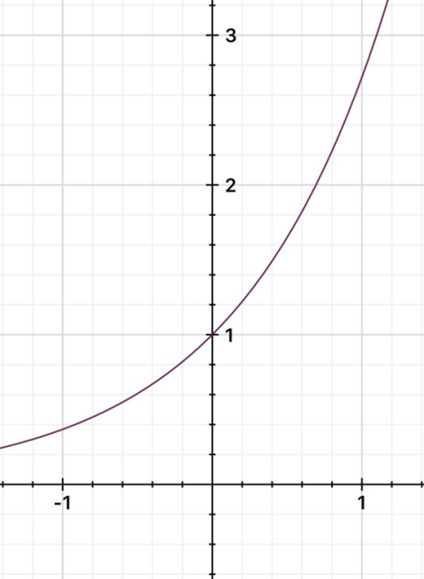

$\exp$ 는 입력이 음수여도 출력이 0 보다 크고 단조 증가하므로, 부호 제약이 있는 분산 출력에 알맞다. 세 parameter 를 어떤 변환으로 얻는지 정리하면 다음과 같다.

| parameter | 제약 | 변환 |
|---|---|---|
| mixing coefficient $\pi_k$ | 0 이상, 합이 1 | softmax |
| variance $\sigma_k$ | 항상 양수 | exp |
| mean $\mu_k$ | 제약 없음 | 그대로(선형 출력) |

### 실습 5.6.1 — (2) MDN 모델 정의
<!-- 슬라이드 511 -->

> 노트북: `code/5.6.1.MixtureDensityNetwork.ipynb` (계속)

앞의 설계를 그대로 코드로 옮긴다. 입력 feature 는 1 개, 은닉 node 는 50 개, component 는 5 개다. `mu_layer`, `var_layer`, `pi_layer` 가 은닉층 출력을 세 갈래로 나누어 각각 $k$ 개의 값을 낸다.

```python
# Mixture Density Network model
f      = 1 # features
hidden = 50 # hidden layer ###
k      = 5 # components    ###

class MixtureDensity(L.LightningModule):
    @classmethod
    def add_method(cls, fun):
      setattr(cls, fun.__name__, fun)
      return fun

    def __init__(self, print_every):
        super(MixtureDensity, self).__init__()
        self.print_every = print_every
        self.layer = nn.Sequential(
                         nn.Linear(f, hidden),
                         nn.ReLU(),
                         nn.Dropout(0.1), ##
                         nn.Tanh())
        self.mu_layer  = nn.Linear(hidden, k)
        self.var_layer = nn.Linear(hidden, k)
        self.pi_layer  = nn.Sequential(
                         nn.Linear(hidden, k),
                         nn.Softmax())

    def forward(self, x):
        out = self.layer(x)
        mu = self.mu_layer(out)
        var = self.var_layer(out)
        var = torch.exp(var) # 양수값이므로 exp를 취해줌
        pi = self.pi_layer(out)
        return pi, mu, var

print_every = 500
model = MixtureDensity(print_every)
summary(model, input_size=(8, 1))
```

코드를 설계와 대응시켜 읽는다.

- `self.layer` 는 $Z = \tanh(W_h X + b_h)$ 에 해당하는 은닉층이다. 노트북 판은 `Linear` 뒤에 `ReLU` 와 `Dropout(0.1)` 을 넣고 마지막에 `Tanh` 를 두어, 은닉 출력이 $-1 \sim +1$ 범위가 되게 한다.
- `pi_layer` 는 `Linear` 뒤에 `Softmax` 를 붙여 합이 1 인 $k$ 개의 가중치를 만든다.
- `var_layer` 의 출력은 `forward` 에서 `torch.exp` 를 거친다. 선형층의 출력은 음수일 수 있지만 exp 를 취하면 항상 양수가 되므로 분산으로 쓸 수 있다.
- `mu_layer` 는 변환 없이 그대로 평균이 된다.
- `forward` 는 값 하나가 아니라 `(pi, mu, var)` 세 tensor 를 돌려준다. 배치 크기가 $n$ 이면 각각 $(n, k)$ 모양이다.
- `add_method` 는 클래스를 정의한 뒤에 손실 함수·sampling 함수 등을 데코레이터로 하나씩 덧붙이기 위한 도우미다. 뒤의 단계에서 `@MixtureDensity.add_method` 로 메서드를 추가한다.
- `print_every` 는 학습 중 몇 epoch 마다 중간 결과를 그릴지 정하는 값이다.

`summary(model, input_size=(8, 1))` 로 배치 8 개를 흘려 보면 모델의 그래프는 다음과 같다. 은닉층 하나(`Gemm` 50개 node 와 `Tanh`)가 세 개의 `Gemm`(5 개 출력)으로 갈라지고, 하나에는 `Exp`, 하나에는 `Softmax` 가 붙으며 나머지 하나는 그대로 나간다.

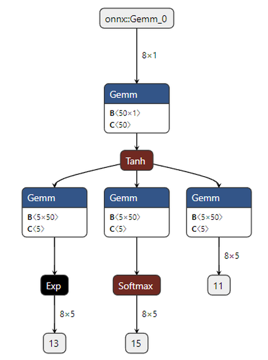

---

## 5.6.5 Maximum Likelihood Estimation
<!-- 슬라이드 512 -->

MDN 의 출력은 확률분포이므로, "예측값과 정답의 거리" 로 손실을 정의할 수 없다. 대신 **정답이 예측된 분포에서 나왔을 가능성(likelihood)** 을 최대화한다. 이것이 Maximum Likelihood Estimation(MLE)이다.

**Likelihood 기여도**

데이터 $x_i$ 하나의 likelihood 기여도는 후보 분포 $P(\theta)$ 를 $x_i$ 위치에서 읽은 높이다(원문 표기로는 $P(x_i, \theta) = x_i P(\theta)$). 주황색 후보 분포 위에 데이터 점 $1, 4, 5, 6, 9$ 를 놓으면, 각 점에서 곡선까지의 점선 높이가 그 데이터의 기여도다. 봉우리 근처의 점(4, 5, 6)은 기여도가 크고, 꼬리의 점(1, 9)은 작다.

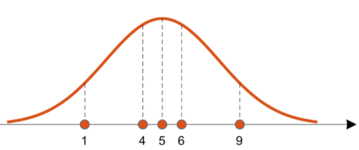

**Likelihood(가능도)**

Likelihood 는 $\mathcal{L}(\cdot)$ 또는 $L(\cdot)$ 로 쓴다. 분포 $\theta$ 가 주어졌을 때 데이터 전체가 나올 확률이며, 각 데이터의 기여도를 모두 곱한 것이다.

$$
\mathcal{L}(\theta \mid x) = P(x \mid \theta) = \prod_{k=1}^{n} P(x_k \mid \theta)
$$

- 지금 얻은 데이터가 $\theta$ 분포로부터 나왔을 가능성이다.
- 데이터 샘플 각각에서 $\theta$ 분포의 높이(likelihood 기여도)를 찾고, 그것을 다 곱한 것이다.

**Log-Likelihood**

곱은 다루기 어렵고 값이 매우 작아지므로 로그를 취해 합으로 바꾼다. $l(\cdot) = \log \mathcal{L}(\cdot) = \log L(\cdot)$ 이다(종종 $L(\cdot) = \mathcal{L}^{*}(\cdot) = \log \mathcal{L}(\cdot)$ 로 표기하기도 한다).

$$
l(\theta \mid x) = \log \mathcal{L}(\theta \mid x) = \log P(x \mid \theta) = \sum_{i=1}^{n} \log P(x_i \mid \theta)
$$

**Maximum Likelihood Estimation**

MLE 는 likelihood 를 가장 크게 만드는 분포의 parameter 를 고르는 것이다.

$$
\hat{\theta} = \arg\max_{\theta} \mathcal{L}(\theta)
$$

정규분포에서는 $\theta = (\mu, \sigma)$ 이고, likelihood 를 최대화하는 해는 표본평균과 표본분산이다.

$$
\hat{\mu} = \frac{\sum x_i}{n}, \qquad \sigma^2 = \frac{\sum (x_i - \mu)^2}{n}
$$

세 단계를 그림으로 보면 다음과 같다. 위는 데이터를 낳은 분포 $p(\theta)$(data distribution), 가운데는 그 분포에서 뽑힌 데이터 $P(x \mid \theta)$(sampled data)를 밀도 곡선 위에 올린 것, 아래는 parameter $\theta$ 를 바꿔 가며 계산한 likelihood $L(\theta \mid x)$ 다. likelihood 곡선이 가장 높은 곳의 $\theta$ 가 MLE 의 답이다.

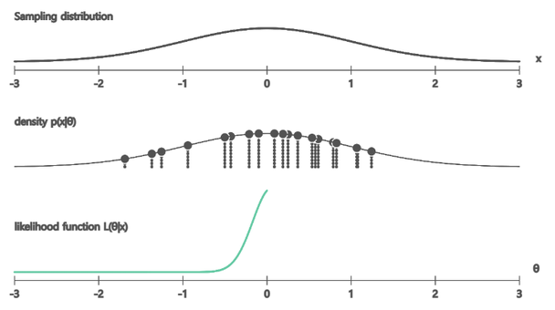

---

## 5.6.6 모델의 Cost Function
<!-- 슬라이드 513 -->

MLE 를 MDN 에 적용한다. 모델의 예측값은 $k$ 개의 정규분포로 표현된 분포다.

$$
p(y \mid x) = \sum_{k} \pi_k(x)\, N\big(y \mid \mu_k(x),\, \sigma_k^2(x)\big)
$$

- **학습 대상**: 입력 $x$ 에 대한 $y$ 의 확률분포 $p(y \mid x)$.
- **학습 방식**: $k$ 개의 정규분포의 조합으로 최적의 $p(y \mid x)$ 함수를 만든다. $K = 3$ 일 경우, 3 개의 정규분포로 $x_1$ 에 대한 $y_1$ 의 확률분포를 표현하는 것이다.
- **학습 효과 측정**: $y_{true}$ 의 확률분포와 예측된 $p(y \mid x)$ 가 최대한 겹치는 것. 그 척도가 Maximum Likelihood Estimation 이다.

입력 $x_1$ 하나를 놓고 보면 예측 분포는 다음과 같다.

$$
p(y_1) = \sum_{k=1}^{3} \pi_k(x_1)\, N\big(\mu_k(x_1),\, \sigma_k^2(x_1)\big)
$$

그림은 뒤집힌 S 자 데이터를 $K = 3$ 인 MDN 이 어떻게 표현하는지 보여 준다. 세 개의 파란 곡선이 $x$ 에 따른 평균 함수 $\mu_1(x)$, $\mu_2(x)$, $\mu_3(x)$ 이고, 데이터의 세 갈래를 하나씩 맡는다. 특정 입력 $x_1$ 에서 수직선을 그으면 세 곡선과 만나는 높이가 세 component 의 평균이고, 오른쪽에 그려진 $p(y_1)$ 은 그 세 평균을 중심으로 폭 $\sigma_1$, $\sigma_2$, $\sigma_3$ 을 가진 세 봉우리의 합이다. 다른 입력 $x_n$ 에서는 봉우리의 위치와 폭이 달라져 $p(y_n)$ 이 된다.

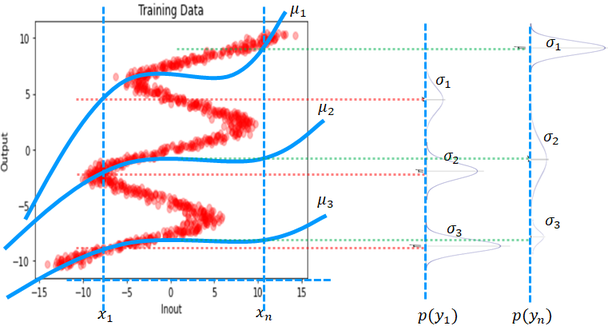

그렇다면 $y_1$ 값은 무엇인가? $p(y_1)$ 에서 sampling 해서 얻은 값이다. 확률이므로 실제 값은 sampling 할 때마다 다를 것이다. 어느 봉우리가 뽑힐지는 $\pi_k(x_1)$ 에 따라, 봉우리 안에서 어디가 뽑힐지는 $\mu_k(x_1)$ 과 $\sigma_k(x_1)$ 에 따라 정해진다.

> **핵심 메시지**
> MDN 은 "정답 하나" 를 맞히도록 학습하지 않는다. 정답 $y_{true}$ 가 예측 분포 $p(y \mid x)$ 아래에서 높은 확률을 갖도록, 즉 likelihood 가 커지도록 $\pi$, $\mu$, $\sigma$ 를 조정한다. 예측값은 학습이 끝난 분포에서 sampling 하여 얻는다.

---

## 5.6.7 손실 함수·Dataset·Sampling 구현
<!-- 슬라이드 514~517 -->

### 실습 5.6.1 — (3) calc_pdf: 결합 확률밀도 계산
<!-- 슬라이드 514 -->

> 노트북: `code/5.6.1.MixtureDensityNetwork.ipynb` (계속)

학습 효과의 측정 기준은 $y_{true}$ 의 확률분포와 $p(y \mid x)$ 가 최대한 겹치는 것이다. Maximum Likelihood Estimation($P(x \mid \mu, \sigma)$)은 sample $x$ 를 표현하는 최적의 $\mu, \sigma$ 를 찾는 것이고, cost function 은 예측된 확률분포 $p(y \mid x)$ 와 목표값 $y_{true}$ 의 log likelihood 를 사용한다. 최대화 문제를 최소화 문제로 바꾸기 위해 부호를 뒤집는다.

$$
-\log L = -\log\Big(\sum_{k}^{K} \pi_k(x)\, p\big(y_{true}, \mu(x), \sigma(x)\big)\Big)
$$

출력 $\mu, \sigma$ 로부터 계산되는 확률분포 $p(y_{pred})$ 와 정답 $y_{true}$ 의 결합확률밀도(joint distribution)를 구하고, 가중치 $\pi_k(x)$ 를 적용해 더한 뒤 $-\log(\cdot)$ 를 적용한다.

이 계산의 첫 단계가 `calc_pdf()` 다. 결합 확률밀도 $p(y_{true} \mid \mu_x, \sigma_x)$, 곧 정규분포 $N(\mu_x, \sigma_x)$ 를 $y_{true}$ 위치에서 읽은 높이(likelihood 기여도)를 계산한다.

$$
p(y_{true} \mid \mu_x, \sigma_x) = N(\mu_x, \sigma_x)(y_{true})
= \frac{1}{\sqrt{2\pi\sigma_x^2}} \exp\Big(-\frac{(y_{true} - \mu_x)^2}{2\sigma_x^2}\Big)
$$

```python
## 학습된 확률함수와 y_true의 likelihood를 계산,
## y_true와 5개 정규분포로 부터 y의 확률을 계산
@MixtureDensity.add_method
def calc_pdf(self, y, mu, var): #(n, 5, 5)
    """Calculate component density"""
    value = (y - mu)** 2 #
    value = torch.exp(-value/(2*var))
    value = (1/torch.sqrt(2* torch.pi * var)) * value
    return value #각 y에 대한 5개의 확률값:(n, 5)
```

코드는 정규분포 밀도 공식을 세 줄로 나누어 계산한다. `(y - mu)**2` 가 지수 안의 분자, `torch.exp(-value/(2*var))` 가 지수 부분, `1/torch.sqrt(2*torch.pi*var)` 가 정규화 상수다. 모델이 출력하는 `var` 는 이미 `exp` 를 거친 양수이므로 그대로 분산 자리에 들어간다.

- $y_{true}$ 값은 batch_size 만큼 입력된다. `y` 의 모양은 $(n, 1)$, `mu` 와 `var` 는 $(n, 5)$ 이므로 broadcasting 으로 $y$ 하나가 다섯 component 와 각각 짝지어진다.
- Return 값은 각 $y_{true}$ 에 대한 5 개 확률분포에 대한 확률 값, 즉 $(n, 5)$ 이다.
- 이 5 개의 확률 값이 5 개의 학습된 확률분포함수에 대한 likelihood(score)다. 어느 component 가 $y_{true}$ 를 잘 설명하는지가 이 값에 담긴다.

### 실습 5.6.1 — (4) mdn_loss 와 training_step
<!-- 슬라이드 515 -->

Loss 는 cost function 을 그대로 계산한다. $\phi$ 는 앞에서 `calc_pdf` 로 구한 정규분포 밀도다.

$$
\text{CostFunction}(y \mid x) = -\log\Big(\sum_{k}^{K} \pi_k(x)\, \phi\big(y, \mu(x), \sigma(x)\big)\Big)
$$

계산 순서는 다음과 같다.

1. 각 분포(출력값 $\mu, \sigma$ 로 표현된)와 $y_{true}$ 의 결합확률밀도를 계산한다.
2. 그 값에 가중치 `pi` 를 곱한다.
3. 5 개 component 를 모두 더한다.
4. $-\log$(정보량화)한 뒤 평균(기대값)을 취하여 batch 의 loss 값(scalar)을 리턴한다.

```python
## 예측한 밀도함수 N(mu,var)에서 y확률밀도를 계산하고,
## -log(likelihood) & recuce_sum -> loss
@MixtureDensity.add_method
def mdn_loss(self, y_true, pi, mu, var):   #(n,5,5,5)
    out = self.calc_pdf(y_true, mu, var)   #(n,5)<-(n,5,5)
    out = torch.multiply(out, pi) # 확률에 가중치를 곱 #(n,5)
    out = torch.sum(out, 1, keepdim=True)  #(n,1)
    out = -torch.log(out + 1e-10)          # -log(n,1)
    return torch.mean(out)                 #(1,)
```

모양의 흐름을 따라가면 손실이 어떻게 scalar 가 되는지 보인다. `calc_pdf` 의 결과 $(n, 5)$ 에 같은 모양의 `pi` 를 원소별로 곱하고, `torch.sum(out, 1, keepdim=True)` 로 component 축을 더해 $(n, 1)$ 을 만든다. 이것이 각 샘플의 $p(y_{true} \mid x)$ 다. `-torch.log(out + 1e-10)` 에서 `1e-10` 은 밀도가 0 에 가까울 때 $\log 0$ 이 되어 발산하는 것을 막는 안전장치다. 마지막 `torch.mean` 이 batch 평균을 취해 $(1,)$ 의 loss 를 돌려준다.

`training_step` 은 배치를 모델에 넣어 세 parameter 를 얻고, 그것을 `mdn_loss` 에 넘기기만 하면 된다. optimizer 는 Adam 이며, 학습률 0.0005 와 weight decay 0.0005 를 준다. `on_train_epoch_end` 는 `print_every` epoch 마다 중간 결과를 그리는 훅으로, 그리는 함수는 (7) 에서 정의한다.

```python
@MixtureDensity.add_method
def training_step(self, batch, batch_idx):
    x, y = batch
    pi, mu, var = self(x)
    loss = self.mdn_loss(y, pi, mu, var)
    self.log('loss', loss, prog_bar=True)
    return loss

@MixtureDensity.add_method
def configure_optimizers(self):
    return torch.optim.Adam(self.parameters(),lr=0.0005, weight_decay=0.0005)

@MixtureDensity.add_method
def on_train_epoch_end(self):
    if (self.trainer.current_epoch + 1) % self.print_every == 0:
        self.training_result_plot()
```

### 실습 5.6.1 — (5) Dataset
<!-- 슬라이드 516 -->

학습 데이터는 (1) 에서 만든 뒤집힌 데이터 `flipped_x`, `flipped_y` 를 그대로 쓴다. `create_book_example` 로 만든 `X`, `y` 를 서로 바꾸어 `flipped_x = y`, `flipped_y = X` 로 두었고, `CustomDataset` 은 (1) 에서 정의한 것이다. 이번에는 배치 크기를 256 으로 키우고 `shuffle=True` 로 섞는다.

```python
trainDataset = CustomDataset(flipped_x, flipped_y)
trainDataLoader = DataLoader(trainDataset, batch_size=256, shuffle=True)
```

`x_test` 는 $-10.5$ 부터 $10.5$ 까지 $0.05$ 간격의 420 개 점이다. 학습 중 중간 결과를 그릴 때와 학습이 끝난 뒤 sampling 할 때 모두 이 420 개 입력을 쓰므로, 뒤의 코드에 나오는 모양의 첫 축 420 은 모두 `x_test` 의 길이다.

### 실습 5.6.1 — (6) Sampling: 학습된 확률분포로부터 출력값 찾기
<!-- 슬라이드 517 -->

MDN 의 예측은 분포이므로, 눈에 보이는 출력값을 얻으려면 sampling 해야 한다. `sample_predictions` 는 확률 parameter 를 받아 test samples(420) x samples(10) 개의 sampling 결과를 리턴한다.

```python
@MixtureDensity.add_method
def sample_predictions(self, pi_vals, mu_vals, var_vals, samples=10):
    n, k = pi_vals.shape  # n:420, k:5
    out = np.zeros((n, samples, f)) # (420,10,1)
    for i in range(n): # #in_sample(420)
        for j in range(samples):#aug_sample(10)
            # pi 샘플링: pi[i]에 있는 확률로 하나 선택
            #         : k선택, 샤용할 mu, var 선택
            idx = np.random.choice(range(k), p=pi_vals[i])
            for li in range(f):
                #정규분포에서 (mu[i번째x에대한][idx],var[i번째x에대한][idx])
                #            로 샘플링
                out[i,j,li] = np.random.normal(mu_vals[i, idx*(li+f)],
                                                np.sqrt(var_vals[i, idx]))
    return out #out[i번째x에대한,j번째샘플,li번째feature]:(420,10,1)
```

Sampling 은 두 단계다.

1. **Component 고르기**: `pi_vals[i]` 는 $i$ 번째 입력에 대한 5 개 가중치 $(5,)$ 다. `np.random.choice(range(k), p=pi_vals[i])` 가 이 가중치에 따라 index 하나를 고른다. 가중치가 큰 봉우리가 자주 뽑힌다.
2. **정규분포에서 뽑기**: 고른 component 의 평균 `mu_vals[i, idx]` 와 표준편차 `np.sqrt(var_vals[i, idx])` 로 정규분포 난수를 하나 뽑는다. 모델이 출력하는 것은 분산이므로 `np.sqrt` 로 표준편차를 만들어 넘긴다.

이것을 입력 420 개마다 10 번 반복하면 결과는 $(420, 10, 1)$ 이다. 입력 하나에 점이 10 개씩 찍히므로, 갈래가 여럿인 구간에서는 10 개의 점이 여러 갈래에 나뉘어 놓인다.

학습이 끝난 모델로 sampling 결과를 그린다. 먼저 모델에 `x_test` 를 넣어 $(420, 5)$ 모양의 `pi_vals`, `mu_vals`, `var_vals` 세 tensor 를 얻고, numpy 로 바꿔 `sample_predictions` 에 넘긴다.

```python
# Plot the predictions along with the flipped data
import matplotlib.patches as mpatches

# Prediction으로 확률 parameter 산출   #(420,5)x3 <- (420)
pi_vals, mu_vals, var_vals = model(torch.Tensor(x_test))
# 5개 확률분포에서 중요도에 따라 10개 sampling 하기
pi_vals = pi_vals.cpu().detach().numpy()
mu_vals = mu_vals.cpu().detach().numpy()
var_vals = var_vals.cpu().detach().numpy()
sampled_predictions = model.sample_predictions(pi_vals, mu_vals, var_vals, 10)
#sampled_predictions.shape : (420,10,1)
fig = plt.figure(figsize=(5, 5))
plt.plot(flipped_x, flipped_y, 'ro')#training data
for i in range(sampled_predictions.shape[1]): # 10
     plt.plot(x_test, sampled_predictions[:, i], 'b.', alpha=0.3, label='predicted')
patches = [ mpatches.Patch(color='red', label='Training'),
            mpatches.Patch(color='blue', label='Predicted') ]
plt.legend(handles=patches)
plt.show()
```

`sampled_predictions[:, i]` 는 $i$ 번째 sampling 회차의 420 개 점이며, 이것을 10 번 겹쳐 그린다. 결과를 보면 sampling 된 점들이 뒤집힌 S 자의 모든 갈래를 따라 놓인다. MLP 회귀가 갈래의 평균만 그리던 것과 달리, MDN 은 갈래마다 다른 component 를 배정하고 그 비중까지 배웠기 때문에 sampling 결과가 데이터의 모양을 그대로 재현한다.

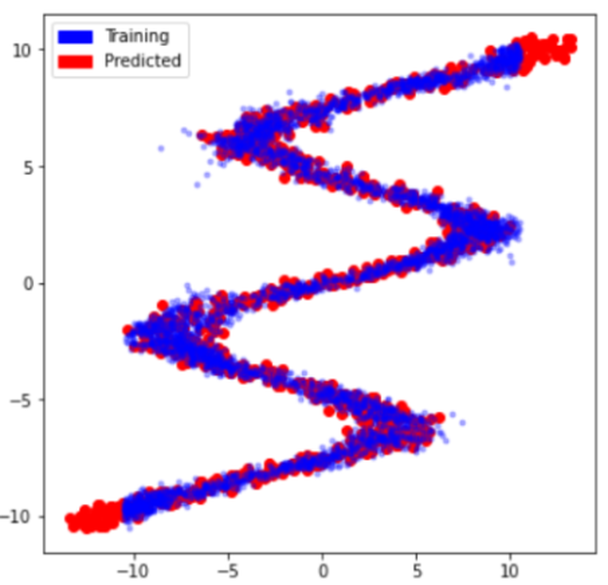

---

## 5.6.8 학습 중간 결과 관찰과 component 수
<!-- 슬라이드 518~519 -->

### 실습 5.6.1 — (7) 학습과 중간 결과 확인
<!-- 슬라이드 518 -->

MDN 의 학습은 손실 값만으로는 진행 상황을 읽기 어렵다. 그래서 training 중 중간 결과로 sampling 결과와 parameter 들을 함께 그려 확인한다. `training_result_plot` 은 `on_train_epoch_end` 에서 `print_every` epoch 마다 호출되며, 네 개의 패널을 그린다.

```python
#중간결과 보여 주기
@MixtureDensity.add_method
def training_result_plot(self):
    f, (ax1, ax2, ax3, ax4) = plt.subplots(1, 4, sharey=False, figsize=(12,3))
    epoch = self.trainer.current_epoch
    # Get predictions, Get samples
    x_test_tensor = torch.FloatTensor(x_test).to(device)
    self.eval() ###
    pi_vals, mu_vals, var_vals = self(x_test_tensor) #[(420,5),(420,5),(420,5)]
    sampled_predictions = self.sample_predictions(pi_vals.cpu().detach().numpy(),
                                                  mu_vals.cpu().detach().numpy(),
                                                  var_vals.cpu().detach().numpy(), 10)
    self.train() ###
    ax1.plot(flipped_x, flipped_y, 'ro', alpha=0.1)
    for i in range(sampled_predictions.shape[1]):
        ax1.plot(x_test, sampled_predictions[:, i], 'b.', alpha=0.1, label='predicted')
    ax1.axis([-12, 12, -12, 12])
    ax1.set_title(("[%d] Sampled Results") % (epoch))

    ax2.plot(x_test, mu_vals.cpu().detach().numpy(), label="Mean Functions")
    ax2.set_title(("[%d] Means : Mu(x)") % (epoch))
    ax2.axis([-12, 12, -12, 12])

    ax3.plot(x_test, pi_vals.cpu().detach().numpy(), label="Mix Functions")
    ax3.set_title(("[%d] Mixing Coeff. Pi(x)") % (epoch))

    ax4.plot(x_test, var_vals.cpu().detach().numpy(), label="Var Functions")
    ax4.set_title(("[%d] Variance Coeff. Var(x)") % (epoch))

    ax1.grid(True)
    ax2.grid(True)
    ax3.grid(True)
    plt.show()
    return var_vals
```

중간에 `self.eval()` 로 바꾸었다가 `self.train()` 으로 되돌리는 이유는, 은닉층에 `Dropout` 이 있어서 평가 시에는 dropout 을 꺼야 parameter 가 안정적으로 나오기 때문이다. 네 패널이 보여 주는 것은 다음과 같다.

| 패널 | 내용 | 읽는 법 |
|---|---|---|
| Sampled Results | 학습 데이터(빨강)와 sampling 결과(파랑) | 파란 점이 빨간 갈래를 모두 덮는지 |
| Means : Mu(x) | 입력에 따른 5 개 component 의 평균 $\mu_k(x)$ | 각 곡선이 데이터의 어느 갈래를 맡았는지 |
| Mixing Coeff. Pi(x) | 입력에 따른 5 개 가중치 $\pi_k(x)$ | 어느 구간에서 어느 component 가 켜지는지 |
| Variance Coeff. Var(x) | 입력에 따른 5 개 분산 | 분산이 작게 수렴하는지, 튀는 곳은 없는지 |

학습을 시작한다. 배치 256 개로 3000 epoch 를 돌리며, 500 epoch 마다 위의 네 패널이 출력된다.

```python
print_every = 500
model = MixtureDensity(print_every)

name = "MixtureDensity"
logger = CSVLogger("logs", name=name)
trainer = Trainer(max_epochs=3000, logger=logger)
trainer.fit(model, trainDataLoader)
```

학습 초반과 후반의 중간 결과를 비교하면 학습이 무엇을 바꾸는지 보인다. 초반(그림의 epoch 1499)에는 sampling 된 파란 점이 데이터 주변에 넓게 흩어져 있고, 분산 곡선은 왼쪽 끝에서 50 에 가까운 큰 값을 가진다. 평균 곡선들은 아직 갈래를 나누어 맡지 못하고 서로 얽혀 있다.

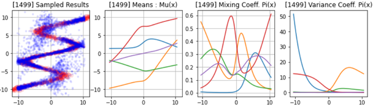

후반(그림의 epoch 5999)에는 파란 점이 빨간 데이터 위에 거의 정확히 겹친다. 평균 곡선들은 각자 다른 구간을 맡아 갈라지고, 가중치 곡선은 구간마다 다른 component 가 켜지도록 번갈아 오르내리며, 분산은 전 구간에서 1 근처의 작은 값으로 내려온다.

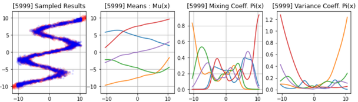

### 결과가 좋지 않을 때 — 분산 값의 변화와 component 수
<!-- 슬라이드 519 -->

같은 코드를 돌려도 결과가 늘 좋은 것은 아니다. 학습이 잘못된 경우의 중간 결과를 보면 sampling 된 점이 데이터 주변에 넓게 튀어 있고, 분산 곡선에 0 부근에서 25 까지 치솟는 뾰족한 봉우리가 있다. 특정 구간에서 어느 component 도 데이터를 제대로 맡지 못해, 분산을 키우는 것으로 likelihood 를 억지로 확보한 상태다.

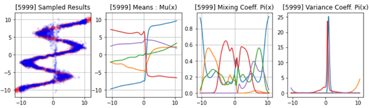

왜 이런 경우가 발생할까?

- **초기값의 영향**: weight 초기값에 따라 component 들이 갈래를 나누어 맡지 못하고 한쪽으로 몰릴 수 있다. 해결이 쉽지 않다.
- **Overfitting**: 학습속도(learning rate), model capacity, dataset 이 관련된다.
- **기본적으로 components 가 너무 적다!** 데이터의 갈래 수보다 component 수가 적으면 한 component 가 여러 갈래를 억지로 덮어야 하고, 그 결과가 큰 분산으로 나타난다.

그러니 components 를 늘려 실행시켜 보자. 모델 정의의 `k = 5` 를 키우면 `mu_layer`, `var_layer`, `pi_layer` 의 출력 수가 함께 늘어나고, 나머지 코드는 `k` 를 참조하므로 그대로 동작한다.

---

## 5.6.9 Handwriting Prediction 을 위한 Deep RNN 구조
<!-- 슬라이드 520~521 -->

이제 MDN 을 손글씨로 가져간다. Graves 의 handwriting prediction 은 "다음 펜 위치를 예측하는 예측기" 이며, 그 구조는 Deep RNN Architecture 다.

**Deep RNN Architecture**

- RNN 을 사용하며 하나 이상의 hidden layers 와 skip connections 를 사용한다. 입력이 모든 LSTM 층으로 직접 연결되고, 모든 LSTM 층의 출력이 출력층으로 직접 연결된다.
- 입력은 한 번에 하나씩 주어진다.
- 출력은 예측 값의 확률분포다.
- 출력 확률분포에서 sampling 하여 다음 입력으로 사용한다.

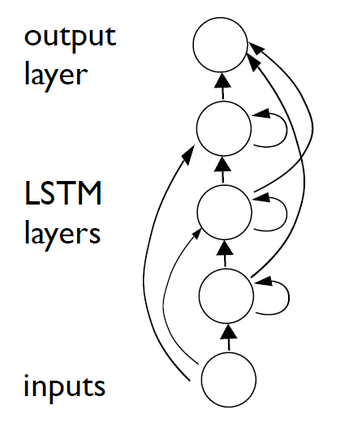

**Deep RNN prediction architecture**

시간 축으로 펼쳐 보면 각 시점 $t$ 에서 입력 $x_t$ 가 hidden layers $h_t^1, h_t^2, h_t^3$ 을 거쳐 출력 $y_t$ 가 된다. 출력 $y_t$ 는 값이 아니라 다음 입력에 대한 확률분포 $\Pr(x_{t+1} \mid y_t)$ 를 정하는 parameter 이며, 그림의 점선 화살표가 이 관계다. **Generation 은 출력에서 sampling 되어 입력으로 공급되는 과정**이다. 학습 때는 실제 다음 좌표를 입력으로 주지만, 생성 때는 출력 분포에서 뽑은 좌표를 다음 입력으로 넣어 시퀀스를 이어 간다.

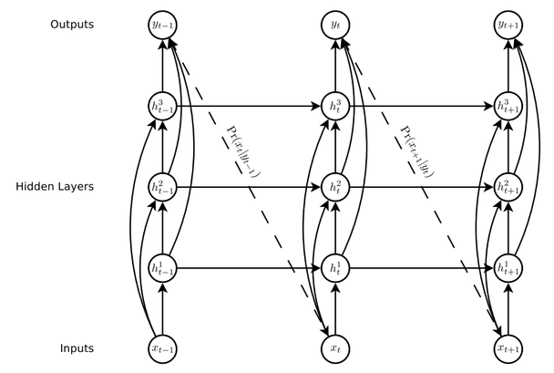

이 구조에서 시퀀스 $x$ 의 확률(probability of sequence $x$)은 각 시점의 조건부 확률로부터 정해지고, sequence loss $L(x)$ 는 그 확률에 음의 로그를 취한 것이다. 확률이 1 에 가까우면 손실은 0 에 가깝고, 확률이 0 으로 갈수록 손실은 급격히 커진다. MDN 의 $-\log L$ 과 같은 원리다.


각 hidden layer 의 node 는 LSTM cell 이다. forget gate, input gate, output gate 의 세 sigmoid 와 후보 값의 tanh 로 cell state 를 갱신하는 구조는 앞 절에서 본 것과 같다.

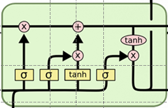

---

## 5.6.10 Handwriting Prediction 의 출력 — MDN
<!-- 슬라이드 522~523 -->

**Handwriting Prediction**

입력과 출력을 구체적으로 정하면 다음과 같다.

- 입력 $x_t$ 는 pen 위치 $(x_1, x_2)$ 와 획 상태 $x_3$ 이다. 획을 끝내면(펜을 떼면) $x_3 = 1$ 이다.
- 출력 $y_t$ 는 Mixture Density Network 으로, 혼합밀도 함수의 조합으로 다음 위치를 예측한다. $y_t$ 의 내용은 획 확률 $e$ 와, $j$ 번째 mixture component 마다의 혼합 가중치 $\pi_j$, 평균 $\mu_j$, 표준편차 $\sigma_j$, 상관계수 $\rho_j$ 다. 여기서 $\rho = \mathrm{Corr}(x_1, x_2)$ 다.

즉 다음 시점의 pen displacement(펜의 이동량)는 mixture of Gaussians 로, 획의 끝(end of stroke)은 Bernoulli 로 모델링한다. 5.6.3 에서 component 가 연속변수(정규분포)일 수도 이진변수(Bernoulli)일 수도 있다고 한 것이 여기서 함께 쓰인다.

- End of stroke as Bernoulli
- Next pen displacement as mixture of Gaussians

이번에는 출력이 2 차원 좌표이므로 각 component 는 **이변량 정규분포**다. 두 좌표 사이의 상관관계를 표현하기 위해 상관계수 $\rho_j$ 가 parameter 에 추가된다. 다음 입력의 확률은 다음과 같다.

$$
\Pr(x_{t+1} \mid y_t) = \sum_{j=1}^{M} \pi_t^{j}\, \mathcal{N}\big(x_{t+1} \mid \mu_t^{j}, \sigma_t^{j}, \rho_t^{j}\big)
\begin{cases}
e_t & \text{if } (x_{t+1})_3 = 1 \\
1 - e_t & \text{otherwise}
\end{cases}
$$

$M$ 개 component 의 이변량 정규분포를 $\pi_t^j$ 로 가중합한 것이 좌표의 확률이고, 여기에 획의 끝 여부에 따라 $e_t$ 또는 $1 - e_t$ 를 곱한다. $\pi$ 와 $\sigma$ 는 5.6.4 에서 본 것과 같은 방법(softmax, exp)으로 만든다.

- Mixture Density Network 설명 자료: https://goo.gl/dIj5Tx

**Mixture density outputs(density map)**

단어 'under' 를 쓰는 동안 네트워크가 예측한 다음 펜 위치의 확률분포(probability distributions for the predicted pen locations)를 그린 것이다.

- 작은 점은 쓰는 중의 예측치, 큰 점은 획의 끝에서 다음 획의 시작점에 대한 예측치다.
- 아래의 mixture component weight 그림을 보면, 가장 활동적인 구성 요소가 세 곳에서 단절된다. 획의 끝점 예측에는 획 중의 예측과 다른 혼합 구성 요소가 사용된다.

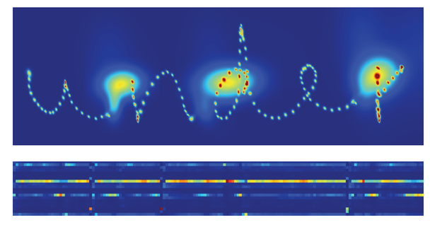

획 중에는 다음 점이 바로 근처에 있으므로 분포가 좁고, 획의 끝에서는 다음 획이 어디서 시작할지 불확실하므로 분포가 넓게 퍼진다. 하나의 정규분포로는 이 두 상황을 모두 표현할 수 없고, 상황마다 다른 component 가 켜지는 mixture 이기에 가능하다.

---

## 5.6.11 Handwriting Synthesis 와 Soft Window
<!-- 슬라이드 524~525 -->

**Handwriting Synthesis network 개발**

Prediction network 은 "다음 점" 만 예측하므로, 무엇을 쓸지 정해 주지 않으면 글자 비슷한 획을 무작위로 이어 갈 뿐이다. 실제로 prediction network 으로 생성한 결과를 보면 필체는 자연스럽지만 읽을 수 있는 단어가 되지 않는다.

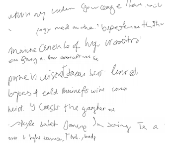

원하는 문장을 쓰게 하는 handwriting synthesis 는 prediction network 으로는 불가능하다. 문자의 길이에 따른 필기체의 변화가 너무 크기 때문이다. 같은 글자라도 앞뒤 글자와 필체에 따라 획 수와 길이가 크게 달라서, 문장 전체를 한 번에 조건으로 주는 방식으로는 "지금 어느 글자를 쓰고 있는지" 를 네트워크가 따라가지 못한다. 그래서 **soft window** 를 적용한다.

**Synthesis Network + Heuristics — Soft window**

- 길이 $U$ 의 문장 $c$ 와 길이 $T$ 의 시퀀스 $t$ 가 주어진다.
  - Sequence $c$: $\{c_1, c_2, \dots, c_U\}$ — 쓸 문자열
  - Sequence $t$: $\{x_1, x_2, \dots, x_T\}$ — 펜 좌표의 시퀀스
- $c$ 에 대한 window $w_t$ 는 각 char 가 적절한 $t$ 에 있도록 유도하는 확률분포가 된다.

$$
w_t = \sum_{u=1}^{U} \phi(t, u)\, c_u
$$

$\phi(t, u)$ 는 시점 $t$ 에서 문자 $c_u$ 에 얼마나 주목할지를 나타내는 window weight 이고, $w_t$ 는 그 가중치로 문자들을 섞은 벡터다. 시점마다 "지금 쓰고 있는 글자" 근처의 문자에 큰 가중치를 두면, 네트워크는 문장 전체가 아니라 현재 글자에 집중해 획을 만들 수 있다. window 의 위치가 시간에 따라 문장을 따라 앞으로 이동하도록 만드는 것이 heuristic 이다.

Synthesis network 은 prediction network 의 첫 hidden layer 와 둘째 hidden layer 사이에 window 층을 끼워 넣은 구조다. 첫 hidden layer 의 출력이 window 의 parameter 를 정하고, window 가 문자열 $c$ 로부터 $w_t$ 를 만들어 둘째 hidden layer 와 다음 시점의 첫 hidden layer 에 넣어 준다.

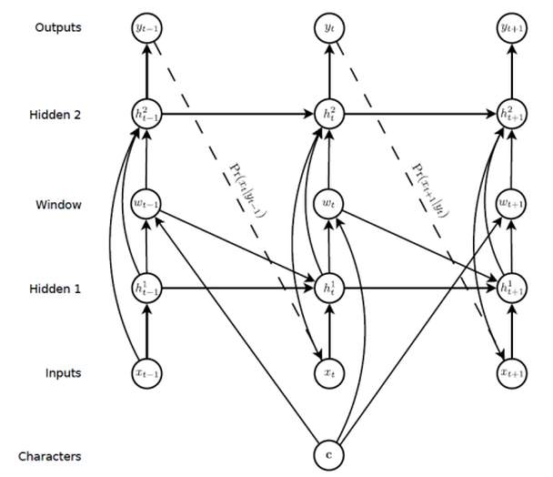

문장 "Thought that the muster from" 을 쓰는 동안의 window weights 를 보면, 세로축의 문자와 가로축의 시간에 대해 밝은 띠가 왼쪽 아래에서 오른쪽 위로 대각선을 그린다. 시간이 흐르면서 window 가 문자열을 한 글자씩 따라 올라간다는 뜻이며, 아래에 그려진 실제 생성 글씨와 대응된다.

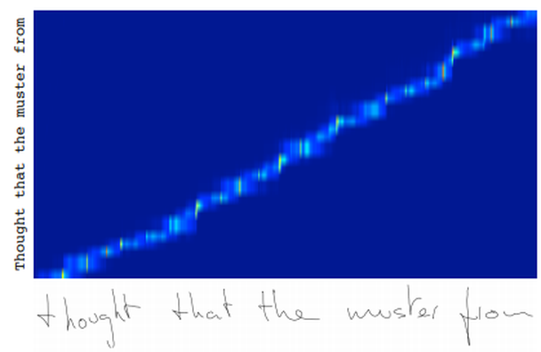

---

## 5.6.12 정리
<!-- 슬라이드 526 -->

이 절의 결론은 다음과 같다.

- LSTM 은 오늘날에도 중요하다(LSTM is important in now days).
- RNN 은 deterministic model 이다. 같은 입력에 늘 같은 출력을 낸다.
- 그러나 출력을 확률분포로 만들고 거기서 sampling 하면, RNN 으로도 시퀀스를 생성하는 것이 가능하다.
- Synthesis 에는 heuristics 가 필요하다. soft window 처럼 "무엇을 쓸지" 를 따라가게 하는 장치가 있어야 읽을 수 있는 글씨가 된다.
- 많은 기회가 있는 분야다.

절 전체의 흐름을 되짚으면 다음과 같다.

1. 입력과 출력을 뒤집은 **inverse problem** 에서는 입력 하나에 출력이 여러 갈래이고 분산이 입력에 따라 변한다(이분산성). 평균 하나를 내는 MLP 회귀는 갈래의 평균을 그려 실패한다.
2. **MDN** 은 출력을 값이 아니라 혼합 가우시안 분포의 parameter $(\pi, \mu, \sigma)$ 로 만든다. $\pi$ 는 softmax, $\sigma$ 는 exp 로 제약을 만족시킨다.
3. 손실은 **MLE** 에서 온다. 정답 $y_{true}$ 가 예측 분포에서 갖는 밀도를 component 마다 구하고(`calc_pdf`), $\pi$ 로 가중합한 뒤 $-\log$ 와 평균을 취한다(`mdn_loss`).
4. 예측은 분포에서 **sampling** 해 얻는다. $\pi$ 로 component 를 고르고, 그 정규분포에서 값을 뽑는다.
5. 학습 중에는 sampling 결과·$\mu(x)$·$\pi(x)$·분산의 네 패널을 함께 본다. 분산이 튀면 component 가 부족한 신호이므로 $k$ 를 늘린다.
6. Handwriting prediction 은 skip connection 을 가진 **deep LSTM** 위에 MDN 을 얹어, 펜의 이동량은 이변량 정규분포의 혼합으로, 획의 끝은 Bernoulli 로 예측하고 출력에서 sampling 한 값을 다음 입력으로 넣는다.
7. Handwriting synthesis 는 여기에 **soft window** $w_t = \sum_u \phi(t, u) c_u$ 를 더해, 시간에 따라 문장의 글자를 한 글자씩 따라가며 쓰게 한다.
