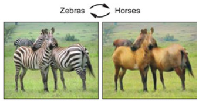
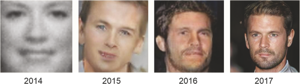

# 6장 개요 — Generative Model
<!-- 슬라이드 529, 533 -->

6장은 **생성 모델(Generative Model)** 을 다룬다. 부제가 말하듯 이 장의 모델들은 **이미지를 생성할 수 있는 DNN 모델**이다. 앞의 장들에서 만든 신경망은 이미지가 어떤 숫자인지, 다음 종가가 얼마인지처럼 입력을 받아 답을 내는 판별(discriminative) 모델이었다. 이 장의 모델은 반대 방향으로 일한다. 데이터가 어떤 분포에서 나왔는지를 배워 두었다가, 그 분포에서 새로운 데이터 — 학습 데이터에 없던 손글씨 숫자, 얼굴 사진 — 를 만들어 낸다. 아래 두 장의 그림이 이 장이 향하는 곳을 보여 준다. 왼쪽은 얼룩말 사진과 말 사진을 서로 바꾸어 주는 이미지 변환이고, 오른쪽은 생성 모델이 만들어 낸 얼굴 이미지가 해를 거듭하며 뭉개진 흑백 얼굴에서 사진과 구분하기 어려운 얼굴로 정교해져 온 과정이다.

이 장은 압축에서 생성으로 시야를 넓혀 가는 순서로 짜여 있다. 출발점은 입력을 좁은 잠재 공간(latent space)으로 압축했다가 다시 입력 자신으로 복원하는 Auto Encoder 다(6.1). 아직 "생성" 이라 부르기는 어렵지만, encoder·decoder·잠재 공간이라는 이 장의 어휘가 모두 여기서 나오고, 잠재 공간의 점을 decoder 에 넣으면 무엇이 나오는지를 처음 보게 된다. 이어서 잠재 변수를 고정된 벡터가 아니라 확률 분포로 다루기 위한 이론 — 변분 추론(Variational Inference), Entropy 와 KL divergence, ELBO — 을 정리하고(6.2), 그 이론을 코드로 옮긴 Variational Auto Encoder 를 만든다(6.3). 후반부는 접근이 다른 생성 모델인 GAN 이다. 생성기와 판별기가 경쟁하는 구조와 학습 절차를 vanilla GAN 과 DCGAN 으로 익히고(6.4), 여기에 조건·보조 분류기·잠재 코드를 하나씩 더해 생성 결과를 제어하는 CGAN, ACGAN, infoGAN 으로 마무리한다(6.5).

앞 장과의 연결도 분명하다. 5장 마지막 절에서 RNN 의 출력을 확률 분포로 바꾸고 그 분포에서 sampling 하여 글씨를 생성하는 생각을 처음 만났는데, 이 장은 그 생각을 정면으로 다룬다. 또 이 장의 encoder 와 decoder, DCGAN 의 생성기와 판별기는 3장과 4장에서 익힌 convolution 층으로 만들어지고, 학습 코드는 2장의 Lightning workflow 와 PyTorch 학습 loop 를 그대로 쓴다. 이 장이 교재의 마지막 장이므로, 앞에서 배운 도구가 모두 여기서 다시 쓰인다.

## 학습 목표
<!-- 슬라이드 534 -->

이 장을 마치면 다음을 할 수 있어야 한다.

**Auto Encoder**

- Encoder, Decoder, Auto Encoder 의 개념을 이해하고, Auto Encoder 모델을 적용할 수 있는 domain 을 배운다.
- Auto Encoder 모델의 구조를 이해하고, 모델을 MLP 구조와 ConvNet 으로 구현하여 그 특성을 확인한다.

**Variational Inference 와 VAE**

- Variational Inference 의 개념을 배우고, Generative Model 과 Latent Variable 의 개념을 이해한다.
- Variational Auto Encoder(VAE) 의 구조를 이해한다. 수학적 모델을 기반으로 모델을 이해하고, 실제 동작을 통해 확인한다.

**GAN**

- Generative Adversarial Networks(GAN) 의 구조를 이해한다. GAN 모델의 동작을 이해하고, 기본적인 GAN 코드를 이해한다.
- 다양한 GAN 모델들을 통해 본격적인 생성 모델을 이해한다.

## 절 구성
<!-- 슬라이드 533, 551, 559, 577, 605 -->
<!-- 슬라이드 530~532 : 숨김 공백 슬라이드, 내용 없음 -->

| 절 | 한 줄 요약 | 실습 |
|---|---|---|
| 6.1 Auto Encoder / Denoise Auto Encoder | Encoder 가 입력을 잠재 공간의 code 로, decoder 가 code 를 다른 도메인으로 사상하는 구조를 정의하고, decoder 의 목표를 입력 자신으로 둔 auto encoder 가 레이블 없이 압축 표현을 배우는 원리와 응용(denoising · super-resolution · segmentation) · 한계를 본다. 학습 중 입력에 noise 를 더하기만 하면 denoising 기능이 생기는 이유를 병목 구조로 설명하고, Linear 층 AE 세 가지(AE1 · weight decay 의 AE2 · 레이블을 함께 넣는 AE3) 와 CNN AE 를 Lightning 으로 만들어 복원 결과를 비교한다. 잠재 공간을 2차원으로 줄여 decoder 가 그리는 숫자 지도와 encoder 가 만든 군집을 시각화하는 것으로 절을 맺는다. | 실습 6.1.1 AE · 실습 6.1.2 CNN AE · 실습 6.1.3 2차원 잠재 공간 CNN AE |
| 6.2 Variational Inference | Auto Encoder 와 VAE 를 "Encoder + Latent Variable + Decoder" 라는 생성 모델의 틀에 놓고, 잠재 변수를 고정 벡터에 mapping 하느냐 분포에 mapping 하느냐의 차이를 본다. 좋은 생성 모델이란 좋은 잠재 변수를 잘 decoding 하는 것이며, $p(z \mid x)$ 를 직접 찾는 대신 encoder $q(z \mid x)$ 를 정규분포의 모수 조정으로 근사하는 것이 변분 추론이다. 근사의 척도인 $D_{KL}$ 을 정보량 · Entropy · Cross Entropy 에서 유도하고, KL 의 비대칭성과 JS divergence, 그리고 $\log P(x) = D_{KL} + \mathrm{ELBO}$ 로부터 ELBO 최대화가 학습 목표가 되는 이유를 정리한다. | 없음 (개념 절) |
| 6.3 Variational Auto Encoder | VAE 를 추론 모델(encoder) + 잠재 변수 + 생성 모델(decoder) 의 결합으로 보고, ELBO 를 키우는 것이 복원의 정확도와 잠재 분포의 모양을 동시에 잡는 이유를 설명한다. Sampling 노드에서 역전파가 막히는 문제를 reparameterization trick $z = \mu + \sigma \odot \epsilon$ 으로 풀고, cost function 을 reconstruction error(binary cross entropy) 와 latent variable regularization(KL divergence) 의 합으로 쓴다. PyTorch + Lightning 으로 잠재 차원이 2 인 MNIST VAE 를 만들어 잠재 평면을 격자로 훑은 생성 이미지와 label 별 군집을 그리고, fixed mapping 과 distributed mapping 의 차이를 확인한다. | 실습 6.3.1 VAE |
| 6.4 GAN: vanilla GAN, DCGAN | 분포를 모델링하는 생성기와 경계를 모델링하는 판별기가 경쟁하는 GAN 의 구조와 feedback, 학습이 진행되며 두 분포가 겹쳐 가는 과정, two-player game 의 비용 함수(판별기 gradient ascent · 생성기 gradient descent)와 생성기 loss 를 $-\log D(G(z))$ 로 바꾸는 이유를 본다. "판별기 학습 → 판별기 고정 후 생성기 학습" 의 training 절차를 optimizer 두 개로 구현하고, 학습된 z-space 의 vector arithmetic 과 interpolation 을 살핀다. sin 곡선의 일부를 생성하는 최소 기능의 vanilla GAN 과, CNN 을 적용하여 MNIST 숫자를 생성하는 DCGAN 을 만든다. | 실습 6.4.1 vanilla GAN · 실습 6.4.2 DCGAN |
| 6.5 Improved GAN: CGAN, ACGAN, infoGAN | DCGAN 이 만든 이미지를 제어할 수 없다는 한계를 세 단계로 푼다. CGAN 은 label 의 one-hot code 를 생성기와 판별기 입력에 concatenate 하여 원하는 숫자를 만들게 하고(loss 는 조건부 확률 $D(x \mid y)$ 로), ACGAN 은 판별기가 진위 판정에 더해 label 을 분류하는 보조 작업을 갖게 하며, infoGAN 은 잠재 공간을 얽힌 코드 $z$ 와 풀린 코드 $c$ 로 나누고 상호정보량 term 을 변분 추론으로 하한 잡아 latent code 가 기울기 · 두께 같은 특징을 제어하게 한다. 세 실습은 같은 골격을 반복하면서 입력 · 출력 · loss 항만 하나씩 늘려 간다. 끝으로 CycleGAN · Pix2Pix · SRGAN 을 소개한다. | 실습 6.5.1 CGAN · 실습 6.5.2 ACGAN · 실습 6.5.3 InfoGAN |

## 이 장의 실습

이 장의 실습 노트북은 다음과 같다. 6.2 는 이론 절이라 노트북이 없고, 나머지 네 절에는 절마다 노트북이 붙는다. 6.1 은 세 개의 노트북이 단계적으로 이어지고, 6.4 와 6.5 는 두 판이 있는 실습이 하나씩 있다.

- 실습 6.1.1 — AE: Linear 층 두 개짜리 AE1, weight decay 를 더한 AE2, one-hot 레이블을 입력에 이어 붙인 AE3 를 만들어 학습 곡선과 noise 제거 결과를 비교한다.
- 실습 6.1.2 — CNN AE: Conv 층으로 encoder 와 decoder 를 구성한 CNN AE 와 Denoise AE. MNIST 와 FashionMNIST 에서 복원 결과를 본다.
- 실습 6.1.3 — 잠재 공간이 2차원인 CNN AE: code 를 2차원으로 줄여 decoder 로 잠재 평면의 숫자 지도를, encoder 로 숫자별 군집을 그린다.
- 실습 6.3.1 — VAE: `z_mean` · `z_log_var` 를 내는 encoder, `Sampling`, ConvTranspose2d decoder, 그리고 BCE + KL loss 로 학습하는 Lightning VAE. 잠재 영역을 시각화하여 fixed mapping 과 distributed mapping 을 비교한다.
- 실습 6.4.1 — vanilla GAN: sin 곡선 위의 점을 생성하는 최소 기능의 GAN. 판별기 정확도와 산점도로 학습이 진행되는 모습을 본다.
- 실습 6.4.2 — DCGAN: transposed convolution 생성기와 convolution 판별기로 MNIST 숫자를 생성한다. 판별기의 Dropout 을 뺀 다른 판이 함께 제공된다.
- 실습 6.5.1 — CGAN: 생성기와 판별기 양쪽에 label 을 넣어 원하는 숫자를 생성한다.
- 실습 6.5.2 — ACGAN: 판별기가 real/fake 와 label 두 출력을 갖고, binary cross-entropy 와 categorical cross-entropy 를 함께 쓰는 학습 loop 를 구현한다.
- 실습 6.5.3 — InfoGAN: 생성기 입력에 latent code 를, 판별기 출력에 그 복원값을 더하고 `mi_loss` 로 학습하여 code 가 기울기와 두께를 제어하는지 확인한다. 다른 판이 함께 제공된다.

실습을 따라갈 때 한 가지를 미리 새겨 두면 좋다. 이 장의 실습은 앞 장과 달리 **정답 label 과 맞춰 보는 accuracy 가 학습의 잣대가 아니다**. Auto Encoder 와 VAE 는 복원 loss 와 잠재 공간의 모양으로, GAN 은 판별기가 real 과 fake 를 구분하지 못하게 되는 정도로 학습의 진행을 판단한다. 그래서 절마다 "결과를 눈으로 확인하는" 셀 — 복원 이미지, 잠재 평면의 격자, 생성된 숫자 격자 — 이 실습의 마지막에 놓여 있고, 그 그림을 읽는 법이 각 절의 본문에 함께 적혀 있다. 코드를 실행하는 데서 그치지 말고 그 그림에서 무엇이 달라졌는지를 읽어 내는 것이 이 장 실습의 목표다.
