# 6.1 Auto Encoder / Denoise Auto Encoder

**학습 목표**

- Encoder 와 decoder 가 각각 무엇을 무엇으로 사상(mapping)하는지, 그 사이의 잠재 공간(latent space)과 code 가
  무엇인지 설명할 수 있다.
- Auto encoder 가 PCA 와 어떤 점에서 닮았고 어떤 점(비선형·자기지도)에서 다른지, 대표 응용(denoising·
  super-resolution·semantic segmentation)과 한계를 말할 수 있다.
- 학습 중 입력에 noise 를 더하는 것만으로 denoising 기능이 생기는 이유를 병목(저차원 code) 구조와 연결해
  설명할 수 있다.
- Linear 층 두 개짜리 AE1, weight decay 를 더한 AE2, 레이블을 함께 넣는 AE3 를 Lightning 으로 구현하고
  학습 곡선과 복원 결과를 비교할 수 있다.
- Conv 층으로 encoder·decoder 를 구성한 CNN AE 를 만들고, 잠재 공간을 2차원으로 줄여 decoder 가 만드는
  숫자 지도와 encoder 가 만든 군집을 시각화할 수 있다.

**이 절의 구성**

- 6.1.1 Encoder 와 Decoder — 잠재 공간으로의 사상
- 6.1.2 Auto Encoder 의 활용과 한계
- 6.1.3 Denoising — noise 를 더해 학습하면 왜 잡음이 사라지는가
- 6.1.4 실습 6.1.1 — 가장 간단한 Auto Encoder 와 Denoise AE
- 6.1.5 실습 6.1.2 — CNN Auto Encoder / Denoise AE
- 6.1.6 실습 6.1.3 — 잠재 공간이 2차원인 CNN Auto Encoder
- 6.1.7 실습과제
- 6.1.8 정리

---

## 6.1.1 Encoder 와 Decoder — 잠재 공간으로의 사상
<!-- 슬라이드 535~536 -->

Encoder 란 무엇이고, auto-encoder 란 무엇인가. 두 사람이 대화하는 장면으로 시작해 보자. A 의 머릿속에 있는
생각은 그대로 전달할 수 없으므로 말이나 글로 부호화(encoding)되어 상대에게 건너가고, B 는 그 부호를 받아
자기 머릿속의 생각으로 되돌린다(decoding). 전달되는 것은 생각 자체가 아니라 그것을 압축한 부호이며, 부호를
만드는 쪽과 푸는 쪽이 따로 있다.

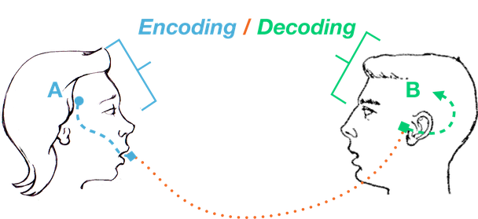

신경망에서 같은 구조를 그리면 다음과 같다. 아래쪽의 입력(Input)은 층을 지나면서 점점 좁아져 가운데의 작은
상자에 이르고(Encoding), 그 상자에서 다시 층을 지나 넓어지며 위쪽의 출력(Output)이 된다(Decoding). 가운데의
좁은 상자가 입력을 압축해 담아 두는 곳이다.

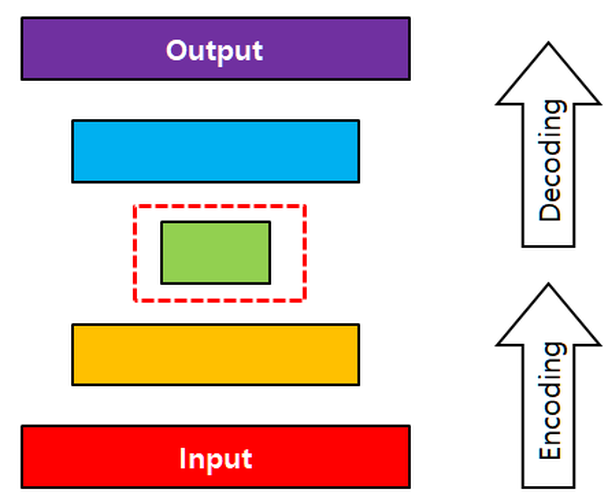

이 구조를 이루는 두 부분과 그 사이의 값을 정의하면 다음과 같다.

- **Encoder** — 입력 값을 구조화된 값, 즉 **잠재 공간(latent space)** 의 한 점에 맵핑하는 함수(기능)다.
- **Decoder** — 잠재 공간의 값(요소)을 다른 도메인으로 맵핑하는 함수(기능)다.
- **Code** — 잠재 공간의 벡터를 일반적으로 code 라 한다.

Encoder 와 decoder 의 짝은 딥러닝 이전부터 흔히 쓰이던 개념이다. 이미지·오디오 압축이 대표적인 예로, JPEG 은
미디어를 인코딩하여 압축해 두었다가 정보를 복구할 때 디코딩한다. 텍스트 번역에서는 문장을 입력받아 그 의미가
벡터로 인코딩되는 잠재 공간에 투영하고, decoder 가 그 인코딩 벡터를 목표 언어의 문장으로 변환한다. 두 경우
모두 "입력 → code → 출력" 의 흐름은 같고, decoder 가 code 를 어느 도메인으로 되돌리느냐만 다르다.

**Auto encoder(AE)** 는 이 가운데 decoder 의 목표 도메인이 입력 도메인과 같은 경우, 즉 입력을 code 로 압축했다가
**입력 자신을 다시 만들어 내도록** 학습하는 신경망이다. 아래 그림은 MNIST 숫자 8 과 4 가 encoder $E$ 를 지나
세로로 긴 막대 모양의 code 가 되고, decoder $D$ 가 그 code 로부터 다시 8 과 4 를 만들어 내는 모습이다. 오른쪽은
이렇게 얻은 code 들을 t-SNE 로 2차원에 뿌린 것으로, 같은 숫자의 code 끼리 뭉쳐 있어 code 가 입력의 구조를
담고 있음을 보여 준다.

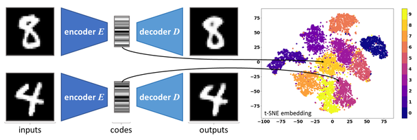

> **핵심 메시지**
> Encoder 는 입력을 잠재 공간의 code 로, decoder 는 code 를 다른(또는 같은) 도메인으로 되돌리는 함수다.
> Auto encoder 는 decoder 의 목표를 입력 자신으로 두어, 정답 레이블 없이도 입력의 압축 표현(code)을 스스로 배운다.

---

## 6.1.2 Auto Encoder 의 활용과 한계
<!-- 슬라이드 537~538 -->

AE 는 수학적으로 **주성분분석(Principal Component Analysis, PCA)** 과 유사하다. 고차원 정보를 저차원으로
압축하고 다시 고차원 공간으로 복원하는 기능을 스스로 최적화하기 때문이다. 이때 압축된 저차원 공간을
**latent space**, 거기에 저장된 변수를 **latent variables** 라 한다. PCA 가 분산을 가장 많이 보존하는 축을 찾아
데이터를 사영한다면, AE 는 복원 오차가 가장 작아지는 code 를 신경망으로 찾는다는 점에서 목적이 같다.

대표적인 적용 분야는 세 가지다.

- **Denoising** — 잡음 섞인 입력에서 깨끗한 이미지를 복원한다.
- **Super-resolution** — 낮은 해상도의 이미지를 높은 해상도로 복원한다.
- **Semantic segmentation** — 입력 이미지를 화소 단위의 클래스 지도로 변환한다.

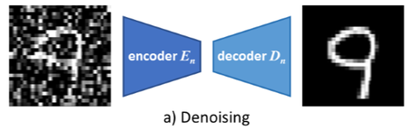

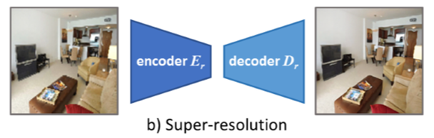

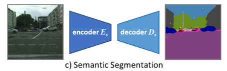

세 그림의 구조는 모두 같다. 입력이 encoder 를 지나 좁은 code 가 되고 decoder 가 그것을 다시 넓힌다. 다른 것은
decoder 의 출력이 무엇이냐뿐이다. Denoising 과 super-resolution 은 출력이 입력과 같은 도메인(이미지)이고,
semantic segmentation 은 출력이 클래스 지도라는 다른 도메인이다.

AE 의 **핵심 기능** 은 고차원 데이터에서 저차원 표현(특징)을 발견하는 능력, 그리고 데이터에 존재하는 핵심
속성을 보존하려는 능력에서 파생된다. 이 두 능력이 다음과 같은 쓰임으로 이어진다.

- 손상된 이미지의 복구, 또는 노이즈 제거.
- 주요 변동 요인의 시각화. 정상 데이터로 학습한 AE 는 정상 데이터를 잘 복원하므로, 복원이 잘 되지 않는 입력을
  이상(anomaly)으로 잡아내는 anomaly detection 에 쓰인다(원문 각주: "DEEP LEARNING FOR ANOMALY DETECTION:
  A SURVEY").
- 비선형 차원 축소. PCA 알고리즘은 선형 변환으로 제한되지만, AE 는 활성화 함수를 품은 신경망이므로 보다
  강력한 비선형 표현을 학습한다. 그래서 특별한 고차원 데이터를 처리하는 데 매우 강력한 도구가 된다.
- Label 이 없는 데이터로 작업할 수 있다. 정답이 입력 자신이므로 사람이 붙인 레이블이 필요 없다. 이런 학습을
  비지도 학습(unsupervised learning)이라 부르기도 하지만, 입력에서 스스로 정답을 만들어 쓴다는 점에서
  **자기지도 학습(self-supervised learning)** 이라 부르는 것이 더 정확하다.

**한계점** 도 분명하다.

- 훈련 데이터와 상당히 유사한 데이터로 적용 범위가 제한된다. 즉 확장성에 제한이 있다.
- 입력에 비해 덜 정확한 표현을 생성한다. 압축과 복원 과정에 loss 가 포함되기 때문이다.

---

## 6.1.3 Denoising — noise 를 더해 학습하면 왜 잡음이 사라지는가
<!-- 슬라이드 539 -->

Auto encoder 의 입력과 출력은 기본적으로 동일하다. 그렇다면 이 network 의 denoising 기능은 어디서 나오는가.
답은 단순하다. 학습하는 동안 **입력에 noise 를 추가하는 것만으로** 가능하다.

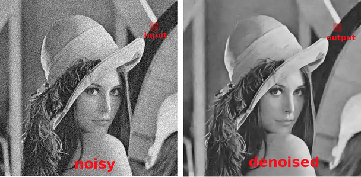

왜 그런지 생각해 보자. AE 의 가운데 code 는 입력보다 차원이 훨씬 작다. 예를 들어 784 화소의 MNIST 이미지를
10차원 code 로 줄이면, code 에는 784 화소를 하나하나 기억할 자리가 없고 여러 이미지에 공통으로 나타나는 큰
구조(획의 위치와 모양)만 담을 수 있다. 화소마다 무작위로 더해진 noise 는 이미지마다 다르고 서로 아무 규칙이
없으므로 저차원 code 로는 표현되지 못한 채 버려진다. Decoder 는 code 에 남은 구조만으로 이미지를 다시
그리므로 출력에는 noise 가 빠진 깨끗한 형태가 나온다. 학습 중 noise 를 더한 입력을 계속 보여 주면 encoder 는
noise 에 흔들리지 않고 구조를 뽑아내도록 조정되고, 이것이 denoising auto encoder(DAE) 가 된다.

> **핵심 메시지**
> Denoising 은 별도의 장치가 아니라 병목(저차원 code) 구조의 결과다. Code 가 담을 수 있는 것은 여러 입력에
> 공통된 구조뿐이고, 화소별 무작위 잡음은 code 를 통과하지 못한다.

---

## 6.1.4 실습 6.1.1 — 가장 간단한 Auto Encoder 와 Denoise AE
<!-- 슬라이드 540 -->

> 노트북: `code/6.1.1.AE.ipynb`
> [](https://colab.research.google.com/github/AI-BoostCamp/intermediate-deep-learning-pytorch/blob/main/code/6.1.1.AE.ipynb)

**목표** — Auto encoder 를 설계하고, denoise AE 를 통해 그 동작을 이해한다.

**실습 개요**

- MNIST 와 FashionMNIST dataset 을 사용한다.
- 가장 간단한 AE 를 설계하고, 학습 후 노이즈를 제거한 이미지가 생성됨을 확인한다.
- MNIST 에서 encoding 차원을 10 으로 설정하고(`encoding_dim=10`, 노트북에서는 `h=10`), 학습된 가중치를 읽어
  시각화해 보고 그 의미를 알아본다.

설계할 AE 는 encoder 와 decoder 가 각각 Dense(`nn.Linear`) 층 하나뿐인 가장 단순한 형태다. 784 화소를 편
벡터가 들어가 10차원 code $Z$ 가 되고, 다시 784 벡터로 돌아온다.

| 단계 | 층 | 출력 |
|---|---|---|
| 입력 | 28×28 이미지를 편 784 벡터 | (784,) |
| Encoder | Dense(10) | $Z$ (10-dim) |
| Decoder | Dense(784) | (784,) |

torchinfo 의 summary 는 이 모델(AE1)을 다음처럼 보여 준다(배치 8 기준). Encoder 의 파라미터는 784×10+10 = 7,850 개,
decoder 는 10×784+784 = 8,624 개로 전체 16,474 개다.

| Layer (type:depth-idx) | Output Shape | Param # |
|---|---|---|
| AE1 | [8, 784] | -- |
| ├─Sequential: 1-1 | [8, 784] | -- |
| │ └─Linear: 2-1 | [8, 10] | 7,850 |
| │ └─ReLU: 2-2 | [8, 10] | -- |
| │ └─Linear: 2-3 | [8, 784] | 8,624 |
| Total params | | 16,474 |

### 데이터 준비와 전처리 — noise 를 더하는 transform
<!-- 슬라이드 541 -->

Denoise AE 의 학습 데이터는 "noise 가 섞인 이미지" 다. torchvision 의 MNIST 를 그대로 읽되, transform 단계에
noise 를 더하는 클래스를 하나 끼워 넣는다.

```python
class AddNoise:
    def __init__(self, noise_rate=0.1):
        self.noise_rate=noise_rate

    def __call__(self, sample):
        image = np.asarray(sample.reshape(-1,))
        image += self.noise_rate*(np.random.randn(784))
#        image = image.clip(0,1)
        return torch.from_numpy(image).to(torch.float32)
```

`AddNoise` 는 `__call__` 을 가진 클래스이므로 transform 파이프라인 안에서 함수처럼 쓰인다. 들어온 이미지 텐서를
`reshape(-1,)` 로 784 길이의 1차원 벡터로 펴고, 표준정규분포 난수 784 개에 `noise_rate`(기본 0.1)를 곱해 더한다.
그 결과를 `float32` 텐서로 돌려준다. 주석 처리된 `clip(0,1)` 을 살리면 화소값을 0~1 로 자를 수 있지만, 여기서는
자르지 않으므로 값이 0 아래나 1 위로도 나간다. `noise_rate` 를 키우면 잡음이 세지고, 0 으로 두면 일반 AE 가
된다. 이 transform 이 이미지를 784 벡터로 펴 주기 때문에 뒤의 Dense 모델은 별도의 flatten 없이 바로 입력받는다.

```python
from torchvision.datasets import MNIST

transform = v2.Compose([
    v2.ToImage(),
    v2.ToDtype(torch.float32, scale=True),
    AddNoise(),])

train_dataset = MNIST('', transform=transform, train=True, download=True)
test_dataset = MNIST('', transform=transform, train=False, download=True)

trainDataLoader = DataLoader(train_dataset, batch_size=512, shuffle=True, num_workers=4)
valDataLoader = DataLoader(test_dataset, batch_size=512, shuffle=False, num_workers=4)
```

`v2.ToImage()` 가 PIL 이미지를 (1, 28, 28) 텐서로 바꾸고, `v2.ToDtype(torch.float32, scale=True)` 가 0~255 정수를
0~1 실수로 바꾼 뒤, 마지막에 `AddNoise()` 가 noise 를 더하면서 784 벡터로 편다. 순서가 중요하다. noise 는 0~1 로
정규화된 값에 더해야 `noise_rate=0.1` 이 "화소값 범위의 10% 정도" 라는 뜻이 된다. Train·test 두 dataset 이 같은
transform 을 쓰므로 검증 데이터에도 noise 가 들어간다. DataLoader 의 batch 크기는 512 다.

첫 샘플의 모양과 값 범위를 확인하고 그림으로 그려 본다(`ps()` 는 노트북의 shape 출력 helper 다).

```python
ps(train_dataset[0][0])
print(train_dataset[0][0].min(),train_dataset[0][0].max())
plt.imshow(train_dataset[0][0].detach().numpy().reshape(28,28), cmap='gray')
plt.show()
```

모양은 `torch.Size([784])` 이고, 최솟값과 최댓값은 0~1 을 벗어난다(슬라이드의 실행 결과에서는 -0.3101 과 1.1972).
그림은 숫자 5 위에 회색 점 잡음이 고르게 깔린 모습이다.

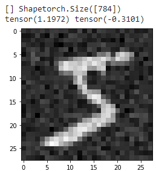

### 모델 정의 — AE1 과 AE2
<!-- 슬라이드 542 -->

AE1 과 AE2 는 층 구성이 같고 학습 방식만 다르므로, 공통 부분을 `Wrap_mse` 라는 LightningModule 로 묶어 둔다.

```python
class Wrap_mse(L.LightningModule):
    def training_step(self, batch, batch_idx):
        x, y = batch
        y_pred = self(x)
        loss = F.mse_loss(y_pred, x)
        metrics={'loss':loss}
        self.log_dict(metrics,prog_bar=True,on_step=False,on_epoch=True)
        return loss

    def validation_step(self, batch, batch_idx):
        x, y = batch
        y_pred = self(x)
        loss = F.mse_loss(y_pred, x)
        metrics = {'val_loss':loss}
        self.log_dict(metrics,prog_bar=True,on_step=False,on_epoch=True)

    def configure_optimizers(self):
        return torch.optim.Adam(self.parameters())
```

`training_step` 이 AE 의 본질을 보여 준다. batch 에서 꺼낸 `y`(숫자 레이블)는 쓰지 않고, 모델 출력 `y_pred` 를
**입력 `x` 자신** 과 비교해 평균제곱오차(`F.mse_loss`)를 구한다. 정답이 입력이므로 레이블이 필요 없다.
`validation_step` 도 같은 계산을 `val_loss` 라는 이름으로 기록한다. `on_step=False, on_epoch=True` 는 step 마다가
아니라 epoch 단위로 평균해 기록하라는 뜻이며, 뒤에서 CSV 로그를 epoch 별로 읽어 그래프를 그리기 위한 설정이다.
Optimizer 는 Adam 을 기본 설정으로 쓴다.

```python
class AE1(Wrap_mse):
    def __init__(self, h):
        super(AE1, self).__init__()
        self.layers = nn.Sequential(
            nn.Linear(784, h),
            nn.ReLU(),
            nn.Linear(h, 784))

    def forward(self, x):
        out = self.layers(x)
        return out

ae1 = AE1(h=10)
summary(ae1, input_size=(8, 784))
```

`AE1` 은 `Wrap_mse` 를 상속해 층과 `forward` 만 정의한다. `nn.Linear(784, h)` 가 encoder, `nn.Linear(h, 784)` 가
decoder 이고, 그 사이의 `h` 차원 출력이 code 다. Encoder 뒤에는 ReLU 를 두고 decoder 뒤에는 활성화 함수를 두지
않아 출력이 화소값 범위에 묶이지 않는다. `h=10` 으로 만들면 앞의 summary 표와 같은 16,474 개 파라미터 모델이
된다. `h` 를 바꾸면 code 의 크기가 바뀌므로, 압축률과 복원 품질의 관계를 실험하려면 이 값을 조정한다.

```python
class AE2(Wrap_mse):
    def __init__(self, h):
        super(AE2, self).__init__()
        self.layers = nn.Sequential(
            nn.Linear(784, h),
            nn.ReLU(),
            nn.Linear(h, 784))

    def forward(self, x):
        out = self.layers(x)
        return out

    def configure_optimizers(self):
        return torch.optim.Adam(self.parameters(),weight_decay=0.002)

ae2 = AE2(h=10)
summary(ae2, input_size=(8, 784))
```

`AE2` 의 층은 `AE1` 과 완전히 같다. 유일한 차이는 `configure_optimizers` 를 다시 정의해 Adam 에 `weight_decay=0.002`
를 준 것이다. Weight decay 는 가중치의 크기에 비례하는 벌점을 손실에 더하는 L2 정규화(regularization)다. 보통
큰 모델의 과적합을 막는 데 쓰는데, 이렇게 작은 모델에서 그것이 어떤 효과를 내는지가 두 모델을 나란히 두는
이유다(실습과제 1).

### AE3 — 레이블을 함께 넣는 auto encoder
<!-- 슬라이드 543~544 -->

세 번째 모델 `AE3` 는 이미지 784 화소에 숫자 레이블의 one-hot 벡터 10 개를 이어 붙인 794 차원을 입력으로 받고,
code 에서 이미지 복원과 숫자 분류를 동시에 한다. 이를 위해 레이블을 one-hot 으로 바꾸는 `target_transform` 을
가진 dataset 을 따로 만든다.

```python
def target_to_oh(target):
    one_hot = torch.eye(10)[target]
    return one_hot
```

`torch.eye(10)` 은 10×10 단위행렬이고, 그 `target` 번째 행이 곧 one-hot 벡터다.

```python
train_dataset_oh = MNIST('', transform=transform, train=True, download=True,
                             target_transform=target_to_oh)
test_dataset_oh = MNIST('', transform=transform, train=False, download=True,
                            target_transform=target_to_oh)

trainDataLoader_oh = DataLoader(train_dataset_oh, batch_size=512, shuffle=True, num_workers=4)
valDataLoader_oh = DataLoader(test_dataset_oh, batch_size=512, shuffle=False, num_workers=4)
```

`ps(train_dataset_oh[0][0])` 과 `ps(train_dataset_oh[0][1])` 로 확인하면 이미지는 `torch.Size([784])`, 레이블은
`torch.Size([10])` 이다. 이미지 transform 은 앞과 같으므로 noise 도 그대로 들어간다.

```python
class AE3(L.LightningModule):
    def __init__(self, h):
        super(AE3, self).__init__()
        self.layer1 = nn.Sequential(
                nn.Linear(794, h),
                nn.ReLU())
        self.layer2 = nn.Sequential(
                nn.Linear(h, 784),)
        self.layer3 = nn.Sequential(
                nn.Linear(h, 10),)

    def forward(self, x):
        out = self.layer1(x)
        out1 = self.layer2(out)
        out2 = self.layer3(out)
        return out1, out2

    def training_step(self, batch, batch_idx):
        x, y = batch
        input_ = torch.cat([x, y], dim=-1) #(bs,794)
        y_pred1, y_pred2 = self(input_)    #784,10
        loss_mse = F.mse_loss(y_pred1, x)
        y2 = torch.argmax(y,dim=-1)
        loss_entropy = F.cross_entropy(y_pred2, y2)
        loss = loss_mse + loss_entropy
        acc = FM.accuracy(y_pred2, y2, task='multiclass', num_classes=10)
        metrics={'mse':loss_mse, 'acc':acc, 'ce':loss_entropy}
        self.log_dict(metrics, prog_bar=True)
        return loss

    def validation_step(self, batch, batch_idx):
        x, y = batch
        input_ = torch.cat([x, y], dim=-1)
        y_pred1, y_pred2 = self(input_)
        loss_mse = F.mse_loss(y_pred1, x)
        y2 = torch.argmax(y,dim=-1)
        loss_entropy = F.cross_entropy(y_pred2, y2)
        acc = FM.accuracy(y_pred2, y2, task='multiclass', num_classes=10)
        metrics={'val_mse':loss_mse, 'val_acc':acc,'val_ce':loss_entropy}
        self.log_dict(metrics, prog_bar=True)

    def configure_optimizers(self):
        return torch.optim.Adam(self.parameters(), weight_decay=0.00)

ae3 = AE3(h=10)
summary(ae3, input_size=(8, 794))
```

`layer1` 이 encoder 로, 794 차원을 `h` 차원 code 로 줄이고 ReLU 를 거친다. Code 에서 두 갈래가 나간다. `layer2` 는
784 차원 이미지를 복원하는 decoder 이고, `layer3` 는 10 개 클래스 점수를 내는 분류기다. `forward` 는 두 출력을
함께 돌려준다.

`training_step` 에서는 batch 의 이미지 `x` 와 one-hot 레이블 `y` 를 `torch.cat([x, y], dim=-1)` 로 이어
(batch, 794) 입력을 만든다. 손실은 두 항의 합이다. 복원 출력 `y_pred1` 과 원래 이미지 `x` 의 MSE, 그리고 분류
출력 `y_pred2` 와 정수 레이블 `y2`(one-hot 을 `argmax` 로 되돌린 것)의 cross entropy 다. `FM.accuracy` 로 분류
정확도도 함께 기록한다. 이렇게 하면 code 는 이미지를 복원하기에 충분한 정보와 함께 "몇 번 숫자인가" 를 담도록
유도된다. 검증 단계도 같은 계산을 `val_` 접두어로 기록한다. 이 모델의 `configure_optimizers` 는
`weight_decay=0.00` 으로 두어 정규화를 쓰지 않는다.

`summary(ae3, input_size=(8, 794))` 로 구조를 확인할 수 있고, 모델을 연산 그래프로 그리면 다음과 같다.

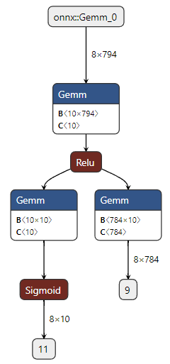

그래프에서 Gemm 은 `nn.Linear` 의 행렬곱이고, B 가 가중치 행렬의 모양이다. 첫 Gemm 의 B 가 10×794 인 것은 794
차원 입력을 10 차원 code 로 줄이는 encoder 이고, 갈라진 두 Gemm 의 B 가 10×10 과 784×10 인 것은 각각 분류기와
decoder 다. 그래프의 분류 갈래에는 Sigmoid 가 붙어 있는데, 노트북의 `AE3` 는 `layer3` 에 활성화 함수를 두지 않고
`F.cross_entropy` 에 바로 넣는다. Cross entropy 가 내부에서 softmax 를 계산하므로 별도 활성화가 없어도 된다.

### 학습
<!-- 슬라이드 544 -->

세 모델을 같은 조건으로 학습한다. AE1 을 예로 들면 다음과 같다.

```python
ae1 = AE1(h=10)

name="AE1"
logger = CSVLogger("logs", name=name)
trainer = Trainer(max_epochs=15, logger=logger,
                  limit_train_batches=0.5,limit_val_batches=0.5)
trainer.fit(ae1, trainDataLoader, valDataLoader)
```

`CSVLogger` 는 `logs/AE1/version_N/metrics.csv` 에 epoch 별 지표를 남긴다. `limit_train_batches=0.5` 와
`limit_val_batches=0.5` 는 시간을 아끼려고 매 epoch 에 데이터의 절반만 쓰라는 설정이며, 결과를 더 좋게 하려면
1.0 으로 올리거나 `max_epochs` 를 늘린다. AE2 는 `name="AE2"` 로 바꾸어 같은 loader 로, AE3 는 one-hot dataset 의
loader 로 바꾸어 같은 방식으로 학습한다.

```python
ae3 = AE3(h=10)

name="AE3"
logger = CSVLogger("logs", name=name)
trainer = Trainer(max_epochs=15, logger=logger,
                  limit_train_batches=0.5,limit_val_batches=0.5)
trainer.fit(ae3, trainDataLoader_oh, valDataLoader_oh)
```

학습이 끝나면 CSV 를 읽어 epoch 별 마지막 값만 남기고, 세 모델의 검증 손실을 한 그래프에 겹쳐 그린다.
AE1·AE2 도 같은 방법으로 `df`, `df2` 를 만들어 두었다고 하자.

```python
v_num = logger.version
history = pd.read_csv(f'./logs/{name}/version_{v_num}/metrics.csv')
df3 = history.groupby('epoch').last().drop('step', axis=1)
```

```python
h3 = df3
val_3 = h3['val_mse'].min()

plt.figure(figsize=(5, 3))
plt.title(f"{name}: Min Val_loss\n AE1/AE2AE3({val_1:.3f} / {val_2:.3f}) / {val_3:.3f})")
plt.plot(h1['val_loss'],'--', label='AE1')
plt.plot(h2['val_loss'],'-', label='AE2')
plt.plot(h3['val_mse'],'-', label='AE3')
plt.legend()
plt.grid()
plt.show()
```

`history.groupby('epoch').last()` 는 한 epoch 안에 여러 줄(학습 지표 줄과 검증 지표 줄)이 섞여 기록되는 CSV 를
epoch 하나에 한 줄로 정리하는 관용구다. AE1·AE2 는 `val_loss`, AE3 는 `val_mse` 열을 그리며, AE3 의 값은 cross
entropy 를 뺀 복원 오차만이므로 세 곡선을 같은 잣대로 비교할 수 있다.

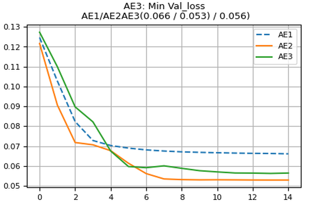

최소 검증 손실은 AE1 0.066, AE2 0.053, AE3 0.056 이다. 층이 같은 AE1 과 AE2 사이에 weight decay 하나로 이만큼
차이가 나고, 레이블을 함께 넣은 AE3 도 AE1 보다 낮다. AE1 의 곡선이 epoch 4 이후 거의 내려가지 않는다는 점이
눈에 띄는데, 왜 정규화가 이 작은 모델에서 도움이 되는지는 실습과제 1 에서 생각해 본다.

### 예측과 결과 그림
<!-- 슬라이드 545 -->

학습된 세 모델에 test 이미지 20 장을 넣어 복원 결과를 모은다. AE3 는 입력에 one-hot 레이블을 이어 붙여야 하고,
출력이 (복원, 분류) 두 개이므로 첫 번째만 쓴다.

```python
decoded_imgs1 = []
for i in range(20):
    x, y = test_dataset[i]
    decoded_imgs1.append(ae1(x).cpu().detach().numpy())
```

```python
decoded_imgs3 = []
for i in range(20):
    x, y = test_dataset_oh[i]
    input = torch.cat([x,y],dim=0)
    out = ae3(input)
    decoded_imgs3.append(out[0].cpu().detach().numpy())

decoded_imgs = [decoded_imgs1,decoded_imgs2,decoded_imgs3]
```

Dataset 에서 한 장씩 꺼내므로 batch 차원이 없는 (784,) 벡터가 그대로 모델에 들어간다. `nn.Linear` 는 마지막
차원만 보므로 문제없이 동작한다. AE3 의 입력은 `torch.cat([x, y], dim=0)` 으로 794 벡터를 만든다(학습 때는 batch
차원이 있어 `dim=-1` 을 썼다). `.cpu().detach().numpy()` 는 계산 그래프에서 떼어 내 numpy 로 바꾸는 상용구다.
`decoded_imgs2` 는 `ae2` 로 같은 방식으로 만든다.

```python
num_imgs = 9
n_row = 4
plt.figure(figsize=(12, 5))
for i in range(n_row):
    for j in range(num_imgs):
        if i == 0 :
            # display original
            plt.subplot(n_row, num_imgs, j+1)
            true_img = test_dataset[j][0].reshape(28, 28)
            plt.imshow(true_img, cmap='gray')
        else :
            # display reconstruction images
            plt.subplot(n_row, num_imgs, i*num_imgs+j+1)
            reconstructed_img = decoded_imgs[(i-1)][j].reshape(28,28)
            plt.imshow(reconstructed_img)
plt.show()
```

첫 행(`i == 0`)에는 noise 가 섞인 원본 test 이미지를 회색조로, 둘째~넷째 행에는 `decoded_imgs` 의 순서대로
AE1·AE2·AE3 의 복원 결과를 그린다. 복원 결과는 `cmap` 을 지정하지 않아 matplotlib 기본 색상표(노랑–초록–보라)로
나온다. 784 벡터를 `reshape(28,28)` 로 다시 접는 것을 잊지 않는다.

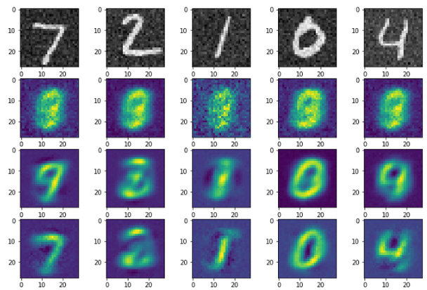

세 모델 모두 입력의 점 잡음을 지우고 숫자의 큰 모양을 되살린다. 학습 목표가 "noise 섞인 입력을 그대로 복원하기"
였는데도 출력에서 잡음이 사라지는 것은, 앞에서 설명한 대로 10 차원 code 가 화소별 잡음을 담을 수 없기 때문이다.
다만 AE1 의 결과는 흐릿하고 가는 획(1)에서는 잡음이 남는 반면, AE2 와 AE3 는 더 또렷하다. 검증 손실의 차이가
그림에서도 그대로 보인다.

---

## 6.1.5 실습 6.1.2 — CNN Auto Encoder / Denoise AE
<!-- 슬라이드 548 -->

> 노트북: `code/6.1.2.AE_CNN.ipynb`
> [](https://colab.research.google.com/github/AI-BoostCamp/intermediate-deep-learning-pytorch/blob/main/code/6.1.2.AE_CNN.ipynb)

**목표** — 잘 만들어진 auto encoder 의 성능을 확인해 본다.

**실습 개요**

- Conv 층 3개로 이루어진 encoder 와 decoder 를 구성한다.
- 성능을 잘 튜닝하였을 때의 denoising 성능을 확인한다.
- FashionMNIST dataset 도 사용해 본다.

Dense 층 두 개짜리 AE 는 이미지를 784 벡터로 펴서 다루므로 화소의 이웃 관계를 쓰지 못한다. CNN AE 는 이미지를
(1, 28, 28) 모양 그대로 받아 conv 층으로 압축하고 conv 층으로 되살린다. 데이터 준비는 `AddNoise` 가 noise 를
더한 뒤 이미지 모양으로 되돌려 준다는 점만 다르다.

```python
from torchvision.datasets import FashionMNIST, MNIST

class AddNoise:
    def __init__(self, noise_rate=0.1):
        self.noise_rate=noise_rate
    def __call__(self, sample):
        image = np.asarray(sample.reshape(-1,))
        image += self.noise_rate * np.random.randn(image.shape[0])
        image = torch.from_numpy(image).to(torch.float32)
        image = image.view(1, 28, 28)
        return  image

transform = v2.Compose([
    v2.ToImage(),
    v2.ToDtype(torch.float32, scale=True),
    AddNoise(),])

download_root = './MNIST_DATASET'
train_dataset = MNIST(download_root, transform=transform, train=True, download=True)
test_dataset = MNIST(download_root, transform=transform, train=False, download=True)

trainDataLoader = DataLoader(train_dataset, batch_size=512, shuffle=True, num_workers=4)
testDataLoader = DataLoader(test_dataset, batch_size=512, shuffle=False, num_workers=4)
```

noise 의 길이를 `image.shape[0]` 에서 읽으므로 크기가 다른 데이터에도 그대로 쓸 수 있고, 마지막의
`image.view(1, 28, 28)` 이 conv 층이 받을 (채널, 높이, 너비) 모양을 만든다. `ps(train_dataset[0][0])` 으로 확인하면
`torch.Size([1, 28, 28])` 이다. FashionMNIST 로 바꾸려면 `MNIST(` 두 곳을 `FashionMNIST(` 로 바꾸기만 하면 된다.
두 dataset 은 이미지 크기와 클래스 수가 같다.

```python
# AE4 model
class AE4(L.LightningModule):
    def __init__(self):
        super(AE4, self).__init__()
        self.encoder = nn.Sequential(
            nn.Conv2d(1, 32, 3, padding=1),
            nn.ReLU(),
            nn.MaxPool2d(2),
            nn.Conv2d(32, 16, 3, padding=1),
            nn.ReLU(),
            nn.MaxPool2d(2),
            nn.BatchNorm2d(16),
            nn.Conv2d(16, 8, 3, padding=1),
            nn.ReLU(),
            nn.MaxPool2d(2, padding=1) )

        self.decoder = nn.Sequential(
            nn.Conv2d(8, 8, 3, padding=1),
            nn.ReLU(),
            nn.Upsample((8,8)),
            nn.Conv2d(8, 16, 3, padding=1),
            nn.ReLU(),
            nn.Upsample((16,16)),
            nn.BatchNorm2d(16),
            nn.Conv2d(16, 32, 3, padding=0),
            nn.ReLU(),
            nn.Upsample((28,28)),
            nn.Conv2d(32, 1, 3, padding=1),
            nn.Sigmoid() )

    def forward(self, x):
        encoded = self.encoder(x)
        decoded = self.decoder(encoded)
        return decoded

    def training_step(self, batch, batch_idx):
        x, _ = batch
        decoded = self(x)
        loss_mse = F.mse_loss(decoded, x)
        metrics={'loss':loss_mse}
        self.log_dict(metrics,prog_bar=True)
        return metrics

    def validation_step(self, batch, batch_idx):
        x, _ = batch
        decoded = self(x)
        loss_mse = F.mse_loss(decoded, x)
        metrics={'val_loss':loss_mse}
        self.log_dict(metrics,prog_bar=True)

    def configure_optimizers(self):
        return torch.optim.Adam(self.parameters())

ae4 = AE4()
summary(ae4, input_size=(8, 1, 28, 28))
```

`encoder` 는 "conv → ReLU → max pooling" 을 세 번 반복하며 채널을 32 → 16 → 8 로, 크기를 28 → 14 → 7 → 4 로
줄인다. Conv 는 모두 3×3 에 `padding=1` 이라 크기를 유지하고, 크기를 줄이는 것은 max pooling 이다. 마지막
`nn.MaxPool2d(2, padding=1)` 은 홀수인 7×7 을 한 칸 덧대어 4×4 로 만든다. 두 번째 블록 뒤의 `BatchNorm2d(16)` 은
학습을 안정시키는 장치다. 결국 code 는 (8, 4, 4), 즉 128 개 값이다.

`decoder` 는 그 반대로 "conv → ReLU → upsample" 을 반복한다. `nn.Upsample((8,8))` 처럼 목표 크기를 직접 지정하므로
4 → 8 → 16 → 28 로 커지고, 세 번째 conv 만 `padding=0` 이라 16 을 14 로 줄인 뒤 28 로 키운다. 마지막
`nn.Conv2d(32, 1, 3, padding=1)` 이 채널을 1 로 되돌리고 `nn.Sigmoid()` 가 출력을 0~1 로 묶는다. 입력은 noise
때문에 0~1 을 벗어나지만 출력은 벗어날 수 없는데, 우리가 원하는 것이 깨끗한 화소값이므로 문제가 되지 않는다.

| 구간 | 층 | 출력 모양 |
|---|---|---|
| 입력 | | (1, 28, 28) |
| Encoder 1 | Conv2d(1→32) → ReLU → MaxPool2d(2) | (32, 14, 14) |
| Encoder 2 | Conv2d(32→16) → ReLU → MaxPool2d(2) → BatchNorm2d | (16, 7, 7) |
| Encoder 3 | Conv2d(16→8) → ReLU → MaxPool2d(2, padding=1) | (8, 4, 4) = code |
| Decoder 1 | Conv2d(8→8) → ReLU → Upsample(8,8) | (8, 8, 8) |
| Decoder 2 | Conv2d(8→16) → ReLU → Upsample(16,16) → BatchNorm2d | (16, 16, 16) |
| Decoder 3 | Conv2d(16→32, padding=0) → ReLU → Upsample(28,28) | (32, 28, 28) |
| 출력 | Conv2d(32→1) → Sigmoid | (1, 28, 28) |

`training_step` 은 앞의 Dense AE 와 같이 출력과 입력 `x` 의 MSE 를 손실로 쓴다. 여기서는 `loss` 값 대신 `'loss'`
키를 가진 dict 를 돌려주는데, Lightning 은 dict 의 `'loss'` 항목을 손실로 사용한다.

```python
ae4 = AE4()

name="AE4"
logger = CSVLogger("logs", name=name)
trainer = Trainer(max_epochs=15, logger=logger,
                  limit_train_batches=0.5,limit_val_batches=0.5)
trainer.fit(ae4, trainDataLoader, testDataLoader)
```

```python
v_num = logger.version
history = pd.read_csv(f'./logs/{name}/version_{v_num}/metrics.csv')
df = history.groupby('epoch').last().drop('step', axis=1)

h1 = df
plt.figure(figsize=(5, 3))
plt.title(f"{name}")
plt.plot(h1['loss'],'--', label='loss')
plt.plot(h1['val_loss'],'-', label='val_loss')
plt.legend()
plt.grid()
plt.show()
```

학습 설정은 실습 6.1.1 과 같다(15 epoch, 데이터의 절반). 이번에는 학습 손실과 검증 손실을 함께 그려 과적합
여부를 본다.

```python
# Input image
ps(test_dataset[0][0].unsqueeze(dim=0)) #(bs,ch,28,28)

# Decoded image
ps(ae4(test_dataset[0][0].unsqueeze(dim=0)))

# Predict
decoded_imgs = []
for i in range(9):
    decoded_imgs.append(ae4(test_dataset[i][0].unsqueeze(dim=0)))
```

Conv 층은 (batch, 채널, 높이, 너비) 4차원 입력을 요구하므로, dataset 에서 꺼낸 (1, 28, 28) 한 장에
`unsqueeze(dim=0)` 으로 batch 차원을 붙여 (1, 1, 28, 28) 로 만든다. 출력도 같은 모양이다. Dense AE 에서는 이
단계가 필요 없었다는 점이 다르다.

```python
plt.figure(figsize=(12, 3))
num_imgs = 9
for i in range(num_imgs):
    # display original
    ax = plt.subplot(2, num_imgs, i + 1)
    true_img = test_dataset[i][0].reshape(28, 28)
    plt.imshow(true_img, cmap='gray')

    # display reconstruction
    ax = plt.subplot(2, num_imgs, i + 1 + num_imgs)
    reconstructed_img = decoded_imgs[i].reshape(28,28)
    plt.imshow(reconstructed_img.detach().numpy())
plt.show()
```

윗줄이 noise 섞인 원본, 아랫줄이 복원 결과다.

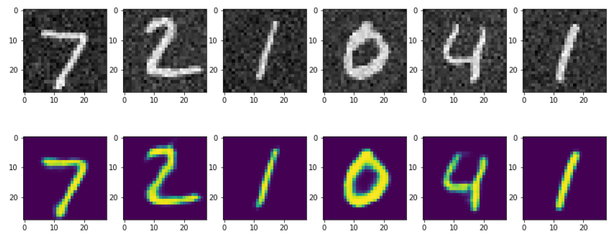

Dense AE 의 결과와 견주면 차이가 뚜렷하다. 획이 굵고 매끈하며, 가는 획인 1 도 잡음 없이 되살아난다. 화소의
이웃 관계를 쓰는 conv 층이 잡음(이웃과 무관한 값)과 획(이웃과 이어진 값)을 훨씬 잘 가른다.

같은 모델을 FashionMNIST 로 학습하면 다음과 같다.

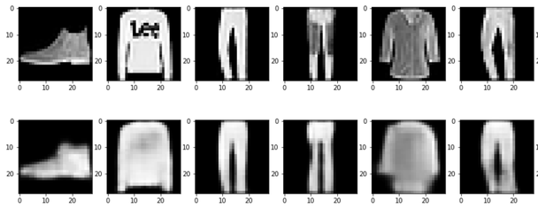

옷의 윤곽과 전체 밝기는 잘 복원되지만 스웨터의 글자처럼 작은 무늬는 사라진다. 128 개 값의 code 에 담을 수 있는
것은 큰 구조뿐이고, 세부 무늬는 잡음과 마찬가지로 code 를 통과하지 못한다. Denoising 과 세부 손실이 같은 원리의
두 얼굴이라는 것을 보여 주는 결과다.

---

## 6.1.6 실습 6.1.3 — 잠재 공간이 2차원인 CNN Auto Encoder
<!-- 슬라이드 549~550 -->

> 노트북: `code/6.1.3.AE_CNN_2dim.ipynb`
> [](https://colab.research.google.com/github/AI-BoostCamp/intermediate-deep-learning-pytorch/blob/main/code/6.1.3.AE_CNN_2dim.ipynb)

잠재 공간이 정말 입력의 구조를 담고 있는지 눈으로 확인하려면 code 를 2차원으로 줄여 평면에 그려 보면 된다.
데이터 준비는 실습 6.1.2 와 같고, `AE4` 의 encoder 끝과 decoder 앞에 Linear 층을 붙여 code 를 2 개의 값 $z_0, z_1$
로 만든다.

```python
# AE4 model
class AE4(L.LightningModule):
    def __init__(self):
        super(AE4, self).__init__()
        self.encoder = nn.Sequential(
            nn.Conv2d(1, 32, 3, padding=1),
            nn.ReLU(),
            nn.MaxPool2d(2),
            nn.Conv2d(32, 16, 3, padding=1),
            nn.ReLU(),
            nn.MaxPool2d(2),
            nn.BatchNorm2d(16),
            nn.Conv2d(16, 8, 3, padding=1),
            nn.ReLU(),
            nn.MaxPool2d(2, padding=1),
            nn.Flatten(),
            nn.Linear(8*4*4, 2) )
        self.decoder = nn.Sequential(
            nn.Linear(2, 8*4*4),
            nn.Unflatten(1,(8,4,4)),
            nn.Conv2d(8, 8, 3, padding=1),
            nn.ReLU(),
            nn.Upsample((7,7)),
            nn.Conv2d(8, 16, 3, padding=1),
            nn.ReLU(),
            nn.Upsample((14,14)),
            nn.BatchNorm2d(16),
            nn.Conv2d(16, 32, 3, padding=1),
            nn.ReLU(),
            nn.Upsample((28,28)),
            nn.Conv2d(32, 1, 3, padding=1),
            nn.Sigmoid() )
    def forward(self, x):
        encoded = self.encoder(x)
        decoded = self.decoder(encoded)
        return decoded

    def training_step(self, batch, batch_idx):
        x, _ = batch
        decoded = self(x.float())
        loss_mse = F.mse_loss(decoded, x)
        metrics={'loss':loss_mse}
        self.log_dict(metrics,prog_bar=True)
        return metrics

    def configure_optimizers(self):
        return torch.optim.Adam(self.parameters())

ae4 = AE4().to(device)
summary(ae4, input_size=(32, 1, 28, 28))
```

실습 6.1.2 의 `AE4` 와 다른 곳은 네 군데다.

- Encoder 끝에 `nn.Flatten()` 과 `nn.Linear(8*4*4, 2)` 를 붙여 (8, 4, 4) 를 128 벡터로 편 뒤 2 차원으로 줄인다.
- Decoder 앞에 `nn.Linear(2, 8*4*4)` 와 `nn.Unflatten(1, (8,4,4))` 를 붙여 2 차원 code 를 다시 (8, 4, 4) 로 되돌린다.
- Decoder 의 upsample 크기를 (7,7), (14,14), (28,28) 로 바꾸고 세 번째 conv 도 `padding=1` 로 두어, encoder 가 거친
  28 → 14 → 7 → 4 를 정확히 거꾸로 밟는다.
- 검증 단계가 없다. 잠재 공간을 보는 것이 목적이므로 학습 loader 만으로 학습한다.

torchinfo 의 summary(배치 32 기준)는 다음과 같다. Encoder 의 `Linear: 2-12` 출력이 [32, 2] 인 것이 2차원 code 다.

| Layer (type:depth-idx) | Output Shape | Param # |
|---|---|---|
| AE4 | [32, 1, 28, 28] | -- |
| ├─Sequential: 1-1 (encoder) | [32, 2] | -- |
| │ └─Conv2d: 2-1 | [32, 32, 28, 28] | 320 |
| │ └─ReLU: 2-2 | [32, 32, 28, 28] | -- |
| │ └─MaxPool2d: 2-3 | [32, 32, 14, 14] | -- |
| │ └─Conv2d: 2-4 | [32, 16, 14, 14] | 4,624 |
| │ └─ReLU: 2-5 | [32, 16, 14, 14] | -- |
| │ └─MaxPool2d: 2-6 | [32, 16, 7, 7] | -- |
| │ └─BatchNorm2d: 2-7 | [32, 16, 7, 7] | 32 |
| │ └─Conv2d: 2-8 | [32, 8, 7, 7] | 1,160 |
| │ └─ReLU: 2-9 | [32, 8, 7, 7] | -- |
| │ └─MaxPool2d: 2-10 | [32, 8, 4, 4] | -- |
| │ └─Flatten: 2-11 | [32, 128] | -- |
| │ └─Linear: 2-12 | [32, 2] | 258 |
| ├─Sequential: 1-2 (decoder) | [32, 1, 28, 28] | -- |
| │ └─Linear: 2-13 | [32, 128] | 384 |
| │ └─Unflatten: 2-14 | [32, 8, 4, 4] | -- |
| │ └─Conv2d: 2-15 | [32, 8, 4, 4] | 584 |
| │ └─ReLU: 2-16 | [32, 8, 4, 4] | -- |
| │ └─Upsample: 2-17 | [32, 8, 7, 7] | -- |
| │ └─Conv2d: 2-18 | [32, 16, 7, 7] | 1,168 |
| │ └─ReLU: 2-19 | [32, 16, 7, 7] | -- |
| │ └─Upsample: 2-20 | [32, 16, 14, 14] | -- |
| │ └─BatchNorm2d: 2-21 | [32, 16, 14, 14] | 32 |
| │ └─Conv2d: 2-22 | [32, 32, 14, 14] | 4,640 |
| │ └─ReLU: 2-23 | [32, 32, 14, 14] | -- |
| │ └─Upsample: 2-24 | [32, 32, 28, 28] | -- |
| │ └─Conv2d: 2-25 | [32, 1, 28, 28] | 289 |
| │ └─Sigmoid: 2-26 | [32, 1, 28, 28] | -- |
| Total params | | 13,491 |

파라미터는 전부 13,491 개로, 실습 6.1.1 의 Dense AE(16,474 개)보다 오히려 적다. Conv 층은 커널 하나를 이미지
전체에서 돌려쓰므로 파라미터가 적게 든다.

```python
ae4 = AE4()

name="AE4"
logger = CSVLogger("logs", name=name)
trainer = Trainer(max_epochs=30, logger=logger, accelerator='auto',
                  limit_train_batches=0.5,limit_val_batches=0.5)
trainer.fit(ae4, trainDataLoader)
```

Code 가 2 차원뿐이라 복원이 어려우므로 epoch 을 30 으로 늘렸고, `trainer.fit` 에 학습 loader 만 준다.
`accelerator='auto'` 는 GPU 가 있으면 GPU 를 쓰라는 설정이다. 학습 곡선은 `df['loss']` 만 그린다. 예측은 실습
6.1.2 와 같은 코드로 하며, 2 차원 code 로 복원한 숫자는 앞의 128 차원 code 때보다 흐릿하다. 이 실습의 목적은
복원 품질이 아니라 잠재 공간을 보는 것이다.

**Decoder 가 그리는 잠재 공간의 지도.** 잠재 평면 위에 40×40 격자를 놓고, 격자점 하나하나를 decoder 에 넣어
28×28 이미지를 만들어 이어 붙이면 잠재 공간 전체가 한 장의 그림이 된다.

```python
from scipy.stats import norm

batch_size = 1
n = 40 #40
figsize = 8

figure = np.zeros((28 * n, 28 * n))
grid_x = norm.ppf(np.linspace(0.005, 0.99, n))
grid_y = norm.ppf(np.linspace(0.005, 0.99, n))
ae4.eval()
with torch.no_grad():
  for i, xi in enumerate(grid_x):
    for j, yi in enumerate(grid_y):
      z_sample = np.array([[xi, yi]])

      # 그리드 좌표값으로 추론
      x_decoded = ae4.decoder.to(device)(torch.Tensor(z_sample).to(device))
      x_decoded = x_decoded.cpu().detach().numpy()
      digit = x_decoded[0].reshape(28, 28)

      figure[i * 28: (i + 1) * 28,
            j * 28: (j + 1) * 28] = digit

plt.figure(figsize=(figsize, figsize))
start_range = 28 // 2
end_range = n * 28 + start_range # + 1
pixel_range = np.arange(start_range, end_range, 28)
sample_range_x = np.round(grid_x, 1)
sample_range_y = np.round(grid_y, 1)
plt.xticks(pixel_range, sample_range_x)
plt.yticks(pixel_range, sample_range_y)
plt.xlabel("z[0]")
plt.ylabel("z[1]")
plt.imshow(figure, cmap="Greys_r")
plt.show()
```

`norm.ppf(np.linspace(0.005, 0.99, n))` 은 표준정규분포의 누적확률 0.5%~99% 에 해당하는 값을 40 개 뽑는다. 즉
격자점을 등간격이 아니라 정규분포 확률에 따라 배치해, 가운데는 촘촘하고 가장자리는 성기게 둔다. 두 좌표를
`z_sample = [[xi, yi]]` 로 묶어 `ae4.decoder` 에 직접 넣는데, encoder 를 거치지 않고 decoder 만 따로 부르는 것이
핵심이다. `ae4.eval()` 과 `torch.no_grad()` 는 BatchNorm 을 추론 모드로 두고 gradient 계산을 끈다. 얻은 28×28 조각을
`figure` 의 (i, j) 칸에 채워 넣고, 축 눈금에는 격자 좌표를 소수 첫째 자리까지 적는다.

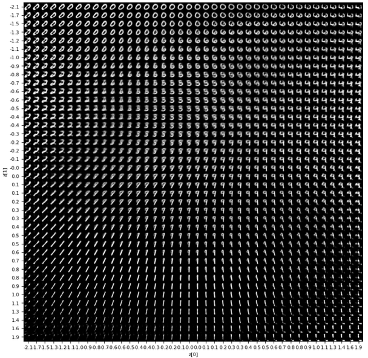

지도를 보면 잠재 공간의 각 영역이 숫자 하나씩을 맡고 있고, 영역과 영역 사이에서는 한 숫자가 다른 숫자로
서서히 변해 간다. 학습에 쓴 이미지의 code 가 없는 좌표를 넣어도 decoder 는 그럴듯한 숫자를 만들어 낸다. 이것이
decoder 를 "생성기" 로 볼 수 있는 이유이며, 다음 절의 VAE 로 이어지는 관찰이다.

**Encoder 가 만든 군집.** 반대로 학습 이미지 전체를 encoder 에 넣어 code 를 얻고, 숫자 레이블별로 색을 칠해
잠재 평면에 뿌린다.

```python
def plot_label_clusters(encoder, trainDataloader):
# display a 2D plot of the digit classes in the latent space
    z_means = []
    labels = []
    for data, label in trainDataloader:
        # (60000,(z0,z1)) <- (60000,1,28,28)
        z_mean = encoder.to(device)(torch.Tensor(data).to(device))
        z_means.append(z_mean.cpu().detach().numpy())
        labels.append(label)
    z_means = np.concatenate(z_means)
    labels = np.concatenate(labels)
    # z_mean.shape:(60000,2)
    plt.figure(figsize=(8, 7))
    plt.scatter(z_means[:, 0], z_means[:, 1], c=labels, s=1) # z[0],z[1]
    plt.colorbar()
    plt.xlabel("z[0]")
    plt.ylabel("z[1]")
    plt.grid()
    plt.show()

trainDataloader = DataLoader(train_dataset, shuffle=False, batch_size=512)
plot_label_clusters(ae4.encoder, trainDataloader)
```

`ae4.encoder` 만 따로 불러 batch 단위로 code 를 모으고(`z_means`, 60,000×2), 레이블도 같은 순서로 모은다.
`shuffle=False` 인 loader 를 새로 만드는 것은 code 와 레이블의 순서가 어긋나지 않게 하기 위해서다. 산점도의
색이 숫자, colorbar 가 0~9 의 대응이다.

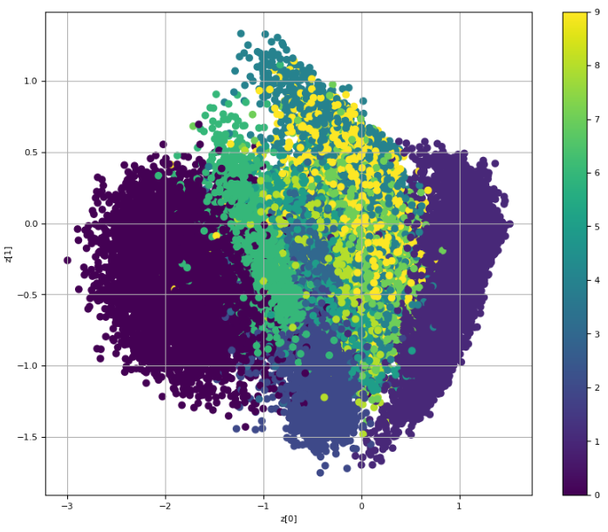

같은 숫자의 code 는 대체로 한곳에 모이지만 군집끼리 넓게 겹친다. 2 차원 code 하나로 열 가지 숫자의 변형을
모두 갈라 놓기에는 자리가 부족하기 때문이며, decoder 지도에서 숫자 사이의 경계가 흐릿했던 것과 같은 현상이다.
앞의 decoder 지도와 이 encoder 산점도를 겹쳐 보면, 산점도에서 어떤 숫자가 차지한 영역이 지도에서 그 숫자가
그려지는 영역과 대응한다.

---

## 6.1.7 실습과제
<!-- 슬라이드 546~547 -->

**실습 6.1.1 과제**

과제 1. 두 모델(AE1, AE2)의 차이를 확인해 보자.

- Regularization 은 모델이 커서 overfitting 이 발생하는 것을 막기 위해 사용한다. 이 모델은 매우 작은 모델인데,
  regularizer 가 성능을 좋게 하는 이유가 무엇일까 생각해 보자.
- 생각을 적어 보자. 작은 모델의 기준은 무엇인가? 모델의 크기가 문제일까?
- Encoder layer 의 activation function 을 `relu` 로 바꾸고(노트북의 과제 문구는 `tanh` → `relu`) 결과를 비교해 보자.

과제 2. Dataset 에 noise 가 추가되는 경우 어떻게 동작하는지 확인해 보자.

- Dataset 을 읽어 오는 cell 에서 `noise_on = False` 를 `True` 로 변경하자. 현재 노트북에서는 transform 의
  `AddNoise()` 를 넣고 빼는 것, 또는 `noise_rate` 를 0 과 0.1 로 바꾸는 것이 이에 해당한다.
- Noisy data 로 다시 학습해 보자. Noise 가 잘 제거되었는가?
- Dataset 을 변경하여(예: 실습 개요의 FashionMNIST) 결과를 확인해 보자.

과제 3. Dataset 을 MNIST 로 하고, `noise_on` 을 False 로, `encoding_dim` 을 10 으로(노트북의 `h=10`) 설정하여
학습하고, 학습된 가중치(weight)들을 image 로 확인해 보자.

- 아래 코드를 실행하고 결과를 분석하자.
- 마지막 그림은 무엇을 보여 주는 걸까?
- `encoding_dim` 을 10 에서 줄인다면 얼마까지 줄일 수 있을까?
- 최저의 dim 에서 잘 동작하도록 모델을 개선해 보자.

**실습 6.1.2 과제**

과제 1. Dataset 을 바꾸고 noise 가 추가되는 경우 결과가 얼마나 다른지 확인하자.

- FashionMNIST 를 읽고 noise 를 켠 채로 다시 학습하여 결과를 확인하자.
- 결과 이미지의 차이를 MNIST 때와 비교해 보자.

**과제 결과 예시**

과제 2 의 결과 예시는 denoise AE 를 100 epoch, batch 크기 512 로 학습한 것이다. 맨 윗줄이 noise 섞인 입력이고
아래 세 줄이 세 모델의 복원이다.

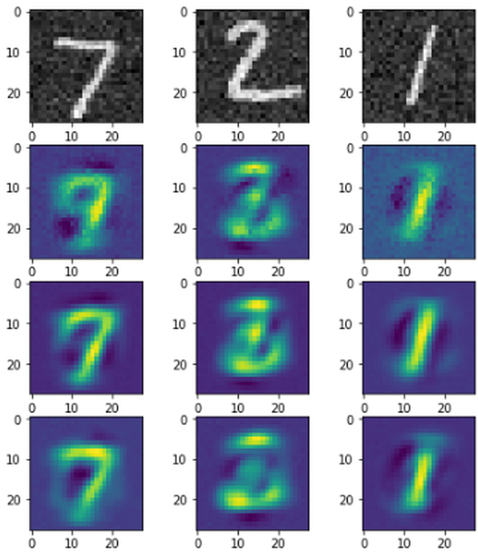

과제 3 의 가중치 시각화는 Dense 층의 가중치 행렬을 그대로 그림으로 보는 것이다. 슬라이드는 Keras 식으로
encoder 가중치를 (784 × 10) 의 transpose, decoder 가중치를 (10 × 784) 로 적고 있는데, PyTorch 의 `nn.Linear` 는
가중치를 (출력, 입력) 모양으로 두므로 encoder `layers[0].weight` 가 (10, 784), decoder `layers[2].weight` 가
(784, 10) 이다. 어느 쪽이든 "code 의 노드 하나당 784 개 값" 이 되도록 맞춰 그리면 된다.

```python
### AutoEncoder 1
#Encoder weigth
pst(ae1.layers[0].weight.cpu().detach().numpy())#(10,784)
#Decoder weigth
pst(ae1.layers[2].weight.cpu().detach().numpy())#(784,10)
print()

### AutoEncoder 3
#Encoder weigth
pst(ae3.layer1[0].weight.cpu().detach().numpy())#(10,794)
#Decoder weigth
pst(ae3.layer2[0].weight.cpu().detach().numpy())#(784,10)
```

AE3 의 encoder 가중치는 입력이 794 차원이므로 (10, 794) 다. 먼저 encoder 가중치를 노드별로 0~1 로 정규화해
세 모델을 세 줄로 그린다.

```python
def w_norm(k_w):
    k_w_norm = []
    for i in range(10):
      k_w_norm.append((k_w[i,:]-np.min(k_w[i,:]))/(np.max(k_w[i,:])-np.min(k_w[i,:])))
    return k_w_norm

## Encoder Weight (784,10) or (794,10)
plt.figure(figsize=(200, 10))

plt.subplot(3,1,1)
k_weight=ae1.layers[0].weight.cpu().detach().numpy()
k_weight = w_norm(k_weight)
plt.imshow(k_weight)

plt.subplot(3,1,2)
k_weight=ae2.layers[0].weight.cpu().detach().numpy()
k_weight = w_norm(k_weight)
plt.imshow(k_weight)

plt.subplot(3,1,3)
k_weight=ae3.layer1[0].weight.cpu().detach().numpy()
k_weight = w_norm(k_weight)
plt.imshow(k_weight)

plt.show()
```

`w_norm` 은 (10, 784) 행렬의 각 행(code 노드 하나에 연결된 784 개 가중치)을 최솟값 0, 최댓값 1 로 늘려 색 범위를
맞춘다. 그림 한 줄이 노드 하나, 가로 방향이 784 개 입력 화소다.

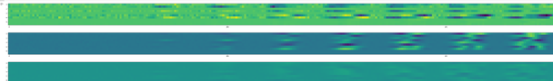

Decoder 가중치는 (784, 10) 이므로 `transpose()` 로 (10, 784) 로 바꾼 뒤 같은 방법으로 그린다.

```python
## Decoder weight (10,784)
plt.figure(figsize=(200,10))

plt.subplot(3,1,1)
k_weight=ae1.layers[2].weight.cpu().detach().numpy().transpose()
k_weight = w_norm(k_weight)
plt.imshow(k_weight)

plt.subplot(3,1,2)
k_weight=ae2.layers[2].weight.cpu().detach().numpy().transpose()
k_weight = w_norm(k_weight)
plt.imshow(k_weight)

plt.subplot(3,1,3)
k_weight=ae3.layer2[0].weight.cpu().detach().numpy().transpose()
k_weight = w_norm(k_weight)
plt.imshow(k_weight)

plt.show()
```

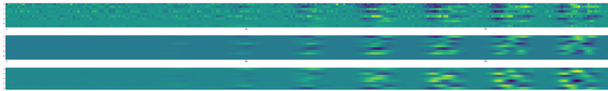

마지막으로 decoder 의 노드 하나에 연결된 가중치 784 개를 `reshape(28,28)` 로 이미지 모양으로 접어 그린다.
슬라이드의 표현으로는 (784,) 를 (28, 28, 1) 로 reshape 하는 것이다.

```python
n=10
plt.figure(figsize=(13,4))
k_w1=ae1.layers[2].weight.cpu().detach().numpy().transpose()
k_w2=ae2.layers[2].weight.cpu().detach().numpy().transpose()
k_w3=ae3.layer2[0].weight.cpu().detach().numpy().transpose()
for i in range(n):
    plt.subplot(3,n,i+1)
    img = k_w1[i].reshape(28,28) # 2번 node의 가중치만 선택
    plt.imshow(img)
    plt.subplot(3,n,n+i+1)
    img = k_w2[i].reshape(28,28) # 2번 node의 가중치만 선택
    plt.imshow(img)
    plt.subplot(3,n,n+n+i+1)
    img = k_w3[i].reshape(28,28) # 2번 node의 가중치만 선택
    plt.imshow(img)

plt.show()
```

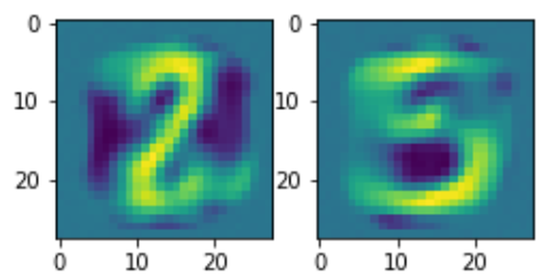

Decoder 의 노드 $n$ 의 가중치는 "code 의 $n$ 번째 값이 1 일 때 decoder 가 출력에 더하는 784 화소 패턴" 이다.
그래서 이것을 이미지로 접으면 숫자의 획을 닮은 무늬가 나타난다. 10 차원 code 는 이런 기본 패턴 10 개의 가중합으로
이미지를 다시 그리는 셈이며, 과제 3 의 "마지막 그림은 무엇을 보여 주는가" 의 답이 여기에 있다. 이 관점에서
`h` 를 10 아래로 줄이면 기본 패턴의 수가 줄어 무엇이 먼저 무너지는지 관찰할 수 있다.

---

## 6.1.8 정리
<!-- 슬라이드 535~550 -->

- **Encoder** 는 입력을 잠재 공간(latent space)의 code 로, **decoder** 는 code 를 다른 도메인으로 맵핑하는
  함수다. JPEG 압축과 텍스트 번역이 그 예다. **Auto encoder** 는 decoder 의 목표를 입력 자신으로 두어 레이블
  없이 압축 표현을 배운다.
- AE 는 PCA 처럼 고차원을 저차원으로 압축하고 복원하지만, 비선형 표현을 학습한다. Denoising·super-resolution·
  semantic segmentation 에 쓰이며, 손상 복구·anomaly detection·비선형 차원 축소·자기지도 학습이 핵심 기능이다.
  훈련 데이터와 유사한 데이터로 제한되고 복원에 loss 가 포함되는 것이 한계다.
- Denoising 기능은 학습 중 입력에 noise 를 더하는 것만으로 생긴다. 저차원 code 는 여러 입력에 공통된 구조만
  담을 수 있고 화소별 무작위 잡음은 통과하지 못하기 때문이다.
- 실습 6.1.1 — Linear 층 두 개(784 → 10 → 784)의 AE1, weight decay 0.002 를 더한 AE2, one-hot 레이블을 이어
  붙인 794 차원 입력으로 복원과 분류를 동시에 하는 AE3 를 비교했다. 최소 검증 손실은 0.066 / 0.053 / 0.056 이며,
  세 모델 모두 잡음을 지우되 AE2·AE3 가 더 또렷하다.
- 실습 6.1.2 — Conv 3 개씩의 encoder(28 → 14 → 7 → 4, code (8, 4, 4))와 decoder(upsample 로 4 → 28)를 가진 CNN AE
  는 Dense AE 보다 훨씬 깨끗하게 복원한다. FashionMNIST 에서는 윤곽은 살고 세부 무늬는 뭉개진다.
- 실습 6.1.3 — code 를 2 차원으로 줄이면(파라미터 13,491 개) decoder 로 잠재 평면의 격자를 그려 숫자 지도를
  만들 수 있고, encoder 로 학습 데이터의 code 를 뿌려 숫자별 군집을 볼 수 있다. 격자 사이에서 숫자가 연속적으로
  변한다는 관찰이 다음 절의 VAE 로 이어진다.
- 실습과제 — 작은 모델에서 정규화가 도움이 되는 이유, noise 유무와 dataset 변경, 그리고 decoder 가중치를
  28×28 로 접어 보면 code 의 각 노드가 맡은 기본 획 패턴이 드러난다는 것을 확인한다.
