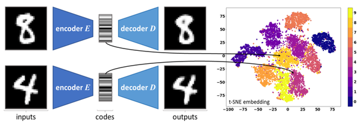
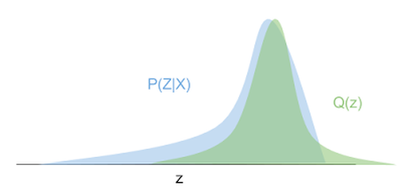
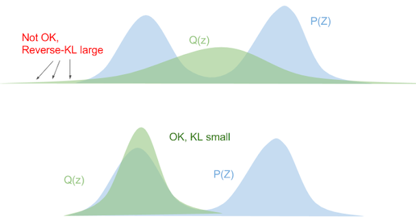
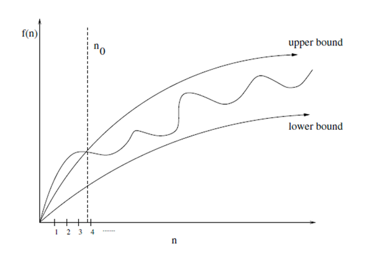
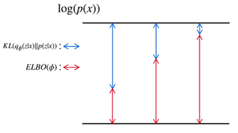

# 6.2 Variational Inference(변분 추론)

**학습 목표**

- Auto Encoder 와 Variational Auto Encoder 를 "Encoder + Latent Variable + Decoder" 라는 생성 모델의 틀에서 비교하고, 잠재 변수를 고정 벡터에 mapping 하는지 분포에 mapping 하는지의 차이를 설명할 수 있다.
- 좋은 생성 모델이란 좋은 latent variable 을 잘 decoding 하는 것이며, 그 목표가 왜 $p(z|x)$ 를 직접 찾는 대신 encoder $q(z|x)$ 를 찾는 문제로 바뀌는지 설명할 수 있다.
- Variational Inference 가 복잡한 분포를 간단한 분포(정규분포)의 모수 조정으로 근사하는 방법임을 이해하고, 근사의 척도로 $D_{KL}$ 을 쓰는 이유를 말할 수 있다.
- 정보량에서 출발하여 Entropy, KL divergence, Cross Entropy 로 이어지는 식을 스스로 써 내려갈 수 있다.
- $D_{KL}(p\,\|\,q)$ 와 $D_{KL}(q\,\|\,p)$ 의 비대칭성이 근사 분포의 모양에 어떤 차이를 만드는지, 그리고 JS divergence 가 무엇인지 설명할 수 있다.
- Lower bound 의 개념과 $\log P(x) = D_{KL} + \mathrm{ELBO}$ 의 관계로부터, ELBO 최대화가 근사 분포를 정답 분포에 가깝게 하는 이유를 설명할 수 있다.

**이 절의 구성**

- 6.2.1 Generative Model 에 대한 접근 — Auto Encoder 와 Variational Auto Encoder
- 6.2.2 Latent Variable(잠재 변수)
- 6.2.3 Latent Variable 을 찾는 모델과 Variational Inference
- 6.2.4 Entropy, Cross Entropy, KL divergence 개념 정리
- 6.2.5 KL divergence 의 비대칭성과 JS divergence
- 6.2.6 Lower bound 와 ELBO
- 6.2.7 정리

---

## 6.2.1 Generative Model 에 대한 접근 — Auto Encoder 와 Variational Auto Encoder
<!-- 슬라이드 552 -->

6.1 절에서 다룬 Auto Encoder 를 생성 모델(Generative Model)의 관점에서 다시 본다. 생성 모델의 접근은 **확률 분포를 학습하고, 학습한 확률 분포로부터 새로운 데이터를 생성하는 것**이다. Auto Encoder 를 이 틀에 놓으면 다음과 같이 쓸 수 있다.

> **Generative Model = Encoder + Latent Variable(fixed vector mapping) + Decoder**

Encoder 가 입력 데이터를 잠재 변수(latent variable)로 보내고, Decoder 가 잠재 변수에서 데이터를 복원한다. 이때 Auto Encoder 의 잠재 변수는 입력 하나가 잠재 공간의 **고정된 벡터 하나(fixed vector)** 에 mapping 되는 형태다. 아래 그림의 왼쪽이 그 구조다. 손글씨 숫자 8 과 4 가 각각 encoder E 를 거쳐 code(잠재 벡터)가 되고, decoder D 가 이를 다시 숫자 이미지로 복원한다. 오른쪽은 이렇게 얻은 code 를 t-SNE 로 2차원에 펼친 것인데, 같은 숫자의 code 가 같은 색의 무리를 이루며 모여 있다. 잠재 공간이 데이터의 특징을 담고 있다는 뜻이다.

Variational Auto Encoder(VAE)는 같은 틀을 쓰되 잠재 변수를 다루는 방식이 다르다. VAE 는 **잠재 변수가 갖고 있는 특징을 잘 표현하는 Decoder** 와, **학습을 통해 데이터와 잠재 변수 사이의 mapping 을 잘 하는 Encoder** 의 결합이다. 여기서 Encoder 는 입력을 고정된 벡터가 아니라 **분포(distribution)** 에 mapping 한다.

> **Generative Model = Encoder + Latent Variable(distribution 에 mapping) + Decoder**

아래 그림이 그 구조다. Encoder $q_\phi(\cdot)$ 는 입력 이미지로부터 평균 $\mu$ 와 분산 $\sigma^2$ 를 출력하고, 이 분포에서 sampling 한 latent vector 를 Decoder $p_\theta(\cdot)$ 가 받아 이미지를 복원한다. Auto Encoder 의 code 자리에 "분포 + sampling" 이 들어간 것이 VAE 와 Auto Encoder 의 본질적 차이다. 이 구조를 코드로 구현하는 것은 6.3 절의 일이고, 이 절은 그 앞에 필요한 이론 — 잠재 변수, 변분 추론, KL divergence, ELBO — 을 정리한다.

(그림 출처: http://cs231n.stanford.edu/)

---

## 6.2.2 Latent Variable(잠재 변수)
<!-- 슬라이드 553 -->

생성 모델이 만들어 내는 데이터가 $Z$ 라는 잠재 변수(latent variable)로부터 생성되는 것으로 간주하자. 그러면 데이터가 가진 **각각의 특징을 대표하는 variable** 이 있을 것이다. 얼굴 사진이라면 남/여, 표정, 보는 각도 같은 것이 잠재 변수가 된다. 잠재 변수란 **데이터 세트에서 관찰 가능한 특징이 encoding 된 것**이다.

이 관점에서, 좋은 잠재 변수를 찾는다면 모든 것을 아주 잘 생성할 수 있을 것이다. 아래 그림은 잠재 변수 두 개를 바꾸어 가며 얼굴을 생성한 결과다. 세로 방향으로 $z_1$ 을 바꾸면 웃는 정도(degree of smile)가 달라지고, 가로 방향으로 $z_2$ 를 바꾸면 얼굴이 향하는 각도(head pose)가 달라진다. 잠재 변수의 축 하나하나가 사람이 알아볼 수 있는 특징에 대응하는 것이다.

그래서 **좋은 생성 모델은 좋은 잠재 변수를 잘 decoding 하는 것**이다. 이를 encoder 와 decoder 로 나누어 보면 다음과 같다.

- **좋은 Decoder** — 잠재 변수의 특징을 잘 표현한다.
- **좋은 Encoder** — 데이터와 좋은 잠재 변수를 잘 mapping 한다.
- **좋은 Generative Model(목표)** — 좋은 잠재 변수를 잘 decoding 한다.

> **핵심 메시지**
> 생성 모델의 목표는 결국 **좋은 latent variable 을 찾는 것**이다. Decoder 가 아무리 좋아도 잠재 변수가 데이터의 특징을 담고 있지 않으면 좋은 데이터를 생성할 수 없다.

---

## 6.2.3 Latent Variable 을 찾는 모델과 Variational Inference
<!-- 슬라이드 554~555 -->

### Variational Auto Encoder — Latent Variable 을 찾는 모델

데이터 $x$ 가 주어졌을 때 좋은 잠재 변수의 분포 $p(z|x)$ 를 직접 찾는 것은 너무 어렵다. 그래서 VAE 는 방향을 바꾼다. **대신 좋은 encoder $q(z|x)$ 를 찾자!**

이것이 Encoder 를 위한 Variational Inference 다. Encoder 를 다음과 같이 재정의한다. Encoder 란 **Decoder 가 잘 복원할 수 있는 $p(z|x)$ 에 mapping 할 수 있는, 최적의 $q(z|x)$ 를 찾는 것**이다. 이때 최적의 $q(z|x)$ 를 찾는 방법으로 Variational Inference 를 사용한다. 앞 소절의 VAE 구조도에서 Encoder 에 $q_\phi(\cdot)$, Decoder 에 $p_\theta(\cdot)$ 라고 적혀 있던 것이 바로 이 $q(z|x)$ 와 복원 쪽 분포이며, $\phi$ 와 $\theta$ 는 각각 학습으로 정해지는 encoder 와 decoder 의 파라미터다.

### Variational Inference

Variational Inference(변분 추론)는 **복잡한 분포를 더 간단한 분포를 이용해서 근사하는 것**이다. 알고 싶은 분포는 $P(z|x)$ 인데 이것은 복잡해서 직접 다룰 수 없다. 대신 다루기 쉬운 분포 $Q(z)$ 를 두고, $Q(z)$ 가 알고 싶은 $P(z|x)$ 에 가깝도록 만든다. $Q(z)$ 로는 정규분포를 쓰고, **정규분포의 모수(parameter)를 바꾸어** 근사한다.

아래 그림이 이 상황이다. 파란색이 알고 싶은 $P(z|x)$ 이고 초록색이 근사 분포 $Q(z)$ 다. $P(z|x)$ 는 왼쪽으로 긴 꼬리를 가진 복잡한 모양이지만, 정규분포 $Q(z)$ 는 평균 $\mu$ 와 표준편차 $\sigma$ 두 모수만 조정하여 봉우리의 위치와 폭을 $P(z|x)$ 에 맞출 수 있다. 모양이 완전히 같아지지는 않아도, 다루기 쉬운 두 숫자로 복잡한 분포의 핵심을 잡아내는 것이다.

그런데 "가깝다" 는 것을 어떻게 잴 것인가? 두 분포의 유사도를 측정하는 척도가 필요하다. 여기서는 **KL divergence $D_{KL}$ 을 사용한다.** 다음 소절에서 정보량과 entropy 에서 출발하여 $D_{KL}$ 이 무엇인지 정리한다.

---

## 6.2.4 Entropy, Cross Entropy, KL divergence 개념 정리
<!-- 슬라이드 556 -->

### 정보량과 Entropy

Entropy 는 **정보량의 기대값(평균 정보량)** 이며, 무질서도 또는 불확실성이라고도 부른다. 정보량부터 정의한다.

확률이 적은 사건이 발생했다는 정보는 정보량이 많은 것이다. 즉 정보량은 발생 확률 $p$ 에 반비례한다($1/p$). 그런데 독립인 두 사건이 함께 발생할 확률은 곱이고, 두 사건의 정보량은 합이어야 한다. 곱을 합으로 바꾸는 함수가 로그이므로 정보량은 다음과 같이 정의한다.

$$
\log\left(\frac{1}{p}\right) = -\log(p)
$$

이것이 사건 하나의 정보량이다. Entropy 는 모든 사건의 평균 정보량, 즉 정보량의 기대값이다.

$$
\sum_i p_i \log\left(\frac{1}{p_i}\right) = -\sum_i p_i \log(p_i) = H(p)
$$

정리하면 정보량에서 Entropy 까지는 다음 순서로 이어진다.

$$
\text{정보량} \;\Rightarrow\; \frac{1}{p} \;\Rightarrow\; \log\left(\frac{1}{p}\right) \;\Rightarrow\; \sum_i p_i \log\left(\frac{1}{p_i}\right) \;\Rightarrow\; -\sum_i p_i \log(p_i) = H(p) = \text{Entropy}
$$

### KL divergence

KL divergence 는 **정보 손실량의 기대값**이다. 확률분포 $p$ 와 $q$ 사이의 정보량의 차이(정보의 손실량)를 $\Delta_i$ 라 하면, $\Delta_i$ 의 기대값을 $D_{KL}$ 이라 한다. 사건 $i$ 의 정보량은 $p$ 로 재면 $-\log(p_i)$, $q$ 로 재면 $-\log(q_i)$ 이므로 그 차이와 기대값은 다음과 같다.

$$
\Delta_i = -\log(q_i) + \log(p_i)
\;\Rightarrow\;
E(\Delta_i) = \sum_i p_i \Delta_i
= -\sum_i p_i \log(q_i) + \sum_i p_i \log(p_i)
= D_{KL}(p\,\|\,q)
$$

기대값은 실제 분포 $p$ 로 취한다는 점에 주의한다. 마지막 식의 두 항에는 각각 이름이 붙는다. 뒤의 $\sum_i p_i \log(p_i)$ 는 $p$ 자신으로 잰 평균 정보량, 곧 송신 쪽 entropy 이고, 앞의 $-\sum_i p_i \log(q_i)$ 는 $p$ 에서 나온 사건을 $q$ 로 받아 잰 평균 정보량, 곧 수신 쪽 entropy 다. $D_{KL}$ 은 이 둘의 차이다.

이 식을 두 가지로 읽을 수 있다.

- **$P$ 의 분포 추정** — $q$ 의 모수를 수정하면서 $D_{KL}$ 이 최소가 되게 하는 것이다.
- **알고 있는 $q$ 로 모르는 $p$ 를 설명한다** — 이것이 곧 Variational Inference 다.

### Cross Entropy

Cross Entropy 는 분포 $p$ 와 $q$ 의 관계를 나타내며, **$q$ 의 정보량을 $p$ 로 평균한 것**이다. 식별에 필요한 bit 수라고도 한다.

$D_{KL}$ 을 최소화할 때 뒷항 $\sum_i p_i \log(p_i)$ 는 $q$ 와 무관하므로, 앞 항만 최소화시키면 된다. 이는 다음 관계 때문이다.

$$
\because\; D_{KL}(p\,\|\,q) = H(p,q) - H(p)
$$

여기서 앞 항이 Cross Entropy(CE) 다.

$$
H(p,q) = -\sum_i p_i \log(q_i)
$$

다르게 표현하면 다음과 같다. $q$ 의 정보량 $-\log(q)$ 에 대해 $p$ 로 기대값을 취한 것이며, $p$ 의 entropy 에 $D_{KL}$ 을 더한 것과 같다.

$$
H(p,q) = -E_p\left[\log(q)\right] = -\sum_i p_i \log(q_i) = H(p) + D_{KL}(p\,\|\,q)
$$

> **핵심 메시지**
> $H(p,q) = H(p) + D_{KL}(p\,\|\,q)$ 이다. 분류 문제에서 cross entropy 를 loss 로 쓰는 것과, 근사 분포 $q$ 를 $p$ 에 가깝게 하려고 $D_{KL}$ 을 최소화하는 것은 같은 일이다 — $H(p)$ 는 $q$ 와 무관한 상수이기 때문이다.

---

## 6.2.5 KL divergence 의 비대칭성과 JS divergence
<!-- 슬라이드 557 -->

KL divergence 는 정보 손실량의 기대값이다. 정보량은 확률이 작을수록 커지므로 $D_{KL}$ 은 **확률이 작은 값에 예민**하다. 두 분포가 같으면 0 이고, 분포가 다르면 커진다.

한 가지 중요한 성질은 $D_{KL}$ 이 **대칭이 아니라는 점**이다. 어느 분포를 앞에 두느냐에 따라 값도, 근사의 성격도 달라진다.

**$D_{KL}(p\,\|\,q)$ — $q$ 가 작을 때 $p$ 도 작을 것.** 정의는 다음과 같다. 기대값을 $p$ 로 취하므로, $p$ 가 큰 곳에서 $q$ 가 작으면 $\log\frac{p}{q}$ 가 커져 값이 커진다.

$$
KL(P\,\|\,Q) = \sum_z p(z)\log\frac{p(z)}{q(z)} = \mathbb{E}_{p(z)}\left[\log\frac{p(z)}{q(z)}\right]
$$

아래 그림에서 $P(z)$(파랑)는 봉우리가 둘인 분포이고 $Q(z)$(초록)는 봉우리가 하나인 정규분포다. 위쪽처럼 $Q$ 가 한쪽 봉우리에만 붙으면 오른쪽 봉우리에서 $p$ 는 크고 $q$ 는 거의 0 이 되어 forward KL 이 커진다(Not OK). 아래쪽처럼 $Q$ 를 넓게 펴서 두 봉우리를 모두 덮으면 $p$ 가 큰 곳에서 $q$ 가 0 이 되는 일이 없어 KL 이 작다(OK). 즉 $D_{KL}(p\,\|\,q)$ 를 최소화하면 $q$ 는 $p$ 가 있는 모든 영역을 덮으려 한다.

**$D_{KL}(q\,\|\,p)$ — $p$ 가 작을 때 $q$ 도 작을 것.** 앞뒤를 바꾼 reverse KL 은 기대값을 $q$ 로 취한다.

$$
KL(Q\,\|\,P) = \sum_z q(z)\log\frac{q(z)}{p(z)} = \mathbb{E}_{q(z)}\left[\log\frac{q(z)}{p(z)}\right]
$$

이번에는 $q$ 가 큰 곳에서 $p$ 가 작으면 값이 커진다. 아래 그림의 위쪽처럼 $Q$ 를 넓게 펴면, 봉우리 바깥이나 두 봉우리 사이처럼 $p$ 가 거의 0 인 곳에 $q$ 가 퍼져 있어 reverse KL 이 커진다(Not OK). 아래쪽처럼 $Q$ 가 한 봉우리에만 딱 맞으면 $q$ 가 큰 곳에서 $p$ 도 크므로 KL 이 작다(OK). 즉 $D_{KL}(q\,\|\,p)$ 를 최소화하면 $q$ 는 $p$ 의 한 봉우리(mode)를 골라 붙는다.

같은 두 분포라도 forward KL 을 줄이면 넓은 $Q$ 가, reverse KL 을 줄이면 좁은 $Q$ 가 답이 된다. 어느 방향의 $D_{KL}$ 을 최소화하느냐가 근사 분포의 모양을 결정하는 것이다.

**JS divergence.** $D_{KL}$ 의 방향 의존성을 없앤 척도가 JS divergence 다. 두 분포의 평균 $\frac{p+q}{2}$ 를 기준으로 양쪽 $D_{KL}$ 을 반씩 더한다.

$$
D_{JS}(p\,\|\,q) = \frac{1}{2} D_{KL}\!\left(p\,\Big\|\,\frac{p+q}{2}\right) + \frac{1}{2} D_{KL}\!\left(q\,\Big\|\,\frac{p+q}{2}\right)
$$

식에서 $p$ 와 $q$ 를 바꾸어도 두 항이 자리만 바뀌므로 값은 같다. 즉 $D_{JS}(p\,\|\,q) = D_{JS}(q\,\|\,p)$ 이다.

---

## 6.2.6 Lower bound 와 ELBO
<!-- 슬라이드 558 -->

### Lower bound, Upper bound 개념

특정 함수나 분포의 **상한(upper bound)과 하한(lower bound)** 을 생각하자. 정답 함수를 직접 계산할 수 없는 경우, 상한과 하한을 가이드로 삼아 정답에 근사할 수 있다. 아래 그림에서 가운데 구불구불한 곡선이 정답 함수 $f(n)$ 이고, 그 위아래의 매끄러운 곡선이 upper bound 와 lower bound 다. $n_0$ 이후로 정답 함수는 항상 두 bound 사이에 머문다. 정답을 직접 다루기 어려울 때 lower bound 를 끌어올리면 정답도 그만큼 밀려 올라간다.

밀도 함수(density function)를 근사할 때에는 이 가운데 **lower bound 함수를 활용**한다.

### ELBO(Evidence LowerBOund)

우리가 근사하려는 정답 분포는 $P(z|x)$ 이고 근사 분포는 $q(z|x)$ 다. 데이터의 log 확률(evidence) $\log P(x)$ 는 이 두 분포 사이의 $D_{KL}$ 과 ELBO 의 합으로 나뉜다.

$$
\log P(x) = D_{KL}\left(q(z|x)\,\|\,P(z|x)\right) + \mathrm{ELBO}
$$

아래 그림이 이 관계다. 위 가로선이 $\log(p(x))$ 이고 아래 가로선이 0 이다. 그 사이의 높이가 파란 화살표 $KL(q_\phi(z|x)\,\|\,p(z|x))$ 와 빨간 화살표 $\mathrm{ELBO}(\phi)$ 로 나뉘어 있고, 왼쪽에서 오른쪽으로 갈수록 빨간 ELBO 가 커지면서 파란 KL 이 줄어든다. 주어진 데이터에 대해 $\log P(x)$ 는 encoder 파라미터 $\phi$ 와 무관한 고정값이므로, 두 항 가운데 하나가 커지면 다른 하나는 반드시 작아진다.

앞 소절에서 본 대로 $D_{KL}$ 은 두 분포가 같을 때 0 이고 다르면 커지므로, ELBO 는 $\log P(x)$ 보다 클 수 없다. 즉 ELBO 는 evidence $\log P(x)$ 의 하한(lower bound)이며, 그래서 이름이 Evidence Lower BOund 다. 따라서 **ELBO 를 최대화하면 근사 분포 $q(z|x)$ 와 정답 분포 $p(z|x)$ 의 차이를 최소화할 수 있다.**

$$
\mathrm{ELBO} \uparrow \quad\Longrightarrow\quad D_{KL}\left(q(z|x)\,\|\,P(z|x)\right) \rightarrow 0
$$

$D_{KL}$ 을 직접 최소화하려면 정답 분포 $P(z|x)$ 를 알아야 하는데, 그것은 앞에서 본 대로 직접 찾기 너무 어려운 분포다. 대신 계산할 수 있는 ELBO 를 최대화하는 것이 VAE 학습의 기본 전략이다. ELBO 의 구체적인 식은 보충자료의 ELBO 부분을 참고한다.

> **핵심 메시지**
> $\log P(x) = D_{KL}(q(z|x)\,\|\,P(z|x)) + \mathrm{ELBO}$ 에서 좌변은 고정이다. 그러므로 ELBO 를 올리는 것이 곧 $D_{KL}$ 을 내리는 것이고, 이것이 계산할 수 없는 $P(z|x)$ 대신 $q(z|x)$ 를 학습하는 방법이다.

---

## 6.2.7 정리
<!-- 슬라이드 552~558 -->

- Auto Encoder 와 VAE 는 모두 Encoder + Latent Variable + Decoder 의 생성 모델 틀에 놓을 수 있다. 차이는 잠재 변수를 고정 벡터에 mapping 하느냐(AE), 분포에 mapping 하느냐(VAE)이다.
- 잠재 변수는 데이터에서 관찰 가능한 특징이 encoding 된 것이며, 좋은 생성 모델은 좋은 잠재 변수를 잘 decoding 하는 것이다. 목표는 좋은 잠재 변수를 찾는 것이다.
- $p(z|x)$ 를 직접 찾는 대신 encoder $q(z|x)$ 를 찾는다. 복잡한 분포를 간단한 정규분포의 모수 조정으로 근사하는 것이 Variational Inference 이고, 가까움의 척도는 $D_{KL}$ 이다.
- 정보량 $-\log p$ 에서 출발하여 Entropy $H(p) = -\sum_i p_i \log p_i$, KL divergence $D_{KL}(p\,\|\,q) = -\sum_i p_i \log q_i + \sum_i p_i \log p_i$, Cross Entropy $H(p,q) = H(p) + D_{KL}(p\,\|\,q)$ 로 이어진다.
- $D_{KL}$ 은 비대칭이다. $D_{KL}(p\,\|\,q)$ 를 줄이면 $q$ 가 $p$ 전체를 덮으려 하고, $D_{KL}(q\,\|\,p)$ 를 줄이면 $q$ 가 $p$ 의 한 봉우리에 붙는다. JS divergence 는 평균 분포를 기준으로 양쪽 $D_{KL}$ 을 반씩 더한 대칭 척도다.
- $\log P(x) = D_{KL}(q(z|x)\,\|\,P(z|x)) + \mathrm{ELBO}$ 이므로, ELBO 를 최대화하면 $q(z|x)$ 가 $P(z|x)$ 에 가까워진다. 이것이 6.3 절에서 구현할 VAE 의 학습 원리다.
