# 6.3 Variational Auto Encoder(VAE)

**학습 목표**

- VAE 를 Encoder(추론 모델) + Latent Variable + Decoder(생성 모델)의 결합으로 설명하고, 6.1 의 Auto Encoder 와 무엇이 다른지 말할 수 있다.
- $\log P(x)$ 를 ELBO 와 KL divergence 의 합으로 쓰고, ELBO 를 키우는 것이 왜 근사 분포 $q(z|x)$ 를 진짜 사후분포 $P(z|x)$ 에 가깝게 만드는지 설명할 수 있다.
- Sampling 노드에서 역전파가 막히는 이유와, Reparameterization trick $z = \mu + \sigma \odot \epsilon$ 이 그것을 어떻게 푸는지 설명할 수 있다.
- VAE 의 cost function 을 reconstruction error(binary cross entropy)와 latent variable regularization(KL divergence)의 합으로 쓰고, 정규분포 사이의 KL 이 $\mu$ 와 $\sigma$ 의 닫힌 식이 되는 것을 안다.
- PyTorch + Lightning 으로 latent dim = 2 인 MNIST VAE 를 만들고, 잠재 공간을 격자로 훑은 생성 이미지와 label 별 군집 산점도를 그려 해석할 수 있다.

**이 절의 구성**

- 6.3.1 VAE 의 구성과 목적
- 6.3.2 ELBO 와 VAE
- 6.3.3 VAE 의 구조와 Reparameterization Trick
- 6.3.4 Cost function — Reconstruction error 와 Latent variable regularization
- 6.3.5 VAE 의 성능 — 잠재 변수를 바꾸어 이미지 생성하기
- 6.3.6 실습 6.3.1 — Variational Autoencoder (VAE) : 데이터와 Sampling 함수
- 6.3.7 Encoder 와 Decoder
- 6.3.8 VAE 모델 · Loss function · 학습
- 6.3.9 잠재 영역의 시각화
- 6.3.10 fixed mapping 과 distributed mapping
- 6.3.11 실습과제
- 6.3.12 정리

---

## 6.3.1 VAE 의 구성과 목적
<!-- 슬라이드 560 -->

Variational Auto Encoder(VAE)는 **Encoder, Latent Variable(잠재 변수), Decoder** 세 부분으로 이루어진다.

- **Encoder(추론 모델)** — Data 와 "좋은" Latent Variable 사이의 mapping 을 잘 하는 부분이다. 입력 $x$ 를 받아 잠재 변수의 분포 $q(z'|x)$ 를 내놓는다.
- **Decoder(생성 모델)** — 좋은 Latent Variable 이 갖고 있는 특징을 잘 표현하는 부분이다. 잠재 변수 $z'$ 를 받아 $p(x'|z')$ 로 데이터 $x'$ 를 만들어 낸다.

VAE 는 이 두 모델의 결합이다. 6.1 의 Auto Encoder 가 입력을 잠재 공간의 **한 점**으로 보냈다면, VAE 는 잠재 변수를 **확률 분포**로 다루고 그 분포에서 sampling 한 값을 Decoder 에 넣는다. 데이터가 흐르는 순서를 한 줄로 쓰면 다음과 같다.

$$x \to q(z'|x) \to z' \to p(x'|z') \to x'$$

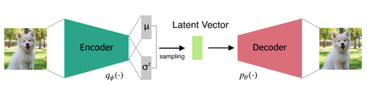

그림에서 Encoder $q_\phi(\cdot)$ 는 입력 이미지를 $\mu$ 와 $\sigma$ 두 벡터로 요약하고, 두 벡터에서 sampling 을 거쳐 Latent Vector 가 만들어진다. Decoder $p_\theta(\cdot)$ 는 이 벡터에서 원래 이미지와 닮은 이미지를 복원한다. $\phi$ 는 Encoder 의 파라미터, $\theta$ 는 Decoder 의 파라미터다.

VAE 의 목적은 두 가지다.

- Dataset 의 특징을 대표하는 **좋은 Latent Variable 을 찾는다.**
- 찾은 Latent Variable 을 **control 하여 원하는 Dataset 을 생성한다.**

단순히 입력을 복원하는 것이 목표가 아니라, 잠재 변수를 조작했을 때 그에 맞는 새 데이터가 나오는 **생성 모델**을 얻는 것이 목표다.

이 목적을 loss function 으로 옮긴 것이 ELBO(Evidence Lower BOund)다. 학습은 ELBO 를 **키우는** 방향으로 진행되고, ELBO 를 키운다는 것은 아래 세 가지를 동시에 맞추는 것이다.

- $x \cong x'$ : 복원된 데이터가 입력과 시각적으로 유사해진다.
- $q(z'|x) \cong P(z|x)$ : Encoder 가 내놓는 근사 분포가 진짜 잠재 분포와 유사해진다.
- $q(z'|x) \cong P(z)$ : 잠재 분포의 분포, 즉 데이터 전체에 걸친 잠재 변수의 분포가 표준정규분포에 가까워진다.

> **핵심 메시지**
> VAE = Encoder(추론 모델) + Latent Variable + Decoder(생성 모델). 입력을 잠재 변수의 "분포"로 보내고, 그 분포에서 sampling 한 값으로 데이터를 생성한다. Loss 는 ELBO 이며 복원의 정확도와 잠재 분포의 모양을 동시에 잡는다.

---

## 6.3.2 ELBO 와 VAE
<!-- 슬라이드 561 -->

6.2 의 Variational Inference 에서 본 ELBO 를 VAE 의 기호로 다시 쓴다. 데이터 $x$ 의 log evidence $\log P(x)$ 는 다음과 같이 세 항으로 나뉜다.

$$\log P(x) = E_{q(z|x)}\left[\log P(x|z)\right] - D_{KL}\left(q(z|x)\,\|\,P(z)\right) + D_{KL}\left(q(z|x)\,\|\,P(z|x)\right)$$

앞의 두 항을 묶은 것이 ELBO 이므로

$$\log P(x) = \mathrm{ELBO} + D_{KL}\left(q(z|x)\,\|\,P(z|x)\right)$$

이다. 좌변 $\log P(x)$ 는 데이터가 주어지면 정해지는 값이다. 따라서 우변에서 **ELBO 를 키우면 $D_{KL}(q(z|x)\,\|\,P(z|x))$ 가 그만큼 작아진다.** 직접 계산할 수 없는 진짜 사후분포 $P(z|x)$ 와 Encoder 의 근사 분포 $q(z|x)$ 사이의 거리를, 계산할 수 있는 ELBO 를 최대화하는 것으로 줄이는 것이다.


그림에서 위쪽 가로선이 $\log p(x)$ 의 높이다. 파란 화살표가 $KL(q_\phi(z|x)\,\|\,p(z|x))$, 빨간 화살표가 $ELBO(\phi)$ 이고, 둘을 합친 길이는 항상 같다. 오른쪽으로 갈수록 ELBO 가 커지고 KL 이 줄어드는 모습이다.

KL divergence 는 항상 0 이상이므로 ELBO 는 $\log P(x)$ 의 하한(lower bound)이 된다.

$$\log P(x) \ge E_{z \sim q(z|x)}\left[\log p(x|z)\right] - D_{KL}\left(q(z|x)\,\|\,P(z)\right) = \mathrm{ELBO}$$

ELBO 를 이루는 두 항은 각각 VAE 의 두 부분을 학습시킨다.

- **첫째 항** $E_{z \sim q(z|x)}[\log p(x|z)]$ — Encoder 의 근사 분포 $q(z|x)$ 에서 sampling 된 $z$ 를 seed 로 하여, Decoder 에서 생성된 분포 $p(x|z)$ 의 확실성(불확실성의 반대)이 커지는 방향이다. 즉 $z$ 로부터 원래의 $x$ 가 높은 확률로 나오도록 Decoder 를 만든다.
- **둘째 항** $-D_{KL}(q(z|x)\,\|\,P(z))$ — true prior $P(z)$ 와 $q(z|x)$ 두 분포의 유사도가 커지는(KL 값이 작아지는) 방향이다. Encoder 가 내놓는 분포가 prior 에서 멀리 벗어나지 않도록 붙잡는다.

> 참고: http://cs231n.stanford.edu/

---

## 6.3.3 VAE 의 구조와 Reparameterization Trick
<!-- 슬라이드 562~563 -->

### VAE 구조

VAE 의 세 부분이 실제로 어떤 값을 주고받는지 MNIST 이미지를 예로 따라가 본다.

- **Encoder** — 입력 $x_i$ 를 받아 $i$-dim latent variable 의 **모수**(평균 $\mu_i$ 와 표준편차 $\sigma_i$)를 출력한다. 이 모수로 정해진 분포에서 sampling 하여 latent vector $z_i$ 를 얻는다. Encoder 가 정하는 분포가 $q_\phi(z|x)$ 다.
- **Decoder** — $z_i$ 로부터 pixel 이 Bernoulli 분포인 Image 를 생성한다. 각 pixel 에 대해 "켜질 확률" $p_i$ 를 내놓는 것이므로 출력은 0 과 1 사이의 값이다. Decoder 가 정하는 분포가 $p_\theta(x|z)$ 다.
- **Sampling** — 분포에서 값을 뽑는 stochastic node 다. 이 노드를 지나 Backpropagation 을 하기 위해 **Reparameterization Trick** 을 쓴다.

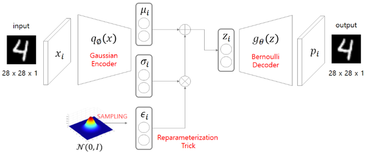

그림의 Encoder 는 **Gaussian Encoder** 다. 입력 $x_i$ (28 x 28 x 1) 가 $q_\phi(x)$ 를 지나 $\mu_i$ 와 $\sigma_i$ 가 된다. 그 아래의 $N(0, I)$ 에서 sampling 한 $\epsilon_i$ 를 $\sigma_i$ 와 곱하고 $\mu_i$ 를 더해 $z_i$ 를 만든다 — 이 부분이 Reparameterization Trick 이다. Decoder 는 **Bernoulli Decoder** $g_\theta(z)$ 로, $z_i$ 에서 각 pixel 의 확률 $p_i$ 를 계산해 28 x 28 x 1 의 출력 이미지를 만든다.

### Sampling 문제와 Reparameterization Trick

Sampling 은 Backpropagation 에서 **미분이 불가능**하다는 문제가 있다. $z$ 를 $q_\phi(z|x)$ 에서 "뽑는" 연산은 결과가 우연에 따라 달라지므로, $z$ 를 $\mu$ 나 $\sigma$ 로 미분한다는 것 자체가 정의되지 않는다. Encoder 의 파라미터로 gradient 가 흘러가지 못하면 Encoder 를 학습시킬 수 없다.

해결책은 sampling 의 **우연성(noise)을 분리**하는 것이다. Stochastic node 를 stochastic 부분과 deterministic 부분으로 분해하고, deterministic 부분으로 역전파한다. 이렇게 하면 안정적인 모수 추정이 가능해진다.

$$z^{i,j} \sim N(\mu_i, \sigma_i^2 I) \quad\longrightarrow\quad z^{i,j} = \mu_i + \sigma_i \odot \epsilon, \qquad \epsilon \sim N(0, I)$$

$N(\mu_i, \sigma_i^2 I)$ 에서 직접 $z$ 를 뽑는 대신, 파라미터와 무관한 표준정규분포 $N(0, I)$ 에서 $\epsilon$ 을 뽑고, 그것을 $\sigma_i$ 로 늘리고 $\mu_i$ 만큼 옮긴다. 두 방법으로 얻는 $z$ 의 분포는 같지만, 두 번째 식에서 $z$ 는 $\mu_i$ 와 $\sigma_i$ 의 **deterministic 한 함수**가 되므로 $\partial z / \partial \mu_i$, $\partial z / \partial \sigma_i$ 를 계산할 수 있다. $\odot$ 은 원소별 곱이다.

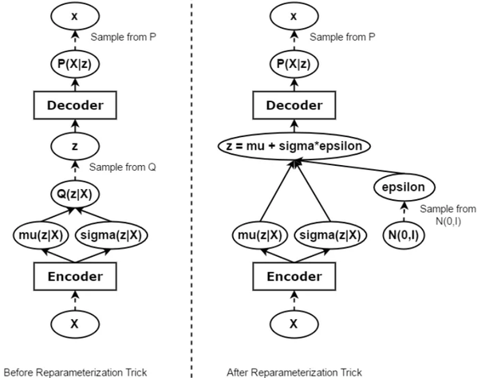

왼쪽(Before)에서는 Encoder 가 낸 mu(z|X), sigma(z|X) 로 분포 Q(z|X) 를 만들고 거기서 z 를 sampling 하므로, Decoder 에서 돌아온 gradient 가 sampling 노드에서 끊긴다. 오른쪽(After)에서는 N(0, I) 에서 sampling 한 epsilon 이 그래프의 잎(leaf) 노드가 되고, z = mu + sigma*epsilon 은 보통의 산술 연산이므로 gradient 가 mu 와 sigma 를 거쳐 Encoder 까지 흘러간다. 우연성은 epsilon 한 곳에만 남는다.

> 참고:
> https://hulk89.github.io/machine%20learning/2017/11/20/reparametrization-trick/
> https://blog.evjang.com/2016/11/tutorial-categorical-variational.html

---

## 6.3.4 Cost function — Reconstruction error 와 Latent variable regularization
<!-- 슬라이드 564~565 -->

### ELBO 의 부호 반전

ELBO 는 클수록 좋은 값이지만 optimizer 는 loss 를 **최소화**하므로 ELBO 의 부호를 반전하여 cost function 으로 쓴다. 그러면 Total loss 는 **Reconstruction loss + Latent variable loss** 의 두 항이 된다.

$$\mathcal{L}(x^i, \theta, \phi) = -E_{z \sim q_\phi(z|x_i)}\left[\log p(x_i | p_\theta(z))\right] + D_{KL}\left(q_\phi(z|x_i)\,\|\,P(z)\right)$$

각 항이 어느 네트워크를 학습시키는지 정리하면 다음과 같다.

| 항 | 이름 | 주로 학습되는 네트워크 | 뜻 |
|---|---|---|---|
| $-E_{z \sim q_\phi(z \mid x_i)}[\log p(x_i \mid p_\theta(z))]$ | Reconstruction Error | Decoder Network | $z$ 로부터 decoding 된 image 의 error. $z$ 는 encoding 결과 |
| $D_{KL}(q_\phi(z \mid x_i)\,\Vert\,P(z))$ | Latent variable Regularization | Encoder Network | 근사 분포를 prior $P(z)$ 쪽으로 제어 |

### Reconstruction Error term

첫째 항은 $z$ 로부터 decoding 된 image 의 error 이며, $z$ 는 encoding 의 결과다. Decoder 가 pixel 을 Bernoulli 분포로 모델링하므로 이 항은 **binary cross entropy** 형태로 유도된다. Decoder 출력을 $y_i$ (pixel $i$ 가 켜질 확률), pixel 수를 $D$ 라 하면

$$\log p(\mathbf{x}|\mathbf{z}) = \sum_{i=1}^{D} x_i \log y_i + (1 - x_i)\cdot\log(1 - y_i)$$

이다. Cross entropy 에는 원래 (−) 부호가 붙어 있어 **작을수록** 좋고, 위 식의 ELBO 는 **클수록** 좋다. 그래서 cost function 으로 쓸 때 '−' 부호를 추가한다.

### Latent Variable Regularization term

둘째 항은 KL divergence 다. 보충으로 $D_{KL}$ 을 적어 두면, 두 분포가 모두 정규분포일 때 적분이 다음의 닫힌 식으로 정리된다.

$$-D_{KL}\left(q_\phi(\mathbf{z})\,\|\,p_\theta(\mathbf{z})\right) = \int q_\theta(\mathbf{z})\left(\log p_\theta(\mathbf{z}) - \log q_\theta(\mathbf{z})\right)d\mathbf{z} = \frac{1}{2}\sum_{j=1}^{J}\left(1 + \log((\sigma_j)^2) - (\mu_j)^2 - (\sigma_j)^2\right)$$

여기서 $J$ 는 잠재 변수의 차원이고 $\mu_j$, $\sigma_j$ 는 Encoder 가 낸 $j$ 번째 차원의 모수다.

VAE 는 $P(z)$ 를 **표준정규분포**로 설정하여 $q_\theta$ 의 분포를 제어한다. 그러면 Latent Variable Regularization term 은 Encoder 가 낸 정규분포 $N(\mu_q, \sigma_q^2)$ 와 $N(0, 1)$ 사이의 KL 이 된다.

$$D_{KL}\left(q_\theta(z|x_i)\,\|\,P(z)\right) = D_{KL}\left(N(\mu_q, \sigma_q^2)\,\|\,N(0, 1)\right)$$

$$= \sum_i -\log\sigma_q + \frac{1}{2}\left(\sigma_q^2 + \mu_q^2 - 1\right)$$

$$= -\frac{1}{2}\sum_i\left(1 + \log\sigma_{q_i}^2 - \sigma_{q_i}^2 - \mu_{q_i}^2\right)$$

이 값은 $\mu_q = 0$, $\sigma_q = 1$ 일 때 0 으로 가장 작다. 즉 이 항은 Encoder 가 내놓는 분포의 중심을 원점으로, 퍼짐을 1 로 끌어당긴다. 적분이 사라지고 $\mu$ 와 $\sigma$ 의 사칙연산과 로그만 남기 때문에, 코드에서는 이 식을 그대로 옮겨 적으면 된다.

### Total Loss

두 항을 합친 Total Loss 는 다음과 같다.

$$\mathcal{L}(x^i, \theta, \phi) = -\sum_{j=1}^{D}\left[x_j \log x_j' + (1 - x_j)\log(1 - x_j')\right] - \frac{1}{2}\sum_i\left(1 + \log\sigma_{q_i}^2 - \sigma_{q_i}^2 - \mu_{q_i}^2\right)$$

$$= \mathrm{BiCE}(x, x') + D_{KL}(q\,\|\,P)$$

$x'$ 는 Decoder 가 복원한 이미지이고 $\mathrm{BiCE}$ 는 binary cross entropy 다. 첫째 합은 pixel $D$ 개에 대해, 둘째 합은 잠재 변수의 차원에 대해 더한다.

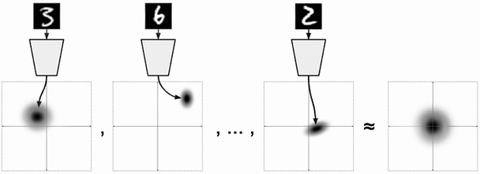

그림은 regularization 항이 하는 일을 보여 준다. 숫자 3, 6, 2 각각은 잠재 공간의 서로 다른 위치에 작은 정규분포로 놓이지만, 모든 데이터의 분포를 합치면 원점 중심의 표준정규분포에 가까워진다. 그래서 생성 단계에서 $N(0, I)$ 에서 아무 $z$ 나 뽑아도 Decoder 가 의미 있는 이미지를 만들 수 있다.

> **핵심 메시지**
> Total loss = Reconstruction loss(binary cross entropy) + Latent variable loss(KL divergence). 앞 항은 $z$ 에서 $x$ 가 잘 복원되게 하고, 뒤 항은 $q(z|x)$ 를 표준정규분포 쪽으로 당긴다.

---

## 6.3.5 VAE 의 성능 — 잠재 변수를 바꾸어 이미지 생성하기
<!-- 슬라이드 566 -->

VAE 의 목적을 다시 확인한다. Dataset 의 특징을 대표하는 좋은 Latent Variable 을 찾고, 그 Latent Variable 을 control 하여 원하는 Dataset 을 생성하는 모델이다. 그러므로 VAE 의 **성능**은 두 가지로 확인한다.

- Latent Variable 을 조정하여 **다양한 image 를 생성**할 수 있는가.
- 각 Variable 이 데이터의 **특징을 대표**하는가 — 한 변수를 바꾸면 한 가지 특징이 일관되게 변하는가.

학습이 끝나면 추론 단계에서는 Encoder 없이 Decoder 만 쓴다. 잠재 변수 $z$ 를 입력으로 주면 출력 $y$ 가 나온다.

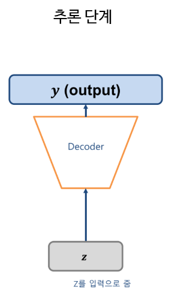

잠재 변수를 격자 모양으로 바꾸어 가며 Decoder 에 넣으면, 잠재 공간의 각 방향이 어떤 특징을 담고 있는지 눈으로 볼 수 있다.

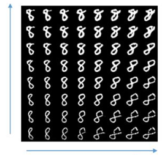

위 그림은 숫자 8 을 두 잠재 변수로 훑은 결과다. 세로 방향으로는 획이 굵은 8 에서 가는 8 로, 가로 방향으로는 기울기가 서서히 바뀐다. 이웃한 칸의 이미지가 부드럽게 이어지는 것이 잠재 공간이 연속적으로 잘 형성되었다는 뜻이다.

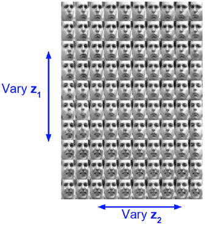

얼굴 데이터에서도 같다. 세로 방향으로 $z_1$ 을 바꾸면(Vary $z_1$) 얼굴의 한 가지 특징이, 가로 방향으로 $z_2$ 를 바꾸면(Vary $z_2$) 다른 특징이 연속적으로 변한다. 잠재 변수 하나가 특징 하나를 대표하고 있다면 이렇게 축 방향으로 일관된 변화가 나타난다.

---

## 6.3.6 실습 6.3.1 — Variational Autoencoder (VAE) : 데이터와 Sampling 함수
<!-- 슬라이드 567 -->

> 노트북: `code/6.3.1.VAE.ipynb`
> [](https://colab.research.google.com/github/AI-BoostCamp/intermediate-deep-learning-pytorch/blob/main/code/6.3.1.VAE.ipynb)

MNIST 데이터를 사용하는 VAE 모델을 만든다. **Latent dim = 2** 로 두어, MNIST 손글씨를 대표하는 좋은 latent variable 두 개를 찾는 것이 목표다. 잠재 변수가 2차원이면 잠재 공간을 평면에 그대로 그릴 수 있어서, 학습 결과를 아래 그림처럼 격자로 훑어 볼 수 있다.

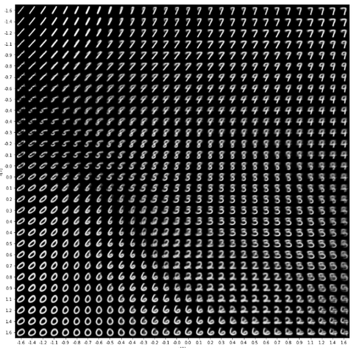

이 절의 실습은 다음 순서로 진행한다.

1. MNIST Dataset 과 DataLoader 준비
2. Reparameterization trick 을 구현한 **Sampling** 모듈
3. **Encoder** — 정규분포의 모수(mean, log variance)를 출력
4. **Decoder** — ConvTranspose2d 로 $z$ 를 이미지로 복원
5. **VAE** Lightning 모델 — loss function 과 `training_step()`
6. 학습 결과의 시각화 — 잠재 영역이 함의한 특징의 이미지화, label 별 군집

### Dataset

MNIST 는 torchvision 에서 받는다. `v2.ToImage()` 와 `v2.ToDtype(torch.float32, scale=True)` 로 pixel 값을 0 과 1 사이의 실수로 바꾼다. Decoder 가 pixel 을 Bernoulli 확률로 다루므로 입력도 0 과 1 사이의 값이어야 binary cross entropy 를 쓸 수 있다.

```python
from torchvision.datasets import FashionMNIST, MNIST
from torch.utils.data import ConcatDataset

transform = v2.Compose([
    v2.ToImage(),
    v2.ToDtype(torch.float32, scale=True)])

# download path 정의
download_root = './MNIST_DATASET'
train_dataset = MNIST(download_root, transform=transform, train=True, download=True)
test_dataset = MNIST(download_root, transform=transform, train=False, download=True)

mnist_digits = ConcatDataset([train_dataset, test_dataset])
mnist_digits_loader = DataLoader(mnist_digits, batch_size=512, shuffle=True, num_workers=8)
```

VAE 는 label 을 쓰지 않는 비지도 학습이므로 train 과 test 를 `ConcatDataset` 으로 합쳐 하나의 학습 데이터로 쓴다. `mnist_digits[0][0].shape` 는 `(1, 28, 28)` 이다. label 은 나중에 잠재 공간의 군집을 색으로 표시할 때만 쓴다.

### Sampling 함수

Encoder 는 $q$(정규분포)의 모수인 Mean 과 Variance 를 찾고, 그 Mean 과 Variance 를 가지고 $z$ 를 샘플링한다. 샘플링에는 Reparameterization trick 을 사용한다.

$$z^i \sim N(\mu_i, \sigma_i^2 I) \;\Rightarrow\; z^i = \mu_i + \sigma_i \odot \epsilon, \qquad \epsilon \sim N(0, I)$$

```python
## z_mean, z_log_var 로부터 샘플링하여 잠재변수 z를 얻는 것
# Reparameterization trick for back-propagation
class Sampling(nn.Module):
    def forward(self, z_mean, z_log_var):
        batch = z_mean.shape[0]
        dim = z_mean.shape[1]
        z_std = torch.exp(z_log_var * 0.5)
        q = torch.normal(0, 1,size=(batch,dim)).to(device)
        return z_mean + z_std * q  #(bs,2)
```

코드를 식과 대응시켜 읽는다.

- Encoder 는 분산 $\sigma^2$ 대신 **log 분산** `z_log_var` 를 출력한다. 분산은 항상 양수여야 하는데 Linear 층의 출력은 부호 제한이 없으므로, log 값을 예측하게 하고 `exp` 로 되돌리면 자연스럽게 양수가 된다. `torch.exp(z_log_var * 0.5)` 는 $\exp(\frac{1}{2}\log\sigma^2) = \sigma$, 즉 표준편차다.
- `q = torch.normal(0, 1, size=(batch, dim))` 이 $\epsilon \sim N(0, I)$ 이다. batch 안의 샘플마다, 잠재 차원마다 독립적으로 뽑는다.
- `z_mean + z_std * q` 가 $\mu + \sigma \odot \epsilon$ 이다. 반환값의 shape 는 `(bs, 2)` 다.

`Sampling` 에는 학습 파라미터가 없다. 우연성은 `q` 에만 있고 나머지는 모두 미분 가능한 연산이므로 gradient 가 `z_mean` 과 `z_log_var` 를 거쳐 Encoder 로 전달된다.

---

## 6.3.7 Encoder 와 Decoder
<!-- 슬라이드 568~569 -->

### Encoder

우리가 진짜 원하는 것은 Decoder 가 잘 복원할 수 있는 $z$ 를 샘플링할 수 있는 **최적의 $p(z|x)$** 다. 그러나 정답 $p(z|x)$ 는 구할 수 없으므로 **정규분포 $q(z|x)$ 로 근사**한다 — 이것이 Variational Inference 다. 정규분포는 평균과 분산으로 정해지므로 Encoder 의 출력은 다음 두 벡터다.

- `z_mean` — latent_dim 개의 평균
- `z_log_var` — latent_dim 개의 log 분산

즉 z = [z_mean, z_log_var] x 2(latent_dim) 으로, Encoder 는 잠재 변수 하나마다 모수 두 개를 내놓는다.

```python
# Encoder model
latent_dim = 2
class Encoder(nn.Module):
    def __init__(self):
        super(Encoder, self).__init__()
        self.encoder = nn.Sequential(
            nn.Conv2d(1, 32, 3, padding=1, stride=2),
            nn.ReLU(),
            nn.Conv2d(32, 64, 3, padding=1, stride=2),
            nn.ReLU(),
            nn.Flatten(),
            nn.Linear(7*7*64, 16),
            nn.ReLU())
        self.z_mean = nn.Linear(16, latent_dim)
        self.z_log_var = nn.Linear(16, latent_dim)
        self.sampling = Sampling()
    def forward(self, x):
        encoded = self.encoder(x)
        z_mean = self.z_mean(encoded)
        z_log_var = self.z_log_var(encoded)
        z = self.sampling(z_mean, z_log_var)
        return z_mean, z_log_var, z

encoder = Encoder()
summary(encoder, input_size=(8, 1, 28, 28))
```

구조를 따라가면 다음과 같다.

- `Conv2d(1, 32, 3, padding=1, stride=2)` 가 28 x 28 을 14 x 14 로, 두 번째 `Conv2d(32, 64, 3, padding=1, stride=2)` 가 7 x 7 로 줄인다. stride 2 로 크기를 반씩 줄이면서 채널을 32, 64 로 늘린다.
- `Flatten()` 으로 7 x 7 x 64 = 3136 차원 벡터를 만들고 `Linear(3136, 16)` 으로 16 차원까지 압축한다.
- 이 16 차원 벡터에서 **두 개의 Linear 층**이 각각 `z_mean` 과 `z_log_var` 를 낸다. 같은 입력에서 갈라져 나온 두 head 다.
- `Sampling` 이 두 모수로 `z` 를 뽑는다. `forward()` 는 `z_mean`, `z_log_var`, `z` 세 가지를 모두 반환한다. loss 계산에 `z_mean` 과 `z_log_var` 가 필요하기 때문이다.

`summary(encoder, input_size=(8, 1, 28, 28))` 로 batch 8 의 더미 입력을 넣어 각 층의 출력 shape 를 확인한다.

| Layer (type:depth-idx) | Output Shape |
|---|---|
| Encoder | [8, 2] |
| ├─ Sequential: 1-1 | [8, 16] |
| │  └─ Conv2d: 2-1 | [8, 32, 14, 14] |
| │  └─ ReLU: 2-2 | [8, 32, 14, 14] |
| │  └─ Conv2d: 2-3 | [8, 64, 7, 7] |
| │  └─ ReLU: 2-4 | [8, 64, 7, 7] |
| │  └─ Flatten: 2-5 | [8, 3136] |
| │  └─ Linear: 2-6 | [8, 16] |
| │  └─ ReLU: 2-7 | [8, 16] |
| ├─ Linear: 1-2 | [8, 2] |
| ├─ Linear: 1-3 | [8, 2] |
| ├─ Sampling: 1-4 | [8, 2] |

`Linear: 1-2` 와 `Linear: 1-3` 이 `z_mean`, `z_log_var` 이고 둘 다 `[8, 2]`, 즉 batch 8 x latent_dim 2 다. `Sampling: 1-4` 의 출력도 `[8, 2]` 다.

### Decoder

Decoder 는 샘플링된 $z$ 를 decoding 하여 새로운 image $X'$ 을 출력한다. Encoder 가 Conv2d 로 크기를 줄였으므로 Decoder 는 반대로 크기를 키워야 하는데, 여기에 **ConvTranspose2d** 를 쓴다.

ConvTranspose2d 는 **Upsampling(insert zero) + Conv2d** 와 같다. 입력 pixel 사이에 0 을 끼워 넣어 크기를 키운 다음 보통의 convolution 을 하는 것이다. 출력 크기는 다음 식으로 정해진다.

$$H_{out} = (H_{in} - 1) * \text{stride} - 2 * \text{padding} + (\text{kernel\_size} - 1) + \text{output\_padding} + 1$$

이 실습의 첫 ConvTranspose2d(kernel 3, stride 2, padding 1, output_padding 1)에 $H_{in} = 7$ 을 넣으면

$$14 = (7 - 1) * 2 - 2 * 1 + (3 - 1) + 1 + 1$$

이 되어 7 x 7 이 14 x 14 로 커진다. `output_padding=1` 이 없으면 13 이 되어 정확히 두 배가 되지 않으므로, stride 2 로 크기를 딱 두 배로 만들 때 흔히 붙인다.

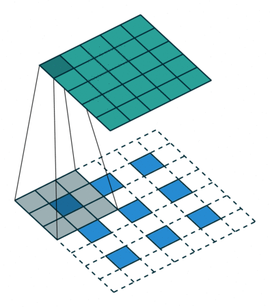

```python
# Decoder model
class Decoder(nn.Module):
    def __init__(self):
        super(Decoder, self).__init__()
        self.decoder = nn.Sequential(
            nn.Linear(latent_dim, 7*7*64),
            nn.Unflatten(1, (64, 7, 7)),
            nn.ConvTranspose2d(64, 64, 3,
                      stride=2, padding=1, output_padding=1),
            nn.ReLU(),
            nn.ConvTranspose2d(64, 32, 3,
                      stride=2, padding=1, output_padding=1),
            nn.ConvTranspose2d(32, 1, 3, padding=1),
            nn.Sigmoid())
    def forward(self, x):
        decoded = self.decoder(x)
        return decoded

decoder = Decoder()
summary(decoder, input_size=(8, latent_dim))
```

Decoder 는 Encoder 를 거울처럼 뒤집은 구조다.

- `Linear(latent_dim, 7*7*64)` 로 2 차원 $z$ 를 3136 차원으로 펼치고, `Unflatten(1, (64, 7, 7))` 로 Encoder 의 마지막 feature map 과 같은 64 x 7 x 7 모양으로 되돌린다.
- `ConvTranspose2d(64, 64, 3, stride=2, padding=1, output_padding=1)` 로 7 → 14, 다음 `ConvTranspose2d(64, 32, ...)` 로 14 → 28 로 키운다.
- 마지막 `ConvTranspose2d(32, 1, 3, padding=1)` 은 stride 1 이라 크기는 28 그대로 두고 채널만 1 로 줄인다.
- `Sigmoid()` 가 출력을 0 과 1 사이로 만든다. 이것이 Bernoulli Decoder 의 pixel 확률 $p_i$ 이며, 뒤의 binary cross entropy 가 이 값을 받는다.

| Layer (type:depth-idx) | Output Shape |
|---|---|
| Decoder | [8, 1, 28, 28] |
| ├─ Sequential: 1-1 | [8, 1, 28, 28] |
| │  └─ Linear: 2-1 | [8, 3136] |
| │  └─ Unflatten: 2-2 | [8, 64, 7, 7] |
| │  └─ ConvTranspose2d: 2-3 | [8, 64, 14, 14] |
| │  └─ ReLU: 2-4 | [8, 64, 14, 14] |
| │  └─ ConvTranspose2d: 2-5 | [8, 32, 28, 28] |
| │  └─ ConvTranspose2d: 2-6 | [8, 1, 28, 28] |
| │  └─ Sigmoid: 2-7 | [8, 1, 28, 28] |

summary 에서 `[8, 64, 7, 7]` → `[8, 64, 14, 14]` → `[8, 32, 28, 28]` 로 커지는 것을 확인한다. 입력 `[8, 2]` 가 `[8, 1, 28, 28]` 이미지로 돌아왔다.

---

## 6.3.8 VAE 모델 · Loss function · 학습
<!-- 슬라이드 570~571 -->

### VAE model

Encoder 와 Decoder 를 하나의 `LightningModule` 로 묶는다. `forward()` 는 Encoder 의 세 출력과 Decoder 의 복원 결과를 모두 돌려주고, loss 는 `training_step()` 에서 계산한다.

```python
kl_loss_weight = 1 ###

class VAE(L.LightningModule):
    def __init__(self, encoder, decoder, **kwargs):
        super(VAE, self).__init__(**kwargs)
        self.encoder = encoder
        self.decoder = decoder
    def forward(self, x):
        z_mean, z_log_var, z = self.encoder(x)
        reconstruction = self.decoder(z)
        return z_mean, z_log_var, z, reconstruction

    def training_step(self, batch, batch_idx):
        x, y = batch
        z_mean, z_log_var, z, reconstruction = self(x)
        recon_loss = nn.BCELoss()(reconstruction, x)
        kl_loss = 1 + z_log_var - z_mean**2 - torch.exp(z_log_var)
        kl_loss = torch.mean(kl_loss)
        kl_loss *= -0.5
        total_loss = recon_loss*28*28 + kl_loss * kl_loss_weight
        metrics={'loss':total_loss, 'recon_loss':recon_loss, 'kl_loss':kl_loss}
        self.log_dict(metrics, prog_bar=True)
        if batch_idx==0 :
          print(f'ReconLoss:{recon_loss:.3f} KLLoss:{kl_loss:.3f}')
        return total_loss

    def configure_optimizers(self):
        return torch.optim.Adam(self.parameters(), weight_decay=0.001)

vae = VAE(encoder, decoder)
summary(vae, input_size=(8, 1, 28, 28))
```

`summary(vae, input_size=(8, 1, 28, 28))` 는 Encoder 와 Decoder 의 층이 그대로 이어져 있음을 보여 준다.

| Layer (type:depth-idx) | Output Shape |
|---|---|
| VAE | [8, 2] |
| ├─ Encoder: 1-1 | [8, 2] |
| │  └─ Sequential: 2-1 | [8, 16] |
| │     └─ Conv2d: 3-1 | [8, 32, 14, 14] |
| │     └─ ReLU: 3-2 | [8, 32, 14, 14] |
| │     └─ Conv2d: 3-3 | [8, 64, 7, 7] |
| │     └─ ReLU: 3-4 | [8, 64, 7, 7] |
| │     └─ Flatten: 3-5 | [8, 3136] |
| │     └─ Linear: 3-6 | [8, 16] |
| │     └─ ReLU: 3-7 | [8, 16] |
| │  └─ Linear: 2-2 | [8, 2] |
| │  └─ Linear: 2-3 | [8, 2] |
| │  └─ Sampling: 2-4 | [8, 2] |
| ├─ Decoder: 1-2 | [8, 1, 28, 28] |
| │  └─ Sequential: 2-5 | [8, 1, 28, 28] |
| │     └─ Linear: 3-8 | [8, 3136] |
| │     └─ Unflatten: 3-9 | [8, 64, 7, 7] |
| │     └─ ConvTranspose2d: 3-10 | [8, 64, 14, 14] |
| │     └─ ReLU: 3-11 | [8, 64, 14, 14] |
| │     └─ ConvTranspose2d: 3-12 | [8, 32, 28, 28] |
| │     └─ ConvTranspose2d: 3-13 | [8, 1, 28, 28] |
| │     └─ Sigmoid: 3-14 | [8, 1, 28, 28] |

### Loss function 과 training_step()

두 확률분포 $q(z|x)$ 와 $p(z|x)$ 의 $D_{KL}$ 값을 최소화하기 위해 **ELBO 를 최대로 하는 것**으로 학습한다. ELBO 는 두 항으로 이루어진다.

$$\mathrm{ELBO} = \text{Reconstruction\_error} - \text{KL\_divergence}$$

Reconstruction error 와 KL divergence 를 코드에 맞게 다시 정리한다.

**Reconstruction error** — `nn.BCELoss()(reconstruction, x)` 는 Decoder 출력 $x'$ 와 입력 $x$ 사이의 binary cross entropy $-[x_i \log x_i' + (1 - x_i)\log(1 - x_i')]$ 를 모든 pixel 에 대해 **평균**낸 값이다. 두 항의 뜻은 다음과 같다.

- $x_i \log x_i'$ — **1(켜져야 하는 pixel 을 만들 확률)에 대한 Cross entropy.** 입력이 1 인 pixel 에서 Decoder 가 1 에 가까운 확률을 내면 작아진다.
- $(1 - x_i)\log(1 - x_i')$ — **0(오지 않을 것은 만들지 않을 확률)에 대한 Cross entropy.** 입력이 0 인 pixel 에서 Decoder 가 0 에 가까운 확률을 내면 작아진다.

6.3.4 의 식은 pixel $D$ 개에 대한 **합**이므로, 평균인 `BCELoss` 에 `28*28` 을 곱해 원래 크기로 되돌린다(`recon_loss*28*28`).

**KL divergence** — `1 + z_log_var - z_mean**2 - torch.exp(z_log_var)` 는 $1 + \log\sigma^2 - \mu^2 - \sigma^2$ 이다. `z_log_var` 가 $\log\sigma^2$ 이므로 `torch.exp(z_log_var)` 가 $\sigma^2$ 다. 이것을 `torch.mean` 으로 평균낸 뒤 `-0.5` 를 곱하면 6.3.4 의

$$D_{KL} = -\frac{1}{2}\sum_i\left(1 + \log\sigma_{q_i}^2 - \sigma_{q_i}^2 - \mu_{q_i}^2\right)$$

과 같은 꼴이 된다(합 대신 평균).

**Total loss** — `recon_loss*28*28 + kl_loss * kl_loss_weight`. ELBO 의 부호를 반전한 것이므로 두 항을 **더한다.** `kl_loss_weight` 는 두 항의 균형을 조절하는 계수로, 값을 키우면 잠재 분포를 표준정규분포에 더 강하게 맞추고 줄이면 복원 정확도를 더 중시한다. 노트북의 기본값은 1 이다.

`training_step()` 은 `loss`, `recon_loss`, `kl_loss` 세 값을 `log_dict` 로 기록하고 `total_loss` 를 반환한다. `batch_idx == 0` 일 때 두 loss 를 출력하게 해 두어 epoch 마다 두 항의 크기를 눈으로 확인할 수 있다. optimizer 는 `weight_decay=0.001` 을 준 Adam 이다.

### 학습

```python
encoder = Encoder()
decoder = Decoder()
vae = VAE(encoder, decoder)

logger = CSVLogger("logs", name="vae")
trainer = Trainer(max_epochs=50, logger=logger, accelerator='auto',
                  limit_train_batches=0.5,limit_val_batches=0.5)
trainer.fit(vae, mnist_digits_loader)
```

Encoder 와 Decoder 를 새로 만들어 VAE 에 넣고 50 epoch 학습한다. `limit_train_batches=0.5` 는 epoch 마다 DataLoader 의 batch 절반만 쓰라는 뜻이다. `CSVLogger` 가 `log_dict` 로 기록한 값을 `logs/vae/version_N/metrics.csv` 에 남기므로, 학습이 끝난 뒤 이 파일을 읽어 loss 곡선을 그린다.

```python
v_num = logger.version
history = pd.read_csv(f'./logs/vae/version_{v_num}/metrics.csv')
df = history.groupby('epoch').last().drop('step', axis=1)

plt.title(f"VAE Loss(kl_loss_weight:{kl_loss_weight})")
plt.plot(df['loss']/10000,label='loss/10000')
plt.plot(df['recon_loss']/10,label='ReconstructionLoss/10')
plt.plot(df['kl_loss']/100,label='KL_Loss/100')
plt.legend()
plt.grid()
```

세 값의 크기가 서로 다르므로 각각 10000, 10, 100 으로 나누어 한 그래프에 그린다.

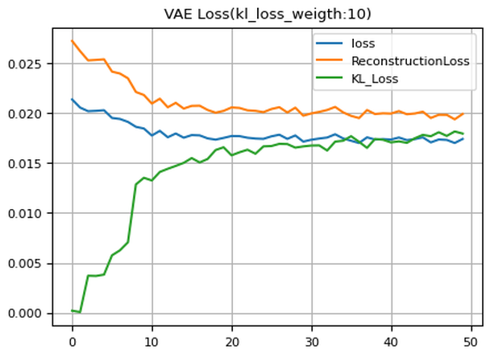

그림은 `kl_loss_weight` 를 10 으로 두고 학습한 결과다. Reconstruction loss 는 학습 초반에 빠르게 내려간 뒤 완만해지고, KL loss 는 0 근처에서 출발해 점점 커지다가 안정된다. 학습 초기에는 Encoder 가 아직 분포를 넓게 쓰지 않아 KL 이 작지만, 복원을 잘 하려고 잠재 공간을 넓혀 가면서 KL 이 커지고, 두 항이 균형을 찾는 곳에서 total loss 가 멈춘다.

---

## 6.3.9 잠재 영역의 시각화
<!-- 슬라이드 572~574 -->

### 잠재 영역이 함의한 특징 이미지화

학습 결과를 이미지로 출력한다. 잠재 영역이 함의한 특징을 이미지화하는 것으로, **Grid 좌표를 z 값으로 decoder 에 넣어** 결과를 표시한다. 학습한 결과 z 공간이 어떻게 형성(mapping)되었는지, 그 위치가 어떤 특징을 갖는지 확인하는 것이다.

Grid 간격은 균등하게 두지 않고 조정한다. 잠재 분포를 표준정규분포에 맞추었으므로 **중앙에 정보가 집중**되어 있다. 그래서 중앙은 촘촘하게, 외곽 부분은 간격을 늘려서 훑는다. 이때 쓰는 것이 **PPF(percent point function)로, CDF 의 역함수**다. 0.05 부터 0.95 까지 균등한 확률 값을 `norm.ppf` 에 넣으면, 확률이 같은 간격일 때의 z 값이 나오므로 중앙은 촘촘하고 양 끝은 성긴 격자가 된다.

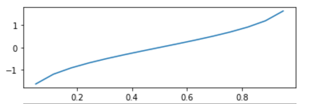

```python
from scipy.stats import norm

batch_size = 1
n = 50
figsize = 8

figure = np.zeros((28 * n, 28 * n))
grid_x = norm.ppf(np.linspace(0.05, 0.95, n))
grid_y = norm.ppf(np.linspace(0.05, 0.95, n))
vae.eval()
with torch.no_grad():
  for i, xi in enumerate(grid_x):
    for j, yi in enumerate(grid_y):
      z_sample = np.array([[xi, yi]])

      # 그리드 좌표값으로 추론
      x_decoded = vae.decoder.to(device)(torch.Tensor(z_sample).to(device))
      x_decoded = x_decoded.cpu().detach().numpy()
      digit = x_decoded[0].reshape(28, 28)

      figure[i * 28: (i + 1) * 28,
            j * 28: (j + 1) * 28] = digit

plt.figure(figsize=(figsize, figsize))
start_range = 28 // 2
end_range = n * 28 + start_range # + 1
pixel_range = np.arange(start_range, end_range, 28)
sample_range_x = np.round(grid_x, 1)
sample_range_y = np.round(grid_y, 1)
plt.xticks(pixel_range, sample_range_x)
plt.yticks(pixel_range, sample_range_y)
plt.xlabel("z[0]")
plt.ylabel("z[1]")
plt.imshow(figure, cmap="Greys_r")
plt.show()
```

코드의 흐름은 다음과 같다.

- `n = 50` 이면 한 변에 50 칸, 모두 2500 개의 $z$ 를 만든다. `figure` 는 28 x 50 크기의 빈 캔버스다.
- `grid_x`, `grid_y` 가 ppf 로 만든 격자 좌표다. 두 좌표의 조합 `[xi, yi]` 하나가 잠재 벡터 `z_sample` 하나다.
- `vae.eval()` 과 `torch.no_grad()` 로 추론 모드에 두고, **Decoder 만** 호출한다(`vae.decoder(...)`). Encoder 는 쓰지 않는다.
- 복원된 `x_decoded[0]` 을 28 x 28 로 reshape 하여 캔버스의 `(i, j)` 칸에 붙여 넣는다.
- 눈금은 pixel 위치(`pixel_range`)에 격자의 실제 $z$ 값(`sample_range_x`)을 붙여, 어느 칸이 어느 $z$ 에서 나왔는지 읽을 수 있게 한다.


이 그림이 "잠재 영역이 함의한 특징"이다. 잠재 공간의 어느 위치가 어떤 숫자를 만들어 내는지, 그리고 이웃한 위치끼리 숫자가 어떻게 이어지는지 한눈에 보인다. 두 숫자의 경계 부근에는 두 숫자를 섞은 듯한 이미지가 나타난다.

### 잠재 영역의 군집화된 모습 시각화

이번에는 반대 방향이다. 데이터를 **encoding 한 결과(z 공간의 좌표)를 label 로 표시**하여, 잠재 영역에 mapping 된 label 의 군집화된 모습을 본다. Encoder 가 z 공간에 데이터를 어떻게 mapping 시키는지를 시각화하는 것이다.

```python
def plot_label_clusters(encoder, trainDataloader):
# display a 2D plot of the digit classes in the latent space
    z_means = []
    labels = []
    for data, label in trainDataloader:
        # (60000,(z0,z1)) <- (60000,1,28,28)
        z_mean, _, _ = encoder.to(device)(torch.Tensor(data).to(device))
        z_means.append(z_mean.cpu().detach().numpy())
        labels.append(label)
    z_means = np.concatenate(z_means)
    labels = np.concatenate(labels)
    # z_mean.shape:(60000,2)
    plt.figure(figsize=(8, 6))
    plt.title(f"VAE labels(kl_loss_weight:{kl_loss_weight})")
    plt.scatter(z_means[:, 0], z_means[:, 1], c=labels,s=1) # z[0],z[1]
    plt.colorbar()
    plt.xlabel("z[0]")
    plt.ylabel("z[1]")
    plt.grid()
    plt.show()

trainDataloader = DataLoader(train_dataset, shuffle=False, batch_size=512)
plot_label_clusters(encoder, trainDataloader)
```

- 이번에는 **Encoder 만** 쓴다. train 데이터 60,000 장을 batch 512 로 넣어 `z_mean` 만 모은다. `z_log_var` 와 `z` 는 버린다(`_`).
- 모은 `z_means` 의 shape 는 `(60000, 2)` 다. 첫 열을 x, 둘째 열을 y 로 하여 산점도를 그리고 색(`c=labels`)으로 숫자 label 을 표시한다.
- `shuffle=False` 로 두어 데이터와 label 의 순서가 어긋나지 않게 한다.

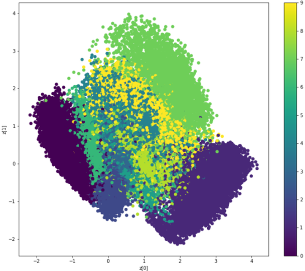

같은 숫자는 잠재 공간의 비슷한 위치로 모이고, 모양이 비슷한 숫자끼리는 영역이 겹친다. label 을 전혀 주지 않았는데도 Encoder 가 숫자별 군집을 만들어 낸 것이다.

### 두 그림을 함께 보기

잠재 영역이 함의한 특징의 이미지화와, 잠재 영역에 mapping 된 label 의 군집화된 모습을 나란히 놓고 본다.

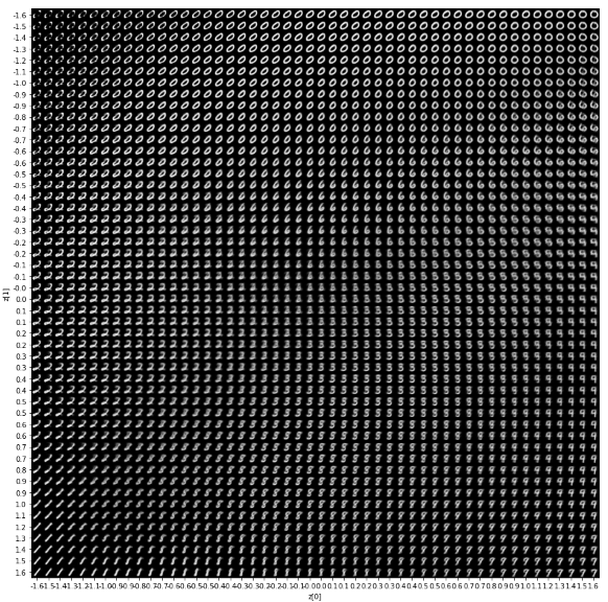

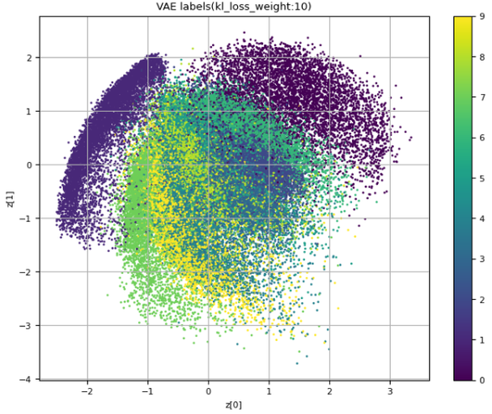

두 그림은 같은 잠재 공간을 두 방향에서 본 것이다. 산점도에서 어떤 label 이 모여 있는 위치를 격자 그림에서 찾으면 그 숫자가 생성되고 있다. 군집이 겹치는 곳은 격자 그림에서 두 숫자가 섞인 이미지가 나오는 곳이다. 산점도 쪽 그림은 `kl_loss_weight` 를 10 으로 둔 결과로, 군집 전체가 원점 주위에 둥글게 모여 있다 — KL 항이 잠재 분포를 표준정규분포에 가깝게 끌어당긴 효과다.

---

## 6.3.10 fixed mapping 과 distributed mapping
<!-- 슬라이드 575 -->

Auto Encoder 는 입력 하나를 잠재 공간의 **한 점**으로 보낸다(fixed mapping). VAE 는 입력 하나를 **분포**로 보내고 거기서 sampling 한다(distributed mapping). 이 차이를 시각화해 본다. 같은 숫자 4 의 이미지들에 대해 Encoder 가 낸 `z_mean` 과, 그로부터 샘플링된 `z` 를 나란히 그린다.

```python
def z_plot_label_clusters(encoder, trainDataloader):
# display a 2D plot of the digit classes in the latent space
    z_means = []
    labels = []
    z_s = []
    for data, label in trainDataloader:
        if label != 4 : continue
        # (60000,(z0,z1)) <- (60000,1,28,28)
        for i in range(10):
            z_mean, z_log_var, z = encoder.to(device)(torch.Tensor(data).to(device))
            z_means.append(z_mean.cpu().detach().numpy())
            labels.append(label)
            z_s.append(z.cpu().detach().numpy())
    z_means = np.concatenate(z_means)
    labels = np.concatenate(labels)
    z_s = np.concatenate(z_s)

    plt.figure(figsize=(12, 6))
    plt.subplot(121)

    plt.title(f"z_means")
    plt.scatter(z_means[:, 0], z_means[:, 1], c=labels,s=1) # z[0],z[1]
    plt.ylim(-1,1)
    plt.xlim(-1,1)
    plt.grid()

    plt.subplot(122)
    plt.title(f"sampled z")
    plt.scatter(z_s[:, 0], z_s[:, 1], c=labels, s=1) # z[0],z[1]
    plt.ylim(-1,1)
    plt.xlim(-1,1)
    plt.grid()
    plt.show()

trainDataloader = DataLoader(train_dataset, shuffle=False, batch_size=1)
z_plot_label_clusters(encoder, trainDataloader)
```

- `batch_size=1` 로 한 장씩 꺼내며 `label != 4` 인 것은 건너뛴다.
- 같은 이미지를 Encoder 에 **10 번** 넣는다. `z_mean` 은 매번 같지만, `Sampling` 이 매번 새 $\epsilon$ 을 뽑으므로 `z` 는 10 번 모두 다르다.
- 왼쪽 subplot 은 `z_mean`(fixed mapping), 오른쪽은 샘플링된 `z`(distributed mapping)이다. 두 그림 모두 $[-1, 1]$ 범위만 잘라서 본다.

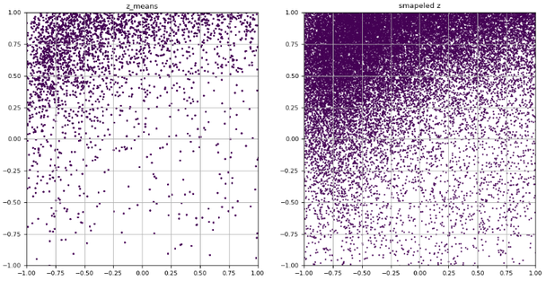


왼쪽 `z_mean` 은 이미지 한 장이 잠재 공간의 한 점으로 대응된 결과라 점의 수가 이미지 수와 같다. 오른쪽 `sampled z` 는 그 한 점 주위에 $\sigma$ 만큼 퍼진 점이 10 개씩 찍혀 있어 같은 영역이 훨씬 빽빽하다. 이것이 distributed mapping 이다. 입력 하나가 한 점이 아니라 **작은 영역**을 책임지기 때문에, 학습 데이터에 정확히 대응하는 점이 아닌 $z$ 를 주어도 Decoder 가 그럴듯한 이미지를 만들 수 있고, 잠재 공간이 빈틈 없이 연속적으로 채워진다.

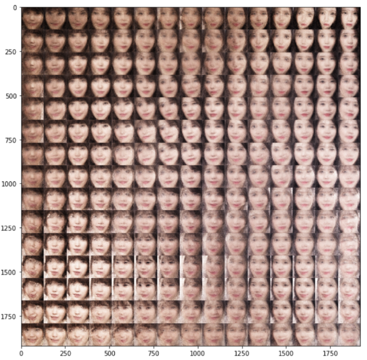

얼굴 데이터에서 잠재 공간을 격자로 훑은 결과도 같은 성질을 보여 준다. 격자의 어느 칸을 골라도 얼굴이 만들어지고, 이웃한 칸끼리는 연속적으로 변한다. 잠재 공간이 distributed mapping 으로 빈틈 없이 채워졌기 때문이다.

---

## 6.3.11 실습과제
<!-- 슬라이드 575 -->

- Epoch 를 늘려서 성능 변화를 확인하자.
- 성능 향상을 위해 계층을 늘려 보자.
- VAE model 이 만들어낸 손글씨의 다양성을 검토하고, 활용 가능성을 생각해 보자.

---

## 6.3.12 정리
<!-- 슬라이드 560~576 -->

- **VAE 의 구성** — Encoder(추론 모델) $q_\phi(z|x)$ + Latent Variable + Decoder(생성 모델) $p_\theta(x|z)$. 입력을 잠재 변수의 분포로 보내고, 그 분포에서 sampling 한 $z$ 로 데이터를 생성한다. 목적은 Dataset 의 특징을 대표하는 좋은 Latent Variable 을 찾고, 그것을 control 하여 원하는 데이터를 생성하는 것이다.
- **ELBO** — $\log P(x) = \mathrm{ELBO} + D_{KL}(q(z|x)\,\|\,P(z|x))$ 이므로 ELBO 를 키우면 근사 분포가 진짜 사후분포에 가까워진다. ELBO 의 첫째 항은 Decoder 의 복원 확률을, 둘째 항은 $q(z|x)$ 와 prior 의 유사도를 키운다.
- **Reparameterization Trick** — $z = \mu + \sigma \odot \epsilon$, $\epsilon \sim N(0, I)$ 로 sampling 의 우연성을 $\epsilon$ 에 분리하여 deterministic 부분으로 역전파한다.
- **Cost function** — ELBO 의 부호를 반전한 Total loss = Reconstruction loss(binary cross entropy) + Latent variable loss(KL divergence). $P(z)$ 를 표준정규분포로 두면 KL 은 $-\frac{1}{2}\sum(1 + \log\sigma^2 - \sigma^2 - \mu^2)$ 의 닫힌 식이 된다.
- **실습** — Encoder 는 `z_mean` 과 `z_log_var` 를 내고 `Sampling` 이 $z$ 를 뽑는다. Decoder 는 ConvTranspose2d(= Upsampling + Conv2d)로 7 x 7 을 28 x 28 로 키우고 Sigmoid 로 pixel 확률을 낸다. `training_step()` 에서 `BCELoss*28*28 + kl_loss*kl_loss_weight` 를 최소화한다.
- **시각화** — Grid 좌표(ppf 로 간격 조정)를 $z$ 로 Decoder 에 넣어 잠재 영역이 함의한 특징을 이미지화하고, Encoder 의 `z_mean` 을 label 별로 찍어 군집을 본다. `z_mean` 과 sampled `z` 를 비교하면 fixed mapping 과 distributed mapping 의 차이가 드러난다.
