# 6.4 GAN: vanilla GAN, DCGAN

**학습 목표**

- 생성 모델(Generator)과 판별 모델(Discriminator)이 경쟁하는 GAN 의 동작 방식과 feedback 구조를 설명할 수 있다.
- Two-player game 의 비용 함수에서 판별기가 gradient ascent, 생성기가 gradient descent 를 하는 이유와 생성기 loss 를 $-\log D(G(z))$ 로 변형하는 이유를 말할 수 있다.
- GAN 의 training 절차(판별기 학습 → 판별기 고정 후 생성기 학습)를 PyTorch 코드로 옮길 수 있다.
- z-space 의 특성(vector arithmetic, interpolation)이 무엇을 뜻하는지 설명할 수 있다.
- 최소 기능의 vanilla GAN 으로 sin 곡선의 일부를 생성하고, DCGAN 으로 MNIST 숫자 이미지를 생성할 수 있다.

**이 절의 구성**

- 6.4.1 적대적 생성 모델(GAN)의 구조
- 6.4.2 최적화 과정 — 두 분포가 겹쳐 가는 과정
- 6.4.3 비용 함수 — two-player game
- 6.4.4 Training 절차
- 6.4.5 z-space 의 특성 — vector arithmetic 과 interpolation
- 6.4.6 실습 6.4.1 — vanilla GAN: sin 곡선의 일부 생성
- 6.4.7 DCGAN(Deep Convolutional GAN)
- 6.4.8 실습 6.4.2 — DCGAN: MNIST 이미지 생성
- 6.4.9 실습과제
- 6.4.10 정리

---

## 6.4.1 적대적 생성 모델(GAN)의 구조
<!-- 슬라이드 578 -->

적대적 생성 모델(GAN: Generative Adversarial Network)은 어떠한 분포의 데이터도 모방할 수 있는 생성 모델이다(2014, Ian Goodfellow, Yoshua Bengio). 앞 절의 VAE 가 encoder-decoder 한 쌍으로 데이터의 분포를 배웠다면, GAN 은 **두 모델이 경쟁하는 구조**로 분포를 배운다.

- **생성 모델(Generator, G)** 은 data class 의 **분포**를 모델링한다. 무작위 noise 를 입력받아 새로운 data 를 만들어 낸다.
- **판별 모델(Discriminator, D)** 은 data class 의 **경계**를 모델링한다. 입력이 진짜(real)인지 생성된 가짜(fake)인지를 판단한다.

동작 방식은 위조범과 감별사의 관계와 같다. G 는 새로운 data 를 생성하고, 그것을 D 가 Real 로 판단하도록 학습한다. D 는 진위를 판단하고, G 가 만든 것을 Fake 로 판단하도록 학습한다. 서로의 목표가 정반대이므로 한쪽이 좋아지면 다른 쪽도 더 좋아져야 하고, 그 경쟁이 두 모델을 함께 끌어올린다.

두 모델이 받는 feedback 도 다르다. **D 는 Real/Fake label** 을 feedback 으로 받는다 — 진짜 data 에는 Real, G 의 출력에는 Fake 라는 정답이 있으므로 보통의 이진 분류 학습이다. 반면 **G 는 D 의 판단 점수**를 feedback 으로 받는다 — G 에게는 "이렇게 생겨야 한다" 는 정답 data 가 없고, 자신이 만든 것을 D 가 얼마나 Real 로 보았는지가 유일한 신호다.

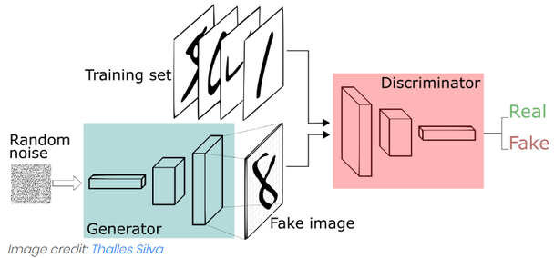

그림에서 Generator 는 random noise 를 입력받아 fake image 를 만들고, Discriminator 는 training set 의 real image 와 fake image 를 번갈아 받아 Real 또는 Fake 를 출력한다. 학습이 끝나면 Discriminator 는 버리고 Generator 만 남겨 noise 로부터 새 data 를 만드는 데 쓴다.

---

## 6.4.2 최적화 과정 — 두 분포가 겹쳐 가는 과정
<!-- 슬라이드 579 -->

GAN 의 학습이 진행되면 분포가 어떻게 움직이는지를 1차원 예로 보자. 그림에서 $z$ 는 noise, 흑색 점선은 real data 의 분포 $p(x)$, 녹색 실선은 생성된 fake 의 분포 $G(z)$, 청색 점선은 판별기의 출력 $D(x)$ 다. 아래쪽의 화살표는 $z$ 공간의 점이 $x$ 공간의 어디로 사상되는지를 보여 준다.

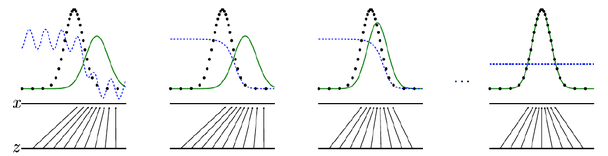

- G 는 $z$ 를 sampling 하여 $G(z)$ 를 생성한다(녹색). 학습 초기에는 녹색 분포가 real 분포와 떨어져 있다.
- D 는 $G(z)$ 와 $p(x)$ 를 비교하여 Real 일 확률을 출력한다(청색). real 분포가 있는 곳에서는 $D(x) \approx 1$, 생성 분포만 있는 곳에서는 $D(G(z)) \approx 0$ 에 가깝다. 즉 D 는 두 분포 사이에 경계를 긋는다.
- G 는 D 의 error 를 보고 error 가 감소하는 방향으로 $G(z)$ 의 분포를 조정한다. $D(G(z)) > 0$ 인 쪽, 즉 D 가 조금이라도 Real 로 보는 쪽으로 녹색 분포가 이동한다.
- 학습이 완료되면 녹색 분포가 흑색 분포와 겹친다. 이때 D 는 real 과 fake 를 구분할 근거가 없어지므로 Real data 에 대한 평가가 50% 에 수렴한다: $D(x) \approx 0.5$, $D(G(z)) \approx 0.5$.

> **핵심 메시지**
> GAN 학습의 도착점은 판별기의 정확도가 높아지는 것이 아니라, 판별기가 **더 이상 구분하지 못하는** 상태($D \approx 0.5$)다. 실습에서 판별기 정확도가 0.5 근처를 맴돌면 학습이 잘 되고 있다는 뜻이다.

---

## 6.4.3 비용 함수 — two-player game
<!-- 슬라이드 580~581 -->

GAN 의 비용 함수는 두 참가자가 하나의 값을 두고 한쪽은 키우고 한쪽은 줄이는 **two-player game** 의 형태다.

$$
\min_{\theta_g} \max_{\theta_d} \Big[\, \mathbb{E}_{x \sim p_{data}} \log D_{\theta_d}(x) \;+\; \mathbb{E}_{z \sim p(z)} \log\big(1 - D_{\theta_d}(G_{\theta_g}(z))\big) \,\Big]
$$

첫 항의 $D_{\theta_d}(x)$ 는 real data $x$ 에 대한 판별기 출력이고, 둘째 항의 $D_{\theta_d}(G_{\theta_g}(z))$ 는 생성된 fake data $G(z)$ 에 대한 판별기 출력이다. $\theta_d$ 는 판별기, $\theta_g$ 는 생성기의 파라미터다.

**Discriminator** 의 목표는 이 값을 최대로 하는 **gradient ascent** 다.

- Real 에 대해 확률 $D(x)$ 가 1 이면 $\log D(x) = 0$ 으로 첫 항의 기대값이 0(최대값)이 된다.
- Fake 에 대해 확률 $D(G(z))$ 가 0 이면 $\log(1 - 0) = 0$ 으로 둘째 항의 기대값도 0(최대값)이 된다.

$\log$ 는 항상 0 이하이므로 두 항 모두 0 이 최대다. 판별기는 real 에 1, fake 에 0 을 출력할 때 비용 함수를 최대로 만든다.

**Generator** 의 목표는 같은 값을 최소로 하는 **gradient descent** 다. 생성기가 손댈 수 있는 것은 둘째 항뿐이다.

- Fake 에 대해 D 의 확률 $D(G(z))$ 가 1 이면 $\log(1 - 1) = \log 0$ 으로 기대값이 $-\infty$ 가 된다.

즉 생성기는 판별기가 fake 를 Real(1) 로 볼수록 비용 함수를 작게 만든다.

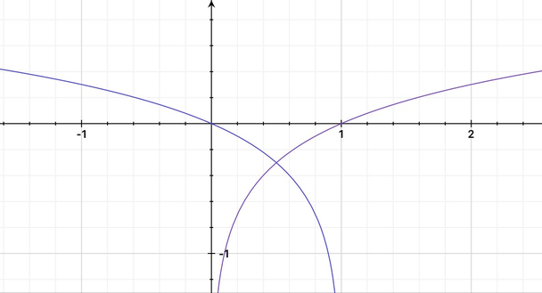

그림은 $\log(x)$ 와 $\log(1-x)$ 의 곡선이다. 가로축은 판별기의 출력 확률이다. Real data 에 대해 판별기는 $\log(x)$ 가 커지는 오른쪽($x \to 1$)으로 학습하고, Fake data 에 대해서는 $\log(1-x)$ 가 커지는 왼쪽($x \to 0$)으로 학습한다. 이것이 **판별기 학습 방향**이다. **생성기 학습 방향**은 fake data 에 대해 $\log(1-x)$ 가 작아지는 오른쪽($x \to 1$)이다.

### Loss 함수로 옮기기

비용 함수를 학습에 쓰는 loss 함수로 다시 쓰면 다음과 같다.

- **Discriminator loss function** — Real 과 fake 에 대해 최대를 갖는 함수. Real 에 대해 $\log D(x)$, fake 에 대해 $\log(1 - D(G(z)))$ 를 최대화한다. 구현에서는 부호를 바꾸어 binary cross entropy 를 최소화하는 것으로 쓴다.
- **Generator loss function** — Fake 에 대한 D 의 판단이 최소가 되는 함수. 원래 식은 $\log(1 - D(G(z)))$ 를 최소화하는 것이지만, **학습률 향상을 위해 loss 함수를 변형하여** $-\log D(G(z))$ 를 최소화하는 형태로 사용한다.

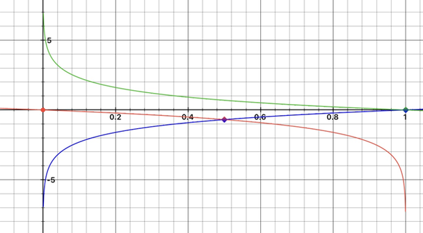

그림에는 세 곡선이 함께 있다. $\log(x)$ 는 판별기 loss 로 $x$ 가 0 근처일 때 초기 기울기가 크다. 생성기의 원래 loss $\log(1-x)$ 는 $x$ 가 0 근처일 때 초기 기울기가 작다 — 학습 초기에는 생성기가 서툴러 $D(G(z))$ 가 0 근처에 있는데, 바로 그 구간에서 기울기가 작으니 생성기가 배울 신호를 거의 받지 못한다. 변형된 생성기 loss $-\log(x)$ 는 $x$ 가 0 근처일 때 기울기가 매우 크다. 학습 방향(오른쪽으로 갈수록 작아짐)은 같으면서 초기 기울기만 커지므로 학습이 빨라진다. 실습 코드에서 생성기를 학습할 때 fake 에 **Real label(1)** 을 넣고 BCE loss 를 계산하는 것이 바로 이 $-\log D(G(z))$ 다.

---

## 6.4.4 Training 절차
<!-- 슬라이드 582~583 -->

GAN 의 training 절차는 한 iteration 안에서 판별기와 생성기를 번갈아 학습하는 것이다.

1. **k 번 반복** — $Z$ 에서 sampling 한 $p_g(z)$ 와 real data $p_{data}(x)$ 로 **판별기를 학습**한다.
2. $Z$ 에서 sampling 한 $p_g(z)$ 를 판별하게 하고, 그 결과로 **생성기를 학습**한다.
3. iteration 동안 1) 번으로 돌아간다.

원 논문의 알고리즘을 옮기면 다음과 같다.

1. training iteration 수만큼 반복:
   1. $k$ step 반복:
      - noise prior $p_g(z)$ 에서 $m$ 개의 noise sample $\{z^{(1)}, \ldots, z^{(m)}\}$ 을 minibatch 로 sampling 한다.
      - data 생성 분포 $p_{data}(x)$ 에서 $m$ 개의 example $\{x^{(1)}, \ldots, x^{(m)}\}$ 을 minibatch 로 sampling 한다.
      - 다음 stochastic gradient 를 **ascending** 하여 discriminator 를 갱신한다:
        $\nabla_{\theta_d} \frac{1}{m} \sum_{i=1}^{m} \big[ \log D_{\theta_d}(x^{(i)}) + \log(1 - D_{\theta_d}(G_{\theta_g}(z^{(i)}))) \big]$
   2. noise prior $p_g(z)$ 에서 $m$ 개의 noise sample $\{z^{(1)}, \ldots, z^{(m)}\}$ 을 sampling 한다.
   3. 다음 stochastic gradient 를 **ascending** 하여 generator 를 갱신한다(improved objective):
      $\nabla_{\theta_g} \frac{1}{m} \sum_{i=1}^{m} \log\big(D_{\theta_d}(G_{\theta_g}(z^{(i)}))\big)$

판별기를 $k$ 번 학습한 뒤 생성기를 한 번 학습하는 구조이며, 생성기 갱신에는 앞 소절에서 본 변형된 목표($\log D(G(z))$ 를 키우는 것 = $-\log D(G(z))$ 를 줄이는 것)를 쓴다. 실습 코드에서는 $k = 1$ 로 두어 판별기 한 번, 생성기 한 번을 번갈아 학습한다.

### 모델 관점의 절차

같은 절차를 두 모델의 관점에서 다시 쓰면 다음과 같다.

- **D_model 학습** — Real data 와 Fake data 를 넣어 주고 학습한다. 이때 label 은 **정상 label**(real = 1, fake = 0)이다.
- **G_model 학습**
  - D_model 의 학습을 제어(학습 중지)한다.
  - Fake data 를 넣어 주면서 **Real 이라고 label** 을 넣는다.
  - D 의 출력이 Real 이 되는 방향으로 G_model 을 학습한다.

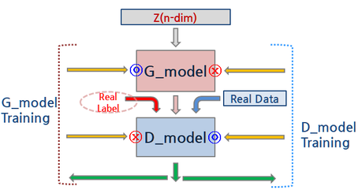

그림의 ⓞ 와 ⓧ 표시가 핵심이다. D_model training(오른쪽 점선) 에서는 D_model 이 ⓞ(갱신), G_model 이 ⓧ(고정)이고, G_model training(왼쪽 점선) 에서는 반대로 G_model 이 ⓞ, D_model 이 ⓧ 다. G 를 학습할 때 D 까지 함께 갱신되면 D 가 "fake 를 Real 이라고 하는" 잘못된 방향으로 배우게 되므로 반드시 D 를 고정해야 한다. 또 G 학습 때 넣는 Real label(붉은 점선)은 진짜 정답이 아니라 G 가 도달해야 할 목표를 D 의 loss 로 표현한 것이다.

---

## 6.4.5 z-space 의 특성 — vector arithmetic 과 interpolation
<!-- 슬라이드 584~585 -->

학습이 끝난 GAN 의 입력 공간 $z$(latent space) 는 단순한 난수 공간이 아니라 의미 있는 구조를 가진다. 이를 확인하는 두 가지 방법이 있다.

**z vector arithmetic** — 잠재 벡터끼리 더하고 빼면 의미가 더해지고 빠진다.

$$
\mathrm{vec}(\text{안경 낀 남자}) - \mathrm{vec}(\text{안경 끼지 않은 남자}) + \mathrm{vec}(\text{안경 끼지 않은 여자}) \;\rightarrow\; \text{안경 낀 여자}
$$

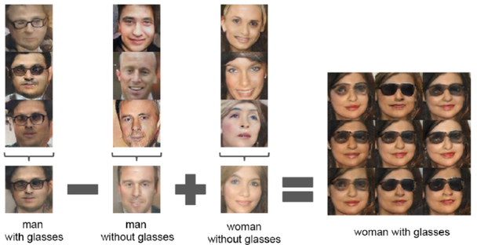

그림에서 각 항은 같은 속성을 가진 여러 생성 얼굴의 $z$ 벡터를 평균한 것이고, 연산 결과 벡터를 생성기에 넣으면 "안경 낀 여자" 얼굴이 나온다. 안경이라는 속성이 $z$ 공간에서 하나의 방향으로 표현되어 있다는 뜻이다.

**z vector interpolation** — 두 vector 를 interpolation 하면 생성 결과도 연속적으로 변한다.

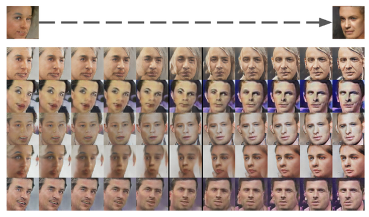

두 얼굴의 $z$ 벡터 사이를 일정 간격으로 나누어 생성기에 넣으면, 각 행에서 왼쪽 얼굴이 방향·표정·성별을 바꾸어 가며 오른쪽 얼굴로 부드럽게 변한다. 중간 벡터가 이상한 이미지가 아니라 그럴듯한 얼굴을 만든다는 것은 생성기가 얼굴의 **분포**를 배웠다는 증거다.

---

## 6.4.6 실습 6.4.1 — vanilla GAN: sin 곡선의 일부 생성
<!-- 슬라이드 586~597 -->

### 실습 6.4.1 — vanilla GAN
<!-- 슬라이드 586~597 -->

> 노트북: `code/6.4.1.Vanilla_GAN.ipynb`
> [](https://colab.research.google.com/github/AI-BoostCamp/intermediate-deep-learning-pytorch/blob/main/code/6.4.1.Vanilla_GAN.ipynb)

**목표** — Sin 곡선의 일부를 생성하는 GAN 모델의 동작을 이해한다. 이미지 대신 2차원 점 $(x_1, x_2)$ 를 생성하므로 모델이 아주 작고, 학습 과정을 산점도로 바로 볼 수 있다.

**실습 개요**

- Real Data 로 Sin 곡선의 일부를 제공한다.
- 최소 기능의 G, D model 을 사용한다.
- GAN 알고리즘에 따라 G, D model 을 학습한다.

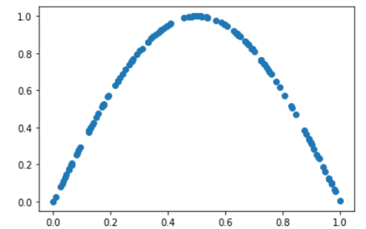

Real data 는 위와 같이 $x_1 \in [0, 1]$ 구간의 sin 곡선 위 점들이다. 학습이 잘 되면 아래처럼 생성기가 만든 파란 점(fake)이 붉은 점(real)과 같은 곡선 위에 놓이고, 판별기의 real/fake 정확도가 0.5 근처가 된다.

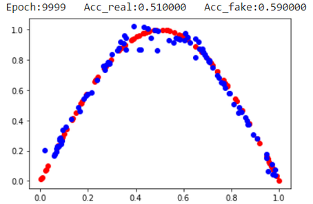

실습에 쓰는 모듈은 다음과 같다. torchmetrics 의 `accuracy` 로 판별기 정확도를 재고, torchinfo 의 `summary` 로 모델 구조를 확인한다.

```python
import torch
from torch import nn
from torch.nn import functional as F
from torchmetrics import functional as FM
from torch.utils.data import Dataset, DataLoader, random_split
from torchinfo import summary

import numpy as np
import matplotlib.pyplot as plt

device = 'cuda:0'
```

### Real sample 만들기
<!-- 슬라이드 587 -->

Real sample 을 만드는 함수는 $x_1$ 을 난수로 뽑고 $x_2 = \sin(\pi x_1)$ 을 계산하여 $(x_1, x_2)$ 쌍을 돌려준다. 반환값은 `((n,2), (n,1))` 이다 — data $n$ 개와 그 label $n$ 개.

```python
# generate n real samples with class labels
def real_samples(n):
    X1 = torch.rand(n).view(-1,1) #uniform random
    X2 = torch.sin(X1*torch.pi).view(-1,1)
    X = torch.hstack((X1,X2))     #(n,2)
    y = torch.ones((n,1))         # True
    y = y.type(torch.int)
    return X, y   #((n,2),(n,1))

# plot real samples
# 순서가 random인 sin curve의 일부
data = real_samples(128)
print(f'Label:{data[1][0]}')
plt.scatter(data[0][:, 0], data[0][:, 1])
plt.grid()
plt.show()
```

- `torch.rand(n)` 은 $[0, 1)$ 의 균등 난수이므로 $x_1$ 은 0~1, $\pi x_1$ 은 0~$\pi$ 가 되어 $x_2$ 는 sin 곡선의 반 주기(0 → 1 → 0)를 그린다. 이것이 "sin 곡선의 일부" 다.
- `view(-1,1)` 로 두 열벡터를 만든 뒤 `hstack` 으로 옆으로 붙여 `(n,2)` 를 만든다.
- label 은 모두 1(True) 이다. Real sample 은 항상 "진짜" 이므로 label 을 따로 받을 필요가 없다.
- 128 개를 뽑아 산점도로 그리면 순서는 무작위지만 점들은 sin 곡선 위에 놓인다.

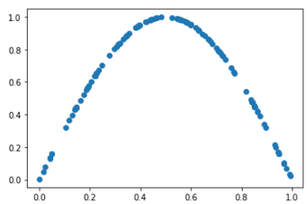

### Discriminator model
<!-- 슬라이드 588 -->

Discriminator 는 Real data 와 fake data 를 구분하도록 학습하는 이진 분류기다. 입력은 $(x_1, x_2)$ 2 차원, 출력은 1(real)~0(fake) 사이의 확률 하나이며 마지막에 Sigmoid 를 사용한다.

```python
# Discriminator model
class D_model(nn.Module):
    def __init__(self, n_inputs=2):
        super(D_model, self).__init__()
        self.discriminator = nn.Sequential(
            nn.Linear(n_inputs, 32),
            nn.ReLU(),
            nn.Dropout(0.1),
            nn.Linear(32, 1),
            nn.Sigmoid(), )

    def forward(self, x):
        out = self.discriminator(x)
        return out

D = D_model()
summary(D, input_size=(8, 2))
```

은닉층 하나(32 유닛)에 Dropout 0.1 을 둔 최소 기능의 모델이다. `summary` 로 확인하면 `Linear(2→32)` 가 96 개, `Linear(32→1)` 가 33 개로 전체 파라미터가 129 개다. 출력 shape 는 batch 8 에 대해 `[8, 1]` 이다.

### Generator model
<!-- 슬라이드 589 -->

Generator 의 입력은 latent space(잠재 공간)의 한 점, 즉 5 차원 벡터다. 출력은 $(x_1, x_2)$ 이며, 출력 값의 범위가 real data 의 범위(0~1)를 덮도록 마지막에 Tanh 를 사용한다.

```python
latent_dim = 5
# Generator model
class G_model(nn.Module):
    def __init__(self, n_outputs=2):
        super(G_model, self).__init__()
        self.generator = nn.Sequential(
            nn.Linear(latent_dim, 16), #Linear(5, 16)
            nn.ReLU(),
            nn.Linear(16, n_outputs),
            nn.Tanh(),
            )

    def forward(self, x):
        out = self.generator(x.to(device))
        return out

G = G_model()
summary(G, input_size=(8, 5))
```

- `latent_dim = 5` 는 전역 변수로 두어 뒤의 latent sampling 함수와 공유한다.
- 은닉층 16 유닛 하나로, `Linear(5→16)` 96 개 + `Linear(16→2)` 34 개 = 130 개 파라미터다. 판별기와 비슷한 크기다.
- `forward` 에서 입력을 `device` 로 옮기므로 CPU 텐서를 넣어도 동작한다.
- 마지막 Tanh 는 출력 범위를 $(-1, 1)$ 로 묶는다. 생성기의 출력 활성화는 real data 의 범위에 맞추어 고르는 것이 원칙이며, 여기서는 Sigmoid 대신 Tanh 를 썼다(뒤의 DCGAN 소절에서 "일반적 도움" 으로 다시 나온다).

### Latent space 샘플링
<!-- 슬라이드 590 -->

생성기의 입력이 되는 latent space 는 5 차원 벡터다. `torch.randn()` 으로 가우시안 분포에서 난수를 발생시켜 $N$ 개의 latent point(5 차원 벡터)를 출력한다.

```python
# generate points in latent space as input for the generator
def latent_points(n):
    x = torch.randn((n, latent_dim))
    return x.to(device)

latent_points(2)
```

`latent_points(2)` 는 `(2, 5)` 텐서를 돌려준다. 생성기는 이 공간의 어느 점을 받아도 sin 곡선 위의 한 점을 내놓도록 학습되어야 한다.

### Fake sample 만들기
<!-- 슬라이드 591 -->

G 에서 fake data 를 생성한다. G 는 latent vector 를 받아서 $n$ 개의 fake 값을 생성하고, label 은 0(False) 으로 붙인다.

```python
# use the generator to generate n fake examples, with class labels
def generate_fake_samples(generator, n):
    x = latent_points(n)  #(n,5)
    x = generator(x)      #(n,2)<-(n,5)
    x = x.cpu().detach()
    y = torch.zeros(n, 1) #False
    return x, y 	        #(n,2),(n,1)

# plot fake samples
data = generate_fake_samples(G, 100)
plt.scatter(data[0][:, 0], data[0][:, 1])
plt.grid()
plt.show()
```

- `latent_points(n)` 으로 `(n,5)` 를 뽑고 생성기를 통과시켜 `(n,2)` 를 얻는다.
- `.cpu().detach()` 로 계산 그래프에서 떼어 낸다. 이 함수의 출력은 **판별기 학습용** 이므로 생성기 쪽으로 gradient 가 흐를 필요가 없다(생성기 학습 때는 이 함수를 쓰지 않고 `G(latent_samples)` 를 직접 호출한다).
- 반환 형식은 `real_samples()` 와 같은 `((n,2),(n,1))` 이어서 두 결과를 그대로 이어 붙일 수 있다.

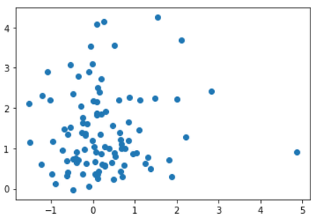

학습 전 생성기의 출력을 그려 보면 sin 곡선과 아무 관계 없이 흩어져 있다.

### Evaluate function — train 과정 확인
<!-- 슬라이드 592 -->

학습 중인 G, D 모델을 입력받아 판별기의 성능을 재고 real/fake 점을 함께 그리는 함수다.

```python
# evaluate the discriminator and plot real and fake points
def summarize_performance(epoch, generator, discriminator, n=100 ):
    # real samples
    x_real, y_real = real_samples(n)
    # evaluate for real acc.
    y_real_pred = discriminator(x_real.to(device))
    acc_real = FM.accuracy(y_real_pred.cpu(), y_real, task='binary', num_classes=2 )

    # fake examples
    x_fake, y_fake = generate_fake_samples(generator, n)
    # evaluate for fake acc.
    y_fake_pred = discriminator(x_fake.to(device))
    acc_fake = FM.accuracy(y_fake_pred.cpu(), y_fake.type(torch.int), task='binary', num_classes=2)

    # summarize discriminator performance
    print(f"Epoch:{epoch}   Acc_real:{acc_real:.2f}   Acc_fake:{acc_fake:.2f}")
    # scatter plot real and fake data points
    plt.scatter(x_real[:, 0], x_real[:, 1], color='red')
    plt.scatter(x_fake[:, 0], x_fake[:, 1], color='blue')
    plt.grid()
    plt.show()
    return (acc_real,acc_fake)

summarize_performance(0, G, D)
```

- `acc_real` 은 real 100 개를 판별기가 real 로 맞힌 비율, `acc_fake` 는 fake 100 개를 fake 로 맞힌 비율이다. `FM.accuracy` 에 `task='binary'` 를 주면 확률 출력을 0.5 기준으로 잘라 정확도를 계산한다.
- 붉은 점이 real, 파란 점이 fake 다. 두 정확도가 함께 0.5 근처로 내려가고 파란 점이 붉은 곡선 위에 겹치면 학습이 된 것이다.

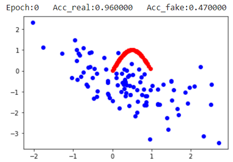

학습 전에는 fake 점이 곡선과 무관하게 흩어져 있고, 판별기도 아직 학습 전이므로 정확도 값에 큰 의미가 없다.

### Training function 의 구조
<!-- 슬라이드 593 -->

Training 은 **D training(real/fake) → G training(D(fake))** 의 순서로 진행한다. 앞 6.4.4 의 개념도 그대로다 — D 를 학습할 때는 real 과 fake 를 정상 label 로 넣고, G 를 학습할 때는 D 를 고정한 채 fake 를 Real label 로 넣는다. 이 실습에서는 real sample 을 `Dataset` 으로 감싸 `DataLoader` 로 공급한다.

```python
class RealSampleData(Dataset):
    def __init__(self, num_samples):
        self.num_samples = num_samples
        self.X, self.y = real_samples(num_samples)
    def __len__(self):
        return self.num_samples
    def __getitem__(self, idx):
        return self.X[idx], self.y[idx]
```

```python
batch_size = 512
realDataset = RealSampleData(batch_size)
realLoader = DataLoader(realDataset, batch_size=batch_size, shuffle=True)
```

Dataset 의 크기와 batch 크기를 같은 512 로 두었으므로 `realLoader` 는 한 epoch 에 batch 하나를 내놓는다. 즉 epoch 하나가 곧 iteration 하나다.

### Training 준비
<!-- 슬라이드 594 -->

두 모델을 새로 만들어 GPU 로 보내고, loss 함수와 **두 개의 optimizer** 를 준비한다.

```python
G = G_model().to(device)
D = D_model().to(device)

lr = 0.0005
loss_function = nn.BCELoss()
optimizer_D = torch.optim.Adam(D.parameters(), lr=lr)
optimizer_G = torch.optim.Adam(G.parameters(), lr=lr)
```

- loss 는 `nn.BCELoss()` 하나를 D, G 가 함께 쓴다. 판별기 출력이 Sigmoid 확률이므로 BCE 가 맞고, 6.4.3 의 $\log D(x)$, $\log(1 - D(G(z)))$, $-\log D(G(z))$ 는 모두 BCE 에 어떤 label 을 넣느냐로 표현된다.
- optimizer 는 반드시 둘이어야 한다. `optimizer_D` 는 D 의 파라미터만, `optimizer_G` 는 G 의 파라미터만 갱신하므로, G 를 학습할 때 `optimizer_G.step()` 만 부르면 D 가 고정된 것과 같은 효과가 난다.

### Training loop
<!-- 슬라이드 595 -->

Training loop 도 **D training(real/fake) → G training(D(fake))** 의 두 단계다.

```python
%%time
num_epochs = 15000
losses_d = []
losses_g = []
acc_real = []
acc_fake= []
for epoch in range(num_epochs):
    for n, (r_samples, r_labels) in enumerate(realLoader):
        ## Data for training the discriminator
        f_samples,f_labels =  generate_fake_samples(G, batch_size)
        all_samples = torch.cat((r_samples, f_samples))
        all_labels = torch.cat((r_labels, f_labels))
        ## Training the discriminator
        optimizer_D.zero_grad()
        output_d = D(all_samples.to(device))
        loss_d = loss_function(output_d.cpu(), all_labels)

        acc_real.append(FM.accuracy(output_d[:batch_size].cpu(), r_labels, task='binary', num_classes=2))
        acc_fake.append(FM.accuracy(output_d[batch_size:].cpu(), f_labels, task='binary', num_classes=2 ))

        loss_d.backward()
        optimizer_D.step()
        losses_d.append(loss_d)

        ## Data for training the generator
        latent_samples = latent_points(batch_size)
        r_labels = r_labels.type(torch.FloatTensor)
        ## Training the generator
        optimizer_G.zero_grad()
        f_samples = G(latent_samples)
        output_d = D(f_samples)
        loss_g = loss_function(output_d.cpu(), r_labels)
        loss_g.backward()
        optimizer_G.step()
        losses_g.append(loss_g)

    # Show loss
    if epoch % 500 == 0:
        summarize_performance(epoch, G, D)
```

**판별기 학습(앞 절반)**

1. `generate_fake_samples` 로 fake 512 개(label 0)를 만들고, loader 가 준 real 512 개(label 1)와 `torch.cat` 으로 이어 붙여 1024 개의 학습 데이터를 만든다.
2. `optimizer_D.zero_grad()` 로 D 의 gradient 를 비우고, D 에 전부 통과시켜 BCE loss 를 구한다. 이것이 6.4.3 의 discriminator loss(real 은 $\log D(x)$, fake 는 $\log(1 - D(G(z)))$ 를 최대화 = BCE 최소화)다.
3. 앞 512 개(real)와 뒤 512 개(fake)의 정확도를 따로 기록한다.
4. `loss_d.backward()` → `optimizer_D.step()` 으로 D 만 갱신한다. fake sample 은 `detach()` 되어 있으므로 G 로는 gradient 가 흐르지 않는다.

**생성기 학습(뒤 절반)**

1. latent point 512 개를 새로 뽑는다.
2. `r_labels`(모두 1)를 float 으로 바꾼다. 생성기에게 줄 label 은 **Real** 이다.
3. `optimizer_G.zero_grad()` 뒤에 이번에는 `G(latent_samples)` 를 **detach 없이** 호출하여 fake 를 만들고 D 에 넣는다. 계산 그래프가 G → D 로 이어진다.
4. D 의 출력과 Real label 로 BCE 를 구한다. 이것이 변형된 생성기 loss $-\log D(G(z))$ 다.
5. `loss_g.backward()` 는 D 를 거쳐 G 까지 gradient 를 보내지만, `optimizer_G.step()` 은 G 의 파라미터만 갱신한다. D 에 남은 gradient 는 다음 iteration 의 `optimizer_D.zero_grad()` 가 지운다. 이렇게 "D 학습 중지" 가 구현된다.

500 epoch 마다 `summarize_performance` 를 불러 산점도와 정확도를 찍는다. 학습률·batch 크기·epoch 수를 바꾸면 수렴 속도가 크게 달라지는데, GAN 은 두 모델의 균형이 깨지면(한쪽이 너무 빨리 이기면) 학습이 멈추므로 값을 바꿀 때는 판별기 정확도가 0.5 근처를 유지하는지 함께 본다.

### Monitoring
<!-- 슬라이드 596 -->

500 epoch 마다 출력되는 산점도로 학습 과정을 본다. 붉은 점이 real, 파란 점이 fake 다.

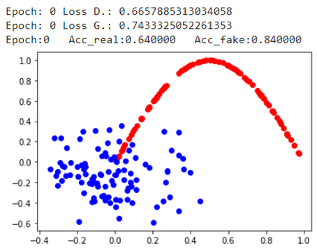

Epoch 0 에서는 fake 점이 원점 근처에 뭉쳐 있고 곡선과 떨어져 있어 판별기가 fake 를 잘 가려낸다(Acc_fake 0.84).

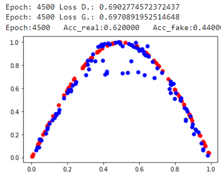

Epoch 4500 에서는 fake 점이 곡선의 모양을 대체로 따라간다. 아직 곡선 안쪽에 흩어진 점이 남아 있다.

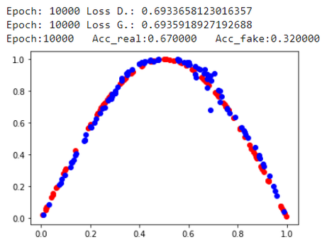

Epoch 10000 에서는 fake 점이 곡선에 거의 겹쳐 있고 판별기는 fake 를 제대로 가려내지 못한다(Acc_fake 0.32).

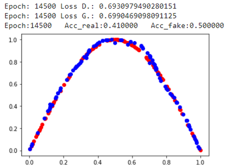

Epoch 14500 에서는 두 점 집합이 구분되지 않고, 정확도도 0.41 / 0.50 으로 동전 던지기 수준이다. 함께 찍히는 loss 를 보면 D loss 와 G loss 가 모두 $\log 2 \approx 0.693$ 근처에 머문다 — $D = 0.5$ 일 때 BCE 가 $-\log 0.5 = 0.693$ 이므로 이 값 자체가 "판별기가 구분하지 못하는 상태" 의 표시다.

학습이 끝난 뒤 기록해 둔 정확도와 loss 를 그려 보면 이 흐름을 한눈에 볼 수 있다.

```python
plt.plot(np.array([i.detach() for i in acc_fake]), label="acc fake",linewidth=0.3)
plt.plot(np.array([i.detach() for i in acc_real]), label="acc real",linewidth=0.3)
plt.ylim(0,1)
plt.grid()
plt.legend()
plt.show()
```

```python
plt.plot(np.array([i.detach() for i in losses_g]), label="G loss",linewidth=0.3)
plt.plot(np.array([i.detach() for i in losses_d]), label="D loss",linewidth=0.3)
plt.ylim(0.6,0.8)
plt.grid()
plt.legend()
plt.show()
```

GAN 의 loss 곡선은 분류 모델처럼 단조롭게 내려가지 않는다. 두 loss 가 서로 밀고 당기며 0.69 근처에서 진동하는 것이 정상이므로, loss 값보다 산점도와 정확도로 학습 상태를 판단한다.

### Model save, load & test
<!-- 슬라이드 597 -->

G 와 D 를 각각 저장하고, 각각 불러온 뒤, 불러온 모델로 test 한다.

```python
import os
path = "/content/models/PT/"
os.makedirs(path, exist_ok=True)

torch.save(G, path+"vanilla_gan_generator.pt")
torch.save(D, path+"vanilla_gan_discriminator.pt")
```

```python
discriminator2 = torch.load(path+'vanilla_gan_discriminator.pt')
generator2 = torch.load(path+'vanilla_gan_generator.pt')

summary(discriminator2, input_size=(8, 2))
summary(generator2, input_size=(8, 5))
```

```python
summarize_performance(0, generator2, discriminator2)
```

`torch.save(model, ...)` 은 모델 객체 전체를 저장하므로 불러올 때 클래스 정의(`G_model`, `D_model`)가 같은 이름으로 존재해야 한다. 불러온 두 모델로 `summarize_performance` 를 부르면 저장 전과 같은 결과가 나온다.

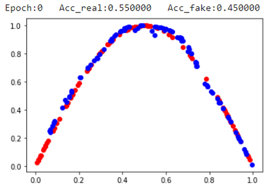

---

## 6.4.7 DCGAN(Deep Convolutional GAN)
<!-- 슬라이드 599 -->

DCGAN 은 GAN 모델에 CNN 을 적용하여 **이미지 생성을 최초로 성공한 모델**이다(Unsupervised Representation Learning with Deep Convolutional Generative Adversarial Networks — Alec Radford et al., 2016).

GAN 모델은 학습시키기가 아주 어렵기로 유명하다. 2014 년에 소개되고 나서도 한동안 학습을 성공시킨 사례를 찾아보기 힘들었다. 2015 년 DCGAN 이 수많은 실험 끝에 학습이 잘되는 구조를 찾았고, 그 후 GAN 의 인기가 급상승했다. 그러나 여전히 GAN 을 학습시키는 것은 매우 어렵다 — 여전히 실험적이고 휴리스틱하게 튜닝하고 있다.

DCGAN 을 비롯한 경험에서 나온 **일반적인 도움**은 다음과 같다.

- Generator 의 마지막 Layer 에 Sigmoid(Logistic) 대신 **Tanh** 활성화 함수로 대체한다.
- $z$ 를 샘플링할 때 Uniform 분포가 아닌 **Gaussian 정규분포**를 사용하여 샘플링한다.
- **Dropout** 과 **label 에 노이즈**를 주는 것이 학습이 정체되는 것을 방지한다.
- Convolution Filter 의 크기를 **stride 로 나누어지는 수**로 설정한다.

앞의 vanilla GAN 실습이 이미 Tanh 출력과 Gaussian latent 를 썼던 이유가 여기 있다. 다음 실습의 DCGAN 은 여기에 Dropout 을 더하고, 생성기·판별기를 ConvNet 으로 바꾼다.

---

## 6.4.8 실습 6.4.2 — DCGAN: MNIST 이미지 생성
<!-- 슬라이드 600~604 -->

### 실습 6.4.2 — DCGAN
<!-- 슬라이드 600~604 -->

> 노트북: `code/6.4.2.DCGAN.ipynb` (다른 판: `code/6.4.2.DCGAN2.ipynb` — 판별기의 Dropout 을 뺀 판)
> [](https://colab.research.google.com/github/AI-BoostCamp/intermediate-deep-learning-pytorch/blob/main/code/6.4.2.DCGAN.ipynb)

**목표** — Deep ConvNet 을 사용한 DCGAN 을 실습을 통해 이해한다.

**개요**

- Vanilla GAN 모델의 구조(D 학습 → G 학습, 두 optimizer, BCE loss)를 그대로 사용한다.
- 생성기, 판별기에 ConvNet 을 적용한다.
- MNIST 로 학습한 후 이미지를 생성한다.


구조도의 왼쪽이 Generator, 오른쪽이 Discriminator 다. Generator 는 $z$(n-dim) 를 Dense 로 $7 \times 7 \times 128$ 로 펼친 뒤 reshape 하고, transposed convolution 으로 $7 \to 14 \to 28$ 로 해상도를 키워 $28 \times 28$ 의 fake image 를 만든다. 그림의 마지막 Sigmoid 자리는 코드에서 **tanh** 로 바뀌었다(6.4.7 의 일반적 도움). Discriminator 는 fake image 와 real image 를 받아 stride 2 의 convolution 으로 해상도를 줄이고 Flatten → Dense(1) → Sigmoid 로 Real or Fake 확률을 낸다. 판별기의 출력을 fake label / real label 과 binary loss 로 비교하는 것은 vanilla GAN 과 같다.

**Dataset** — MNIST 를 불러오되 픽셀 값을 $[-1, 1]$ 로 정규화한다. 생성기의 마지막이 Tanh 이므로 real image 의 범위를 생성기 출력 범위에 맞추는 것이다.

```python
from torchvision.datasets import FashionMNIST, MNIST

class Normalize:
    def __call__(self, sample):
        sample = np.array(sample)
        image = (sample - 127.5) / 127.5
        return torch.FloatTensor(image).unsqueeze(dim=0)

# Normalize data to [-1 ~ 1]
transform = v2.Compose([Normalize(),])

# download path 정의
download_root = './MNIST_DATASET'
train_dataset = MNIST(download_root, transform=transform, train=True, download=True)
test_dataset = MNIST(download_root, transform=transform, train=False, download=True)
```

`(sample - 127.5) / 127.5` 는 0~255 를 -1~1 로 옮기고, `unsqueeze(dim=0)` 으로 channel 축을 붙여 `(1, 28, 28)` 을 만든다.

학습이 오래 걸리므로 모델을 중간중간 저장하고 다시 불러올 수 있게 함수와 스위치를 준비한다.

```python
save_path = "/content/models/PT/"
os.makedirs(save_path, exist_ok=True)

def save_models(title, epoch):
    torch.save(generator, save_path+"dcgan_generator_{}_{}.pt".format(title, epoch))
    torch.save(discriminator, save_path+"dcgan_discriminator_{}_{}.pt".format(title, epoch))

def load_models(title, epoch):
    gen = torch.load(save_path+"dcgan_generator_{}_{}.pt".format(title, epoch))
    dis = torch.load(save_path+"dcgan_discriminator_{}_{}.pt".format(title, epoch))
    return gen, dis

train_model = True      # T: training
#train_model = False     # F: loading
```

### Generator
<!-- 슬라이드 601 -->

모델 파라미터를 먼저 정한다. latent 차원은 100, 이미지는 $28 \times 28 \times 1$ 이다.

```python
latent_dim = 100
height = 28
width = 28
channels = 1
```

```python
# Generator model
class Generator(nn.Module):
    def __init__(self, latent_dim, channels):
        super(Generator, self).__init__()
        self.generator = nn.Sequential(
            nn.Linear(latent_dim, 128 * 7 * 7),
            nn.Unflatten(1, (128, 7, 7)),
            nn.BatchNorm2d(128,momentum=0.8),
            nn.LeakyReLU(0.2),
            nn.ConvTranspose2d(128, 128, 5, 2,
                               padding=2, output_padding=1),
            nn.BatchNorm2d(128,momentum=0.8),  #(128,14,14)
            nn.LeakyReLU(0.2),
            nn.ConvTranspose2d(128, 64, 5, 2,
                               padding=2, output_padding=1),
            nn.BatchNorm2d(64,momentum=0.8),   #(64,28,28)
            nn.LeakyReLU(0.2),
            nn.ConvTranspose2d(64, 32, 5, 1, padding=2),
            nn.BatchNorm2d(32,momentum=0.8),   #(32,28,28)
            nn.LeakyReLU(0.2),
            nn.Conv2d(32, channels, 5, padding=2),
            nn.Tanh()             #(1,28,28)
        )

    def forward(self, x):
        out = self.generator(x)
        return out

generator = Generator(latent_dim, channels).to(device)
summary(generator, input_size=(8, 100))
```

Generator 는 벡터를 이미지로 "펼치는" 방향으로 짜여 있다.

1. `Linear(100 → 128·7·7)` 로 latent 벡터를 $7 \times 7$ 특징 지도 128 장 분량의 숫자로 늘리고, `Unflatten` 으로 `(128, 7, 7)` 로 모양을 바꾼다. 구조도의 Dense + Reshape 에 해당한다.
2. `ConvTranspose2d(128, 128, 5, 2, padding=2, output_padding=1)` 은 kernel 5, stride 2 의 transposed convolution 으로 해상도를 두 배로 키운다 — `(128, 7, 7)` → `(128, 14, 14)`. `padding=2` 와 `output_padding=1` 은 출력 크기가 정확히 두 배가 되도록 맞추는 값이다.
3. 같은 방식으로 한 번 더 키워 `(64, 28, 28)` 이 되고, stride 1 의 transposed convolution 으로 채널만 32 로 줄인다.
4. `Conv2d(32, 1, 5, padding=2)` 로 채널을 1 로 모아 `(1, 28, 28)` 이미지를 만들고 **Tanh** 로 $[-1, 1]$ 에 넣는다. Dataset 의 정규화 범위와 일치한다.
5. 각 convolution 뒤에는 `BatchNorm2d` 와 `LeakyReLU(0.2)` 를 둔다. 구조도의 "BN-ReLU" 가 이것이다.

kernel 5 에 stride 2 는 6.4.7 의 "filter 크기를 stride 로 나누어지는 수로" 와는 다르지만, `padding`/`output_padding` 으로 크기를 맞추어 쓰고 있다. `summary` 로 확인하면 전체 파라미터가 1,300,801 개다.

### Discriminator
<!-- 슬라이드 602 -->

```python
# Discriminator model
class Discriminator(nn.Module):
    def __init__(self, channels):
        super(Discriminator, self).__init__()
        self.discriminator = nn.Sequential(
            nn.Conv2d(channels, 32, 5, 2, padding=2),
            nn.LeakyReLU(0.2), nn.Dropout(0.25),
            nn.Conv2d(32, 64, 5, 2, padding=2),
            nn.LeakyReLU(0.2), nn.Dropout(0.25),
            nn.Conv2d(64, 128, 5, 2, padding=2),
            nn.LeakyReLU(0.2), nn.Dropout(0.25),
            nn.Conv2d(128, 256, 5, 1, padding=2),
            nn.Flatten(),
            nn.Linear(256*4*4, 1),
            nn.Sigmoid()
        )

    def forward(self, x):
        out = self.discriminator(x)
        return out

discriminator = Discriminator(channels).to(device)
summary(discriminator, input_size=(8, channels, height, width))
```

Discriminator 는 보통의 CNN 분류기와 같은 방향(이미지 → 벡터 → 확률)이다.

1. `Conv2d(1, 32, 5, 2, padding=2)` 부터 stride 2 의 convolution 세 번으로 해상도를 $28 \to 14 \to 7 \to 4$ 로 줄이면서 채널을 $32 \to 64 \to 128$ 로 늘린다.
2. 마지막 `Conv2d(128, 256, 5, 1, padding=2)` 는 stride 1 이라 크기는 $4 \times 4$ 그대로이고 채널만 256 이 된다. 그래서 `Flatten` 뒤의 `Linear` 입력이 `256*4*4` 다.
3. 활성화는 LeakyReLU(0.2) 이고, 매 층 뒤에 **Dropout(0.25)** 을 두어 판별기가 너무 빨리 이기는 것을 막는다(6.4.7 의 일반적 도움). 판별기에는 BatchNorm 을 쓰지 않았다.
4. `Linear(4096 → 1)` 과 Sigmoid 로 Real 확률을 낸다.

`summary` 로 확인하면 전체 파라미터가 1,080,577 개로 생성기와 비슷한 규모다. 두 모델의 힘이 비슷해야 경쟁이 유지된다.

### Training 준비
<!-- 슬라이드 602 -->

하이퍼파라미터와 두 optimizer 를 준비한다. 구조는 vanilla GAN 과 같다.

```python
batch_size = 600
num_epochs = 10
print_step=100
lr = 0.0001
```

```python
generator = Generator(latent_dim, channels).to(device)
discriminator = Discriminator(channels).to(device)
optimizer_d = torch.optim.Adam(discriminator.parameters(), lr=lr)
optimizer_g = torch.optim.Adam(generator.parameters(), lr=lr)
```

생성 결과를 $4 \times 8$ 격자로 보여 주는 함수도 준비한다. 생성기 출력이 $[-1, 1]$ 이므로 `0.5 * x + 0.5` 로 $[0, 1]$ 로 되돌려서 그린다.

```python
def show_images(generated_images, n=4, m=8, figsize=(8, 4)):
    fig = plt.figure(figsize=figsize)
    plt.subplots_adjust(top=1, bottom=0, hspace=0, wspace=0.05)
    for i in range(n):
        for j in range(m):
            k = i * m + j
            ax = fig.add_subplot(n, m, i * m + j + 1)
            ax.imshow(generated_images[k][0, :, :])
            ax.grid(False)
            ax.xaxis.set_ticks([])
            ax.yaxis.set_ticks([])
    plt.tight_layout()
    plt.show()
```

```python
noise_data = torch.randn((batch_size, latent_dim))
show_images(0.5 * generator(noise_data.to(device)).cpu().detach().numpy() + 0.5) #Generator Af='tanh'
```

학습 전 생성기의 출력은 noise 에 가까운 무늬다.

### Training function
<!-- 슬라이드 603 -->

```python
def train(num_epochs, print_every):
    for epoch in range(num_epochs):
        idx = np.random.randint(0, len(train_dataset), batch_size)
        r_samples = torch.cat([train_dataset[i][0].unsqueeze(dim=0) for i in idx])
        # Data for training the discriminator
        r_labels = torch.ones((batch_size, 1))
        latent_samples = torch.randn((batch_size, latent_dim))
        f_samples = generator(latent_samples.to(device))
        f_labels = torch.zeros((batch_size, 1))
        all_samples = torch.cat((r_samples.to(device), f_samples))
        all_labels = torch.cat((r_labels, f_labels))
        # Training the discriminator
        discriminator.zero_grad()
        output_d = discriminator(all_samples.to(device))
        loss_d = F.binary_cross_entropy(output_d, all_labels.to(device))
        loss_d.backward()
        optimizer_d.step()

        # Data for training the generator
        latent_samples = torch.randn((batch_size, latent_dim))
        # Training the generator
        generator.zero_grad()
        f_samples = generator(latent_samples.to(device))
        output_d = discriminator(f_samples.to(device))
        loss_g = F.binary_cross_entropy(output_d, r_labels.to(device))
        loss_g.backward()
        optimizer_g.step()

        # Show loss
        if epoch % print_every == 0:
            print(f"Epoch: {epoch} Loss D.: {loss_d}")
            print(f"Epoch: {epoch} Loss G.: {loss_g}")
```

vanilla GAN 의 training loop 와 같은 뼈대이며 달라진 점은 다음과 같다.

- DataLoader 대신 매 step 마다 `np.random.randint` 로 train_dataset 에서 600 개의 index 를 뽑아 real batch 를 만든다. 따라서 여기서 `epoch` 는 데이터셋 한 바퀴가 아니라 **iteration 하나**다.
- Real label 은 1, fake label 은 0 으로 직접 만든다. 판별기 학습 시 `f_samples` 를 detach 하지 않지만 `optimizer_d.step()` 은 판별기 파라미터만 갱신하므로 결과는 같다.
- 판별기는 `discriminator.zero_grad()` → BCE → `optimizer_d.step()`, 생성기는 `generator.zero_grad()` → 새 latent 로 fake 생성 → 판별기 통과 → **Real label** 로 BCE → `optimizer_g.step()` 이다. loss 는 `F.binary_cross_entropy` 함수형을 썼다.
- `print_every` step 마다 두 loss 를 출력한다.

학습은 세 번에 나누어 진행하고, 단계마다 모델을 저장한 뒤 생성 결과를 본다. 이미 학습해 둔 모델이 있으면 `train_model = False` 로 두고 불러온다.

```python
%%time
if train_model == True:
    history500 = train(500, 10)
    save_models("mnist", 500)
else:
    generator, discriminator = load_models("mnist", 500)
```

```python
noise_data = torch.randn((batch_size, latent_dim))
show_images(0.5 * generator(noise_data.to(device)).cpu().detach().numpy() + 0.5) #Generator Af='tanh'
```

```python
%%time
if train_model == True:
    history500 = train(4500, 100)
    save_models("mnist", 5000)
else:
    generator, discriminator = load_models("mnist", 5000)
```

```python
%%time
if train_model == True:
    train(15000, 100)
    save_models("mnist", 20000)
else:
    generator, discriminator = load_models("mnist", 20000)
```

500 → 5000 → 20000 step 으로 누적 학습하며, 각 단계 뒤에 같은 `show_images` 셀로 결과를 확인한다.

### 학습 결과
<!-- 슬라이드 604 -->

Epoch(step) 별 생성 결과를 500, 5000, 20000 에서 비교한다.

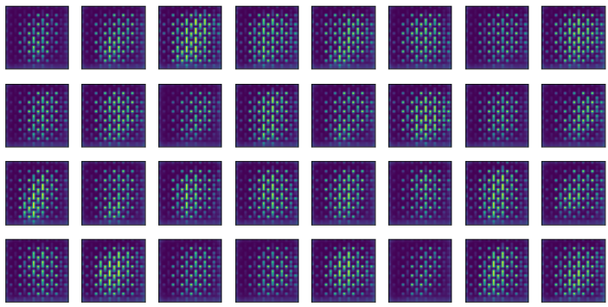

500 step 에서는 아직 숫자 모양이 나오지 않고 격자 무늬의 noise 만 보인다.

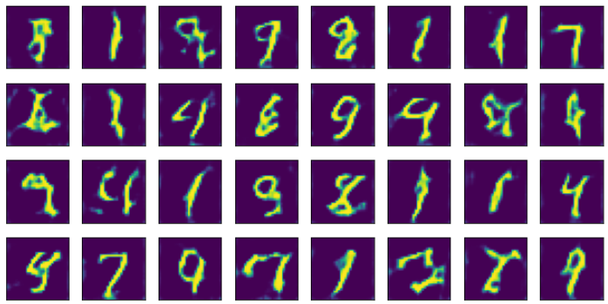

5000 step 에서는 1, 4, 7, 9 같은 숫자 모양이 뚜렷해지지만 획이 굵거나 흐트러진 것이 섞여 있다.

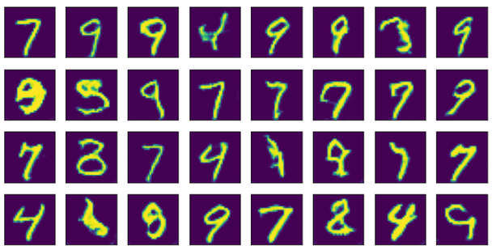

20000 step 에서는 대부분 손글씨 숫자로 읽히지만 일부는 여전히 뭉개져 있다. 학습 시간을 늘리면 나아지지만, GAN 은 step 을 늘린다고 단조롭게 좋아지지 않으므로 중간 저장본을 남겨 두고 비교하는 것이 실용적이다.

저장해 둔 생성기만 따로 불러와 이미지를 만들 수도 있다. 이때는 `Generator` 클래스 정의와 `show_images` 함수가 있어야 한다.

```python
latent_dim = 100
generator = torch.load(save_path+"dcgan_generator_mnist_20000.pt")

noise_data = torch.randn((batch_size, latent_dim))
show_images(0.5 * generator(noise_data.to(device)).cpu().detach().numpy() + 0.5)
```

---

## 6.4.9 실습과제
<!-- 슬라이드 598 -->

vanilla GAN 실습(실습 6.4.1)을 바탕으로 다음을 시도한다.

- 더 빠른 학습을 위해 모델을 개선해 보자(GAN 모델은 학습이 쉽지 않다).
- Latent space vector 를 늘리면? `latent_dim = ??`
- Discriminator, Generator 모델을 더 크게 하면??
- `epoch = 3000` 에서 유사한 수준의 학습이 가능할까?? 시도해 보자.

바꿀 때마다 판별기 정확도와 산점도가 어느 epoch 에서 겹치기 시작하는지를 기록해 두면 비교가 쉽다.

---

## 6.4.10 정리
<!-- 슬라이드 578~604 -->

- GAN 은 분포를 모델링하는 생성기 G 와 경계를 모델링하는 판별기 D 가 경쟁하는 구조다. D 는 Real/Fake label 로, G 는 D 의 판단 점수로 feedback 을 받는다.
- 학습이 끝나면 생성 분포가 real 분포와 겹치고 판별기의 출력은 0.5 에 수렴한다. 판별기 정확도 0.5, BCE loss 0.693 근처가 "잘 되고 있다" 는 신호다.
- 비용 함수는 two-player game 이다. D 는 $\log D(x) + \log(1 - D(G(z)))$ 를 gradient ascent 로 키우고, G 는 이를 gradient descent 로 줄인다. 실제 학습에는 초기 기울기가 큰 변형 loss $-\log D(G(z))$ 를 쓰며, 코드에서는 fake 에 Real label 을 넣은 BCE 로 구현한다.
- Training 절차는 "D 학습(real/fake, 정상 label) → D 고정 후 G 학습(fake, Real label)" 의 반복이며, PyTorch 에서는 optimizer 를 둘로 나누어 구현한다.
- 학습된 z-space 는 vector arithmetic 과 interpolation 이 의미 있게 동작하는 구조를 가진다.
- DCGAN 은 GAN 에 CNN 을 적용하여 이미지 생성을 최초로 성공한 모델이다. Tanh 출력, Gaussian latent, Dropout·label noise, stride 로 나누어지는 filter 크기 같은 휴리스틱이 학습을 돕는다.
- 실습 6.4.1 은 sin 곡선 위의 점을 생성하는 최소 GAN, 실습 6.4.2 는 transposed convolution 생성기와 convolution 판별기로 MNIST 숫자를 생성하는 DCGAN 이다.
