# 6.5 Improved GAN: CGAN, ACGAN, infoGAN

**학습 목표**

- DCGAN 이 만든 이미지를 제어할 수 없는 이유를 설명하고, label 을 조건으로 주는 Conditional GAN(CGAN)의 생성기·판별기 입력 구성을 코드로 구현할 수 있다.
- CGAN loss 함수가 GAN loss 함수에 조건부 확률 $D(x|y)$ 로 조건이 붙는 방식을 수식으로 설명할 수 있다.
- ACGAN 에서 판별기가 진위 판정과 label 분류라는 두 출력을 갖는 구조와, binary cross-entropy 와 categorical cross-entropy 를 함께 쓰는 학습 loop 를 구현할 수 있다.
- 잠재공간의 얽힌 표현(entangled representation)과 풀린 표현(disentangled representation)을 구분하고, infoGAN 이 상호정보량(mutual information) term 으로 잠재코드와 생성 이미지를 연결하는 원리를 설명할 수 있다.
- 변분 추론으로 상호정보량 loss $L_I$ 의 하한을 유도한 결과가 코드에서 왜 cross-entropy 형태의 `mi_loss` 가 되는지 설명하고, latent code 가 기울기·두께를 제어하는지 실험으로 확인할 수 있다.

**이 절의 구성**

- 6.5.1 Conditional GAN — 원하는 숫자를 생성하도록 조건을 주기
- 6.5.2 CGAN loss 함수 — 조건부 확률로 바뀐 GAN loss
- 6.5.3 실습 6.5.1 — CGAN 구현과 결과 확인
- 6.5.4 CGAN 의 응용 — Text to Image Synthesis
- 6.5.5 ACGAN — 보조 분류기를 가진 판별기
- 6.5.6 ACGAN loss 함수 — classification loss term 의 추가
- 6.5.7 실습 6.5.2 — ACGAN 구현과 결과 검토
- 6.5.8 InfoGAN — 얽힌 표현과 풀린 표현
- 6.5.9 InfoGAN loss 함수 — 상호정보량과 변분 추론
- 6.5.10 실습 6.5.3 — InfoGAN 구현과 latent code 특징 확인
- 6.5.11 그 밖의 GAN 모델
- 6.5.12 정리

---

## 6.5.1 Conditional GAN — 원하는 숫자를 생성하도록 조건을 주기
<!-- 슬라이드 606~607 -->

앞 절의 DCGAN 은 MNIST 손글씨를 그럴듯하게 만들어 내지만, 어떤 숫자가 나올지는 **랜덤**이다. 생성기의 입력이 noise vector $z$ 하나뿐이므로 "7 을 그려 달라" 고 요청할 방법이 없고, 특정 숫자를 제어할 수 없다. 이 문제를 해결하는 것이 Conditional GAN(CGAN) 이다. CGAN 은 특정 글자를 생성할 수 있도록 DCGAN 을 개선한 모델로, 한 줄로 요약하면 **DCGAN + Label(one-hot coding)** 이다.

조건(condition)은 label 의 one-hot code 다. 이 조건을 생성기와 판별기 양쪽에 모두 공급한다.

- **생성기** — latent vector 와 label 을 결합(concatenate)하여 입력으로 공급한다. 생성기는 noise 와 label 을 입력받아 그 label 에 해당하는 이미지를 생성한다.
- **판별기** — 조건을 이미지와 결합하여 입력에 공급한다. 판별기는 이미지와 label 을 함께 받아 "이 label 의 진짜 이미지인가" 를 판단한다.

기호로 쓰면 다음과 같다.

- $X$ = real image
- $C$ = label
- $Z$ = noise
- $D(x|y)$ = real OR fake — label $y$ 가 주어졌을 때 이미지 $x$ 의 진위 판정

아래 두 그림이 GAN 과 CGAN 의 차이를 보여 준다. GAN 에서는 판별기 $D$ 가 real 이미지 $x$ 와 생성기가 만든 $G(z)$ 만 받는다. CGAN 에서는 생성기 $G$ 의 입력에 조건 $c$ 가 붙고, 같은 $c$ 가 점선을 따라 판별기 $D$ 에도 들어간다.

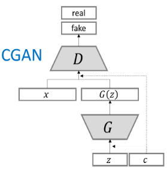

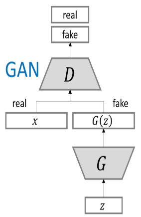

구조를 층 단위로 펼치면 다음 그림이 된다. 생성기는 $Z$(n-dim)와 fake image label(10-dim one-hot label)을 concatenate 한 뒤 Dense(7\*7\*256) → Reshape(7,7,256) → BN-ReLU → Conv2DTrans(128,5,s=2) → BN-ReLU → Conv2DTrans(64,5,s=2) → BN-ReLU → Conv2DTrans(1,5) → tanh 를 거쳐 fake image 를 만든다. 판별기 쪽은 조건을 이미지와 같은 형태(28x28)로 변형하는 것이 핵심이다. real image label(10-dim one-hot)을 Dense(28x28) → Reshape(28,28,1) 로 늘려 이미지와 같은 크기의 채널 하나로 만들고, real image 와 concatenate 하여 (28,28,2) 텐서를 만든 다음 Conv2D(64,5,s=2) → LeakyReLU(0.2) → Conv2D(128,5,s=2) → LeakyReLU(0.2) → Flatten → Dense(1) → Sigmoid 로 real or fake 를 출력한다. 이 출력과 real/fake label 사이의 binary loss 로 학습한다.


그림의 블록 이름(Dense, Conv2DTrans)은 층의 역할을 나타내는 일반 명칭이고, 실습 코드에서는 각각 `nn.Linear`, `nn.ConvTranspose2d` 가 그 자리를 맡는다.

> **핵심 메시지**
> CGAN 이 DCGAN 에 더한 것은 단 하나, **label 의 one-hot code 를 생성기와 판별기 양쪽 입력에 concatenate 하는 것**이다. 생성기는 "이 label 의 이미지를 만들라" 는 요구를 받고, 판별기는 "이 label 의 진짜 이미지인가" 를 판단하므로 label 을 무시한 이미지는 fake 로 걸러진다.

---

## 6.5.2 CGAN loss 함수 — 조건부 확률로 바뀐 GAN loss
<!-- 슬라이드 608 -->

GAN loss 함수부터 다시 적는다. 생성기는 이 값이 감소하도록, 판별기는 증가하도록 학습한다.

$$
\min_{\theta_g} \max_{\theta_d} \left[ E_{x \sim p_{data}} \log D_{\theta_d}(x) + E_{z \sim p(z)} \log \left( 1 - D_{\theta_d}(G_{\theta_g}(z)) \right) \right]
$$

첫 항은 real data 를 판단하는 항이고, 둘째 항은 fake data 를 판단하는 항이다. 판별기는 real 에 대해 $D$ 를 1 에, fake 에 대해 0 에 가깝게 만들어 대괄호 전체를 키우려 하고, 생성기는 $D(G(z))$ 를 1 에 가깝게 만들어 둘째 항을 줄이려 한다.

조건이 추가된 CGAN loss 함수는 각 항에 label 이 주어진다는 점만 다르다.

$$
\min_{\theta_g} \max_{\theta_d} \left[ E_{x \sim p_{data}} \log D_{\theta_d}(x|y) + E_{z \sim p(z)} \log \left( 1 - D_{\theta_d}(G_{\theta_g}(z|y')) \right) \right]
$$

조건 $y$ 가 이미지 $x$ 에 포함되므로 판별기의 출력은 "$y$ 가 주어졌을 때 $x$ 가 진짜일 확률", 곧 조건부 확률 $D(x|y)$ 가 된다. 첫 항은 **label 이 주어진 real data 를 판단하는** 항, 둘째 항은 **label $y'$ 이 주어진 fake data 를 판단하는** 항이다. 생성기 역시 $G(z|y')$ 처럼 label $y'$ 을 조건으로 받아 이미지를 만든다. 생성기의 label $y'$ 은 학습 데이터의 label 과 무관하게 무작위로 뽑는 fake label 이므로 기호를 구분해 두었다.

---

## 6.5.3 실습 6.5.1 — CGAN 구현과 결과 확인
<!-- 슬라이드 609~613 -->

### 실습 6.5.1 — CGAN
<!-- 슬라이드 609~613 -->

> 노트북: `code/6.5.1.CGAN.ipynb`
> [](https://colab.research.google.com/github/AI-BoostCamp/intermediate-deep-learning-pytorch/blob/main/code/6.5.1.CGAN.ipynb)

MNIST 로 CGAN 을 학습하고, 원하는 label 을 지정하여 그 숫자를 생성해 본다. 앞 절의 DCGAN 노트북과 같은 골격이지만, dataset 의 target 을 one-hot 으로 바꾸는 부분과 생성기·판별기가 label 을 함께 받는 부분이 새로 들어간다.

**모델 파라미터와 Dataset 준비**

latent vector 는 90차원, label 은 10차원 one-hot 이므로 생성기 입력은 100차원이다.

```python
BUFFER_SIZE = 60000
BATCH_SIZE = 600
label_dim=10    # class_num.
noise_dim = 90  # latent vector dim.
IN_PUT_DIM=label_dim+noise_dim  # 100
num_examples_to_generate = 16
IMG_SHAPE=(28,28,1)
```

이미지는 생성기 마지막 층이 `tanh` 이므로 $[-1, 1]$ 로 정규화하고, label 은 `torch.eye(10)[sample]` 로 one-hot 벡터로 바꾸는 `target_transform` 을 붙인다.

```python
import torchvision.transforms as v2
from torchvision.datasets import FashionMNIST, MNIST

class Normalize(object):
    def __call__(self, sample):
        sample = np.array(sample)
        image = (sample - 127.5) / 127.5
        image = torch.FloatTensor(image).unsqueeze(dim=0)
        return image #(1,28,28)

class Onehot(object):
    def __call__(self, sample):
        target = torch.eye(10)[sample]  #(b,10)
        return target

# Normalize data to [-1 ~ 1]
mnist_transform = v2.Compose([Normalize()])
target_transform = v2.Compose([Onehot()])

# download path 정의
download_root = './MNIST_DATASET'
train_dataset = MNIST(download_root, transform=mnist_transform, train=True,
                      download=True, target_transform=target_transform)
test_dataset = MNIST(download_root, transform=mnist_transform, train=False,
                     download=True, target_transform=target_transform)

train_dataloader = DataLoader(train_dataset, BATCH_SIZE, True, num_workers=4)
test_dataloader = DataLoader(test_dataset, BATCH_SIZE, False, num_workers=4)
```

**Generator model**

생성기는 $z$ vector 와 fake label 을 입력받아 생성한 image 를 출력한다. `forward(z, c)` 에서 두 입력을 `torch.cat([z, c], dim=1)` 로 이어 붙인 100차원 벡터를 `nn.Linear` 로 7\*7\*256 으로 늘리고, `nn.Unflatten` 으로 (256,7,7) feature map 으로 바꾼 뒤 transposed convolution 으로 두 번 upsampling 하여 (1,28,28) 이미지를 만든다.

```python
# Generator model
class Generator(nn.Module):
    def __init__(self, input_dim):
        super(Generator, self).__init__()
        self.generator = nn.Sequential(
            nn.Linear(input_dim, 256 * 7 * 7, bias=False),
            nn.Unflatten(1, (256, 7, 7)),
            nn.BatchNorm2d(256,momentum=0.8),
            nn.LeakyReLU(0.2),
            nn.ConvTranspose2d(256, 128, 5, 1,
                          padding=2, bias=False),
            nn.BatchNorm2d(128,momentum=0.8), #(128,7,7)
            nn.LeakyReLU(0.2),
            nn.ConvTranspose2d(128, 64, 5, 2,
                         padding=2, output_padding=1, bias=False),
            nn.BatchNorm2d(64,momentum=0.8),  #(64,14,14)
            nn.LeakyReLU(0.2),
            nn.ConvTranspose2d(64, 1, 5, 2,
                         padding=2, output_padding=1, bias=True),
            nn.Tanh() )         #(1,28,28)

    def forward(self, z, c):
        c = c.to(device)
        inputs = torch.cat([z, c], dim=1)
        out = self.generator(inputs)
        return out

z_vector = torch.randn((BATCH_SIZE, noise_dim), device=device)
generator = Generator(IN_PUT_DIM).to(device)
summary(generator, input_size=[(BATCH_SIZE, noise_dim), (BATCH_SIZE, label_dim)])
```

upsampling 을 맡는 층의 시그니처는 `nn.ConvTranspose2d(in_c, out_c, kernel_size, stride=1, padding=0, output_padding=0, ...)` 이다. 첫 번째 `ConvTranspose2d(256, 128, 5, 1, padding=2)` 는 stride 1 이라 크기를 7x7 로 유지한 채 채널만 128 로 줄이고, 뒤의 두 층은 stride 2 로 7 → 14 → 28 로 키운다. kernel 5, padding 2, stride 2 일 때 출력 크기가 정확히 두 배가 되도록 `output_padding=1` 을 준다. `summary` 에 입력 크기를 두 개의 튜플로 넘기는 것은 `forward` 가 `z` 와 `c` 두 인자를 받기 때문이다. 요약 결과에서 생성기의 파라미터는 총 2,280,896개(모두 학습 가능)이고 mult-adds 는 49.67 G 다.

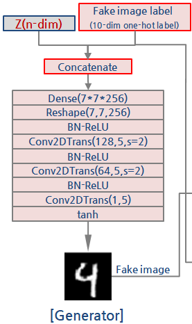

**Discriminator model**

판별기는 이미지 `x` 와 label `c` 를 받는다. `categoryLinear` 가 10차원 label 을 `nn.Linear(label_dim, 28*28)` 로 784 차원으로 늘리고 `nn.Unflatten` 으로 (1,28,28) 로 바꿔, 이미지와 **채널 방향으로** concatenate 한다. 그래서 첫 convolution 의 입력 채널이 2 다. 이후는 DCGAN 판별기와 같이 stride 2 convolution 두 번으로 (128,7,7) 까지 줄인 뒤 `Flatten` → `Linear(6272, 1)` → `Sigmoid` 로 진위 확률 하나를 낸다.

```python
# Discriminator model
class Discriminator(nn.Module):
    def __init__(self, label_dim):
        super(Discriminator, self).__init__()
        self.categoryLinear = nn.Sequential(
            nn.Linear(label_dim, 28*28),
            nn.Unflatten(1, (1, 28, 28)) )
        self.discriminator = nn.Sequential(
            nn.Conv2d(2, 64, 5, 2, padding=2), #(64,14,14)
            nn.LeakyReLU(0.2),
            nn.Dropout(0.25),
            nn.Conv2d(64, 128, 5, 2, padding=2),#(128,7,7)
            nn.LeakyReLU(0.2),
            nn.Dropout(0.25),
            nn.Flatten(),                       #(6272,)
            nn.Linear(128*7*7, 1),
            nn.Sigmoid() )

    def forward(self, x, c):                   #x:(1,28,28)
        cat_out = self.categoryLinear(c)       #(1,28,28)
        inputs = torch.cat([x, cat_out], dim=1)#(2,28,28)
        out = self.discriminator(inputs)
        return out

discriminator = Discriminator(label_dim).to(device)
summary(discriminator, input_size=[(BATCH_SIZE, 1, 28, 28), (BATCH_SIZE, label_dim)])
```

판별기의 파라미터는 총 223,089개, mult-adds 는 6.42 G 로 생성기보다 훨씬 가볍다. 판별기 쪽 구조도를 보면 label 이 Dense(28x28) → Reshape(28,28,1) 을 거쳐 real image 와 합쳐져 (28,28,2) 가 되는 경로가 그려져 있다.


**학습 조건 설정**

loss 는 진위 판정 하나뿐이므로 `nn.BCELoss` 하나를 쓰고, 생성기와 판별기에 각각 Adam optimizer 를 둔다.

```python
lr = 2e-4
loss_function = nn.BCELoss()

generator = generator.to(device)
discriminator = discriminator.to(device)
optimizer_d = torch.optim.Adam(discriminator.parameters(), lr=lr)
optimizer_g = torch.optim.Adam(generator.parameters(), lr=lr)
```

생성기 입력으로 들어가는 $z$ vector 와 fake label 은 매번 새로 뽑는다. noise 는 표준정규분포에서, label 은 0\~9 를 균등하게 뽑아 one-hot 으로 바꾼다.

```python
def generator_input(batch_size):
    # Generator inputs
    sampled_noise = torch.randn(batch_size, noise_dim) #(b,90)
    sampled_labels = torch.randint(10, (batch_size,))  #(b,)
    sampled_labels = torch.eye(10)[sampled_labels]  #(b,10)
    return sampled_noise, sampled_labels #((b,90),(b,10))
```

**Training loop**

한 batch 마다 판별기 한 번, 생성기 한 번 순서로 갱신한다. 판별기 단계에서는 real 이미지 batch 와 생성기가 만든 fake 이미지를 `torch.cat` 으로 한 덩어리로 합치고, 그에 맞춰 label 도 real label 과 fake label 을 합치며, 정답은 real 에 1, fake 에 0 을 준다. 판별기는 이미지와 label 을 함께 보고 진위를 맞히도록 학습한다. 생성기 단계에서는 새 noise 와 fake label 로 이미지를 만들고, 판별기가 그 이미지를 `y_r`(1) 로 판정하도록 생성기만 갱신한다. 생성기 loss 를 계산할 때 판별기에 넣는 label 이 생성에 쓴 `f_labels` 와 같다는 점이 중요하다. 판별기가 "이 label 의 진짜" 라고 믿게 하려면 생성기는 label 에 맞는 숫자를 그려야 하기 때문이다.

```python
EPOCHS = 100
for epoch in range(EPOCHS):
    for image_batch, real_label in train_dataloader:
        image_batch = image_batch.to(device)
        real_label = real_label.to(device)
        noise, f_labels = generator_input(BATCH_SIZE)
        noise, f_labels = noise.to(device), f_labels.to(device)
        f_img = generator(noise, f_labels)
        con_imgs = torch.cat([image_batch,f_img])
        con_labels = torch.cat([real_label,f_labels])
        y_r = torch.ones((BATCH_SIZE,1)).to(device)
        y_f = torch.zeros((BATCH_SIZE,1)).to(device)
        con_y = torch.cat([y_r,y_f])
        # Discriminator
        discriminator.zero_grad()
        out_dis = discriminator(con_imgs, con_labels)
        loss_d = loss_function(out_dis, con_y)
        loss_d.backward()
        optimizer_d.step()
        # Generator
        noise, f_labels = generator_input(BATCH_SIZE)
        noise, f_labels = noise.to(device), f_labels.to(device)
        generator.zero_grad()
        f_img = generator(noise, f_labels)
        out_dis = discriminator(f_img, f_labels)
        loss_g = loss_function(out_dis, y_r)
        loss_g.backward()
        optimizer_g.step()

    # Show loss
    if epoch % 10 == 0:  #10 #학습된 gen.의 성능 확인
        print(f"Epoch: {epoch} Loss D.: {loss_d}")
        print(f"Epoch: {epoch} Loss G.: {loss_g}")
        generate_and_save_images(generator, epoch)
```

10 epoch 마다 `generate_and_save_images` 로 생성기 성능을 확인한다. 이 함수는 아래 결과 확인 코드와 같은 방식으로 label 0\~9 마다 이미지 10장씩을 격자로 그려 파일로 저장한다.

**학습 결과 확인 — Generator 성능 확인**

학습이 끝난 생성기에 $z$ vector 와 **원하는 label** 을 붙여 넣으면 원하는 이미지가 생성된다. 열(column) 번호 `i` 를 label 로 삼아 `np.eye(r, 10)[np.full(fill_value=i, shape=(r))]` 로 같은 label 의 one-hot 10개를 만들고, 서로 다른 noise 10개와 함께 생성기에 넣는다. 결과는 열마다 같은 숫자, 행마다 다른 필체가 된다.

```python
r, c = 10, 10
fig = plt.figure(figsize=(6,6))
plt.subplots_adjust(top=1, bottom=0, hspace=0, wspace=0.05)
for i in range(c):
    sampled_noise, _ = generator_input(c) # Fake label은 버리고
    # 0~9 까지 새로운 label생성
    new_label = np.eye(r, 10)[
          np.full(fill_value=i, shape=(r))] # 10개씩 준비
        # z와 new_label 10개를 입력으로 이미지 추론
    gen_imgs = generator(sampled_noise.to(device), torch.Tensor(new_label).to(device))
    gen_imgs = 0.5 * gen_imgs + 0.5  # (0~1)<-(-1~1) scaling
    for j in range(r):
        ax = fig.add_subplot(r, c, j * r + i + 1)
        ax.imshow(gen_imgs.cpu().detach().numpy()[j,0, :, :], cmap=plt.cm.bone)
        ax.xaxis.set_ticks([])
        ax.yaxis.set_ticks([])
plt.tight_layout()
plt.show()
```

생성기 출력은 `tanh` 를 거친 $[-1,1]$ 이므로 `0.5 * gen_imgs + 0.5` 로 $[0,1]$ 로 되돌린 뒤 그린다. 학습한 모델은 `torch.save(generator, '/content/models/PT/cgan_generator.pt')` 로 저장해 두고 `torch.load` 로 다시 불러 같은 코드로 원하는 글자를 생성할 수 있다.

epoch 이 늘어남에 따라 생성 결과가 어떻게 달라지는지 보자. 10 epoch 에서는 열마다 같은 숫자여야 하는데 획이 뭉개져 무슨 숫자인지 알아보기 어렵고, 20 epoch 에서는 0·1·2 같은 단순한 숫자부터 형태가 잡히기 시작한다. 40 epoch 이면 대부분의 열이 label 대로 읽히고, 80 epoch 에서는 열마다 0 부터 9 까지 또렷하게 label 에 맞는 숫자가 생성된다.

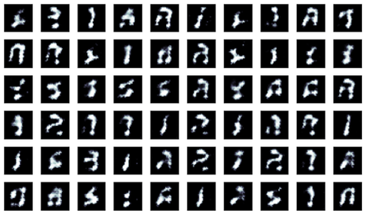

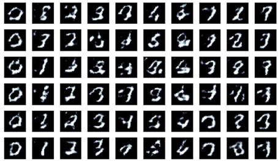

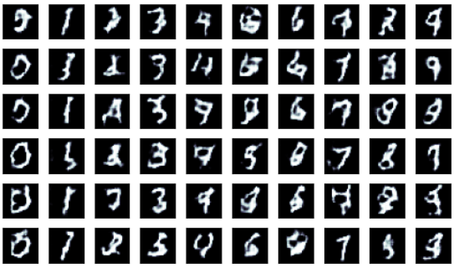

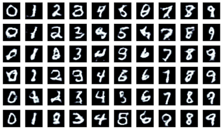

---

## 6.5.4 CGAN 의 응용 — Text to Image Synthesis
<!-- 슬라이드 614 -->

조건이 꼭 one-hot label 일 필요는 없다. CGAN 의 응용으로 "Generative Adversarial Text to Image Synthesis"(Scott Reed, 2016)가 있다. 이 연구는 조건으로 **문장의 embedding** 을 쓴다. 아래 구조도(text-conditional convolutional GAN architecture)에서 "This flower has small, round violet petals with a dark purple center" 같은 문장을 text encoding $\varphi(t)$ 로 바꾸고, 생성기에서는 noise $z \sim N(0,1)$ 와 concatenate 하여 이미지 $\hat{x} = G(z, \varphi(t))$ 를 만든다. 판별기에서도 같은 $\varphi(t)$ 를 더 낮은 차원으로 projection 한 뒤 이미지의 feature map 에 depth 방향으로 concatenate 하여 $D(\hat{x}, \varphi(t))$ 를 계산한다. 한 label 을 (28,28,1) 채널로 늘려 이미지와 합치던 MNIST CGAN 판별기와 같은 발상이다.

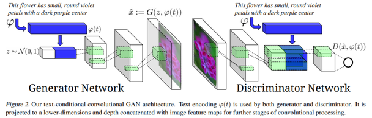

결과 그림은 위 줄이 실제 꽃 사진(GT), 아래 두 줄이 문장을 조건으로 생성한 꽃 이미지(GAN, GAN-CLS)다. "white and pink petals", "bright droopy yellow petals" 같은 문장의 묘사가 생성된 꽃의 색과 모양에 반영되어 있다.

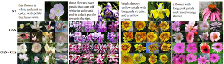

---

## 6.5.5 ACGAN — 보조 분류기를 가진 판별기
<!-- 슬라이드 615~616 -->

ACGAN(Auxiliary Classifier GAN)은 CGAN 과 목적이 같다 — label 을 지정하여 원하는 숫자를 생성한다. 다른 점은 label 을 판별기에 **입력으로 넣지 않고 출력으로 맞히게 한다**는 것이다.

- **생성기** — CGAN 과 동일하다. noise 와 label 을 concatenate 하여 이미지를 만든다.
- **판별기** — 2개의 모델로 구성된다. 참/거짓을 구분하는 모델에, 이미지의 label 을 판단하는 모델(보조 분류기)이 더해진다. 이미지 진위는 binary cross-entropy 로, 이미지 label 판단은 categorical cross-entropy 로 학습한다.

보조 모델은 왜 두는가. CGAN 은 부가 정보(label)를 판별기에 직접 공급하지만, ACGAN 은 보조 클래스 디코더 네트워크를 사용하여 부가 정보를 **재구성**한다. 네트워크에 주어진 보조 작업(분류)이 주 작업(fake 이미지 생성)의 성능을 향상시킨다는 것이 보조 모델의 장점이다. 판별기가 "무슨 숫자인가" 까지 맞혀야 하므로 이미지의 class 를 구분하는 feature 를 배우게 되고, 생성기는 그 판별기를 속이기 위해 label 에 맞는 특징을 더 분명히 그리게 된다.

두 구조도를 나란히 놓고 비교하면 ACGAN 쪽이 정보 흐름이 간결하다. CGAN 판별기에서는 label 이 Dense(28x28) → Reshape 를 거쳐 입력에 합쳐지는 경로가 있었는데, ACGAN 판별기는 real image 하나만 입력받고 대신 출력이 둘이다. 공통 convolution 뒤에서 한 갈래는 Dense(1) → Sigmoid 로 real or fake 를 내어 binary loss 를 계산하고, 다른 갈래는 Dense(128) → Dense(10) → Softmax 로 predicted label 을 내어 fake image label 또는 real image 의 10-dim one-hot label 과 categorical loss 를 계산한다.

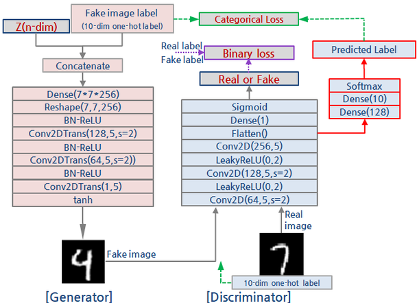

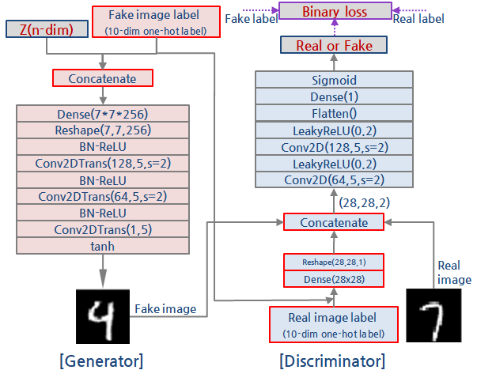

---

## 6.5.6 ACGAN loss 함수 — classification loss term 의 추가
<!-- 슬라이드 617 -->

ACGAN loss 함수는 CGAN loss 함수에 classification loss term 을 추가한 것이다. 판별기 출력이 둘이므로 loss 도 둘이다.

- **판별기** — cgan loss + classification loss 전체가 **최대**가 되도록 학습한다. 진위를 가리는 것에 더해 이미지 분류 능력이라는 추가 조건을 요구받으므로 성능이 향상된다. classification loss 는 real data 에 대한 분류기 성능과 fake data 에 대한 분류기 성능을 모두 포함한다.
- **생성기** — cgan loss + classification loss 전체가 **최소**가 되도록 학습한다(학습률을 위해서 변형한다). 판별기의 진위 판정뿐 아니라 판별기의 분류 능력도 속여야 한다는 추가 조건이 붙으므로, 곧 label 에 맞는 이미지를 그려야만 loss 가 줄어드므로 성능이 향상된다.

실습 코드로 옮기면 판별기 loss 는 `bce_loss(진위) + cce_loss(label)` 을 real batch 와 fake batch 에 대해 각각 구해 평균한 것이고, 생성기 loss 는 fake 이미지에 대해 판별기가 real(1) 이라 답하도록 하는 `bce_loss` 와 생성에 쓴 fake label 을 그대로 맞히도록 하는 `cce_loss` 의 합이다. "학습률을 위해서 변형" 한다는 것은 원래 GAN 의 $\log(1 - D(G(z)))$ 를 최소화하는 대신 $D(G(z))$ 를 1 로 만드는 방향으로 생성기를 학습하는 통상의 방식을 가리킨다.

---

## 6.5.7 실습 6.5.2 — ACGAN 구현과 결과 검토
<!-- 슬라이드 618~621 -->

### 실습 6.5.2 — ACGAN
<!-- 슬라이드 618~621 -->

> 노트북: `code/6.5.2.ACGAN.ipynb`
> [](https://colab.research.google.com/github/AI-BoostCamp/intermediate-deep-learning-pytorch/blob/main/code/6.5.2.ACGAN.ipynb)

Dataset 준비와 모델 파라미터는 실습 6.5.1 과 같다(이미지는 $[-1,1]$ 정규화, label 은 one-hot, `noise_dim = 90`, `label_dim = 10`).

**Generator — CGAN 과 동일**

`ACGenerator` 는 클래스 이름만 다를 뿐 실습 6.5.1 의 `Generator` 와 같은 층 구성이고, `forward(z, c)` 에서 noise 와 label 을 concatenate 한다.

```python
acgenerator = ACGenerator(IN_PUT_DIM).to(device)
summary(acgenerator, input_size=[(BATCH_SIZE, noise_dim), (BATCH_SIZE, label_dim)])
```

**Discriminator — 하나의 입력, 두 개의 출력(disc, label)**

판별기의 입력 채널이 1 로 돌아갔다. label 을 입력에 붙이지 않기 때문이다. 공통 convolution 부분 `discriminator` 가 (1,28,28) 이미지를 6272 차원 feature 로 만들면, `discLinear` 가 `Linear(6272,1)` → `Sigmoid` 로 진위 확률을, `acLinear` 가 `Linear(6272,128)` → `Linear(128,10)` 으로 10 class 의 logit 을 낸다. `forward` 가 `(disc_out, label_out)` 두 값을 반환한다. `acLinear` 끝에 softmax 가 없는 것은 뒤에서 쓰는 `nn.CrossEntropyLoss` 가 logit 을 받아 내부에서 softmax 를 계산하기 때문이다.

```python
# ACDiscriminator model
class ACDiscriminator(nn.Module):
    def __init__(self, label_dim):
        super(ACDiscriminator, self).__init__()
        self.discriminator = nn.Sequential(
            nn.Conv2d(1, 64, 5, 2, padding=2),
            nn.LeakyReLU(0.2), nn.Dropout(0.25),
            nn.Conv2d(64, 128, 5, 2, padding=2),
            nn.LeakyReLU(0.2), nn.Dropout(0.25),
            nn.Flatten() )
        self.discLinear = nn.Sequential(
            nn.Linear(128*7*7, 1),
            nn.Sigmoid() )
        self.acLinear = nn.Sequential(
            nn.Linear(128*7*7, 128),
            nn.Linear(128, label_dim) )
    def forward(self, x):
        out = self.discriminator(x)
        disc_out = self.discLinear(out)
        label_out = self.acLinear(out)
        return disc_out, label_out

acdiscriminator = ACDiscriminator(label_dim).to(device)
summary(acdiscriminator, input_size=[(BATCH_SIZE, 1, 28, 28)])
```

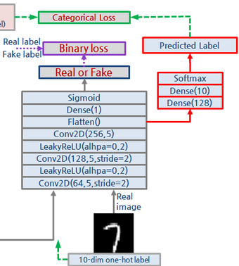

**Training 조건 — 두 가지 loss**

판별기 출력이 두 개이므로 두 가지 loss 를 정의해야 한다. 이미지의 진위 판별에는 binary cross-entropy(`nn.BCELoss`), class 판별에는 categorical cross-entropy(`nn.CrossEntropyLoss`)를 쓰고, 두 loss 는 **동일한 가중치**로 더한다. 원문은 이 학습 조건 설정이 두 모델(생성기·판별기)의 학습 속도를 조절해 준다고 설명한다 — 두 optimizer 의 학습률을 같은 `lr` 로 맞추어 두는 것이다.

```python
lr = 2e-4
bce_loss = nn.BCELoss()
cce_loss = nn.CrossEntropyLoss()

acgenerator = acgenerator.to(device)
acdiscriminator = acdiscriminator.to(device)
optimizer_discriminator = torch.optim.Adam(acdiscriminator.parameters(), lr=lr)
optimizer_generator = torch.optim.Adam(acgenerator.parameters(), lr=lr)
```

**Training loop**

판별기 단계에서는 real batch 와 fake batch 를 따로 판별기에 넣는다. real batch 에 대해서는 진위 정답 `yb_real`(1) 과 실제 label `real_labels` 로, fake batch 에 대해서는 `yb_fake`(0) 과 생성에 쓴 `fake_labels` 로 각각 `bce + cce` 를 계산하고, 두 loss 의 평균 `(loss_real + loss_fake) / 2` 를 판별기 loss 로 삼는다. 평균을 취하므로 real 과 fake 를 합쳐 한 번에 넣던 CGAN 방식과 loss 의 크기가 맞는다. fake 이미지에 `.detach()` 를 붙여 판별기 loss 의 gradient 가 생성기로 흘러가지 않게 한다. 생성기 단계에서는 새로 만든 fake 이미지에 대해 판별기가 real(1) 이라 답하고 fake label 을 그대로 맞히도록 생성기만 갱신한다.

```python
BATCH_SIZE = 600
EPOCHS = 100
for epoch in range(EPOCHS):
    for real_imgs, real_label in train_dataloader:
        real_imgs = real_imgs.to(device)
        real_labels = real_label.to(device)
        # Generate fake imgae, lable
        noise = torch.randn((BATCH_SIZE, noise_dim)).to(device)
        fake_labels = np.random.randint(0, 10, BATCH_SIZE)
        fake_labels = torch.FloatTensor(np.eye(BATCH_SIZE, 10)[fake_labels]).to(device)
        fake_imgs = acgenerator(noise, fake_labels)
        yb_real = torch.Tensor(BATCH_SIZE,1).fill_(1.0).to(device) # real_label
        yb_fake = torch.Tensor(BATCH_SIZE,1).fill_(0.0).to(device) # fake_label
        # Discriminator Training
        acdiscriminator.zero_grad()
        out_dis, out_label = acdiscriminator(real_imgs)
        loss_real = bce_loss(out_dis, yb_real)+ cce_loss(out_label, real_labels)
        out_dis, out_label = acdiscriminator(fake_imgs.detach())
        loss_fake = bce_loss(out_dis, yb_fake)+ cce_loss(out_label, fake_labels)
        loss_dis = (loss_real + loss_fake) / 2
        loss_dis.backward()
        optimizer_discriminator.step()
        # Generate fake image, label
        noise = torch.randn((BATCH_SIZE, noise_dim)).to(device)
        fake_labels = np.random.randint(0, 10, BATCH_SIZE)
        fake_labels = torch.FloatTensor(np.eye(BATCH_SIZE, 10)[fake_labels]).to(device)
        fake_imgs = acgenerator(noise, fake_labels)
        # Generator Training
        acgenerator.zero_grad()
        out_dis, out_label = acdiscriminator(fake_imgs)
        loss_gen = bce_loss(out_dis, yb_real)+ cce_loss(out_label, fake_labels)
        loss_gen.backward()
        optimizer_generator.step()
    if epoch % 10 == 0:  #10 #학습된 gen.의 성능 확인
        print(f"Epoch:{epoch} Loss D:{loss_dis} Loss G:{loss_gen}")
        generate_and_save_images(acgenerator, epoch)
```

`np.eye(BATCH_SIZE, 10)[fake_labels]` 는 600x10 단위행렬의 행을 label 번호로 골라 one-hot 을 만드는 관용구다. 학습이 끝나면 `torch.save(acgenerator, '/content/models/PT/acgan_generator.pt')` 로 저장해 두고, 실습 6.5.1 과 같은 코드로 열마다 label 0\~9 를 지정한 10x10 격자를 생성하여 결과를 검토한다.

**결과 검토 — CGAN 보다 빠르고 안정적인 학습**

같은 10·20·40·80 epoch 시점의 생성 결과를 CGAN 과 비교해 보면 ACGAN 이 더 빠르고 안정적으로 학습된다. 10 epoch 에서 이미 열마다 0\~9 의 형태가 구분되고, 20 epoch 이면 대부분 읽을 수 있는 숫자가 되며, 40·80 epoch 에서는 필체만 다를 뿐 label 대로 또렷한 숫자가 생성된다. CGAN 이 10 epoch 에서 숫자를 알아보기 어려웠던 것과 대조된다.

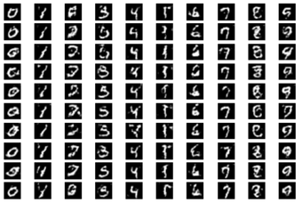

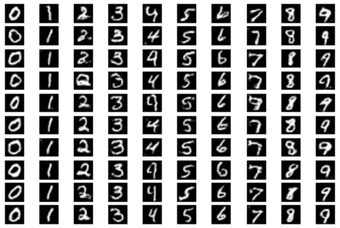

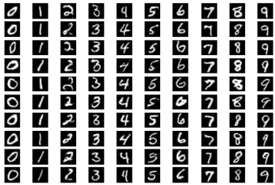

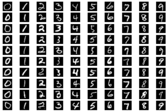

---

## 6.5.8 InfoGAN — 얽힌 표현과 풀린 표현
<!-- 슬라이드 622~623 -->

CGAN 과 ACGAN 으로 원하는 숫자를 생성할 수 있게 되었다. 그러나 그 이상의 특징은 요구할 수 없다. 원하는 정도로 기울어진 숫자, 원하는 만큼 굵은 숫자를 생성할 수는 없다. 원인은 잠재공간에 정보들이 **얽혀** 있다는 데 있다. 100차원 $z$ vector 의 어느 성분이 기울기를 담당하고 어느 성분이 굵기를 담당하는지 알 수 없으므로, 특정 성분을 움직여도 여러 특징이 한꺼번에 바뀐다.

그래서 잠재공간의 코드를 풀어서 정리해 보자는 것이 InfoGAN 의 출발점이다.

- **얽힌 표현(entangled representations)** — 잠재공간에 정보가 얽혀 있어서 해석이 불가능한 표현
- **풀린 표현(disentangled representations)** — 해석 가능한 표현
- 전체 잠재공간 $Z = (z, c)$ — $z$ 는 얽힌 코드(noise vector), $c$ 는 풀린 코드(latent code)

아래 그림이 이 구분을 보여 준다. 얽힌 표현 GAN(CGAN, ACGAN)은 100-dim 얽힌 코드(z_vector) 하나가 전부다. 풀린 표현 GAN(infoGAN)은 n-dim 얽힌 코드 옆에 성별 코드·머리모양 코드·표정 코드·살결 코드·눈색 코드처럼 해석 가능한 z-vector 영역을 따로 둔다. 원 논문은 https://arxiv.org/pdf/1606.03657.pdf 에 있다.

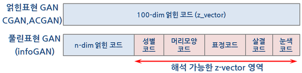

**infoGAN 구조**

구조 변화는 두 가지다.

- 생성기 입력에 잠재코드를 추가한다.
- 판별기 출력에 잠재코드를 추가한다.

아래 구조도에서 생성기 입력은 $Z$(n-dim), 10-dim label, 1-dim code1, 1-dim code2 를 concatenate 한 것이고, 판별기는 ACGAN 의 두 출력(real or fake, predicted label)에 더해 Dense(1) 과 Sigmoid 로 code1', code2' 을 복원하는 출력 두 개를 더 갖는다. 생성에 넣은 $c$ 와 판별기가 복원한 $c'$ 사이의 mutual information loss 가 새로 추가되는 loss 다.

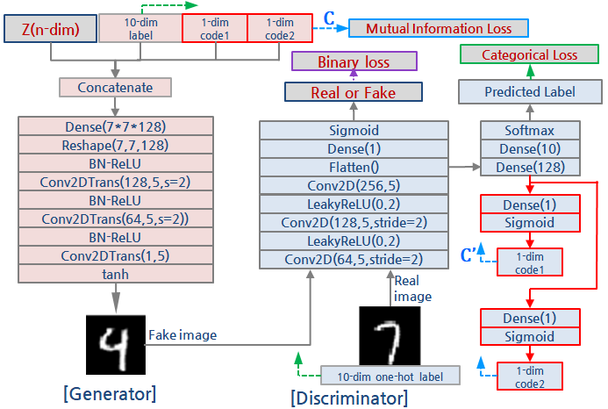

---

## 6.5.9 InfoGAN loss 함수 — 상호정보량과 변분 추론
<!-- 슬라이드 624~625 -->

**InfoGAN 표현하기**

잠재공간에 얽힌 표현과 풀린 표현이 같이 있다고 하고 $Z = (z, c)$ 라 하자. 얽힌 code 부분을 $z$(noise vector), 해석 가능한 부분을 $c$(latent code)라 할 때, $c = (c_1, c_2, c_3, \dots, c_L)$ 은 분리 가능한 잠재 코드들로 이루어지며 서로 독립이라고 가정한다.

$$
p(c_1, c_2, c_3, \dots, c_L) = \prod_{i=1}^{L} p(c_i)
$$

생성기가 생성한 이미지 $x$ 는 $x = G(z, c) = G(z)$ 이다. 생성기 입장에서는 $Z$ 가 분리되었는지 아닌지 구분하지 않는다 — 그냥 하나의 입력 벡터일 뿐이다. 따라서 아무 조치를 하지 않으면 $P_g(x|c) = P_g(x)$ 가 된다. 생성된 이미지가 $c$ 와 무관해지고, $c$ 는 무시된다는 뜻이다.

이를 막기 위해 loss 함수에 **상호정보량(mutual information)** term 을 추가한다. 상호정보량은 두 확률변수의 의존성으로, 서로 독립일 때 0 이 되며, 한 확률변수가 다른 확률변수에 대해 갖는 정보량, 곧 공유 entropy 다.

$$
I(X;Y) = D_{KL}\left( P(X,Y) \,\|\, P(X)P(Y) \right) = H(X) - H(X|Y)
$$

$x, y$ 의 joint distribution 과 두 marginal 의 곱 사이의 KLD 값으로 정의되며, 두 분포 정보량의 차이의 기대값이다. 아래 그림에서 $I(X;Y)$ 는 두 entropy 원의 겹치는 부분(joint entropy 가운데 공유되는 영역)이고, $H(X|Y)$ 와 $H(Y|X)$ 는 각각 상대를 알고도 남는 불확실성이다.

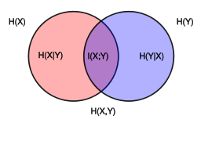

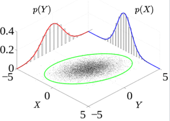

기존 loss 함수를 $V(D,G)$ 라 하면 infoGAN 의 loss 함수는 여기서 상호정보량 term(잠재코드와 생성된 결과의 상호정보량)을 **뺀** 것이다.

$$
V_{info}(D,G) = V(D,G) - I(c; G(z,c))
$$

상호정보량이 클 때, 곧 생성 이미지와 잠재코드의 의미가 연결될 때 G loss 가 감소한다. 따라서 생성기는 잠재코드에 연관된 학습을 하도록 유도된다.

**상호정보량 Loss $L_I$**

상호정보량 loss $L_I$ 는 생성 이미지와 잠재코드의 상호정보량이다.

$$
L_I = I(c; G(z,c)) = H(c) - H(c|G(z,c))
$$

$G(z,c)$ 가 주어졌을 때 $c$ 를 잘 복원할 수 있다면 $H(c|G(z,c))$ 가 작아지고, $I(c; G(z,c))$ 가 증가한다. 그런데 이 값을 계산하려면 $P(c|G(z,c)) = P(c|x)$ 를 알아야 한다($c$ 는 latent code 의 정답 분포). 학습 이미지에 대한 $c$ 의 정답 분포 $P(c|x)$ 는 알 수 없으므로(intractable) **변분 추론**이 필요하다.

**변분 추론으로 loss 함수 유도**

VAE 에서 $p(x|z)$ 추론을 $q(z|x)$ 로 근사하고 ELBO 를 적용한 것과 같은 방법을 쓴다. 알 수 없는 $P(c|x)$ 대신 판별기가 출력하는 근사 분포 $Q(c|x)$ 를 도입한다.

$$
L_I = I(c; G(z,c)) = H(c) - H(c|G(z,c))
$$

$$
= E_{x \sim G(z,c)} \left[ E_{c \sim P(c|x)} \left[ \log P(c|x) \right] \right] + H(c)
$$

$$
= E_{x \sim G(z,c)} \left[ D_{KL}\left( P(\cdot|x) \,\|\, Q(\cdot|x) \right) + E_{c \sim P(c|x)} \left[ \log Q(c|x) \right] \right] + H(c)
$$

$$
\geq L_I(G,Q) = E_{x \sim G(z,c)} \left[ E_{c \sim P(c|x)} \left[ \log Q(c|x) \right] \right] + H(c)
$$

두 번째 줄은 조건부 entropy 의 정의 $H(c|x) = -E[\log P(c|x)]$ 를 대입한 것이다. 세 번째 줄에서 $\log P(c|x)$ 를 $\log Q(c|x)$ 와 두 분포의 KLD 로 나누어 쓴다. KLD 는 항상 $\geq 0$ 이므로 이 항을 **삭제**하면 부등식이 되어 하한 $L_I(G,Q)$ 를 얻는다. $H(c)$ 는 $c$ 의 사전 분포에서 정해지는 **상수**이므로 계산에서 제외한다. 남는 것은 $E_{c \sim P(c|x)}[\log Q(c|x)]$ 뿐이고, 이것을 최대화하는 것이 $L_I$ 를 최대화하는 것이다.

**mi_loss — $c$ 와 $c'$ 의 cross entropy**

남은 항은 cross entropy 다. cross entropy 의 정의가

$$
H(p,q) = -E_p\left[ \log q \right]
$$

이므로

$$
E_{c \sim P(c|x)} \left[ \log Q(c|x) \right] = \sum p(c|x) \log Q(c|x)
$$

이 되고, 이는 $-H(P, Q)$ 다. 여기서 $Q(c|x)$ 는 판별기 $D$ 의 latent code 출력(코드의 `q_of_c_given_x`, sigmoid 출력)이다. 따라서 상호정보량을 **최대화**하는 것은 생성에 넣은 코드 $c$ 와 판별기가 복원한 코드 $c'$ 사이의 cross entropy 를 **최소화**하는 것과 같다. 코드로 옮기면 `mi_loss = - c * log(Q(c|x))` 다.

```python
### mutual information 계산
# noise z와 code c를 가지고 생성한 이미지 x
# 이미지 x로 부터 구한 코드 c'
# c분포와 c'분포의 cross entropy 계산
# mi_loss = - c * log(Q(c|x))
def mi_loss(q_of_c_given_x, c):
    r = -torch.mean(torch.sum(
          c * torch.log( q_of_c_given_x + 1e-7), dim=1 ))
    return r
```

`torch.sum(..., dim=1)` 이 코드 차원에 대한 $\sum$ 이고, `torch.mean` 이 batch 에 대한 기대값 $E_{x \sim G(z,c)}$ 다. `1e-7` 은 $\log 0$ 을 막는 작은 값이다.

> **핵심 메시지**
> InfoGAN 의 새 loss 는 "생성에 넣은 잠재코드 $c$ 를 판별기가 생성 이미지에서 다시 읽어낼 수 있어야 한다" 는 요구다. 이 요구를 상호정보량 $I(c; G(z,c))$ 로 쓰고, 계산할 수 없는 $P(c|x)$ 를 판별기 출력 $Q(c|x)$ 로 근사하면 익숙한 cross-entropy 하나가 남는다.

---

## 6.5.10 실습 6.5.3 — InfoGAN 구현과 latent code 특징 확인
<!-- 슬라이드 626~631 -->

### 실습 6.5.3 — InfoGAN
<!-- 슬라이드 626~631 -->

> 노트북: `code/6.5.3.InfoGan.ipynb` (다른 판: `code/6.5.3.infoGAN2.ipynb`)
> [](https://colab.research.google.com/github/AI-BoostCamp/intermediate-deep-learning-pytorch/blob/main/code/6.5.3.InfoGan.ipynb)

ACGAN 에 1차원 latent code 두 개(code1, code2)를 더한 InfoGAN 을 MNIST 로 학습하고, 학습 뒤 code1 과 code2 를 연속적으로 바꿔 가며 어떤 특징이 제어되는지 관찰한다. Dataset 준비는 앞 두 실습과 같다. 모델 파라미터에서 `latent_code_dim = 10` 은 class label 의 차원이고, 여기에 code1·code2 가 1차원씩 추가된다.

```python
BUFFER_SIZE = 60000
BATCH_SIZE = 600
EPOCHS = 100
latent_code_dim=10  ## latent code
noise_dim = 90      ## z-vector
IN_PUT_DIM=latent_code_dim+noise_dim
num_examples_to_generate = 16
IMG_SHAPE=(1,28,28)
```

**Generator — 입력에 잠재코드 2종류 추가**

생성기의 층 구성은 CGAN·ACGAN 과 같다. 달라진 것은 `forward(noise, label, code1, code2)` 가 네 입력을 받아 `torch.cat([noise, label, code1, code2], dim=1)` 로 이어 붙이는 부분이며, 그래서 입력 차원이 `noise_dim + latent_code_dim + 1 + 1` = 102 다.

```python
# InfoGenerator model
class InfoGenerator(nn.Module):
    def __init__(self, input_dim):
        super(InfoGenerator, self).__init__()
        self.generator = nn.Sequential(
            nn.Linear(input_dim, 256*7*7, bias=False),
            nn.Unflatten(1, (256, 7, 7)),    #(?,12544)
            nn.BatchNorm2d(256,momentum=0.8),#(256,7,7)
            nn.LeakyReLU(0.2),
            nn.ConvTranspose2d(256, 128, 5, 1, padding=2, bias=False),
            nn.BatchNorm2d(128,momentum=0.8),#(128,14,14)
            nn.LeakyReLU(0.2),
            nn.ConvTranspose2d(128, 64, 5, 2,
                               padding=2, output_padding=1, bias=False),
            nn.BatchNorm2d(64,momentum=0.8),#(64,14,14)
            nn.LeakyReLU(0.2),
            nn.ConvTranspose2d(64, 1, 5, 2,
                               padding=2, output_padding=1, bias=False),
            nn.Tanh() )                     #(1,28,28)
    def forward(self, noise, label, code1, code2):
        noise = noise.to(device)
        label = label.to(device)
        code1 = code1.to(device)
        code2 = code2.to(device)
        inputs = torch.cat([noise, label, code1, code2], dim=1)
        out = self.generator(inputs)
        return out
info_generator = InfoGenerator(noise_dim+latent_code_dim+1+1)
summary(info_generator, input_size=[(BATCH_SIZE, noise_dim),
                                    (BATCH_SIZE, latent_code_dim),
                                    (BATCH_SIZE, 1), (BATCH_SIZE, 1)])
```

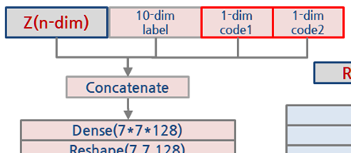

**Discriminator — 출력: disc(real/fake), label(auxiliary) + code1, code2**

판별기는 ACGAN 판별기에 출력 두 개를 더한 것이다. 공통 convolution 뒤에서 `discLinear` 가 real/fake 를 내고, `firstLinear`(6272 → 128)를 거친 128차원 feature 에서 `acLinear` 가 label 을, `code1Linear` 와 `code2Linear` 가 각각 `Linear(128,1)` → `Sigmoid` 로 code1, code2 를 복원한다. `forward` 는 네 값을 반환하며, **4개의 출력이 모두 loss 계산에 사용된다.** code 출력에 `Sigmoid` 를 붙인 것은 이 값이 `mi_loss` 의 `q_of_c_given_x` 로 들어가 확률처럼 다루어지기 때문이다.

```python
# InfoDiscriminator model
class InfoDiscriminator(nn.Module):
    def __init__(self, label_dim):
        super(InfoDiscriminator, self).__init__()
        self.discriminator = nn.Sequential(
            nn.Conv2d(1, 64, 5, 2, padding=2),  #(64,14,14)
            nn.LeakyReLU(0.2), #nn.Dropout(0.25),
            nn.Conv2d(64, 128, 5, 2, padding=2),#(128,7,7)
            nn.LeakyReLU(0.2), #nn.Dropout(0.25),
            nn.Flatten() )
        self.discLinear = nn.Sequential(
            nn.Linear(128*7*7, 1),              #(?,1)
            nn.Sigmoid() )                      #(real/fack)
        self.firstLinear = nn.Linear(128*7*7, 128)
        self.acLinear = nn.Linear(128, label_dim)#(labels)
        self.code1Linear = nn.Sequential(
            nn.Linear(128, 1),
            nn.Sigmoid() )                      #(code1)
        self.code2Linear = nn.Sequential(
            nn.Linear(128, 1),
            nn.Sigmoid() )                      #(code2)
    def forward(self, x):
        out = self.discriminator(x)
        disc_out = self.discLinear(out)         #(real/fack)
        out2 = self.firstLinear(out)            #(?,128)
        label_out = self.acLinear(out2)         #(labels)
        code1 = self.code1Linear(out2)          #(code1)
        code2 = self.code2Linear(out2)          #(code2)
        return disc_out, label_out, code1, code2
info_discriminator = InfoDiscriminator(latent_code_dim).to(device)
summary(info_discriminator, input_size=[(BATCH_SIZE, 1, 28, 28)])
```


**학습 조건 설정**

loss 는 세 가지다. 진위에 `nn.BCELoss`, label 에 `nn.CrossEntropyLoss`, 잠재코드에 앞에서 정의한 `mi_loss`. 학습 중 판별기의 진위 정확도와 class 정확도를 함께 보기 위해 torchmetrics 의 `Accuracy` 를 두 개 만든다. optimizer 는 RMSprop 을 쓰되 생성기의 학습률과 weight decay 를 판별기의 절반으로 둔다.

```python
import torchmetrics as FM

lr = 2e-4
decay = 6e-8
bce_loss = nn.BCELoss()
cce_loss = nn.CrossEntropyLoss()
m_acc = FM.Accuracy(task="multiclass", num_classes=10).to(device)
b_acc = FM.Accuracy(task="binary").to(device)

mi_loss = mi_loss
info_generator = info_generator.to(device)
info_discriminator = info_discriminator.to(device)
optimizer_generator = torch.optim.RMSprop(info_generator.parameters(), lr=lr*0.5,weight_decay=decay*0.5)
optimizer_discriminator = torch.optim.RMSprop(info_discriminator.parameters(), lr=lr,weight_decay=decay)
```

**Training**

학습 loop 는 ACGAN 에 잠재코드 처리가 더해진 형태다. batch 마다 fake label 과 함께 `fake_code1`, `fake_code2` 를 정규분포(표준편차 0.5)에서 뽑아 생성기에 넣고, real 이미지에 대해서도 같은 분포에서 `real_code1`, `real_code2` 를 뽑아 둔다.

판별기 단계에서는 real batch 에 대해 진위 loss 와 label loss(`loss_real_disc`)를, fake batch 에 대해 진위 loss·label loss(`loss_fake_disc`)와 두 code 의 `mi_loss` 평균(`loss_fake_mi`)을 계산한다. real 이미지에는 정답 code 가 없으므로 — 무작위로 뽑은 값일 뿐이므로 — real data 의 MI loss 는 계산만 하고 학습에는 관여시키지 않는다. 생성기 단계에서는 새로 만든 fake 이미지에 대해 판별기가 real 이라 답하고 label 을 맞히도록 하는 `loss_gen_ce` 에, 넣어 준 code 를 판별기가 복원하도록 하는 `loss_gen_mi` 를 `lambda_mi` 배 하여 더한다. 이 항이 바로 $V(D,G)$ 에서 상호정보량을 뺀 부분이다.

```python
EPOCHS = 100
for epoch in range(EPOCHS):
    for real_imgs, real_labels in train_dataloader:
        real_imgs = real_imgs.to(device)
        real_labels = real_labels.to(device)
        yb_real = torch.Tensor(BATCH_SIZE,1).fill_(1.0).to(device) # real_label
        yb_fake = torch.Tensor(BATCH_SIZE,1).fill_(0.0).to(device) # fake_label
        real_code1= torch.Tensor(np.random.normal(scale=0.5,size=[BATCH_SIZE, 1])).to(device)
        real_code2= torch.Tensor(np.random.normal(scale=0.5,size=[BATCH_SIZE, 1])).to(device)

        # Generate fake image, label, codes
        noise = torch.Tensor(np.random.uniform(-1.0,1.0,size=[BATCH_SIZE, noise_dim])).to(device)
        fake_label_idx = torch.randint(0, 10, (BATCH_SIZE,), device=device)
        fakelabel = torch.nn.functional.one_hot(fake_label_idx, num_classes=10).float()
        fake_code1= torch.Tensor(np.random.normal(scale=0.5,size=[BATCH_SIZE, 1])).to(device)
        fake_code2= torch.Tensor(np.random.normal(scale=0.5,size=[BATCH_SIZE, 1])).to(device)
        fake_img = info_generator(noise, fakelabel, fake_code1, fake_code2)

        # Discriminator training
        info_discriminator.zero_grad()
        dis_out, label_out, code1_out, code2_out = info_discriminator(real_imgs)
        acc_disc_real = b_acc(dis_out, yb_real)
        acc_real = m_acc(torch.argmax(label_out,axis=1), torch.argmax(real_labels,axis=1))
        loss_real_disc = bce_loss(dis_out, yb_real) + cce_loss(label_out, real_labels)
        loss_real_mi = (mi_loss(code1_out, real_code1)+ mi_loss(code2_out, real_code2))/2
        loss_real = loss_real_disc # + loss_real_mi # real data의 MI loss는 학습에 관여하지 않음

        dis_out, label_out, code1_out, code2_out = info_discriminator(fake_img.detach())
        acc_disc_fake = b_acc(dis_out, yb_fake)
        acc_fake = m_acc(torch.argmax(label_out,axis=1), torch.argmax(fakelabel,axis=1))
        loss_fake_disc = bce_loss(dis_out, yb_fake) + cce_loss(label_out, fakelabel)
        loss_fake_mi = (mi_loss(code1_out, fake_code1)+ mi_loss(code2_out, fake_code2))/2
        loss_fake = loss_fake_disc + loss_fake_mi
        loss_dis = (loss_real + loss_fake)/2
        loss_dis.backward()
        optimizer_discriminator.step()

        # Generator training
        info_generator.zero_grad()
        # Generate fake image, label, codes
        noise = torch.Tensor(np.random.uniform(-1.0,1.0,size=[BATCH_SIZE, noise_dim])).to(device)
        fake_label_idx = torch.randint(0, 10, (BATCH_SIZE,), device=device)
        fakelabel = torch.nn.functional.one_hot(fake_label_idx, num_classes=10).float()
        fake_code1= torch.Tensor(np.random.normal(scale=0.5,size=[BATCH_SIZE, 1])).to(device)
        fake_code2= torch.Tensor(np.random.normal(scale=0.5,size=[BATCH_SIZE, 1])).to(device)
        fake_img = info_generator(noise, fakelabel, fake_code1, fake_code2)
        dis_out, label_out, code1_out, code2_out = info_discriminator(fake_img)
        loss_gen_ce = bce_loss(dis_out, yb_real) + cce_loss(label_out, fakelabel)
        loss_gen_mi = (mi_loss(code1_out, fake_code1)+ mi_loss(code2_out, fake_code2))/2
        lambda_mi = 1.0
        loss_gen = loss_gen_ce + lambda_mi * loss_gen_mi
        loss_gen.backward()
        optimizer_generator.step()

    if (epoch+1) % 10 == 0:
        generate_and_save_images(info_generator, epoch)
    else :
        print(f"Epoch: {epoch} Loss D:{loss_dis:.3f}, Loss G:{loss_gen:.3f}, RealAcc:{acc_real:.3f}, FakeAcc:{acc_fake:.3f}")
```

`lambda_mi` 는 상호정보량 term 의 가중치다. 이 값을 키우면 생성기가 code 를 이미지에 더 강하게 반영하도록 압박받고, 0 으로 두면 ACGAN 으로 돌아간다. 학습이 끝나면 `torch.save(info_generator, '/content/models/PT/infoGAN_generator.pt')` 로 생성기를 저장해 두고 이어지는 확인 코드에서 불러 쓴다.

**Latent code 가 특징을 제어함을 확인**

생성기 입력으로 제어된 latent code1, code2 를 넣으면서 생성되는 이미지를 관찰한다. 행 `i` 가 label(0\~9)이고, 한 행 안의 20개 열은 `torch.linspace(code1_l, code1_h, c)` 로 code1 을 최소값에서 최대값까지 등간격으로 바꾼 것이다. 이때 code2 는 `code2_l = code2_h = 0` 으로 고정하여 code1 의 효과만 본다.

```python
r, c = 10, 20
code1_l = -1.5 #code1_min
code1_h = 1.5  #code1_max
code2_l = -0   #code2_min
code2_h = 0    #code2_max

fig = plt.figure(figsize=(10,5))
plt.subplots_adjust(top=0.99, bottom=0.01, left=0.01,right=0.99)
for i in range(r):
    noise_input = torch.rand([c, noise_dim]).to(device) # (20,90)
    # class label (20,10)
    noise_label = torch.FloatTensor(np.eye(10)[np.full(fill_value=i, shape=(c,))]).to(device)
    noise_code1 = torch.linspace(code1_l, code1_h, c).view(c, 1).to(device)# code1 (20, 1)
    noise_code2 = torch.linspace(code2_l, code2_h, c).view(c, 1).to(device)# code2 (20, 1)
    # 20개 이미지 추론           ([(20,90),(20,10),(20,1),(20,1)])
    gen_imgs = info_generator(noise_input, noise_label, noise_code1, noise_code2)
    gen_imgs = 0.5 * gen_imgs + 0.5  # (0~1)<-(-1~1) scaling
    for j in range(c): # 20개 이미지 출력
        ax = fig.add_subplot(r, c, i * c + j + 1)
        ax.imshow(gen_imgs.cpu().detach().numpy()[j,0,:,:], cmap=plt.cm.bone)
        ax.xaxis.set_ticks([])
        ax.yaxis.set_ticks([])
plt.tight_layout()
plt.show()
```

code2 의 효과를 보려면 반대로 code1 을 0 으로 고정하고 code2 를 최소값에서 최대값까지 훑는다. 값의 범위(`code1_l`, `code1_h`, `code2_l`, `code2_h`)를 바꾸면 훑는 폭이 달라지므로, 학습 때 code 를 뽑은 분포(표준편차 0.5 의 정규분포)를 크게 벗어나지 않는 범위에서 조절한다.

```python
r, c = 10, 20
code1_l = -0    #code1_min
code1_h = 0     #code1_max
code2_l = -1.5  #code2_min
code2_h = 1.5   #code2_max
# 이하 code1 확인 코드와 동일
```

**Latent code 의 특징 확인**

두 실험의 결과가 아래 두 그림이다. code1 을 최소값에서 최대값으로 바꾸면(code1_min → code1_max, code2 는 0 고정) 같은 label 의 숫자가 왼쪽으로 기울어진 상태에서 점점 오른쪽으로 기울어진다 — **code1 은 기울기를 제어한다.** code2 를 바꾸면(code1 은 0 고정) 같은 숫자의 획이 굵은 상태에서 점점 가늘어진다 — **code2 는 두께를 제어한다.** 학습 때 code1 이 기울기를, code2 가 두께를 맡으라고 지정한 적은 없다. 상호정보량 term 이 "code 를 이미지에서 다시 읽어낼 수 있게 하라" 고 요구했을 뿐인데, 생성기가 스스로 해석 가능한 두 특징을 두 code 에 배정한 것이다.

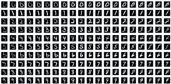

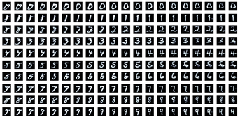

---

## 6.5.11 그 밖의 GAN 모델
<!-- 슬라이드 632 -->

이 장에서 다룬 GAN·DCGAN·CGAN·ACGAN·infoGAN 을 비롯한 여러 생성 모델의 구현 모음이 https://github.com/hwalsuklee/tensorflow-generative-model-collections 에 정리되어 있다. 그 밖에도 자주 언급되는 GAN 모델을 세 가지만 소개한다.

**CycleGAN / DiscoGAN** — 짝지어진 데이터 없이 두 domain 사이의 변환을 배운다. 아래 그림에서 domain A 의 real 이미지(얼룩말)를 $G_{AB}$ 가 domain B 의 fake 이미지(말)로 바꾸고, $G_{BA}$ 가 그것을 다시 domain A 로 되돌려 reconstructed image 를 만든다. 원본과 재구성 이미지 사이의 L2 loss 로 형태가 유지되도록 하고, domain B 의 판별기 $D_B$ 가 변환된 말 이미지의 진위를 domain B 의 real 이미지와 비교하여 판정한다.

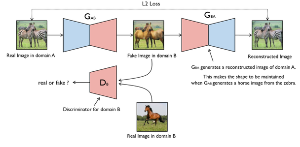

**Pix2Pix** — 조건 이미지를 다른 이미지로 바꾸는 image to image translation 이다. 아래 그림은 건물 정면의 영역 분할 그림(Condition)을 입력으로 받아 실제 건물 사진처럼 생성한 결과(Generated)를 원본 사진(Original)과 비교한 것이다.

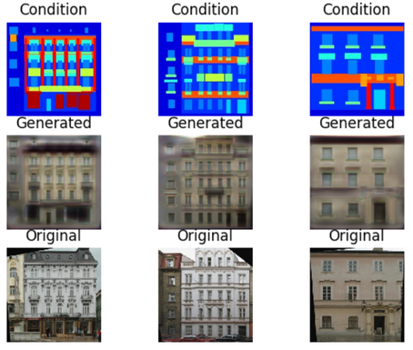

**SRGAN** — super resolution GAN 으로, 저해상도 이미지에서 고해상도 이미지를 생성한다. 아래 그림은 저해상도 입력, SRGAN 이 생성한 이미지(Generated), 원본 고해상도 이미지(Original)를 나란히 놓은 것이다.

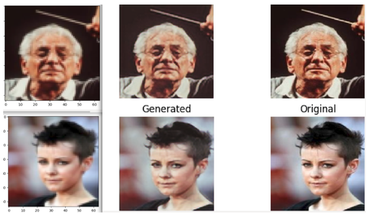

최근 연구 자료는 https://paperswithcode.com/ 에서 찾을 수 있다.

---

## 6.5.12 정리
<!-- 슬라이드 606~632 -->

이 절은 DCGAN 의 "무엇이 나올지 제어할 수 없다" 는 한계를 세 단계로 풀었다.

- **CGAN** — label 의 one-hot code 를 생성기와 판별기 양쪽 입력에 concatenate 한다. 판별기에서는 label 을 이미지와 같은 (28,28) 크기로 늘려 채널로 붙인다. loss 는 GAN loss 의 각 항이 조건부 확률 $D(x|y)$, $G(z|y')$ 로 바뀐 것이다.
- **ACGAN** — 생성기는 CGAN 과 같고, 판별기는 label 을 입력받는 대신 **출력으로 맞힌다**. 진위 판정(binary cross-entropy)에 label 분류(categorical cross-entropy)라는 보조 작업을 더하면 주 작업인 이미지 생성이 더 빠르고 안정적으로 학습된다.
- **InfoGAN** — 잠재공간을 얽힌 코드 $z$ 와 풀린 코드 $c$ 로 나누고, 생성기 입력에 $c$ 를, 판별기 출력에 $c$ 의 복원값을 추가한다. loss 에 상호정보량 $I(c; G(z,c))$ 를 빼는 term 을 두어 생성 이미지가 $c$ 의 의미를 담도록 유도한다. $P(c|x)$ 를 알 수 없으므로 변분 추론으로 하한 $L_I(G,Q)$ 를 잡으면, 계산해야 할 것은 $c$ 와 판별기 출력 $Q(c|x)$ 사이의 cross entropy 하나로 줄어든다. 학습 결과 code1 은 기울기, code2 는 두께를 제어했다.

세 모델의 차이는 아래 표로 정리된다.

| 모델 | 생성기 입력 | 판별기 입력 | 판별기 출력 | loss |
|---|---|---|---|---|
| CGAN | $z$ + label | 이미지 + label(28x28 로 변형) | real/fake | BCE |
| ACGAN | $z$ + label | 이미지 | real/fake + label | BCE + CCE |
| InfoGAN | $z$ + label + code1 + code2 | 이미지 | real/fake + label + code1' + code2' | BCE + CCE + mi_loss |

이 절의 세 실습은 같은 골격(Dataset 준비 → Generator → Discriminator → loss·optimizer → training loop → 결과 확인)을 반복하면서 입력과 출력, loss 항만 하나씩 늘려 간다. 각 단계에서 무엇이 추가되었는지를 코드에서 짚을 수 있으면 이 절의 목표는 달성된 것이다.
